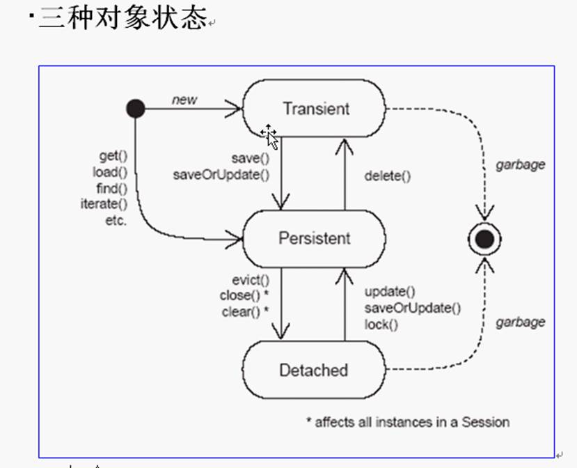

# 1 课程内容

1   HelloWorld

a) Xml

b) annotation

2   Hibernate原理模拟 - 什么是O/R Mapping以及为什么要有O/R Mapping

3   常见的0/R框架(了解)

4   hibernate基础配置（重点）

5   ID生成策略（重点 **AUTO**) 

6   Hibernate核心开发接口介绍（重点）

7   对象的三种状态（了解）

8   **关系映射（重点）**

9   Hibernate査询（HQL) 

10  在Struts基础上继续完善BBS200

11  性能优化（重点）

12  补充话题

# 2 风格

1   先脉络，后细节

2   先操作，后原理

3   **重****Annotation****,****轻xml****配****置文件**

**a)**  **JPA**

b)  hibernate – extension

# 3 资源

1   http://www. hibernate.org

2   hibernate zh_CN文档

3   hibernate annotation references

# 4 环境准备

1   下载hibernate-distribution-3.3.2.GA-dist

2   下载hibernate-**annotations**-3[1].4.0.GA

3   注意阅读hibernate compatibility matrix(hibernate 网站download)

4   下载slf4jl.5.8

# 5 Hibernate HelloWorld

1   建立新java 项目,名为hibernate_0100_HelloWorld

2   **学习建User-library-hibernate,并加入相应的jar包**

a)  项目右键-buildpath-configure build path-add library—

b)  选择User-library,在其中新建 libraray,命名为 hibernate

c)  在该library中加入hibernate所需jar包

​     i.hibernate core

​     ii./required

​    iii.slf-nop jar

3   引入mysql的JDBC驱动包

4   在mysql中建立对应的数据库以及表

a)  create database hibernate；

b)  use hibernate；

c)  create table Student (id int primary key, namevarchar(20), age int)；

5   建立hibernate 配置文件**hibernate.cfg.xml**

**a)**  **从参考文档中copy**

b)  修改对应的数据库连接

c)  注释掉暂时用不上的内容

6   建立Student 类

7   建立Student 映射文件 Student.hbm.xml

a)  参考文档

8   将映射文件加入到hibernate.cfg.xml中

a)  参考文档

9   写测试类Main,在Main中对Student对象进行直接的存储测试 

a)  参考文挡

10  FAQ：

a)  要调用 **new Configuration().configure().bui****ld****SessionFactor****y()**,而不是

要省略 configure，否则会出 hibernate dialect must be set 的异常

11  Note:

a)  请务必建立自己动手査文挡的能力

b)  重要的是:

​     i.要建立自己动手查一手文档的信心

​     ii.还有建立自己动手**查一手文档的习惯**！

​    iii.主动学习，砍弃被动接受灌输的习惯！

12  建立能力

a)  错误读完整

b)  读—昔误的关键行

c)  排除法

d)  比较法

e)  google

# 6 Annotation版HelloWorld

1   创建teacher 表，create table teacher (id int primary key, name varhcar(20), title varchar(lO));

2   创建Teacher 类

3   在hibernate lib 中加入annotation的jar包

a)  hibernate annotaion jar

b)  ejb3 persistence jar

c)  hibernate common-annotations.jar

d)  注意文裆中没有提到hibernate-common-annotations.jar 文件

4   参考Annotaion文档建立对应的注解

5   在hibernate.cfg.xml中建立映射<mapping class:.../〉

6   参考文裆进行测试（注意文裆中缺少configure()的小bug)

7   FAQ: **@不给提示**

a)  配置eclipse属性信息content assist-activation--加上@


# 7 What is and Why 0/R Mapping

1   JDBC操作数据库很繁琐

2   Sql语句编写并**不是面向对象的**

3   可以

4   0/R Mapping 简化编程在对象和关系表之间建立关联来简化编程

5   0/R Mapping**跨越数据库平台**

6   **Hibernate_0200_****O****R_Mapping_Simulation****(****模拟hibernate的框架)**

# 8 0/R Mapping Frameworks

1   hibernate

2   toplink

3   jdo

4   ibatis

5   **JPA**

**a)**  **意愿统一天下**

# 9 Hibernate基础配置

1   **对应项目：****Hibernate_0300_BasicConfiguration****()**

2  介绍MSQL的图形化客户端

3  hibernate.cfg.xml: hbm2ddl.auto：create、update…….

a) **先建表**还是**先建实体类**—先建表

4  搭建日志环境并配置显示DDL语句

a)    slf4j与log4j的关系：slf4j像是一个大管家，可以管理许多的日志框架，log4j是其中之一

b)    加入slf4j-log4j.jar,加入 log4j 的 jar 包,去掉 slf4-nop.jar

c)    从hibernate/project/etc 目录 copy log4j.properties

d)    査询hibernate文裆，日志部分，调整日志的输出策略

5  搭建jUnit环境

a) 需要注意**jUnit****的****Bug**

**解决方法：****1.****加入****try-catch   2.****写****main****方法**

6  hibernate.cfg.xml：show_sql  是否输出SQL语句

7  hibernate.cfg.xml：format_sql 格式化SQL语句，美化SQL语句

  <!-- 格式化显示输出sql -->

  <property name="format_sql">true</property>

8  表名和类名不同,对表名进行配置

a) Annotation: @Table

b)xml:自己査询

9  字段名和属性相同

a)  不用写@column 与默认的@Basic效果一样

b)  Xml中不用写 column

10 字段名和属性名不同

a)  Annotation: @Column

b)  xml:自己査询

11 不需要psersistence的字段(不用列)

a)  Annotation：@**Transient**       定义不写入数据库，属性透明

b)  xml不写

12 映射日期与时间类型，指定时间精度

a)  Annotation：@Temporal(参数) 参数有3种 只显示时间,只显示日期,时间日期都显示

​    //@Temporal(TemporalType.DATE) 只显示日期

​    //@Temporal(TemporalType.TIME) 只显示时间

 //@Temporal(TemporalType.TIMESTAMP) 显示日期与时间

b)  xml:指定 type

​      <class name="Teacher" table="Teacher" >

​         <id name="id" column="id"></id>

​         <property name="name" type="time" />

​     </class>

13 映射枚举类型( 比较少用)

a)  @Enumerated

​    @Enumerated(EnumType.ORDINAL) 枚举类型按位置数,如:0,1,2 ...存储

​    @Enumerated(EnumType.*STRING*) 枚举类型按设定值存储

b)  xml:麻烦

14 字段映射的位置（field或者get方法）

a) best practice：保持 field(字段变量定义) 和 get set 方法的一致

b)专业点放在：**get****方法上**

15 @Lob

16 课外：CLOBBLOB类型的数据存取

17 课外：Hibernate自定义数据类型

18 hibernate 类型

# 10 ID生成策略

1、对应项目：hibernate_0400_ID

2、注意：

a)  我们观察hibernate生成表的结构并不是为了将来就用它生成，（可能还有自己的扩展，比如index等）而是为了明白我们应该建立什么样的表和实体类映射

3、xml生成id

a)  generator

 ```xml
<id name="id" >
	<generator class="native"></generator>
</id>
 ```

b)  常用四个：**native**、identity(不能用于oracle)、**sequence**、uuid（使用string保存）

4  注解方式：@GeneratedValue

a)  自定义ID

b)  AUTO(直接写 @GeneratedValue 相当如**native**) (@GeneratedValue(**strategy**=GenerationType.AUTO))

​     i.默认：对 MySQL,使用auto_increment

​     ii.对 Oracle使用hibernate_sequence(名称固定）

c)  IDENTITY(@GeneratedValue(strategy=GenerationType.IDENTITY))

d)  SEQUENCE(@GeneratedValue(strategy=GenerationType.SEQUENCE))

​     i.@SequenceGenerator(可自定义在数据库生成指定的sequence名)

​      @Id

//在@GeneratedValue中增加 generator="teacherSEQ"

@GeneratedValue(strategy=GenerationType.SEQUENCE,generator="teacherSEQ")

//"teacherSEQ"为**@SequenceGenerator**的标识名

//"teacherSEQ_DB"为指定到数据库生成的Sequence名

@SequenceGenerator(name="teacherSEQ", sequenceName="teacherSEQ_DB") 

public int getId() {

​            return id;

}

e)  TABLE (可以忘记)

 i.   @TableGenerator

@TableGenerator(

name="teacherID",             //被调用的TABLE名字

​      table="teacherID_DB",          //数据库建立的表名

​      pkColumnName="key_value",

​      pkColumnValue="pk_value",

​      valueColumnName="teacher",        //pkColumnValue对应类名

​      allocationSize=1               //pkColumnValue对应类名

)

 

@GeneratedValue(strategy=GenerationType.TABLE,generator=" teacherID ")

 

注：如果使用注解方式的uuid 如下：

 @Id

@GeneratedValue(generator="teacherUUID")

@GenericGenerator(name="teacherUUID", strategy="uuid")

5  FAQ;

a) 用Junit测试时Hibernate Session Factory初始化异常不提示.疑似一个bug

b) 用main来做测试

6  联合主键

a) Xml方式: composite-id

​     i.  将联合主键的属性提取出来,重新编写一个pojo类（原pojo类中的id，name要删除 并新加入属性“StudentPK”）

​    public class StudentPK implements Serializable {

​         private String id;

​         private String name;

​         … …

​    ii.  新建pojo类必须实现 java.io.Serializable 序列化接口

​    iii.  新pojo类要重写equals和hashCode方法

@Override

public boolean equals(Object o) {

​     if(o instanceof StudentPk) {

​         StudentPk pk = (StudentPk)o;

​         if(this.id == pk.getId() && this.name.equals(pk.getName())) {

​          return true;

​         }

​     }

​     return false;

}

 

@Override

public int hashCode() {

​     return this.name.hashCode();

}

​    iv.  联合主键生成策略XML配置方法

​    <hibernate-mapping>

​         <class name="com.bjsxt.pojo.Student" >

​             <composite-id name="studentPK" class="com.bjsxt.pojo.StudentPK">

​                 <key-property name="id"></key-property>

​                 <key-property name="name"></key-property>

​             </composite-id>

​             <property name="age" />

​             <property name="sex" />

​             <property name="good" type="yes_no"></property>

​         </class>

</hibernate-mapping>

 

b) Annotation

​     i.  前三步与Xml方式前三步一样 都要建立新pojo类 都要实现Serializable接口 重写equals和hashCode方法.

​    ii.  方法1在新类前写@Embeddable，在原pojo类的新属性“TercherPK”的get方法前写@ld，如下

   @ Embeddable

public class TeacherPK implements Serializable {

​         private String id;

​         private String name;

​         … …

 

​       @Entity

public class Teacher {

private TeacherPK teacherPK ;

@Id

public TeacherPK getTeacherPK() {

​             return teacherPK;

}

… … 

​    iii.  方法2：@EmbeddedlD(*) 新pojo类无需加注解，只需在原pojo类新属性“TercherPK”的get方法前写@EmbeddedlD即可

​        iv.   方法3：@Id  @IdClass(*) 新pojo类无需加注解，原pojo类的id，name属性保留不变，也无需新增“TercherPK”属性。 只在id，name的get方法前都加@Id，并在原pojo类前加“@IdClass(TeacherPK).class)”，如下

@Entity

@IdClass(TeacherPK.class)

public class Teacher {

private String id;

private String name;

@Id

public String getId() {

​         return id;

}

@Id

public String getName() {

​         return name;

}

# 核心幵发接口介绍

1   hibernate_0500_CoreAPI

2   Hibernate API文档需要单独下载

3   **Configuration**

a)  AnnotationConfiguration

b)  进行**配置信息**的管理

c)  用来产生SessionFactory

d)  可以在configure方法中指定hibernate**配置文件**

e)  只气关注一个方法即：buildSessionFactory

4   SessoinFactor

a)  用来**产生和管理****Session**

b)  通常情况下每个应用只需要一个SessionFactory

c)  除非要访间多个数据库的情况

d)  关注两个方法即：openSession **getCurrentsession**

​     i.**opensession**每次都是新的，**需要****close**

​     ii.getCurrentsession从上下文找，如果有，用旧的，如果没有，建新的

\1. 用途，**界定事务边界**

\2. 事务提交**自动close**

\3. **上下文配置**可参见xml文件中

​    <property name="current_session_context_classs">thread</property>

\4. current_session_context_class (jta、thread常用 managed、custom.Class少用) 

​     a) thread 使用connection 但数据库连接管理事务

​     b）jta （全称java transaction api）-java**分布式事务管理**（多数据库访问）

​      jta由中间件提供（jboss WebLogic等，tomcat本身不支持）

5   Session

a)  **管理一个数据库**的任务单元（简单说就是增 删 改 查）

b)  方法(CRUD)

​     i.Save()   session.**save**(对象);

​     ii.Delete   session.**delete**(对象);

​    iii.Load    Student s1=(Student)session.**load**(Student.class, 1);**代理对象**。

​     iv.Get    Student s1=(Student)session.**get**(Student.class, 1);

​     v.get与load的区别（面试重点，原理）

\1. 不存在对应记录时表现不一样

\2. load返回的是**代理对象**，等到真正用到对象的内容时才发出sql语句

\3. get直接从数据库加载，不会延迟

​     vi.updates  session.update(对象);

\1. 用来更新**detached**对象，更新完成后转为persistent状态

\2. 更新transient对象会报错

\3. 更新自己设定id的transient对象可以（数据库有对应记录）

\4. persistent状态的对象只要设定（如:t.setName…）不同字段就会发生更新

\5. 更新**部分**更改的字段

a)  xml 设定 property 标签的 update 属性，annotation 设定@Column 的 updatable

  属性，不过这种方式很少用，因为不灵活（忘记）

b)  使用xml中的**dynamic-update**，JPA1.0 Annotation 没有对应的属性，hibernate 扩

  展？ 

i. 同一个session可以，跨session不行，不过可以用**merge**()(不重要）

c)  **使用** **HQL(EjBQL)****(建议）**

​    vii.saveOrUpdate()   session.**saveOrUpdate**(对象);

   viii.clear方法     session.**clear**();

1.无论是load还是get,都会首先査找缓存（一级缓存)，如果没有，才会去数据库査找，调用

clear()方法可以强制清除session缓存

​     ix.flush()方法  session.flush();

\1. 当session的事务提交后,会强制将内存(session缓存)与数据库同步.默认情况下是session的事务提交(commit)时才同步!

\2. session的FlushMode设置,可以设定在什么时候同步缓存与数据库(很少用)

 例如: session.setFlushMode(FlushMode.AUTO)

​     x.find方法已经过时！

6    SchemaExport (自动建表)

  new SchemaExport(new AnnotationConfiguration().configure()).create(false, true);

7    Query 接口

a)  参考Hibernate査询(HQLEJBQL)的内容

8    Note：

a)  Hibernate中涉及很多非常非常细节的区别,但在实际应用中用得极少,请大家先享受写项目的乐

  趣，再来探讨这些细节问题

​     i.比如save和persist的区别

​          ii. merge、evict 等方法

​         iii. 比如 refresh、lock 等

b)  建议的学习方法，动手实验

c)  细节问题参考补充视频

# 三种对象状态



1    上一个 project

2    三种状态的**区分**关键在于

a)  有没有ID

b)  ID在数据库中有没有

c)  在内存中有没有（**session**缓存）

3    三种状态：

a)  transient：内存中一个对象，**没ID,**缓存中也没有

b)  persistent：内存中有，缓存中有，数据库有（ID) 

c)  detached：内存有，缓存没有，数据库有，ID

4    对这三种状态需要关注的问题是在该状态下如果进行数据库的操作会发生什么结果，比 如改变属性的

​    值会不会发出update语句？

a)  强烈建议动手实验

b)  进行正常人的思考

c)  绝对不要去背这些东西！背过也并不代表你有多牛！

# 关系映射(重要)

# 对象之间的关系

1    这里的关系映射指的是对象之间的关系，并不是指数据库的关系，本章解决的问题是当对象之间处于

下列关系之一时，数据库表该如何映射，编程上该如何对待(红色为重点中的重点)

2    简化问题：

a)  怎么写  Annotation

b)  增删改査CRUD怎么写

3    —对一

a)  **单向（主键、外键）**

b)  双向（主键、外键）

c)  中间表

4    —对多

a)  一张主表，多张子表

5    多对一

6    多对多

7    组件映射

a)  @Embeddable

b)  @ Embedded


# 一对一关联

1    一对一单向外键关联

a)  项目名称：hibernate_0600_one2one_uni_fk

b)  Annotation: 在被约束表字段的**get方法**上加@0ne20ne @JoinColumn

   @OneToOne

​     @JoinColumn(name="wifeid") //指定生成的数据库字段名

​     public Wife getWife() {

​         return wife;

​     }

c)  xml: 在被约束表的xml配置文件中加<many-to-one unique

  <class name="com.bjsxt.pojo.StuIdCard">

​    <id name="id">

​      <generator class="native"></generator>

​    </id>

​    <property name="num"/>

​    <many-to-one name="student" column="studentId" unique="true">

</many-to-one>

</class>

unique="true"是保证生成的字段唯一,这样<many-to-one 也达到了一对一的效果

2     一对一双向外键关联

a)  项目名称：hibernate_0700_one2one_bi_fk^

b)  Annotation: @0ne20ne(mappedBy=”另一个类里定义的属性名”)

​    **规律：凡是双向关联，必设mappedBy**

  在Wife类中 写Husband对象属性 并添加注解@OneToOne(mappedBy="wife") mappedBy作用

是指定这个一对一关联是被Husband类的wife属性(准确说是getWife方法)**做的映射**

@OneToOne(mappedBy="wife")

​      **public** Husband getHusband() {

​         **return** husband;

​    }

​    在 类中写Wife对象属性

​     @OneToOne

​     @JoinColumn(name="wifeid") //指定生成的数据库字段名

​     public Wife getWife() {

​         return wife;

​     }

​    此注释将由Husband表中生成wifeid字段作为fk外键,wife表中不生成额外的Husbandid字段

c)  xml: many-to-one unique <one-to-one property-ref

 在Student类中写StuIdCard属性, StuIdCard类中写Student属性

 StuIdCard.hbm.xml文件中加

 <many-to-one name="student" column="studentId" unique="true"></many-to-one>

 Student.hbm.xml文件中加

<one-to-one name="stuIdCard" property-ref="student"></one-to-one>

其中, property-ref 相当于mappedBy

此方式生成的StuIdCard表中包含studentid字段作为fk外键, Student表中不生成额外的字段

特别说明: 一对一单向外键关联与一对一双向外键关联在数据库的表的格式是一样的,区别在于

java程序中. 双向外键关联可通过Hibernate在两个类间互相调用彼此,而单向外键关联只能单方向调用.

 

3    一对一单向主键关联（不重要，忘记）

a)  项目名称：hibernate_0800_one2one_uni_pk

b)  @primaryKeyJoinColumn

c)  xml: <one-to-one id 使用 foreign class

4    一对一双向主键关联（不重要，忘记）

a)  项目名称：hibernate_0900_one2one_bi_pk

b)  @**primaryKeyJoinColumn**（不常用，了解）

c)  xml: <one-to-one id 使用foreign class和<one-to-one property-ref

5    联合主键

a)  项目名称：hibernate_1000_one2one_uni_fk_composite

b)  @JoinColumns

 Wife类中建立联合主键,建立方式参考 ID生成策略中的联合主键部分

 Husband类中写Wife对象属性,并在其get方法上写@OneToOne即可完成一对一外键映射

 若想要指定生成的外键名 则需使用@JoinColumns注解,如下:

​    @OneToOne

​    @JoinColumns( { @JoinColumn(name = "wifeid", referencedColumnName = "id"),

​             @JoinColumn(name = "wifename", referencedColumnName = "name") })

​    /*@JoinColumns用于在一对一外键关联存在联合主键情况时指定生成的外键字段名称

​    @JoinColumns的参数为@JoinColumn数组 @JoinColumn内除需指定name属性外还需指定 

​    referencedColumnName属性值 作用是可指定生成的字段名所对应的目标表字段名*/

 public Wife getWife() {……}

# 联合组件映射

1    项目：hibernate_1100_component

2    对象关系：一个对象是另外一个对象的一部分

3    数据库表：一张表

4    annotation: @ Embeddable @Embbeded

​    对象模型

Husband(id,name,wife)

Wife(name,age)

 

Annotation:

在Husband的wife属性上建立注解

@Embedded 表明该对象是从别的位置嵌入过来的,是不需要单独映射的表.

这种方式生成的表为husband(id,name,wifename,wifeage),不会生成wife表.

 

@Embedded

Public Wift getWife(){

}

 

@AttributeOverride注解需要写在getWife方法上,可以重新指定生成的Wife类组件生成的字段名,例如:Husband与Wife两个类中都有name字段,这样在生成表的时候会有冲突,此时采用@AttributeOverride注解可以指定Wife类中的name属性对应新的字段名—“wifename”,不过@AttributeOverride注解不常用,因为有更好的解决方法. 1：不要在组件的两个映射类中写同名属性；2：如果真的有重复，那么可以在分类中（此处为Wife类）的重复名称的属性上使用如下内容以指定新的字段名：

@Column(name="wifename")

​    **public** String getName() {

​         **return** name;

 }

 

另外，@ Embeddable注解好像是写在分类（Wife类）的类名前的，不过好像不写也行

@Embeddable

**public** **class** Wife {… …}

5    xml: 使用<component,例如:

   

<class name="Husband" >

​    <id name="id">

​        <generator class="native"/>       

</id>

​    <property name="name"></property>

​    <component name="wife">

​        <property name="wifeName"/>            

<property name="wifeAge"/>

​    </component>

</class>

# 多对一与一对多

1    多对一单向关联

a)  项目名称：hibernate_1200_many2one_uni

​    实体模型(User多对一Group)

User(id,name,group)多

 Group(id,name)一

b)  **数据库表设计：在多方加****外****键**

错误做法：在一方加**冗余**

| perosnid | person name | dreamid |
| -------- | ----------- | ------- |
| 1        | zhangsan    | 1       |
| 1        | zhangsan    | 2       |

 

| dreamid | dreamdescr |
| ------- | ---------- |
| 1       | earn money |
| 2       | eat a lot  |

设计数据库的三犯事？

**必须有主键，列不可分、联合主键不能存在部分依赖、不能存在传递依赖**

c)  annotaion: @Many

2One

只需要在**多的一端**User属性group进行注解配置

@ManyToOne //多对一关联 User是多的一方 Group是一的一方

@JoinColumn(name="groupid") //指定User表中生成与Group对应的字段名

  **public** Group getGroup() {

​    **return** group;

 }

d)  xml： <many-to-one

​    <many-to-one name="group" column="groupId" />

标签会在”多”的一端添加外键,相当于在数据库中添加外键

生成的表为user(id,name,groupid),t_group(id,groupname)

属性cascade

<many-to-one name="group" column="groupid" **cascade="all"**/>

取值all,none,save-update,delete,对象间的级联操作,只对增删改起作用.

在存储时User时,设置了**cascade="all"**会自动存储相应的t_group.而不用管user关联的对象(通常情况下会优先存储关联的对象,然后再存储user)

 

2    一对多单向关联


a)  项目名称：hibernate_1300_one2many_uni

​       模型(group一对多user)

​        Group(id,name,users)一

​        User(id,name)多

​        设计时在一的这一端存在着多的集合,生成的数据库表通常是在多的一端生成外键.

Set<User> users = new HashSet<User>();

b)  类：在一的一方存在多方的集合

c)  数据库表同上

d)  Annotation:@One2Many

在一的这一端Group端users属性上进行注解配置

@OneToMany           //一对多关联 Group是一的一方 User是多的一方 

**@JoinColumn(name="groupid")** //指定User表中生成与Group对应的字段名 注意此处与多对一配置方式不同

​    public Set<User> getUsers(){ …….    }

 

Hibernate默认将OneToMany理解为ManyToMany的特殊形式，如果不指定生成的外键列@JoinColumn(name="groupId")，则会默认生成多对多的关系,**产生一张中间表**。

 

e)  xml:<set <one2many

XML配置中配置一的那一端Group

<class name="com.hibernate.Group" table="t_group">

​         <id name="id">

​             <generator class="native"/>

​         </id>

​         <property name="name"/>

​         <set name="users">

​             <key column="groupId"/>指定生成外键字段的名字

​             <one-to-many class="com.pojo.User"/>

​         </set>

</class>

 

3    一对多（多对一）双向关联

​    一对多与多对一的双向关联是同一种情况.

​    关系模型(group一对多user)

​    Group(id,name,users)一

​    User(id,name,group)多

​    Set<User> users=new HashSet<User>()

​    **配置规则****:****一般以多的一端为主****,****先配置多的一端**

​    在多的一端User端配置group

   @ManyToOne

​    @JoinColumn(name="groupid")

​    在一的一端Group端配置时,**在****users****只需要加个****mappedBy="groupid"**

​    @OneToMany(mappedBy="group")

 

​    XML配置

​    Group中

​    <set name="users">

​     <key column="groupId"/>           

​    <one-to-many class="com.hibernate.User"/>

​    </set>

​    在User中

​    <many-to-one name="group" column="groupId"/>

​    **务必确保在多的一端生成的生成的外键和一的一方生成的外键的名字相同****,**都为groupId.

​    如果名字不同则会在多的一端生成多余的外键


# 多对多

1    单向关联：

a)  项目：hibernate_1500_many2many_uni

​       关系模型(Teache多对多Student),从Teacher这一端能关联到students.

​        Teacher(id,name,**students**)多

​        Student(id,name)多

Set<Student> students=new HashSet<Student>()

​       在Teacher那一端配置

b)  例如：老师和学生的关系， 老师需要知道自己教了哪些学生

c)  数据库：生成中间表

d)  Annotation：@Many2Many

 Teacher类中写：

​    **private** Set<Student> students = **new** HashSet<Student>();

​    @ManyToMany                //多对多关联 Teacher是主的一方 Student是附属的一方 

​    @JoinTable(

name="t_s",        //指定中间表表名

​       joinColumns={@JoinColumn(name="teacherid")},//**本类**主键在中间表生成的对应字段名

​          inverseJoinColumns={@JoinColumn(name="studentid")}//**对方类**主键在中间表生成的对应字段名

​       )

​    public Set<Student> getStudents(){……}

e)  XML：<many2many

​    <class name="com.xxx.Teacher">

​         <id name="id">

​             <generator class="native"/>

​         </id>

​         <property name="name"/>

​         <set name="students" table="t_s">table定义中间表的表名

​             <key column="teacher_id"></key>

​             <many-to-many class="com.xxx.Student" column="student_id"/>

​         </set>

</class>

 

2    双向关联：

a)  项目：hibernate_1600_many2many_bi

  多对多双向配置只需要在两端类进行配置就才可以.

​       关系模型(Teache多对多Student)

​       Teacher(id,name,**students**)多

​       Student(id,name,**teachers**)多

Set<Student> students = new HashSet<Student>()

Set<Teacher> teachers = **new** HashSet<Teacher>();

 

b)  老师知道自己教了哪些学生，学生也知道教自己的有哪些老师

c)  数据库：生成中间表

d)  Annotation：

在Teacher这一端的students上配置

@ManyToMany

​    @JoinTable(name="t_s",

​         joinColumns={@JoinColumn(name="teacher_id")},

​         inverseJoinColumns={@JoinColumn(name="student_id")}

​         )


在Student一端的teachers只需要配置

@ManyToMany(**mappedBy="students"**)

注意：mappedBy 与 @JoinTable等一类的配置要分开，不然表字段可能乱

e)  XML：

​    XML配置方式:两端配置一样,注意表名和生成的中间表的字段属性名要一致

Teacher那一端配置

<set name="students" table="t_s">

​        <key column="teacher_id"/>

​        <many-to-many class="com.xxx.Student" column="student_id"/>

</set>

在Student那一端配置

<set name="teachers" table="t_s">

​        <key column="student_id"></key>

​        <many-to-many class="com.xxx.Teacher" column="teacher_id"/>

</set>

 生成的数据库表和上面是一样的

# 关联关系中的CRUD

**Cascade_Fetch**

1    hibernate_1700_one2many_many2one_bi_crud

2    设定**cascade**以设定在持久化时对于关联对象的操作（CUD，R归Fetch管）

3    cascade仅仅是帮我们**省了编程**的麻烦而已，不要把它的作用看的太大

a)  **Cascade****的属性**是数组格式，指明做什么操作的时候关联对象是绑在一起的

b)  refresh = A里面需要读B改过之后的数据

**cascade={CascadeType.ALL}** 

 

CascadeType取值

**ALL   Cascade all operations****所有情况**

MERGE  Cascade merge operation合并(merge=save+update)

**PERSIST  Cascade persist operation****存储** **persist()**

REFRESH  Cascade refresh operation刷新

**REMOVE  Cascade remove operation****删除**

 

4    **规律：****双向关系在程序中要设定双向关联****（添加****get****）**

5    **规律：双向映射的时候设置****mappedBy****，设置在多的一方。**

6    Fetch（查询操作）

a)  **铁律：双向不要两边设置****Eager****(****会有多余的査询语句发出****)**

b)  **对多方设置****fetch****的时候要谨慎**，结合具体应用，一般用Lazy不用eager，特殊情况（多方数量不多的时候可以考虑，提高效率的时候可以考虑）

@OneToMany(**mappedBy="group",**

**cascade={CascadeType.\*ALL\*}, //****控制增删改****(****即****CUD)**

**fetch=FetchType.\*EAGER\* //****控制查询****(****即****R)** EAGER值代表取出关联 LAZY值为不取关联 

​                  //**多的一方****fetch****取值默认为****LAZY** **一的一方默认为****EAGER**

 )

另外：如果User类(即多的一方)中设置fetch=FetchType.LAZY 则在调用多(即Group)的对象值的时候 

类似延迟加载 即需要在commit();之前 session还存在时调用 如：

System.*out*.println(*user.getGroup().getName()*); 

session.getTransaction().commit();

常规设计：

**多对一使用：****EAGER**

**一对多使用：****LAZY**   

7    Update时@ManyToOne()中的cascade参数关系

​    session.beginTransaction();

​    User user = (User)session.load(User.**class**,1);

​    //user对象属性改变 **事务****commit**时自动判断与数据库原有数据不同可自动update

​    //此时的update与@ManyToOne()中的cascade或fetch参数取值无关

​    user.setName("user1");

​    user.getGroup().setName("group1");

​    session.getTransaction().commit();

如果user改变在commit()之后 且想要执行Update方法时 user与group表同时更新则，则User类的cascade={CascadeType.ALL}，并在程序中写如下代码：

​    session.beginTransaction();

​    User user = (User)session.get(User.**class**,1);

​    session.getTransaction().commit();

​    user.setName("user1");

​    user.getGroup().setName("group1");

​    Session session2 = *sessionFactory*.getCurrentSession();

​    session2.beginTransaction();

​    session2.update(user);

​    session2.getTransaction().commit();

​    

8    Delete时@ManyToOne()中的cascade关系

​    [如果User及Group类中均设为@ManyToOne(cascade={CascadeType.All})](mailto:如果User及Group类中均设为@ManyToOne(cascade={CascadeType.All}))，那么在执行如下：

​    session.beginTransaction();

​    User user = (User)session.load(User.**class**,1);

​    session.delete(user);

​    session.getTransaction().commit(); 

​    注意：此处删除的是多对一(即User对Group) 中的“多”的一方(User类)

 

会删除user及user对应的group，再反向对应group的user都会删除，[原因就是设置了@ManyToOne(cascade={CascadeType.All})](mailto:原因就是设置了@ManyToOne(cascade={CascadeType.All}))

 

三种方法可避免全部删除的情况：    

1． 去掉@ManyToOne(cascade={CascadeType.All})设置；

2． 直接写Hql语句执行删除；

3． **将****user****对象的****group****属性设为****null****，相当于打断****User****与****Group****间的关联**，代码如下

​         session.beginTransaction();

​         User user = (User)session.load(User.**class**,1);

​         user.setGroup(null);

​         session.delete(user);

 session.getTransaction().commit();

注意：如果删除的是 多对一中的“一”的一方(Group类)时，如果使用第3种方式(user属性设为null)来打断两个对象间的关联的话，代码与之前不同,如下：

session.beginTransaction();

​    Group group = (Group)session.load(Group.**class**,1);

​    //循环将group中的set集合下的各个user对象设为null

​    //相当于先将数据库中user表中与group表关联的字段(即groupid)设为null

​    for(User user :group.getUsers()){

​         System.out.println(user.getName());

​         user.setGroup(null);

​    }

​    //再将group的set集合设为null,相当于将group表中与user表关联的字段(即userid)设为null

​    //此句的前提是user表中的关联字段(groupid)已经为null,如没有则相当于破坏了一对多关联,会报错

​    group.setUsers(null);

​    session.delete(group);

session.getTransaction().commit();

 

9    O/RMapping 编程模型

a)  映射模型

​          **i.** **jpa annotatio****n(java****提供的****annotation****配置****--****常用，非常有希望统一****)**

​          ii.hibernate annotation **extension**(Hibernate扩展的annotation配置--较少用)

​         **iii.****hibernate xml(Hibernate****的****xml****配置方式****--****常用****)**

​         iv.jpa xml(java提供的xml配置--较少用)

b)  编程接口

​          **i.** **Jpa(****不常用****)****，以后会统一的。**

​          ii.hibernate(现在用)

c)  数据査询语言

​          i. SQL

​          ii.HQL（功能更强大）

​         iii.EJBQL(JPQL)

​         iv.JPQL

10  要想删除或者更新先做load,除了精确知道ID之外

11  **如果想消除关联关系，先设定关系为****null.****再删除对应记录，如果不删记录，该记录变成垃圾数据**

12  练习：多对多的CRUD，中间表省略了

| teacher | Student |
| ------- | ------- |
| t1      | s1      |
| t1      | s2      |
| t2      | s1      |
| t2      | s2      |

# 关系映射总结

1    对象是什么样的关系？设计什么样的表？进行什么样的映射（写annotation）？

2    设置关系，不加cascade只影响读取操作

3    CRUD,按照自然的理解即可（动手测试）

# 集合映射（不太重要）

1    项目名称：hibernate_1800_Collections_Mapping

2    Set

3    List (与Set差不多 多个@OrderBy)，支持排序，set不支持排序。

a) @OrderBy，按照主键排序

4    Map（map中key不能重复）

a) @Mapkey(name=字段名)

# 继承映射（不太重要）

1    三种方式

a)  一张总表SINGLE_TABLE

i. hibernate_1900_lnheritence_Mapping_Single_Table

b)  每个类分别一张表TABLE_PER_CLASS

i. hibernate_2000_lnheritence_Mapping_Table_Per_Class

c)  每个子类一张表jOINED

i. hibernate_2100_lnheritence_Mapping_JOINED

父类上加注解@Inheritance(strategy=InheritanceType.*JOINED*)

@Inheritance(strategy=InheritanceType.*JOINED*)

**public** **class** Person {... ...}

# 作业

1    学生、课程、分数的设计(重要) 

a)  使用联合主键@Embeddedld

i. 实现 Serializable 接口

b)  不使用联合主键(视频中实际例子采用此类方法)

 注：自己的项目与马老的方式不同，但可实现同样的功能（除从学生查课程外），具体见项目hibernate_2300_Stu_Course_Score

2    设计：

a)  实体类（表）

b)  导航（编程方便），可以不设置，通过编写语句的。

c)  确定了编程方式

3    **树状结构的设计****（至关重要）**

a) 在同—个类中使用One2Many和Many20ne

​       关系模型(Tree)

​       Tree(int id,String name,Tree parent,List children)多

​       private List<Tree> children = new ArrayList<Tree>(); 

​       

​       @Id

​      @GeneratedValue

​      public int getId(){ 

​               return id; 

​     }

 

​       @ManyToOne

​      @JoinColumn(name="parent_id")

​      public Tree getParent(){ 

​            return parent; 

​      }

 

​    //fetch=FetchType.EAGER可省略 即为@OneToMany的默认值fetch=FetchType.LAZY

​      //若树形较小 可使用EAGER 一次全部载入内存

//若为LAZY则查询树形时不会一次全部载入内存(适用于较大的树形),会每取一个叶子节点就select

一次

​     @OneToMany(mappedBy="parent",

​      cascade={CascadeType.ALL},

​      fetch=FetchType.EAGER  )

​     public List<Tree> getChildren() {

​         return children;

​       }

 


    


# Hibernate查询

Query Language

## HQL vs EJBQL

1    NativeSQL >HQL.> **EJBQL(JPQL 1.0)** > QBC(Query By Criteria) > QBE(Query By Example)"

2    总结：QL应该和导航关系结合，共同为査询提供服务。

# 性能优化

1    注意session.clear()的运用，尤其在不断分页循环的时候

a)  在一个大集合中进行遍历，遍历msg，取出其中的含有敏感字样的对象

b)  另外一种形式的内存泄露 (面试题：Java有内存泄漏吗？语法级别没有 但是可由java引起,例如:连接池不关闭,或io读取后不关闭)

2    1+N问题 (典型的面试题) (详见hibernate_2800_Hibernate_1+N项目)

a)  @ManyToOne(fetch=FetchType.LAZY) 

​    // fetch=FetchType.LAZY 解决N+1问题 说明如下:

​    // 当多对一(@ManyToOne)已经设定属性" fetch=FetchType.LAZY "时 

​    // 只有当需要时(如:t.getCategory().getName()时)才会去获取关联表中数据 可以解决N+1问题

b)  @BatchSize

​    // @BatchSize 解决N+1问题 说明如下:

​    // 在与查询表(此例中为Topic类)关联的表类(此例中为Category类)头处加@BatchSize(size=5)

​    // 表示每次可查出5条记录 从而减少了select语句的个数

c)  join fetch

​    //join fetch 解决N+1问题 说明如下:

​    //修改hql语句为--" from Topic t left join fetch t.category c "

d)  QBC

​    //QBC(Query By Criteria) 解决N+1问题 说明如下:

​    //使用QBC的 createCriteria(*.class)执行查询 也可避免N+1问题

3    list和iterate不同之处（主要为了面试  详见hibernate_2900_Hibernate_list_iterate）

a)  list取所有

b)  iterate先取 ID,等用到的时候再根据ID来取对象

c)  session中list第二次发出，仍会到数据库査询

d)  iterate 第二次，首先找session 级缓存

4    一级缓存和二级缓存和査询缓存（面试题）(详见hibernate_3000_Hibernate_3KindsOf_Cache)

a)  什么是缓存？就是在内存中开辟空间，把本来应该存到硬盘上的东西，把它放到内存中中。

b)  什么是一级缓存：**session****级别**的缓存

c)  什么是二级缓存：**SessionFactory****级别**的缓存，可以**跨越****session**存在

d)  什么是三级缓存：查询缓存，同样重复的查询，可以从二级缓存中获取。

适合放入二级缓存的？

​     i.  经常被访间

​    ii.  改动不大不会经常改动

​    iii.  数重有限

e)  添加缓存文件（hibernate文档的etc下拷贝）

f)  打开二级缓存

​     i.  hibernate.cfg.xml 设定：

<property

name= "cache.use_second_level_cache">true</property>

<property

name="cache.provider_class">org.hibernate.cache.EhCacheProvider</property>

​    ii.  @Cache注解(由hibernate扩展提供)

@Cache(usage=CacheConcurrencyStrategy.READ_WRITE)

注：使用EhCache二级缓存 需要导入ehcache-1.2.3.jar及commons-logging-1.0.4.jar包

g)  load**默认使用**二级缓存，iterate默认使用二级缓存

h)  list默认往二级缓存加数据，但是查询的时候不使用

i)  如果要**query**用二级缓存，需打开**查询缓存**。

<property name="cache.use_query_cache">true</property>

调用Query的setCachable (true)方法指明使用二级缓存

例如：session.createQuery("from Category").setCacheable(true).list();

j)  缓存算法：（纯为了面试）

​     **i.**  **LRU** **LF****U**  **FIFO**

\1.   Least Recently Used –最近很少被使用

\2.   Least Frequently Used (命中率高低)

\3.   First In First Out 按顺序替换

​    ii.  memoryStoreEvictionPolicy = "LRU" (**ehcache**.xml中配置) 

5    事务并发处理(面试的意义更大)

a)  **事务：****ACID** 

​     i.Atomic Consistency Itegrity Durability

原子性（Atomicity）、一致性（Consistency）、隔离性（Isolation）、持久性（Durability）。

b)  事务并发时可能出现的问题：

第一类**丢失更新**(Lost Update) 

| 时间 | 取款事务A                      | 存款事务B                 |
| ---- | ------------------------------ | ------------------------- |
| T1   | **开始事务**                   |                           |
| T2   |                                | **开始事务**              |
| T3   | 查询账户余额为1000元           |                           |
| T4   |                                | 查询账户余额为1000元      |
| T5   |                                | 汇入100元把余额改为1100元 |
| T6   |                                | **提交事务**              |
| T7   | 取出100元把余额改为900 元      |                           |
| T8   | **撤销事务**                   |                           |
| T9   | **余额恢复为1000元(丢失更新)** |                           |

  

  dirty read**脏读(读到了另一个事务在处理中还未提交的数据)**

| 时间 | 取款事务A                            | 存款事务B                 |
| ---- | ------------------------------------ | ------------------------- |
| T1   | **开始事务**                         |                           |
| T2   |                                      | **开始事务**              |
| T3   |                                      | 查询账户余额为1000元      |
| T4   |                                      | 汇入100元把余额改为1100元 |
| T5   | 查询账户余额为1100元(**读取脏数据**) |                           |
| T6   |                                      | **回滚**                  |
| T7   | 取款1100                             |                           |
| T8   | **提交事务失败**                     |                           |

 

  non-repeatable read 不可重复读

| 时间 | 取款事务A            | 存款事务B                 |
| ---- | -------------------- | ------------------------- |
| T1   | **开始事务**         |                           |
| T2   |                      | **开始事务**              |
| T3   | 查询账户余额为1000元 |                           |
| T5   |                      | 汇入100元把余额改为1100元 |
| T5   |                      | **提交事务**              |
| T6   | 查询帐户余额为1100元 |                           |
| T8   | **提交事务**         |                           |

 

  second lost update problem 第二类丢失更新(不可重复读的特殊情况)

| 时间 | 取款事务A                      | 存款事务B                |
| ---- | ------------------------------ | ------------------------ |
| T1   |                                | **开始事务**             |
| T2   | **开始事务**                   |                          |
| T3   |                                | 查询账户余额为1000元     |
| T4   | 查询账户余额为1000元           |                          |
| T5   |                                | 取出100元把余额改为900元 |
| T6   |                                | **提交事务**             |
| T7   | 汇入100元                      |                          |
| T8   | **提交事务**                   |                          |
| T9   | **把余额改为1100元(丢失更新)** |                          |

 

  phantom read 幻读（插入、删除）

| 时间 | 查询学生事务A  | 插入新学生事务B |
| ---- | -------------- | --------------- |
| T1   | **开始事务**   |                 |
| T2   |                | **开始事务**    |
| T3   | 查询学生为10人 |                 |
| T4   |                | 插入1个学生     |
| T5   | 查询学生为11人 |                 |
| T6   |                | **提交事务**    |
| T7   | **提交事务**   |                 |

c)  数据库的事务隔离机制

​     i.  查看 java.sql.Connection 文档

​    ii.  1：read-uncommitted 2：**read-****committed**  4：repeatable read  8：serializable（数字代表对应值）

为什么取值要使用 1 2 4 8 而不是 1 2 3 4

1=0000 2=0010 4=0100 8=1000(位移计算效率高)

\1.   只要数据库支持事务,就不可能出现第一类丢失更新

\2.   read-uncommitted(允许读取未提交的数据) 会出现dirty read, phantom-read, 

non-repeatable read 问题。**很少数据库设置此级别。**

\3.   **read-commited**(读取已提交的数据 项目中一般都使用这个)不会出现dirty read,因为只有另

一个事务提交才会读出来结果，但仍然会出现 non-repeatable read 和 phantom-read

  使用read-commited机制可用**悲观锁** **乐观锁**来解决non-repeatable read 和 phantom-read问题

\4.   repeatable read(事务执行中其他事务无法执行修改或插入操作较安全)

\5.   serializable解决一切问题(顺序执行事务 不并发，实际中**很少用**)

d)  设定hibernate的事务隔离级别(使用hibernate.connection.isolation配置 取值1、2、4、8)

​     **i.**  **hibernate.connection.isolation = 2****（如果不设 默认依赖数据库本身的级别）**

​    ii.  用悲观锁解决repeatable read的问题（依赖于数据库的锁）

(详见项目 hibernate_3100_Hibernate_Concurrency_Pessimistic_Lock)

\1.   select ... for update

\2.   使用另一种load方法--load(xx.class , i , LockMode.Upgrade)

a)  LockMode.None无锁的机制，Transaction结束时，切换到此模式

b)  LockMode.read在査询的时候hibernate会自动获取锁

c)  LockMode.write insert  update hibernate 会自动获取锁

d)  以上3种锁的模式，是hibernate内部使用的(不需要设)

e)  LockMode.UPGRADE_NOWAIT是 ORACLE 支持的锁的方式

e)  Hibernate(JPA)乐观锁定(ReadCommitted)

 (详见项目hibernate_3200_Hibernate_Concurrency_Optimistic_Lock)

 实体类中增加version属性(数据库也会对应生成该字段,初始值为0)，并在其get方法前加

 @Version注解，则在操作过程中没更新一次该行数据则version值加1，即可在事务提交前判断该数据是否被其他事务修改过.

​       @Version

| 时间 | 转账事务A                                  | 取款事务B                       |
| ---- | ------------------------------------------ | ------------------------------- |
| T1   |                                            | **开始事务**                    |
| T2   | **开始事务**                               |                                 |
| T3   | 查询学生为10人                             | 查询账户余额为1000 version=0    |
| T4   | 查询账户余额为1000 version=0               |                                 |
| T5   |                                            | 取出100 把余额改为900 version=1 |
| T6   |                                            | **提交事务**                    |
| T7   | 汇入100元                                  |                                 |
| T8   | **提交事务** ?  version>0  throw Exception |                                 |
| T9   | **把余额改为1100元(丢失更新)**             |                                 |

 