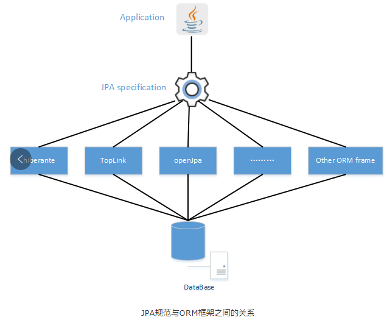

```java
@PersistenceContext
private EntityManager entityManager;

public Session getSession() {
    return this.entityManager.unwrap(Session.class);
}

public Session getSessionDelegate() {
    return (Session) entityManager.getDelegate();
}
```





1 JPA 快速入门
-----------------------

### 1.1、Hibernate5 JPA 概述

JPA 的全称是 Java Persistence API， 即 Java 持久化 API，是 SUN 公司推出的一套基于 ORM 的规范，内部是由一系列的接口和抽象类构成。JPA 通过 JDK 5.0 注解描述对象－关系表的映射关系，并将运行期的实体对象持久化到数据库中

但是 JPA 仅仅只是一套接口规范和抽象类，并不能真正的去干活，因此，就有很多厂商实现了 JPA 的规范，提供了相应的技术支持，就类似实现了 JDBC 的 MySQL 驱动，而本节课程将采用 Hibernate 实现作为驱动使用，因此我称之为 Hibernate5 JPA

### 1.2、Hibernate5 JPA 下载

官方网址：[hibernate orm](http://hibernate.org/orm/)

目录介绍：

hibernate-release-5.0.7.Final 文件夹介绍：


hibernate-release-5.0.7.Final\\lib 文件夹介绍：


### 1.3、Hibernate5 JPA 工程搭建

前边学习的 Hibernate，接下来进行工程搭建，根 Hibernate 相比，它只需要再多加入一个包就行

把下面四个文件夹的内容全部拷贝到 lib 中

*   hibernate-release-5.0.7.Final\\lib\\required


*   hibernate-release-5.0.7.Final\\lib\\optional\\c3p0


*   **hibernate-release-5.0.7.Final\\lib\\jpa**


*   日志记录包


*   数据库驱动


把下面五个文件夹的内容全部拷贝到 lib 中后，全部选中，右键 Build Path 一下


Java 工程搭建好了以后，我们需要有一个数据库（hibernate\_jpa）和两张表用于测试：

crm\_cst\_customer（客户表）

```
CREATE TABLE \`cst\_customer\` (
  \`cust\_id\` BIGINT(32) NOT NULL AUTO\_INCREMENT COMMENT '客户编号(主键)',
  \`cust\_name\` VARCHAR(32) DEFAULT NULL COMMENT '客户名称',
  \`cust\_source\` VARCHAR(32) DEFAULT NULL COMMENT '客户信息来源',
  \`cust\_industry\` VARCHAR(32) DEFAULT NULL COMMENT '客户所属行业',
  \`cust\_level\` VARCHAR(32) DEFAULT NULL COMMENT '客户级别',
  \`cust\_phone\` VARCHAR(64) DEFAULT NULL COMMENT '固定电话',
  \`cust\_mobile\` VARCHAR(16) DEFAULT NULL COMMENT '移动电话',
  PRIMARY KEY (\`cust\_id\`)
) ENGINE=INNODB AUTO\_INCREMENT=1 DEFAULT CHARSET=utf8;

```

crm\_cst\_linkman（联系人表）

```
CREATE TABLE \`cst\_linkman\` (
  \`lkm\_id\` BIGINT(32) NOT NULL AUTO\_INCREMENT COMMENT '联系人编号(主键)',
  \`lkm\_name\` VARCHAR(16) DEFAULT NULL COMMENT '联系人姓名',
  \`lkm\_gender\` CHAR(1) DEFAULT NULL COMMENT '联系人性别',
  \`lkm\_phone\` VARCHAR(16) DEFAULT NULL COMMENT '联系人办公电话',
  \`lkm\_mobile\` VARCHAR(16) DEFAULT NULL COMMENT '联系人手机',
  \`lkm\_email\` VARCHAR(64) DEFAULT NULL COMMENT '联系人邮箱',
  \`lkm\_qq\` VARCHAR(16) DEFAULT NULL COMMENT '联系人qq',
  \`lkm\_position\` VARCHAR(16) DEFAULT NULL COMMENT '联系人职位',
  \`lkm\_memo\` VARCHAR(512) DEFAULT NULL COMMENT '联系人备注',
  \`lkm\_cust\_id\` BIGINT(32) NOT NULL COMMENT '客户id',
  PRIMARY KEY (\`lkm\_id\`),
  KEY \`FK\_cst\_linkman\_lkm\_cust\_id\` (\`lkm\_cust\_id\`),
  CONSTRAINT \`FK\_cst\_linkman\_lkm\_cust\_id\` FOREIGN KEY (\`lkm\_cust\_id\`) REFERENCES \`cst\_customer\` (\`cust\_id\`) ON DELETE NO ACTION ON UPDATE NO ACTION
) ENGINE=INNODB AUTO\_INCREMENT=1 DEFAULT CHARSET=utf8;

```

在 Java 工程的 src 路径下创建一个名为 META-INF 的文件夹，在此文件夹下创建一个名为 persistence.xml 的配置文件

通用配置文件（掌握）：

persistence.xml（全路径：/hibernate\_jpa/src/META-INF/persistence.xml）

```xml
<?xml version="1.0" encoding="UTF-8"?>
<persistence xmlns="http://java.sun.com/xml/ns/persistence"
             xmlns:xsi="http://www.w3.org/2001/XMLSchema-instance"
             xsi:schemaLocation="http://java.sun.com/xml/ns/persistence
    http://java.sun.com/xml/ns/persistence/persistence_2_0.xsd"
             version="2.0">
    <!--
        配置持久化单元
            * name				：持久化单元名称
            * transaction-type	：持久化单元事务类型
                JTA				：开启JTA分布式事务
                RESOURCE_LOCAL	：开启本地事务
     -->
    <persistence-unit name="myJpa" transaction-type="RESOURCE_LOCAL">
        <!-- 配置JPA服务提供商 -->
        <provider>org.hibernate.jpa.HibernatePersistenceProvider</provider>
        <!-- 配置JPA的基本参数 -->
        <properties>
            <!-- 配置数据库驱动 -->
            <property name="javax.persistence.jdbc.driver" value="com.mysql.jdbc.Driver"/>
            <!-- 配置数据库地址 -->
            <property name="javax.persistence.jdbc.url" value="jdbc:mysql://127.0.0.1:3306/test"/>
            <!-- 配置数据库账户 -->
            <property name="javax.persistence.jdbc.user" value="root"/>
            <!-- 配置数据库密码 -->
            <property name="javax.persistence.jdbc.password" value="passw0rd"/>

            <!-- 配置JPA服务提供商可选参数 -->
            <property name="hibernate.show_sql" value="true"/>
            <property name="hibernate.format_sql" value="true"/>
            <property name="hibernate.hbm2ddl.auto" value="create"/>

            <!-- Hibernate JPA整合C3P0数据库连接池 -->

        </properties>
    </persistence-unit>
</persistence>
```

整合 C3P0 连接池版本配置文件（了解）：

```
<?xml version="1.0" encoding="UTF-8"?>
<persistence xmlns="http://java.sun.com/xml/ns/persistence"
	xmlns:xsi="http://www.w3.org/2001/XMLSchema-instance"
	xsi:schemaLocation="http://java.sun.com/xml/ns/persistence  
    http://java.sun.com/xml/ns/persistence/persistence\_2\_0.xsd"
	version="2.0">
	<!-- 
		配置持久化单元
			\* name				：持久化单元名称
			\* transaction-type	：持久化单元事务类型
				JTA				：开启JTA分布式事务
				RESOURCE\_LOCAL	：开启本地事务
	 -->
	<persistence-unit >
		<!-- 配置JPA服务提供商 -->
		<provider>org.hibernate.jpa.HibernatePersistenceProvider</provider>
		<!-- 配置JPA的基本参数 -->
		<properties>
			<!-- Hibernate JPA基本配置 -->
			<property  />
			<property  />
			<property  />
			<property  />
			<property  />
			<property  />
			<property  />

			<!-- Hibernate JPA可选配置 -->
			<property  />
			<property  />
			<property  />

			<!-- Hibernate JPA整合C3P0数据库连接池 -->
			<property  />
			<!-- 数据库连接池的最小连接数 -->
			<property  />
			<!-- 数据库连接池的最大连接数 -->
			<property  />
			<!-- 最大空闲时间，60秒内未使用则连接被丢弃。若为0则永不丢弃。Default: 0 -->
			<property  />
			<!-- 获得连接的超时时间,如果超过这个时间,会抛出异常，单位毫秒 -->
			<property  />
			<!-- 最大的PreparedStatement的数量 -->
			<property  />
			<!-- 每隔120秒检查连接池里的空闲连接，单位是秒 -->
			<property  />
			<!-- 当连接池里面的连接用完的时候，C3P0一下获取的新的连接数 -->
			<property  />
			<!-- 是否每次都验证连接是否可用 -->
			<property  />
		</properties>
	</persistence-unit>
</persistence>

```

对于本节课程来说，使用哪一个都可以，但是第一个更通用，更简单，我们采用第一个，配置文件有了以后，我们需要编写实体类跟数据库表的映射关系

Customer.java（全路径：/hibernate\_jpa/src/com/caochenlei/hibernate/jpa/Customer.java）

```
package com.caochenlei.hibernate.jpa;

import javax.persistence.Column;
import javax.persistence.Entity;
import javax.persistence.GeneratedValue;
import javax.persistence.GenerationType;
import javax.persistence.Id;
import javax.persistence.Table;

/\*\*
 \* @Entity	：声明是一个实体类
 \* @Table	：配置实体类和表的映射关系
 \* 	\* name	：配置数据库表的名称
 \*/
@Entity
@Table(name = "cst\_customer")
public class Customer {

	/\*\*
	 \* @Id				：声明主键的配置
	 \* @GeneratedValue	：配置主键的生成策略
	 \*      strategy：
	 \*          GenerationType.IDENTITY	：自增（底层数据库必须支持自动增长），mysql
	 \*          GenerationType.SEQUENCE	：序列（底层数据库必须支持序列），oracle
	 \*          GenerationType.TABLE	：JPA提供的一种机制，通过一张数据库表的形式帮助我们完成主键自增
	 \*          GenerationType.AUTO		：由程序自动的帮助我们选择主键生成策略
	 \* @Column			：配置属性和字段的映射关系
	 \* 		name		：数据库表中字段的名称
	 \*/
	@Id
	@GeneratedValue(strategy = GenerationType.IDENTITY)
	@Column(name = "cust\_id")
	private Long custId;

	@Column(name = "cust\_name")
	private String custName;

	@Column(name = "cust\_source")
	private String custSource;

	@Column(name = "cust\_industry")
	private String custIndustry;

	@Column(name = "cust\_level")
	private String custLevel;

	@Column(name = "cust\_phone")
	private String custPhone;

	@Column(name = "cust\_mobile")
	private String custMobile;

	public Long getCustId() {
		return custId;
	}

	public void setCustId(Long custId) {
		this.custId = custId;
	}

	public String getCustName() {
		return custName;
	}

	public void setCustName(String custName) {
		this.custName = custName;
	}

	public String getCustSource() {
		return custSource;
	}

	public void setCustSource(String custSource) {
		this.custSource = custSource;
	}

	public String getCustIndustry() {
		return custIndustry;
	}

	public void setCustIndustry(String custIndustry) {
		this.custIndustry = custIndustry;
	}

	public String getCustLevel() {
		return custLevel;
	}

	public void setCustLevel(String custLevel) {
		this.custLevel = custLevel;
	}

	public String getCustPhone() {
		return custPhone;
	}

	public void setCustPhone(String custPhone) {
		this.custPhone = custPhone;
	}

	public String getCustMobile() {
		return custMobile;
	}

	public void setCustMobile(String custMobile) {
		this.custMobile = custMobile;
	}

	@Override
	public String toString() {
		return "Customer \[custId=" + custId + ", cust\]";
	}

}

```

LinkMan.java（全路径：/hibernate\_jpa/src/com/caochenlei/hibernate/jpa/LinkMan.java）

```
package com.caochenlei.hibernate.jpa;

import javax.persistence.CascadeType;
import javax.persistence.Column;
import javax.persistence.Entity;
import javax.persistence.FetchType;
import javax.persistence.GeneratedValue;
import javax.persistence.GenerationType;
import javax.persistence.Id;
import javax.persistence.JoinColumn;
import javax.persistence.ManyToOne;
import javax.persistence.Table;

@Entity
@Table(name = "cst\_linkman")
public class LinkMan {

	@Id
	@GeneratedValue(strategy = GenerationType.IDENTITY)
	@Column(name = "lkm\_id")
	private Long lkmId;

	@Column(name = "lkm\_name")
	private String lkmName;

	@Column(name = "lkm\_gender")
	private String lkmGender;

	@Column(name = "lkm\_phone")
	private String lkmPhone;

	@Column(name = "lkm\_mobile")
	private String lkmMobile;

	@Column(name = "lkm\_email")
	private String lkmEmail;

	@Column(name = "lkm\_qq")
	private String lkmQq;

	@Column(name = "lkm\_position")
	private String lkmPosition;

	@Column(name = "lkm\_memo")
	private String lkmMemo;

	public Long getLkmId() {
		return lkmId;
	}

	public void setLkmId(Long lkmId) {
		this.lkmId = lkmId;
	}

	public String getLkmName() {
		return lkmName;
	}

	public void setLkmName(String lkmName) {
		this.lkmName = lkmName;
	}

	public String getLkmGender() {
		return lkmGender;
	}

	public void setLkmGender(String lkmGender) {
		this.lkmGender = lkmGender;
	}

	public String getLkmPhone() {
		return lkmPhone;
	}

	public void setLkmPhone(String lkmPhone) {
		this.lkmPhone = lkmPhone;
	}

	public String getLkmMobile() {
		return lkmMobile;
	}

	public void setLkmMobile(String lkmMobile) {
		this.lkmMobile = lkmMobile;
	}

	public String getLkmEmail() {
		return lkmEmail;
	}

	public void setLkmEmail(String lkmEmail) {
		this.lkmEmail = lkmEmail;
	}

	public String getLkmQq() {
		return lkmQq;
	}

	public void setLkmQq(String lkmQq) {
		this.lkmQq = lkmQq;
	}

	public String getLkmPosition() {
		return lkmPosition;
	}

	public void setLkmPosition(String lkmPosition) {
		this.lkmPosition = lkmPosition;
	}

	public String getLkmMemo() {
		return lkmMemo;
	}

	public void setLkmMemo(String lkmMemo) {
		this.lkmMemo = lkmMemo;
	}

	@Override
	public String toString() {
		return "LinkMan \[lkmId=" + lkmId + ", lkm\]";
	}

}

```

### 1.4、Hibernate5 JPA 增删改查

CustomerJPATest.java（全路径：/hibernate\_jpa/src/com/caochenlei/hibernate/jpa/CustomerJPATest.java）

```
package com.caochenlei.hibernate.jpa;

import javax.persistence.EntityManager;
import javax.persistence.EntityManagerFactory;
import javax.persistence.EntityTransaction;
import javax.persistence.Persistence;

import org.junit.Test;

public class CustomerJPATest {

	/\*\*
	 \* 运行之前，修改hibernate.hbm2ddl.auto=create
	 \* 保存操作
	 \*/
	@Test
	public void testSave() {
		// 获取实体管理器工厂		
		EntityManagerFactory entityManagerFactory = Persistence.createEntityManagerFactory("myJpa");
		// 获取实体管理器
		EntityManager entityManager = entityManagerFactory.createEntityManager();
		// 获取事务
		EntityTransaction transaction = entityManager.getTransaction();
		// 开启事务
		transaction.begin();
		// 创建实体对象并保存
		Customer customer1 = new Customer();
		customer1.setCustName("张三");
		entityManager.persist(customer1);

		Customer customer2 = new Customer();
		customer2.setCustName("李四");
		entityManager.persist(customer2);

		Customer customer3 = new Customer();
		customer3.setCustName("王五");
		entityManager.persist(customer3);
		// 提交事务
		transaction.commit();
		// 释放资源
		entityManager.close();
		entityManagerFactory.close();
	}

	/\*\*
	 \* 运行之前，修改hibernate.hbm2ddl.auto=update
	 \* 立即查询操作
	 \*/
	@Test
	public void testQuery1() {
		// 获取实体管理器工厂		
		EntityManagerFactory entityManagerFactory = Persistence.createEntityManagerFactory("myJpa");
		// 获取实体管理器
		EntityManager entityManager = entityManagerFactory.createEntityManager();
		// 获取事务
		EntityTransaction transaction = entityManager.getTransaction();
		// 开启事务
		transaction.begin();
		// 查询实体并输出
		Customer customer = entityManager.find(Customer.class, 2L);
		System.out.println(customer);
		// 提交事务
		transaction.commit();
		// 释放资源
		entityManager.close();
		entityManagerFactory.close();
	}

	/\*\*
	 \* 运行之前，修改hibernate.hbm2ddl.auto=update
	 \* 延迟查询操作
	 \*/
	@Test
	public void testQuery2() {
		// 获取实体管理器工厂		
		EntityManagerFactory entityManagerFactory = Persistence.createEntityManagerFactory("myJpa");
		// 获取实体管理器
		EntityManager entityManager = entityManagerFactory.createEntityManager();
		// 获取事务
		EntityTransaction transaction = entityManager.getTransaction();
		// 开启事务
		transaction.begin();
		// 查询实体并输出
		Customer customer = entityManager.getReference(Customer.class, 2L);
		System.out.println(customer);
		// 提交事务
		transaction.commit();
		// 释放资源
		entityManager.close();
		entityManagerFactory.close();
	}

	/\*\*
	 \* 运行之前，修改hibernate.hbm2ddl.auto=update
	 \* 删除操作
	 \*/
	@Test
	public void testDelete() {
		// 获取实体管理器工厂		
		EntityManagerFactory entityManagerFactory = Persistence.createEntityManagerFactory("myJpa");
		// 获取实体管理器
		EntityManager entityManager = entityManagerFactory.createEntityManager();
		// 获取事务
		EntityTransaction transaction = entityManager.getTransaction();
		// 开启事务
		transaction.begin();
		// 查询实体并删除
		Customer customer = entityManager.find(Customer.class, 1L);
		entityManager.remove(customer);
		// 提交事务
		transaction.commit();
		// 释放资源
		entityManager.close();
		entityManagerFactory.close();
	}

	/\*\*
	 \* 运行之前，修改hibernate.hbm2ddl.auto=update
	 \* 更新操作
	 \*/
	@Test
	public void testUpdate() {
		// 获取实体管理器工厂		
		EntityManagerFactory entityManagerFactory = Persistence.createEntityManagerFactory("myJpa");
		// 获取实体管理器
		EntityManager entityManager = entityManagerFactory.createEntityManager();
		// 获取事务
		EntityTransaction transaction = entityManager.getTransaction();
		// 开启事务
		transaction.begin();
		// 查询实体并更新
		Customer customer = entityManager.find(Customer.class, 2L);
		customer.setCustSource("电视广告");
		entityManager.merge(customer);
		// 提交事务
		transaction.commit();
		// 释放资源
		entityManager.close();
		entityManagerFactory.close();
	}

}

```

### 1.5、Hibernate5 JPA 工具类

JPAUtil.java（全路径：/hibernate\_jpa/src/com/caochenlei/hibernate/jpa/JPAUtil.java）

```
package com.caochenlei.hibernate.jpa;

import javax.persistence.EntityManager;
import javax.persistence.EntityManagerFactory;
import javax.persistence.Persistence;

public class JPAUtil {

	private static EntityManagerFactory entityManagerFactory;

	static {
		entityManagerFactory = Persistence.createEntityManagerFactory("myJpa");
	}

	public static EntityManager getEntityManager() {
		return entityManagerFactory.createEntityManager();
	}

}

```

2 JPA 核心对象
-----------------------

### 2.1、Persistence

Persistence 对象主要作用是用于获取 EntityManagerFactory 对象的 。通过调用该类的 createEntityManagerFactory 静态方法，根据配置文件中持久化单元名称创建 EntityManagerFactory。

### 2.2、EntityManagerFactory

EntityManagerFactory 接口主要用来创建 EntityManager 实例。

### 2.3、EntityManager

在 JPA 规范中，EntityManager 是完成持久化操作的核心对象。实体类作为普通 java 对象，只有在调用 EntityManager 将其持久化后才会变成持久化对象。EntityManager 对象在一组实体类与底层数据源之间进行 O/R 映射的管理。它可以用来管理和更新 Entity Bean，根椐主键查找 Entity Bean, 还可以通过 JPQL 语句查询实体。我们可以通过调用 EntityManager 的方法完成获取事务，以及持久化数据库的操作，例如：

*   getTransaction：获取事务对象
*   persist：保存操作
*   merge：更新操作
*   remove：删除操作
*   find/getReference：根据 id 查询

### 2.4、EntityTransaction

在 JPA 规范中，EntityTransaction 是完成事务操作的核心对象，对于 EntityTransaction 在我们的 Java 代码中承接的功能比较简单。

*   begin：开启事务
*   commit：提交事务
*   rollback：回滚事务

3 JPA 映射配置
-----------------------


### 3.1、一对多关联

#### 3.1.1、修改实体

修改 Customer.java（全路径：/hibernate\_jpa/src/com/caochenlei/hibernate/jpa/Customer.java）

在 toString 方法的下面添加多的集合

```
/\*\*
 \* 一对多：一的一方配置多的集合
 \* @OneToMany	：映射一对多
 \* 	\* fetch		：抓取策略
 \* 		FetchType.LAZY		：延迟加载（默认）
 \* 		FetchType.EAGER		：迫切查询（多表连接查询）
 \* 	\* cascade	：级联操作
 \* 		CascadeType.PERSIST	：级联保存
 \* 		CascadeType.MERGE	：级联更新
 \* 		CascadeType.REMOVE	：级联删除
 \* 		CascadeType.ALL		：全部支持
 \*  \* mappedBy	：放弃外键维护
 \*/
@OneToMany(fetch = FetchType.EAGER, cascade = CascadeType.ALL, mappedBy = "customer")
private Set<LinkMan> linkMans = new HashSet<LinkMan>();

public Set<LinkMan> getLinkMans() {
	return linkMans;
}

public void setLinkMans(Set<LinkMan> linkMans) {
	this.linkMans = linkMans;
}

```

修改 LinkMan.java（全路径：/hibernate\_jpa/src/com/caochenlei/hibernate/jpa/LinkMan.java）

在 toString 方法的下面添加一的对象

```
/\*\*
 \* 多对一：多的一方配置一的对象
 \* @ManyToOne	：映射多对一
 \* 	\* fetch		：抓取策略
 \* 		FetchType.LAZY		：延迟加载（默认）
 \* 		FetchType.EAGER		：迫切查询（多表连接查询）
 \* 	\* cascade	：级联操作
 \* 		CascadeType.PERSIST	：级联保存
 \* 		CascadeType.MERGE	：级联更新
 \* 		CascadeType.REMOVE	：级联删除
 \* 		CascadeType.ALL		：全部支持
 \* @JoinColumn	：设置两张表之间外键列
 \* 		name				；外键的名称
 \*/
@ManyToOne(fetch = FetchType.EAGER, cascade = CascadeType.ALL)
@JoinColumn(name = "lkm\_cust\_id")
private Customer customer = new Customer();

public Customer getCustomer() {
	return customer;
}

public void setCustomer(Customer customer) {
	this.customer = customer;
}

```

#### 3.1.2、测试代码

OneToManyTest.java（全路径：/hibernate\_jpa/src/com/caochenlei/hibernate/jpa/OneToManyTest.java）

```
package com.caochenlei.hibernate.jpa;

import java.util.Set;

import javax.persistence.EntityManager;
import javax.persistence.EntityTransaction;

import org.junit.Test;

public class OneToManyTest {

	/\*\*
	 \* 运行之前，修改hibernate.hbm2ddl.auto=create
	 \* 保存客户级联保存联系人
	 \*/
	@Test
	public void test1() {
		EntityManager entityManager = JPAUtil.getEntityManager();
		EntityTransaction transaction = entityManager.getTransaction();
		transaction.begin();

		// 创建两个客户
		Customer customer1 = new Customer();
		customer1.setCustName("张三");
		Customer customer2 = new Customer();
		customer2.setCustName("李四");

		// 创建三个联系人
		LinkMan linkMan1 = new LinkMan();
		linkMan1.setLkmName("凤姐");
		LinkMan linkMan2 = new LinkMan();
		linkMan2.setLkmName("如花");
		LinkMan linkMan3 = new LinkMan();
		linkMan3.setLkmName("旺财");

		customer1.getLinkMans().add(linkMan1);
		customer1.getLinkMans().add(linkMan2);
		customer2.getLinkMans().add(linkMan3);
		linkMan1.setCustomer(customer1);
		linkMan2.setCustomer(customer1);
		linkMan3.setCustomer(customer2);

		entityManager.persist(customer1);
		entityManager.persist(customer2);

		transaction.commit();
		entityManager.close();
	}

	/\*\*
	 \* 运行之前，修改hibernate.hbm2ddl.auto=create
	 \* 保存联系人级联保存客户
	 \*/
	@Test
	public void test2() {
		EntityManager entityManager = JPAUtil.getEntityManager();
		EntityTransaction transaction = entityManager.getTransaction();
		transaction.begin();

		// 创建两个客户
		Customer customer1 = new Customer();
		customer1.setCustName("张三");
		Customer customer2 = new Customer();
		customer2.setCustName("李四");

		// 创建三个联系人
		LinkMan linkMan1 = new LinkMan();
		linkMan1.setLkmName("凤姐");
		LinkMan linkMan2 = new LinkMan();
		linkMan2.setLkmName("如花");
		LinkMan linkMan3 = new LinkMan();
		linkMan3.setLkmName("旺财");

		customer1.getLinkMans().add(linkMan1);
		customer1.getLinkMans().add(linkMan2);
		customer2.getLinkMans().add(linkMan3);
		linkMan1.setCustomer(customer1);
		linkMan2.setCustomer(customer1);
		linkMan3.setCustomer(customer2);

		entityManager.persist(linkMan1);
		entityManager.persist(linkMan2);
		entityManager.persist(linkMan3);

		transaction.commit();
		entityManager.close();
	}

	/\*\*
	 \* 运行之前，修改hibernate.hbm2ddl.auto=update
	 \* 查询客户级联查询联系人
	 \*/
	@Test
	public void test3() {
		EntityManager entityManager = JPAUtil.getEntityManager();
		EntityTransaction transaction = entityManager.getTransaction();
		transaction.begin();

		Customer customer = entityManager.find(Customer.class, 1L);
		System.out.println(customer);

		Set<LinkMan> linkMans = customer.getLinkMans();
		for (LinkMan linkMan : linkMans) {
			System.out.println(linkMan);
		}

		transaction.commit();
		entityManager.close();
	}

	/\*\*
	 \* 运行之前，修改hibernate.hbm2ddl.auto=update
	 \* 查询联系人级联查询客户
	 \*/
	@Test
	public void test4() {
		EntityManager entityManager = JPAUtil.getEntityManager();
		EntityTransaction transaction = entityManager.getTransaction();
		transaction.begin();

		LinkMan linkMan = entityManager.find(LinkMan.class, 1L);
		System.out.println(linkMan);

		Customer customer = linkMan.getCustomer();
		System.out.println(customer);

		transaction.commit();
		entityManager.close();
	}

	/\*\*
	 \* 运行之前，修改hibernate.hbm2ddl.auto=update
	 \* 修改客户、修改联系人，保存客户级联保存联系人
	 \*/
	@Test
	public void test5() {
		EntityManager entityManager = JPAUtil.getEntityManager();
		EntityTransaction transaction = entityManager.getTransaction();
		transaction.begin();

		Customer customer = entityManager.find(Customer.class, 1L);
		customer.setCustSource("电视广告");

		Set<LinkMan> linkMans = customer.getLinkMans();
		for (LinkMan linkMan : linkMans) {
			linkMan.setLkmMobile("15633029014");
		}

		entityManager.persist(customer);

		transaction.commit();
		entityManager.close();
	}

	/\*\*
	 \* 运行之前，修改hibernate.hbm2ddl.auto=update
	 \* 修改客户、修改联系人，保存联系人级联保存客户
	 \*/
	@Test
	public void test6() {
		EntityManager entityManager = JPAUtil.getEntityManager();
		EntityTransaction transaction = entityManager.getTransaction();
		transaction.begin();

		LinkMan linkMan = entityManager.find(LinkMan.class, 1L);
		linkMan.setLkmMobile("110");

		Customer customer = linkMan.getCustomer();
		customer.setCustMobile("110");

		entityManager.persist(linkMan);

		transaction.commit();
		entityManager.close();
	}

	/\*\*
	 \* 运行之前，修改hibernate.hbm2ddl.auto=update
	 \* 删除客户级联删除联系人
	 \*/
	@Test
	public void test7() {
		EntityManager entityManager = JPAUtil.getEntityManager();
		EntityTransaction transaction = entityManager.getTransaction();
		transaction.begin();

		Customer customer = entityManager.find(Customer.class, 1L);
		entityManager.remove(customer);

		transaction.commit();
		entityManager.close();
	}

	/\*\*
	 \* 运行之前，修改hibernate.hbm2ddl.auto=update
	 \* 删除联系人级联删除客户
	 \*/
	@Test
	public void test8() {
		EntityManager entityManager = JPAUtil.getEntityManager();
		EntityTransaction transaction = entityManager.getTransaction();
		transaction.begin();

		LinkMan linkMan = entityManager.find(LinkMan.class, 3L);
		entityManager.remove(linkMan);

		transaction.commit();
		entityManager.close();
	}

}

```

### 3.2、多对多关联


sys\_user（用户表）

```
CREATE TABLE \`sys\_user\` (
  \`user\_id\` bigint(32) NOT NULL AUTO\_INCREMENT COMMENT '用户id',
  \`user\_code\` varchar(32) DEFAULT NULL COMMENT '用户账号',
  \`user\_name\` varchar(64) DEFAULT NULL COMMENT '用户名称',
  \`user\_password\` varchar(32) DEFAULT NULL COMMENT '用户密码',
  \`user\_state\` char(1) DEFAULT NULL COMMENT '用户状态',
  PRIMARY KEY (\`user\_id\`)
) ENGINE=InnoDB DEFAULT CHARSET=utf8;

```

sys\_role（角色表）

```
CREATE TABLE \`sys\_role\` (
  \`role\_id\` bigint(32) NOT NULL AUTO\_INCREMENT COMMENT '角色id',
  \`role\_name\` varchar(32) DEFAULT NULL COMMENT '角色名称',
  \`role\_memo\` varchar(128) DEFAULT NULL COMMENT '角色备注',
  PRIMARY KEY (\`role\_id\`)
) ENGINE=InnoDB DEFAULT CHARSET=utf8;

```

sys\_user\_role（中间表）

```
CREATE TABLE \`sys\_user\_role\` (
  \`role\_id\` bigint(32) NOT NULL COMMENT '角色id',
  \`user\_id\` bigint(32) NOT NULL COMMENT '用户id',
  PRIMARY KEY (\`role\_id\`,\`user\_id\`),
  KEY \`FK\_user\_role\_user\_id\` (\`user\_id\`),
  CONSTRAINT \`FK\_user\_role\_role\_id\` FOREIGN KEY (\`role\_id\`) REFERENCES \`sys\_role\` (\`role\_id\`) ON DELETE NO ACTION ON UPDATE NO ACTION,
  CONSTRAINT \`FK\_user\_role\_user\_id\` FOREIGN KEY (\`user\_id\`) REFERENCES \`sys\_user\` (\`user\_id\`) ON DELETE NO ACTION ON UPDATE NO ACTION
) ENGINE=InnoDB DEFAULT CHARSET=utf8;

```

#### 3.2.1、创建实体

User.java（全路径：/hibernate\_jpa/src/com/caochenlei/hibernate/jpa/User.java）

```
package com.caochenlei.hibernate.jpa;

import java.util.HashSet;
import java.util.Set;

import javax.persistence.CascadeType;
import javax.persistence.Column;
import javax.persistence.Entity;
import javax.persistence.FetchType;
import javax.persistence.GeneratedValue;
import javax.persistence.GenerationType;
import javax.persistence.Id;
import javax.persistence.JoinColumn;
import javax.persistence.JoinTable;
import javax.persistence.ManyToMany;
import javax.persistence.Table;

@Entity
@Table(name = "sys\_user")
public class User {

	@Id
	@GeneratedValue(strategy = GenerationType.IDENTITY)
	@Column(name = "user\_id")
	private Long userId;

	@Column(name = "user\_code")
	private String userCode;

	@Column(name = "user\_name")
	private String userName;

	@Column(name = "user\_password")
	private String userPassword;

	@Column(name = "user\_state")
	private String userState;

	public Long getUserId() {
		return userId;
	}

	public void setUserId(Long userId) {
		this.userId = userId;
	}

	public String getUserCode() {
		return userCode;
	}

	public void setUserCode(String userCode) {
		this.userCode = userCode;
	}

	public String getUserName() {
		return userName;
	}

	public void setUserName(String userName) {
		this.userName = userName;
	}

	public String getUserPassword() {
		return userPassword;
	}

	public void setUserPassword(String userPassword) {
		this.userPassword = userPassword;
	}

	public String getUserState() {
		return userState;
	}

	public void setUserState(String userState) {
		this.userState = userState;
	}

	@Override
	public String toString() {
		return "User \[userId=" + userId + ", userCode=" + userCode + ", user\]";
	}

	/\*\*
	 \* 多对多：另一方的集合对象
	 \* @ManyToMany	：映射多对多
	 \* 	\* fetch		：抓取策略
	 \* 		FetchType.LAZY		：延迟加载（默认）
	 \* 		FetchType.EAGER		：迫切查询（多表连接查询）
	 \* 	\* cascade	：级联操作
	 \* 		CascadeType.PERSIST	：级联保存
	 \* 		CascadeType.MERGE	：级联更新
	 \* 		CascadeType.REMOVE	：级联删除
	 \* 		CascadeType.ALL		：全部支持
	 \* @JoinTable	：用于对应中间表的设置
	 \* 	\* name				：中间表名称
	 \* 	\* joinColumns		：设置中间表与本表关联的外键
	 \* 	\* inverseJoinColumns：设置中间表与关联表对应的外键
	 \*/
	@ManyToMany(fetch = FetchType.EAGER, cascade = CascadeType.ALL)
	@JoinTable(name = "sys\_user\_role", joinColumns = @JoinColumn(name = "user\_id"), inverseJoinColumns = @JoinColumn(name = "role\_id"))
	private Set<Role> roles = new HashSet<Role>();

	public Set<Role> getRoles() {
		return roles;
	}

	public void setRoles(Set<Role> roles) {
		this.roles = roles;
	}

}

```

Role.java（全路径：/hibernate\_jpa/src/com/caochenlei/hibernate/jpa/Role.java）

```
package com.caochenlei.hibernate.jpa;

import java.util.HashSet;
import java.util.Set;

import javax.persistence.CascadeType;
import javax.persistence.Column;
import javax.persistence.Entity;
import javax.persistence.FetchType;
import javax.persistence.GeneratedValue;
import javax.persistence.GenerationType;
import javax.persistence.Id;
import javax.persistence.ManyToMany;
import javax.persistence.Table;

@Entity
@Table(name = "sys\_role")
public class Role {

	@Id
	@GeneratedValue(strategy = GenerationType.IDENTITY)
	@Column(name = "role\_id")
	private Long roleId;

	@Column(name = "role\_name")
	private String roleName;

	@Column(name = "role\_memo")
	private String roleMemo;

	public Long getRoleId() {
		return roleId;
	}

	public void setRoleId(Long roleId) {
		this.roleId = roleId;
	}

	public String getRoleName() {
		return roleName;
	}

	public void setRoleName(String roleName) {
		this.roleName = roleName;
	}

	public String getRoleMemo() {
		return roleMemo;
	}

	public void setRoleMemo(String roleMemo) {
		this.roleMemo = roleMemo;
	}

	@Override
	public String toString() {
		return "Role \[roleId=" + roleId + ", role\]";
	}

	/\*\*
	 \* 多对多：另一方的集合对象
	 \* @ManyToMany	：映射多对多
	 \* 	\* fetch		：抓取策略
	 \* 		FetchType.LAZY		：延迟加载（默认）
	 \* 		FetchType.EAGER		：迫切查询（多表连接查询）
	 \* 	\* cascade	：级联操作
	 \* 		CascadeType.PERSIST	：级联保存
	 \* 		CascadeType.MERGE	：级联更新
	 \* 		CascadeType.REMOVE	：级联删除
	 \* 		CascadeType.ALL		：全部支持
	 \*  \* mappedBy	：放弃外键维护
	 \*/
	@ManyToMany(fetch = FetchType.EAGER, cascade = CascadeType.ALL, mappedBy = "roles")
	private Set<User> users = new HashSet<User>();

	public Set<User> getUsers() {
		return users;
	}

	public void setUsers(Set<User> users) {
		this.users = users;
	}

}

```

#### 3.2.2、测试代码

ManyToManyTest.java（全路径：/hibernate\_jpa/src/com/caochenlei/hibernate/jpa/ManyToManyTest.java）

```
package com.caochenlei.hibernate.jpa;

import java.util.Set;

import javax.persistence.EntityManager;
import javax.persistence.EntityTransaction;

import org.junit.Test;

public class ManyToManyTest {

	/\*\*
	 \* 运行之前，修改hibernate.hbm2ddl.auto=create
	 \* 保存用户级联保存角色
	 \*/
	@Test
	public void test1() {
		EntityManager entityManager = JPAUtil.getEntityManager();
		EntityTransaction transaction = entityManager.getTransaction();
		transaction.begin();

		// 创建两个用户
		User user1 = new User();
		user1.setUserName("曹晨磊");
		User user2 = new User();
		user2.setUserName("曹晨旭");

		// 创建三个角色
		Role role1 = new Role();
		role1.setRoleName("吕布");
		Role role2 = new Role();
		role2.setRoleName("东皇");
		Role role3 = new Role();
		role3.setRoleName("赵云");

		user1.getRoles().add(role1);
		user1.getRoles().add(role2);
		user2.getRoles().add(role3);
		role1.getUsers().add(user1);
		role2.getUsers().add(user1);
		role3.getUsers().add(user2);

		entityManager.persist(user1);
		entityManager.persist(user2);

		transaction.commit();
		entityManager.close();
	}

	/\*\*
	 \* 运行之前，修改hibernate.hbm2ddl.auto=create
	 \* 保存角色级联保存用户
	 \*/
	@Test
	public void test2() {
		EntityManager entityManager = JPAUtil.getEntityManager();
		EntityTransaction transaction = entityManager.getTransaction();
		transaction.begin();

		// 创建两个用户
		User user1 = new User();
		user1.setUserName("曹晨磊");
		User user2 = new User();
		user2.setUserName("曹晨旭");

		// 创建三个角色
		Role role1 = new Role();
		role1.setRoleName("吕布");
		Role role2 = new Role();
		role2.setRoleName("东皇");
		Role role3 = new Role();
		role3.setRoleName("赵云");

		user1.getRoles().add(role1);
		user1.getRoles().add(role2);
		user2.getRoles().add(role3);
		role1.getUsers().add(user1);
		role2.getUsers().add(user1);
		role3.getUsers().add(user2);

		entityManager.persist(role1);
		entityManager.persist(role2);
		entityManager.persist(role3);

		transaction.commit();
		entityManager.close();
	}

	/\*\*
	 \* 运行之前，修改hibernate.hbm2ddl.auto=update
	 \* 查询用户级联查询角色
	 \*/
	@Test
	public void test3() {
		EntityManager entityManager = JPAUtil.getEntityManager();
		EntityTransaction transaction = entityManager.getTransaction();
		transaction.begin();

		User user = entityManager.find(User.class, 1L);
		System.out.println(user);

		Set<Role> roles = user.getRoles();
		for (Role role : roles) {
			System.out.println(role);
		}

		transaction.commit();
		entityManager.close();
	}

	/\*\*
	 \* 运行之前，修改hibernate.hbm2ddl.auto=update
	 \* 查询角色级联查询用户
	 \*/
	@Test
	public void test4() {
		EntityManager entityManager = JPAUtil.getEntityManager();
		EntityTransaction transaction = entityManager.getTransaction();
		transaction.begin();

		Role role = entityManager.find(Role.class, 3L);
		System.out.println(role);

		Set<User> users = role.getUsers();
		for (User user : users) {
			System.out.println(user);
		}

		transaction.commit();
		entityManager.close();
	}

	/\*\*
	 \* 运行之前，修改hibernate.hbm2ddl.auto=update
	 \* 修改用户、修改角色，更新用户级联更新角色
	 \*/
	@Test
	public void test5() {
		EntityManager entityManager = JPAUtil.getEntityManager();
		EntityTransaction transaction = entityManager.getTransaction();
		transaction.begin();

		User user = entityManager.find(User.class, 1L);
		user.setUserPassword("123456");

		Set<Role> roles = user.getRoles();
		for (Role role : roles) {
			role.setRoleMemo("123456");
		}

		entityManager.merge(user);

		transaction.commit();
		entityManager.close();
	}

	/\*\*
	 \* 运行之前，修改hibernate.hbm2ddl.auto=update
	 \* 修改用户、修改角色，更新角色级联更新用户
	 \*/
	@Test
	public void test6() {
		EntityManager entityManager = JPAUtil.getEntityManager();
		EntityTransaction transaction = entityManager.getTransaction();
		transaction.begin();

		Role role = entityManager.find(Role.class, 3L);
		role.setRoleMemo("123456");

		Set<User> users = role.getUsers();
		for (User user : users) {
			user.setUserPassword("123456");
		}

		entityManager.merge(role);

		transaction.commit();
		entityManager.close();
	}

	/\*\*
	 \* 运行之前，修改hibernate.hbm2ddl.auto=update
	 \* 删除用户级联删除角色
	 \*/
	@Test
	public void test7() {
		EntityManager entityManager = JPAUtil.getEntityManager();
		EntityTransaction transaction = entityManager.getTransaction();
		transaction.begin();

		User user = entityManager.find(User.class, 1L);
		entityManager.remove(user);

		transaction.commit();
		entityManager.close();
	}

	/\*\*
	 \* 运行之前，修改hibernate.hbm2ddl.auto=update
	 \* 删除角色级联删除用户
	 \*/
	@Test
	public void test8() {
		EntityManager entityManager = JPAUtil.getEntityManager();
		EntityTransaction transaction = entityManager.getTransaction();
		transaction.begin();

		Role role = entityManager.find(Role.class, 3L);
		entityManager.remove(role);

		transaction.commit();
		entityManager.close();
	}

}

```

### 3.3、一对一关联


student\_base\_info（学生信息基本表）

```
CREATE TABLE \`student\_base\_info\` (
  \`stu\_id\` bigint(20) NOT NULL AUTO\_INCREMENT COMMENT '学生id',
  \`stu\_name\` varchar(20) DEFAULT NULL COMMENT '学生姓名',
  \`stu\_sex\` varchar(20) DEFAULT NULL COMMENT '学生性别',
  PRIMARY KEY (\`stu\_id\`)
) ENGINE=InnoDB DEFAULT CHARSET=utf8;

```

student\_other\_info（学生信息拓展表）

```
CREATE TABLE \`student\_other\_info\` (
  \`stu\_id\` bigint(20) NOT NULL COMMENT '学生id',
  \`stu\_img\` varchar(255) DEFAULT NULL COMMENT '学生头像',
  \`stu\_address\` varchar(255) DEFAULT NULL COMMENT '学生地址',
  PRIMARY KEY (\`stu\_id\`),
  CONSTRAINT \`FK\_stu\_id\` FOREIGN KEY (\`stu\_id\`) REFERENCES \`student\_base\_info\` (\`stu\_id\`) ON DELETE NO ACTION ON UPDATE NO ACTION
) ENGINE=InnoDB DEFAULT CHARSET=utf8;

```

#### 3.3.1、创建实体

StuBaseInfo.java（全路径：/hibernate\_jpa/src/com/caochenlei/hibernate/jpa/StuBaseInfo.java）

```
package com.caochenlei.hibernate.jpa;

import javax.persistence.CascadeType;
import javax.persistence.Column;
import javax.persistence.Entity;
import javax.persistence.FetchType;
import javax.persistence.GeneratedValue;
import javax.persistence.GenerationType;
import javax.persistence.Id;
import javax.persistence.OneToOne;
import javax.persistence.Table;

@Entity
@Table(name = "student\_base\_info")
public class StuBaseInfo {

	@Id
	@GeneratedValue(strategy = GenerationType.IDENTITY)
	@Column(name = "stu\_id")
	private Long stuId;

	@Column(name = "stu\_name")
	private String stuName;

	@Column(name = "stu\_sex")
	private String stuSex;

	public Long getStuId() {
		return stuId;
	}

	public void setStuId(Long stuId) {
		this.stuId = stuId;
	}

	public String getStuName() {
		return stuName;
	}

	public void setStuName(String stuName) {
		this.stuName = stuName;
	}

	public String getStuSex() {
		return stuSex;
	}

	public void setStuSex(String stuSex) {
		this.stuSex = stuSex;
	}

	@Override
	public String toString() {
		return "StuBaseInfo \[stuId=" + stuId + ", stu\]";
	}

	/\*\*
	 \* 一对一：另一方的对象
	 \* @OneToOne	：映射一对一
	 \* 	\* fetch		：抓取策略
	 \* 		FetchType.LAZY		：延迟加载（默认）
	 \* 		FetchType.EAGER		：迫切查询（多表连接查询）
	 \* 	\* cascade	：级联操作
	 \* 		CascadeType.PERSIST	：级联保存
	 \* 		CascadeType.MERGE	：级联更新
	 \* 		CascadeType.REMOVE	：级联删除
	 \* 		CascadeType.ALL		：全部支持
	 \*  \* mappedBy	：放弃外键维护
	 \*/
	@OneToOne(fetch = FetchType.EAGER, cascade = CascadeType.ALL, mappedBy = "stuBaseInfo")
	private StuOtherInfo stuOtherInfo;

	public StuOtherInfo getStuOtherInfo() {
		return stuOtherInfo;
	}

	public void setStuOtherInfo(StuOtherInfo stuOtherInfo) {
		this.stuOtherInfo = stuOtherInfo;
	}

}

```

StuOtherInfo.java（全路径：/hibernate\_jpa/src/com/caochenlei/hibernate/jpa/StuOtherInfo.java）

```
package com.caochenlei.hibernate.jpa;

import javax.persistence.CascadeType;
import javax.persistence.Column;
import javax.persistence.Entity;
import javax.persistence.FetchType;
import javax.persistence.GeneratedValue;
import javax.persistence.GenerationType;
import javax.persistence.Id;
import javax.persistence.JoinColumn;
import javax.persistence.OneToOne;
import javax.persistence.Table;

@Entity
@Table(name = "student\_other\_info")
public class StuOtherInfo {

	@Id
	@GeneratedValue(strategy = GenerationType.IDENTITY)
	@Column(name = "stu\_id")
	private Long stuId;

	@Column(name = "stu\_img")
	private String stuImg;

	@Column(name = "stu\_address")
	private String stuAddress;

	public Long getStuId() {
		return stuId;
	}

	public void setStuId(Long stuId) {
		this.stuId = stuId;
	}

	public String getStuImg() {
		return stuImg;
	}

	public void setStuImg(String stuImg) {
		this.stuImg = stuImg;
	}

	public String getStuAddress() {
		return stuAddress;
	}

	public void setStuAddress(String stuAddress) {
		this.stuAddress = stuAddress;
	}

	@Override
	public String toString() {
		return "StuOtherInfo \[stuId=" + stuId + ", stuImg=" + stuImg + ", stuAddress=" + stuAddress + "\]";
	}

	/\*\*
	 \* 一对一：另一方的对象
	 \* @OneToOne	：映射一对一
	 \* 	\* fetch		：抓取策略
	 \* 		FetchType.LAZY		：延迟加载（默认）
	 \* 		FetchType.EAGER		：迫切查询（多表连接查询）
	 \* 	\* cascade	：级联操作
	 \* 		CascadeType.PERSIST	：级联保存
	 \* 		CascadeType.MERGE	：级联更新
	 \* 		CascadeType.REMOVE	：级联删除
	 \* 		CascadeType.ALL		：全部支持
	 \* @JoinColumn	：设置两张表之间外键列
	 \* 		name				；外键的名称
	 \*/
	@OneToOne(fetch = FetchType.EAGER, cascade = CascadeType.ALL)
	@JoinColumn(name = "stu\_id")
	private StuBaseInfo stuBaseInfo ;

	public StuBaseInfo getStuBaseInfo() {
		return stuBaseInfo;
	}

	public void setStuBaseInfo(StuBaseInfo stuBaseInfo) {
		this.stuBaseInfo = stuBaseInfo;
	}

}

```

#### 3.3.2、测试代码

OneToOneTest.java（全路径：/hibernate\_jpa/src/com/caochenlei/hibernate/jpa/OneToOneTest.java）

```
package com.caochenlei.hibernate.jpa;

import javax.persistence.EntityManager;
import javax.persistence.EntityTransaction;

import org.junit.Test;

public class OneToOneTest {

	/\*\*
	 \* 运行之前，修改hibernate.hbm2ddl.auto=create
	 \* 保存学生基本信息级联保存学生拓展信息
	 \*/
	@Test
	public void test1() {
		EntityManager entityManager = JPAUtil.getEntityManager();
		EntityTransaction transaction = entityManager.getTransaction();
		transaction.begin();

		// 创建两个学生基本信息
		StuBaseInfo stuBaseInfo1 = new StuBaseInfo();
		stuBaseInfo1.setStuName("张三");
		StuBaseInfo stuBaseInfo2 = new StuBaseInfo();
		stuBaseInfo2.setStuName("李四");

		// 创建两个学生拓展信息
		StuOtherInfo stuOtherInfo1 = new StuOtherInfo();
		stuOtherInfo1.setStuImg("http:img.caochenlei.com/001.png");
		StuOtherInfo stuOtherInfo2 = new StuOtherInfo();
		stuOtherInfo2.setStuImg("http:img.caochenlei.com/002.png");

		stuBaseInfo1.setStuOtherInfo(stuOtherInfo1);
		stuBaseInfo2.setStuOtherInfo(stuOtherInfo2);
		stuOtherInfo1.setStuBaseInfo(stuBaseInfo1);
		stuOtherInfo2.setStuBaseInfo(stuBaseInfo2);

		entityManager.persist(stuBaseInfo1);
		entityManager.persist(stuBaseInfo2);

		transaction.commit();
		entityManager.close();
	}

	/\*\*
	 \* 运行之前，修改hibernate.hbm2ddl.auto=create
	 \* 保存学生拓展信息级联保存学生基本信息
	 \*/
	@Test
	public void test2() {
		EntityManager entityManager = JPAUtil.getEntityManager();
		EntityTransaction transaction = entityManager.getTransaction();
		transaction.begin();

		// 创建两个学生基本信息
		StuBaseInfo stuBaseInfo1 = new StuBaseInfo();
		stuBaseInfo1.setStuName("张三");
		StuBaseInfo stuBaseInfo2 = new StuBaseInfo();
		stuBaseInfo2.setStuName("李四");

		// 创建两个学生拓展信息
		StuOtherInfo stuOtherInfo1 = new StuOtherInfo();
		stuOtherInfo1.setStuImg("http:img.caochenlei.com/001.png");
		StuOtherInfo stuOtherInfo2 = new StuOtherInfo();
		stuOtherInfo2.setStuImg("http:img.caochenlei.com/002.png");

		stuBaseInfo1.setStuOtherInfo(stuOtherInfo1);
		stuBaseInfo2.setStuOtherInfo(stuOtherInfo2);
		stuOtherInfo1.setStuBaseInfo(stuBaseInfo1);
		stuOtherInfo2.setStuBaseInfo(stuBaseInfo2);

		entityManager.persist(stuOtherInfo1);
		entityManager.persist(stuOtherInfo2);

		transaction.commit();
		entityManager.close();
	}

	/\*\*
	 \* 运行之前，修改hibernate.hbm2ddl.auto=update
	 \* 查询学生基本信息级联查询学生拓展信息
	 \*/
	@Test
	public void test3() {
		EntityManager entityManager = JPAUtil.getEntityManager();
		EntityTransaction transaction = entityManager.getTransaction();
		transaction.begin();

		StuBaseInfo stuBaseInfo = entityManager.find(StuBaseInfo.class, 1L);
		System.out.println(stuBaseInfo);
		StuOtherInfo stuOtherInfo = stuBaseInfo.getStuOtherInfo();
		System.out.println(stuOtherInfo);

		transaction.commit();
		entityManager.close();
	}

	/\*\*
	 \* 运行之前，修改hibernate.hbm2ddl.auto=update
	 \* 查询学生拓展信息级联查询学生基本信息
	 \*/
	@Test
	public void test4() {
		EntityManager entityManager = JPAUtil.getEntityManager();
		EntityTransaction transaction = entityManager.getTransaction();
		transaction.begin();

		StuOtherInfo stuOtherInfo = entityManager.find(StuOtherInfo.class, 1L);
		System.out.println(stuOtherInfo);
		StuBaseInfo stuBaseInfo = stuOtherInfo.getStuBaseInfo();
		System.out.println(stuBaseInfo);

		transaction.commit();
		entityManager.close();
	}

	/\*\*
	 \* 运行之前，修改hibernate.hbm2ddl.auto=update
	 \* 更新学生基本信息级联更新学生拓展信息
	 \*/
	@Test
	public void test5() {
		EntityManager entityManager = JPAUtil.getEntityManager();
		EntityTransaction transaction = entityManager.getTransaction();
		transaction.begin();

		StuBaseInfo stuBaseInfo = entityManager.find(StuBaseInfo.class, 1L);
		stuBaseInfo.setStuSex("男");
		StuOtherInfo stuOtherInfo = stuBaseInfo.getStuOtherInfo();
		stuOtherInfo.setStuAddress("河北省");
		entityManager.merge(stuBaseInfo);

		transaction.commit();
		entityManager.close();
	}

	/\*\*
	 \* 运行之前，修改hibernate.hbm2ddl.auto=update
	 \* 更新学生拓展信息级联更新学生基本信息
	 \*/
	@Test
	public void test6() {
		EntityManager entityManager = JPAUtil.getEntityManager();
		EntityTransaction transaction = entityManager.getTransaction();
		transaction.begin();

		StuOtherInfo stuOtherInfo = entityManager.find(StuOtherInfo.class, 2L);
		stuOtherInfo.setStuAddress("河南省");
		StuBaseInfo stuBaseInfo = stuOtherInfo.getStuBaseInfo();
		stuBaseInfo.setStuSex("女");
		entityManager.merge(stuOtherInfo);

		transaction.commit();
		entityManager.close();
	}

	/\*\*
	 \* 运行之前，修改hibernate.hbm2ddl.auto=update
	 \* 删除学生基本信息级联删除学生拓展信息
	 \*/
	@Test
	public void test7() {
		EntityManager entityManager = JPAUtil.getEntityManager();
		EntityTransaction transaction = entityManager.getTransaction();
		transaction.begin();

		StuBaseInfo stuBaseInfo = entityManager.find(StuBaseInfo.class, 1L);
		entityManager.remove(stuBaseInfo);

		transaction.commit();
		entityManager.close();
	}

	/\*\*
	 \* 运行之前，修改hibernate.hbm2ddl.auto=update
	 \* 删除学生拓展信息级联删除学生基本信息
	 \*/
	@Test
	public void test8() {
		EntityManager entityManager = JPAUtil.getEntityManager();
		EntityTransaction transaction = entityManager.getTransaction();
		transaction.begin();

		StuOtherInfo stuOtherInfo = entityManager.find(StuOtherInfo.class, 2L);
		entityManager.remove(stuOtherInfo);

		transaction.commit();
		entityManager.close();
	}

}

```

4 JPA 的 JPQL 查询
----------------------------

初始化数据，运行 init 方法：

InitQueryData.java（全路径：/hibernate\_jpa/src/com/caochenlei/hibernate/jpa/InitQueryData.java）

```
package com.caochenlei.hibernate.jpa;

import javax.persistence.EntityManager;
import javax.persistence.EntityTransaction;

import org.junit.Test;

public class InitQueryData {

	/\*\*
	 \* 执行前：修改hibernate.hbm2ddl.auto=create
	 \* 执行此方法
	 \* 执行后：修改hibernate.hbm2ddl.auto=update
	 \*/
	@Test
	public void init() {
		EntityManager entityManager = JPAUtil.getEntityManager();
		EntityTransaction transaction = entityManager.getTransaction();
		transaction.begin();

		// 创建一个客户
		Customer customer1 = new Customer();
		customer1.setCustName("张三");
		customer1.setCustSource("电视广告");
		// 创建十个联系人
		for (int i = 1; i <= 10; i++) {
			LinkMan linkMan = new LinkMan();
			linkMan.setLkmName("张三的联系人" + i);
			linkMan.setCustomer(customer1);
			customer1.getLinkMans().add(linkMan);
			entityManager.persist(linkMan);
		}
		entityManager.persist(customer1);

		// 创建一个客户
		Customer customer2 = new Customer();
		customer2.setCustName("李四");
		customer2.setCustSource("网络论坛");
		// 创建十个联系人
		for (int i = 1; i <= 10; i++) {
			LinkMan linkMan = new LinkMan();
			linkMan.setLkmName("李四的联系人" + i);
			linkMan.setCustomer(customer2);
			customer2.getLinkMans().add(linkMan);
			entityManager.persist(linkMan);
		}
		entityManager.persist(customer2);

		// 创建一个客户
		Customer customer3 = new Customer();
		customer3.setCustName("王五");
		customer3.setCustSource("街边告示");
		// 创建十个联系人
		for (int i = 1; i <= 10; i++) {
			LinkMan linkMan = new LinkMan();
			linkMan.setLkmName("王五的联系人" + i);
			linkMan.setCustomer(customer3);
			customer3.getLinkMans().add(linkMan);
			entityManager.persist(linkMan);
		}
		entityManager.persist(customer3);

		// 创建一个客户
		Customer customer4 = new Customer();
		customer4.setCustName("王五");
		customer4.setCustSource("电视广告");
		entityManager.persist(customer4);

		transaction.commit();
		entityManager.close();
	}

}

```

以下的方法，均在下边文件进行测试：

JPQLTest.java（全路径：/hibernate\_jpa/src/com/caochenlei/hibernate/jpa/JPQLTest.java）

### 4.1、简单查询

```
@Test
public void test1() {
	EntityManager entityManager = JPAUtil.getEntityManager();
	EntityTransaction transaction = entityManager.getTransaction();
	transaction.begin();

	// 查询所有客户
	Query query = entityManager.createQuery("from Customer");
	List<Customer> list = query.getResultList();
	for (Customer customer : list) {
		System.out.println(customer);
	}
	System.err.println("--------------------------------------------------");

	transaction.commit();
	entityManager.close();
}

```

### 4.2、别名查询

```
@Test
public void test2() {
	EntityManager entityManager = JPAUtil.getEntityManager();
	EntityTransaction transaction = entityManager.getTransaction();
	transaction.begin();

	// 查询所有客户
	Query query1 = entityManager.createQuery("from Customer c");
	List<Customer> list1 = query1.getResultList();
	for (Customer customer : list1) {
		System.out.println(customer);
	}
	System.err.println("--------------------------------------------------");

	// 查询所有客户
	Query query2 = entityManager.createQuery("select c from Customer c");
	List<Customer> list2 = query2.getResultList();
	for (Customer customer : list2) {
		System.out.println(customer);
	}
	System.err.println("--------------------------------------------------");

	transaction.commit();
	entityManager.close();
}

```

### 4.3、排序查询

```
@Test
public void test3() {
	EntityManager entityManager = JPAUtil.getEntityManager();
	EntityTransaction transaction = entityManager.getTransaction();
	transaction.begin();

	// 采用链式调用，默认情况（升序）
	List<Customer> list1 = entityManager.createQuery("from Customer order by cust\_id").getResultList();
	for (Customer customer : list1) {
		System.out.println(customer);
	}
	System.err.println("--------------------------------------------------");

	// 采用链式调用，升序情况
	List<Customer> list2 = entityManager.createQuery("from Customer order by cust\_id asc").getResultList();
	for (Customer customer : list2) {
		System.out.println(customer);
	}
	System.err.println("--------------------------------------------------");

	// 采用链式调用，降序情况
	List<Customer> list3 = entityManager.createQuery("from Customer order by cust\_id desc").getResultList();
	for (Customer customer : list3) {
		System.out.println(customer);
	}
	System.err.println("--------------------------------------------------");

	transaction.commit();
	entityManager.close();
}

```

### 4.4、条件查询

```
@Test
public void test4() {
	EntityManager entityManager = JPAUtil.getEntityManager();
	EntityTransaction transaction = entityManager.getTransaction();
	transaction.begin();

	// 条件查询：按参数位置绑定
	Query query1 = entityManager.createQuery("from Customer where cust\_source = ? and cust\_name like ?");
	query1.setParameter(1, "电视广告");
	query1.setParameter(2, "王%");
	List<Customer> list1 = query1.getResultList();
	for (Customer customer : list1) {
		System.out.println(customer);
	}
	System.err.println("--------------------------------------------------");

	// 条件查询：按参数名称绑定
	Query query2 = entityManager.createQuery("from Customer where cust\_source = :aaa and cust\_name like :bbb");
	query2.setParameter("aaa", "电视广告");
	query2.setParameter("bbb", "王%");
	List<Customer> list2 = query2.getResultList();
	for (Customer customer : list2) {
		System.out.println(customer);
	}
	System.err.println("--------------------------------------------------");

	transaction.commit();
	entityManager.close();
}

```

### 4.5、投影查询

```
@Test
public void test5() {
	EntityManager entityManager = JPAUtil.getEntityManager();
	EntityTransaction transaction = entityManager.getTransaction();
	transaction.begin();

	// 查询所有客户名称：单个字段查询
	Query query1 = entityManager.createQuery("select c.custName from Customer c");
	List<Object> list1 = query1.getResultList();
	for (Object cust\_name : list1) {
		System.out.println(cust\_name);
	}
	System.err.println("--------------------------------------------------");

	// 查询所有客户名称、客户来源：多个字段查询，封装到数组中
	Query query2 = entityManager.createQuery("select c.custName,c.custSource from Customer c");
	List<Object\[\]> list2 = query2.getResultList();
	for (Object\[\] objects : list2) {
		System.out.println(Arrays.toString(objects));
	}
	System.err.println("--------------------------------------------------");

	// 查询所有客户名称、客户来源：多个字段查询，封装到对象中
	// 请在Customer.java添加以下两个构造方法，否则会执行失败
	// public Customer()
	// public Customer(String custName, String custSource)
	Query query3 = entityManager.createQuery("select new Customer(c.custName,c.custSource) from Customer c");
	List<Customer> list3 = query3.getResultList();
	for (Customer customer : list3) {
		System.out.println(customer);
	}
	System.err.println("--------------------------------------------------");

	transaction.commit();
	entityManager.close();
}

```

### 4.6、分页查询

```
@Test
public void test6() {
	EntityManager entityManager = JPAUtil.getEntityManager();
	EntityTransaction transaction = entityManager.getTransaction();
	transaction.begin();

	// 分页查询
	Query query = entityManager.createQuery("from LinkMan");
	query.setFirstResult(0);
	query.setMaxResults(10);
	List<LinkMan> list = query.getResultList();
	for (LinkMan linkMan : list) {
		System.out.println(linkMan);
	}
	System.err.println("--------------------------------------------------");

	transaction.commit();
	entityManager.close();
}

```

### 4.7、分组查询

```
@Test
public void test7() {
	EntityManager entityManager = JPAUtil.getEntityManager();
	EntityTransaction transaction = entityManager.getTransaction();
	transaction.begin();

	// 聚合函数：count(),max(),min(),avg(),sum()
	Object object = entityManager.createQuery("select count(\*) from Customer").getSingleResult();
	System.out.println(object);
	System.err.println("--------------------------------------------------");

	// 分组统计：
	List<Object\[\]> list = entityManager.createQuery("select custSource,count(\*) from Customer group by cust\_source").getResultList();
	for (Object\[\] objects : list) {
		System.out.println(Arrays.toString(objects));
	}
	System.err.println("--------------------------------------------------");

	transaction.commit();
	entityManager.close();
}

```

### 4.8、多表查询

```
@Test
public void test8() {
	EntityManager entityManager = JPAUtil.getEntityManager();
	EntityTransaction transaction = entityManager.getTransaction();
	transaction.begin();

	// 内连接
	List<Object\[\]> list1 = entityManager.createQuery("from Customer c inner join c.linkMans").getResultList();
	for (Object\[\] objects : list1) {
		System.out.println(Arrays.toString(objects));
	}
	System.err.println("--------------------------------------------------");

	// 迫切内连接（hibernate独有，将另一个对象的数据封装到该对象中）
	List<Customer> list2 = entityManager.createQuery("select distinct c from Customer c inner join fetch c.linkMans").getResultList();
	for (Customer customer : list2) {
		System.out.println(customer);
	}
	System.err.println("--------------------------------------------------");

	// 左外连接
	List<Object\[\]> list3 = entityManager.createQuery("from Customer c left outer join c.linkMans").getResultList();
	for (Object\[\] objects : list3) {
		System.out.println(Arrays.toString(objects));
	}
	System.err.println("--------------------------------------------------");

	// 迫切左外连接（hibernate独有，将另一个对象的数据封装到该对象中）
	List<Customer> list4 = entityManager.createQuery("select distinct c from Customer c left outer join fetch c.linkMans").getResultList();
	for (Customer customer : list4) {
		System.out.println(customer);
	}
	System.err.println("--------------------------------------------------");

	// 右外连接
	List<Object\[\]> list5 = entityManager.createQuery("from Customer c right outer join c.linkMans").getResultList();
	for (Object\[\] objects : list5) {
		System.out.println(Arrays.toString(objects));
	}
	System.err.println("--------------------------------------------------");

	transaction.commit();
	entityManager.close();
}

```