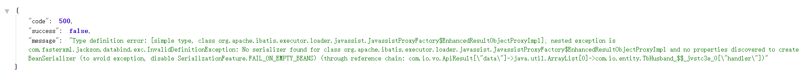

# 1. 环境搭建

## 1.1 Mybatis

```properties
<dependency>
    <groupId>org.mybatis.spring.boot</groupId>
    <artifactId>mybatis-spring-boot-starter</artifactId>
    <version>1.2.0</version>
</dependency>
```

## 1.2 数据源

> Spring boot 2.0 以后默认的数据源HikariCP！

```properties
<dependency>
	<groupId>com.zaxxer</groupId>
	<artifactId>HikariCP</artifactId>
	<version>3.3.1</version>
</dependency>
```

## 1.3 分页插件

```properties
<!-- 分页插件 -->
<dependency>
	<groupId>com.github.pagehelper</groupId>
	<artifactId>pagehelper-spring-boot-starter</artifactId>
	<version>1.2.5</version>
</dependency>
```

## 1.4 配置文件

```yaml
# mybatis配置
mybatis:
  mapper-locations: classpath:mapper/*.xml # 对应的mapper的xml文件
  type-aliases-package: com.io.entity,com.io.dto # 实体扫描，多个package用逗号或者分号分隔，mapper文件不用写全路径
  configuration:
    log-impl: org.apache.ibatis.logging.stdout.StdOutImpl # 打印sql返回结果
    map-underscore-to-camel-case: true # 驼峰风格命名
    cache-enabled: true # 启用或禁用缓存
    lazy-loading-enabled: true # 关联对象懒加载
    lazy-load-trigger-methods: equals,clone,hashCode,toString  # 延迟加载触发方法
    aggressive-lazy-loading: false
    multiple-result-sets-enabled: true # 允许或不允许多种结果集从一个单独的语句中返回
    use-column-label: true
    use-generated-keys: false
    default-statement-timeout: 100
    safe-row-bounds-enabled: false

# mybatis分页
pagehelper:
  helperDialect: mysql
  reasonable: true
  supportMethodsArguments: true
  params: count=countSql
```

# 2. 数据参数

1、#{}是**预编译处理**，${}是字符串替换。

2、Mybatis在处理#{}时，会将sql中的#{}替换为?号，调用PreparedStatement的set方法来赋值；

3、Mybatis在处理${}时，就是把${}替换成变量的值；

4、使用#{}可以有效的防止SQL注入，提高系统安全性。

## 2.1 顺序传递参数

```properties
public User selectUser(String name, int deptId);

<select id="selectUser" resultType="com.wyj.entity.po.User">
	select * from user where userName = #{0} and deptId = #{1}
</select>
```

## 2.2 注解@Param传递参数

```properties
public User selectUser(@Param("userName") String name, int @Param("deptId") id);

<select id="selectUser" resultType="com.wyj.entity.po.User">
	select * from user where userName = #{userName} and deptId = #{deptId}
</select>
```

## 2.3 Map集合传递参数

```properties
public User selectUser(Map<String, Object> params);

<select id="selectUser" parameterType="java.util.Map" resultType="com.wyj.po.User">
	select * from user where userName = #{userName} and deptId = #{deptId}
</select>
```

## 2.4 Bean对象传递参数

```properties
public User selectUser(User user);

<select id="selectUser" parameterType="com.wyj.entity.po.User" resultType="com.wyj.entity.po.User">
	select * from user where userName = #{userName} and deptId = #{deptId}
</select>
```

# 3. 查询模型

## 3.2 条件查询


## 3.1 模糊查询

1、#{}可以有效避免SQL注入，也是推荐的写法

```properties
'%'||#{param}#'%'
"%"#{param}"%"
concat(concat('%',#{keyword},'%'))
```

2、${}

```properties
'%${param}%'
```


# 3 数据分页

## 3.1 实例

```java
PageHelper.startPage(listPage.getPageNum(), listPage.getPageSize());
List<TbStudent> byAll = tbStudentService.findByAll(null);
PageInfo<TbStudent> pageInfo = new PageInfo<>(byAll);
return ApiResult.ok(pageInfo.getList()).put("total", pageInfo.getTotal());
```

## 3.2 其他

PageNum、PageSize都传0是为查询所有！！！

# 4 常用动态SQL

## 4.1 if元素

```xml
<if test="判断条件">
需要追加的sql
</if>
```

test的值为一个判断表达式，写法上采用OGNL表达式的方式，OGNL在struts2中用的比较多，本文暂时对ognl不做详细介绍，有兴趣的可以去查一下相关资料。当test成立的时候，if体内部的sql会被拼接上。

```xml
<select id="getList1" resultType="model.UserModel" parameterType="map">
    SELECT id,name,age FROM t_user
    WHERE 1 = 1
    <if test="id!=null">
        AND id = #{id}
    </if>
    <if test="name!=null and name.toString()!=''">
        AND name = #{name}
    </if>
    <if test="age!=null">
        AND age = #{age}
    </if>
</select>
```

上面查询用户列表，参数为一个map，当map中id不为空的时候，将其作为条件查询，如果name不为空，将name也作为条件，如果age不为空，将age也作为条件进行查询

上面这种写法相对于java代码看起来是不是清爽了很多，也更方便维护，大家注意一下sql中有个WHERE 1=1，如果没有这个，上面单通过if元素就不好实现了，mybatis也有解决方案，稍后会说明。

## 4.2 choose元素

这个相当于java中的if…else if…else，语法

```xml
<choose>
    <when test="条件1">
        满足条件1追加的sql
    </when>
    <when test="条件2">
        满足条件2追加的sql
    </when>
    <when test="条件n">
        满足条件n追加的sql
    </when>
    <otherwise>
        都不满足追加的sql
    </otherwise>
</choose>
```

choose内部的条件满足一个，choose内部的sql拼接就会结束。

otherwise属于可选的，当所有条件都不满足的时候，otherwise将起效。

如：传入id、name、age作为条件，按顺序进行判断，如果id不为空，将id作为条件，忽略其他条件，如果id为空，会判断name是否为空，name不为空将name作为条件，如果name为空，再看看age是否为空，如果age不为空，将age作为条件。

## 4.3 where元素

上面2个案例的sql中都有where 1=1这部分代码，虽然可以解决问题，但是看起来不美观，如果将where 1=1中1=1这部分干掉，上面的两个案例都会出问题，where后面会多一个AND符号，mybatis中已经考虑到这种问题了，属于通用性的问题，mybatis中通过where 元素来解决，当使用where元素的时候，mybatis会将where内部拼接的sql进行处理，会将这部分sql前面的AND 或者 OR给去掉，并在前面追加一个where，我们使用where元素来对上面的案例1进行改造。

## 4.4 set元素


## 4.5 trim元素


## 4.6 foreach元素


## 4.7 in元素


## 4.8 sql/include元素


## 4.9 bind元素


## 4.10 #和$


# 5 关联查询

首先要了解对象的三种关联方式

数据库表的关联关系有三种，一对一，一对多，多对多
一对一  是通过在任意一方的主键，引入对方主键作为外键来实现的，就是说主键与外键为同一字段
一对多  是通过在“多”的一方，添加“一”的一方的主键作为外键
多对多  是通过一张中间关系表，引入两张表的主键作为外键，两个主键成为联合主键或使用新的字段作为主键**

在java类中关联关系也有三种，一对一，一对多，多对多
一对一  在本类中定义对方类型的对象,如A类中定义B类类型的属性b,B类中定义A类类型的属性a
一对多  一个A类类型对应多个B类类型的情况,需要在A类中以集合的方式引入B类类型的对象,在B类中定义A类类型的属性a
多对多  在A类中定义B类类型的集合,在B类中定义A类类型的集合

## 5.1 resultMap

```xml
<resultMap id="getUserByIdMap" type="User">
	<result property="id" column="uid"></result>
</resultMap>
```

column数据库定义或as别名，property是对应对象的属性！！！

## 5.2 constructor元素

1、构造器

```java
public User(String id, String name) {
	this.id = id+"--------";
	this.username = name+"--------";
}
```

2、XML

```xml
<resultMap id="getUserByIdMap" type="User">
	<constructor>
		<idArg column="id" name="id" javaType="string"></idArg>
		<arg column="username" name="name" javaType="string"></arg>
	</constructor>
</resultMap>
```

其中，`column`代表数据库字段名称或者别名；`name`则是构造方法中的参数名称；`javaType`指定了参数的类型。

如你所想，这样指定构造方法后，我们结果集中的`id和username`属性都会发生变化。

## 5.2 association元素

1、嵌套结果集

```xml
<!-- 写法一：一对一查询 -->
<select id="selectBySid" parameterType="Integer"
        resultMap="husband_wife">
    select h.sid as husId, h.age, h.husband_name, w.sid as wifeId, w.wife_name, w.age as wifeAge
    from tb_husband h
    left join tb_wife w on h.sid = w.husband_id
    and h.sid = #{sid}
</select>
<resultMap id="husband_wife" type="TbHusband">
    <id property="sid" column="husId"/>
    <result property="husbandName" column="husband_name"/>
    <association property="wife" javaType="com.io.entity.TbWife">
        <id property="sid" column="wifeId"/>
        <result property="wifeName" column="wife_name"/>
    </association>
</resultMap>
```

property：属性；column：字段；javaType：关联属性类型；fetchType：加载方式；

2、嵌套查询语句

```xml
<!-- 写法二：一对多查询 -->
<select id="getHusInfo" resultMap="getHusInfo_ret">
    SELECT t.sid,
    t.husband_name,
    t.age
    FROM tb_husband t
</select>
<resultMap id="getHusInfo_ret" type="TbHusband">
    <result property="husbandName" column="husband_name"/>
    <collection property="wife" column="sid" ofType="TbWife" select="getWife"/>
</resultMap>
<select id="getWife" resultType="TbWife">
    select sid,
    create_time,
    wife_name
    from tb_wife
    where husband_id = #{sid}
</select>
```

## 5.3 collection元素

1、嵌套结果集

```xml
<!-- 写法一：一对多查询 -->
<select id="getCarsBySid" resultMap="husband_cars">
    select h.sid, c.car_name
    from tb_husband h
    left outer join tb_car c on h.sid = c.husband_id
    and h.sid = #{sid}
</select>
<resultMap id="husband_cars" type="TbHusband">
    <id property="sid" column="sid"/>
    <collection property="cars" ofType="com.io.entity.TbCar">
        <result property="carName" column="car_name"/>
    </collection>
</resultMap>
```

2、嵌套查询语句

```xml
<!-- 写法二：一对多查询 -->
<select id="getHus" parameterType="Teacher" resultMap="hus_cars">
    SELECT t.sid,
    t.husband_name,
    t.age
    FROM tb_husband t
</select>
<resultMap id="hus_cars" type="TbHusband">
    <id property="sid" column="sid"/>
    <id property="husbandName" column="husband_name"/>
    <id property="age" column="age"/>
    <collection property="cars" column="sid" ofType="TbCar" 
                select="getCars" fetchType="eager"/>
</resultMap>
<select id="getCars" parameterType="int" resultType="TbCar">
    select sid,
    create_time,
    car_name,
    husband_id,
    price
    from tb_car
    where husband_id = #{sid}
</select>
```

3、设置懒加载可能导致的问题



解决方法：

a、fetchType="eager"

b、lazy-loading-enabled: false# 关联对象懒加载

c、@JsonIgnoreProperties({"hibernateLazyInitializer", "handler"})

4、一对多再多对多查询

进行多次collection的嵌套操作

## 5.4 discriminator元素

```

```

## 5.6 Tree结构

```xml
<!-- mybatis 查询树形结构 -->
<select id="getAllWsAppList" parameterType="Integer" resultMap="appsTree">
    select sid,
    create_time,
    update_time,
    create_by,
    update_by,
    del_flag,
    text,
    remark,
    tree_name,
    parent_id,
    tree_url
    from tree
    where parent_id = #{parentId} and tree_type=1
</select>
<resultMap id="appsTree" type="Tree">
    <id column="sid" property="sid"/>
    <collection column="sid" fetchType="eager" ofType="Tree" 
                property="childList" select="getAppsByPid"/>
</resultMap>
<select id="getAppsByPid" resultMap="appsTree">
    select sid,
    create_time,
    update_time,
    create_by,
    update_by,
    del_flag,
    text,
    remark,
    tree_name,
    parent_id,
    tree_url
    from tree
    where parent_id = #{sid}
</select>
```


总结：这两种方式各有各的优缺点，嵌套查询的查询语句写起来简单，但是执行的sql语句多，性能要低一点，嵌套结果的查询语句写起来难一点，而且sql语句只执行一条，性能相对较高；刚开始用可能会遇到很多细节问题。

# 6 获取主键

## 6.1 JDBC获取

方式一：jdbc内置

```java
/**
* Retrieves any auto-generated keys created as a result of executing this
* <code>Statement</code> object. If this <code>Statement</code> object did
* not generate any keys, an empty <code>ResultSet</code>
* object is returned.
*
*<p><B>Note:</B>If the columns which represent the auto-generated keys were not specified,
* the JDBC driver implementation will determine the columns which best represent the auto-generated keys.
*
* @return a <code>ResultSet</code> object containing the auto-generated key(s)
*         generated by the execution of this <code>Statement</code> object
* @exception SQLException if a database access error occurs or
* this method is called on a closed <code>Statement</code>
* @throws SQLFeatureNotSupportedException  if the JDBC driver does not support this method
* @since 1.4
*/
ResultSet getGeneratedKeys() throws SQLException;
```

如果是通过java.sql.Statement执行sql，需要调用下面这个方法：executeUpdate(String sql, int autoGeneratedKeys)，注意上面这个方法的第二个参数需要设置为Statement.RETURN_GENERATED_KEYS，表示需要返回自增列的值。

不过多数情况下，我们会使用java.sql.PreparedStatement对象来执行sql，如果想获取自增值，创建这个对象需要设置第2个参数的值，如下：PreparedStatement preparedStatement = connection.prepareStatement(sql, Statement.RETURN_GENERATED_KEYS)，然后我们就可以通过getGeneratedKeys返回的ResultSet对象获取自动增长的值。

方式二：插入之后查询获取

mysql中插入一条数据之后，可以通过下面的sql获取最新插入记录的id的值，那么我们可以在插入之后，立即使用当前连接发送上面这条sql去获取自增列的值就可以。

```sql
SELECT LAST_INSERT_ID();

connection.prepareStatement("SELECT LAST_INSERT_ID()").executeQuery();
```

方式三：插入之前获取

oracle不知道大家有没有玩过，oracle中没有mysql中自动增长列，但是oracle有个功能可以实现自动增长，这个功能就是序列，序列就相当于一个自增器一样，有个初始值，每次递增的步长，当然这个序列提供了一些功能给我们使用，可以获取序列的当前值、下一个值。

```properties
1、先定义一个序列
2、获取下一个值：SELECT 序列名.NEXTVAL FROM dual;
```


## 6.2 mybatis获取

方式一：jdbc内置

```xml
<insert id="insertUser1" parameterType="user" useGeneratedKeys="true" keyProperty="id">
    <![CDATA[
    INSERT INTO t_user (name,age,salary,sex) VALUES (#{name},#{age},#{salary},#{sex})
     ]]>
</insert>
```

a、useGeneratedKeys：设置为true

b、keyProperty：参数对象中的属性名称，最后插入成功之后，mybatis会通过反射将自增值设置给keyProperty指定的这个属性

方式二：插入之后查询获取

```xml
<insert id="insertUser2" parameterType="UserModel">
    <selectKey keyProperty="id" order="AFTER" resultType="long">
    <![CDATA[
    SELECT LAST_INSERT_ID()
     ]]>
    </selectKey>
    <![CDATA[
    INSERT INTO t_user (name,age,salary,sex) VALUES (#{name},#{age},#{salary},#{sex})
     ]]>
</insert>
```

这个方式和上面介绍的jdbc的第二种方式一样，插入之后通过查询获取主键的值然后填充给指定的属性。

关键代码是selectKey元素包含的部分，这个元素内部可以包含一个sql，这个sql可以在插入之前或者插入之后运行（之前还是之后通过order属性配置），然后会将sql运行的结果设置给keyProperty指定的属性。

a、keyProperty：参数对象中的属性名称，最后插入成功之后，mybatis会通过反射将自增值设置给keyProperty指定的这个属性

b、order：指定selectKey元素中的sql是在插入之前运行还是插入之后运行，可选值（BEFORE|AFTER），这种方式中我们选择AFTER

c、resultType：keyProperty指定的属性对应的类型，如上面的id对应的类型是java.lang.Long，我们直接写的是别名long

方式三：插入之前获取

```xml
<insert id="insertUser3" parameterType="com.javacode2018.chat04.demo1.model.UserModel">
    <selectKey keyProperty="id" order="BEFORE" resultType="long">
    <![CDATA[ 获取主键的select语句 ]]>
    </selectKey>
    <![CDATA[
    INSERT INTO t_user (name,age,salary,sex) VALUES (#{name},#{age},#{salary},#{sex})
     ]]>
</insert>
```

# 7 自动映射

## 7.1 映射方式

mybatis中自动映射主要有2种配置，一种是全局的配置，对应用中所有的resultMap起效，这个是在mybatis配置文件中进行设置的；另外一种是通过resultMap的autoMapping属性进行配置。

mybatis判断某个resultMap是否开启自动映射配置的时候，会**先查找自身的autoMapping属性**，如果这个属性设置值了，就直接用这个属性的值，如果resultMap元素的autoMapping属性没有配置，则走**全局配置**的自动映射规则。

- NONE：关闭全局映射开关
- PARTIAL：对除在内部定义了嵌套结果映射（也就是连接的属性）以外的属性进行映射，这个也是默认值。
- FULL：自动映射所有属性。

## 7.2 操作配置


# 参考资料

https://blog.csdn.net/z_ssyy/article/details/81706876

https://blog.csdn.net/m0_47157676/article/details/109104574

https://blog.csdn.net/qq_33561055/article/details/78861131