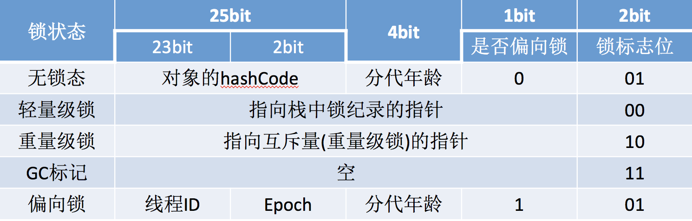

参考视频：https://www.bilibili.com/video/av75634603?from=search&seid=16613913151443645486

零碎知识整合：https://www.bilibili.com/video/av81196439

# 1 同步实现

## 1.1 自旋

```properties
volatile int status = 0;  // 标识--是否有线程在同步方法中--是否有线程上锁成功

void lock(){
	while(!compareAndSet(0,1)){
		// 消耗CPU资源
	}
}

void unlock(){
	status = 0;
}

boolean compareAndSet(int except,int newValue){
	// CAS操作，修改status成功则返回true
}
```

缺点：消耗CPU资源，没有竞争到锁的线程会一直占用CPU的资源进行CAS操作。假如一个线程花费Ns处理业务，那么另一个线程会白白的花费Ns时间浪费CPU。

如何解决：让得不到锁的线程让出CPU。

## 1.2 自旋+yield

```properties
volatile int status = 0;

void lock(){
	while(!compareAndSet(0,1)){
		yield();
	}
}

void unlock(){
	status = 0;
}

boolean compareAndSet(int except,int newValue){
	// CAS操作，修改status成功则返回true
}
```

要解决自旋锁的性能问题必须让竞争锁失败的线程不空转, 而是在获取不到锁的时候能把CPU资源给让出来，yield() 方法就能让出CPU资源，当线程竞争锁失败时，会调用 yield 方法让出CPU。

自旋 + yield 的方式并没有完全解决问题，当系统只有两个线程竞争锁时，yield 是有效的。需要注意的是该方法只是当前让出CPU，有可能操作系统下次还是选择运行该线程，比如里面有 2000 个线程，想想会有什么问题？

## 1.3 自旋+sleep

```properties
volatile int status = 0;

void lock() throws Exception{
	while(!compareAndSet(0,1)){
		sleep(2000);
	}
}

void unlock(){
	status = 0;
}

boolean compareAndSet(int except,int newValue){
	// CAS操作，修改status成功则返回true
}
```

缺点：sleep 的时间为什么是 10？怎么控制呢？很多时候就算你是调用者本身其实你也不知道这个时间是多少

## 1.3 自旋+park

```properties
volatile int status = 0;
Queue packQueue; // 集合 数组 list

void lock() throws Exception{
	while(!compareAndSet(0,1)){
		park();
	}
	// lock 10分钟
	unlock();
}

void unlock(){
	lock_notify();
}

void park(){
	// 将当前的线程加入队列中
	parkQueue.add(currentThread);
	// 将当前线程释放CPU阻塞
	releaseCpu();
}

void lock_notify(){
	// 得到要唤醒的线程的头部线程
	Thread t = parkQueue.header();
	// 唤醒等待线程
	unpark(t);
}

void unpark(Thread t){
	// 
}

void releaseCpu(){

}

boolean compareAndSet(int except,int newValue){
	// CAS操作，修改status成功则返回true
}
```

这种方法就比较完美，当然我写的都伪代码，我看看大师是如何利用这种机制来实现同步的；JDK 的 JUC 包下面ReentrantLock 类的原理就是利用了这种机制。

# 2 ReentrantLock

## 2.1 CAS

JDK1.6之前synchronize是一个重量级的锁，会调用操作系统函数；JDK1.7之后synchronize关键字持续在优化，现在ReentrantLock和synchronize的性能基本差不多。

Java中锁的目的是防止多线程的同步执行

jvm Mutex

线程模式：交替执行，

reentrant

CAS全称（Compare and Swap）比较再交换，对应compareAndSetState这个方法。

Unsafe类是CAS的核心类，提供硬件级别的原子操作。

## 2.2 AQS

AQS指的是AbstractQueuedSynchronizer，维护一个volatile int state（代表共享资源状态）和一个FIFO线程等待队列。AQS依靠同步队列（一个FIFO的双向队列）来完成同步状态的管理。

单线程的情况，交替执行其实和队列无关，是在JDK级别解决了同步问题。


reentrantlock是一个重入锁

## 2.3 自旋


## 2.4 park


## 2.5 重入锁


## 2.6 上锁过程


## 2.7 解锁过程


# 3 ReentrantReadWriteLock

## 3.1 读写锁


# 4 Unsafe

## 4.1 


# 5 Synchronize

整个对象一共16B，其中对象头（ Object header）12B，还有4B是对齐的字节（因为64位虚拟机上对象的大小必须是8的倍数）由于这个对象里面没有任何字段，故而对象的实例数据为0B？两个问题
1、什么叫做对象的实例数据呢？
2、那么对象头里面的12B到底存的是什么呢？
首先要明白什么对象的实例数据很简单，我们可以在A当中添加一个 boolean的字
段，大家都知道 boolean字段占1B，然后再看结果

jvm monitorenter monitor 指令

## 5.1 对象布局



### 5.1.1 实例变量

长度不固定

### 5.1.2 对象头

长度固定

Java的类是由字节码组成的，但是Java对象是由

是否开启指针压缩

对象使用synchronize的状态有5种：

无状态：

偏向锁：

轻量锁：

重量锁：

GC标记：

hashCode是否存在？不存在

unused:25为什么？

#### 5.1.2.1 Mark Word

64位

#### 5.1.2.2 klass pointer

32位，也有可能是64

### 5.1.3 数据对齐

64位的电脑，最小实例对象大小是8个字节的倍数。

## 5.2 工作原理


## 5.3 优化原理


