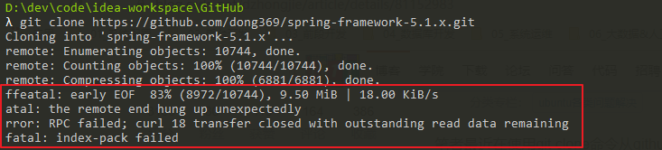

# 1 GitLab初始化项目

git config --global http.postBuffer 524288000




git config --list


##### Git 全局设置

```
git config --global user.name "郭冬冬"
git config --global user.email "18838177689@163.com"
```

##### 创建一个新仓库

```
git clone http://10.4.128.195/project/tz-ui.git
cd tz-ui
touch README.md
git add README.md
git commit -m "add README"
git push -u origin master
```

##### 推送现有文件夹

```
cd existing_folder
git init
git remote add origin http://10.4.128.195/project/tz-ui.git
git add .
git commit -m "Initial commit"
git push -u origin master
```

##### 推送现有的 Git 仓库

```
cd existing_repo
git remote rename origin old-origin
git remote add origin http://10.4.128.195/project/tz-ui.git
git push -u origin --all
git push -u origin --tags
```