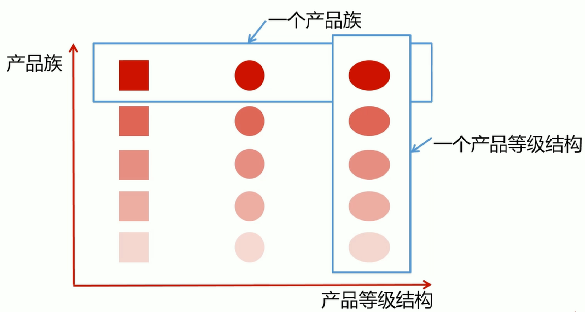

# 1. 工厂模式介绍

## 1.1 定义


## 1.2 角色划分


## 1.3 模式图


## 1.4 实例解析


## 1.5 一句话概况


# 2. 适用场景

## 2.1 场景

- 

## 2.2 JDK源码


## 2.3 开源框架


# 3. 优点/缺点

## 3.1 优点

◆


## 3.2 缺点

◆


# 4. OOP原则

## 4.1 已遵循的原则

- 

## 4.2 未遵循的原则

- 


# 5. 简单工厂

## 5.1 概念理解

> 工厂类负责创建的对象比较少，客户端（应用层）只知道传入工厂类的参数，对于如何创建对象（逻辑）不关心。只需要传入一个正确的参数，就可以获取你所需要的对象，而无须知道其创建细节。工厂类的职责相对过重，增加新的产品，需要修改工厂类的判断逻辑，违背开闭原则。本文介绍了简单工厂模式的概念，优缺点，实现方式，以及结合 Annotation 和反射的改良方案。同时介绍了简单工厂模式（未）遵循的 OOP 原则。最后给出了简单工厂模式在 JDBC 中的应用。
>
> 简单工厂模式（Simple Factory Pattern）又叫静态工厂方法模式（Static FactoryMethod Pattern）。专门定义一个类（如上文中的 CarFactory1、CarFactory2、CarFactory3）来负责创建其它类的实例，由它来决定实例化哪个具体类，从而避免了在客户端代码中显式指定，实现了解耦。该类由于可以创建同一抽象类（或接口）下的不同子类对象，就像一个工厂一样，因此被称为工厂类。

有一种抽象产品——汽车（Car），同时有多种具体的子类产品，如 BenzCar，BMWCar，LandRoverCar。类图如下 
[](http://www.jasongj.com/img/designpattern/simplefactory/product.png)

作为司机，如果要开其中一种车，比如 BenzCar，最直接的做法是直接创建 BenzCar 的实例，并执行其 drive 方法，如下  

```java
package com.jasongj.client;

import com.jasongj.product.BenzCar;

public class Driver1 {

  public static void main(String[] args) {
    BenzCar car = new BenzCar();
    car.drive();
  }

}
```

此时如果要改为开 Land Rover，则需要修改代码，创建 Land Rover 的实例并执行其 drive 方法。这也就意味着任何时候需要换一辆车开的时候，都必须修改客户端代码。

一种稍微好点的方法是，通过读取配置文件，获取需要开的车，然后创建相应的实例并由父类 Car 的引用指向它，利用多态执行不同车的 drive 方法。如下  

<table><tbody><tr><td><pre>1
2
3
4
5
6
7
8
9
10
11
12
13
14
15
16
17
18
19
20
21
22
23
24
25
26
27
28
29
30
31
32
33
34
35
36
37
38
39
40

</pre></td><td><pre>package com.jasongj.client;

import org.apache.commons.configuration.ConfigurationException;
import org.apache.commons.configuration.XMLConfiguration;
import org.slf4j.Logger;
import org.slf4j.LoggerFactory;

import com.jasongj.product.BMWCar;
import com.jasongj.product.BenzCar;
import com.jasongj.product.Car;
import com.jasongj.product.LandRoverCar;

public class Driver2 {

  private static final Logger LOG = LoggerFactory.getLogger(Driver2.class);

  public static void main(String[] args) throws ConfigurationException {
​    XMLConfiguration config = new XMLConfiguration("car.xml");
​    String name = config.getString("driver2.name");
​    Car car;

```
switch (name) {
case "Land Rover":
  car = new LandRoverCar();
  break;
case "BMW":
  car = new BMWCar();
  break;
case "Benz":
  car = new BenzCar();
  break;
default:
  car = null;
  break;
}
LOG.info("Created car name is {}", name);
car.drive();
```

  }

}

</pre></td></tr></tbody></table>

对于 Car 的使用方而言，只需要通过参数即可指定所需要 Car 的各类并得到其实例，同时无论使用哪种 Car，都不需要修改后续对 Car 的操作。至此，简单工厂模式的原型已经形成。如果把上述的逻辑判断封装到一个专门的类的静态方法中，则实现了简单工厂模式。工厂代码如下  

<table><tbody><tr><td><pre>1
2
3
4
5
6
7
8
9
10
11
12
13
14
15
16
17
18
19
20
21
22
23
24
25
26
27
28
29
30
31
32
33
34
35
36
37
38
39
40
41
42
43
44
45

</pre></td><td><pre>package com.jasongj.factory;

import org.apache.commons.configuration.ConfigurationException;
import org.apache.commons.configuration.XMLConfiguration;
import org.slf4j.Logger;
import org.slf4j.LoggerFactory;

import com.jasongj.product.BMWCar;
import com.jasongj.product.BenzCar;
import com.jasongj.product.Car;
import com.jasongj.product.LandRoverCar;

public class CarFactory1 {

  private static final Logger LOG = LoggerFactory.getLogger(CarFactory1.class);

  public static Car newCar() {
​    Car car = null;
​    String name = null;
​    try {
​      XMLConfiguration config = new XMLConfiguration("car.xml");
​      name = config.getString("factory1.name");
​    } catch (ConfigurationException ex) {
​      LOG.error("parse xml configuration file failed", ex);
​    }

```
switch (name) {
case "Land Rover":
  car = new LandRoverCar();
  break;
case "BMW":
  car = new BMWCar();
  break;
case "Benz":
  car = new BenzCar();
  break;
default:
  car = null;
  break;
}
LOG.info("Created car name is {}", name);
return car;
```

  }

}

</pre></td></tr></tbody></table>

调用方代码如下  

<table><tbody><tr><td><pre>1
2
3
4
5
6
7
8
9
10
11
12
13

</pre></td><td><pre>package com.jasongj.client;

import com.jasongj.factory.CarFactory1;
import com.jasongj.product.Car;

public class Driver3 {

  public static void main(String[] args) {
​    Car car = CarFactory1.newCar();
​    car.drive();
  }

}

</pre></td></tr></tbody></table>

与 Driver2 相比，所有的判断逻辑都封装在工厂 (CarFactory1) 当中，Driver3 不再需要关心 Car 的实例化，实现了对象的创建和使用的隔离。

当然，简单工厂模式并不要求一定要读配置文件来决定实例化哪个类，可以把参数作为工厂静态方法的参数传入。

## 2.2 反射实现扩展性

从 Driver2 和 CarFactory1 的实现中可以看到，当有新的车加入时，需要更新 Driver2 和 CarFactory1 的代码也实现对新车的支持。这就违反了`开闭原则`（Open-Close Principle）。可以利用反射（Reflection）解决该问题。  

从上面代码中可以看到，之后如果需要引入新的 Car，只需要在配置文件中指定该 Car 的完整类名（包括 package 名），CarFactory2 即可通过反射将其实例化。实现了对扩展的开放，同时保证了对修改的关闭。熟悉 Spring 的读者应该会想到 Spring IoC 的实现。

## 2.3 注解实现扩展性

上例中使用反射做到了对扩展开放，对修改关闭。但有些时候，使用类的全名不太方便，使用别名会更合适。例如 Spring 中每个 Bean 都会有个 ID，引用 Bean 时也会通过 ID 去引用。像 Apache Nifi 这样的数据流工具，在流程上使用了职责链模式，而对于单个 Processor 的创建则使用了工厂，对于用户自定义的 Processor 并不需要通过代码去注册，而是使用注解（为了更方便理解下面这段代码，请先阅读笔者另外一篇文章[《Java 系列（一）Annotation（注解）》](http://www.jasongj.com/2016/01/17/Java1_%E6%B3%A8%E8%A7%A3Annotation/)）。

下面就继续在上文案例的基础上使用注解升级简单工厂模式。  

<table><tbody><tr><td><pre>1
2
3
4
5
6
7
8
9
10
11
12
13
14
15
16
17
18
19
20
21
22
23
24
25
26
27
28
29
30
31
32
33
34
35
36
37
38
39
40
41
42
43
44
45
46
47
48
49
50
51
52
53
54
55
56
57
58

</pre></td><td><pre>package com.jasongj.factory;

import java.util.Collections;
import java.util.Map;
import java.util.Set;
import java.util.concurrent.ConcurrentHashMap;

import org.apache.commons.configuration.ConfigurationException;
import org.apache.commons.configuration.XMLConfiguration;
import org.reflections.Reflections;
import org.slf4j.Logger;
import org.slf4j.LoggerFactory;

import com.jasongj.annotation.Vehicle;
import com.jasongj.product.Car;

public class CarFactory3 {

  private static final Logger LOG = LoggerFactory.getLogger(CarFactory3.class);

  private static Map&lt;String, Class&gt; allCars;

  static {
​    Reflections reflections = new Reflections("com.jasongj.product");
​    Set&lt;Class&lt;?&gt;&gt; annotatedClasses = reflections.getTypesAnnotatedWith(Vehicle.class);
​    allCars = new ConcurrentHashMap&lt;String, Class&gt;();
​    for (Class&lt;?&gt; classObject : annotatedClasses) {
​      Vehicle vehicle = (Vehicle) classObject.getAnnotation(Vehicle.class);
​      allCars.put(vehicle.type(), classObject);
​    }
​    allCars = Collections.unmodifiableMap(allCars);
  }

  public static Car newCar() {
​    Car car = null;
​    String type = null;
​    try {
​      XMLConfiguration config = new XMLConfiguration("car.xml");
​      type = config.getString("factory3.type");
​      LOG.info("car type is {}", type);
​    } catch (ConfigurationException ex) {
​      LOG.error("Parsing xml configuration file failed", ex);
​    }

```
if (allCars.containsKey(type)) {
  LOG.info("created car type is {}", type);
  try {
    car = (Car) allCars.get(type).newInstance();
  } catch (InstantiationException | IllegalAccessException ex) {
    LOG.error("Instantiate car failed", ex);
  }
} else {
  LOG.error("specified car type {} does not exist", type);
}
return car;
```

  }

}

</pre></td></tr></tbody></table>

从上面代码中可以看到，该工厂会扫描所有被 Vehicle 注解的 Car（每种 Car 都在注解中声明了自己的 type，可作为该种 Car 的别名）然后建立起 Car 别名与具体 Car 的 Class 原映射。此时工厂的静态方法即可根据目标别名实例化对应的 Car。

本文所有代码都可从[作者 GitHub](https://github.com/habren/JavaDesignPattern/tree/master/SimpleFactoryPattern/src/main) 下载.

## 2.4 类图/时序图

简单工厂模式类图如下所示 
[](http://www.jasongj.com/img/designpattern/simplefactory/simple_factory.png)

## 2.5 角色划分

- 工厂角色（如上文中的 CarFactory1/2/3）：这是简单工厂模式的核心，由它负责创建所有的类的内部逻辑。当然工厂类必须能够被外界调用，创建所需要的产品对象。一般而言，工厂类提供一个静态方法，外部程序通过该方法创建所需对象。
- 抽象产品角色 (如上文中的 Car)：简单工厂模式所创建的是所有对象的父类。注意，这里的父类可以是接口也可以是抽象类，它负责描述所创建实例共有的公共接口。
- 具体产品角色（如上文中的 BMWCar，BenzCar，LandRoverCar）：简单工厂所创建的具体实例对象，这些具体的产品往往都拥有共同的父类。

## 2.6 优点/缺点

- 工厂类是整个简单工厂模式的关键所在。它包含必要的判断逻辑，能够根据外界给定的信息（配置，或者参数），决定究竟应该创建哪个具体类的对象。用户在使用时可以直接根据工厂类去创建所需的实例，而无需了解这些对象是如何创建以及如何组织的。有利于整个软件体系结构的优化。
- 通过引入配置文件和反射，可以在不修改任何客户端代码的情况下更换和增加新的具体产品类，在一定程度上提高了系统的灵活性（如 CarFactory2）。
- 客户端无须知道所创建的具体产品类的类名，只需要知道具体产品类所对应的参数即可，对于一些复杂的类名，通过简单工厂模式可以减少使用者的记忆量（如 CarFactory3）。
- 由于工厂类集中了所有实例的创建逻辑，这就直接导致一旦这个工厂出了问题，所有的客户端都会受到牵连。
- 由于简单工厂模式的产品是基于一个共同的抽象类或者接口，这样一来，产品的种类增加的时候，即有不同的产品接口或者抽象类的时候，工厂类就需要判断何时创建何种接口的产品，这就和创建何种种类的产品相互混淆在了一起，违背了单一职责原则，导致系统丧失灵活性和可维护性。
- 正如上文提到的，一般情况下（如 CarFactory1），简单工厂模式违背了 “开放 - 关闭原则”，因为当我们新增加一个产品的时候必须修改工厂类，相应的工厂类就需要重新编译一遍。但这一点可以利用反射（CarFactory3 在本质上也是利用反射）在一定程度上解决（如 CarFactory2）。
- 使用反射可以使简单工厂在一定条件下满足 “开放 - 关闭原则”，但这仅限于产品类的构造及初始化相同的场景。对于各产品实例化或者初始化不同的场景，很难利用反射满足“开放 - 关闭” 原则。
- 简单工厂模式由于使用了静态工厂方法，造成工厂角色无法形成基于继承的等级结构。这一点笔者持保留态度，因为继承不是目的，如果没有这样的需求，这一点完全不算缺点，例如 JDBC 的 DriverManager。

## 2.7 已遵循的原则

- 依赖倒置原则
- 迪米特法则
- 里氏替换原则
- 接口隔离原则

## 2.8 未遵循的原则

- 开闭原则（如上文所述，利用配置文件 + 反射或者注解可以避免这一点）
- 单一职责原则（工厂类即要负责逻辑判断又要负责实例创建）

简单工厂模式在 JDK 中最典型的应用要数 JDBC 了。可以把关系型数据库认为是一种抽象产品，各厂商提供的具体关系型数据库（MySQL，PostgreSQL，Oracle）则是具体产品。DriverManager 是工厂类。应用程序通过 JDBC 接口使用关系型数据库时，并不需要关心具体使用的是哪种数据库，而直接使用 DriverManager 的静态方法去得到该数据库的 Connection。  

<table><tbody><tr><td><pre>1
2
3
4
5
6
7
8
9
10
11
12
13
14
15
16
17
18
19
20
21
22
23
24
25
26
27
28
29
30
31
32
33
34
35
36

</pre></td><td><pre>package com.jasongj.client;

import java.sql.Connection;
import java.sql.DriverManager;
import java.sql.PreparedStatement;
import java.sql.SQLException;

import org.slf4j.Logger;
import org.slf4j.LoggerFactory;

public class JDBC {

  private static final Logger LOG = LoggerFactory.getLogger(JDBC.class);

  public static void main(String[] args) {
​    Connection conn = null;
​    try {
​      Class.forName("org.apache.hive.jdbc.HiveDriver");
​      conn = DriverManager.getConnection("jdbc:hive2://127.0.0.1:10000/default");
​      PreparedStatement ps = conn.prepareStatement("select count(*) from test.test");
​      ps.execute();
​    } catch (SQLException ex) {
​      LOG.warn("Execute query failed", ex);
​    } catch(ClassNotFoundException e) {
​      LOG.warn("Load Hive driver failed", e);
​    } finally {
​      if(conn != null ){
​        try {
​          conn.close();
​        } catch (SQLException e) {
​          // NO-OPT
​        }
​      }
​    }
  }
}

## 2.9 实际应用

### 2.9.1 Calendar类


# 6. 工厂方法

两种工厂模式都能生成不同类型的产品ABC。之所以说简单工厂弹性较差是因为如果要增加产品D的时候，必须修改原来工厂的方法，可能会影响到产品AB。而工厂方法模式中，只要增加制造产品D的相关子类就行，不会对其他产品产生影响。

# 7. 抽象工厂




# 9. Bean工厂


# 9. 相关设计模式


