# 1 Nexus环境

局域网内jar包共享！！！

## 1.1 下载


## 1.2 创建仓库

1、创建npm（hosted）私有仓库

hosted改成allow redeploy，这样才能运行重复上传一个包，不然会报400：bad request

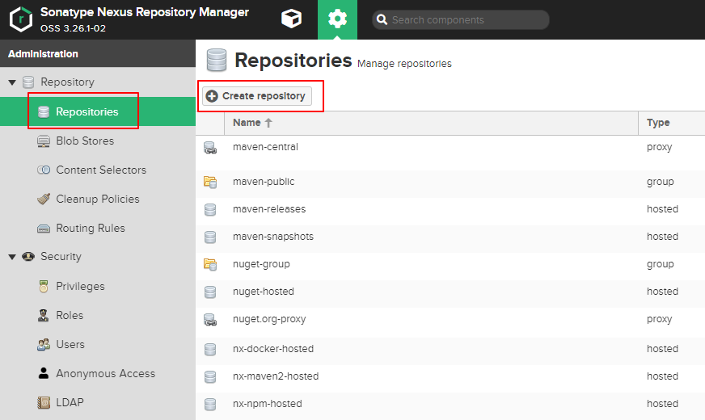

选择对应的参考类型

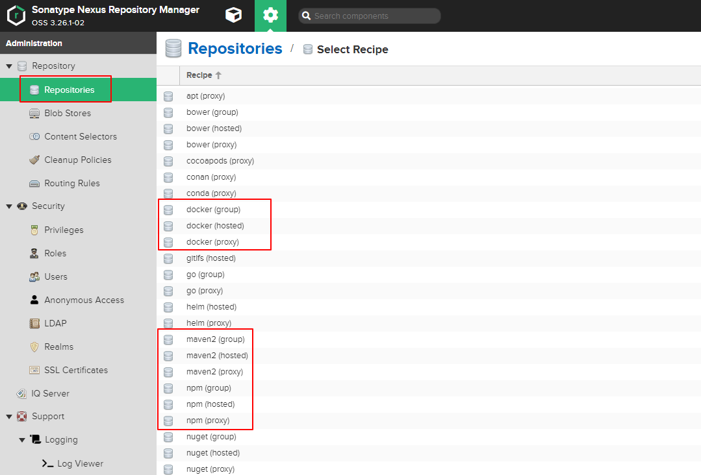


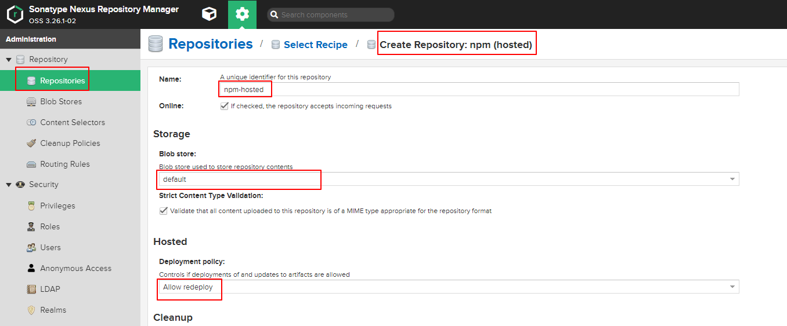

2、创建npm（proxy）仓库

name：npm-proxy的remote storage设置：当私有仓库和代理仓库缓存包里无请求的包时，就会通过这里配置的地址去服务器下载需要的包，然后再缓存下来。我填的是淘宝镜像：https://registry.npm.taobo.org。npm官网的下载有点慢

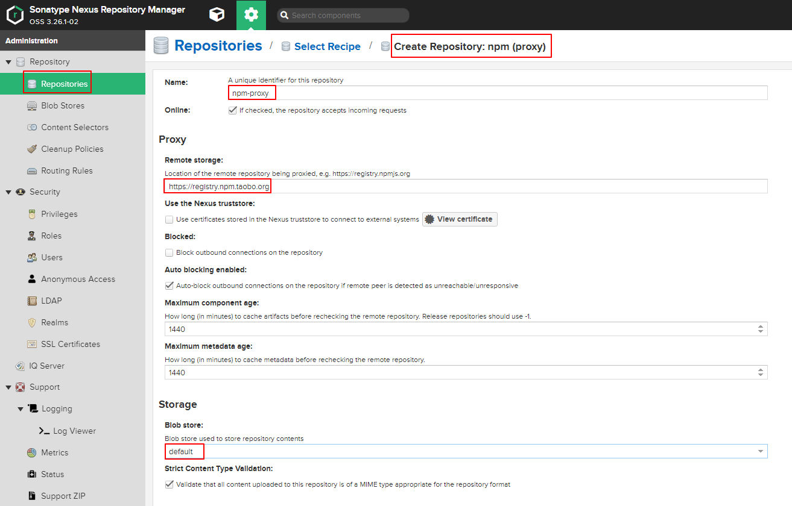

3、创建npm（group）仓库

name：npm-group，是仓库组的名称。可以包含任何npm的仓库。最终npm install等操作时的地址将会是这个仓库组的地址。group中，将刚创建的私有仓库（npm-hosted）和代理仓库（npm-proxy）拖动到右边。

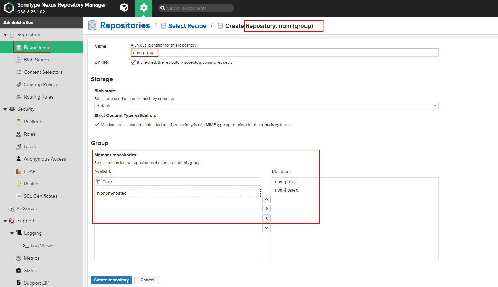

4、配置权限
一定不能忘，不然在adduser和publish会一直报错401：

Unable to authenticate, need: BASIC realm="Sonatype Nexus Repository Manager"

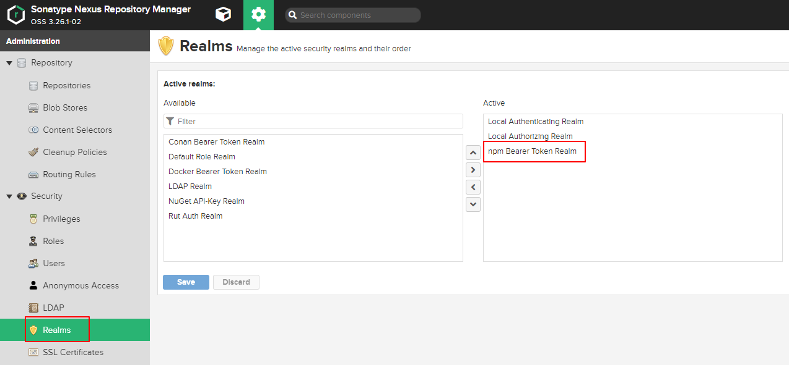

# 2 同步jar包

maven-releases，type是hosted

maven-snapshots，type是hosted

maven-central，type是proxy

maven-public，type是group

## 2.1 Nexus3界面


## 2.2  命令上传

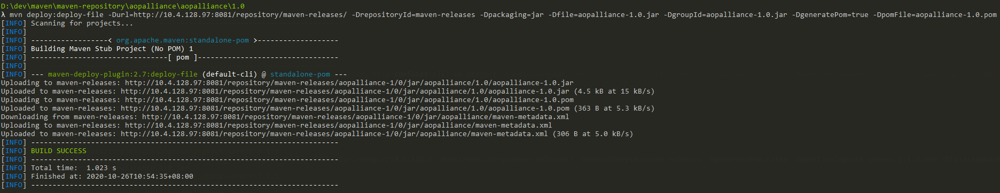

1、jar包

```bash
mvn deploy:deploy-file -Durl=http://10.4.128.97:8081/repository/maven-releases/ -DrepositoryId=maven-releases -Dpackaging=jar -Dfile=aopalliance-1.0.jar -DgroupId=aopalliance-1.0.jar -DartifactId=aopalliance -Dversion=1.0

mvn deploy:deploy-file -Durl=http://10.4.128.97:8081/repository/maven-releases/ -DrepositoryId=maven-releases -Dpackaging=jar -Dfile=aopalliance-1.0.jar -DgroupId=aopalliance-1.0.jar -DgeneratePom=true -DpomFile=aopalliance-1.0.pom
```

2、pom

```bash
mvn -s D:\dev\maven\apache-maven-3.6.3\conf\settings.xml deploy:deploy-file -Durl=http://10.4.128.97:8081/repository/maven-releases/ -DrepositoryId=maven-releases -DgeneratePom=false -DpomFile=logback-parent-1.1.1.pom -Dfile=logback-parent-1.1.1.pom -DgroupId=logback-parent-1.1.1.pom
```

```properties
-DgroupId=sxd.jar　　　　 　　　　　　　　　　　　　　　　　　　　　 自定义
-DartifactId=jacob　　　 　　　　　　　　　　　　　　　　　　　　　 自定义
-Dversion=1.18　　　　　　 　　　　　　　　　　　　　　　　　　　　　自定义，构成pom.xml文件中的坐标
-Dpackaging=jar　　　　　　　　　　　　　　　　　　　　　　　　　　 上传的类型是jar类型
-Dfile=G:\jar\jacob-1.18.jar　　　　　　　　　　　　　　　　　　　jar的本地磁盘位置
-Durl=http://localhost:8081/repository/myself_hosted/　　　　hosted资源库的地址，下图中
-DrepositoryId=myself_hosted　　　　　　　　　　　　　　　　　　　setting.xml文件中配置的ID
```

## 2.3 批量上传

1、maven配置

```java
<servers>
    <server>  
    <id>maven-releases</id>  
    <username>nx-xx</username>  
    <password>nx-xx</password>  
</server>
```

2、Java程序

```java
package com.io;

import java.io.*;
import java.nio.charset.StandardCharsets;
import java.util.Objects;
import java.util.concurrent.ExecutorService;
import java.util.concurrent.Executors;
import java.util.regex.Pattern;

/**
 * The class/interface
 *
 * @author guod
 * @version 1.0 use jdk 1.8
 */
public class Deploy {
    public static void main(String[] args) {
        deploy(Objects.requireNonNull(new File("D:\\dev\\maven\\maven-repository\\antlr\\antlr").listFiles()));
//        if(checkArgs(args)){
//            File file = new File(args[0]);
//            deploy(file.listFiles());
//        }
        EXECUTOR_SERVICE.shutdown();
        try {
            ERROR.close();
        } catch (IOException e) {
            e.printStackTrace();
        }
    }

    /**
     * mvn -s F:\.m2\settings.xml
     * org.apache.maven.plugins:maven-deploy-plugin:2.8.2:deploy-file
     * -Durl=http://IP:PORT/nexus/content/repositories/thirdpart
     * -DrepositoryId=thirdpart
     * -Dfile=antlr-2.7.2.jar
     * -DpomFile=antlr-2.7.2.pom
     * -Dpackaging=jar
     * -DgeneratePom=false
     * -Dsources=./path/to/artifact-name-1.0-sources.jar
     * -Djavadoc=./path/to/artifact-name-1.0-javadoc.jar
     */
    public static final String BASE_CMD = "cmd /c mvn " +
            "-s D:/dev/maven/apache-maven-3.6.3/conf/settings.xml " +
            "deploy:deploy-file " +
            "-Durl=http://xx.xx.xx.xx:8081/repository/maven-releases/ " +
            "-DrepositoryId=maven-releases " +
            "-DgroupId=com.io " +
            "-DgeneratePom=false";

    public static final Pattern DATE_PATTERN = Pattern.compile("-[\\d]{8}\\.[\\d]{6}-");

    public static final Runtime CMD = Runtime.getRuntime();

    public static final Writer ERROR;

    public static final ExecutorService EXECUTOR_SERVICE = Executors.newFixedThreadPool(10);

    static {
        Writer err = null;
        try {
            err = new OutputStreamWriter(new FileOutputStream("deploy-error.log"), StandardCharsets.UTF_8);
        } catch (Exception e) {
            e.printStackTrace();
            System.exit(0);
        }
        ERROR = err;
    }

    public static void error(String error) {
        try {
            System.err.println(error);
            ERROR.write(error + "\n");
            ERROR.flush();
        } catch (IOException e) {
            e.printStackTrace();
        }
    }

    public static boolean checkArgs(String[] args) {
        if (args.length != 1) {
            System.out.println("用法如： java -jar Deploy D:\\some\\path\\");
            return false;
        }
        File file = new File(args[0]);
        if (!file.exists()) {
            System.out.println(args[0] + " 目录不存在!");
            return false;
        }
        if (!file.isDirectory()) {
            System.out.println("必须指定为目录!");
            return false;
        }
        return true;
    }

    public static void deploy(File[] files) {
        if (files.length == 0) {
            //ignore
        } else if (files[0].isDirectory()) {
            for (File file : files) {
                if (file.isDirectory()) {
                    deploy(Objects.requireNonNull(file.listFiles()));
                }
            }
        } else if (files[0].isFile()) {
            File pom = null;
            File jar = null;
            File source = null;
            File javadoc = null;
            //忽略日期快照版本，如 xxx-mySql-2.2.6-20170714.095105-1.jar
            for (File file : files) {
                String name = file.getName();
                if (DATE_PATTERN.matcher(name).find()) {
                    //skip
                } else if (name.endsWith(".pom")) {
                    pom = file;
                } else if (name.endsWith("-javadoc.jar")) {
                    javadoc = file;
                } else if (name.endsWith("-sources.jar")) {
                    source = file;
                } else if (name.endsWith(".jar")) {
                    jar = file;
                }
            }
            if (pom != null) {
                if (jar != null) {
                    deploy(pom, jar, source, javadoc);
                } else if (packingIsPom(pom)) {
                    deployPom(pom);
                }
            }
        }
    }

    public static boolean packingIsPom(File pom) {
        BufferedReader reader = null;
        try {
            reader =
                    new BufferedReader(new InputStreamReader(new FileInputStream(pom)));
            String line;
            while ((line = reader.readLine()) != null) {
                if (line.trim().contains("pom")) {
                    return true;
                }
            }
        } catch (Exception e) {
            e.printStackTrace();
        } finally {
            try {
                reader.close();
            } catch (Exception ignored) {
            }
        }
        return false;
    }

    public static void deployPom(final File pom) {
        EXECUTOR_SERVICE.execute(new Runnable() {
            @Override
            public void run() {
                StringBuilder cmd = new StringBuilder(BASE_CMD);
                cmd.append(" -DpomFile=").append(pom.getName());
                cmd.append(" -Dfile=").append(pom.getName());
                try {
                    final Process proc = CMD.exec(cmd.toString(), null, pom.getParentFile());
                    InputStream inputStream = proc.getInputStream();
                    InputStreamReader inputStreamReader = new InputStreamReader(inputStream);
                    BufferedReader reader = new BufferedReader(inputStreamReader);
                    String line;
                    StringBuffer logBuffer = new StringBuffer();
                    logBuffer.append("\n\n\n==================================\n");
                    while ((line = reader.readLine()) != null) {
                        if (line.startsWith("[INFO]") || line.startsWith("Upload")) {
                            logBuffer.append(Thread.currentThread().getName() + " : " + line + "\n");
                        }
                    }
                    System.out.println(logBuffer);
                    int result = proc.waitFor();
                    if (result != 0) {
                        error("上传失败：" + pom.getAbsolutePath());
                    }
                } catch (IOException | InterruptedException e) {
                    error("上传失败：" + pom.getAbsolutePath());
                    e.printStackTrace();
                }
            }
        });
    }

    public static void deploy(final File pom, final File jar, final File source, final File javadoc) {
        EXECUTOR_SERVICE.execute(new Runnable() {
            @Override
            public void run() {
                StringBuilder cmd = new StringBuilder(BASE_CMD);
                cmd.append(" -DpomFile=").append(pom.getName());
                if (jar != null) {
                    //当有bundle类型时，下面的配置可以保证上传的jar包后缀为.jar
                    cmd.append(" -Dpackaging=jar -Dfile=").append(jar.getName());
                } else {
                    cmd.append(" -Dfile=").append(pom.getName());
                }
                if (source != null) {
                    cmd.append(" -Dsources=").append(source.getName());
                }
                if (javadoc != null) {
                    cmd.append(" -Djavadoc=").append(javadoc.getName());
                }

                try {
                    final Process proc = CMD.exec(cmd.toString(), null, pom.getParentFile());
                    InputStream inputStream = proc.getInputStream();
                    InputStreamReader inputStreamReader = new InputStreamReader(inputStream);
                    BufferedReader reader = new BufferedReader(inputStreamReader);
                    String line;
                    StringBuffer logBuffer = new StringBuffer();
                    logBuffer.append("\n\n\n=======================================\n");
                    while ((line = reader.readLine()) != null) {
                        if (line.startsWith("[INFO]") || line.startsWith("Upload")) {
                            logBuffer.append(Thread.currentThread().getName() + " : " + line + "\n");
                        }
                    }
                    System.out.println(logBuffer);
                    int result = proc.waitFor();
                    if (result != 0) {
                        error("上传失败：" + pom.getAbsolutePath());
                    }
                } catch (IOException | InterruptedException e) {
                    error("上传失败：" + pom.getAbsolutePath());
                    e.printStackTrace();
                }
            }
        });
    }
}
```

3、检查上传的目标maven仓库配置Deployment Policy设置为Allow Redeploy而不是Disable Redeploy，这一步比较重要，是否允许重新发布上传。

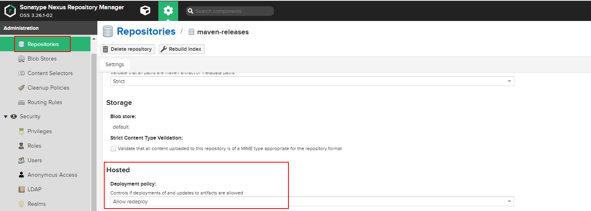

# 3 NPM包

```shell
npm config set registry http://xx.xx.xx.xx:8081/repository/npm-hosted/
```

## 3.1 命令上传

1、创建一个文件夹test-npm

2、初始化package.json文件

```js
npm init -y
```

在文件夹中创建js文件如：index.js

3、进入test-npm文件夹，登录私服

当npm adduser和npm login时，操作的仓库**一定是hosted**，是私有的，不能是group。因为我们的包是要发布到hosted。

```yaml
npm login --registry=http://xx.xx.xx.xx:8081/repository/npm-hosted/ # 输入用户名、密码、邮箱
```

4、执行上传

```yaml
npm publish --registry=http://xx.xx.xx.xx:8081/repository/npm-hosted/
```

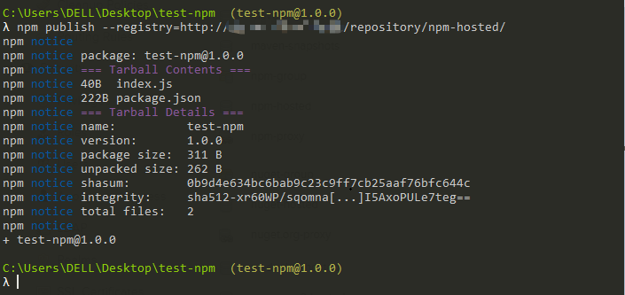

5、执行下载

```json
npm install test-npm@1.0.0
npm -loglevel info install test-npm@1.0.0
```

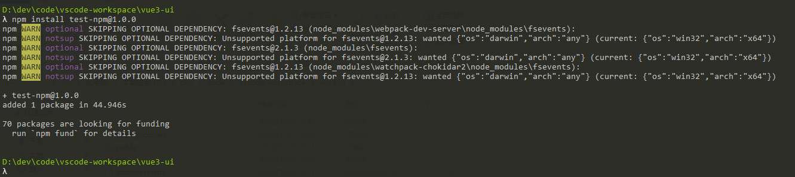

## 3.2 批量上传

```java
package com.io.sync;

import java.io.*;
import java.nio.charset.Charset;
import java.util.Objects;

/**
 * The class/interface
 * 如果你的nexus已经配置好，并且可以单个手动上传，那么可以试试下面的批量上传！！！
 *
 * @author guod
 * @version 1.0 use jdk 1.8
 */
public class NpmDeploy {
    /**
     * 示例   我的 npm 包都在 F:\\file\\demo\\node_modules 下.
     * 我就给这个路径
     * 执行后会在我当前输入的路径后. F:\\file\\demo\\ 下生成两个txt文件.
     * successLoad.txt 为npm包上传成功的文件信息
     * errorLoad.txt 为npm包上传失败的文件信息!!
     */
    public static void main(String[] args) {
        String files = NpmDeploy.getFiles("D:\\dev\\soft\\Webs\\node-v12.18.4-win-x64\\node_modules\\npm\\node_modules");
        System.out.println(files);
    }

    /**
     * 获取每一个上传的 npm 包的路径
     *
     * @param path = 根路径,比如项目文件 node_modules
     */
    public static String getFiles(String path) {
        File file = new File(path);
        int[] count = {0, 0};     //0 = 上传成功,  1= 上传失败
        if (file.isDirectory()) {
            // 获取路径下的所有文件
            File[] files = file.listFiles();
            for (int i = 0; i < Objects.requireNonNull(files).length; i++) {
                //如果还是文件夹 递归获取里面的文件 文件夹
                if (files[i].isDirectory()) {
                    System.out.println("开始上传：" + files[i].getName() + "包\t" + "目录：" + files[i].getPath());
                    //上传npm包
                    System.out.println(isPackage(files[i], count));
                } else {
                    String message = (count[1] += 1) + "\t\t\t" + files[i].getName() + "文件不是 NPM 包 , 路径：" + files[i].getPath();
                    System.out.println(message);
                    //写入错误上传信息.该路径为 node_modules 包的父级路径下\\errorLoad.txt
                    fileWrite(file, message, "errorLoad.txt");
                }
            }
        } else {
            return "路径输入错误,该路径不是node_modules集合：" + file.getPath();
        }
        return "上传完毕,成功上传" + count[0] + "个文件";
    }


    /**
     * 上传npm包
     *
     * @param file  = 当前npm包的路径,
     * @param count = 写入提示信息文件时的下标!!
     * @return = 提示信息
     */
    public static String isPackage(File file, int[] count) {
        InputStream error = null;
        File[] files = file.listFiles();
        for (int i = 0; i < Objects.requireNonNull(files).length; i++) {
            if (files[i].isFile() && files[i].getName().equals("package.json")) {
                try {
                    //执行上传npm 包的语句
                    //这里的 cmd /c F: 需要更改,你要上传的npm包在哪个盘你就改成什么
                    //比如路径在 `D` 盘, 那么改成    command.append("cmd /c D:");
                    String command = "cmd /c D:" +
                            String.format(" && cd %s", file.getPath()) +
                            //这里为自己的NPM私服路径
                            " && npm publish -registry=http://xx.xx.xx.xx:8081/repository/npm-hosted/";
                    Process p = Runtime.getRuntime().exec(command);
                    error = p.getErrorStream(); //获取执行cmd命令后的错误信息

                    BufferedReader errorReader = new BufferedReader(new InputStreamReader(error, Charset.forName("GBK")));
                    String s;
                    //输出命令执行后的提示信息
                    while ((s = errorReader.readLine()) != null) {
                        System.out.println(s);
                    }
                    errorReader.close();
                    p.waitFor();
                    if (p.exitValue() != 0) {
                        File errorFile = file.getParentFile();
                        String message = (count[1] += 1) + "\t\t\t" + file.getName() + "文件上传失败,路径:" + file.getPath();
                        fileWrite(errorFile, message, "errorLoad.txt");
                        return file.getName() + "包上传失败";
                    } else {
                        File errorFile = file.getParentFile();
                        String message = (count[0] += 1) + "\t\t\t" + file.getName() + "文件上传成功,路径:" + file.getPath();
                        fileWrite(errorFile, message, "successLoad.txt");
                        return file.getName() + "包上传成功";
                    }
                } catch (Exception e) {
                    if (error != null) {
                        try {
                            error.close();
                        } catch (Exception ex) {
                            ex.printStackTrace();
                        }
                    }
                    return e.getMessage();
                }
            }
        }
        File errorFile = file.getParentFile();
        String message = (count[1] += 1) + "\t\t\t" + file.getName() + "没有package.json 文件,路径:" + file.getPath();
        fileWrite(errorFile, message, "errorLoad.txt");
        return file.getName() + "上传失败,没有package.json文件";
    }


    /**
     * 文件上传成功和失败后. 写入文件存储执行信息!
     *
     * @param file
     * @param message
     * @param fileName
     */
    private static void fileWrite(File file, String message, String fileName) {
        try {
            String path = file.getParent() + File.separator + fileName;
            File parentDir = new File(path); // null
            if (!file.exists()) {
                boolean newFile = parentDir.createNewFile();//如果txt文件不存在,那么创建
            }
            FileWriter writer = new FileWriter(parentDir, true);
            writer.write(message + System.getProperty("line.separator"));
            writer.flush();
            writer.close();
        } catch (IOException e) {
            e.printStackTrace();
        }
    }
}
```

# 3 Maven项目

## 3.1 maven配置

1、nexus服务配置，在搭建号nexus服务中，有两个类型的库可以推送，分别是releases和snapshots，在本地搭建的nexus服务中，找到这两个库对应的URL

```properties
http://localhost:8082/repository/maven-releases/
http://localhost:8082/repository/maven-snapshots/
```

2、在安装好的maven服务中，找到settingxml 配置文件，作如下配置：

```xml
<localRepository>D:/dev/maven/maven-repository</localRepository>

<mirrors>
    <mirror>
        <id>alimaven</id>
        <name>aliyun maven</name>
        <url>http://maven.aliyun.com/nexus/content/groups/public/</url>       
        <mirrorOf>central</mirrorOf>        
    </mirror>
</mirrors>

<servers>
      <server>
            <id>maven-releases</id>
            <username>admin</username>
            <password>admin123</password>
      </server>
      <server>
            <id>maven-snapshots</id>
            <username>admin</username>
            <password>admin123</password>
      </server>
</servers>
```

## 3.2 项目pom

1、Maven推送当前项目到私服，在项目pom.xml文件中，做如下配置

```xml
<distributionManagement>
    <repository>
        <id>maven-releases</id>
        <url>http://localhost:8082/repository/maven-releases/</url>
    </repository>
    <snapshotRepository>
        <id>maven-snapshots</id>
        <url>http://localhost:8082/repository/maven-snapshots/</url>
    </snapshotRepository>
</distributionManagement>
```

配置完成后，回到该项目文件的根目录先后执行 maven clean install / maven clean deploy

2、从远程仓库下载，做如下配置

在全局配置文件setting.xml，只配置一个中央仓库的镜像，即mirrorOf为central的镜像只配置一个，此处的mirrorOf不能随便写，要和repository name标签的一致。

maven获取真正起作用的repository集合流程：首先会获取pom.xml里的repository集合，然后在settings.xml里找mirrors元素。如果**repository的id和mirror的mirrorOf**的值相同，则该mirror替代该repository。如果该repository找不到对应的mirror，则使用其本身，依此可以得到最终起作用的repository集合Internal Artifactory Maven repository作为私服，mirrorOf配置为*来提供中央仓库中不存在的jar包。

注意：id和name和代理仓库的Name一致

```xml
<repositories>
	<repository>
		<id>maven-public</id>
		<name>maven-public</name>
		<url>http://xx.xx.xx.xx:8081/repository/maven-public/</url>
		<snapshots>
			<enabled>false</enabled>
		</snapshots>
		<releases>
			<enabled>true</enabled>
		</releases>
	</repository>
</repositories>
```

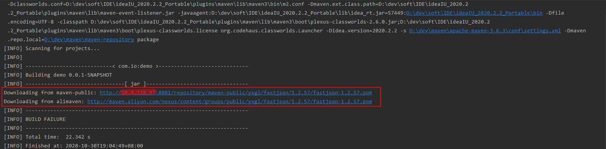

先从私服中找，如果没有会去阿里云中心仓库中获取！！！

# 4 Npm项目

## 4.1 