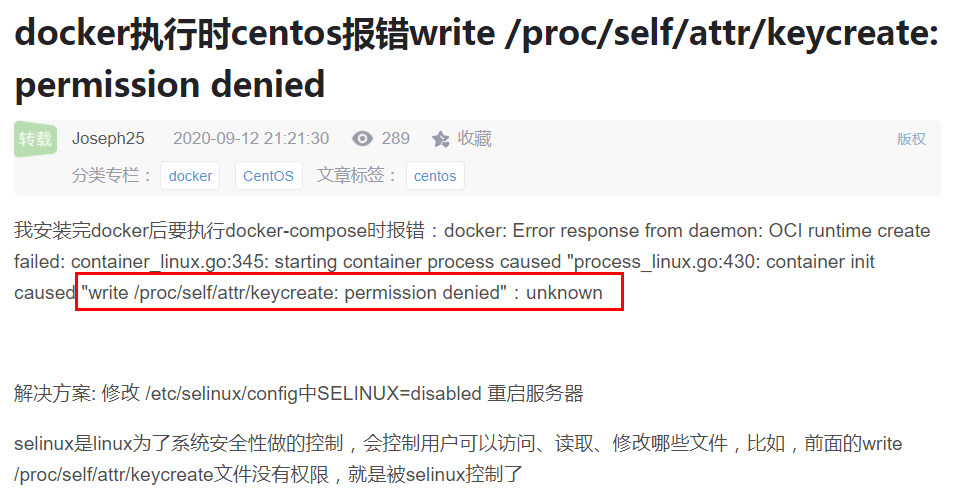

# 1 版本信息

## 1.1 发行版本

> 1.	[Redhat](https://www.ubuntu.com/index_kylin)、[CentOS](https://www.centos.org/)，Redhat安装包需要收费的，一般选择CentOS
> 2.	Ubuntu 12.04 64位
> 3.	Suse
> 4.	Debian
> 5.	Mandriva
> 6.	红旗

## 1.2 版本信息

```properties
cat /etc/os-release
uname -r // 内核信息
cat /etc/redhat-release // Linux查看版本当前操作系统发行版信息
cat /proc/version // 说明正在运行的内核版本。

cat /etc/issue // 显示的是发行版本信息
lsb_release -a // 适用于所有的linux，包括Redhat、SuSE、Debian等发行版，但是在debian下要安装lsb
```

## 1.3 查看帮助

```properties
ls --help  // 显示shell内部的帮助信息
man ls  // 查看Linux中的指令帮助、配置文件帮助和编程帮助等信息。
info ls  // 是man指令的详细内容

help if    // shell脚本帮助说明
```

## 1.4 系统结构

```properties
/home	    // 主目录，/home/ubuntu  /home/ubuntu2,...
/usr/local	// 用户级的程序目录，可以理解为C:/Progrem Files/，编译软件安装到该目录下，默认安装目录
/opt        // 用户级的程序目录，可以理解为D:/dev/soft，opt有可选的意思，第三方软件直接rm -rf掉即可
/etc		// 配置文件目录
/root(~)	// root用户的主目录
/usr/local/bin	// 自定义可执行文件
/usr/local/sbin	// 自定义可执行文件
/bin		// 二进制文件目录
/sbin		// 二进制文件目录
/dev		// 存取设备目录。在Linux中，任何设备都是以文本形态存在于这个目录中的，如cpu，disk等
/lib		// 库文件,共享对象文件(so---shared object,等价于dll文件。)	
/meida		// 可移除的设备目录，如光盘，DVD
/mnt	    // 暂时挂载的设备目录
/usr		// user用户
/usr/bin	// 可执行文件
/usr/sbin	// 可执行文件	
```

# 2 版本下载

[清华大学 TUNA 协会](https://tuna.moe/)

[阿里巴巴开源镜像站](https://opsx.alibaba.com/)

[网易开源镜像站](http://mirrors.163.com/)

## 2.1 CentOS系统
```properties
CentOS-6.4-x86_64-minimal.iso       // 最小化安装，安装必须的软件，类似于精简版，无桌面界面（推荐）
CentOS-6.4-x86_64-netinstall.iso    // 网络安装镜像
CentOS-6.4-x86_64-bin-DVD1.iso      // 完整版的安装盘 
CentOS-6.4-x86_64-bin-DVD2.iso      // 对完整版安装盘的软件进行补充和升级。
```
## 2.2 Ubuntu系统
```properties
Ubuntu-17.04-server-amd64.iso   // 服务版系统，无桌面界面（推荐）
Ubuntu-17.04-desktop-amd64.iso  // 桌面版系统
```

# 3 系统信息

## 3.1 CentOS

### 3.1.1 内核

```properties
rpm -qa|grep kernel
uname -r
```

### 3.1.2 CPU

```properties
lscpu   // 查看cpu总体信息

cat /proc/cpuinfo  // 查看内存中保存的每个cpu信息

top // cpu使用情况
```

### 3.1.3 硬盘

```properties
fdisk -l
df -hl
du -sh * | sort -nr

lsblk -d -o name,rota    // ROTA是1的表示可以旋转，反之则不能旋转。
```

### 3.1.4 内存

```properties
free

free -hl
```

### 3.1.5 时间

```shell
$> date
$> cla
```


## 3.2 Ubunto

### 3.2.1 内核


### 3.2.2 CPU


### 3.2.3 硬盘


### 3.2.3 内存


## 3.3 系统组/用户

### 3.3.1 CentOS

#### 3.3.1.1 用户组

```properties
cat /etc/group 或 groups // 查看用户组

groupadd guoddgroup // 添加用户组

groupdel guoddgroup // 删除用户组
```

#### 3.3.1.2 用户

```properties
useradd -g guoddgroup guodd // 添加用户

passwd guodd // 进行密码修改

userdel -r guodd // 删除用户guodd，同时删除他的工作目录
```

#### 3.3.1.3 文件拥有者

```properties
chown -R guodd:guoddgroup file
```

#### 3.3.1.4 文件权限

```properties
chmod -R 777 file    // 4+2+1
chmod +x file // 添加执行权限
```

### 3.3.2 Ubunto


# 4 基础配置

## 4.1 CentOS基础软件

CentOS的软件安装工具不是apt-get 是yum，安装基础环境和rz上传。

```properties
yum -y update
yum -y install net-tools wget curl lrzsz lsof nc telnet-server telnet.* rsync
yum -y install psmisc  # pstree以树结构显示进程
yum -y install gcc gcc-c++ pcre pcre-devel zlib zlib-devel openssl openssl-devel
yum -y install libstdc++-devel
yum -y install unzip zip
```

## 4.2 Ubunto基础软件

Ubunto的软件安装工具apt-get ，安装基础环境和rz上传。

```properties
sudo apt-get install lrzsz
sudo apt-get install openssh-server openssh-client
sudo /etc/init.d/ssh restart
```

## 4.2 重启命令

> 1、reboot
> 2、shutdown -r now 立刻重启(root用户使用)
> 3、shutdown -r 10 过10分钟自动重启(root用户使用)
> 4、shutdown -r 20:35 在时间为20:35时候重启(root用户使用)

## 4.3 关机命令

> 1、halt   立刻关机
> 2、poweroff  立刻关机
> 3、shutdown -h now 立刻关机(root用户使用)
> 4、shutdown -h 10 10分钟后自动关机

## 4.4 用户切换命令：su

> 1、使用su命令：只是切换了root身份，但Shell环境仍然是普通用户的Shell
> 2、使用su -命令：连用户和Shell环境一起切换成root身份

```properties
sudo：表示获取临时的root权限执行命令。
su - root：以root身份登录。
su root/其他命令：与root建立一个连接，通过root执行命令。
```

# 5 配置阿里YUM源

[参考地址](<https://opsx.alibaba.com/?lang=zh-CN>)

## 5.1 CentOS

### 5.1.1 备份

备份原始YUM文件

```properties
mv /etc/yum.repos.d/CentOS-Base.repo /etc/yum.repos.d/CentOS-Base.repo.backup
```

### 5.1.2 下载新的YUM文件

```properties
curl -o /etc/yum.repos.d/CentOS-Base.repo http://mirrors.aliyun.com/repo/Centos-7.repo
```

### 5.1.3 更新缓存

```properties
yum makecache
```

## 5.2 Ubunto

### 5.2.1 备份

```properties
sudo cp /etc/apt/sources.list /etc/apt/sources.list.bak
```

### 5.2.2 添加源信息

```properties
sudo vim /etc/apt/sources.list
# 阿里镜像源
deb https://mirrors.ustc.edu.cn/ubuntu/ bionic main restricted universe multiverse
deb-src https://mirrors.ustc.edu.cn/ubuntu/ bionic main restricted universe multiverse
deb https://mirrors.ustc.edu.cn/ubuntu/ bionic-updates main restricted universe multiverse
deb-src https://mirrors.ustc.edu.cn/ubuntu/ bionic-updates main restricted universe multiverse
deb https://mirrors.ustc.edu.cn/ubuntu/ bionic-backports main restricted universe multiverse
deb-src https://mirrors.ustc.edu.cn/ubuntu/ bionic-backports main restricted universe multiverse
deb https://mirrors.ustc.edu.cn/ubuntu/ bionic-security main restricted universe multiverse
deb-src https://mirrors.ustc.edu.cn/ubuntu/ bionic-security main restricted universe multiverse
deb https://mirrors.ustc.edu.cn/ubuntu/ bionic-proposed main restricted universe multiverse
deb-src https://mirrors.ustc.edu.cn/ubuntu/ bionic-proposed main restricted universe multiverse
# 中科大镜像源
deb http://mirrors.aliyun.com/ubuntu/ bionic main restricted universe multiverse
deb http://mirrors.aliyun.com/ubuntu/ bionic-security main restricted universe multiverse
deb http://mirrors.aliyun.com/ubuntu/ bionic-updates main restricted universe multiverse
deb http://mirrors.aliyun.com/ubuntu/ bionic-proposed main restricted universe multiverse
deb http://mirrors.aliyun.com/ubuntu/ bionic-backports main restricted universe multiverse
deb-src http://mirrors.aliyun.com/ubuntu/ bionic main restricted universe multiverse
deb-src http://mirrors.aliyun.com/ubuntu/ bionic-security main restricted universe multiverse
deb-src http://mirrors.aliyun.com/ubuntu/ bionic-updates main restricted universe multiverse
deb-src http://mirrors.aliyun.com/ubuntu/ bionic-proposed main restricted universe multiverse
deb-src http://mirrors.aliyun.com/ubuntu/ bionic-backports main restricted universe multiverse
```

### 5.2.3 更新缓存

```properties
sudo apt-get update
```

# 6 其它配置

## 6.1 CentOS其它配置

### 6.1.1 服务名称管理

uname -a

1、更改hostname

```properties
vi /etc/hostname

c10
```

2、配置hosts，修改dns解析

```properties
vi /etc/hosts

192.168.10.10 s10
192.168.10.11 s11
```

### 6.1.2 计划任务

1、服务安装

```properties
systemctl status crond.service # 检查服务是否在运行

yum install vixie-cron
yum install crontabs

systemctl restart crond.service # 启动服务
systemctl reload crond.service  # 重新载入配置
systemctl status crond.service  # 查看crontab服务状态
systemctl enable crond.service  # 开机自启动

crontab -e # 进入定时任务编辑
```

2、相关参数

```properties
基本格式 :　　
* * 　 *　 *　 *　　command　　
分　 时　 日　 月　 周　 命令　　
第1列表示分钟1～59 每分钟用*或者 */1表示　　
第2列表示小时1～23（0表示0点）　　
第3列表示日期1～31　　
第4列表示月份1～12　　
第5列标识号星期0～6（0表示星期天）　　
第6列要运行的命令
```

3、例子

```properties
*/2 * * * * curl -o /home/index.html www.baidu.com
每隔两分钟使用curl 访问www.baidu.com 并将结果写入/home/index.html 文件
```

### 6.1.3 IP配置

```shell
vim /etc/sysconfig/network-scripts/ifcfg-ens33
```

1、动态IP

```properties
DEVICE=eth0
HWADDR=00:0C:29:02:BD:F3
TYPE=Ethernet
UUID=d65d5473-4b67-4eab-817c-7dfba15d9203
ONBOOT=yes  #默认是no，需要改成yes。指明在系统启动时是否激活网卡
NM_CONTROLLED=yes
BOOTPROTO=dhcp
```

2、静态IP

```properties
DEVICE=eth0 #描述网卡对应的设备别名
HWADDR=00:0C:29:02:BD:F3    
TYPE=Ethernet   #设置网卡类型
UUID=d65d5473-4b67-4eab-817c-7dfba15d9203
ONBOOT=yes  #默认是no，需要改成yes。指明在系统启动时是否激活网卡
NM_CONTROLLED=yes   #network manger的参数，实时生效，修改后无需要重启网卡立即生效,建议网卡配置中设置为no
BOOTPROTO=static    #设置网卡获得ip地址的方式，可能的选项为static，dhcp或bootp
IPADDR=192.168.100.100  #此字段就指定了网卡对应的ip地址
GATEWAY=192.168.100.2   #默认网关的IP地址
DNS1=8.8.8.8 
DNS2=8.8.4.4

systemctl restart network（CentOS7以前使用命令：service restart network）
# 路由表
netstat -rn
```

### 6.1.4 更新系统和补丁

> 虚拟机-管理-克隆-创建完整克隆

1. 网络设置

```properties
yum -y update
```

### 6.1.5 域名解析DNS

> DNS（Domain Name System，[域名系统](https://baike.baidu.com/item/%E5%9F%9F%E5%90%8D%E7%B3%BB%E7%BB%9F/2251573)），万维网上作为域名和[IP地址](https://baike.baidu.com/item/IP%E5%9C%B0%E5%9D%80)相互映射的一个[分布式数据库](https://baike.baidu.com/item/%E5%88%86%E5%B8%83%E5%BC%8F%E6%95%B0%E6%8D%AE%E5%BA%93/1238109)，能够使用户更方便的访问[互联网](https://baike.baidu.com/item/%E4%BA%92%E8%81%94%E7%BD%91)，而不用去记住能够被机器直接读取的IP数串。

互联网上的服务器，编辑文件 "/etc/resolv.conf"，根据情况修改文件内容。

```properties
nameserver 8.8.8.8
nameserver 114.114.114.114
```

### 6.1.6 网络授时NTF

> 方式01：NTP是网络时间协议(Network Time Protocol)，它是用来同步网络中各个计算机的时间的协议。

互联网上的服务器，编辑文件 "/etc/ntp.conf"，根据情况修改文件内容为：

```properties
driftfile  /var/lib/ntp/drift
pidfile   /var/run/ntpd.pid
logfile /var/log/ntp.log
restrict    default kod nomodify notrap nopeer noquery
restrict -6 default kod nomodify notrap nopeer noquery
restrict 127.0.0.1
server 127.127.1.0
fudge  127.127.1.0 stratum 10
server ntp.aliyun.com iburst minpoll 4 maxpoll 10
restrict ntp.aliyun.com nomodify notrap nopeer noquery
```

> 方式02

```properties
yum install ntpdate      //安装ntpdate
ntpdate ntp.sjtu.edu.cn   //同步时间
注：ntpdate ntp.sjtu.edu.cn   上海交通大学网络中心NTP服务器地址
ntpdate asia.pool.ntp.org  台湾
```

> 设置24小时制

```properties
终端输入命令：tzselect
根据提示选择：
5 --> 9-->1-->1-->ok
rm /etc/localtime
ln -sf /usr/share/zoneinfo/Asia/Shanghai /etc/localtime
```

### 6.1.7 修改SSH远程登陆

```properties
vi /etc/ssh/sshd_config
找到#Port 23，Port前面默认是有#的，去掉之后把23改成非常规端口，然后保存。
systemctl restart sshd
ssh -p 23 root@192.168.100  # 进行连接
```

### 6.1.8 禁止默认root账号登陆

```properties
vi /etc/ssh/sshd_config
找到＃PermitRootLogin no 这行,把前面的#去掉，修改no为yes，保存即可。
然后不要着急重启服务，先要创建账号。
useradd admin
useradd是创建命令，admin是你要创建账号的名称，然后要为新账号设置密码。
passwd admin
systemctl restart sshd
```

### 6.1.9 关闭SElinux

```properties
vi /etc/selinux/config（vi /etc/sysconfig/selinux）
找到#SELINUX=enforcing，改成SELINUX=disabled，如上图，保存。这个操作需要重启
才能永久生效，所以可以临时关闭一下。
setenforce 0
查看生效的命令是
sestatus
reboot # 进行重启操作
getenforce  # 检查是否生效
```

实际中没有关闭造成的影响！！！



### 6.1.10 History操作日志

```properties
export HISTFILESIZE=10000000
export HISTSIZE=1000000
export PROMPT_COMMAND="history -a"
export HISTTIMEFORMAT="%Y-%m-%d_%H:%M:%S "
cat >> /etc/bashrc << EOF
alias vi='vim'
HISTDIR='/var/log/command.log'
if [ ! -f \$HISTDIR ];then
touch \$HISTDIR
chmod 666 \$HISTDIR
fi
export HISTTIMEFORMAT="{\"TIME\":\"%F %T\",\"IP\":\"\$(ip a | grep -E '192.168|172' | head -1 | awk '{print \$2}' | cut -d/ -f1)\",\"LI\":\"\$(who -u am i 2>/dev/null| awk '{print \$NF}'|sed -e 's/[()]//g')\",\"LU\":\"\$(who am i|awk '{print \$1}')\",\"NU\":\"\${USER}\",\"CMD\":\""
export PROMPT_COMMAND='history 1|tail -1|sed "s/^[ ]\+[0-9]\+  //"|sed "s/$/\"}/">> /var/log/command.log'
EOF
source /etc/bashrc
```

### 6.1.11 防火墙配置


## 6.2 Ubunto其它配置

### 6.2.1 服务名称管理

更改hostname

```properties
vi /etc/cloud/cloud.cfg（preserve_hostname: true  # 这里是将false改成true）
vi /etc/hostname
```

配置hosts

```properties
vi /etc/hosts
```

### 6.2.2 计划任务


### 6.2.3 IP配置

#### 16.04及之前

修改配置文件：sudo vim /etc/network/interfaces

1. 动态IP

```properties
# This file describes the network interfaces available on your system
# and how to activate them. For more information, see interfaces(5).
source /etc/network/interfaces.d/*
# The loopback network interface
auto lo
iface lo inet loopback
# The primary network interface
auto ens33
iface ens33 inet dhcp
```

2. 静态IP

```properties
# This file describes the network interfaces available on your system
# and how to activate them. For more information, see interfaces(5).
source /etc/network/interfaces.d/*
# The loopback network interface
auto lo
iface lo inet loopback
# The primary network interface
iface ens33 inet static
address 192.168.100.200
gateway 192.168.100.2
netmask 255.255.255.0
dns-nameservers 192.168.100.2
auto ens33
```

#### 18.04之后

修改配置文件：sudo vim /etc/netplan/50-cloud-init.yaml

```yaml
# This file is generated from information provided by
# the datasource.  Changes to it will not persist across an instance.
# To disable cloud-init's network configuration capabilities, write a file
# /etc/cloud/cloud.cfg.d/99-disable-network-config.cfg with the following:
# network: {config: disabled}
network:
    ethernets:
        ens33:
            addresses: [192.168.100.33/24]
            dhcp4: false
            gateway4: 192.168.100.2
            nameservers: 
                addresses: [8.8.8.8, 4.4.4.4]
    version: 2
```


### 6.2.4 更新系统和补丁

```properties
sudo apt-get update
```

# 7 软件安装

## 7.1 Yum方式

一、基础命令

```properties
yum list | grep nginx  # 查询所有可用软件包列表
yum search 关键字       # 搜索服务器上所有和关键字相关的包
yum install rpmname --downloadonly --downloaddir=/rpmpath # 下载但不安装
yum -y install 包名     # 安装命令
yum -y update 包名      # 更新命令
yum -y remove 包名      # 卸载命令
```

二、添加nginx源

1、vim /etc/yum.repos.d/nginx.repo

```properties
[nginx]
name=nginx repo
baseurl=http://nginx.org/packages/mainline/rhel/7/$basearch/
gpgcheck=0
enabled=1
```

2、生成缓存

```properties
yum makecache
yum search nginx
yum -y install nginx.x86_64
```

## 7.2 Rpm包方式

一、基础命令

```properties
rpm -ivh 包全名		# rpm手工安装
rpm -Uvh 包全名		# rpm包升级
rpm -e 包名            # rpm包卸载
rpm -q 包名            # 查询包是否安装
rpm -qa               # 查询所有已安装的rpm包
rpm -qa | grep 包名    # 可联合grep命令查找
```

## 7.3 离线安装

1、相同CentOS版本的外网服务器，使用yum –downloadonly命令下载create repo和docker安装的依赖包，然后建立本地源，安装Docker，但是公司并没有CentOS版本完全一致的内外网服务器，所以此方案暂时搁浅。

2、利用已经安装好Docker的外网服务器，制作镜像文件，重装内网系统，这个比较费时，暂时不考虑。

3、利用一个可同时访问内外网的电脑做代理服务器，实现内网服务器的暂时外网联通，安装完成后，关闭代理服务器。

# 8 解压/压缩

## 8.1 tar

文件**打包**和文件**解包**

```properties
// 文件压缩
tar -cvf jpg.tar file1 file2 ....fileN

// 压缩包预览
tar -tf jpg.tar

// 文件解压
tar -xvf my.tar.gz
tar -xvf my.tar.gz -C /usr/local/soft

// 大文件后台压缩
nohup tar -cvf jpg.tar file1 file2 ....fileN &
```

## 8.2 tar.gz

文件压缩和文件解压

```properties
// 文件压缩
tar -zcvf my.tar.gz file1 file2 ....fileN

// 文件解压
tar -zxvf my.tar.gz
tar -zxvf my.tar.gz -C /usr/local/soft

// 大文件后台解压
nohup tar -zcvf my.tar.gz file1 file2 ....fileN &
```

## 8.3 unzip

```properties
// 压缩文件
unzip -v test.zip

// 解压文件
unzip -d elasticsearch-analysis-ik-7.3.0 elasticsearch-analysis-ik-7.3.0.zip
```

# 9 服务管理

## 9.1 Service启动服务

> service命令其实是去/etc/init.d目录下，去执行相关程序

```properties
# chkconfig添加服务
chmod +x file 

chkconfig --list
chkconfig --add service
chkconfig --del service

service file start/stop/restart

# service命令启动redis脚本
service redis start
# 直接启动redis脚本
/etc/init.d/redis start
# 开机自启动
update-rc.d redis defaults
```

## 9.2 Systemctl启动服务

> systemd的Unit放在目录/usr/lib/systemd/system(Centos)或/etc/systemd/system(Ubuntu)

```properties
重新加载配置信息：
systemctl daemon-reload
启动zookeeper：
systemctl start zookeeper.service
关掉zookeeper：
systemctl stop zookeeper.service
查看进程状态及日志：
systemctl status zookeeper.service
开机自启动：
systemctl enable zookeeper.service
关闭自启动：
systemctl disable zookeeper.service
docker开机自启动
systemctl enable docker.service
/usr/lib/systemd/system/docker.service
```

# 10 扩展安装

## 10.1 Tmux

```properties
yum -y install tmux
ctrl+b   // 激活面板
```

## 10.2 Htop

```properties
yum -y install epel-release
yum -y install htop
```

# 11 SSH免密登录

## 11.1 客户机

1. 安装配置cmder终端工具
2. 生成公钥和私钥

```properties
ssh-keygen -t rsa
```

3. 上传公钥，添加到密钥库中

```properties
scp.exe .ssh\id_rsa.pub guodd@s31:~/.ssh/authorized_keys
```

## 11.2 服务器机

### 11.2.1 CentOS

1. CentOS7默认带有SSH服务，无需再次安装。

2. 修改/etc/ssh/sshd_config文件。

```properties
StrictModes no  // 严格的方式，22端口将不能连接
systemctl restart sshd

ssh root@s10
```

### 11.2.2 Ubunto

1. 安装SSH

```properties
sudo apt-get install ssh
```

2. 生成公钥和私钥

```properties
ssh-keygen -t rsa -P '' -f ~/.ssh/id_rsa
```

3. 将公钥写入到密钥库

```properties
cat ~/.ssh/id_rsa.pub >> ~/.ssh/authorized_keys
```

# 12 暴力破解密码

> 这两种破解方法比较简单，有人可能就想问，既然这么容易就破解了，那linux系统是不是就太不安全了，答案不是这样的，作为服务器，如果都被物理入侵了，那所谓的安全就谈不上了。

## 12.1 CentOS密码重置

1、启动的时候，在启动界面，相应启动项，内核名称上按“e”；

2、进入后，找到linux16开头的地方，按“end”键到最后，输入rd.break，按ctrl+x进入；

3、mount -o remount,rw /sysroot/，重新挂载，之后mount，发现有了r、w权限；

4、chroot /sysroot，echo redhat|passwd –stdin root 修改root密码为redhat，或者输入passwd，交互修改；

5、touch /.autorelabel 这句是为了selinux生效

6、ctrl+d 或者exit退出，然后reboot

## 12.2 Ubunto密码重置

