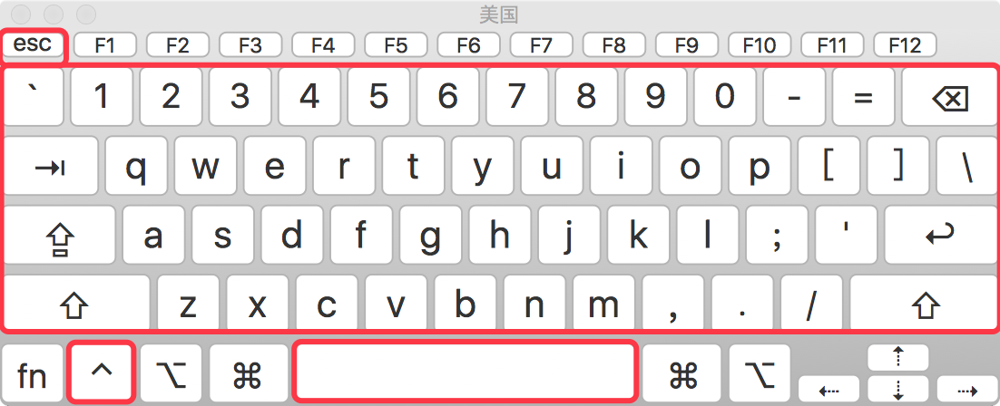
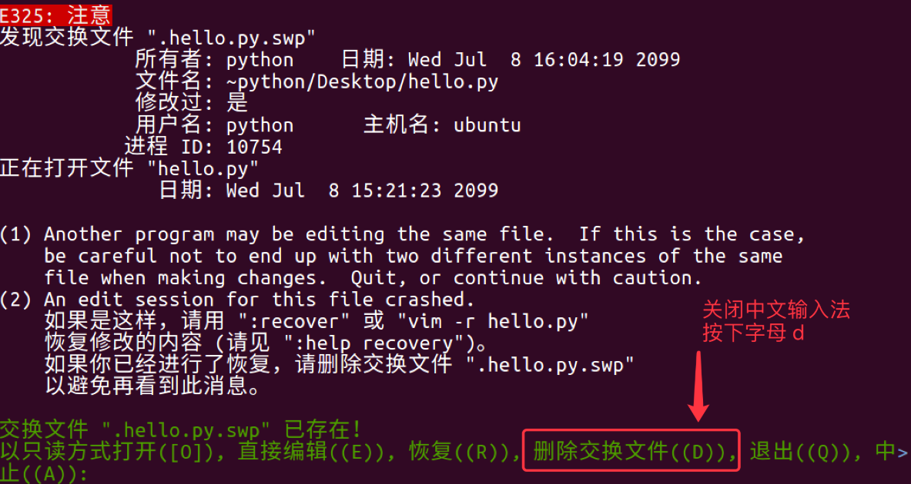
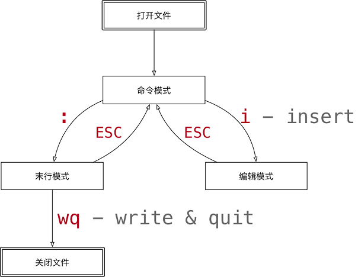

# 1 理论基础

## 1.1 使用目的

在工作中，要对**服务器**上的文件进行**简单**的修改，可以使用 `ssh` 远程登录到服务器上，并且使用 `vi` 进行快速的编辑即可。

在没有图形界面的环境下，要编辑文件，vi是最佳选择。

每一个要使用Linux的程序员，都应该或多或少的学习一些 `vi` 的常用命令。

## 1.2 Vi和Vim

`vi` 是 `Visual interface` 的简称，是 `Linux` 中**最经典**的文本编辑器；`vi` 的核心设计思想是让程序员的手指始终**保持在键盘的核心区域**，就能完成所有的编辑操作。

`vim` 是从 `vi` 发展出来的一个文本编辑器，支持**代码补全**、**编译**及**错误跳转**等方便编程的功能特别丰富，在程序员中被广泛使用，被称为**编辑器之神**。

在很多`Linux` 发行版中直接把 `vi` 做成 `vim` 的软连接。

```shell
# 查找 vi 的运行文件
$ which vi
$ ls -l /usr/bin/vi
$ ls -l /etc/alternatives/vi
$ ls -l /usr/bin/vim.basic

# 查找 vim 的运行文件
$ which vim
$ ls -l /usr/bin/vim
$ ls -l /etc/alternatives/vim
$ ls -l /usr/bin/vim.basic 
```



## 3.1 安装Vim

1、没有安装前

```properties
[root@localhost ~]# rpm -qa|grep vim
vim-minimal-7.4.160-5.el7.x86_64
[root@localhost ~]# 
```

2、安装后

```properties
[root@localhost ~]# rpm -qa|grep vim
vim-filesystem-7.4.160-5.el7.x86_64
vim-common-7.4.160-5.el7.x86_64
vim-enhanced-7.4.160-5.el7.x86_64
vim-minimal-7.4.160-5.el7.x86_64
[root@localhost ~]# 
```

3、安装操作（根据安装前返回列表和安装后的对比，缺少哪个安装哪个）

```properties
yum -y install vim-enhanced
yum -y install vim*
```

# 2 文件操作

## 2.1 文件

白色：表示**普通文件**

蓝色：表示**目录**

绿色：表示**可执行**文件

红色：表示**压缩**文件

浅蓝色：**链接**文件

红色闪烁：表示链接的文件有问题

黄色：表示设备文件

灰色：表示其它文件

前缀是点：隐藏文件

> 本篇文章引导你通过熟练使用Linux

```shell
$ touch  filename                    // 创建文件
$ echo content  >  filename          // 给文件添加内容[覆盖添加内容，原内容被删除]
$ >  filename                        // 置空文件
$ echo content  >> filename          // 给文件追加内容
$ echo content  >/>>  newfilename    // 会创建一个新的文件，并且有添加内容[重定向方式]
$ wc  文件               // 计算文件行数
$ cat/more/less         // 输出文件内容
$ head -n  文件          // 查看文件前n行内容
$ tail -n  文件          // 查看文件末尾n行内容
$ less -N  文件          // 带行号查看
```

## 2.2 文件夹

```shell
$ mkdir  hehe/xixi
$ mkdir -p first/second/third      // 递归创建3个目录 加-p选项
$ mv book.txt  shu.txt             // 改名字，地址只要不存在就是改名字
$ mv  ten/bread.ods  firstt        // 移动，只要地址是存在的目录就是移动
$ cp -r /a /b                      // 复制"目录"需要添加参数-R
$ rm -rf /a                        // 可以删除一切普通的目录或文件 递归
$ mkdir -p server1/{data,log} server2/{data,log} server3/{data,log}   // 创建多个文件夹
$ mkdir -pm 777 usedir // 指定文件夹的权限 
```

## 2.3 异常处理

如果 `vi` 异常退出，在磁盘上可能会保存有**交换文件**

下次再使用 `vi` 编辑该文件时，会看到以下屏幕信息，按下字母 `d` 可以**删除交换文件**即可

> 提示：按下键盘时，注意关闭输入法



# 3 三种模式

## 3.1 模式切换

> ##### 命令模式、插入（编辑）模式、末行模式，[中文维基教科书](https://zh.wikibooks.org/zh-sg/Vim/%E4%B8%89%E7%A7%8D%E6%A8%A1%E5%BC%8F)。



| 命令 |     英文     | 功能                           |
| :--: | :----------: | ------------------------------ |
|  w   |    write     | 保存                           |
|  q   |     quit     | 退出，如果没有保存，不允许退出 |
|  q!  |     quit     | 强行退出，不保存退出           |
|  wq  | write & quit | 保存并退出                     |
|  x   |              | 保存并退出                     |

## 3.2 命令模式

| 命令                         | 作用                    |
| ---------------------------- | ----------------------- |
| [N]yy、y[N]motion            | 复制一行或者N行         |
| [N]dd、d[N]motion            | 删除\剪切一行或者N行    |
| [n]x                         | 删除当前字符            |
| w、b                         | 下一个单词，上一个单词  |
| cw、ciw（ci"）;yi"；di"；dfa |                         |
| p                            | 粘贴                    |
| u                            | 撤回上一步              |
| `Ctrl+u`                     | 撤回全部                |
| `ctrl+r`                     | 恢复上一步操作          |
| `[N]G`                       | 文档的第N行或者最后一行 |
| `gg`                         | 文档的第一行            |
| `Ctrl+f`                     | 上一页                  |
| `Ctrl+b`                     | 下一页                  |
| shift+a/g                    | 行尾/行首插入           |
| shift+o                      | 上一行插入              |
| hjkl                         | 左下上右                |

## 3.3 插入模式

ioa


| 命令   | 作用               |
| ------ | ------------------ |
| `i`    | 插入到光标前面     |
| `I`    | 插入到行的开始位置 |
| `a`    | 插入到光标的后面   |
| `A`    | 插入到行的最后位置 |
| `o, O` | 下、上新开一行     |
| `Esc`  | 关闭插入模式       |

## 3.4 末行模式

| 命令                      | 作用                                |
| ------------------------- | ----------------------------------- |
| `:w`                      | 保存                                |
| `:wq` , `:x`              | 保存并关闭                          |
| `:q`                      | 关闭（已保存）                      |
| `:q!`                     | 强制关闭                            |
| `/`                       | 从前往后找（正向搜索），使用n下一个 |
| `?`                       | 从后往前走(反向搜索)                |
| `:set ff`、`:set ff=unix` | 查看文件格式（fileformat=unix）     |
| `:set nu`                 | 显示文件行号（numeric）             |
| `:set nonu`               | 去除文件行号                        |

# 4 命令模式

## 4.1 命令路线

1、重复次数

在命令模式下，**先输入一个数字**，**再跟上一个命令**，可以让该命令**重复执行指定次数** 

2、移动和选择（**多练**）

`vi` 之所以快，关键在于**能够快速定位到要编辑的代码行**

特别注意：**移动命令**能够和**编辑操作**命令**组合使用**

3、编辑操作

**删除**、**复制**、**粘贴**、**替换**、**缩排**

4、撤销和重复

5、查找替换

6、编辑

## 4.2 移动

熟练使用 `vi`，首先应该学会怎么在**命令模式**下样快速移动光标

**编辑操作命令**，能够和**移动命令**结合在一起使用

### 4.2.1 上下左右移动

| 命令 | 功能 |  手指  |
| :--: | ---- | :----: |
|  h   | 向左 |  食指  |
|  j   | 向下 |  食指  |
|  k   | 向上 |  中指  |
|  l   | 向右 | 无名指 |

### 4.2.2 行内移动

| 命令 | 英文 | 功能                               |
| :--: | :--: | ---------------------------------- |
|  w   | word | 向后移动一个单词                   |
|  b   | back | 向前移动一个单词                   |
|  0   |      | 行首                               |
|  ^   |      | 行首，第一个**不是空白字符**的位置 |
|  $   |      | 行尾                               |

### 4.2.3 行数移动

|  命令  | 英文 | 功能                                       |
| :----: | :--: | ------------------------------------------ |
|   gg   |  go  | 文件顶部，[n]gg跳到第n行                   |
|   G    |  go  | 文件末尾                                   |
| 数字gg |  go  | 移动到数字对应行数，如果不输入数字回到首行 |
| 数字G  |  go  | 移动到 数字 对应行数                       |
| :数字  |      | 移动到 数字 对应行数                       |

### 4.2.4 屏幕移动

|   命令   |  英文   | 功能     |
| :------: | :-----: | -------- |
| Ctrl + b |  back   | 向上翻页 |
| Ctrl + f | forward | 向下翻页 |
|    H     |  Head   | 屏幕顶部 |
|    M     | Middle  | 屏幕中间 |
|    L     |   Low   | 屏幕底部 |

## 4.3 程序移动

### 4.3.1 段落移动

vi是通过**空行**来区分段落的

在程序开发时，通常**一段功能相关的代码会写在一起**，之间没有空行，因此使用空行区分段落。

| 命令 | 功能   |
| :--: | ------ |
|  {   | 上一段 |
|  }   | 下一段 |

### 4.3.2 括号切换

在程序世界中，`()`、`[]`、`{}` 使用频率很高，而且**都是成对出现的**

| 命令 | 功能           |
| :--: | -------------- |
|  %   | 括号匹配及切换 |

### 4.3.3 标记

在开发时，某一块代码可能**需要稍后处理**，例如：编辑、查看

此时先使用 `m` 增加一个标记，这样可以**在需要时快速地跳转回来**或者**执行其他编辑操作**

**标记名称**可以是 `a~z` 或者 `A~Z` 之间的任意 **一个**字母

添加了标记的**行如果被删除**，**标记同时被删除**

如果**在其他行添加了相同名称的标记**，**之前添加的标记也会被替换掉**

| 命令 | 英文 | 功能                                             |
| :--: | :--: | ------------------------------------------------ |
|  mx  | mark | 添加标记 x，x 是 a~z 或者 A~Z 之间的任意一个字母 |
|  'x  |      | 直接定位到标记 x 所在位置                        |

## 4.4 文本选中

1、学习 `复制` 命令前，应该先学会**怎么样选中要复制的代码**

2、在 `vi` 中要选择文本，需要先使用 `Visual` 命令切换到**可视模式**

3、`vi` 中提供了**三种** 可视模式，可以方便程序员选择**选中文本的方式**

4、按 `ESC` 可以放弃选中，返回到 **命令模式**

|   命令   | 模式       | 功能                               |
| :------: | ---------- | ---------------------------------- |
|    v     | 可视模式   | 从光标位置开始按照正常模式选择文本 |
|    V     | 可视行模式 | 选中光标经过的完**整行**           |
| Ctrl + v | 可视块模式 | **垂直**方向选中文本               |

## 4.5 撤销/恢复

在学习编辑命令之前，先要知道怎样撤销之前一次**错误的**编辑动作

|   命令   | 英文 | 功能           |
| :------: | :--: | -------------- |
|    u     | undo | 撤销上次命令   |
| ctrl + r | redo | 恢复撤销的命令 |

## 4.6 删除文本

如果使用**可视模式**已经选中了一段文本，那么无论使用 `d` 还是 `x`，都可以删除选中文本。

|    命令     |  英文  | 功能                              |
| :---------: | :----: | --------------------------------- |
|      x      |  cut   | 删除光标所在字符，或者选中文字    |
| d(移动命令) | delete | 删除移动命令对应的内容            |
|     dd      | delete | 删除光标所在行，可以 ndd 复制多行 |
|      D      | delete | 删除至行尾                        |

删除命令可以和**移动命令**连用，以下是常见的组合命令：

```properties
dw        # 从光标位置删除到单词末尾
d0        # 从光标位置删除到一行的起始位置
d}        # 从光标位置删除到段落结尾
ndd       # 从光标位置向下连续删除 n 行
d代码行G   # 从光标所在行 删除到 指定代码行 之间的所有代码
d'a       # 从光标所在行 删除到 标记a 之间的所有代码
```

## 4.7 复制/粘贴

`vi` 中提供有一个 **被复制文本的缓冲区**

* **复制** 命令会将选中的文字保存在缓冲区 
* **删除** 命令删除的文字会被保存在缓冲区
* 在需要的位置，使用 **粘贴** 命令可以将缓冲区的文字插入到光标所在位置

|    命令     | 英文  | 功能                        |
| :---------: | :---: | --------------------------- |
| y(移动命令) | copy  | 复制                        |
|     yy      | copy  | 复制一行，可以 nyy 复制多行 |
|      p      | paste | 粘贴                        |

**提示**

* 命令 `d`、`x` 类似于图形界面的 **剪切操作** —— `CTRL + X`
* 命令 `y` 类似于图形界面的 **复制操作** —— `CTRL + C`
* 命令 `p` 类似于图形界面的 **粘贴操作** —— `CTRL + V`
* `vi` 中的**文本缓冲区同样只有一个**，如果后续做过 **复制、剪切** 操作，之前缓冲区中的内容会被替换

**注意**

* `vi` 中的**文本缓冲区** 和系统的 **剪贴板** 不是同一个
* 所以在其他软件中使用 `CTRL + C` 复制的内容，不能在 `vi` 中通过 `P` 命令粘贴
* 可以在**编辑模式** 下使用 **鼠标右键粘贴**

## 4.8 缩进/重复

| 命令 | 功能         |
| :--: | ------------ |
|  >>  | 向右增加缩进 |
|  <<  | 向左减少缩进 |
|  .   | 重复上次命令 |

* **缩排命令** 在开发程序时，**统一增加代码的缩进** 比较有用！
  * 一次性 **在选中代码前增加 4 个空格**，就叫做 **增加缩进**
  * 一次性 **在选中代码前删除 4 个空格**，就叫做 **减少缩进**
* 在 **可视模式** 下，缩排命令只需要使用 **一个** `>` 或者 `<` 

> 在程序中，**缩进**通常用来表示代码的归属关系
>
> * 前面空格越少，代码的级别越高
> * 前面空格越多，代码的级别越低

# 5 插入模式


## 5.1 数字连用

* 在开发中，可能会遇到连续输入 `N` 个同样的字符

> 在 `Python` 中有简单的方法，但是其他语言中通常需要自己输入

* 例如：`**********` 连续 10 个星号

要实现这个效果可以在 **命令模式** 下

1、输入 `10`，表示要重复 10 次

2、输入 `i` 进入 **编辑模式**

3、输入 `*` 也就是重复的文字

4、按下 `ESC` 返回到 **命令模式**，返回之后 `vi` 就会把第 `2、3` 两步的操作重复 `10` 次

> 提示：正常开发时，在 **进入编辑模式之前，不要按数字**

## 5.2 快速注释

### 5.2.1 多行注释

1、进入命令行模式，按ctrl + v进入**visual block模式**，然后按j, 或者k选中多行，把需要注释的行标记起来

2、按大写字母I，再插入注释符，例如//

3、按esc键就会全部注释了

### 5.2.2 取消多行注释

1、进入命令行模式，按ctrl + v进入 visual block模式，按字母l横向选中列的个数，例如 // 需要选中2列

2、按字母j，或者k选中注释符号

3、按d键就可全部取消注释

### 5.2.3 查看非注释内容

```shell
# 查看文件
grep -Ev "^$|#" file
grep -Ev "^#|^$" /etc/kibana/kibana.yml

egrep -v "^$|#" 文件名
```

# 6 末行命令


## 6.1 基本命令

|   命令   |     英文     | 功能                           |
| :------: | :----------: | ------------------------------ |
|    :w    |    write     | 保存                           |
|    :q    |     quit     | 退出，如果没有保存，不允许退出 |
|   :q!    |     quit     | 强行退出，不保存退出           |
|   :wq    | write & quit | 保存并退出                     |
|    :x    |              | 保存并退出                     |
| :%s///gc |              | 确认搜索并替换                 |

## 6.2 扩展

**末行命令** 主要是针对文件进行操作的：**保存**、**退出**、**保存&退出**、**搜索&替换**、**另存**、**新建**、**浏览文件**

|   命令    | 英文  | 功能                                             |
| :-------: | :---: | ------------------------------------------------ |
|   :e .    | edit  | 会打开内置的文件浏览器，浏览要当前目录下的文件   |
| :n 文件名 |  new  | 新建文件                                         |
| :w 文件名 | write | 另存为，但是**仍然编辑当前文件**，并不会切换文件 |

# 8 查找替换

## 8.1 查找

### 8.1.1 常规查找

| 命令 | 功能     |
| :--: | -------- |
| /str | 查找 str |

* 查找到指定内容之后，使用 `Next` 查找下一个出现的位置：
  * `n`: 查找下一个
  * `N`: 查找上一个
* 如果不想看到高亮显示，可以随便查找一个文件中不存在的内容即可

### 8.1.2 单词快速匹配

| 命令 | 功能                     |
| :--: | ------------------------ |
|  *   | 向后查找当前光标所在单词 |
|  #   | 向前查找当前光标所在单词 |

* 在开发中，通过单词快速匹配，可以快速看到这个单词在其他什么位置使用过

### 8.1.3 文件查找

```shell
find / -name file
```

### 8.1.4 内容查找

```shell
grep -r "JAVA_HOME" /etc/

# 查看文件
grep -Ev "^$|#" file
grep -Ev "^$|#" /etc/kibana/kibana.yml

egrep -v "^$|#" 文件名
```

## 8.5 替换

### 8.2.1 基本替换

| 命令 |  英文   | 功能                   | 工作模式 |
| :--: | :-----: | ---------------------- | -------- |
|  r   | replace | 替换当前字符           | 命令模式 |
|  R   | replace | 替换当前行光标后的字符 | 替换模式 |

* `R` 命令可以进入 **替换模式**，替换完成后，按下 `ESC` 可以回到 **命令模式**
* **替换命令** 的作用就是不用进入 **编辑模式**，对文件进行 **轻量级的修改**

### 8.2.2 命令替换

1、全局替换

```properties
:%s/旧文本/新文本/g
将dev替换为prod，在末行模式下执行
:%s/dev/prod/g 
```

2、可视化区替换

```properties
:s/旧文本/新文本/g
```

3、确认替换

```properties
:%s/旧文本/新文本/gc
```

`y` - `yes` 替换

`n` - `no` 不替换

`a` - `all` 替换所有

`q` - `quit` 退出替换

`l` - `last` 最后一个，并把光标移动到行首

`^E` 向下滚屏

`^Y` 向上滚屏

## 7.3 过滤

```properties
ls | grep vim
```

# 9 分屏操作

属于`vi` 的高级命令 —— 可以 **同时编辑和查看多个文件**

## 9.1 基本分屏

* 使用 **分屏命令**，可以 **同时编辑和查看多个文件**

|     命令      |      英文      | 功能         |
| :-----------: | :------------: | ------------ |
| :sp [文件名]  |     split      | 横向增加分屏 |
| :vsp [文件名] | vertical split | 纵向增加分屏 |

1、切换分屏窗口

> 分屏窗口都是基于 `CTRL + W` 这个快捷键的，`w` 对应的英文单词是 `window`

| 命令 |  英文   | 功能                                        |
| :--: | :-----: | ------------------------------------------- |
|  w   | window  | 切换到下一个窗口                            |
|  r   | reverse | 互换窗口                                    |
|  c   |  close  | 关闭当前窗口，但是不能关闭最后一个窗口      |
|  q   |  quit   | 退出当前窗口，如果是最后一个窗口，则关闭 vi |
|  o   |  other  | 关闭其他窗口                                |

2、调整窗口大小

> 分屏窗口都是基于 `CTRL + W` 这个快捷键的，`w` 对应的英文单词是 `window`

| 命令 | 英文 | 功能         |
| :--: | :--: | ------------ |
|  +   |      | 增加窗口高度 |
|  -   |      | 减少窗口高度 |
|  >   |      | 增加窗口宽度 |
|  <   |      | 减少窗口宽度 |
|  =   |      | 等分窗口大小 |

> 调整窗口宽高的命令可以和数字连用，例如：`5 CTRL + W +` 连续 5 次增加高度

## 9.2 插件


# 10 偏好配置

## 10.1 vimrc

* `vimrc` 是 `vim` 的配置文件，可以设置 vim 的配置，包括：**热键**、**配色**、**语法高亮**、**插件** 等
* `Linux` 中 `vimrc` 有两个位置，**家目录下的配置文件优先级更高**

```shell
/etc/vim/vimrc
~/.vimrc
```

* 常用的插件有：
  * 代码补全
  * 代码折叠
  * 搜索
  * Git 集成
  * ……
* 网上有很多高手已经配置好的针对 `python` 开发的 `vimrc` 文件，可以下载过来直接使用，或者等大家多 `Linux` 比较熟悉后，再行学习！

cd：进入home路径

创建文件夹：mkdir .vim

进入.vim，创建vimrc文件

编辑配置vimrc文件

```shell
let mapleader=" "
syntax on

set number
set norelativenumber
set relativenumber
set cursorline   // 显示线
set wrap // 
set showcmd
set wildmenu
set scrolloff=5

set hlsearch
exec "nohlsearch"
set incsearch
set ignorecase
set smartcase

noremap <LEADER><CR> :nohlsearch<CR>
noremap n h

map s <nop>
map S :w<CR>
map Q :q<CR>
map R :source $MYVIMRC<CR>
```

## 10.2 录制宏

1、把光标定位在第一行；

2、在normal模式下输入qa(当然也可以输入qb, qc, etc，这里的a, b, c是指寄存器名称，vim会把录制好的宏放在这个寄存器中)(PS：如果不知道什么是vim的寄存器，请自行放狗搜之)；

3、正常情况下，vim的命令行会显示“开始录制”的字样，这时候，把光标定位到第一个字符（按0或者|），再按x删除，按j跳到下一行；

4、normal模式下输入q，结束宏录制。

5、在normal模式下输入@a，以播放我们刚录制好的存在寄存器a中的宏。

## 10.3 快捷键

shift+a、shift+i、o、shift+o

## 10.4 速记表

