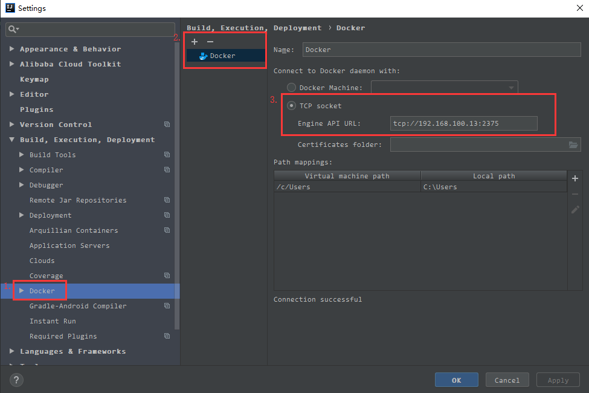
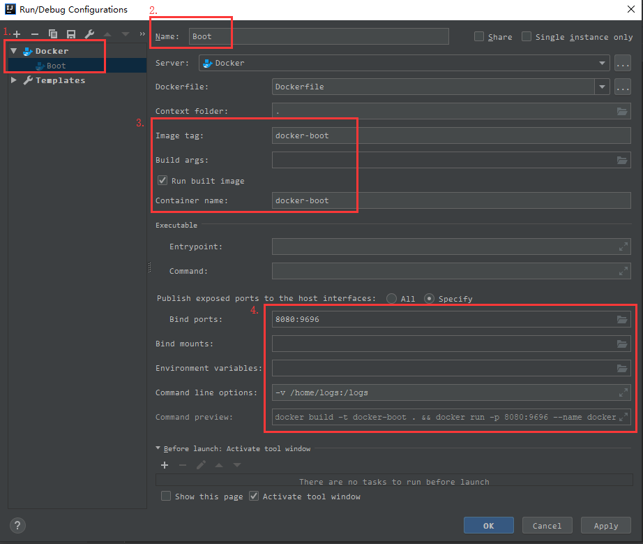

[TOC]

## 1. 基本概念

### 1.1 镜像（Images）

>  我们都知道，操作系统分为内核和用户空间。对于Linux而言，内核启动后，会挂载root文件系统为其提供用户空间支持。而Docker	镜像（Image），就相当于是一个root文件系统。比如官方镜像ubuntu:14.04就包含了完整的一套Ubuntu14.04最小系统的root文件系统。
>  Docker	镜像是一个特殊的文件系统，除了提供容器运行时所需的程序、库、资源、配置等文件外，还包含了一些为运行时准备的一些配置参数（如匿名卷、环境变量、用户等）。镜像不包含任何动态数据，其内容在构建之后也不会被改变。
----
> 镜像拉取的提供商地址
> + [Docker官网](https://hub.docker.com/explore/)
> + [网易蜂巢官网](https://c.163.com/)
> + [阿里云官网](https://dev.aliyun.com/search.html)

### 1.2 容器（Container）
> 镜像（Image）和容器（Container）的关系，就像是面向对象程序设计中的类和	实例	一样，镜像是静态的定义，容器是镜像运行时的实体。容器可以被创建、启动、停止、删除、暂停等。容器的实质是进程，但与直接在宿主执行的进程不同，容器进程运行于属于自己的独立的命名空间。

### 1.3 仓库（Repository）
> 镜像构建完成后，可以很容易的在当前宿主上运行，但是，如果需要在其它服务器上使用这个镜像，我们就需要一个集中的存储、分发镜像的服务，Docker Registry就是这样的服务。一个Docker Registry中可以包含多个仓库（Repository）；每个仓库可以包含多个标签（Tag）；每个标签对应一个镜像。通常，一个仓库会包含同一个软件不同版本的镜像，而标签就常用于对应该软件的各个版本。我们可以通过<仓库名>:<标签>	的格式来指定具体是这个软件哪个版本的镜像。如果不给出标签，将以latest作为默认标签。

## 2. Docker的安装

[官方文档](https://docs.docker.com/install/linux/docker-ce/centos/#install-docker-ce)


### 2.1 下载Docker

> [win10以外的系统](https://www.docker.com/products/docker-toolbox)
> [win10的系统](https://www.docker.com/products/docker#/windows)
> [资料一](http://www.imooc.com/article/16448)
> [资料二](http://get.daocloud.io/#install-docker)

### 2.2 Windows安装过程
> 安装安装流程就行nest安装即可，当安装完成时，启动docker时，有可能出现boot2docker下载不下来的问题，此时的解决方法有两中：第一是启动翻墙，然后重新下载；第二是在网上下载[boot2docker](https://github.com/boot2docker/boot2docker/releases/tag/v17.07.0-ce
> )，然后放到C:\Users\guod\.docker\machine\cache路径下。

### 2.3 Ubuntu下的安装配置

> 其实如果想学习docker的话，不建议使用ContOS作为环境，如果想使用，请一定选择ContOS7的版本。


### 2.4 ContOS7下的安装配置

#### 2.4.1 环境要求

> 需要centos7及以上的正式版,不支持测试版或者预览版等

```properties
cat /etc/redhat-release
```

#### 2.4.2 卸载已有版本

```properties
sudo yum remove docker \
                  docker-client \
                  docker-client-latest \
                  docker-common \
                  docker-latest \
                  docker-latest-logrotate \
                  docker-logrotate \
                  docker-selinux \
                  docker-engine-selinux \
                  docker-engine
```

> 如果安装过.还要清理`/var/lib/docker/`下的镜像,容器,容器卷,网络 等内容

#### 2.4.3 安装依赖包

```properties
sudo yum install -y yum-utils device-mapper-persistent-data lvm2
```

#### 2.4.4 设置存储库,并且更新索引

> 由于国外的速度太慢.这里更换到阿里云镜像.
> 我们去`http://mirrors.aliyun.com/`镜像站下载

```properties
sudo yum-config-manager --add-repo http://mirrors.aliyun.com/docker-ce/linux/centos/docker-ce.repo
yum makecache fast
```

#### 2.4.5 安装docker-ce

```properties
sudo yum -y install docker-ce
sudo systemctl start docker
docker version
```

#### 2.4.6 修改镜像源

> 由于墙的原因,镜像源也要改.常用的镜像源有 网易,有道,daocloud,时速云

```properties
sudo mkdir -p /etc/docker
sudo tee /etc/docker/daemon.json <<-'EOF'
{
  "registry-mirrors": ["https://woawf2sg.mirror.aliyuncs.com"]
}
EOF
sudo systemctl daemon-reload
sudo systemctl restart docker
```

#### 2.4.7 运行hello world

```properties
docker run hello-world
```

> 出现内容中如果有`Hello from Docker!`就算是成功安装了

#### 2.4.8 卸载

```properties
sudo yum remove docker-ce            # 移除docker
sudo rm -rf /var/lib/docker          # 移除镜像，容器，卷，网络，自定义文件等
```

#### 2.4.9 开机启动

```properties
systemctl enable docker.service
```

### 2.5 操作问题

#### 2.5.1 安装过程中

```
(default) Latest release for github.com/boot2docker/boot2docker is v17.06.2-ce
(default) Downloading /Users/jessie/.docker/machine/cache/boot2docker.iso from https://github.com/boot2docker/boot2docker/releases/download/v17.06.2-ce/boot2docker.iso...
```

```properties
docker: Error response from daemon: OCI runtime create failed: unable to retrieve OCI runtime error (open /run/docker/containerd/daemon/io.containerd.runtime.v1.linux/moby/6602807a7f1a03689a847741b0a10171788f7bed2aa92a4dff35c429b02248d1/log.json: no such file or directory): docker-runc did not terminate sucessfully: docker-runc: symbol lookup error: docker-runc: undefined symbol: seccomp_version
```

执行以下指令，更新`libseccomp`依赖(最好以后还是升级高版本centos)

```properties
yum install -y http://mirror.centos.org/centos/7/os/x86_64/Packages/libseccomp-2.3.1-3.el7.x86_64.rpm
```

#### 2.5.2 配置[加速器](https://www.daocloud.io/)

```
sudo sed -i "s|EXTRA_ARGS='|EXTRA_ARGS='--registry-mirror=curl -sSL https://get.daocloud.io/daotools/set_mirror.sh | sh -s http://3c679070.m.daocloud.io |g" /var/lib/boot2docker/profile
```

#### 2.5.3 Docker-Machine

> windows下安装好docker后，Docker-Machine环境自动已经配置好。
> docker-machine -h
> docker-machine ls
> 创建Docker命令：docker-machine create <name>
> docker-machine ssh <name>

## 3. 命令操作

### 3.1 基础命令

> Docker版本：docker version（查看安装版本）
> 启动Docker：service docker start（systemctl start docker）
> 停止Docker：service docker stop（systemctl stop docker）
> 重启Docker：service docker restart（systemctl restart docker）
> 拉取镜像：docker pull [OPTIONS] NAME[:TAG]    NAME：代表拉取镜像的名称
> 查看镜像：docker images [OPTIONS][REPOSITORY] [:TAG]
> 删除镜像：docker rmi [容器名称&ID]
> 运行镜像：docker run [OPTIONS] IMAGE[:TAG][COMMAND] [ARG…]
> 前台运行：docker run [容器名称&ID]
> 后台运行：docker run --name some-* -p 宿主机端口:容器端口 –d [容器名称&ID]
> 查看运行的容器：docker ps
> 查看所以的容器：docker ps -a（docker stop CONTAINER ID、docker rm CONTAINER ID）
> 进入容器内部：docker exec -it containerId /bin/bash（docker exec -it [容器名称] bash）
> 退出容器：exit
> 制作自己的镜像：docker build –t name:latest .（指定名称）
> 推送镜像：docker push registry.cn-hangzhou.aliyuncs.com/namespace/keepalived:[镜像版本号]
> 查看容器日志：docker logs -f [容器名称]

## 4. 服务安装

### 4.1 安装vim

```
在使用docker容器时，有时候里边没有安装vim，敲vim命令时提示说：vim: command not found，这个时候就需要安装vim，可是当你敲apt-get install vim命令时，提示：  
Reading package lists... Done  
Building dependency tree         
Reading state information... Done  
E: Unable to locate package vim  
这时候需要敲：apt-get update，这个命令的作用是：同步 /etc/apt/sources.list 和 /etc/apt/sources.list.d 中列出的源的索引，这样才能获取到最新的软件包。  
等更新完毕以后再敲命令：apt-get install vim命令即可。  
```

### 4.2 MySQL服务
#### 步骤一：拉取镜像

```
root@s200:~# docker pull mysql
```
#### 步骤二：配置信息

```properties
mkdir -p /home/service/mysql/data
mkdir -p /home/service/mysql/log
mkdir -p /home/service/mysql/conf
```

#### 步骤三：启动容器

```properties
docker run -p 3306:3306 --name mysql \
  -v /home/service/mysql/logs:/logs \
  -v /home/service/mysql/data:/mysql_data \
  -e MYSQL_ROOT_PASSWORD=123456\
  -d mysql
```
#### 步骤四：启动容器

> `-p` 3306:3306：将容器的3306端口映射到主机的3306端口
>  `-v` 将主机~/mysql/logs目录挂载到容器的/logs
>  `-v` 将主机mysql/data目录挂载到容器的/mysql_data
>  `-e` MYSQL_ROOT_PASSWORD=123456：初始化root用户的密码
>
> `-d`后台启动

### 4.3 Tomcat服务

步骤一：拉取镜像
```
root@s200:~# docker pull tomcat
```
步骤二：启动容器
```
root@s200:~# docker run -it --rm -p 8888:8080 [REPOSITORY&IMAGE ID]
```

### 4.4 Nginx服务
步骤一：拉取镜像
```
root@s200:~# docker pull nginx
```
步骤二：启动容器
```
root@s200:~# docker run -it -p 8080:80 --name nginx_web [REPOSITORY&IMAGE ID]
```

### 4.5 Redis服务
步骤一：拉取镜像
```
root@s200:~# docker pull nginx
```
步骤二：启动容器
```
root@s200:~# docker run --name some-redis -p 6379:6379 -v redis-data:/data -d [REPOSITORY&IMAGE ID]
```

### 4.6 Mongo服务
步骤一：拉取镜像
```
root@s200:~# docker pull nginx
```
步骤二：启动容器
```
root@s200:~# docker run --name some-mongo -p 27017:27017 -d [REPOSITORY&IMAGE ID]
```

### 4.7 RabbitMQ服务
步骤一：拉取镜像
```
root@s200:~# docker pull rabbitmq:management
```
步骤二：启动容器
```
root@s200:~# docker run -d --hostname my-rabbit --name rabbit -p 5672:15672 rabbitmq:management
```

## 5.IDEA整合Docker

### 5.1 安装插件

>Docker integration

### 5.2 修改Docker配置

1. 修改vim /usr/lib/systemd/system/docker.service

```properties
[Service]
ExecStart=/usr/bin/dockerd -H tcp://0.0.0.0:2375 -H unix:///var/run/docker.sock
```

2. 重启

```properties
sudo systemctl daemon-reload
sudo systemctl restart docker      # 进行
netstat -tulp                      # 检查2375端口
curl 127.0.0.1:2375/info           # 验证是否成功
```

### 5.3 IDEA连接操作

1. 连接地址

```properties
tcp://192.168.100.13:2375
```


2. 项目编写Dockerfile文件

```properties
# 容器的依赖
FROM hub.c.163.com/wuxukun/maven-aliyun:3-jdk-8

# 校正容器时间
RUN /bin/cp /usr/share/zoneinfo/Asia/Shanghai /etc/localtime
RUN echo "Asia/Shanghai" > /etc/timezone

# 获取打包后的jar
COPY target/*.jar app.jar

RUN bash -c 'touch ./app.jar'

# 指定端口
EXPOSE 8080

# 进行启动
CMD ["java", "-jar", "app.jar", "--spring.profiles.active=prod"]
```


```properties
FROM hub.c.163.com/wuxukun/maven-aliyun:3-jdk-8

ADD pom.xml /tmp/build/

ADD src /tmp/build/src
        #构建应用
RUN cd /tmp/build && mvn clean package \
        #拷贝编译结果到指定目录
        && mv target/*.jar /guod.jar \
        #清理编译痕迹
        && cd / && rm -rf /tmp/build

VOLUME /tmp
EXPOSE 8080
ENTRYPOINT ["java","-jar","/guod.jar"]
```

3. 项目部署操作

> 运行Dockerfile文件，项目发布成功！
> 