# 1 系统安装


## 1.1 系统格式

下载地址：

.GHO 点评：傻大粗、安装简单、体积庞大

.ISO 点评：官方常见格式方便刻录点击安装

.WIM 点评：官方常用格式最合理官方的安装方式

.ESD 点评：官方常用格式比WIM更小巧

建议下载win10专业版

## 1.2 PE制作

推荐使用：IT天空出品的优启通

## 1.3 BIOS引导模式

Delete、Esc、F2、F8、F9、F10、F11、F12、Enter

> 主板为了兼容MBR分区表，一般会提供Legacy BIOS和UEFI BIOS启动模式选项，而且默认情况下主板是优先开启Legacy BIOS，所以如果要使用UEFI模式安装Windows，就必须手动去调整开启UEFI引导模式。

第一是：更改BIOS默认系统

自带出厂时机器默认的是WIN8 for 64Bit。我们要将其改成“Other OS”。这样的话BIOS设置就是完成了。这样就能加载“U盘”、“光驱”启动了。

这样就解决了客户反映的在选择菜单启动时候**反复停留在启动菜单选项中**。选择什么都是返回这个界面。

第二是：Boot项目设置

BootMode系统默认设置是UEFI要将其改为Legacy Support。

Boot Priorlty也要更改为 Legacy First这样更改就是跟之前那些没有带系统出厂的一样了。可以看到按“F2”进入BIOS。设置，按“F12”进入菜单选择启动菜单选项的提示。

第三是：Boot Security

一般需要关闭

## 1.4 硬盘分区格式

UEFI启动的系统，系统盘所在硬盘的分区表为GPT，PE应为UEFI启动。

Legacy启动的系统，系统盘所在硬盘的分区表为MBR，PE应为Legacy启动。

请牢记UEFI<->GPT和Legacy<->MBR的这种对应关系。并通过当前硬盘的分区表类型判断机器之前是哪种方式启动。

若PE启动方式选择错误可以重新选择。

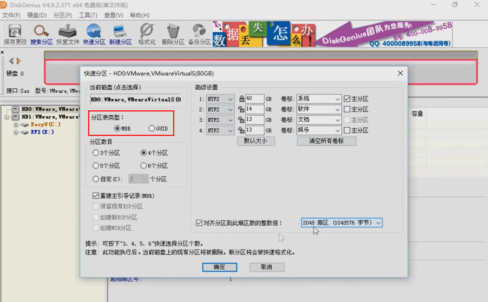

>MBR和GPT

1、主板BIOS开启UEFI，硬盘就是GPT，主板BIOS是传统Legacy，硬盘就是MBR，而且大多数情况下装系统必须是UEFI+GPT或Legacy+MBR，不能有其他的组合。

2、win7默认是Legacy+MBR，win7 64位支持UEFI+GPT下安装，win10默认是UEFI+GPT，win10还支持Legacy+MBR

## 1.5 进入PE系统

根据不同的系统进行进入。如果对引导进行设置过的，插入优盘后会直接进入优盘的PE系统的！！！

>F12

## 1.6 win10转win7

>修改启动方式：Legacy BIOS + MBR组合方式。

win7系统共有6个版本，分别是：初级版（Starter）、家庭普通版（Home Basic）、家庭高级版（Home Premium）、专业版（Professional）、企业版（Enterprise）（非零售）、旗舰版（Ultimate）。

## 1.7 win7转win10

>修改启动方式：UEFI BIOS + GPT组合方式。

需要注意的是，一般用户无法从Windows 7 和Windows 8 中直接升级到Windows 10 企业版，但可以升级到专业版。

win10分为7个版本，包括：家庭版，企业版、专业版等，其中win10企业版和专业版是两个比较热门的版本。许多网友提出疑问win10企业版和专业版区别是什么？

Win10专业版，面向使用PC、平板电脑和二合一设备的企业用户。其主要面向一些技术人员和中小企业，内置了windows10 增强的技术，其主要体现在安全性和一些适合技术人员的组件，如Bitlocker驱动器加密、安全启动，设备保护，远程访问服务，组策略，域名连接，除具有win10家庭版的功能外，它还使用户能管理设备和应用，保护敏感的企业数据，支持远程和移动办公，整合了“云技术”，更方便的在不同电脑中同步数据。另外，它还带有Windows Update for Business，微软承诺该功能可以降低管理成本、控制更新部署，让用户更快地获得安全补丁软件。

Win10企业版（Win pro），以专业版为基础，其包括了Windows 10 所有的功能。增添了大中型企业用来防范针对设备、身份、应用和敏感企业信息的现代安全威胁的先进功能，主要面向大中型企业。供微软的批量许可（Volume Lice客户使用，用户能选择部署新技术的节奏，其中包括使用Windows Update for Business的选项。作为部署选项，企业版将提供长期服务分支（Long Term Servicing Branch）。在这个版本中，企业可以拒绝一些功能性升级而只获取安全升级，更适合大企业的现实情况。不过需要注意的是，该版本只提供给批量许可用户，无法享受微软的免费升级。

Win10专业版主要**面向技术爱好者和企业/技术人员**；Win10企业版主要面向大中型企业，核心卖点在于针对企业用户增加了相应的功能，如部署和管理PC，Windows To Go，虚拟化和先进的安全性等功能。

从功能上来说，功能上当Win10然企业版更丰富，比如支持Refs分区，Windows To Go等功能，但考虑到普通用户，基本用不上企业版的功能，加之企业版由于加入了更多功能，更占硬盘空间，正版授权费更贵（盗版不需要考虑，直接企业版走起），因此普通个人用户选择**专业是最好的选择**，企业用户则选择企业版是更好的选择。

如果是个人使用推荐用专业版，因为企业版集成了一些个人根本用不到的功能，并会占用磁盘空间，其它使用上并没有什么太大的区别。

Win10企业版为了满足企业的需求，增加了各种功能，比如PC管理和部署，先进的安全性，虚拟化等功能，需要用到这些强大功能的企业可以考虑使用企业版。

## 1.8 系统选择

ltsc：系统比较稳定

ltsb：系统比较快

一个1809稳如狗，一个2004一个快！

## 1.10 管理员/新建用户

组策略

主要解决的问题是修改应用程序为管理员运行时，无法开机启动！！！


## 1.11 网络配置

软件：NetSetMan

ipconfig /all

## 1.12 病毒安全

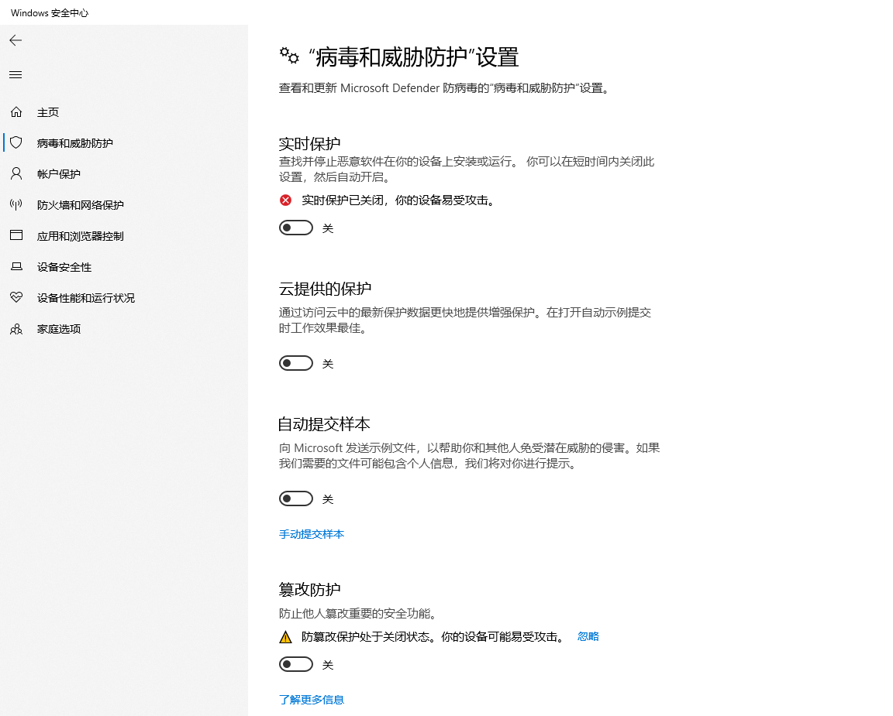

## 1.13 默认配置修改

1、注册表=>计算机\HKEY_LOCAL_MACHINE\SOFTWARE\Microsoft\Windows\CurrentVersion

2、存储=>更改新内容的保存位置，对应安装到C盘符的文件路径进行修改

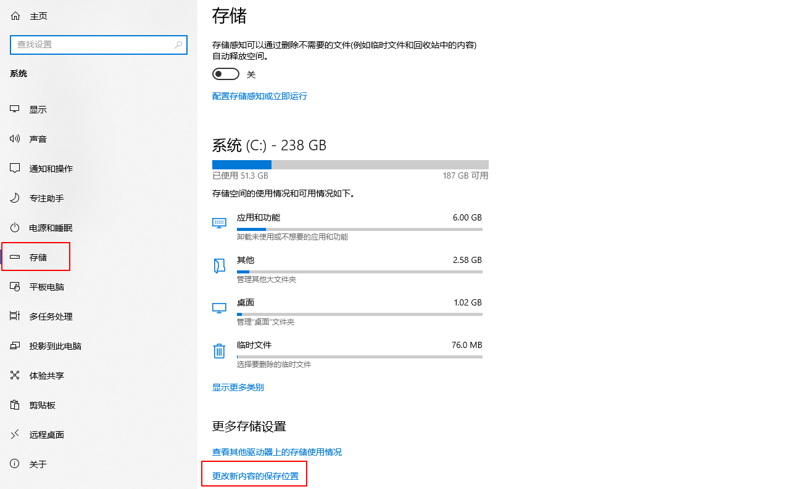

3、文件夹合并显示，右键选择**任务栏设置**，选择**始终合并**按钮，见4图

4、关闭右下角小图标并排显示，右键选择**任务栏设置**，关闭**通知区域始终显示**所有图标

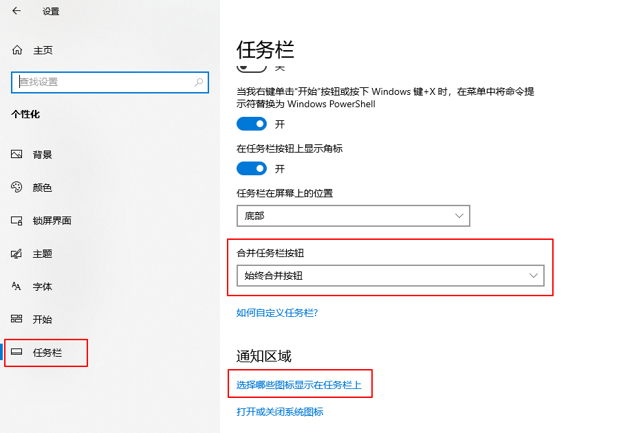

5、

## 1.14 优化配置

1、提升开机速度

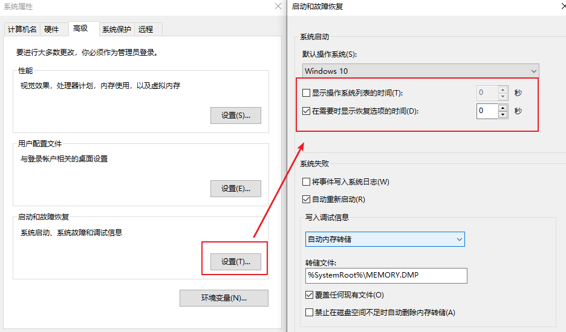

2、禁止更新

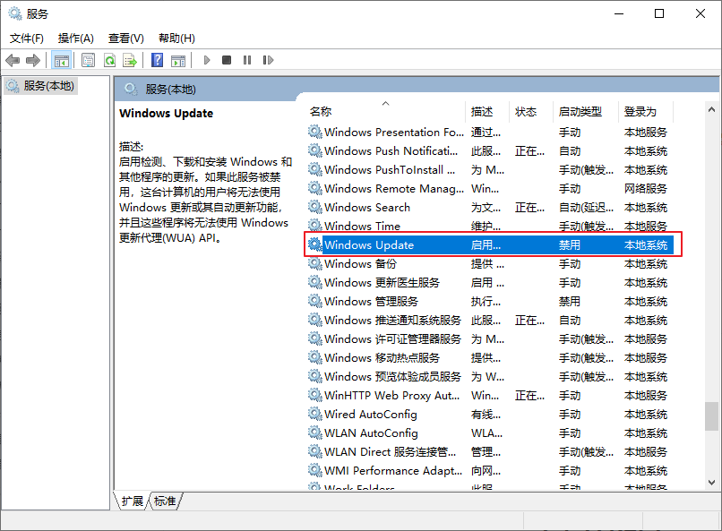

# 2 软件安装

## 2.1 下载软件

### 2.1.1 果核剥壳


### 2.1.2 新云下载


### 2.1.3 ZD423


## 2.2 系统配置

### 2.2.1 Quicker

进行登录，同步安装的软件图标，根据自己的电脑情况，进行后面软件的安装。

### 2.2.2 基础软件

Revo Uninstalle Pro：彻底分析和扫描程序在系统和注册表中的所有文件和键值，将程序彻底完全的移除，不会在系统中留下软件的任何残留，对比产品Unlocker。

HaoZip(x64)：解压缩工具。

Chrome：浏览器。

Snipaste：是一款开发了三年精心打磨出来、简单易用却又强大到让人惊叹的免费屏幕截图软件。

Pointofix：中文版是一个强大的立体划线工具。

ScreenToGif：是Gif动图工具。

QTranslate：翻译软件。

FSCapture v9.2：中文版，图像捕捉。

Cmder：增强cmd终端。

Everything：全文搜索工具。

Universal Extractor：是一款近乎于万能的文件提取器，支持的文件类型多达40多种。

### 2.2.3 办公娱乐

office、PDFelement、Visio

### 2.2.4 开发工具

idea、pycharm、xShell、vscode

## 2.3 系统备份还原

### 2.3.1 备份


### 2.3.2 还原

工具选择：

## 2.4 开发环境


# 3. 快捷键
## 3.1 Win快捷键

```properties
Ctrl+A：全选
Ctrl+C：粘贴
Ctrl+V：粘贴
Ctrl+X：剪切
Ctrl+F：搜索
Ctrl+W：关闭

Shift+右键：快速进入Dos窗口
Shift+end（shift+home）快速选择从当前行到结尾行（开始行）

Win+d：显示桌面
Win+e：快速进入资源管理
Win+Tab：切换窗口
Win+t：窗口切换
Win+r：CMD快速启动
Win+u：window设置
Win+i：window设置

Win+q：搜索
Win+w：便签\草图
Win+x：功能选择
Win+g：音频\性能设置
Win+数字[1，2，3，4......]windows的下窗口程序选择
win+上下左右箭头：进行系统的分屏操作

Alt+Tab：切换窗口
Alt+F4：关闭应用窗口

Mstsc：打开电脑的远程桌面控制。
Calc：计算器
Notepad：记事本
Mspaint：画图
control：进入控制面板
Msconfig：关闭启动项
services.msc：开启服务。
Regedit：打开系统注册表。
sysdm.cpl：进入环境变量编辑

Ipconfig：查看IP
Netstat –ans：查看占用的端口
Winver：电脑的版本
Taskmgr：任务管理器
Syskey：电脑安全命令
Dxdiag：诊断工具
Psr.exe：步骤记录
Sysprep：系统恢复初始化

Cd：进入特定的目录。
Dir：当前目录下的文件。
Cls：清屏

Ctrl+Shift+T：恢复关闭
Ctrl+数字[1，2，3，4......]浏览器或clover工具窗口切换
```

## 3.2 Google快捷键
```properties
F6：快速定位导航栏
ctrl+t：
ctrl+shift+t：
ctrl+tab：向后切换网页
ctrl+shift+tab：向前切换网页
alt+左右箭头：进行网页的回退
```

# 4. 安装操作

## 4.1 联想电脑


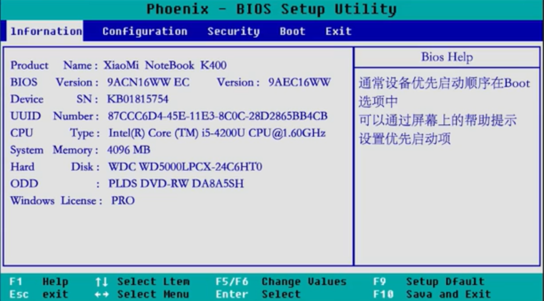


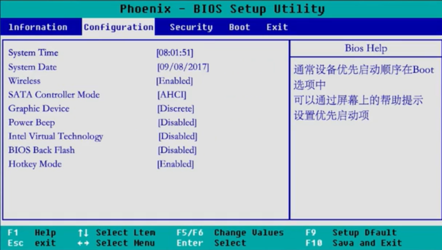


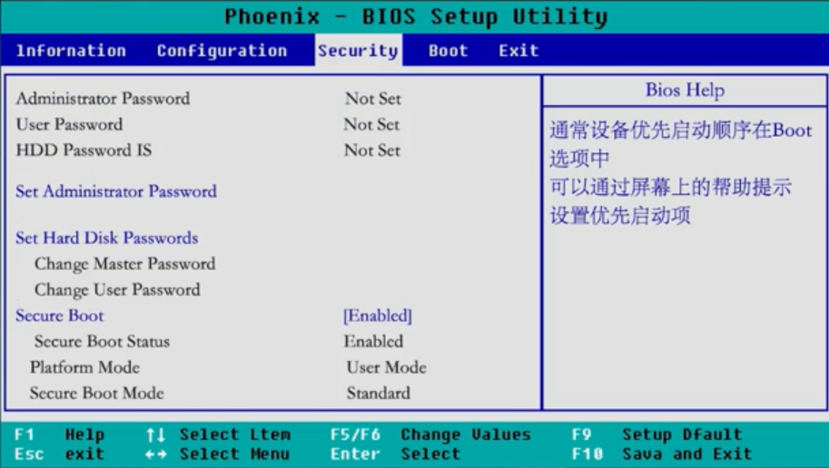


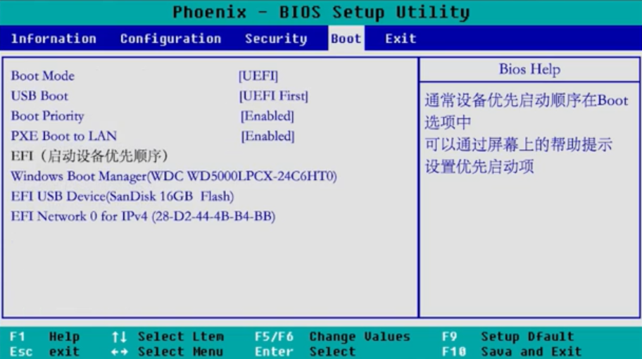


**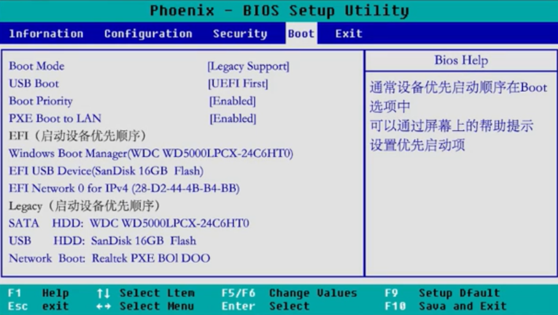**


## 4.2 华硕电脑


# 5 双系统

## 5.1 引导