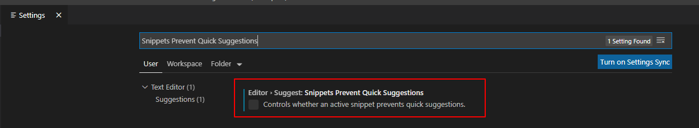
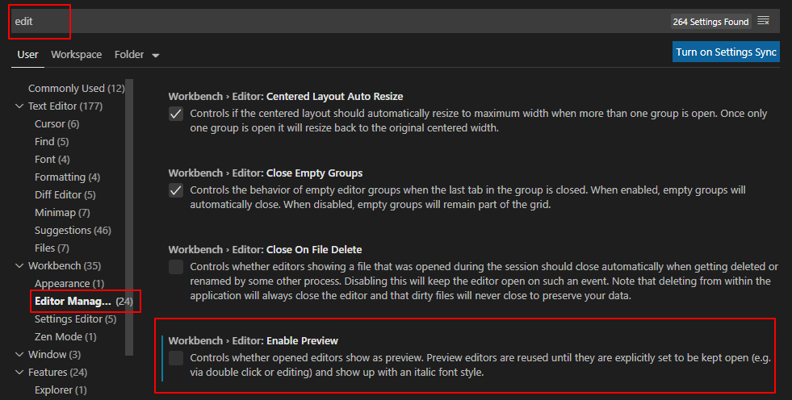
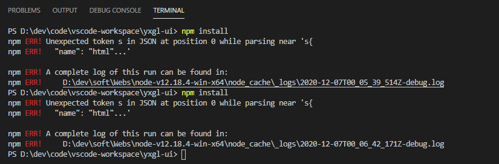
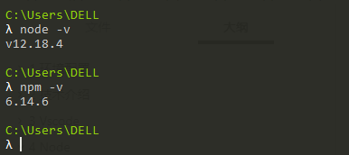
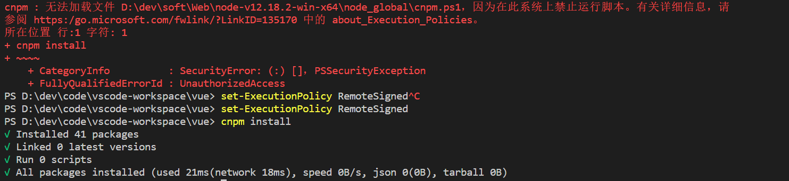

# 1 环境配置
## 1.1 开发配置
windows 10操作系统

VS code编辑器

# 2 技术介绍
## 2.1 介绍
> 本篇文章引导你使用前段开发工具vscode进行高效的开发前段页面。如今前端开发工具也是各种各样，例如：webstrom、sublime text 3、hbuilder等，但是综合工具内存消耗和使用的角度还是强烈推荐使用vscode。

## 2.2 关键字
> 安装配置、vscode、git、插件

## 2.3 技术栈
开发工具

# 3 Vscode

工具版本：

```bash
Version: 1.49.2
Commit: e5e9e69aed6e1984f7499b7af85b3d05f9a6883a
Date: 2020-09-24T16:29:41.983Z
Electron: 9.2.1
Chrome: 83.0.4103.122
Node.js: 12.14.1
V8: 8.3.110.13-electron.0
OS: Windows_NT x64 10.0.19041
```

## 3.1 下载
[官网下载地址](https://code.visualstudio.com/Download/)，个人习惯，下载绿色zip包！！！

## 3.2 全局配置

1、settings => Editor => Suggest: Snippets Prevent Quick Suggestions勾掉即可（解决双引号中代码不提示）



2、resources\app\out\vs\workbench\workbench.main.css文件中修改.monaco-workbench .part>.content{font-size:16px}，改变左侧菜单的字体。

3、File=>首选项=>全局用户设置

```properties
{
	// Git配置
	"git.path": "D:/dev/soft/VCS/Git/cmd/git.exe",
	"git.autofetch": true,
	"git.confirmSync": false,
	"git.enableSmartCommit": true,
	// 编辑保存自动格式化
	"editor.formatOnType": true,
	"editor.formatOnSave": true,
	"editor.wordWrap": "on",
	"editor.suggestSelection": "first",
	// 排除不关注的文件显示
	"files.exclude": {
		"**/.vscode": true,
		"**/.mvn": true,
		"**/.classpath": true,
		"**/.project": true,
		"**/.settings": true,
		"**/.factorypath": true
	},
	// Java环境
	"java.home": "D:\\dev\\soft\\JDK\\openjdk-11",
	"java.configuration.maven.userSettings": "D:\\dev\\maven\\maven-3.6.3\\conf\\settings.xml",
	"java.semanticHighlighting.enabled": true,
	// Python环境
	"python.pythonPath": "D:\\dev\\soft\\Python\\python-3.8.1-embed-amd64",
	// 格式化
	"python.linting.flake8Enabled": true,
	"python.formatting.provider": "yapf",
	"python.linting.flake8Args": [
		"--max-line-length=248"
	],
	// 语法校验
	"python.linting.pylintEnabled": false,
	"vsintellicode.modify.editor.suggestSelection": "automaticallyOverrodeDefaultValue",
	"files.autoSave": "afterDelay",
	// 代码格式化
	"beautify.language": {
		"js": {
			"type": [
				"javascript",
				"json"
			],
			"filename": [
				".jshintrc",
				".jsbeautify"
			]
		},
		"css": [
			"css",
			"scss"
		],
		"html": [
			"htm",
			"html",
			"vue" //在这里加上vue
		]
	},
	// 4个空格格式化
	"beautify.config": {
		"brace_style": "collapse,preserve-inline",
		"indent_size": 4
	},
	"vetur.format.options.tabSize": 4,
	// Vue配置
	"vetur.format.defaultFormatter.html": "js-beautify-html",
	"vetur.validation.template": false,
	"editor.suggest.snippetsPreventQuickSuggestions": false,
	// 页面服务
	"liveServer.settings.port": 8888,
	"liveServer.settings.donotShowInfoMsg": true,
	"window.zoomLevel": 0,
	"explorer.confirmDelete": false,
	// 页面都在新窗口打开
    "workbench.editor.enablePreview": false,
    // 禁用eslint插件语法检查
    "eslint.enable": false,
    // 继续扩展更新
    "extensions.autoUpdate": true,
    // 取消软件更新
    "update.mode": "none",
    // 本地调试和http站点调试
    "debug.javascript.usePreview": true
}
```
4、自动格式化代码

```properties
"settings": {
	"editor.formatOnType": true,
	"editor.formatOnSave": true
}
```

5、页面都在新窗口打开



## 3.3 快捷键

> 习惯了**eclipse的快捷键**，对vscode的快捷键用着感觉相对不是太习惯，为了自己开发中快捷键的统一配置，这里选择安装了eclipse快捷键的插件。

Ctrl+tab：文件切换

shift+ESC：关闭左侧菜单

## 3.4 插件配置

1、指定插件安装位置：--extensions-dir "D:\Program Files\Microsoft VS Code\extensions"


```properties
Live Server ：搭建本地服务
beautify：格式化代码插件（必备）
SVN：代码管理插件（必备）
Eclipse Keymap：快捷键插件
ESLint：语法检查
HTML CSS Support：只能提示CSS文件中的属性（IntelliSense for CSS class names in HTML）
CSS Peek：快速定位CSS对应属性的文件。
Vetur：代码高亮、格式化、vue开发插件（Vue 2 Snippets）
VueHelper：vue代码提示插件
minapp-vscode：小程序代码提示插件
Debugger for Chrome ：debugger调试插件
Auto Rename Tag：自动修复标签前后
```

## 3.5 搭建本地服务
1、安装npm install -g live-server或者cnpm install live-server -gf

2、配置live-server服务的地址端口

3、再运行live-server就可以在http://127.0.0.1:8080访问

## 3.6 模板文件
file>preferences>user snippets
创建demo.vue文件为例子：进入用户代码片段后，搜索vue，打开vue.json文件，进行自定义文档的编辑！

```properties
{
    "Print to console": {
        "prefix": "vue",
        "body": [
            "<!-- $1 -->",
            "<template>",
            "<div class='$2'>$5</div>",
            "</template>",
            "",
            "<script>",
            "// 这里可以导入其他文件（比如：组件，工具js，第三方插件js，json文件，图片文件等等）",
            "// 例如：import 《组件名称》 from '《组件路径》';",
            "",
            "export default {",
            "// import引入的组件需要注入到对象中才能使用",
            "components: {},",
            "data() {",
            "//这里存放数据",
            "return {",
            "",
            "};",
            "},",
            "// 监听属性 类似于data概念",
            "computed: {},",
            "// 监控data中的数据变化",
            "watch: {},",
            "// 方法集合",
            "methods: {",
            "",
            "},",
            "// 生命周期 - 创建完成（可以访问当前this实例）",
            "created() {",
            "",
            "},",
            "// 生命周期 - 挂载完成（可以访问DOM元素）",
            "mounted() {",
            "",
            "},",
            "// 生命周期 - 创建之前",
            "beforeCreate() {},",
            " // 生命周期 - 挂载之前",
            "beforeMount() {},",
            "// 生命周期 - 更新之前",
            "beforeUpdate() {},",
            "// 生命周期 - 更新之后",
            "updated() {},",
            "// 生命周期 - 销毁之前",
            "beforeDestroy() {},",
            "// 生命周期 - 销毁完成",
            "destroyed() {},",
            "// 如果页面有keep-alive缓存功能，这个函数会触发",
            "activated() {},",
            "}",
            "</script>",
            "<style lang='scss' scoped>",
            "// @import url($3); 引入公共css类",
            "$4",
            "</style>"
        ],
        "description": "Log output to console"
    }
}
```

## 3.7 SVC

1、解决（conflicts）冲突方式

a）、Accept Current Changes：接受当前分支的修改

b）、Accept Incoming Changes：接受远程pull导入的修改

c）、Accept Both Changes：同时接受两个分支的修复

d）、Compare Changes：对比修改，进行合并

## 3.8 Debug调试

方式一：直接在浏览器中打断点进行调试

方式二：安装插件Debugger for Chrome

```json
{
    "version": "0.1.0",
    "configurations": [
        {
            "name": "Launch localhost",
            "type": "chrome",
            "request": "launch",
            "url": "http://localhost:8888/",
            "webRoot": "${workspaceFolder}",
            "runtimeExecutable": "D:\\system\\Base\\MyChrome\\Chrome\\chrome.exe"
        },
        {
            "name": "Launch index.html",
            "type": "chrome",
            "request": "launch",
            "file": "${workspaceFolder}/index.html",
            "runtimeExecutable": "D:\\system\\Base\\MyChrome\\Chrome\\chrome.exe"
        },
    ]
}
```

特别注意：如果Chrome浏览器是绿色版的需要指定runtimeExecutable路径！！！

```properties
"debug.javascript.usePreview": false
```

如果是本地文件调试




# 4 Node

工具版本：node-v12.18.4-win-x64

## 4.1 基础工具
> * NodeJS安装包
> * WebStorm安装包

> * [NodeJS官网地址](https://nodejs.org/en/)
> * [Jetbrains官网地址](https://www.jetbrains.com/)
> * [Npmjs地址](https://www.npmjs.com/)
> * [GitHub地址](https://github.com/)
> * [Stackoverflow官网地址](https://stackoverflow.com/)

## 4.2 安装版本

一路下一步就可以了，我选择的安装路径为E:\Program Files\nodejs,安装之后运行cmd，执行node -v 和 npm -v命令。

## 4.3 绿色版本
1、node绿色文件

直接解压文件即可。

2、配置环境变量

配置path环境变量：D:\dev\soft\Webs\node-v12.18.4-win-x64

3、验证是否安装成功

```bash
node -v
npm -v
```



4、配置npm的全局模块

配置npm的全局模块的存放路径以及cache的路径，我选择的路径使Node.js的安装路径，在此路径下建两个文件夹node_global和 node_cache。

说明：这里的环境配置主要配置的是npm安装的全局模块所在的路径，以及缓存cache的路径，之所以要配置，是因为以后在执行类似：npm install express [-g] （后面的可选参数-g，g代表global全局安装的意思）的安装语句时，会将安装的模块安装到【C:\Users\用户名\AppData\Roaming\npm】路径中，占C盘空间。例如：我希望将全模块所在路径和缓存路径放在我node.js安装的文件夹中，则在我安装的文件夹【D:\dev\soft\Node\node-v12.16.1-win-x64】下创建两个文件夹【node_global】及【node_cache】创建完两个空文件夹之后，打开cmd命令窗口，命令输入：

```properties
npm config set cache "D:\dev\soft\Webs\node-v12.18.4-win-x64\node_cache"
npm config set prefix "D:\dev\soft\Webs\node-v12.18.4-win-x64\node_global"
```

5、环境变量
配置**系统环境变量**，新建NODE_PATH环境变量

```properties
D:\2018dev\soft\web\nodejs\node_global\node_modules
```
配置用**户环境变量**，修改用户变量下的Path

```properties
D:\2018dev\soft\web\nodejs\node_global
```

6、更改镜像源

直接设置 --registry （推荐）

```properties
国内淘宝的在cmd输入命令：npm config set registry https://registry.npm.taobao.org
国内淘宝的在cmd输入命令：npm config set registry http://registry.npm.taobao.org/
```
7、cnpm安装

cnpm 安装完成后，以后就可以用cnpm代替 npm, 此时npm还是会用官方镜像，cnpm会用国内镜像

```properties
npm install -g cnpm --registry=https://registry.npm.taobao.org 
set-ExecutionPolicy RemoteSigned
```


8、如果要恢复成原来的设置

```properties
在cmd输入命令：npm config set registry https://registry.npmjs.org/   
```
9、查看镜像设置情况

```properties
npm get registry
cnpm get registry
```

# 5 其它语言

## 5.1 Java

Java Extension Pack、Spring Boot Extension Pack

## 5.2 Python

Pylancems、autopep8
