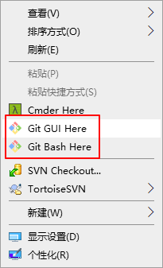
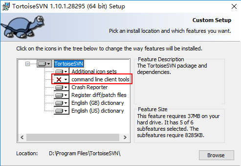
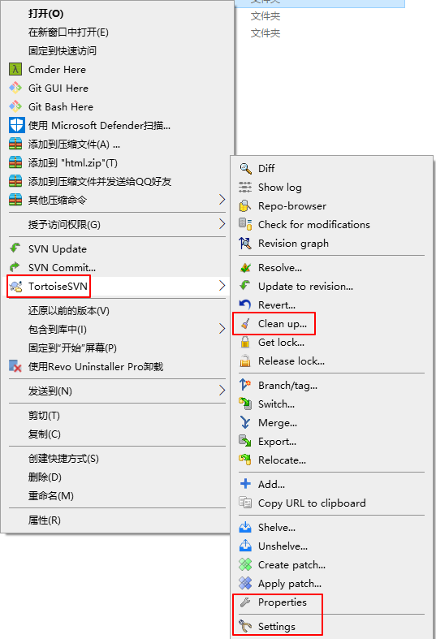
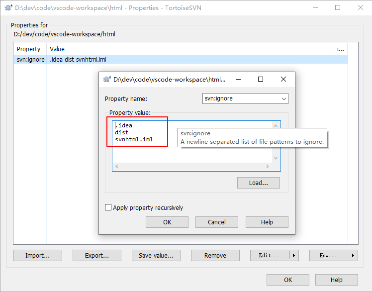
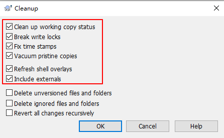

# 1. Git

Window 上安装Git

32 位安装包下载地址 : <https://github.com/git-for-windows/git/releases/download/v2.16.2.windows.1/Git-2.16.2-32-bit.exe>

64 位安装包下载地址 : <https://github.com/git-for-windows/git/releases/download/v2.16.2.windows.1/Git-2.16.2-64-bit.exe>

```shell
git --version
```

## 1.1  服务端

一般公司都有自己的gitlab服务器，无须自己安装，如果想练习，可以使用虚拟机进行安装！！！

## 1. 2 客户端



## 1.3 基本操作

1、Git 全局设置：设置姓名和邮箱

```shell
git config --global user.name "guodd369"
git config --global user.email "guodd369@163.com"
```

2、创建 git 仓库:

```shell
mkdir tj
cd tj
git init
touch README.md
git add README.md
git commit -m "first commit"
git remote add origin https://gitee.com/sunguo/tj.git
git push -u origin master
```

3、已有仓库

```shell
cd existing_git_repo
git remote add origin https://gitee.com/sunguo/tj.git
git push -u origin master
```

4、克隆项目

```shell
git clone 项目地址
例：git clone https://gitee.com/smallweigit/avue.git
```

5、拉取项目

```shell
git pull 本地分支名  远程分支名 
例：git pull origin master
```

6、提交文件

```shell
git add 你要提交的文件名或者路径
git commit -m '提交的注释'
git push 本地分支名 远程分支名 
例：
git add test.sh
git commit -m 'test测试文件'
git push origin master
```

7、常用命令

```shell
git init // 初始化本地git环境
git clone XXX// 克隆一份代码到本地仓库
git pull // 把远程库的代码更新到工作台
git pull --rebase origin master // 强制把远程库的代码跟新到当前分支上面
git fetch //把远程库的代码更新到本地库
git add . //把本地的修改加到stage中
git commit -m 'comments here' //把stage中的修改提交到本地库
git push //把本地库的修改提交到远程库中
git branch -r/-a //查看远程分支/全部分支
git checkout master/branch //切换到某个分支
git checkout -b test // 新建test分支
git checkout -d test // 删除test分支
git merge master // 假设当前在test分支上面，把master分支上的修改同步到test分支上
git merge tool // 调用merge工具
git stash // 把未完成的修改缓存到栈容器中
git stash list // 查看所有的缓存
git stash pop // 恢复本地分支到缓存状态
git blame someFile // 查看某个文件的每一行的修改记录（）谁在什么时候修改的）
git status // 查看当前分支有哪些修改
git log // 查看当前分支上面的日志信息
git diff // 查看当前没有add的内容
git diff --cache // 查看已经add但是没有commit的内容
git diff HEAD // 上面两个内容的合并
git reset --hard HEAD // 撤销本地修改
```

## 1.4 HTTP/SSH

1、桌面右键菜单点击Git Bash Here

2、生成密钥

```shell
ssh-keygen -t rsa -C "你的电子邮箱"
例：ssh-keygen -t rsa -C "pengwei_li_flag@163.com"
```

完后一直按Enter就行，出现了一大串字符，证明就成功了

3、查看密钥

```shell
cat ~/.ssh/id_rsa.pub
```

白色的部分就是你的密钥

4、已码云为例配置ssh

打开码云ssh 将你的密钥粘贴进去，点击保存

5、ssh链接测试

```shell
ssh -T git@gitee.com
```

看到welcome的字样ssh就配置

6、Git环境

```shell
git -c core.quotepath=false tag v1.0.0 1bdddb1697a5868ba1a9315599a469928bd100bb
git push origin v1.0.0.0      // 推送Tag到远程
git tag -d v1.0.0.1           // 删除本地tag
git push origin :refs/tags/v1.0.0.1     // 删除已经远程的tag
```

## 1.5 IDE集成


# 2. SVN


## 2.1 服务端

基本不需要自己安装，

## 2.2 客户端

1、安装客户端



2、设置客户端



3、屏蔽不提交东西



4、锁定问题



