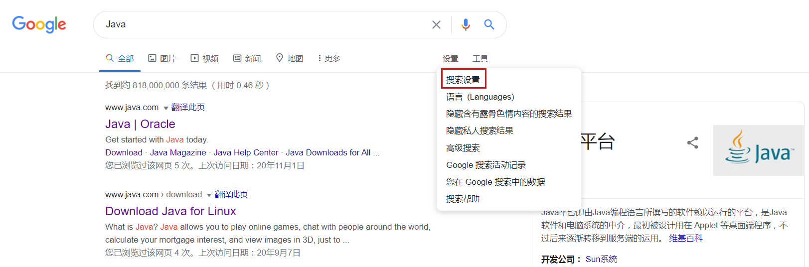
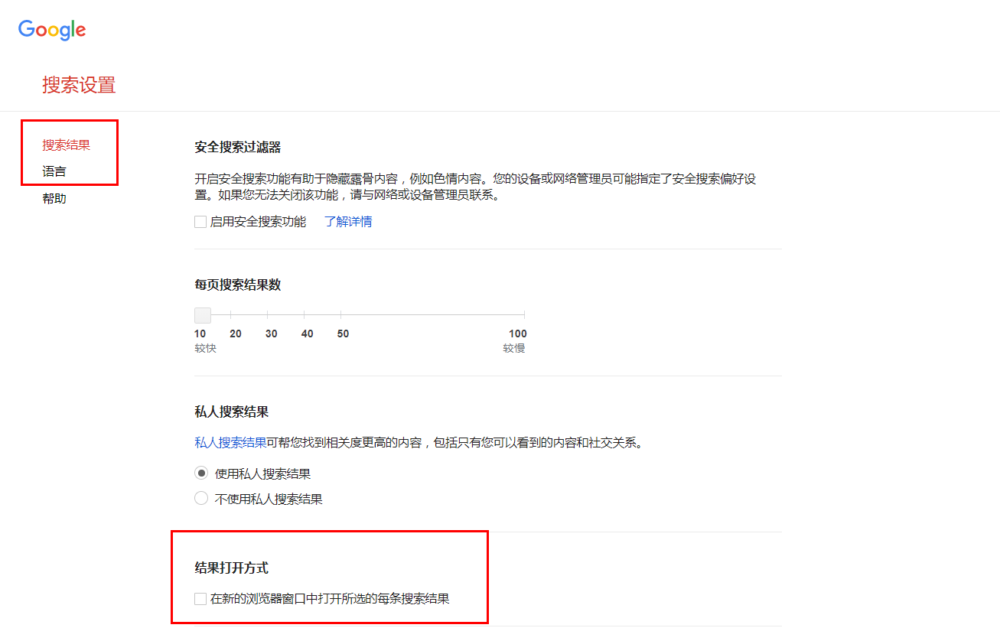

# 1 安装配置
## 1.1 下载
> 1.	下载绿色的mychrome安装包。可以到[zdfans](http://www.zdfans.com/)，版本 67.0.3396.99（正式版本） （64 位）
> 2.	对浏览器进行简单的配置。
> 3.	设置Google Chrome为默认浏览器

**注意：鼠标的中间键的作用可以是在新的tab页打开链接**

## 1.2 基础配置

1. 打开启动页调整！
2. 登录Google账号，进行书签和插件的同步！

## 1.3 为什么选择Google

> Google搜索的是你想要的，而其它浏览器（百度）搜索的是它自己想要的！

# 2 安装插件

插件下载地址：[Google插件迷](<https://extfans.com/>)

## 2.1 谷歌访问助手


## 2.2 扩展管理

> 自由定制你常用的扩展集合，一键查看、删除、启用/禁用扩展。并提供常用快捷方式。

## 2.3 暴力猴

>脚本汇集地！
>
>Bilibili Evolved，下载B站上的视频
>
>百度文库原文档免费下载，文档内容自由复制，移除广告；豆丁网文档下载；解除大部分网站操作限制；全网νP视频免费在线看皮持电视剧免跳出选集]
>
>百度网盎ⅦP破解，全速下载，自动填写提取码；全网ⅥP视频免费播放，去广告，支持电视剧直接选集；音乐无损下载，歌词下载，封面下载

## 2.4 去广告

> Adblock Plus：的免费广告拦截程序Adblock Plus 是拥有超过 5 亿次下载的全球最受欢迎的广告拦截软件之一。
>
> 广告终结者：清除网页上的所有广告：浮动广告，购物广告，恶意弹窗，跟踪代码。让你浏览网页更快更清爽。广告终结者，你唯一需要的广告插件，**推荐使用**。

## 2.5 FeHelper

> Awesome，All In One的一个工具，包含多个独立小应用，比如：Json工具、代码美化工具、代码压缩、二维码工具、markdown工具、网页油猴工。

## 2.6 Vimium

> 黑客的浏览器，Vimium以Vim的精神提供键盘快捷键，用于导航和控制。

## 2.7 Octotree

> Github代码阅读必备。


## 2.8 Infinity

> 百万用户选择的新标签页和快速拨号，自由添加网站图标，云端高清壁纸，快速访问书签、天气、笔记、待办事项、扩展管理与历史记录。使你的主页和开始页更加美观和易用。

## 2.11 全能启动器

> 启动器/便捷管理扩展/应用/标签/历史记录等

## 2.12 The Great Suspender

> Chrome浏览器很强大，基本上是开发者必备的，是世界上最流行的浏览器之一，但其最大的问题在于......我经常会开20个以上的标签页不关闭。

## 1.13 简悦

> 这是一款文章阅读美化神器，带来不一样的阅读体验。支持任意网页的自适应，可以把网页文章进行优美排版，能设置阅读背景，自动生成文章目录结构等。这个插件我真心推荐，好用到爆炸。让你瞬间进入沉浸式阅读的 Chrome 扩展，类似 Safari 的阅读模式。

# 3 前段调试
## 3.1 调试技巧
1. debugger
```
除了console.log, debugger是我们最喜欢、快速且肮脏的调试工具。执行代码后，Chrome会在执行时自动停止。你甚至可以把它封装成条件，只在需要时才运行。
if (thisThing) {
    debugger;
}
备注：F10为单步调试；F8为跳到下一个断点处。
```
2. 使用 console.time() 和 console.timeEnd() 测试循环
```
要得知某些代码的执行时间，特别是调试缓慢循环时，非常有用。 甚至可以通过给方法传入不同参数，来设置多个定时器。来看看它是怎么运行的：
console.time('Timer1');
var items = [];
for(var i = 0; i < 100000; i++){
   items.push({index: i});
}
console.timeEnd('Timer1');
```
3. javascript的简写方式
```
1. 三目运算符
const x = 20;
let answer;if (x > 10) {
    answer = 'greater than 10';
} else {
    answer = 'less than 10';
}
const answer = x > 10 ? 'greater than 10' : 'less than 10';
```
2. 循环语句
```
当使用纯 JavaScript（不依赖外部库，如 jQuery 或 lodash）时，下面的简写会非常有用。
for (let i = 0; i < allImgs.length; i++)
简写为：
for (let index of allImgs)
下面是遍历数组 forEach 的简写示例：
function logArrayElements(element, index, array) {
  console.log("a[" + index + "] = " + element);
}
[2, 5, 9].forEach(logArrayElements);// logs:// a[0] = 2// a[1] = 5// a[2] = 9
```
3. 声明变量
```
在函数开始之前，对变量进行赋值是一种很好的习惯。在申明多个变量时：
let x;
let y;
let z = 3;
可以简写为：
let x, y, z=3;
```
4. if 语句
```
在使用 if 进行基本判断时，可以省略赋值运算符。
if (likeJavaScript === true)
简写为：
if (likeJavaScript)
```
5. 变量赋值
```
当将一个变量的值赋给另一个变量时，首先需要确保原值不是 null、未定义的或空值。
可以通过编写一个包含多个条件的判断语句来实现：
if (variable1 !== null || variable1 !== undefined || variable1 !== '') {
     let variable2 = variable1;
}
或者简写为以下的形式：
const variable2 = variable1  || 'new';
```
6. 箭头函数
```
经典函数很容易读写，但是如果把它们嵌套在其它函数中进行调用时，整个函数就会变得有些冗长和混乱。这时候可以使用箭头函数来简写：
function sayHello(name) {
  console.log('Hello', name);
}
 
setTimeout(function() {
  console.log('Loaded')
}, 2000);
 
list.forEach(function(item) {
  console.log(item);
});

简写为：
sayHello = name => console.log('Hello', name);
setTimeout(() => console.log('Loaded'), 2000);
list.forEach(item => console.log(item));
```

# 4 搜索技巧
## 4.1 用 site 命令
> 科学上网 site:zhihu.com OR site:jianshu.com
>
> in:name spring stars:>30000

# 5 科学上网

## 5.1 新标签



