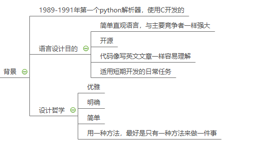
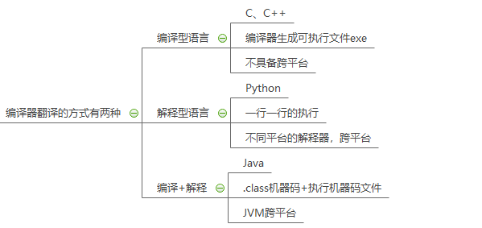
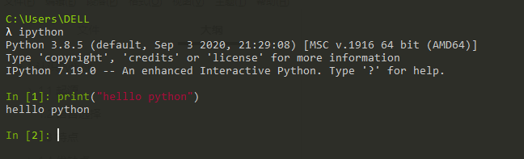

# 1 认识Python

人生苦短，我用Python —— Life is short, you need Python

了解语法是编程的先决条件，**精通语法**是编好程序的必要条件。

简洁、灵活、优雅、哲学；易于上手，难以精通。

回归**语言本质**，享受语言本身的纯粹之美。

## 1.1 起源



Python的创始人：吉多 · 范罗苏姆（Guido van Rossum）

1、**1989年**的圣诞节期间，吉多·范罗苏姆为了在阿姆斯特丹打发时间，决心开发一个新的**解释程序**，作为**ABC语言**的一种继承（**感觉下什么叫牛人**）。

2、ABC是由吉多参加设计的一种教学语言，就吉多本人看来，ABC这种语言非常优美和强大，是**专门为非专业程序员设计的**。但是 ABC 语言并没有成功，究其原因，吉多认为是**非开放**造成的。吉多决心在 Python 中避免这一错误，并获取了非常好的效果。

3、之所以选中Python（蟒蛇）作为程序的名字，是因为他是 BBC 电视剧——蒙提·派森的飞行马戏团（Monty Python's Flying Circus）的爱好者。

4、1991年，第一个 Python**解释器**诞生，它是用C语言实现的，并能够调用C语言的库文件。

## 1.2 解释器



计算机不能理解任何非**机器语言**之外的语言！！！所以要把程序员写的代码翻译成机器语言，计算机才能愉快的执行。将其他语言翻译成机器语言的工具称之为**编译器**！

编译器翻译的方式有两种：一个是**编译**，另外一个是**解释**。两种方式之间的区别在于**翻译时间点的不同**。

当编译器**以解释方式运行的时候**，也称之为**解释器**。


1、**编译型语言**：程序在执行之前需要一个专门的编译过程，把程序编译成为机器语言的文件，运行时不需要重新翻译，直接使用编译的结果就行了。程序执行效率高，依赖编译器，跨平台性差些。如 C、C++。

2、**解释型语言**：解释型语言编写的程序不进行预先编译，以文本方式存储程序代码，会将代码一句一句直接运行。在发布程序时，看起来省了道编译工序，但是在运行程序的时候，必须先解释再运行。

编译型语言和解释型语言对比

1、**速度**：编译型语言比解释型语言执行速度快。

2、**跨平台性**：解释型语言比编译型语言跨平台性好。

常见的python解释器类型：

* `CPython` —— 官方版本的 C 语言实现
* `Jython` —— 可以运行在 Java 平台
* `IronPython` —— 可以运行在 .NET 和 Mono 平台
* `PyPy` —— Python 实现的，支持 JIT 即时编译

## 1.3 设计目标

1999 年，**吉多·范罗苏姆**向DARPA提交了一条名为 “Computer Programming for Everybody” 的资金申请，并在后来说明了他对 Python 的目标：

1、一门**简单直观的语言**并与主要竞争者一样强大

2、开源，以便任何人都可以为它做贡献

3、代码**像纯英语那样容易理解**

4、适用于**短期**开发的日常任务

这些想法中的基本都已经成为现实，Python 已经成为一门流行的编程语言。

## 1.4 设计哲学

1、优雅

2、明确

3、简单

Python开发者的哲学是：**用一种方法，最好是只有一种方法来做一件事**；如果面临多种选择，Python开发者一般会拒绝花俏的语法，而选择**明确没有或者很少有歧义的语法**；在Python 社区，吉多被称为“仁慈的独裁者”。

1、简洁胜于复杂！

2、做也许好过不做，但不假思索就动手还不如不做！

## 1.5 语言选择

1、代码量少，简洁

2、……

同一样问题，用不同的语言解决，代码量差距还是很多的，一般情况下 `Python` 是 `Java` 的 **1/5**，所以说**人生苦短，我用Python**。

## 1.6 特点

Python语言的设计非常独特，它侧重于可读性、易用性及清晰性。一部分人则认为它是“可执行的伪代码”。

Python是**完全面向对象的语言**，Pythonic更简洁！！！

* **函数**、**模块**、**数字**、**字符串**都是对象，**在Python中一切皆对象**
* 完全支持抽象、封装、继承、多重继承、重载、重写、多态
* 支持重载运算符，也支持泛型设计
* 弱数据类型（非类型化）

Python**拥有一个强大的标准库**，Python 语言的核心只包含 **数字**、**字符串**、**列表**、**字典**、**文件** 等常见类型和函数，而由Python标准库提供了**系统管理**、**网络通信**、**文本处理**、**数据库接口**、**图形系统**、**XML 处理**等额外的功能。

Python 社区提供了**大量的第三方模块**，使用方式与标准库类似。它们的功能覆盖**科学计算**、**人工智能**、**机器学习**、**Web 开发**、**数据库接口**、**图形系统**多个领域。

胶水语言：混合其他如C、C++、Java等来编程，能够把其他语言制作成各种模块很轻松的联结在一起。

万金油：爬虫、大数据、web、测试、AI、脚本处理等。

## 1.7 优点

1、简单、易学

2、免费、开源

3、**面向对象**

4、丰富的库

5、可扩展性

如果需要一段关键代码运行得更快或者希望某些算法不公开，可以把这部分程序用 `C` 或 `C++` 编写，然后在 `Python` 程序中使用它们。

## 1.8 缺点

1、运行速度

2、国内市场较小

3、中文资料匮乏

Python是一个解释型语言，大多数情况下Python代码的**运行效率会低**于Java或C++等编译型语言。因为开发者时间通常比CPU时间更有价值，很多人就愉快地选择了使用Python。

当搭建**高并发、多线程**应用，尤其是多CPU绑定线程时，使用Python则会成为一项挑战。原因在于Python拥有全局解释器锁（GIL），这是一种防止解释器同时执行多个Python指令的机制。

# 2 第一个程序

Python源程序是一个特殊格式的文本文件，可以使用任意文本编辑软件做Python的开发；Python程序的文件扩展名通常都是.py！

## 2.1 Hello world

```python
print("python hello world!")
```



## 2.2 入口函数

```python
if __name__ == '__main__':
    pass
```


## 2.3 版本差异

主流版本：Python 2、Python 3

## 2.4 执行Python

### 2.4.1 解释器


### 2.4.2 IPython


### 2.4.3 Jupyter


### 2.4.4 IDE