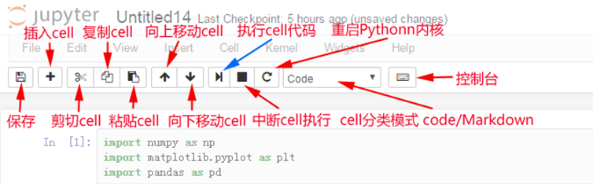

# 1 基础环境

## 1.1 Python

### 1.1.1 安装版

executable installer是可执行文件(*.exe)方式安装；

### 1.1.2 绿色版

embeddable zip file**嵌入式**版本，可以集成到其它应用中。

## 1.2 Pip

pip是用于安装和管理软件包的包管理器。

[参考资料](https://blog.csdn.net/qq_41582429/article/details/102158562)

### 1.2.1 镜像源

C:\Users\Administrator\pip\pip.ini

```properties
[global]
index-url = https://pypi.tuna.tsinghua.edu.cn/simple
# 这边的网址可以替换成下面任意一个，替换网址记得加/simple
# http://pypi.douban.com/
# http://pypi.hustunique.com/
# http://pypi.sdutlinux.org/
# http://pypi.mirrors.ustc.edu.cn/
[install]
trusted-host=pypi.tuna.tsinghua.edu.cn
```

### 1.2.2 配置Pip

pip是最方便的python依赖包安装器，在python3.4开始就进行了内置，不过因为我们下载的是**嵌入式版本**，为了追求最小化，没有进行内置，需要手工安装，不过似乎这样安装的版本**缺少很多库文件**，使用起来可能还比较麻烦。

1、从 https://bootstrap.pypa.io/get-pip.py 下载get-pip.py，放到python目录下

2、重要是修改python37._pth文件，去掉 #import site 前的 #号，即放开 import site；若不放开将会pip无法正确安装。

3、安装pip，执行python get-pip.py

python get-pip.py --trusted-host=files.pythonhosted.org --trusted-host=pypi.org

将在python目录下新建Scripts目录放置pip相关文件，以及 Lib\site-packages目录放置pip未来下载的扩展依赖模块库。

4、成功后，即可用类似 python -m pip install xxx 或直接使用 pip install xxx 的方式安装自己的依赖包（xxx替换为自己想安装的模块名）。

### 1.2.3 安装依赖

```properties
pip install pymysql
pip3 install psycopg2-binary   # 特别注意安装psycopg2
pip install pymysql==version
pip install -i https://pypi.tuna.tsinghua.edu.cn/simple -U funcat
-i: 指定库的安装源
-U:升级 原来已经安装的包，不带U不会装新版本，带上U才会更新到最新版本
```

### 1.2.4 卸载依赖

```properties
pip uninstall pymysql
pip list
pip freeze
# 安装指定版本的Django
pip install django==2.1.7
```

注意：后期有可能包比较多，我们可以选择Anaconda进行**环境、包**的一个管理！！！

## 1.3 Conda

conda是包及其**依赖**项和**环境**的管理工具。

### 1.3.1 Anaconda安装

Anaconda是一个包含180+的科学包及其依赖项的发行版本。其包含的科学包包括：conda, numpy, scipy, ipython notebook等。

1、下载安装

https://www.anaconda.com/products/individual

2、环境变量

最好安装时选择自动配置anaconda的环境变量，否则后期需要手动进行配置。

https://www.jianshu.com/p/62f155eb6ac5

E:\Anaconda（Python需要）
E:\Anaconda\Scripts（conda自带脚本）
E:\Anaconda\Library\mingw-w64\bin（使用C with python的时候）
E:\Anaconda\Library\bin（jupyter notebook动态库）

3、源配置

conda config --add channels r

修改：C:\Users\guodd\\.condarc，如果是Linux系统，文件在/root下

```shell
channels:
  - https://mirrors.tuna.tsinghua.edu.cn/anaconda/cloud/pytorch/
  - https://mirrors.tuna.tsinghua.edu.cn/anaconda/pkgs/main/
  - https://mirrors.tuna.tsinghua.edu.cn/anaconda/pkgs/free/
  - defaults
show_channel_urls: true
ssl_verify: true
```

执行配置

```properties
conda config --add channels https://mirrors.tuna.tsinghua.edu.cn/anaconda/pkgs/free/
conda config --add channels https://mirrors.tuna.tsinghua.edu.cn/anaconda/pkgs/main/
conda config --set show_channel_urls yes
```

4、源查看

```properties
conda config --show-sources
```

### 1.3.2 基本命令

```shell
# 版本信息
conda --version & conda -V
# 当前环境信息
conda info & conda info
```

### 1.3.3 下载依赖

```python
# 1、搜索模块
conda search --full-name <package_full_name>
# 2、安装模块
conda install <package_name>
# 3、指定安装版本
conda install pymysql=8.21
# 4、更新所以依赖
conda update --all
```

### 1.3.4 多环境

```python
# 1、创建环境
conda create -n py3.6 python=3.6 & conda create --name env_name python=3.6
conda create --name <new_env_name> --clone <copied_env_name>
# 2、查看当前环境列表
conda info --envs & conda info -e & conda env list
# 3、激活指定名称的环境
conda activate <env_name>
# 4、删除指定名称的环境
conda remove --name <env_name> --all
# 5、退出环境
conda deactivate
```

# 2 IDE环境

## 2.1 Pycharm


## 2.2 Ipython

IPython项目（http://ipython.org）开始于2001年，由Fernando Pérez发起，旨在开发一个更具交互性的Python解释器。

## 2.3 Jupyter

matplotlib和IPython社区合作简化了IPython shell（目前是Jupyternotebook）的交互式绘图。


