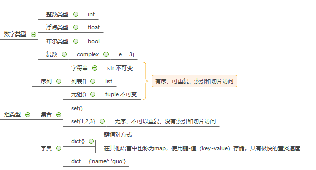
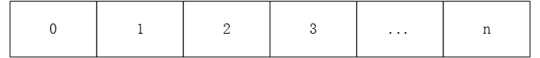
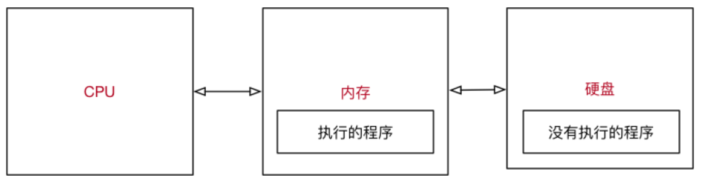

# 1 数据类型



## 1.1 数字类型

### 1.1.1 整数

一、认识整数int

```python
a = 1
print(type(a))
print(id(a))

```


### 1.1.2 浮点

一、认识浮点float

```python
b = 1.1
print(type(b))
print(id(b))

```


### 1.1.3 布尔

一、认识布尔boolean

```python
c = True
print(type(c))

```


### 1.1.4 复数

一、认识复数complex

complex

```python
d = 3j
print(type(d))

```

## 1.2 组类型

### 1.2.1 列表

一、认识列表list

1、列表是Python中使用**最频繁**的数据类型，其他语言称为**数组**。

2、语法结构：中括号**[]**中数据使用**逗号**隔开。

3、列表存储**相同数据类型**的数据，列表中的元素**可以修改**的。

4、列表的索引是从0开始的，索引就是数据在列表中的位置编号，索引又称为下标。

二、定义列表

```python
# 初始化列表
list_none = []
list_info = ["zhangsan", "lisi", "wangwu"]

list01 = list(range(1, 8))
list02 = [x * x for x in range(1, 11)]
list03 = [range(1, 11)]

# 坐标形式
x = ["10点{}分".format(i + 1) for i in range(60)]
y = [random.randint(20, 35) * i for i in range(120)]

# 列表推导式
z = [i for i in range(10) if i % 2 == 0]
n = [i/2 for i in range(9)]

print(type(list01))
print(type(list02))
print(type(list03))

for i in list03:
    print(i)
    for j in i:
        print(j)

# 元组转列表
a = (1, 2, 3, 4)

# 
if not isinstance(a, list):
    a = list(a)
print(a)
print(type(a))
```



三、基本操作

| 序号 | 分类 | 关键字 / 函数 / 方法     | 说明                     |
| ---- | ---- | ------------------------ | ------------------------ |
| 1    | 增加 | 列表1.insert(索引, 数据) | 在指定位置插入数据       |
|      |      | 列表1.append(数据)       | 在末尾插入数据           |
|      |      | 列表1.extend(列表2)      | 将列表2的数据插入到列表1 |
| 2    | 删除 | 列表1.remove(数据)       | 删除第一个出现的指定数据 |
|      |      | 列表1.pop                | 删除末尾数据             |
|      |      | 列表1.pop(索引)          | 删除指定索引数据         |
|      |      | 列表1.clear              | 清空列表                 |
|      |      | del 列表1(索引)          | 删除指定索引数据         |
| 3    | 修改 | 列表1[索引] = 数据       | 修改指定索引数据         |
| 4    | 查询 | 列表1[0]                 | 查询指定索引数据         |
|      |      | 列表1.index("lisi")      | 数据索引位置             |
| 5    | 统计 | len(列表1)               | 列表长度                 |
|      |      | 列表1.count(数据)        | 数据在列表中出现的次数   |
| 6    | 排序 | 列表1.sort()             | 升序排序                 |
|      |      | 列表1.sort(reverse=True) | 降序排序                 |
|      |      | 列表1.reverse()          | 逆序、反转               |

四、遍历

遍历是从头到尾依次从列表中获取数据，在Python中为了提高列表的遍历效率，专门提供了迭代遍历iteration。

使用for就可以进行遍历操作。

```python
# for 循环内部使用的变量 in 列表
for name in info_name:

    循环内部针对列表元素进行操作
    print(name)
    
# 带下标循环
info_name = ["zhangsan", "lisi", "wangwu"]
for k, v in enumerate(info_name):
    print(k, v)
```

### 1.2.2 元组

一、认识元组tuple

1、元组Tuple和列表类似，不同之处在于元组的**元素不能修改**。

2、语法构成：**小括号()**中数据使用逗号分隔，如果**只有一个元素**后面要加逗号。

3、元组存储不同数据类型的数据，列表中的元素不能修改。

4、列表和元组的相互转换：list(tuple)、tuple(list)

二、定义元组

```python
# 初始化元组
tuple_none = ()
tuple_info = ("zhangsan", "lisi", "wangwu")

# 列表转元组
a = [1, 2, 3, 4]

if not isinstance(a, tuple):
    a = set(a)
print(a)
print(type(a))
```

三、基本操作

| 序号 | 分类 | 关键字 / 函数 / 方法     | 说明                     |
| ---- | ---- | ------------------------ | ------------------------ |
| 1    | 增加 | 列表1.insert(索引, 数据) | 在指定位置插入数据       |
|      |      | 列表1.append(数据)       | 在末尾插入数据           |
|      |      | 列表1.extend(列表2)      | 将列表2的数据插入到列表1 |
| 2    | 删除 | 列表1.remove(数据)       | 删除第一个出现的指定数据 |
|      |      | 列表1.pop                | 删除末尾数据             |
|      |      | 列表1.pop(索引)          | 删除指定索引数据         |
|      |      | 列表1.clear              | 清空列表                 |
|      |      | del 列表1(索引)          | 删除指定索引数据         |
| 3    | 修改 | 列表1[索引] = 数据       | 修改指定索引数据         |
| 4    | 查询 | 列表1[0]                 | 查询指定索引数据         |
|      |      | 列表1.index("lisi")      | 数据索引位置             |
| 5    | 统计 | len(列表1)               | 列表长度                 |
|      |      | 列表1.count(数据)        | 数据在列表中出现的次数   |
| 6    | 排序 | 列表1.sort()             | 升序排序                 |
|      |      | 列表1.sort(reverse=True) | 降序排序                 |
|      |      | 列表1.reverse()          | 逆序、反转               |

### 1.2.3 集合

一、认识集合set

set和dict类似，也是一组key的集合，但不存储value。由于key不能重复，所以，在set中，没有重复的key。

二、定义集合

```python
set_none = Set()
set_info = {"zhangsan", "lisi", "lisi"}
```

三、基本操作

| 序号 | 分类 | 关键字 / 函数 / 方法     | 说明                     |
| ---- | ---- | ------------------------ | ------------------------ |
| 1    | 增加 | 列表1.insert(索引, 数据) | 在指定位置插入数据       |
|      |      | 列表1.append(数据)       | 在末尾插入数据           |
|      |      | 列表1.extend(列表2)      | 将列表2的数据插入到列表1 |
| 2    | 删除 | 列表1.remove(数据)       | 删除第一个出现的指定数据 |
|      |      | 列表1.pop                | 删除末尾数据             |
|      |      | 列表1.pop(索引)          | 删除指定索引数据         |
|      |      | 列表1.clear              | 清空列表                 |
|      |      | del 列表1(索引)          | 删除指定索引数据         |
| 3    | 修改 | 列表1[索引] = 数据       | 修改指定索引数据         |
| 4    | 查询 | 列表1[0]                 | 查询指定索引数据         |
|      |      | 列表1.index("lisi")      | 数据索引位置             |
| 5    | 统计 | len(列表1)               | 列表长度                 |
|      |      | 列表1.count(数据)        | 数据在列表中出现的次数   |
| 6    | 排序 | 列表1.sort()             | 升序排序                 |
|      |      | 列表1.sort(reverse=True) | 降序排序                 |
|      |      | 列表1.reverse()          | 逆序、反转               |

### 1.2.4 字典

一、认识字典dict

1、字典是除了列表之外Python之中，列表保存的有序集合，字典保存无序集合。

2、语法构成：**大括号{}**中的数据使用**键值对**用**逗号**分隔。

3、键必须是唯一的，只能是**不可变**的数据类型。

4、值可以取任何数据类型。

二、字典的定义

```python
dict_none = {}
dict_info = {"name": "guod", "age": 12}
```

定义的字典和输出的字典是不一定一样的，因为字典是无序的！！

三、基本操作

| 序号 | 分类 | 关键字 / 函数 / 方法     | 说明                     |
| ---- | ---- | ------------------------ | ------------------------ |
| 1    | 增加 | 列表1.insert(索引, 数据) | 在指定位置插入数据       |
|      |      | 列表1.append(数据)       | 在末尾插入数据           |
|      |      | 列表1.extend(列表2)      | 将列表2的数据插入到列表1 |
| 2    | 删除 | 列表1.remove(数据)       | 删除第一个出现的指定数据 |
|      |      | 列表1.pop                | 删除末尾数据             |
|      |      | 列表1.pop(索引)          | 删除指定索引数据         |
|      |      | 列表1.clear              | 清空列表                 |
|      |      | del 列表1(索引)          | 删除指定索引数据         |
| 3    | 修改 | 列表1[索引] = 数据       | 修改指定索引数据         |
| 4    | 查询 | 列表1[0]                 | 查询指定索引数据         |
|      |      | 列表1.index("lisi")      | 数据索引位置             |
| 5    | 统计 | len(列表1)               | 列表长度                 |
|      |      | 列表1.count(数据)        | 数据在列表中出现的次数   |
| 6    | 排序 | 列表1.sort()             | 升序排序                 |
|      |      | 列表1.sort(reverse=True) | 降序排序                 |
|      |      | 列表1.reverse()          | 逆序、反转               |

四、遍历

```python
info_dict_none = {}
info_dict = {"name": "guod", "age": 12}

# 方式一
for k in info_dict:
    print(k, info_dict[k])
 
# 方式二
print(type(info_dict))
for k, v in enumerate(info_dict):
    print(k, v, info_dict[v])
```


### 1.2.5 字符串

一、认识字符串str


二、字符串定义

```python
str_info = "hello world!"
```


三、基本操作

| 序号 | 关键字 / 函数 / 方法 | 说明                                                         |
| ---- | -------------------- | ------------------------------------------------------------ |
| 1    | string.isspace()     | 如果 string 中只包含空格，则返回 True                        |
| 2    | string.isalnum()     | 如果 string 至少有一个字符并且所有字符都是字母或数字则返回 True |
| 3    | string.isalpha()     | 如果 string 至少有一个字符并且所有字符都是字母则返回 True    |
| 4    | string.isdecimal()   | 如果 string 只包含数字则返回 True，`全角数字`                |
| 5    | string.isdigit()     | 如果 string 只包含数字则返回 True，`全角数字`、`⑴`、`\u00b2` |
| 6    | string.isnumeric()   | 如果 string 只包含数字则返回 True，`全角数字`，`汉字数字`    |
| 7    | string.istitle()     | 如果 string 是标题化的(每个单词的首字母大写)则返回 True      |
| 8    | string.islower()     | 如果 string 中包含至少一个区分大小写的字符，并且所有这些(区分大小写的)字符都是小写，则返回 True |
| 9    | string.isupper()     | 如果 string 中包含至少一个区分大小写的字符，并且所有这些(区分大小写的)字符都是大写，则返回 True |

四、遍历


### 1.2.6 公共方法

一、内置函数

| 函数              | 描述                              | 备注                         |
| ----------------- | --------------------------------- | ---------------------------- |
| len(item)         | 计算容器中元素个数                |                              |
| del(item)         | 删除变量                          | del 有两种方式               |
| max(item)         | 返回容器中元素最大值              | 如果是字典，只针对 key 比较  |
| min(item)         | 返回容器中元素最小值              | 如果是字典，只针对 key 比较  |
| cmp(item1, item2) | 比较两个值，-1 小于/0 相等/1 大于 | Python 3.x 取消了**cmp函数** |

二、切片

| 描述 | Python 表达式      | 结果    | 支持的数据类型     |
| :--: | ------------------ | ------- | ------------------ |
| 切片 | "0123456789"[::-2] | "97531" | 字符串、列表、元组 |

**切片**使用**索引值**来限定范围，从一个大的**字符串**中**切出**小的**字符串**

**列表**和**元组**都是**有序**的集合，都能够**通过索引值**获取到对应的数据

**字典**是一个**无序**的集合，是使用**键值对**保存数据

三、运算符

|    运算符    | Python 表达式         | 结果                         | 描述           | 支持的数据类型           |
| :----------: | --------------------- | ---------------------------- | -------------- | ------------------------ |
|      +       | [1, 2] + [3, 4]       | [1, 2, 3, 4]                 | 合并           | 字符串、列表、元组       |
|      *       | ["Hi!"] * 4           | ['Hi!', 'Hi!', 'Hi!', 'Hi!'] | 重复           | 字符串、列表、元组       |
|      in      | 3 in (1, 2, 3)        | True                         | 元素是否存在   | 字符串、列表、元组、字典 |
|    not in    | 4 not in (1, 2, 3)    | True                         | 元素是否不存在 | 字符串、列表、元组、字典 |
| > >= == < <= | (1, 2, 3) < (2, 2, 3) | True                         | 元素比较       | 字符串、列表、元组       |

**注意**

* `in` 在对**字典**操作时，判断的是**字典的键**
* `in` 和 `not in` 被称为 **成员运算符**

四、完整变量

```python
for 变量 in 集合:
    
    循环体代码
else:
    没有通过 break 退出循环，循环结束后，会执行的代码
```

## 1.3 枚举类型

### 1.3.1 普通枚举

Python中的枚举（Enum）是**通过继承**的方式实现的，而Java中的枚举是有专门的枚举类型。

```python
from enum import Enum


class StudentEnum(Enum):
    RED = 1
    GREEN = 2
    BLUE = 3


print(StudentEnum.RED)

```


## 1.4 Json类型

Json是一种数据格式，一种规范，数据交换标准。

### 1.4.1 序列化

序列化是将Java字符串转换成对象。

```python
import json

json_dict = {"name": "guo"}
print(type(json_dict))
# 序列化
json_str = json.dumps(json_dict)
print(type(json_str))

```

### 1.4.2 反序列化

序列化是将Java字符串转换成对象。

```python
import json

json_info = '{"name": "guo"}'
print(type(json_info))
# 反序列化
obj_dict = json.loads(json_info)
print(type(obj_dict))

```

## 1.5 进制类型

### 1.5.1 二进制

```python
m = bin(3)
n = oct(9)
o = int(11)
p = hex(17)
```


## 1.6 其他

### 1.6.1 Nan


### 1.6.2 Inf


### 1.7.3 None


### 1.7.4 鸭子类型

“鸭子类型”的说法源于“一个东西走起来像鸭子叫起来像鸭子，那它就是鸭子”。例如，你可以验证一个对象如果实现了迭代器协议，那它一定是可以迭代的。对于很多对象来说，它包含了一个__iter__魔术方法，但使用iter函数是一个更好的、独立的方法。

# 2 注释

## 2.1 注解作用

使用用自己熟悉的语言，在程序中对某些代码进行标注说明，增强程序的**可读性**。

## 2.2 单行注解

以 `#` 开头，`#` 右边的所有东西都被当做说明文字，而不是真正要执行的程序，只起到辅助说明作用

为了保证代码的可读性，`#` 后面建议先添加一个空格，然后再编写相应的说明文字

在程序开发时，同样可以使用 `#` 在代码的后面（旁边）增加说明性的文字，但是，需要注意的是，**为了保证代码的可读性**，**注释和代码之间**至少要有**两个空格**

## 2.3 多行注解

如果希望编写的**注释信息很多，一行无法显示**，就可以使用多行注释

要在Python程序中使用多行注释，可以用**一对连续的三个引号**(单引号和双引号都可以)

## 2.4 使用场景

1、**注释不是越多越好**，对于一目了然的代码，不需要添加注释

2、对于**复杂的操作**，应该在操作开始前写上若干行注释

3、对于**不是一目了然的代码**，应在其行尾添加注释（为了提高可读性，注释应该至少离开代码 2 个空格）

4、**绝不要描述代码**，假设阅读代码的人比你更懂Python，他只是不知道你的代码要做什么

> 在一些正规的开发团队，通常会有**代码审核**的惯例，就是一个团队中彼此阅读对方的代码

## 2.5 自定义注释

```python
#!/usr/bin/env python
# -*- coding: utf-8 -*-
""""
@Project ：${PROJECT_NAME}
@File    ：${NAME}.py
@Author  ：${USER}
@IDE     ：${PRODUCT_NAME}
"""
```

# 3 运算符

**计算机**，顾名思义就是负责进行**数学计算**并且**存储计算结果**的电子设备。

## 3.1 算术运算符

算数运算符是**运算符的一种**，是完成基本的算术运算使用的符号，用来处理四则运算。

| 运算符 |  描述  | 实例                                       |
| :----: | :----: | ------------------------------------------ |
|   +    |   加   | 10 + 20 = 30                               |
|   -    |   减   | 10 - 20 = -10                              |
|   *    |   乘   | 10 * 20 = 200，字符串重复指定次数的结果    |
|   /    |   除   | 10 / 20 = 0.5                              |
|   //   | 取整除 | 返回除法的整数部分（商） 9 // 2 输出结果 4 |
|   %    | 取余数 | 返回除法的余数 9 % 2 = 1                   |
|   **   |   幂   | 又称次方、乘方，2 ** 3 = 8                 |

优先级：先乘除后加减；同级运算符从左至右计算；()可以改变运算**优先级**。

## 3.2 比较运算符

比较运算符是指可以使用下列运算符比较两个值。当用运算符比较两个值时，结果是一个**逻辑值**，不是 TRUE（成立） 就是 FALSE（不成立）的运算符号。

| 运算符 | 描述                                                         |
| ------ | ------------------------------------------------------------ |
| ==     | 检查两个操作数的值是否 **相等**，如果是，则条件成立，返回 True |
| !=     | 检查两个操作数的值是否 **不相等**，如果是，则条件成立，返回 True |
| >      | 检查左操作数的值是否 **大于** 右操作数的值，如果是，则条件成立，返回 True |
| <      | 检查左操作数的值是否 **小于** 右操作数的值，如果是，则条件成立，返回 True |
| >=     | 检查左操作数的值是否 **大于或等于** 右操作数的值，如果是，则条件成立，返回 True |
| <=     | 检查左操作数的值是否 **小于或等于** 右操作数的值，如果是，则条件成立，返回 True |

## 3.3 逻辑运算符

**逻辑运算符**可以把**多个条件**按照**逻辑**进行**连接**，变成**更复杂的条件**

| 运算符 | 逻辑表达式 | 描述                                                         |
| ------ | ---------- | ------------------------------------------------------------ |
| and    | x and y    | 只有 x 和 y 的值都为 True，才会返回 True 否则只要 x 或者 y 有一个值为 False，就返回 False |
| or     | x or y     | 只要 x 或者 y 有一个值为 True，就返回 True 只有 x 和 y 的值都为 False，才会返回 False |
| not    | not x      | 如果 x 为 True，返回 False 如果 x 为 False，返回 True        |

## 3.4 赋值运算符

基本的赋值运算符是“=”。他的优先级别低于其他的运算符，所以对该运算符往往最后读取。

| 运算符 | 描述                      | 实例                                  |
| ------ | ------------------------- | ------------------------------------- |
| =      | 简单的赋值运算符          | c = a + b 将 a + b 的运算结果赋值为 c |
| +=     | 加法赋值运算符            | c += a 等效于 c = c + a               |
| -=     | 减法赋值运算符            | c -= a 等效于 c = c - a               |
| *=     | 乘法赋值运算符            | c *= a 等效于 c = c * a               |
| /=     | 除法赋值运算符            | c /= a 等效于 c = c / a               |
| //=    | 取整除赋值运算符          | c //= a 等效于 c = c // a             |
| %=     | 取**模** (余数)赋值运算符 | c %= a 等效于 c = c % a               |
| **=    | 幂赋值运算符              | c **= a 等效于 c = c**  a             |

## 3.5 成员运算符

成员运算符用于**测试**序列中是否包含指定的**成员**。

|    运算符    | Python 表达式         | 结果                         | 描述           | 支持的数据类型           |
| :----------: | --------------------- | ---------------------------- | -------------- | ------------------------ |
|      +       | [1, 2] + [3, 4]       | [1, 2, 3, 4]                 | 合并           | 字符串、列表、元组       |
|      *       | ["Hi!"] * 4           | ['Hi!', 'Hi!', 'Hi!', 'Hi!'] | 重复           | 字符串、列表、元组       |
|      in      | 3 in (1, 2, 3)        | True                         | 元素是否存在   | 字符串、列表、元组、字典 |
|    not in    | 4 not in (1, 2, 3)    | True                         | 元素是否不存在 | 字符串、列表、元组、字典 |
| > >= == < <= | (1, 2, 3) < (2, 2, 3) | True                         | 元素比较       | 字符串、列表、元组       |

## 3.6 运算符优先级

和数学中的运算符的优先级一致，在Python中进行数学计算时，同样也是：以下表格的算数优先级由高到最低顺序排列

| 运算符                   | 描述                   |
| ------------------------ | ---------------------- |
| **                       | 幂 (最高优先级)        |
| * / % //                 | 乘、除、取余数、取整除 |
| + -                      | 加法、减法             |
| <= < > >=                | 比较运算符             |
| == !=                    | 等于运算符             |
| = %= /= //= -= += *= **= | 赋值运算符             |
| not or and               | 逻辑运算符             |

# 4 变量

在Python中，每个变量在使用前都必须赋值，变量**赋值**后才会被创建。

## 4.1 标识符

**标识符**（英文对应词：**identifier**，缩写为**ID**），又称为**识别码**，是一个用来**识别物件的名称**，识别对象可能是概念、具体可数的物体或是不可数的物质。标识符可能是字、编号、字母、符号，也可能是由上述元素所组成。

在编程语言中，标识符就是程序员自己规定的具有特定含义的词，比如类名称，属性名称，变量名等。

## 4.2 命名规范

模块：全小写

类：大驼峰

变量：下划线

方法：小驼峰

## 4.3 引用

变量和数据都是保存在**内存**中的，在Python中函数的参数传递以及返回值都是靠**引用**传递的。

变量和数据是分开存储的，**栈、堆**内存中。

查看引用**地址值**：id(obj)

## 4.4 可变/不可变

* **不可变类型**，内存中的数据不允许被修改：
  * 数字类型 `int`, `bool`, `float`, `complex`, `long(2.x)`
  * 字符串 `str`
  * 元组 `tuple`

* **可变类型**，内存中的数据可以被修改
  * 列表 `list`
  * 字典 `dict`
  * 集合 `set`

## 4.5 局部/全局变量

局部变量是在函数内部定义的变量，**只能在函数内部使用**

全局变量是在函数外部定义的变量（没有定义在某一个函数内），**所有函数**内部**都可以使用这个变量**

> 提示：在其他的开发语言中，大多**不推荐使用全局变量** —— 可变范围太大，导致程序不好维护！

```python
# 定义一个全局变量
num = 10


def demo1():

    print(num)


def demo2():

    print(num)

demo1()
demo2()

print("over")
```

1、首先查找函数内部是否有指定名称的局部变量，如果有直接使用。

2、如果没有查找函数外部是否有，如果有直接使用。

3、如果都没有程序报错。

```python
num = 10


def demo1():

    print("demo1" + "-" * 50)

    # 只是定义了一个局部变量，不会修改到全局变量，只是变量名相同而已
    num = 100
    print(num)


def demo2():

    print("demo2" + "-" * 50)
    print(num)

demo1()
demo2()

print("over")

```

1、全局变量是在函数外部定义的变量（没有定义在某一个函数内），所有函数内部都可以使用这个变量

2、在函数内部，可以 **通过全局变量的引用获取对应的数据**

3、但是，**不允许直接修改全局变量的引用** —— 使用赋值语句修改全局变量的值

> 提示：在其他的开发语言中，大多 **不推荐使用全局变量** —— 可变范围太大，导致程序不好维护！
>
> 全局变量名前应该增加 `g_` 或者 `gl_` 的前缀

## 4.6 格式输出

如果希望输出文字信息的同时，一起输出数据，就需要使用到格式化操作符。

`%` 被称为**格式化操作符**，专门用于处理字符串中的格式。

| 格式化字符 | 含义                                                         |
| ---------- | ------------------------------------------------------------ |
| %s         | 字符串                                                       |
| %d         | 有符号十进制整数，`%06d` 表示输出的整数显示位数，不足的地方使用 `0` 补全 |
| %f         | 浮点数，`%.2f` 表示小数点后只显示两位                        |
| %%         | 输出 `%`                                                     |

```python
print("我的名字叫 %s，请多多关照！" % name)
print("我的学号是 %06d" % student_no)
print("苹果单价 %.02f 元／斤，购买 %.02f 斤，需要支付 %.02f 元" % (price, weight, money))
print("数据比例是 %.02f%%" % (scale * 100))
```

## 4.7 全局修改变量

如果在函数中需要修改全局变量，需要使用**global进行**声明。

**nonlocal声明**的变量不是局部变量，也不是全局变量，而是外部嵌套函数内的变量。

## 4.8 语法糖

并不增加新特性，但便利于代码编写的编程语法。

## 4.9 输入/输出

一、输入

```python
pwd = input("请输入密码：")
```

特别注意input接受的数据类型默认是**str字符串类型**，如果使用注意转换。

二、输出

# 5 函数

## 5.1 快速体验

### 5.1.1 概念

所谓的函数，就是把具有独立功能的代码块组织成一个小模块，在需要的时候进行调用。

函数使用步骤：1、定义函数-封装独立的功能；2、调用函数-享受封装的成果。

函数的作用：在开发程序时，使用函数提供编程的效率以及代码的**重用**。

### 5.1.2 九九乘法表

## 5.2 基本使用

### 5.2.1 定义

```python
def 函数名():

    函数封装的代码
    ……
```

1、def是define的缩写。

2、函数名应该能够表达封装代码的功能，方便后续调用。

3、函数名称的命名应该符合标识符的命名规范，字母、数字、下划线组成，数字不能开头且不能是关键字。

4、函数要**先定义**后使用。

### 5.2.2 调用

调用函数很简单的，通过 `函数名()` 即可完成对函数的调用。

```python
name = "小明"


# 解释器知道这里定义了一个函数
def say_hello():
    print("hello 1")
    print("hello 2")
    print("hello 3")

print(name)
# 只有在调用函数时，之前定义的函数才会被执行
# 函数执行完成之后，会重新回到之前的程序中，继续执行后续的代码
say_hello()

print(name)
```

注意：函数要先定义后使用，不能在函数定义之前调用函数！

## 5.3 参数

### 5.3.1 参数使用

在函数名的后面的小括号内部填写**参数**，多个参数之间使用 `,` 分隔。

### 5.3.2 参数作用

函数的参数可以增加函数的通用性，针对相同的数据处理逻辑能够适应更多的数据。

1、在函数内部，把参数当做变量使用，进行需要的数据处理。

2、函数调用时，按照函数定义的参数顺序，把希望在函数内部处理的数据通过参数传递。

### 5.3.3 形参和实参

形参**：**定义函数时，小括号中的参数，是用来接收参数用的，在函数内部**作为变量使用**。

实参**：**调用函数时，小括号中的参数，是用来把数据传递到**函数内部**用的。

## 5.4 返回值

### 5.4.1 基本返回

在程序开发中，有时候，会希望**一个函数执行结束后，告诉调用者一个结果**，以便调用者针对具体的结果做后续的处理。

1、返回值是函数完成工作后，最后给调用者的一个结果。

2、在函数中使用return关键字返回结果。

3、在调用方，可以使用变量来接收函数返回的结果。

### 5.4.2 返回函数

函数的返回结果可以是一个函数。

## 5.5 嵌套调用

### 5.5.1 相互嵌套

一个函数里面又调用了另一个函数，这就是函数的嵌套调用。

```python
def test1():

    print("*" * 50)
    print("test 1")
    print("*" * 50)


def test2():

    print("-" * 50)
    print("test 2")
    
    test1()
    
    print("-" * 50)

test2()
```

### 5.5.2 递归


## 5.6 模块函数

### 5.6.1 概念

模块是Python程序架构的一个核心概念，模块好比一个工具包，要想使用这个工具包中的工具，就需要导入import这个模块；每一个以扩展名.py结尾的Python源代码文件都是一个模块；在模块中定义的全局变量、函数都是模块能够提供给外界直接使用的工具。

### 5.6.2 导入模块

import关键字：import models.py01

from关键字：from models.py01 import num, fun、from 模块名1 import *

## 5.7 参数返回值


### 5.7.1 无参无返回值


### 5.7.2 无参有返回值


### 5.7.3 有参无返回值


### 5.7.4 有参有返回值


## 5.8 缺省参数

### 5.8.1 认识

* 定义函数时，可以给 **某个参数** 指定一个**默认值**，具有默认值的参数就叫做**缺省参数**
* 调用函数时，如果没有传入**缺省参数** 的值，则在函数内部使用定义函数时指定的**参数默认值**
* 函数的缺省参数，**将常见的值设置为参数的缺省值**，从而**简化函数的调用**

```python
def demo(num, *args, **kwargs):
    print(num)
    print(args)
    print(kwargs)


demo(1, 2, 3, 4, 5, name="小明", age=18, gender=True)
```

## 5.9 多值参数

### 5.9.1 认识

有时可能需要**一个函数能够处理的参数**个数是不确定的，这个时候，就可以使用**多值参数**

* `python` 中有 **两种** 多值参数：
  * 参数名前增加**一个** `*` 可以接收**元组**
  * 参数名前增加**两个** `**` 可以接收**字典**
* 一般在给多值参数命名时，**习惯**使用以下两个名字
  * `*args` —— 存放 **元组** 参数，前面有一个 `*`
  * `**kwargs` —— 存放 **字典** 参数，前面有两个 `*`
* `args` 是 `arguments` 的缩写，有变量的含义
* `kw` 是 `keyword` 的缩写，`kwargs` 可以记忆 **键值对参数**

类比Java中的多参数。

```python
def demo(num, *args, **kwargs):

    print(num)
    print(args)
    print(kwargs)


demo(1, 2, 3, 4, 5, name="小明", age=18, gender=True)
```

## 5.10 函数递归

### 5.10.1 递归构成


### 5.10.2 案例

```python
def sum_numbers(num):

    print(num)
    
    # 递归的出口很重要，否则会出现死循环
    if num == 1:
        return

    sum_numbers(num - 1)
    
sum_numbers(3)
```

## 5.11 内建函数

### 5.11.1 使用

eval函数十分强大，将字符串当成有效的表达式来运行，并返回运行结果。

```python
num = input("请输入：")
print(eval(num))

# 基本的数学计算
In [1]: eval("1 + 1")
Out[1]: 2

# 字符串重复
In [2]: eval("'*' * 10")
Out[2]: '**********'

# 将字符串转换成列表
In [3]: type(eval("[1, 2, 3, 4, 5]"))
Out[3]: list

# 将字符串转换成字典
In [4]: type(eval("{'name': 'xiaoming', 'age': 18}"))
Out[4]: dict
```

### 5.11.2 注意

在开发过程中千万不要使用eval直接转换input的结果！！

```python
__import__('os').system('ls')
```

等价代码

```python
import os

os.system("终端命令")
```

执行成功，返回 0

执行失败，返回错误信息

# 6 数据流

## 6.1 顺序


## 6.2 分支

```python
if 今天发工资:

    先还信用卡的钱

    if 有剩余:

        又可以happy了，O(∩_∩)O哈哈~

    else:

        噢，no。。。还的等30天
else:

    盼着发工资
```


```python
if 条件1:
    条件1满足执行的代码
    ……
elif 条件2:
    条件2满足时，执行的代码
    ……
elif 条件3:
    条件3满足时，执行的代码
    ……
else:
    以上条件都不满足时，执行的代码
    ……
```


```python
if 条件1 and 条件2:
    条件1满足 并且 条件2满足 执行的代码
    ……
```


## 6.3 循环

一、基本语法

```python

while 条件(判断 计数器 是否达到 目标次数):
    条件满足时，做的事情1
    条件满足时，做的事情2
    条件满足时，做的事情3
    ...(省略)...
    
    处理条件(计数器 + 1)
    
    
while 条件 1:
    条件满足时，做的事情1
    条件满足时，做的事情2
    条件满足时，做的事情3
    ...(省略)...
    
    while 条件 2:
        条件满足时，做的事情1
        条件满足时，做的事情2
        条件满足时，做的事情3
        ...(省略)...
    
        处理条件 2
    
    处理条件 1
```

二、控制语句

break、continue

三、遍历方式

```python
# 方式一
info = [1, 2, 4, 5]
for v in info:
    print(v, end=" ")

# 方式二
info = [1, 2, 4, 5]
for k, v in enumerate(info):
    print(k, v)
```

# 7 程序执行

## 7.1 三大组件

### 7.1.1 CUP

中央处理器，是一块超大规模的集成电路

负责处理数据、计算

### 7.1.2 内存

临时存储数据（断电之后，数据会消失）

速度快

空间小（单位价格高）

### 7.1.3 磁盘

永久存储数据

速度慢

空间大（单位价格低）

## 7.2 执行原理



1、程序 **运行之前**，程序是 **保存在硬盘** 中的

2、当要运行一个程序时

* 操作系统会首先让**CPU**把程序复制到**内存**中
* **CPU**执行**内存**中的**程序代码**

> **程序要执行，首先要被加载到内存**

## 7.3 程序作用

程序就是**用来处理数据**的，而变量就是用来存储数据的！

## 7.4 Pyc

因为py文件是可以直接看到源码的，如果你是开发商业软件的话，不可能把源码也泄漏出去吧？所以就需要编译为pyc后，再发布出去。

# 8 列表推导式

## 8.1 基本格式

`[* for i in k]:  `*可以是一个函数，变量为i（也可以与i无关），k为一个可迭代对象，如列表。

1、一句代码输出一个1到5的立方

2、一句代码创建一个列表，包含10个60-100的随机整数

```python
import random

print([i ** 3 for i in range(1, 6)])
print([random.randint(60, 100) for _ in range(10)])
```

## 8.2 for循环嵌套


## 8.3 筛选功能

```python
print([i for i in range(12, 16) if i != 13])
```

