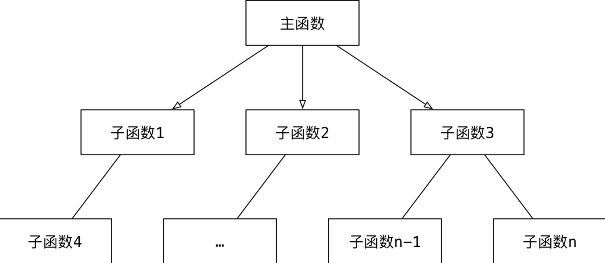

# 1 理论概念

**面向对象编程** —— `Object Oriented Programming` 简写 `OOP`

## 1.1 面向过程

面向过程-怎么做？

过程是早期的一个编程概念，过程类似类似于函数，只能执行，但是没有返回值；函数不仅可以执行，而且还能返回结果！！！

1、把完成某一个需求的`所有步骤` `从头到尾`逐步实现

2、根据开发需求，将某些**功能独立**的代码**封装**成一个又一个**函数**

3、最后完成的代码，就是顺序地调用**不同的函数**



特点：

1、注重 **步骤与过程**，不注重职责分工

2、如果需求复杂，代码会变得很复杂

3、**开发复杂项目，没有固定的套路，开发难度很大！**

## 1.2 面向对象

面向对象-谁来做？

> 相比较函数，**面向对象** 是 **更大** 的 **封装**，根据 **职责** 在 **一个对象中 封装 多个方法**

1、在完成某一个需求前，首先确定 **职责** —— **要做的事情（方法）**

2、根据 **职责** 确定不同的 **对象**，在 **对象** 内部封装不同的 **方法**（多个）

3、最后完成的代码，就是顺序地让 **不同的对象** 调用 **不同的方法**

特点：

1、注重**对象和职责**，不同的对象承担不同的职责

2、更加适合应对复杂的需求变化，**是专门应对复杂项目开发，提供的固定套路**

3、**需要在面向过程基础上，再学习一些面向对象的语法**

# 2 类/对象

类和对象是面向对象编程的两大核心概念！！！

## 2.1 类

类是对一类具有相同特征和行为事物的一个统称，是抽象的，不能直接使用。

特征被称为属性；行为被称为方法。

**类**就相当于制造飞机时的**图纸**，是一个**模板**，是**负责创建对象的**。

类是一个特殊的对象：类属性、类方法。

获取类属性机制，Python属性获取采取向上查找机制。

方式一：类名.属性

方式二：对象.属性，不推荐这样写

如果使用 `对象.类属性 = 值` 赋值语句，只会**给对象添加一个属性**，而不会影响到 **类属性的值**

## 2.2 对象

**对象**是**由类创建出来的一个具体存在**，可以直接使用。

由**哪一个类**创建出来的**对象**，就拥有在**哪一个类**中定义的：属性、方法。

**对象**就相当于用**图纸**制造的飞机，*在程序开发中，应该* **先有类，再有对象**。

创建的对象称为类的实例；创建对象的过程叫实例化；对象的属性叫实例属性；对象调用的方法叫实例方法

## 2.3 关系

**类是模板**，**对象**是根据**类**这个模板创建出来的，应该**先有类，再有对象**。

**类**只有一个，而**对象**可以有很多个。

## 2.4 类的设计

在使用面相对象开发前，应该首先分析需求，确定一下，程序中需要包含哪些类！

在程序开发中，要设计一个类，通常需要满足一下三个要素：

1、**类名**这类事物的名字，**满足大驼峰命名法**

2、**属性**这类事物具有什么样的特征

3、**方法**这类事物具有什么样的行为

**小明**今年**18 岁**，**身高 1.75**，每天早上 **跑** 完步，会去**吃** 东西

**小美**今年**17 岁**，**身高 1.65**，小美不跑步，小美喜欢 **吃** 东西

## 2.5 类定义

```python
class Cat(object):

    @classmethod
    def eat(cls):
        print("喝水")


tom = Cat
tom.eat()
lazy_cat = Cat()
lazy_cat.eat()
print(lazy_cat)
print(tom)
```

## 2.6 self属性

调用当前方法对象的引用，类比Java中的this关键字！！！

## 2.7 初始化方法

初始化方法主要负责：对象分配内存、给对象的属性进行赋值。

初始化方法用______init______定义，是对象的内置方法。

销毁方法______del______。

重新______str______方法，类比Java中的toString()方法。

## 2.7 函数/方法

方法是封装在类中的函数！！！

## 2.8 权限修饰

私有属性、私有方法，通常是在属性、方面名字前面添加**两个下划线**！

伪私有属性、方法

# 3 三大特性

## 3.1 抽象

现实世界的业务对象转换成计算机对象

## 3.2 封装


## 3.3 继承

```python
class Animal:
    def eat(self):
        print("吃")


class Dog(Animal):
    def eat(self):
        print("狗吃")


class Cat(Animal):
    def eat(self):
        print("猫吃")


dog = Cat()
dog.eat()
```

# 4 方法

## 4.1 实例方法


## 4.2 类方法


## 4.3 静态方法

a

# 5 单继承

## 5.1 子调父

方式一：super()

方式二：父类名.方法(self)，不推荐使用，在Python2中会用到

## 5.2 父类私有

私有属性、私有方法

1、外界或子类对象不能在自己的方法内部**直接**访问父类的私有属性或私有方法。

2、外界或子类对象可以通过父类的公有方法**间接**访问私有属性或私有方法。

# 6 多继承

## 6.1 概念

1、子类可以拥有**多个父类**，并且具有所有父类的属性和方法；例如：孩子会继承自己父亲和母亲的特性。

2、语法格式

```python
class 子类名(父类名1,父类名2...):
    pass
```

## 6.2 注意事项

如果**不同的父类**中存在**同名的方法**，**子类对象**在调用方法时，会调用**哪一个父类中**的方法呢？

> 提示：**开发时，应该尽量避免这种容易产生混淆的情况！** —— 如果 **父类之间** 存在 **同名的属性或者方法**，应该 **尽量避免** 使用多继承

MRO是`method resolution order`，主要用于**在多继承时判断方法、属性的调用路径**，在Python中针对类提供了一个内置属性______mro__可以查看方法的搜索类型。

```python
print(类.__mro__)
```

## 6.3 新式/旧式类

object是Python为所有对象提供的基类，提供有一些内置的属性和方法，可以使用**dir函数**查看

新式类：以object为基类的类，推荐使用，Python 3默认就是新式类。

旧式（经典）类：不以object为基类，不推荐使用。

新式类和旧式类在多继承时，会影响方法的搜索顺序。

今后为了保证编写的代码可以在Python 2和Python 3中运行，最好显式的定义当前类的object父类。


# 7 模块

## 7.1 模块概念

模块是Python程序架构的一个核心概念！

每一个扩展名为.py的文件都是一个模块，模块名也是一个标识符，需要安装标识符命名；在模块中定义的**全局变量** 、**函数**、**类**都是提供给外界直接使用的**工具**；模块就好比是**工具包**，要想使用这个工具包中的工具，就需要先 **导入**这个模块。

模块命名应该符合**大驼峰命名**。

## 7.2 模块导入

1、import导入，如果模块的名字太长，可以使用as指定模块的名称，以方便在代码中的使用

```python
import 模块名1, 模块名2 

import 模块名1 as 模块别名
```

2、from...import导入，如果希望导入某个模块的部分工具

```python
# 从 模块 导入 某一个工具
from 模块名1 import 工具名

# 从 模块 导入 所有工具
from 模块名1 import *
```

## 7.3 发布模块

1、创建setup.py

```python
from distutils.core import setup

setup(name="hm_message",  # 包名
      version="1.0",  # 版本
      description="itheima's 发送和接收消息模块",  # 描述信息
      long_description="完整的发送和接收消息模块",  # 完整描述信息
      author="itheima",  # 作者
      author_email="itheima@itheima.com",  # 作者邮箱
      url="www.itheima.com",  # 主页
      py_modules=["hm_message.send_message",
                  "hm_message.receive_message"])
```

2、构建模块

```python
python3 setup.py build
```

3、生成压缩包

```python
python3 setup.py sdist
```

## 7.4 第三方模块


# 8 包

## 8.1 概念

包是一个包含多个模块的特殊目录，目录下面有个特殊文件`__init__.py`

包名的**命名方式**和变量名一致，**小写字母** + `_`

## 8.2 好处

使用import包名可以一次性导入包中所有的模块

# 9 Pygame

## 9.1 安装

pip3 install pygame

python -m pygame.examples.aliens

