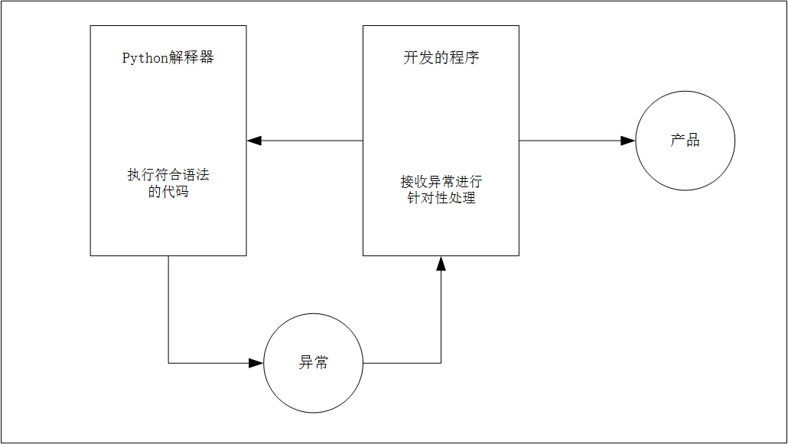

# 1 理论基础

## 1.1 什么是异常

程序在运行时，如果**Python解释器**遇到一个错误，会停止程序的执行，并提示一些错误的信息，这个就是异常！

## 1.2 抛出异常

程序停止执行并提示错误的信息这个动作，我们通常称之为抛出异常！

程序开发时，很难将所有的特殊情况都处理的面面俱到，通过异常捕获可以针对突发事件做集中的处理，从而保证程序的稳定性和健壮性。



# 2 捕获异常

## 2.1 已知异常

```python
try:
    num = int(input("请输入一个整数："))
    print(num)
except ValueError:
    print("未知异常%s" % res)
```

## 2.2 未知异常

```python
try:
    num = int(input("请输入一个整数："))
    print(num)
except Exception as res:
    print("未知异常%s" % res)
```

## 2.3 完整异常

```python
try:
    num = int(input("请输入整数："))
    result = 8 / num
    print(result)
except ValueError:
    print("请输入正确的整数")
except ZeroDivisionError:
    print("除 0 错误")
except Exception as result:
    print("未知错误 %s" % result)
else:
    print("正常执行")
finally:
    print("执行完成，但是不保证正确")
    
```

# 3 异常传递

## 3.1 概念

异常传递是当函数、方法执行出现异常，会将异常传递给函数、方法的调用方，如果传递到主程序，仍然没有异常的处理，程序将会被终止！

## 3.2 好处

在开发中，可以在主函数中增加**异常捕获**。

而在主函数中调用的其他函数，只要出现异常，都会传递到主函数的**异常捕获**中。

这样就不需要在代码中，增加大量的**异常捕获**，能够保证代码的整洁

```python
def demo1():
    return int(input("请输入一个整数："))


def demo2():
    return demo1()

try:
    print(demo2())
except ValueError:
    print("请输入正确的整数")
except Exception as result:
    print("未知错误 %s" % result)
    
```

# 4 主动异常raise

## 4.1 应用场景

在开发中，除了代码执行出错，Python解析器会抛出异常之外，还可以根据应用程序的特有业务需求进行主动的抛出异常！

当前函数只负责提示用户输入密码，如果密码长度不正确，需要其他的函数进行额外处理，因此可以抛出异常，由其他需要处理的函数捕获异常！

## 4.2 抛出异常

Python中提供了一个exception异常类，在开发过程中，如果满足特定业务需求时，希望抛出异常，可以：1、创建一个exception的对象；2、使用raise关键字抛出异常对象。

例子：提示用户输入的密码长度小于8位，抛出异常。

```python
#!/usr/bin/env python
# -*- coding: UTF-8 -*-
""""
@Project ：studypy
@File    ：exceptionUse.py
@Author  ：guod
@IDE     ：PyCharm
"""


def input_password():
    # 1、提示用户输入密码
    pwd = input("请输入密码：")

    # 2、判断密码长度，如果长度 >= 8，返回用户输入的密码
    if len(pwd) >= 8:
        return pwd

    # 3、密码长度不够，需要抛出异常
    # 3.1、创建异常对象 - 使用异常的错误信息字符串作为参数
    ex = Exception("密码长度不够")

    # 3.2、抛出异常对象
    raise ex


try:
    user_pwd = input_password()
    print(user_pwd)
except Exception as result:
    print("发现错误：%s" % result)
else:
    print("else是正常")
finally:
    print("finally是必须会执行")

```


# 5 断言

## 5.1 基本操作

```python
assert isinstance("", int)
```

