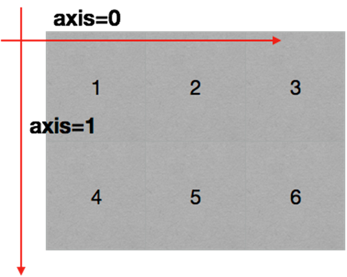
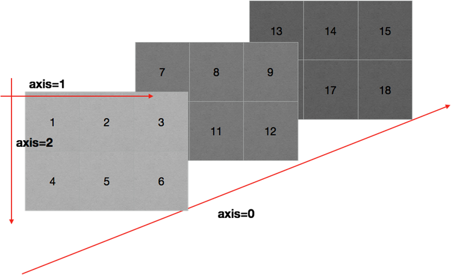
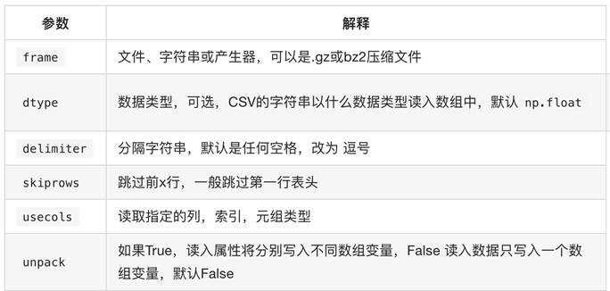
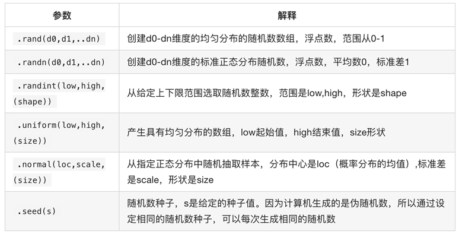

# 1 基本操作

Numpy是Python中科学计算的基础包。主要提供**多维数组对象**，各种派生对象（如掩码数组和矩阵），以及用于数组快速操作的各种API，有包含数学、逻辑、形状、排序、选择、输入输出、离散愽立叶变换、基本线性代数，基本统计运算和随机模拟。

## 1.1 安装

numpy.array(parameter)，接收Python中的列表、元组作为参数。

```python
pip install numpy
conda install numpy
```

## 1.2 导入

```python
import numpy as np
```

## 1.3 入门

```python
#!/usr/bin/env python
# -*- coding: utf-8 -*-
""""
@Project ：studypy
@File    ：np01.py
@Author  ：guodd
@IDE     ：PyCharm
"""
import numpy as np

array = np.array([1, 2, 3])
print(array)
print(type(array))

```

## 1.4 问题

1、什么是numpy

2、numpy基础

3、numpy常用方法

4、numpy统计方法

5、快速；方便；科学计算的基础库

# 2 数组对象

常见的数组基本到三维：页、行、列

## 2.1 N维数组

平时用的最多的是一维数组、二维数组。

## 2.2 创建方式

```python
# arr = np.array(1, 4) 错误写法
# 正确的三种方式
arr1 = np.array([2 3 4 5 6 7 8 9])
arr2 = np.array(range(2, 10))  # 包含2，不包含10
arr3 = np.arange(2, 10)  # 包含2，不包含10
print(arr1)
print(arr1.shape)

# 三维
aa = np.array([
    [[1, 2], [3, 4]],
    [[5, 6], [7, 8]]
])
```

## 2.3 轴

NumPy的主要对象是同构多维数组。它是一个元素表（通常是数字），所有类型都相同，由非负整数元组索引。在NumPy维度中称为轴。

二位数组



三维数组



# 3 本地数据

## 3.1 读取 

CSV逗号分隔的文件

转置，交换轴

```python
np.loadtxt(fname,dtype=np.float,delimiter=None,skiprows=0,usecols=None,unpack=False)
```



## 3.2 切片

```python
import numpy as np

two_arr = np.arange(45).reshape(5, 9)
print(two_arr)
# x轴方向，行数
print(two_arr.shape[0])
# y轴方向，列数
print(two_arr.shape[1])
# 读取一行
print(two_arr[0])
# 读取多行
print(two_arr[:2])
# 读取一列
print(two_arr[:, 1])
# 读取连续多列
print(two_arr[:, : 2])
# 读取不连续多列
print(two_arr[:, [1, 3]])
# 读取不连续多行
print(two_arr[[1, 3], :])
```


## 3.3 索引


## 3.4 方法


## 3.5 赋值


## 3.6 替换


## 3.7 布尔


## 3.8 三位


## 3.9 裁剪


## 3.10 转置


## 3.11 Nan

nan(NAN,Nan):not a number表示不是一个数字

nan和任何值计算都为nan

## 3.12 Inf

inf(-inf,inf):infinity,inf表示正无穷，-inf表示负无穷

## 3.13 函数


## 3.7 拼接

```python
import numpy as np

us = "../cvs/US_video_data_numbers.csv"
gb = "../cvs/GB_video_data_numbers.csv"

# 加载数据
us_data = np.loadtxt(us, delimiter=",", dtype=int)
gb_data = np.loadtxt(gb, delimiter=",", dtype=int)

# 添加国家信息
print(us_data.shape[0])

# 初始化值
us_zeros = np.zeros((us_data.shape[0], 2)).astype(int)
gb_zeros = np.ones((gb_data.shape[0], 2)).astype(int)

# 横向拼接
us_data = np.hstack((us_data, us_zeros))
gb_data = np.hstack((gb_data, gb_zeros))

# 垂直拼接
info = np.vstack((us_data, gb_data))
print(info)

```


