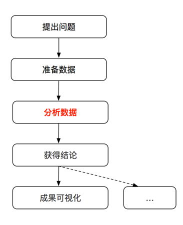

# 1

数据分析是用适当的方法对收集来的大量数据进行分析，帮助人们作出判断，以便采取适当行动。

1、准备数据

对分析数据进行清洗、处理、联合、正态化、重组、切片、切块和转换

2、转换

将**数学**或**统计**操作应用到数据集的分组上以产生新的数据集（例如通过分组参数对一张大表进行聚合）

3、模型计算

将数据接入到统计模型、机器学习算法和其他计算工具上

4、演示

创建动态或静态的图形可视化或文字概述

