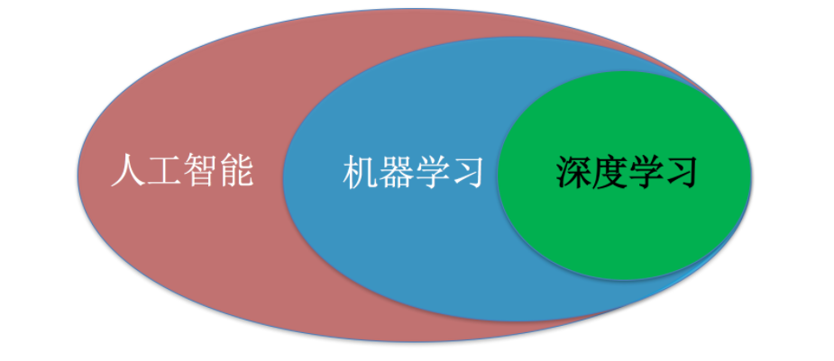
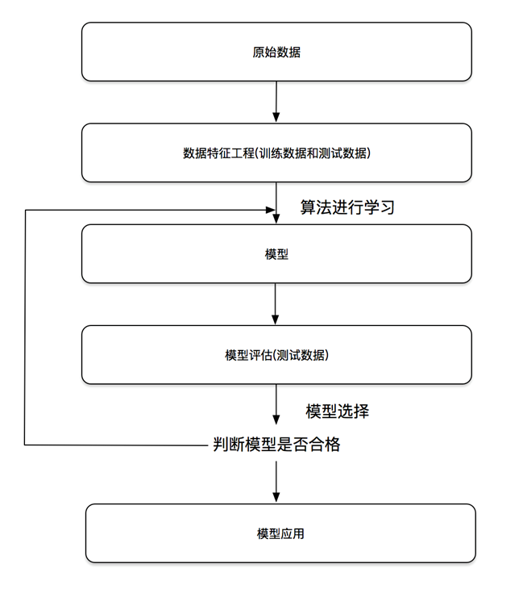

# 1 引言

## 1.1 什么是机器学习

机器学习是人工智能的一个分支。人工智能的研究是从以“推理”为重点到以“知识”为重点，再到以“学习”为重点，一条自然、清晰的脉络。机器学习是实现人工智能的一个途径，即以机器学习为手段解决人工智能中的问题。**机器学习算法是一类从数据中自动分析获得规律（模型），并利用规律对未知数据进行预测的算法**。



## 1.2 为什么需要机器学习

21世纪机器学习又一次被人们关注，而这些关注的背后是因为整个环境的改变，我们的数据量越来越多，硬件越来越强悍。急需要解放人的生产力，自动去寻找数据的规律。解决更多专业领域的问题。机器学习已广泛应用于数据挖掘、计算机视觉、自然语言处理、生物特征识别、搜索引擎、医学诊断、检测信用卡欺诈、证券市场分析、DNA序列测序、语音和手写识别、战略游戏和机器人等领域.

## 1.3 应用程序的步骤

**（1）收集数据**

我们可以使用很多方法收集样本护具，如：制作网络爬虫从网站上抽取数据、从RSS反馈或者API中得到信息、设备发送过来的实测数据。

**（2）准备输入数据**

得到数据之后，还必须确保数据格式符合要求。

**（3）分析输入数据**

这一步的主要作用是确保数据集中没有垃圾数据。如果是使用信任的数据来源，那么可以直接跳过这个步骤

**（4）训练算法**

机器学习算法从这一步才真正开始学习。如果使用无监督学习算法，由于不存在目标变量值，故而也不需要训练算法，所有与算法相关的内容在第（5）步

**（5）测试算法**

这一步将实际使用第（4）步机器学习得到的知识信息。当然在这也需要评估结果的准确率，然后根据需要重新训练你的算法

**（6）使用算法**

转化为应用程序，执行实际任务。以检验上述步骤是否可以在实际环境中正常工作。如果碰到新的数据问题，同样需要重复执行上述的步骤

## 1.4 环境准备

我们本次机器学习的课程使用的python程序库：

```
Numpy、Scikit-learn
```

在ubuntu或者mac操作系统中，在虚拟环境中安装:

```
pip3 install Numpy
pip3 install Scikit-learn
```

Numpy是一个强大的高级数学运算的工具库，还具备非常搞笑的向量和矩阵运算功能。Scikit-learn是一个基于python的机器学习库，封装了大量经典以及最新的机器学习模型。

## 1.5 我们应该怎么做

互联网公司机器学习工作、数据挖掘工程师们工作内容是什么?

- 研究各种算法，设计高大上模型?
- 深度学习的应用，N层神经网络?
- ...

大部分复杂模型的算法精进都是数据科学家在做

大多数程序员

- 跑数据，各种map-reduce，hive SQL，数据仓库搬砖
- 数据清洗，数据清洗，数据清洗
- 分析业务，分析case，找特征
- 常用算法跑模型

## 1.6 我们应该做什么

1、学会**分析**问题

2、掌握算法基本**思想**，学会对问题用相应的算法解决

3、学会利用简便的库或者框架**解决问题**

## 1.7  场景


# 2 数据来源与类型

## 2.1 数据来源


## 2.2 数据类型


## 2.3 结构组成

结构：特征值+目标值

# 3 数据的特征工程

## 3.1 是什么

特征工程是将原始数据转换为更好地代表预测模型的潜在问题的特征的过程，从而提高了对未知数据的模型准确性。

## 3.2 意义


## 3.3 scikit-learn库介绍


## 3.4 特征抽取

1、特征抽取实例演示

2、sklearn特征抽取API

3、字典特征抽取

4、文本特征抽取

## 3.5 特征处理


## 6.6 特征选择


## 6.7 降维


## 6.8 特种API


## 6.9 其他特征选择


# 4 机器学习基础

## 4.1 开发流程

（1）算法是核心，数据和计算是基础

（2）找准定位

大部分复杂模型的算法设计都是**算法工程师**在做，而我们分析很多的数据、分析具体的业务、应用常见的算法、特征工程、调参数、优化。

我们应该怎么做

1、学会分析问题，使用机器学习算法的目的，想要算法完成何种任务

2、掌握算法基本思想，学会对问题用相应的算法解决

3、学会利用库或者框架解决问题



## 4.2 学习模型

定义：通过一种映射关系将输入值到输出值

## 4.3 算法分类

•监督学习

•分类  k-近邻算法、贝叶斯分类、决策树与

随机森林、逻辑回归、神经网络

•回归  线性回归、岭回归

•标注  隐马尔可夫模型   (不做要求)

•无监督学习

•聚类  k-means