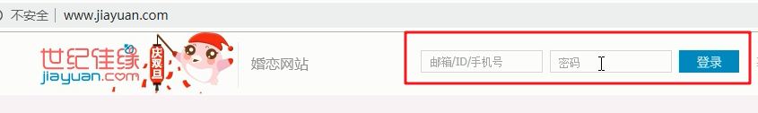
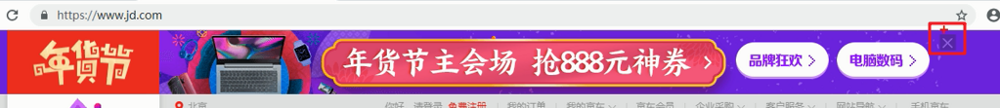
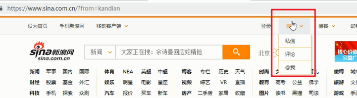
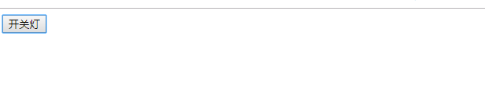

# 每日作业-Web APIs第01天

### 1 - 输入框内容显示和隐藏（加强训练）

- 题目描述

   仿世纪佳缘网，显示和隐藏输入框中的提示内容，具体表现如下图：

   1）输入框获得焦点，提示内容消失，边框变色

   2）输入框失去焦点，如果内容为空，提示内容恢复，边框变色；如果内容不为空，只有边框变色

- 训练目标

  能够操作元素的属性和样式属性

- 训练提示

  1.给文本框注册获得焦点事件，清空value值，改变border的颜色

  2.给文本框注册失去焦点事件

  3.获取并判断文本框的内容

  4.内容为空，恢复提示内容，边框恢复原来的颜色

  5.内容不为空，边框恢复原来的颜色

- 参考方案

  显示隐藏文本框案例

###    2 - 京东关闭广告（直接隐藏即可）（加强训练）

- 题目描述

  仿京东网，单击关闭广告，具体表现如下图：

  

- 训练目标

  能够操作元素的样式属性

- 训练提示

  1.获取要操作的关闭按钮和广告元素

  2.关闭按钮注册单击事件

  3.隐藏广告元素

###    3 - 新浪下拉菜单（加强训练）

- 题目描述

  仿新浪网，鼠标移入显示下拉菜单，鼠标移出隐藏下拉菜单，具体表现如下图：

  

- 训练目标

  能够操作元素的样式属性

- 训练提示

  1.获取要操作的“微博”和下拉菜单元素

  2.给“微博”注册鼠标移入事件，显示下拉菜单

  3.给“微博”注册鼠标移出事件，隐藏下拉菜单

### 4 - 网页开关灯（加强训练）

- 题目描述

  单击按钮，控制网页开关灯，具体表现如下图：

  

- 训练目标

  能够操作元素的样式属性

- 训练提示

  1.获取要操作的按钮和body元素

  2.给按钮注册单击事件

  3.使用全局变量记录灯的状态

  4.根据灯的状态，控制body元素的背景色，实现开关灯效果