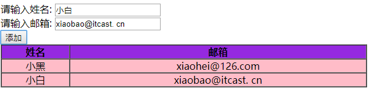

# 每日作业-Web APIs第02天

### 1 - 添加表格内容（加强训练）

- 题目描述

   用户在页面上点击按钮,可以把文本框中的数据在表格的新的一行中显示，具体表现如下图：

   1）如果如果输入框内容有一项为空，弹出对话框‘请将数据填入完全

   2）页面见素材

- 训练目标

  能够创建和添加节点

- 训练提示

  1.按钮注册单击事件

  2.获取并判断文本框的内容

  4.创建行并添加到tbody中

  5.创建列，并设置内容

  6.把列添加到行中

- 参考方案

  简单留言案例
