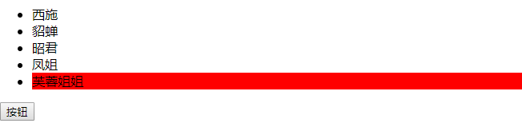
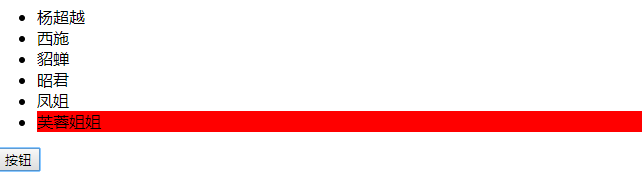

# 每日作业-Web APIs第03天

### 1 - 动态添加列表（加强训练）

- 题目描述

   页面上有一些美女列表，当单击li时背景色变为红色，但点击按钮时会新增1个美女到列表最前面，并且单击新增的美女背景也会变为红色，具体表现如下图：

   1）要求使用到事件委托

- 训练目标

  能够创建、添加节点和使用事件委托。

- 训练提示

  1.按钮注册单击事件

  2.创建li，并添加到ul内的前面

  3.给ul注册单击事件

  4.获取触发事件的目标元素，设置背景色
