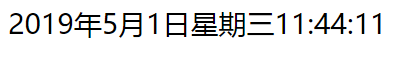
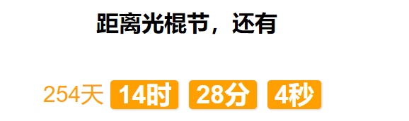

# 每日作业-Web APIs第04天

### 1 - 页面电子时钟（加强训练）

- 题目描述

   页面上有一个电子时钟，显示当前的年月日，时分秒，要求自动变化，具体表现如下图：

   1）要求双位显示，例如：九点九分九秒，显示为09:09:09

   

- 训练目标

  能够使用定时器。

- 训练提示

  1.开启定时器，每隔1秒执行1次回调函数

  2.回调函数中，使用Date对象获取当前时分秒

  3.判断时分秒是否大于10

  4.将时分秒内容拼接成字符串，并设置盒子的内容

### 2 - 双十一倒计时（加强训练）

- 题目描述

  页面上有一个倒计时时钟，显示距离双十一还有多长时间，要求自动变化，具体表现如下图：

  

- 训练目标

  能够使用定时器完成倒计时。

- 训练提示

  1.获取要操作的元素（天时分秒盒子）

  2.获取结束日期的时间戳

  3.开启定时器

  4.获取当前日期的时间戳，并计算两个日期的差

  5.将毫秒的时间差分别计算为天时分秒

  6.设置盒子的内容