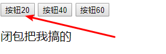
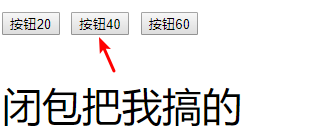

# 每日作业-JavaScript高级第03天

## 1 - 生成多个相同的随机数

- 题目描述

   写一个函数 生成一个随机数，每次调用函数都返回第一次生成的随机数


- 训练目标

  闭包的使用

- 训练提示

    1. 创建一个函数
    2. 函数内部随机生成一个随机数
    3. 使用闭包延长生成的随机数的作用范围


## 2 - 点击按钮改变页面上的文字大小

- 题目描述

  使用闭包实现点击按钮改变页面上的文字大小

  ​

  

  

  

- 训练目标

  能够理解闭包

- 训练提示

  1. 结构中有三个按钮分别绑定点击事件
  2. 点击事件触发一个函数 是修改p标签文本大小的
  3. 使用闭包实现字体大小的设置


## 3 - 点赞案例


- 题目描述

  使用闭包实现点击每个按钮,按钮中的数字都是单独递增的,互不影响

- 训练目标

  能够理解闭包

- 训练提示

  结构中有四个按钮分别绑定点击事件

  点击事件触发一个函数 是修改按钮中文字大数值

  使用闭包实现数字的递增

## 4 - 看如下代码,说出运行结果

```js
console.log('start');
setTimeout(function () {
	console.log('你猜我输出在哪');
}, 0);
console.log('end');
for (var i = 0; i < 10; i++) {
	console.log(i);
}

---------------------------------------------------------------------------
console.log('start');
for (var i = 0; i < 3; i++) {
  (function (index) {
    setTimeout(function () {
      console.log(index);
    }, 0);
  })(i);
}
console.log('end');
```

