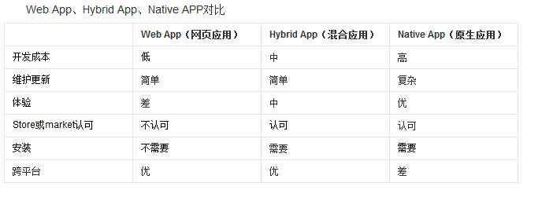

# 移动App第1天

## 什么是移动App开发【重点】
1. 苹果上的软件是如何开发出来的：使用IOS平台的开发工具和开发语言进行设计开发的！苹果上的开发语言：OC、Swift
2. 安卓平台上的软件又是如何开发出来的：使用Java这么语言，结合一些Android控件，就可以开发安卓上的手机软件；
3. 苹果和安卓平台上共有的软件是如何开发出来的：招聘两部分的开发人员，分别是苹果开发人员和安卓开发人员；
4. 现在，我们可以使用混合App开发的方式，来同时进行两个平台上软件的开发；
5. 也就是说，抛开OC、Swift、Java、Android；可以直接使用前端技术（HTML + CSS + JS）来进行移动端App开发；这种开发方式叫做混合App开发！

> 什么是移动App开发：通俗的理解，就是把开发Web网站的技术，通过某种方式，移植到移动App开发上进行使用，这种利用Web开发技术进行移动端开发体验的方式，叫做混合App开发！

### 关于移动App开发，需要知道的几个概念：
+ 原生开发：是使用手机平台官方推荐的开发语言和框架，进行开发的方式，叫做原生开发！
+ 混合开发：抛开官方提供的开发方式，使用前端技术，进行移动APP开发的方式，叫做混合开发！
+ App的分类：App -> Application(应用程序)：什么是应用程序：可以安装的、提供了某些具体功能的软件，叫做应用程序；
  - 按照平台来划分：
     + PC端：LOL、VS Code、网易云音乐、视频软件
     + 移动端：手机QQ、外卖、地图【战略资源】、亡者农药
  - 按照功能来划分：
     + 游戏：亡者农药、英雄联盟
     + 应用：Office办公软件、翻译软件、外卖软件
+ App和Web的区别：
     + APP：App是Application的缩写，含义为：“可安装的应用程序”，特点：需要安装；需要手动去升级；
      - 优点：**性能稳定、体验好**；内容丰富；安全；对网络要求比较低（受网络影响小）；
      - 缺点：需要手动安装；需要手动去升级；**不能跨平台**
     + Web：特指基于浏览器开发的网站（说白了就是运行在浏览器中的网页）
      - 优点：免安装，只要安装了浏览器就能访问Web；不需要用户手动升级（升级过程对用户来说是透明的）；**能够跨平台**；（因为Web天生就是跨平台的）
      - 缺点：严重依赖于网络的情况；**用户体验没有App优秀**；也有平台之间的兼容性！

## 为什么要学混合App开发
### 从程序员的角度分析：
1. 挣钱多【知识多且杂】
2. 对于找工作来说：市场需求量大，好找工作，提高我们的行业竞争力
3. 能接触到前端流行的技术和框架   ES6    React
 + 前端是一个永恒的行业???【前端是基于 浏览器，只是行业要求变高了而已；】
 + 屌丝的崛起之路：`只能做页面` -> `Ajax前后台数据交互` -> `Jquery、Bootstrap` -> `前端的框架兴起` -> `可以做手机混合App/桌面应用` -> `可以做手机原生App` -> `将来或许可以发射火箭发射卫星发射导弹` -> `终极目标：统一全宇宙`
4. 能购置一批牛逼的设备【第一件事：发朋友圈】

### 从企业的角度分析:(选择合适自身的移动App开发方式)【重点】
- 节省开发成本
 + 从工资上
 + 从时间上:使用前端技术开发App的话，速度很快，因为前端技术够简单（HTML+CSS+JS），但是原生的 安卓和 IOS 语言就很难学，其次，一些复杂的概念比较难懂，
1. 市面上常见的App开发方式
 + WebApp：基于浏览器实现的，有特定功能的网站，称作WebApp（本质就是一个网站，只不过功能很复杂，所以把它叫做 Web 类型的 APP）
  	- 例如：百度脑图、https://m.jd.com/、https://m.taobao.com/#index
  	- 优点：跨平台（最大的优点）
  	- 缺点：依赖网络，有白屏效果，相对来说，用户体验差；不能调用硬件底层得设备，比如摄像头；
 + NativeApp：用android和Object-C等原生语言开发的应用
 	- 优点：体验好；用户使用起来很流畅；非常适合做游戏【性能高】；可以直接调用硬件底层的API；
 	- 缺点：不能跨平台
 + HybirdApp：利用前端所学的知识去开发移动端App，兼具2者的优势
 	- 优点：能够跨平台；体验会好一些；能够调用硬件底层API；
 	- 缺点：相对于原生体验稍微弱一丢丢；不适合做游戏；
 	- 混合App适合做应用类型得App，比如外卖，比如非游戏类型得软件；
 	- 混合APP开发的特点：外层用原生的NativeContainer来包裹所有的应用程序代码；同时这个NativeContainer也提供了调用硬件底层API的能力；注意：在NatvieContainer中，运行的不是原生的机器码，而是我们的HTML + CSS + JS搭建的出来的网页；
2. 三种开发方式的原理和对比

3. [谁在使用React Native？？？](https://facebook.github.io/react-native/showcase.html)

## 企业如何选择合适自己的App开发方式
如果企业中之前有用原生开发出来的App，那么需要继续使用原生的方式去维护；
如果企业是做手游的，也只能使用原生，或者，对app性能要求特别高，也要用原生；
一般，如果有了一个好的方案，就需要立即把方案实现为具体的应用；快速的推向市场，占领市场；基于这种需求，混合APP开发方式，更适合；尤其适用于小企业；【裤衩开发】

## 企业中项目开发流程
+ 需求调研：产品定位、受众群体、市场需求、开发价值；【产出物：需求文档】
+ 产品设计：功能模块、流程逻辑；【产出物：设计文档，交互稿】，确定项目的基本功能；
+ 项目开发：项目架构、美工、前端、后台、测试【产品的把控】**要理解前后端分离的概念**
+ 运营维护：上线试运行、调Bug、微调功能模块、产品迭代

> 根据需求搞设计，根据设计做开发

## 企业技术选型 - 几大主流技术之间的关系
1. Angular.js 和 Ionic
 + [Angular1官网](https://angularjs.org/)
 + [Angular2官网](https://angular.io/)
 + [Ionic 中文网](http://www.ionic.wang/)
 + [Ionic 英文官网](http://ionicframework.com/getting-started/)
2. Vue.js 和 Weex
 + [Vue.js官网](https://cn.vuejs.org/)
 + [Weex文档](http://weex.apache.org/cn/references/index.html)
 + [Weex - github地址 - 新](https://github.com/apache/incubator-weex)
 + [Weex - github地址 - 旧](https://github.com/alibaba/weex)
3. React.js 和 React-Native
 + [React.js英文官网](https://facebook.github.io/react/)
 + [ReactNative中文网](http://reactnative.cn/)
 + [ReactNative英文网](http://facebook.github.io/react-native/)

> Angular, Vue, React 这三个都是前端框架，我们在进行混合App开发的时候，只是用到了这三个框架的基础语法而已；
> Ionic， Weex， ReactNatvie 这三个都是打包工具，能够把我们开发出来的应用，最终打包成一个可安装的手机端程序安装包；同时，这三个东西，也提供了好用的一些小组件；

## 前端混合App开发框架
1. Html5+、ReactNative、Weex、Ionic
2. [认识HTML5+](http://www.html5plus.org/#home)
 + h5+是一个产业联盟，它有一些互联网成员，专门在中国推广H5
3. [HBuilder官网](http://www.dcloud.io/)

## 开发框架之间的区别
1. Html5+ 和 Ionic
2. ReactNative 和 Weex

## 使用HBuilder生成安卓应用（在线）
[API地址](http://www.html5plus.org/doc/zh_cn/webview.html)
Hbuilder这个工具，是一个在线打包工具，使用很方便，不需要在本地配置开发环境；直接将做好的网站，通过一些简单的操作，就能在线打包为一个App出来；
+ 在项目上右键 -> 发行 -> 发行为原生安装包

好处：本地不用配置开发环境；操作方便，对于程序员来说不关心打包的过程，打包过程对于我们来说是透明的；
缺点：程序员很少能干预打包的过程；源代码被提交到了云端的服务器，存在项目核心代码被泄露的风险；

## 环境变量的使用
作用：将需要全局使用的工具或者应用程序，配置到Path环境变量中，可以很方便的通过命令行的形式，在任何想要运行这些应用程序的地方，运行它们；

## 移动App开发环境配置【重点】

### 安装最新版本的java jdk
1. 修改环境变量，新增`JAVA_HOME`的系统环境变量，值为`C:\Program Files (x86)\Java\jdk1.8.0_112`，也就是安装JDK的根目录
2. 修改系统环境变量`Path`，在`Path`之后新增`%JAVA_HOME%\bin;%JAVA_HOME%\jre\bin;`
3. 新建**系统环境变量**`CLASSPATH`，值为`.;%JAVA_HOME%\lib\dt.jar;%JAVA_HOME%\lib\tools.jar;`
4. 保存所有的系统环境变量，同时退出系统环境变量配置窗口，然后运行cmd命令行工具，输入`javac`，如果能出现javac的命令选项，就表示配置成功！

### 安装Node.js环境
注意：需要安装最新的长期稳定版本，不要实验版本；安装完毕之后的node.js会自动配置到全局系统环境变量中
安装完毕后，可以输入`node -v`查看node版本号；

### 安装C++环境
大多数情况下操作系统自带C\++环境，不需要手动安装C\++环境；
如果运行报错，则需要手动安装visual studio中的C\++环境；

### 安装Git环境
Git安装完毕后，会自动配置到系统环境变量中；
可以通过运行`git --version`来检查是否正确安装和配置了Git的环境变量；

### 安装Python环境
1. 注意：安装Python时候，只能**安装2.×的版本**，注意勾选安装界面上的`Add Python to path`，这样才能自动将Python安装到系统环境变量中；
2. 安装完毕之后，可以在命令行中运行`python`，检查是否成功安装了python。

### 配置安卓环境
1. 安装`installer_r24.3.4-windows.exe`，最好手动选择安装到C盘下的android目录
2. 打开安装的目录，将`android-25`、`android-23`(react-native必须依赖这个)解压后，放到`platforms`文件夹下
3. 解压并得到`platform-tools`文件夹，放到安装目录的根目录中；
4. 【这一步直接忽略即可！】**tools文件夹不解压覆盖也行；**~~解压`tools`，放到安装根目录中~~
5. 解压`build-tools_r23.0.1-windows.zip(react-native必须依赖这个)`、`build-tools_r23.0.2-windows.zip(weex必须依赖这个)`和`build-tools_r23.0.3-windows.zip`，并将解压出来的文件夹，分别改名为版本号`23.0.1`、`23.0.2`和`23.0.3`；在安装目录中新建文件夹`build-tools`，并将改名为版本号之后的文件夹，放到新创建出来的`build-tools`文件夹下
6. 在安装目录中，新建`extras`文件夹，在`extras`文件夹下新建`android`文件夹；解压`m2responsitory`文件夹和`support`文件夹，放到新建的`extras -> android`文件夹下
7. 配置安装环境变量：在系统环境变量中新建`ANDROID_HOME`，值为android SDK Manager的安装路径`C:\Users\liulongbin\AppData\Local\Android\android-sdk`，紧接着，在Path中新增`;%ANDROID_HOME%\tools;%ANDROID_HOME%\platform-tools;`

## [ReactNative快速打包](http://reactnative.cn/docs/0.42/getting-started.html)
1. 安装完node后建议**设置npm镜像**以加速后面的过程（或使用科学上网工具）。注意：**不要使用cnpm！**cnpm安装的模块路径比较奇怪，packager不能正常识别！
 > npm config set registry https://registry.npm.taobao.org --global 
 > npm config set disturl https://npm.taobao.org/dist --global

2. Yarn、React Native的命令行工具（react-native-cli）
 + Yarn是Facebook提供的替代npm的工具，可以加速node模块的下载。React Native的命令行工具用于执行创建、初始化、更新项目、运行打包服务（packager）等任务。
 	> npm install -g yarn react-native-cli

 + 安装完yarn后同理也要设置镜像源：
     > yarn config set registry https://registry.npm.taobao.org --global 
     > yarn config set disturl https://npm.taobao.org/dist --global

3. 运行`react-native init AwesomeProject`创建React-Native项目
4. 运行`cd AwesomeProject`切换到项目根目录中，运行`adb devices`来确保有设备连接到了电脑上
5. 运行`react-native run-android`打包编译安卓项目，并部署到模拟器或开发机中
6. 运行上一条命令之前，要确保有设备连接到了电脑上，可以运行`adb devices`查看当前接入的设备列表，打包好的文件，放到了`android\app\build\outputs\apk`目录下
7. [入坑指南](http://www.open-open.com/lib/view/open1477469117948.html)
  > **问题1：开启悬浮框权限；** 
  > **问题2：Could not get BatchedBridge, make sure your bundle is packaged correctly** 
  > 解决方案：在终端中，进入到项目的根目录，执行下面这段命令行： 
  > `react-native bundle --platform android --dev false --entry-file index.android.js --bundle-output android/app/src/main/assets/index.android.bundle --assets-dest android/app/src/main/res/` 
  > 运行之前，需要确保`android/app/src/main/`目录下有`assets`文件夹，如果没有，手动创建之~，再运行上面的命令； 
  > **问题3：could not connect to development server** 
  > 解决方案：晃动手机，唤起设置属性窗口，点击“Dev settings”，再点击Debuug server host 出现设置ip地址窗口，填写Ip地址和端口号8081，例如`192.168.1.111:8081`

## [Weex快速打包](http://weex.apache.org/cn/guide/tools/toolkit.html)
1. 安装依赖:Weex 官方提供了 weex-toolkit 的脚手架工具来辅助开发和调试。首先，你需要最新稳定版的 Node.js 和 Weex CLi。
2. 运行`npm install -g weex-toolkit`安装Weex 官方提供的 `weex-toolkit` 脚手架工具到全局环境中
3. 运行`weex create project-name`初始化Weex项目
4. 进入到项目的根目录中，打开cmd窗口，运行`weex platform add android`安装android模板，首次安装模板时，等待时间较长，建议fq安装模板
5. 打开`android studio`中的`安卓模拟器`，或者将`启用USB调试的真机`连接到电脑上，运行`weex run android`，打包部署weex项目
6. 部署完成，查看项目效果

## 总结重点
1. 什么是前端移动App开发
2. 市面上常见的App开发方式及优缺点
3. 使用Hbuilder在线生成安卓应用
4. 学会配置ReactNative开发环境
5. 掌握ReactNative打包流程