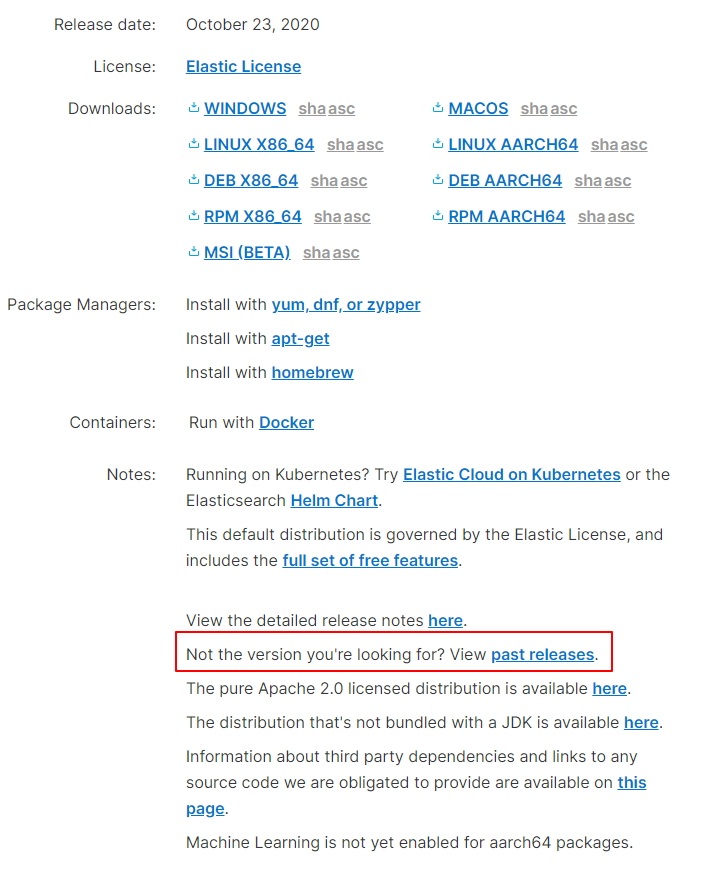

# 1 下载Elastic-Stack

## 1.1 下载
[下载地址](https://www.elastic.co/cn/downloads/past-releases)，下载指定的版本



## 1.2 版本选择

本教程使用的elasticsearch版本：elasticsearch-7.3.0-linux-x86_64.tar.gz

本教程使用的kibana版本：kibana-7.3.0-linux-x86_64.tar.gz

本教程使用的logstash版本：logstash-7.3.0.tar.gz

# 2 安装Elasticsearch

特别注意：elasticsearch不允许root用户启动运行。所以，需要为普通用户赋权限。因此最好统一创建一个/opt/soft/elk的目录分配给普通用户，进行后面所有环境的存放地方。

## 2.1 安装JDK
具体参见以前写的安装JDK文件，ES中启动官方指定使用的是JDK 11，但是也可以通过安装JDK 1.8进行启动，目前暂时没有发下有问题。**ES7之后自带JDK！！！**

## 2.2 建立目录
```properties
mkdir -p /opt/soft/elk/{elasticsearch,kiban,logstash,beats}
```

## 2.3 上传文件
把刚下载的安装包上传至到/opt/soft/elk目录下

## 2.4 解压
```properties
tar -zxvf elasticsearch-7.3.0-linux-x86_64.tar.gz
```

## 2.5 进入目录
```properties
cd /usr/local/soft/es/elasticsearch-7.3.0
```

## 2.6 建立ES用户和用户组

通过指定的用户来进行ELK的服务启动，目前

```properties
groupadd esgroup
useradd esuser -g esgroup -p 123456
```
## 2.7 更改ES文件的所属用户组

更改elasticsearch文件夹及内部文件的所属用户及组
```properties
cd /usr/local/soft/es/
mkdir -p /data/elasticsearch/{data,log}
chown -R esuser:esgroup elasticsearch-7.3.0
```

## 2.8 切换ES用户并运行

```properties
su esuser
./bin/elasticsearch
```

## 2.9 ES后台运行
刚刚启动后，你会发现一按`ctrl + c` 就关闭服务了，这时候需要加参数进行后台启动

```properties
su esuser
./bin/elasticsearch -d
ps -ef | grep elasticsearch
```

## 2.10 ES测试连接
再复制一个ssh端口，之后走`curl 127.0.0.1:9200`

## 2.11 远程连接
这个时候想从浏览器打开，发现打不开，此时要修改配置文件`config/elasticsearch.yml`
```yaml
network.host: 0.0.0.0
http.port: 9200
http.cors.enabled: true
http.cors.allow-origin: "*"
cluster.initial_master_nodes: ["node-1"]
```
## 2.12 修改配置文件后报错处理
再次启动，会有一个error
``` shell
[1]: max file descriptors [4096] for elasticsearch process is too low, increase to at least [65535]
[2]: max number of threads [3797] for user [esuser] is too low, increase to at least [4096]
[3]: max virtual memory areas vm.max_map_count [65530] is too low, increase to at least [262144]
```

修改第一个错误
```properties
vi /etc/security/limits.conf       //文件最后加入
*               soft    nofile          65536
*               hard    nofile          65536
```
处理第二个错误：
```properties
vi /etc/security/limits.conf       //文件最后加入
*               soft    nproc           4096
*               hard    nproc           4096
```
处理第三个错误：

```properties
vi /etc/sysctl.conf
vm.max_map_count=655360 
或
echo "vm.max_map_count=655360" > /etc/sysctl.conf
sysctl -p
```

执行以下命令生效：`sysctl -p`

关闭防火墙：`systemctl stop firewalld.service`


## 2.13 SSH连接JAVA_HOME
`vi ~/.bashrc`在末尾加上`source /etc/profile`

## 2.14 访问测试

**注: 9300 是 Java 客户端的端口。9200 是支持 Restful HTTP 的接口。**

# 3 安装Kibana

## 3.1 Kibana关联ES

1、Kibana是一个针对Elasticsearch的开源分析及可视化平台，使用Kibana可以查询、查看并与存储在ES索引的数据进行交互操作，使用Kibana能执行高级的数据分析，并能以图表、表格和地图的形式查看数据

2、解压缩，并把解压后的目录移动到/usr/local/soft/kibana

3、编辑kibana配置文件

```properties
vim config/kibana.yml

server.host: "192.168.10.20"
server.port: 5601
elasticsearch.hosts: ["http://192.168.10.20:9200"]  // 对应的IP要和ES指定的IP保持一致
i18n.locale: "zh-CN"
```

4、将server.host，elasticsearch.url修改成所在服务器的ip地址

5、开启5601端口

6、开启防火墙:systemctl start firewalld.service

7、开启5601端口:firewall-cmd --permanent --zone=public --add-port=5601/tcp

8、重启防火墙：firewall-cmd –reload

## 3.2 Kibana汉化

### 3.2.1 7之前

### 3.2.2 7之后

```properties
vim /usr/local/soft/kibana/kibana-7.0.0-linux-x86_64/config/kibana.yml
i18n.locale: "zh_CN"
```

## 3.3 Kibana基本命令

1. 启动Kibana，注意在7.3版本中启动也需要使用**新创建的用户**！

```properties
/usr/local/soft/kibana/kibana-7.0.0-linux-x86_64/bin/kibana  // 前台启动
nohup /usr/local/soft/kibana/kibana-7.0.0-linux-x86_64/bin/kibana &  // 后台启动
ps -ef | grep node  // 查看进程
```

2. 浏览器访问：[http://192.168.100.16:5601](http://192.168.100.16:5601/)

# 4 安装Logstash

## 4.1 数据同步


# 5 安装Beats

## 5.1 FileBeat


## 5.2 PackageBeat


# 6 ES安全配置

## 6.1 配置ES

在Elasticsearch7.3，x-pack已经作为默认的插件集成在Elasticsearch里面了，所以无需在`bin/elasticsearch-plugin install x-pack`了，直接在配置文件中启用就可以了。

开启x-pack，参考官方文档，开启x-pack只需要在elasticsearch的配置文件elasticsearch.yml文件中新增如下配置即可：

```json
# 开启x-pack安全验证
xpack.security.enabled: true
xpack.security.audit.enabled: true

xpack.license.self_generated.type: basic
# 如果是basic license的话需要加入下面这一行，不然的话restart elasticsearch之后会报错。
xpack.security.transport.ssl.enabled: true
```

## 6.2 设置密码

```json
[root@elk elasticsearch]# bin/elasticsearch-setup-passwords interactive
Initiating the setup of passwords for reserved users 
elastic,apm_system,kibana,logstash_system,beats_system,remote_monitoring_user.
You will be prompted to enter passwords as the process progresses.
Please confirm that you would like to continue [y/N]y
```

## 6.3 终端使用

密码设置完成后需要在相对应的服务中增加elasticsearch的账号密码，例如kibana、logstash。kibana设置：

```json
elasticsearch.username: "elastic"
elasticsearch.password: "123456"
```
