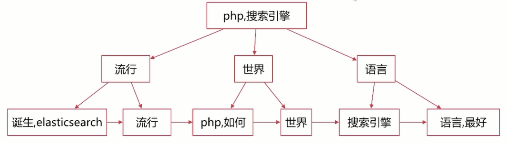
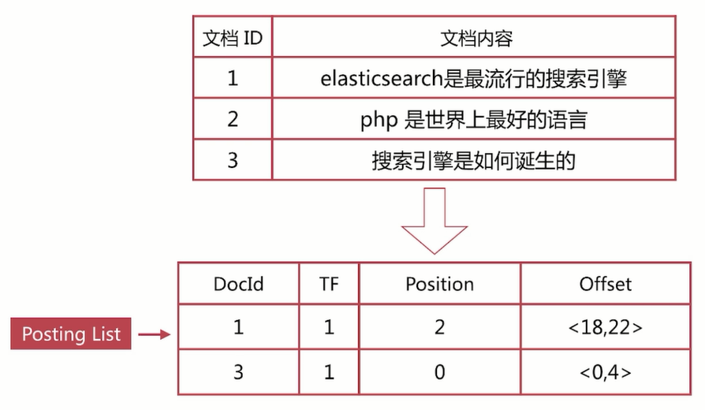
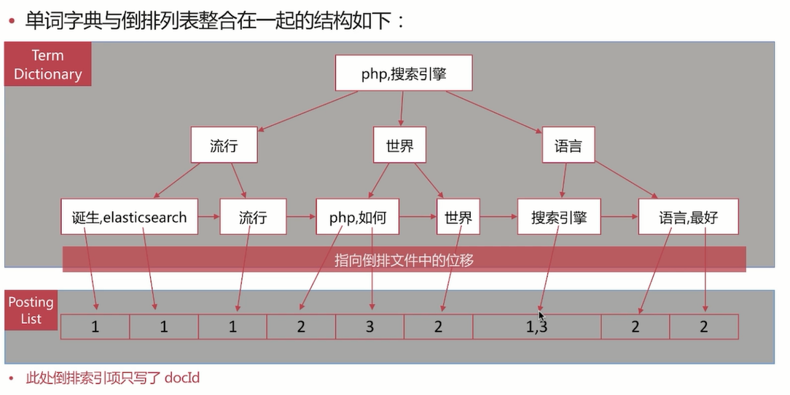

# 1 搜索引擎

## 1.1 正排索引

通过文档**id=>文档内容、单词的关联**关系，一本书的目录对应的就是正排索引。

| 文档ID | 文档内容                        |
| ------ | ------------------------------- |
| 1      | elasticsearch是最流行的搜索引擎 |
| 2      | Java是最好的开发语言            |
| 3      | 最流行的搜索引擎是如何诞生的    |

## 1.2 倒排索引

通过**单词=>文档id**的关联关系，通过正排索引进行分词形成倒排索引，一本书的索引页对应的是倒排索引。

| 单词          | 文档ID |
| ------------- | ------ |
| elasticsearch | 1      |
| 搜索引擎      | 1，3   |
| 最流行        | 1，3   |

倒排索引查询流程，查询包含“搜索引擎”的文档，通过倒排索引获得“搜索引擎”对应的文档ld有1和3；通过正排索引查询1和3的完整内容，返回用户最终结果。

倒排索引组成，倒排索引是搜索引擎的核心，主要包含两部分：单词词典（ Term Dictionary）；倒排列表（ Posting List）。

### 1.2.1 单词词典

单词词典（TD，Term Dictionary）是倒排索引的重要组成，记录所有文档的单词，一般都比较大，记录**单词到倒排列表的关联信息**。

单词字典的实现一般是用B+Tree，示例如下图：下图排序采用拼音实现，构造方法参见如下网址：https://www.cs.usfca.edu/~galles/visualization/BPlusTree.html



### 1.2.2 倒排列表

倒排列表（Posting List）记录了单词对应的文档集合，由**倒排索引项**（Posting）组成，倒排索引项（ Posting）主要包含四部分如下信息：

文档ld，用于获取原始信息。

单词频率（TF，Term Frequency），记录该单词在该文档中的岀现**次数**，用于后续相关性**算分**。

位置（Position），记录单词在文档中的分词**位置**（多个），用于做**词语搜索**Phrase Query。

偏移（Offset），记录单词在文档的**开始和结束位置**，用于做**高亮**显示。

注意：ES存储的是一个Json格式的文档，其中包含多个字段，每个字段会有自己的倒排索引。

通过单词=>文档id的关联关系，通过正排索引进行分词形成倒排索引。





ES存储的是一个**Json格式的文档**，其中包含多个字段，每个字段会有**自己的倒排索引**。

# 2 分词

分词是指将**文本**转换成一系列单词（term or token）的过程，也可以叫做文本分析，在ES里面称为Analysis。

## 2.1 分词器

分词器是ES中专门处理分词的组件，英文为Analyzer，它的组成如下：

Character Filters：针对原始文本进行处理，比如去除html**特殊标记符**。

Tokenizer：将原始文本按照一定规则切分为单词，默认是按照**standard划分**，**只允许有一个的**。

Token Filters：针对tokenizer处理的单词进行再加工，比如**转小写、删除**（stop word中文中的、那）或新增等处理。

注意：是**按照顺序进行分词**的，下面是基本机构形式。

```properties
GET /_analyze
{
  "explain": true, 
  "char_filter": ["html_strip"],
  "tokenizer": "standard",
  "filter": ["lowercase"],
  "text": ["<p>Hello Word"]
}
```

## 2.2 自定义分词

当自带的分词无法满足需求时，可以自定义分词。通过自定义Character Filters、 Tokenizer和Token Filter实现。

### 2.2.1 Character Filters

在Tokenizer之前对原始文本进行处理，比如增加、删除或替换字符等。自带的如下：

HTML Strip去除htm标签和转换htm实体；

Mapping进行字符替换操作；

Pattern Replace进行正则匹配替换；

会影响后续 tokenizer解析的 postion和offet信息。

Character Filters测试时可以采用如下api：

```json
# character filters自定义分词 
POST _analyze
{
    "tokenizer": "keyword",
    "char_filter": [
        "html_strip"
    ],
    "text": "<p>I &apos;elasticsearch is goods</p>"
}
```

### 2.2.2 Tokenizer

将原始文本按照一定规则切分为单词（term or token）自带的如下：

standard按照**单词**进行分割

letter按照**非字符**类进行分割

whitespace按照**空格**进行分割

UAX URL Email按照 standard分割，但不会分割邮箱和url

NGram和 Edge NGram连词分割

path Hierarchy按照文件路径进行切割

```json
# tokenizer自定义分词 
POST _analyze
{
    "tokenizer": "path_hierarchy",
    "text": "/usr/local/redis"
}
```

### 2.2.3 Token Filters

token filters是对于tokenizer输出的单词（term）进行增加、删除、修改等操作，自带的如下：

lowercase将所有term转换为小写

stop删除stop words（的、这、那）

NGram和Edge NGram连词分割

Synonym添加近义词的term

注意：自定义分词的API，自定义分词需要在**索引的配置中设定**。

```json
# token filters自定义分词 
POST _analyze
{
  "tokenizer": "standard",
  "text": "a Hello,world!",
  "filter": [
    "stop",
    "lowercase",
    {
      "type": "ngram",
      "min_gram": 4,
      "max_gram": 4
    }
  ]
}
```

### 2.2.4 自定义analysis

自定义分词的API，自定义分词需要在**索引的配置**中设定。

```json
# 基础格式
PUT test_index
{
    "settings":{
        "analysis":{
            "char_filter":{},
            "tokenizer":{},
            "filter":{},
            # 引用前面的
            "analyzer":{
                "name":{}
            }
        }
    }
}

# 自定义分词01
PUT prod_analysis
{
    "settings": {
        "analysis": {
            "analyzer": {
                "my_analyzer": {
                    "type": "custom",
                    "tokenizer": "standard",
                    "char_filter": [
                        "html_strip"
                    ],
                    "filter": [
                        "lowercase",
                        "asciifolding"
                    ]
                }
            }
        }
    }
}

# 测试自定义分词01
POST prod_analysis/_analyze
{
  "analyzer": "my_analyzer",
  "text": ["Is this <b> a box </b>"]
}

# 自定义分词02
PUT test_index2
{
    "settings": {
        "analysis": {
            "analyzer": {
                "my_analyzer": {
                    "type": "custom",
                    "tokenizer": "punctuation",
                    "char_filter": [
                        "emoticons"
                    ],
                    "filter": [
                        "lowercase",
                        "english_stop"
                    ]
                }
            },
            "char_filter": {
                "emoticons": {
                    "type": "mapping",
                    "mappings": [
                        ":)=>_happy_",
                        ":(=>_sad_"
                    ]
                }
            },
            "tokenizer": {
                "punctuation": {
                    "type": "pattern",
                    "pattern": "[.,!?]"
                }
            },
            "filter": {
                "english_stop": {
                    "type": "stop",
                    "stopwords": "_english_"
                }
            }
        }
    }
}
```

## 2.3 Analyze APl

ES提供了一个测试分词的API接口，方便验证分词效果，endpoint是_analyze，可以直接指定analyzer进行测试
可以直接指定索引中的字段进行测试，可以自定义分词器进行测试。

```properties
GET _analyze
{
  "text": [
    "hello word"
  ],
  "analyzer": "standard"
}

# 响应结构
{
  "tokens" : [
    {
      // 分词结果
      "token" : "hello",
      // 起始偏移
      "start_offset" : 0,
      // 结束偏移
      "end_offset" : 5,
      "type" : "<ALPHANUM>",
      // 分词位置
      "position" : 0
    },
    {
      "token" : "word",
      "start_offset" : 6,
      "end_offset" : 10,
      "type" : "<ALPHANUM>",
      "position" : 1
    }
  ]
}

```

### 2.3.1 指定analyzer

进行测试，接口如下：

```json
POST _analyze
{
  // 指定分词器
  "analyzer": "standard",
  // 指定分词文本
  "text": "hello world"
}

{
  "tokens" : [
    {
      // 分词结果
      "token" : "hello",
      // 起始偏移
      "start_offset" : 0,
      // 结束偏移
      "end_offset" : 5,
      "type" : "<ALPHANUM>",
      // 分词位置
      "position" : 0
    },
    {
      "token" : "world",
      "start_offset" : 6,
      "end_offset" : 11,
      "type" : "<ALPHANUM>",
      "position" : 1
    }
  ]
}
```

### 2.3.2 指定索引

字段进行测试，接口如下：

```json
POST test_ik/_analyze
{
  // 指定测试字段
  "field": "message",
  "text": "中华人民共和国"
}
```

### 2.3.3 自定义分词器

进行测试，接口如下：

```json
# 语法
POST _analyze
{
  "tokenizer": "standard",
  "text": "HELLO WORD!",
  "filter": [
    "lowercase"
  ]
}
```

## 2.4 预定义分词器

### 2.4.1 ES自带分词器

Standard：**默认分词器**，特性为按词切分，支持多语言，小写处理。

Simple：特性为是按照非字母切分，小写处理。

Whitespace：特性为按照空格就行切分，不做小写处理。

Stop：特性为语气助词等修饰性的词语，比如the、an、的、这等等。

Keyword：特性为不分词，直接将输入作为一个单词输出。

pattern：特性为通过正则表达式自定义分割符，默认是\W+，即非字词的符号作为分隔符。

Language：提供了30+常见语言的分词器。

### 2.4.2 其它分词

IK中文分词器，后面章节会具体介绍。

## 2.5 分词使用时机

创建或更新文档时（Index time），会对相应的文档进行分词处理。

查询时（Search Time），会对查询语句进行分词。

### 2.5.1 索引时分词

索引时分词是通过配置Index Mapping中每个字段的analyzer属性实现的，如下不指定分词时，使用默认 standard。

```json
PUT prod_index
{
  "mappings": {
    "properties": {
      "title": {
        "type": "text",
        "analyzer": "standard",
        "search_analyzer": "standard"
      }
    }
  }
}
```

### 2.5.2 查询时分词

查询时分词的指定方式有如下几种：查询的时候通过analyzer指定分词器；通过index mapping设置search_analyzer实现；

一般不需要特别指定査询时分词器，直接使用索引时分词器即可，否则会出现无法匹配的情况。

```json
POST /prod_clinic_info/_search
{
  "query": {
    "match": {
      "messageDeptName": {
        "query": "急诊",
        "analyzer": "ik_max_word"
      }
    }
  }
}


PUT prod_index
{
  "mappings": {
    "properties": {
      "title": {
        "type": "text",
        "analyzer": "standard",
        "search_analyzer": "standard"
      }
    }
  }
}
```

### 2.5.3 分词使用建议

明确字段是否需要分词，不需要分词的字段就将type设置为 keyword，可以**节省空间**和**提高写性能**。

善用_analyze API，查看文档的具体分词结果，动手测试。

# 3 相关性算分

相关性算分是指文档与査询语句间的相关度，英文为relevance。

通过倒排索引可以获取与査询语句相匹配的文档列表，那么如何将最符合用户查询，需求的文档放到前列呢？

本质是一个排序问题，排序的依据是相关性算分。

| 单词   | 文档ID列表 |
| ------ | ---------- |
| alfred | 1,2        |
| way    | 1          |

相关性算分的几个重要概念如下：

Term Frequency（TF）词频，即单词在该文档中出现的次数。词频越高，相关度越高。

Document Frequency（DF）文档频率，即单词出现的文档数。

Inverse Document Frequency（IDF）逆向文档频率，与文栏频率相反，简单理解为1/DF，即单词出现的文档数越少，相关度越高。

Field-length Norm文档越短，相关性越高。

ES目前主要有两个相关性算分模型，如：TF/IDF模型；BM25模型5.X之后的默认模型。

## 3.1 TF/IDF模型

可以通过**explain参数**来查看具体的计算方法。但要注意ES的算分是按照shard进行的，即shard的分数计算是相互独立的，所以在使用explain的时候注意分片数，可以通过设置索引的分片数为1来避免这个问题。TF/DF模型是Lucene的经典模型。

## 3.2 BM25模型

BM25模型中BM指Best match，25指迭代了25次才计算方法，是针对TF/DF的一个优化。

## 3.3 原理查看

```json
GET test_search_index/_search
{
  "explain": true,
  "query": {
    "match": {
      "username": "alfred"
    }
  }
}
```
