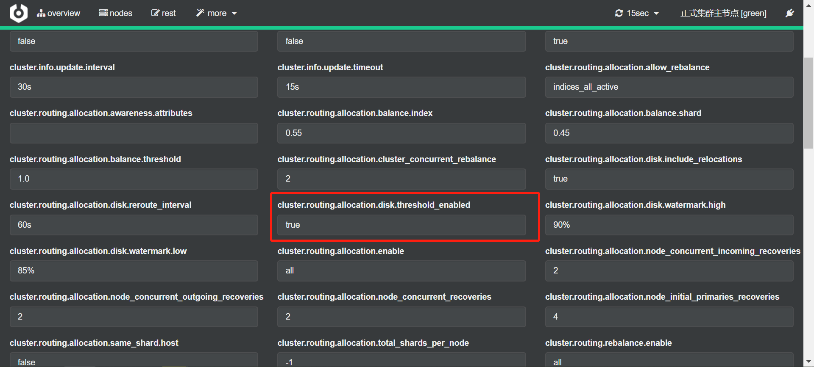

# 1 分布式介绍

```json
# cluster
GET _cluster/health

PUT test_index
{
  "settings": {
    "number_of_shards": 3,
    "number_of_replicas": 1
  }
}
```

## 1.1 好处

ES支持集群模式，是一个分布式系统，其好处主要有两个：增大系统容量，如內存、磁盘，使得ES集群可以支持PB级的数据；提高系统可用性，即使部分节点停止服务，整个集群依然可以正常服务。

## 1.2 组成

ES集群由多个ES实例组成：不同集群通过集群名字来区分，可通过cluster.name进行修改，默认为lasticsearch；每个ES实例本质上是一个JVM进程，且有自己的名字，通过 node.name进行修改。

## 1.3 Cerebro插件

### 1.3.1 安装配置

用于监控集群的节点分布情况：https://github.com/lmenezes/cerebro


### 1.3.2 其它配置



### 1.3.3 基础命令

```
bin/cerebro -Dhttp.port=1234 -Dhttp.address=127.0.0.1
docker run -p 9000:9000 --env-file env-ldap  lmenezes/cerebro
```

# 2 集群构建理论

## 2.1 Cluster state

ES集群相关的数据称为cluster state集群状态，主要记录如下信息：节点信息，比如节点名称、连接地址等；索引信息，比如索引名称、配置等。

## 2.2 Master Node

可以修改cluster state的节点称为master节点，一个集群**只能有一个**。cluster state存储在每个节点上，**master维护最新版本并同步给其他节点**。master节点是通过集群中所有节点**选举产生**的，可以被选举的节点称为master-eligible节点，相关配置如下：node.master:true。

## 2.3 Coordinating Node


在下面的例子中，将所有的请求发送到 `Node 1` ，我们将其称为协调节点(coordinating node) 。处理请求的节点即为coordinating节点，该节点为所有节点的默认角色，不能取消。路由请求到正确的节点处理，比如创建索引的请求到master节点。

## 2.4 Data node

存储数据的节点即为data节点，默认节点都是data类型，相关配置如下：node.data:true。

## 2.5 新增一个节点

运行如下命令可以启动一个es节点实例

```json
bin/elasticsearch -E node.name=node01 -E cluster.name=bysocket_es_cluster -E path.data=node01_data -E http.port=5200 -d

bin/elasticsearch -E node.name=node02 -E cluster.name=bysocket_es_cluster -E path.data=node02_data -d

bin/elasticsearch -E node.name=node03 -E cluster.name=bysocket_es_cluster -E path.data=node03_data -d

bin/elasticsearch -E node.name=node04 -E cluster.name=bysocket_es_cluster -E path.data=node04_data -d

bin/elasticsearch -Ecluster.name=my_cluster -Epath.data=my_cluster_node1 -Enode.name =node1 -Ehttp.port=5200 -d
```

- node.name ： ES 节点名称，即实例名

- cluster.name ： ES 集群名称
- path.data ： 指定了存储文档数据目录

## 2.6 提高系统可用性

如何提高系统 的高可用？引入副本（ Replication）解决问题。

**服务可用性**：2个节点的情况下，允许其中1个节点停止服务。

**数据可用性**：引入副本（ Replication）解决；每个节点上都有完备的数据；自己备份自己的副本状态时yellow。

## 2.7 增大系统容量

**如何将数据分布于所有节点上**？引入分片（ Shard）解决问题。分片是ES支持PB级数据的基石：分片存储了部分数据，可以分布于任意节点上；分片数在索引创建时指定且后续不允许再更改，默认为1个（7.x之前是5个）；

分片有主分片和副本分片之分，以实现数据的**高可用**；

副本分片的数据由主分片同步，可以有多个，从而提高读取的**吞吐量**，可以动态指定副本分片数。

## 2.8 Cluster Health

通过如下API可以查看集群健康状况，包括以下三种：

green健康状态，指所有**主副分片**都正常分配；

yellow指所有**主分片都正常分配**，但是有**副本分片未正常分配**；

red有主分片**未分配**。

## 2.9 分片

每个索引都有多个分片，每个分片都是`Lucene`索引。

下图演示的是3个节点的集群中user-info的分片分布情况，创建时我们指定了3个分片和1个副本。


**增加节点是否能提高user-info的数据容量？**不能。因为只有3个分片，已经分布在3台节点上，新增的节点无法利用。

**增加副本数是否能提高user-info的读取吞吐量？**不能。因为新增的副本也是分布在这3个节点上，还是利用了同样的资源。

如果要增加吞吐量，还需要新增节点。**分片数的设定很重要，需要提前规划好！！！**过小会导致后续无法通过增加节点实现水平扩容；过大会导致一个节点上分布过多分片，造成资源浪费，同时会影响查询性能。

## 2.10 故障转移

集群由3个节点组成，如下所示，此时集群状态是 green

步骤一：node1所在机器宕机导致服务终止，此时集群会如何处理？node2和node3发现node1无法响应一段时间后会发起master选举，比如这里选择node2为master节点，此时由于主分片P0下线，集群状态处于Red。

步骤二：node2发现主分片P0未分配，将R0提升为主分片。此时由于所有主分片都正常分配，集群状态变为 Yellow。

步骤三：node2为P0和P1生成新的副本，集群状态变成Green。

# 3 文档分布式存储

文栏最终会存储在分片上，如下图所示：Document1最终存储在分片P1上。

Document1是如何存储到分片P1的？选择P1的依据是什么？需要文档到分片的映射算法。

目的：使得文档均匀分布在所有分片上，以充分利用资源。

## 3.1 文档分布算法

随机选择或者round-robin(轮询)算法？不可取，因为需要维护文档到分片的映射关系，成本巨大。

根据文档值**实时计算**对应的分片，ES通过如下的公式计算文档对应的分片：shard = hash（routing）% number_of_primary_shards。

hash算法保证可以将数据均匀地分散在分片中。

routing是个关键参数，**默认是文档id**，也可以**自行指定**；将document路由到shard上面。

number_of_primary_shards是**主分片数**。

**该算法与主分片数相关，这也是分片数一旦确定后便不能更改的原因。**

## 3.2 文档创建流程

步骤一：Client向node3发起创建文档的请求。

步骤二：node3通过routing计算该文档应该存储在Shard1上，查询cluster state后确认主分片P1在node2上，然后转发创建文档的请求到node2上。

步骤三：node2的P1接收到请求后执行创建文档请求，将同样的请求发送到副本分片R1上。

步骤四：R1接收到请求后执行创建文档，通知P1成功的结果。

步骤五：P1接收到副本创建成功的结果后，通知node3创建成功。

步骤六：node3返回结果到client。

## 3.3 文档读取流程

步骤一：Client向node3发起获取文档id是1的请求。

步骤二：node3通过routing计算该文栏在Shard1上，查询cluster state后获取 Shard1的**主副分片**列表，然后以轮询的机制获取—个shard，比如这里是R1，然后转发读取文档的请求到node1。

步骤三：R1接收并执行读取文档请求后，将结果返回node3。

步骤四：node3返回结果到client。

## 3.4 文档批量创建流程

步骤一：Client向node3发起批量创建文档的请求（bulk）。

步骤二：node3通过routing计算**所有文档对应的shard**，然后按照**主shard分配(分组)**对应执行的操作，同时发送请求到涉及的主shard，比如这里3个主 shard都需要参与。

步骤三：主 shard接收并执行请求后，将同样的请求同步到对应的副本shard。

步骤四：副本 shard执行结果后返回结果到主 shard，主 shard再返回nde3。

步骤五：node3返回结果到client。

## 3.4 文档批量读取流程

步骤一：Client向node3发起批量获取文档的请求（mget）。

步骤二：node3通过 routing计算所有文栏对应的 shard，然后以轮询的机制获取要参与 shard，按照 shard构建mget请求，同时发送请求到涉及的 shard，比如这里有2个 shard需要参与。

步骤三：R1、R2返回文档结果。

步骤四：node3返回结果到client。

# 4 脑裂问题

## 4.1 产生原因

脑裂问题，英文为 split-brain，是分布式系统中的**经典网络问题（网络隔离造成的）**。

3个节点组成的集群，突然node1的网络和其他两个节点中断。

node2与node3会重新选举 master，比如node2成为了新 master，此时会更新cluster state；

node1自己组成集群后，也会更新 cluster state

同—个集群有两个 master，而且维护不同的 cluster state，网络恢复后无法选择正确的master

## 4.2 解决方案

为仅在可选举 master-eligible节点数大于等于quorun时才可以进行master选举。

quorum = master-eligible节点数 / 2+1，例如3个master-eligible节点时，quorum为2。

设定discovery.zen.minimum_master_nodes为quorum即可避免脑裂。

```yaml
discovery.zen.minimum_master_nodes: 2         # 为了避免脑裂，集群节点数最少为 半数+1
```

# 5 Shard详解

## 5.1 倒排索引

倒排索引一旦生成，不能更改。

### 5.1.1 好处

不用考虑并发写文件的问题，杜绝了锁机制带来的性能问题。

由于文件不再更改，可以充分利用文件系统缓存，只需载入一次，只要內存足够，对该文件的读取都会从内存读取，性能高。

利于生成缓存数据，利于对文件进行压缩存储，节省磁盘和内存存储空间。

### 5.1.2 坏处

需要写入新文档时，**必须重新构建倒排索引文件**，然后**替换老文件**后，新文档才能被检索，导致文栏实时性差。

## 5.2 文档搜索实时性

**解决方案**是新文档**直接生成新的倒排索引文件**，查询的时候**冋时査询所有的倒排文件**，然后做结果的汇总计算。开销小，提高了文档的实时性。

Lucene便是采用了这种方案，它构建的单个**倒排索引称为segment**，合在一起称为Index，是segment的集合。

ES中的Index概念不同，ES中是指document的一个集合。

ES中的一个Shard对应一个Lucene Index。

Lucene会有一个专门的文件来记录所有的segment信息，称为commit point。

### 5.2.1 Refresh

segment写入磁盘的过程依然很耗时，可以借助文件系统缓存的特性，先将segment在缓存(**内存**)中创建并开放査询来进步提升实时性，该过程在ES中被称为refresh。

在refresh之前文档会先存储在一个buffer（缓冲队列）中，refresh时将buffer中的所有文档淸空并生成segment。

ES默认每1秒执行次refresh，因此文档的实时性被提高到1秒，这也是ES被称为近实时（Near Real time）的原因。

refresh发生的时机主要有如下几种情况：

1. 间隔时间达到时；通过indexsettings.refresh_interval来设定，默认是1秒；

2. index. buffer占满时，其大小通过 indices.memory.index_buffer_size设置，默认为 jvm heap的10%，所有 shard共享；

3. fush发生时也会发生 refresh。

### 5.2.2 Translog

如果在内存中的segment还没有写入磁盘前发生了宕机，那么其中的文档就无法恢复了，如何解决这个问题？

ES引入translog机制。写入文栏到index buffer时，同时将该操作写入translog。translog文件会即时写入磁盘（fsync），6.×默认每个请求都会落盘，可以修改为每5秒写一次，这样风险便是丢失5秒内的数据，相关配置为 index.translog.*。

ES启动时会检查 translog文件，并从中恢复数据。


### 5.2.3 Flush

flush负责将内存中的segment写入磁盘。主要做如下的工作：将translog写入磁盘；将index buffer清空，其中的文档生成-个新的segment，相当于个refresh操作；更新 commit point并写入磁盘；执行fync操作，将内存中的 segment写入磁盘；删除旧的translog文件。

flush发生的时机主要有如下几种情况：

1. 间隔时间达到时，默认是30分钟，5X之前可以通过index.translog.flush_threshold_period修改，之后**无法修改**；
2. translog占满时，其大小可以通过index.translog.flush_threshold_size控制，默认是512mb，每个 index有自己的 translog。


### 5.2.4 删除与更新文档

segment一旦生成就不能更改，那么如果你要删除文档该如何操作？Lucene专门维护一个.del的文件，记录所有已经删除的文档，注意.del上记录的是文栏在 Lucene内部的id，在查询结果返回前会过滤掉.del中的所有文档。

更新文档如何进行呢？首先删除文档，然后再创建新文档。

## 5.3 整体视角


## 5.4 Segment Merging

随着segment的增多，由于一次査询的segment数增多，查询速度会变慢；

ES会定时在后台进行segment merge的操作，减少segment的数量；

通过force_merge API可以手动强制做segment merge的操作。

# 6 Master选举

（1）只有候选主节点（master：true）的节点才能成为主节点。

（2）最小主节点数（min_master_nodes）的目的是防止脑裂。

核对了一下代码，核心入口为 findMaster，选择主节点成功返回对应 Master，否则返回 null。选举流程大致描述如下：

第一步：确认候选主节点数达标，elasticsearch.yml 设置的值

discovery.zen.minimum_master_nodes；

第二步：比较：先判定是否具备 master 资格，具备候选主节点资格的优先返回；

若两节点都为候选主节点，则 id 小的值会主节点。注意这里的 id 为 string 类型。

题外话：获取节点 id 的方法。

GET /_cat/nodes?v&h=ip,port,heapPercent,heapMax,id,name

2ip port heapPercent heapMax id name


（1）Elasticsearch 的选主是 ZenDiscovery 模块负责的，主要包含 Ping（节点之间通过这个 RPC 来发现彼此）和 Unicast（单播模块包含一个主机列表以控制哪些节点需要 ping 通）这两部分；

（2）对所有可以成为 master 的节点（node.master: true）根据 nodeId 字典排序，每次选举每个节点都把自己所知道节点排一次序，然后选出第一个（第 0 位）节点，暂且认为它是 master 节点。

（3）如果对某个节点的投票数达到一定的值（可以成为 master 节点数 n/2+1）并且该节点自己也选举自己，那这个节点就是 master。否则重新选举一直到满足上述条件。

（4）补充：master 节点的职责主要包括集群、节点和索引的管理，不负责文档级别的管理；data 节点可以关闭 http 功能

# 6 集群构建规划

ES 集群架构 13 个节点，索引根据通道不同共 20+索引，根据日期，每日递增 20+，索引：10 分片，每日递增 1 亿+数据，每个通道每天索引大小控制：150GB 之内。

## 3.1 机器配置

假设每天抓取50万条数据 每条数据8K 抓取的数据同步到ES中进行检索统计 数据保存三年

一月 119G、一年 1.4T、二年 2.8T、三年 4.3T

机器规格：8C 32G 2TSSD云盘，集群配置：1个副本，
最小磁盘总大小 = 源数据 * 3.4；node数 = 最小磁盘总大小 / 2T
每个shard 50G 每个node支持 1.4/0.05 = 28个shard (每个node的disk控制在70%以下～2TB可以用1.4TB的样子)

一年的集群配置：3个node 3 * 28/2 = 42shard

二年的集群配置：5个node 5 * 28/2 = 70shard

三年的集群配置：7个node 7 * 28/2 = 98shard

出于经济成本的考虑 先购买3个node 但分片数=98 这样的话 当后面增加节点的时候 不用reshard了 这样可行吗？

系统：Centos 7.4 x64，**关闭防火墙**，并且创建用户组和用户。

软件包：elasticsearch-7.3.0-linux-x86_64.tar.gz

| 机器          | 开放端口         | 安装应用 |
| ------------- | ---------------- | -------- |
| 192.168.7.217 | 5601；9000；9200 | JDK 1.8  |
| 192.168.7.218 | 9200             | JDK 1.8  |
| 192.168.7.219 | 9200             | JDK 1.8  |

打算使用ES对抓取下来的文章进行检索, 文章数据量预计是3T左右， 假设机器规格是 `8C 32G` 每个shard**两个**副本 那么这么一个集群需要多少台机器呢？

根据[阿里云](https://help.aliyun.com/document_detail/72660.html?spm=a2c4g.11186623.6.549.45914de0AD4KoZ)给的公式：最小磁盘总大小 = 源数据 * (1 + 副本数量) * 1.7 = 3 * 3 * 1.7 = 15.3

SSD 云盘最大存储空间支持2T那么=> 需要 15.3 / 2 ~= 8 个node

建议单节点上同一索引的shard个数不要超5个。每个node的disk控制在70%以下～2TB可以用1.4TB的样子

## 3.2 存储空间规划

| 节点类型   | CPU  | 内存 | 硬盘      | JVM内存 |
| ---------- | ---- | ---- | --------- | ------- |
| 热数据节点 | 16核 | 64G  | 2TB SSD   | 31G     |
| 冷数据节点 | 56核 | 128G | 20TB SATA | 64G     |

打算使用ES对抓取下来的文章进行检索, 文章数据量预计是3T左右， 假设机器规格是 `8C 32G` 每个shard**两个**副本 那么这么一个集群需要多少台机器呢？

## 3.3 冷热分离

类似关系型数据库中的读写分离！！！

- Hot Phase
  - Rollover 滚动索引操作，可用在索引大小或者文档数达到某设定值时，创建新的索引用于数据读写，从而控制单个索引的大小。这里要注意的一点是，如果启用了 Rollover，那么所有阶段的时间不再以索引创建时间为准，而是以该索引 Rollover 的时间为准。
- Warm Phase
  - Allocate 设定副本数、修改分片分配规则 (如将分片迁移到中等配置的节点上) 等
  - Read-Onlly 设定当前索引为只读状态
  - Force Merge 合并 segment 操作
  - Shrink 缩小 shard 分片数
- Cold Phase
  - Allocate 同上
- Delete Phase
  - Delete 删除

```properties
node.attr.box_type: hot（warm、cold、delete）
```

## 3.4 滚动索引

类似关系型数据库中的分库分表操作！！！

## 3.5 节点配置

```properties
vim /etc/security/limits.conf
* soft nofile 65537
* hard nofile 65537
* soft nproc 65537
* hard nproc 65537
```


```properties
vim /etc/sysctl.conf
vm.max_map_count = 262144
net.core.somaxconn = 65535
net.ipv4.ip_forward = 1
```

```properties
cd /usr/local/src
tar -zxv -f elasticsearch-7.3.0-linux-x86_64.tar.gz -C /usr/local/
cd /usr/local/
cp elasticsearch-7.3.0 elasticsearch-7.3.0_node1
cp elasticsearch-7.3.0 elasticsearch-7.3.0_node2
cp elasticsearch-7.3.0 elasticsearch-7.3.0_node3
useradd elastic
chown -R elastic:elastic elasticsearch-7.3.0_node1
chown -R elastic:elastic elasticsearch-7.3.0_node2
chown -R elastic:elastic elasticsearch-7.3.0_node3
```


```properties
# 节点1
## 集群名称
cluster.name: es-prod-tj
## 节点的名字，一般为Master或者Slave
node.name: node-master
## 节点是否为Master，设置为true的话，说明此节点为Master节点
node.master: true
## 是数据节点
node.data: true
## 设置网络，如果是本机的话就是127.0.0.1，其他服务器配置对应的IP地址即可(0.0.0.0支持外网访问)
network.host: 0.0.0.0
## 设置对外服务的Http端口，默认为 9200，可以修改默认设置
http.port: 9200
## 设置节点间交互的TCP端口，默认是9300
transport.port: 9300
## 集群发现
discovery.seed_hosts: ["192.168.7.217:9300","192.168.7.218:9300","192.168.7.219:9300"]
## 手动指定可以成为Master的所有节点的Name或者IP，这些配置将会在第一次选举中进行计算
cluster.initial_master_nodes: ["node-master"]
## 设置支持Elasticsearch-Head
http.cors.enabled: true
http.cors.allow-origin: "*"
## 为了避免脑裂，集群节点数最少为 半数+1
discovery.zen.minimum_master_nodes: 2

# 节点2
cluster.name: es-prod-tj
node.name: node-slave01
node.master: false
node.data: true 
network.host: 0.0.0.0
http.port: 9200
transport.port: 9300
discovery.seed_hosts: ["192.168.7.217:9300","192.168.7.218:9300","192.168.7.219:9300"]
cluster.initial_master_nodes: ["node-master", "node-slave01","node-slave02"]
http.cors.enabled: true
http.cors.allow-origin: "*"

# 节点3
cluster.name: es-prod-tj
node.name: node-slave02
node.master: false
node.data: true 
network.host: 0.0.0.0
http.port: 9200
transport.port: 9300
discovery.seed_hosts: ["192.168.7.217:9300","192.168.7.218:9300","192.168.7.219:9300"]
cluster.initial_master_nodes: ["node-master", "node-slave01","node-slave02"]
http.cors.enabled: true
http.cors.allow-origin: "*"
```

若报错说找不到主节点，可以先启动主节点，等主节点集群建立后，再启动从节点，观察从节点日志输出，确保从节点加入集群。分别启动的话需要先切换到 elastic 普通用户，然后运行`/usr/local/elasticsearch-7.3.0-cluster-node1/bin/elasticsearch`，可以先分别启动查看状态，待配置无误后再用脚本启动

启动脚本

```
#!/bin/bash

/usr/bin/su - elastic -c '/usr/local/elasticsearch-7.3.0-cluster-node1/bin/elasticsearch -p /tmp/elasticsearch_9200_pid -d'
/usr/bin/su - elastic -c '/usr/local/elasticsearch-7.3.0-cluster-node2/bin/elasticsearch -p /tmp/elasticsearch_9201_pid -d'
/usr/bin/su - elastic -c '/usr/local/elasticsearch-7.3.0-cluster-node3/bin/elasticsearch -p /tmp/elasticsearch_9202_pid -d'
```

关闭脚本

```
#!/bin/bash

kill -9 `ps -u elastic|awk '{print $1}'`
```

## 3.6 集群节点测试

查看集群主从分配：`http://192.168.0.160:9200/_cat/nodes?v`

```
ip            heap.percent ram.percent cpu load_1m load_5m load_15m node.role master name
192.168.0.160           35          97   0    0.04    0.23     0.22 di        -      node-3
192.168.0.160           15          97   0    0.04    0.23     0.22 dim       *      node-1
192.168.0.160           31          97   0    0.04    0.23     0.22 di        -      node-2
```

查看集群状态：`http://192.168.0.160:9200/_cluster/health?pretty`

```json
{
  "cluster_name": "my-application",
  "status": "green",
  "timed_out": false,
  "number_of_nodes": 3,
  "number_of_data_nodes": 3,
  "active_primary_shards": 0,
  "active_shards": 0,
  "relocating_shards": 0,
  "initializing_shards": 0,
  "unassigned_shards": 0,
  "delayed_unassigned_shards": 0,
  "number_of_pending_tasks": 0,
  "number_of_in_flight_fetch": 0,
  "task_max_waiting_in_queue_millis": 0,
  "active_shards_percent_as_number": 100.0
}
```

## 3.7 特别注意

1. 一定要关闭防火墙！！！

2. 如果是直接拷贝的elasticsearch安装文件，一定要清除原来data目录下面的nodes！！！