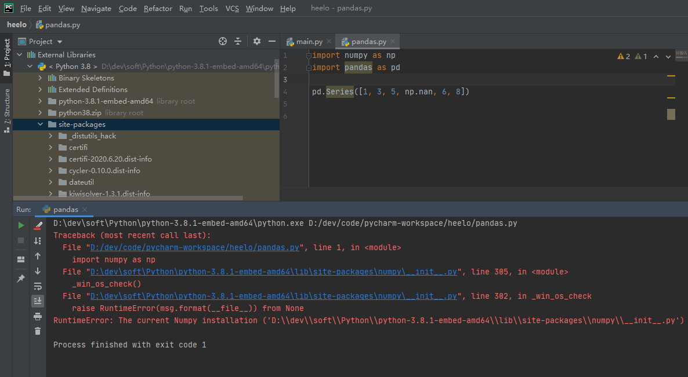

# 1 介绍

在Python中，pandas是基于NumPy数组构建的，使数据预处理、清洗、分析工作变得更快更简单。pandas是专门为处理表格和混杂数据设计的，而NumPy更适合处理统一的数值数组数据。使用下面格式约定，引入pandas包

```shell
pip install pandas
pip3 install numpy==1.19.3
```

windows只能安装1.19.3，直接使用pip3 install命令安装的是最新的1.19.4版本



```python
import pandas as pd
import numpy as np
```

pandas有两个主要数据结构：Series和DataFrame。


# 2 数据类型

int、float、bool、str、列表[]、元组()、集合{}、字典

序列：str、list、tuple

切片："hello"[1:-1]

