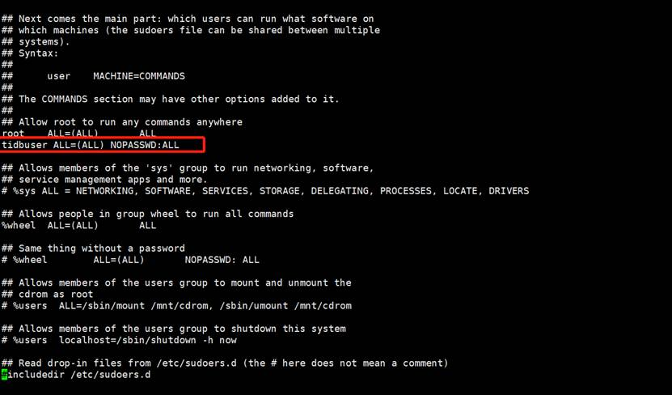
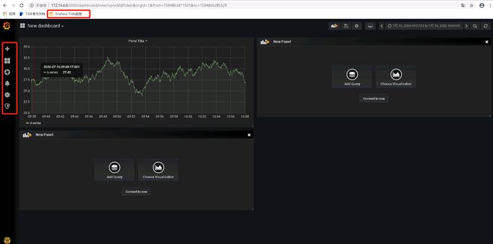

# 1 服务端环境搭建

TIKV对磁盘要求较高，建议使用 PCIE SSD;
TDB集群内部要求万兆网；
生产集群建议TKV至少4实例以上；
两地三中心建议同城机房不高于2ms，异地机房不高于16ms;
两地三中心服务器数量需与机房呈对应倍数关系；
TDB可在云上环境部署，云上环境需使用本地SSD
单服务器硬件能力较强，建议使用多实例而非虚拟机；
生产环境不建议TDB和TKV混合部署；
TDB节点建议关闭swap。


测试版（功能体验+开发）
口单机部署模式
口适合个人观摩各组件之间的联系
口不方便管理，不推荐使用
口 docker- compose快速部署集群
口简单快捷，一键启停，组件完全，可测试功能
口基本不用考虑性能
正式版
口基于 ansible构建TDB集群
口当前主流多节点管理工具，tidb主流部署工具
口受制于 ansible，不够智能，节点较多时，管理复杂
口基于k8s构建一套TiDB集群
口 cloud is future，未来TiDB商业版部署工具


Ansible简介
基于 Python开发，集合了众多运维工具（ puppet、 cfengine、chef、func、 Fabric）的优点，实现了批量系统配置、批量程序部署、批量运行命令等功能
口部署简单，无需 agent，只要求有shs和 python
口模块化：本身只提供一个框架，靠丰富的模块来完成各种工作，插件可扩展
口集中的 Inventory. ini完成集群拓扑定义和编排
口通过称作 playbook的yaml脚本，完成各种复杂任务
口幂等性，可重复执行，使集群达到目标状态

2、导出=>存储web所用格式=>品质

经过对公司项目业务数据的前期评估和对tidb硬件环境的基础要求，需要以下配置的服务器进行对tidb集群的环境部署。如果后期随着业务数据量的剧增则会考虑采用扩展内存、CPU、硬盘；如果服务器对性能和查询效率有更高的要求后期可以添加TiFlash等组件。

| **组件**      | **CPU** | **内存** | **硬盘类型** | **操作系统（IP）**        |
| ------------- | ------- | -------- | ------------ | ------------------------- |
| TiDB1、PD1    | 8核+    | 16G+     | SAS（500G）  | CentOS 7.3+（172.16.6.1） |
| TiDB2、PD2    | 8核+    | 16G+     | SAS（500G）  | CentOS 7.3+（172.16.6.2） |
| TiKV1、中控机 | 8核+    | 16G+     | SSD（500G）  | CentOS 7.3+（172.16.6.3） |
| TiKV2         | 8核+    | 16G+     | SSD（500G）  | CentOS 7.3+（172.16.6.4） |
| TiKV3         | 8核+    | 16G+     | SSD（500G）  | CentOS 7.3+（172.16.6.5） |
| 监控服务、PD3 | 8核+    | 16G+     | SAS（500G）  | CentOS 7.3+（172.16.6.6） |
| 对外应用服务  | 2核+    | 8G+      | SAS（500G）  | CentOS 7.3+（待定）       |
| 数据库访问    | 2核+    | 8G+      | SAS（500G）  | Windows（172.16.6.7）     |

 

## 1.2 服务端连接

1、客户端的访问需要登录公司集团第二堡垒机的Linux服务器；通过电脑的Xshell远程连接工具进行服务器的连接。

2、配置SSH连接，地址：39.105.141.215；端口：60022。


3、配置连接用户信息，用户名：ext-dss；密码：23ACEEB5。


3、输入动态码，需要下载阿里云客户端。


4、选择tidb的服务器。


## 1.3 磁盘挂载

1、查看分区信息$>fdisk -l


 

2、分区磁盘$>fdisk /dev/vdb（输入 n， p， 1， 回车，回车， wq）


 

3、格式磁盘$>mkfs.ext3 /dev/vdb1（mkfs.ext4 /dev/vdb1是ext4的方式）


 

4、创建被挂载的目录$>mkdir /data


 

5、挂载$>mount /dev/vdb1 /data（解除挂载：umount /dev/vdb1）可以看出磁盘已经正常被分配。


## 1.4 单点故障

通常分布式系统采用主从模式，一个主机连接多个处理节点，主节点负责分发任务，而子节点负责处理业务，当主节点发生故障时，会导致整个系统发故障，我们把这种故障叫做单点故障。

按照TIDB官方的说法是最少使用3台PD、2台TIDB、3台TIKV就能解决单点故障问题。


## 1.5 基础准备

### 1.5.1 IP地址分配

根据公司提供的IP网段进行合理的分配，**见硬件说明**。

### 1.5.2 服务名及hosts

1、修改服务器对应名称：$>vim /etc/hostname，通过名称对应的服务。


2、修改hosts文件$>vim /etc/hosts


### 1.5.3 国内镜像源

镜像源建议修改成国内的镜像源地址（阿里的镜像源），可以提供下载和更新的速速；由于集团公司是购买的阿里云服务，阿里云服务默认既是国内的镜像源地址。


### 1.5.4 更新系统

$>yum –y update # 可以将Centos更新至最新版

### 1.5.5 基础软件

$>yum -y install net-tools curl lrzsz lsof telnet-server telnet.* rsync

$>yum -y install gcc gcc-c++ pcre pcre-devel zlib zlib-devel

$>yum -y install unzip zip

备注：主要安装文件上传下载工具、网络基础工具、解压工具等等，根据对应服务的需求进行选择。

### 1.5.6 关闭防火墙

$>systemctl status firewalld # 查看防护墙状态

$>systemctl stop firewalld # 如果是开启的建议关闭

### 1.5.7 新建用户

$>groupadd tidbgroup # 创建用户组

$>useradd -g tidbgroup tidbuser # 创建指定用户组的用户

$>passwd tidbuser # 修改用户密码为tidb..

### 1.5.8 SSH配置

$>ssh-keygen -t rsa # 生产SSH，每个机器都需要执行

$>scp ~/.ssh/id_rsa.pub tidbuser@s01:~/.ssh/authorized_keys 

$>scp ~/.ssh/id_rsa.pub tidbuser@s02:~/.ssh/authorized_keys

$>scp ~/.ssh/id_rsa.pub tidbuser@s03:~/.ssh/authorized_keys

$>scp ~/.ssh/id_rsa.pub tidbuser@s04:~/.ssh/authorized_keys

$>scp ~/.ssh/id_rsa.pub tidbuser@s05:~/.ssh/authorized_keys

$>scp ~/.ssh/id_rsa.pub tidbuser@s06:~/.ssh/authorized_keys

\# 特别注意：scp命令是在中控机（172.16.6.3）上面进行执行。

### 1.5.9 关闭SELinux

所有虚拟主机都需要进操作：$>vim /etc/selinux/config

将SELINUX=enforcing改为SELINUX=disabled，设置后需要重启才能生效。


### 1.5.10  用户权限

$>visudo # 添加下面内容

tidbuser ALL=(ALL) NOPASSWD: ALL



## 1.6 TiUP进行部署

### 1.6.1 安装TiUP

1、执行如下命令安装 TiUP 工具：

$>curl --proto '=https' --tlsv1.2 -sSf 

https://tiup-mirrors.pingcap.com/install.sh | sh


2、确认 TiUP 工具是否安装：$>which tiup。

3、安装 TiUP cluster 组件：$>tiup cluster。

4、如果已经安装，则更新 TiUP cluster 组件至最新版本：$>tiup update --self && tiup update cluster。

5、预期输出 “Update successfully!” 字样。

6、验证当前 TiUP cluster版本信息。执行如下命令查看 TiUP cluster 组件版本：$>tiup --binary cluster。


### 1.6.2 编译初始化配置

指行如下命令：$>cd /data/soft/tidb4.0/

按如下进行配置：$>vim topology.yaml

```yaml
# # Global variables are applied to all deployments and used as the default value of
# # the deployments if a specific deployment value is missing.
global:
  user: "tidbuser"
  ssh_port: 22
  deploy_dir: "/data/soft/tidb-deploy"
  data_dir: "/data/soft/tidb-data" # 离线备份考虑

server_configs:
  pd:
    replication.enable-placement-rules: true
# PD集群
pd_servers:
  - host: 172.16.6.1
  - host: 172.16.6.2
  - host: 172.16.6.6

# TTIDB集群
tidb_servers:
  - host: 172.16.6.1
  - host: 172.16.6.2

# TTIKV集群
tikv_servers:
  - host: 172.16.6.3
  - host: 172.16.6.4
  - host: 172.16.6.5

# 监控部分
monitoring_servers:
  - host: 172.16.6.6
grafana_servers:
  - host: 172.16.6.6
alertmanager_servers:
  - host: 172.16.6.6

# 后期扩展部分

```


### 1.6.3 执行部署命令

1、$>tiup cluster deploy tidb-bsh v4.0.0 ./topology.yaml --user tidbuser。

\# 注：tidb-bsh是给集群取个名称。


2、等待自动布署完成之后执行如下命令查看集群环境：$>tiup cluster list。


3、检查部署的 TiDB 集群情况：$>tiup cluster display tidb-bsh。

\# 注：tidb-bsh是集群名称，当前状态都是没有启动。


4、启动集群：$>tiup cluster start tidb-bsh。


5、验证集群运行状态：$>tiup cluster display tidb-bsh，预期结果输出，注意 Status状态信息为Up说明集群状态正常。


6、通过MySQL客户端进行tidb服务的连接


7、关闭集群：$>tiup cluster stop tidb-bsh

8、销毁集群：$>tiup cluster destroys tidb-bsh

备注：销毁集群操作会关闭服务，清空数据目录和部署目录，并且无法恢复，需要谨慎操作。

### 1.6.4 Web UI

1、 TiDB Dashboard 图形化界面，内置各种有力工具方便 DBA 同学诊断、监视和管理集群。

http://172.16.6.2:2379/

2、集群监控Grafana

http://172.16.6.6:3000/

## 1.7 BR备份


### 1.7.1 下载安装


### 1.7.2 外部挂载

umount /data/soft/br_data_bak/
df -hT
mount -t nfs //172.16.7.121/share/tidb-data/ /data/soft/br_data_bak
df -hT

df -hT（df -hl）

update mysql.user set authentication_string=password('root') where user='root' ;
update mysql.user set authentication_string=PASSWORD('BSHtidb..') where User='root';
flush privileges;


yum install -y nfs-utils

showmount -e 172.16.7.121

mount -t nfs 172.16.7.121:/home/nfs /data/soft/br_data_bak

/home/nfs 172.16.7.0/24(rw,sync,no_root_squash)

/home/nfs *(rw,sync,no_root_squash)

systemctl restart nfs-server.service

### 1.7.3 备份数据

br backup full --pd "192.168.22.137:2379" -s "192.168.22.137:///tmp/backup"

br backup table --db batchmark --table order_line -s 172.16.7.121:///share/tidb-data/ --pd 172.16.6.2:2379

br backup full --pd "172.16.6.2:2379" --storage "172.16.7.121:///share/tidb-data/" --ratelimit 120 --log-file backupfull.log

br backup full --pd "172.16.6.2:2379" -s "local:///tmp/backup"


br backup full  --pd "172.16.6.2:2379" -s "local:///data/soft/br_data_bak"


/data/soft/br_data_bak 172.16.7.121(rw,no_root_squash)
/data/soft/br_data_bak 172.16.6.2(rw,no_root_squash)

/data/soft/br_data_bak *(rw,sync)

### 1.7.4 恢复数据

## 1.8 DM同步

参考资料：https://blog.csdn.net/weixin_43129750/article/details/103366000

[TiDB Data Migration](https://github.com/pingcap/dm) (DM) 是一体化的数据同步任务管理平台，支持从 MySQL 或 MariaDB 到 TiDB 的全量数据迁移和增量数据同步。使用 DM 工具有利于简化错误处理流程，降低运维成本。


### 1.8.1 用户管理

```shell
groupadd tidbgroup
useradd -g tidbgroup tidbuser
passwd tidbuser
```

### 1.8.2 秘钥管理

```bash
./bin/dmctl --encrypt "manager"  // 特别注意：两端数据库的密码都要进行加密写入配置

server-id=202         // 服务器特有的id
log-bin=mysql-bin     // 声明二进制日志文件为mysql-bin.xxx
binlog-format=row   // 二进制的格式：mixed(混合的)、row(磁盘变化)、statement(执行语句)

mysql -uroot -p
alter user 'root'@'localhost' IDENTIFIED BY 'passw0rd';
GRANT ALL PRIVILEGES ON *.* TO 'root'@'%' IDENTIFIED BY 'passw0rd' WITH GRANT OPTION;
flush privileges;
```

### 1.8.3 DM-worker

nohup bin/dm-worker -config conf/lh-1000012001/dm-worker.toml &

```yaml
# Worker Configuration.

# log configuration
log-level = "info"
log-file = "./log/worker/dm-worker.log"

# dm-worker listen address
worker-addr = ":8262"

# binlog复制从服务器的服务器id
# 复制组中的每个实例(主实例和从实例)应该有不同的服务器id
server-id = 101

# 表示MySQL/MariaDB实例或复制组
source-id = "mysql-replica-01"

# flavor: mysql/mariadb
flavor = "mysql"

# 用于存储中继日志的#目录
relay-dir = "./log/worker/relay_log"

# 在中继日志单元中启用gtid
enable-gtid = false

# charset of DSN of source mysql/mariadb instance
# charset= ""

[from]
host = "172.16.6.7"
user = "root"
password = "St3Wg26G35jpkdomM2qpB0A7nh1q10GTnA=="
port = 3306

# 中继日志清除策略
#[purge]
interval = 3600
expires = 24
remain-space = 15

# 任务状态检查
[checker]
check-enable = true
backoff-rollback = "5m"
backoff-max = "5m"
```


### 1.8.4 DM-master

nohup bin/dm-master -config conf/lh-1000012001/dm-master.toml &

```yaml
# Master Configuration.

# rpc configuration
#
# rpc超时是一个正数加上时间单位。我们使用戈朗标准时间
# 单元包括: "ns", "us", "ms", "s", "m", "h". 你应该提供一个适当的
# rpc超时根据您的使用场景
rpc-timeout = "30s"
# rpc limiter controls how frequently events are allowed to happen.
# It implements a "token bucket" of size `rpc-rate-limit`, initially full and
# refilled at rate `rpc-rate-limit` tokens per second. Note `rpc-rate-limit`
# is float64 type, so remember to add a decimal point and one trailing 0 if its
# literal value happens to be an integer.
rpc-rate-limit = 10.0
rpc-rate-burst = 40

# 日志配置
log-level = "info"
log-file = "./log/master/dm-master.log"

# dm-master 监听地址
master-addr = ":8261"

# dm-Worker部署，当新的部署功能可用时，我们将对其进行优化
[[deploy]]
source-id = "mysql-replica-01"
dm-worker = "172.16.7.121:8262"
```


### 1.8.5 同步任务

```bash
bin/dmctl -master-addr 172.16.7.121:8361
start-task conf/lh-1000012001/task_basic.yaml
stop-task lh-2001
query-status lh-2001

bin/dmctl -master-addr 172.16.7.121:8362
start-task conf/cqzg-1000017001/task_basic.yaml
stop-task cqzg-7001
query-status cqzg-7001


cqygh-7002 cqygh-1000017002
liaohua-1002  liaohua-1000011002// 辽化
```

```yaml
---
name: test # 全局唯一
task-mode: all  # full/incremental/all三种任务模式

target-database:
  host: "172.16.6.2"
  port: 4000
  user: "root"
  password: "mfgh6WGFdz6MQhwj1dw4BkAkaoEKzyO3HBE="

mysql-instances:             # 一个或多个源数据库，配置多个源数据库用于分片合并
  -
    source-id: "mysql-replica-01" # 在所有实例中是唯一的，在保存检查点、配置等时用作id
    black-white-list:  "instance"

    # 用于转储数据的线程数
    mydumper-thread: 4

    # 用于加载数据的线程数
    loader-thread: 16

    # 用于复制binlog的线程数
    syncer-thread: 16

black-white-list:
  instance:
    do-dbs: ["~^test.*", "do"]      # 需要复制的上游模式白列表，支持正则表达式(以~开头)
    do-tables:         # 需要复制的上游表的#白列表，支持(db-name, tbl-name)正则表达式(以~开头)
    - db-name: "~^test.*"
      tbl-name: "~^*.*"
    - db-name: "do"
      tbl-name: "do"
```

### 1.8.6 入坑

1、解决方式


参考报错：https://asktug.com/t/topic/34718


## 1.9 性能测试

### 19.1 普通集群

我这边是7个亿的单表，生产未优化SQL和索引的时间+分组查询是 102s.优化下索引和SQL 达到34s. 用了tiflash预计是20s. 生产还没升级版本

# 2 客户端环境搭建

## 2.1 客户端连接

1、客户端的访问需要登录公司集团第二堡垒机的Windows服务器；通过电脑的mstsc远程连接命令进入连接窗口，输入连接地址：39.105.141.215:63389。


2、输入登录服务动态口令


3、进入选择进入系统的界面，选择TIDB集群对应的机器。


## 2.2 Navicat客户端

1、连接tidb服务的mysql实例。（连接地址：172.16.6.2；端口：4000）

2、创建数据仓库数据库db_tidb_md_prod（tidb数据集）、创建具体业务数据库db_medical_companies_data（提供给医药公司使用的脱敏数据库集）。

3、导入数据库表结构。


5、进行业务数据的导入。

6、用户权限进行分配操作（只读操作、可以创建视图）。

7、数据文件拷出问题（网络部确认）。

## 2.3 Google浏览器

1、通过浏览器访问tidb的监控服务，对现有的服务进行可视化监控操作；访问地址：http://172.16.6.6:3000/login，首次访问系统需要进行登录操作。（账号：admin；密码：BSHtidb..）



2、根据自己的监控需求进行自定义化。


# 3 参考资料

## 3.1 官方资料

官方文档：https://pingcap.com/docs/stable/

官方中文文档：https://pingcap.com/docs-cn/