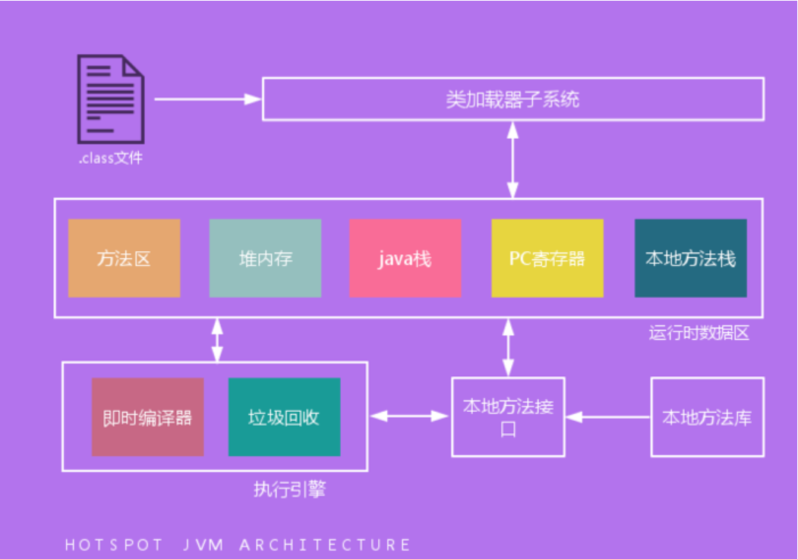

> 五重：JDK源码、算法、设计模式、底层内存、代码

1、第一阶段：开发常用
JavaSE基础、IDE（eclipse、sts、idea）、Maven、Gradle、SVN、Git、Spring、Spring MVC、MySQL、Oracle、MariaDB（支持文档数据）、Hibernate（JPA）、Mybatis、Spring Boot、Spring Cloud、HTML、CSS、JavaScript、JQuery、Ajax。

2、第二阶段：基础提升
JavaSE深入、JVM、数据结构+算法、HTTP协议、设计模式（23种）、权限设计（RBAC、shiro、security）、工作流（Activiti6.0）、数据库主备搭建、ES6、Vue、Angular、微信小程序。

3、第三阶段：开发中间件
Linux、Nginx、Redis、Zookeeper、Solr、Web安全、Hbase、Fastdfs、Hdfs、Kafka、ELK等各种中间件

4、第四阶段：框架源码
JavaSE、Spring5、Mybatis

5、第五阶段：技能提升
高并发、性能优化

1 Java概述
=======

## 1.1 何为编程

编程就是让计算机为**解决某个问题**而使用某种程序设计语言编写程序代码，并最终**得到结果**的过程。

为了使计算机能够理解人的意图，人类就必须要将需解决的问题的思路、方法、和手段通过计算机能够理解的形式告诉计算机，使得计算机能够根据人的指令一步一步去工作，完成某种特定的任务。这种**人和计算机之间交流**的过程就是编程。

## 1.2 什么是 Java

Java是一门**面向对象**编程语言，不仅吸收了C++ 语言的各种优点，还摒弃了C++ 里难以理解的多继承、指针等概念，因此 Java 语言具有功能强大和简单易用两个特征。Java 语言作为静态面向对象编程语言的代表，极好地实现了面向对象理论，允许程序员以优雅的思维方式进行复杂的编程 。

## 1.3 jdk1.5之后的三大版本

*   Java SE（J2SE，Java 2 Platform Standard Edition，标准版） 
    Java SE 以前称为 J2SE。它允许开发和部署在桌面、服务器、嵌入式环境和实时环境中使用的 Java 应用程序。Java SE 包含了支持 Java Web 服务开发的类，并为 Java EE 和 Java ME 提供基础。
*   Java EE（J2EE，Java 2 Platform Enterprise Edition，企业版） 
    Java EE 以前称为 J2EE。企业版本帮助开发和部署可移植、健壮、可伸缩且安全的服务器端 Java 应用程序。Java EE 是在 Java SE 的基础上构建的，它提供 Web 服务、组件模型、管理和通信 API，可以用来实现企业级的面向服务体系结构（service-oriented architecture，SOA）和 Web2.0 应用程序。2018 年 2 月，Eclipse 宣布正式将 JavaEE 更名为 JakartaEE
*   Java ME（J2ME，Java 2 Platform Micro Edition，微型版） 
    Java ME 以前称为 J2ME。Java ME 为在移动设备和嵌入式设备（比如手机、PDA、电视机顶盒和打印机）上运行的应用程序提供一个健壮且灵活的环境。Java ME 包括灵活的用户界面、健壮的安全模型、许多内置的网络协议以及对可以动态下载的连网和离线应用程序的丰富支持。基于 Java ME 规范的应用程序只需编写一次，就可以用于许多设备，而且可以利用每个设备的本机功能。

## 1.4 JVM、JRE和JDK的关系

JVM Java Virtual Machine 是 Java 虚拟机，Java 程序需要运行在虚拟机上，不同的平台有自己的虚拟机，因此 Java 语言可以实现跨平台。

JRE Java Runtime Environment 包括 Java 虚拟机和 Java 程序所需的核心类库等。核心类库主要是 java.lang 包：包含了运行 Java 程序必不可少的系统类，如基本数据类型、基本数学函数、字符串处理、线程、异常处理类等，系统缺省加载这个包

如果想要运行一个开发好的 Java 程序，计算机中只需要安装 JRE 即可。

JDK Java Development Kit 是提供给 Java 开发人员使用的，其中包含了 Java 的开发工具，也包括了 JRE。所以安装了 JDK，就无需再单独安装 JRE 了。其中的开发工具：编译工具 (javac.exe)，打包工具(jar.exe) 等

## 1.5 什么是跨平台性

所谓跨平台性，是指Java语言编写的程序，一次编译后，可以在多个系统平台上运行。

实现原理：Java 程序是通过 java 虚拟机在系统平台上运行的，只要该系统可以**安装相应的java 虚拟机**，该系统就可以运行 java 程序。

## 1.6 Java语言有哪些特点

简单易学（Java 语言的语法与 C 语言和 C++ 语言很接近）

面向对象（封装，继承，多态）

平台无关性（Java 虚拟机实现平台无关性）

支持网络编程并且很方便（Java 语言诞生本身就是为简化网络编程设计的）

支持多线程（多线程机制使应用程序在同一时间并行执行多项任）

健壮性（Java 语言的强类型机制、异常处理、垃圾的自动收集等）

安全性

## 1.7 字节码

**字节码**：Java 源代码经过虚拟机编译器编译后产生的文件（即扩展为. class 的文件），它不面向任何特定的处理器，只**面向虚拟机**。

**采用字节码的好处**：Java 语言通过字节码的方式，在一定程度上**解决了传统解释型语言执行效率低**的问题，同时又保留了解释型语言可移植的特点。所以 Java 程序运行时比较高效，而且，由于字节码并不专对一种特定的机器，因此，Java 程序无须重新编译便可在多种不同的计算机上运行。

**先看下 java 中的编译器和解释器**：Java 中引入了虚拟机的概念，即在机器和编译程序之间加入了一层抽象的虚拟机器。这台虚拟的机器在任何平台上都提供给编译程序一个的共同的接口。编译程序只需要面向虚拟机，生成虚拟机能够理解的代码，然后由解释器来将虚拟机代码转换为特定系统的机器码执行。在 Java 中，这种供虚拟机理解的代码叫做字节码（即扩展为. class 的文件），它不面向任何特定的处理器，只面向虚拟机。每一种平台的解释器是不同的，但是实现的虚拟机是相同的。Java 源程序经过**编译器**编译后变成字节码，字节码由虚拟机解释执行，虚拟机将每一条要执行的字节码送给**解释器**，解释器将其翻译成特定机器上的机器码，然后在特定的机器上运行，这就是上面提到的Java 的特点的编译与解释并存的解释。

```
Java源代码---->编译器（javac）---->jvm可执行的Java字节码(即虚拟指令)---->jvm---->jvm中解释器----->机器可执行的二进制机器码---->程序运行（java）。
```

## 1.8 Java程序的主类

一个程序中可以有多个类，但只能有一个类是主类。在 Java 应用程序中，这个主类是指包含 main() 方法的类。而在 Java 小程序中，这个主类是一个继承自系统类 JApplet 或 Applet 的子类。应用程序的主类不一定要求是 public 类，但小程序的主类要求必须是 public 类。主类是 Java 程序执行的入口点。

## 1.9 Java应用程序与小程序

简单说应用程序是从主线程启动 (也就是 main() 方法)。applet 小程序没有 main 方法，主要是嵌在浏览器页面上运行 (调用 init() 线程或者 run()来启动)，嵌入浏览器这点跟 flash 的小游戏类似。

## 1.10 Java和C++的区别

我知道很多人没学过 C++，但是面试官就是没事喜欢拿咱们 Java 和 C++ 比呀！没办法！！！就算没学过 C++，也要记下来！

*   都是**面向对象**的语言，都支持封装、继承和多态
*   Java 不提供**指针**来直接访问内存，程序内存更加安全
*   Java 的类是**单继承**的，C++ 支持多重继承；虽然 Java 的类不可以多继承，但是接口可以多继承。
*   Java 有自动**内存管理**机制，不需要程序员手动释放无用内存

## 1.11 JDK和OpenJDK

1、Oracle JDK 版本将每三年发布一次，而 OpenJDK 版本每三个月发布一次；

2、OpenJDK 是一个参考模型并且是完全开源的，而 Oracle JDK 是 OpenJDK 的一个实现，并不是完全开源的；

3、Oracle JDK 比 OpenJDK 更稳定。OpenJDK 和 Oracle JDK 的代码几乎相同，但 Oracle JDK 有更多的类和一些错误修复。因此，如果您想开发企业 / 商业软件，我建议您选择 Oracle JDK，因为它经过了彻底的测试和稳定。某些情况下，有些人提到在使用 OpenJDK 可能会遇到了许多应用程序崩溃的问题，但是，只需切换到 Oracle JDK 就可以解决问题；

4、在响应性和 JVM 性能方面，Oracle JDK 与 OpenJDK 相比提供了更好的性能；

5、Oracle JDK 不会为即将发布的版本提供长期支持，用户每次都必须通过更新到最新版本获得支持来获取最新版本；

6、Oracle JDK 根据二进制代码许可协议获得许可，而OpenJDK 根据 GPL v2 许可获得许可。

2 基础语法
====

## 2.1 数据类型

### 2.1.1 数据分类

**1、定义**：Java 语言是强类型语言，对于每一种数据都定义了明确的具体的数据类型，在内存中分配了不同大小的内存空间。

**2、分类**

*   基本数据类型
    *   数值型
        *   整数类型（byte，short，int，long）
        *   浮点类型（float，double）
    *   字符型（char）
    *   布尔型（boolean）
*   引用数据类型
    *   类（class）
    *   接口（interface）
    *   数组（[]）

**3、Java基本数据类型图**


### 2.1.2 Switch

switch 是否能作用在 byte 上，是否能作用在 long 上，是否能作用在 String上。

在Java 5 以前，switch(expr) 中，expr 只能是 byte、short、char、int。

从 Java5 开始，Java 中引入了枚举类型，expr 也可以是 enum 类型，从 Java 7 开始，expr还可以是字符串（String），但是长整型（long）在目前所有的版本中都是不可以的。

### 2.1.3 位运算

用最有效率的方法计算2乘以8

2 << 3（左移 3 位相当于乘以 2 的 3 次方，右移 3 位相当于除以 2 的 3 次方）。

**补充：**我们为编写的类重写hashCode方法时，可能会看到如下所示的代码，其实我们不太理解为什么要使用这样的乘法运算来产生哈希码（散列码），而且为什么这个数是个素数，为什么通常选择31这个数？前两个问题的答案你可以自己百度一下，选择31是因为可以用移位和减法运算来代替乘法，从而得到更好的性能。说到这里你可能已经想到了：31 * num 等价于(num << 5) - num，左移5位相当于乘以2的5次方再减去自身就相当于乘以31，现在的VM都能自动完成这个优化。

### 2.1.4 Math

Math.round(11.5) 等于多少？Math.round(-11.5) 等于多少

Math.round(11.5) 的返回值是 12，Math.round(-11.5) 的返回值是 - 11。四舍五入的原理是在参数上加 0.5 然后进行下取整。

### 2.1.5 精度问题

float f=3.4; 是否正确

不正确。3.4 是双精度数，将双精度型（double）赋值给浮点型（float）属于下转型（down-casting，也称为窄化）会造成精度损失，因此需要强制类型转换 float f =(float)3.4; 或者写成 float f =3.4F;。

### 2.1.6 类型转换

short s1 = 1; s1 = s1 + 1; 有错吗? short s1 = 1; s1 += 1; 有错吗

对于 short s1 = 1; s1 = s1 + 1; 由于 1 是 int 类型，因此 s1+1 运算结果也是 int 型，需要强制转换类型才能赋值给 short 型。

而 short s1 = 1; s1 += 1; 可以正确编译，因为 s1+= 1; 相当于 s1 = (short(s1 + 1); 其中有隐含的强制类型转换。

## 2.2 编码

### 2.2.1 采用的编码

Java 语言采用何种编码方案？有何特点？

Java 语言采用 **Unicode编码标准**，Unicode（标准码），它为每个字符制订了一个唯一的数值，因此在任何的语言，平台，程序都可以放心的使用。

## 2.3 注释

### 2.3.1 什么 Java 注释

**定义**：用于解释说明程序的文字

**分类**

*   单行注释 
    格式： // 注释文字
*   多行注释 
    格式： /* 注释文字 */
*   文档注释 
    格式：/** 注释文字 */

**作用**

在程序中，尤其是复杂的程序中，适当地加入注释可以增加程序的可读性，有利于程序的修改、调试和交流。注释的内容在程序编译的时候会被忽视，不会产生目标代码，注释的部分不会对程序的执行结果产生任何影响。

注意事项：多行和文档注释都不能嵌套使用。

## 2.4 访问修饰符

### 2.4.1 修饰符

**1、定义：**Java 中，可以使用访问修饰符来保护对类、变量、方法和构造方法的访问。Java 支持 4 种不同的访问权限。

**2、分类：**public、private、protected、以及不写（default默认）

| 修饰符    | 当前类 | 同 包 | 子 类 | 其他包 |
| --------- | ------ | ----- | ----- | ------ |
| public    | √      | √     | √     | √      |
| protected | √      | √     | √     | ×      |
| default   | √      | √     | ×     | ×      |
| private   | √      | ×     | ×     | ×      |

类的成员不写访问修饰时默认为default。默认对于同一个包中的其他类相当于公开（public），对于不是同一个包中的其他类相当于私有（private）。受保护（protected）**对子类相当于公开**，对不是同一包中的没有父子关系的类相当于私有。Java中，外部类的修饰符只能是public或默认，类的成员（包括内部类）的修饰符可以是以上四种。

private : 在同一类内可见。使用对象：变量、方法。 注意：不能修饰类（外部类） 

default (即缺省，什么也不写，不使用任何关键字）: 在同一包内可见，不使用任何修饰符。使用对象：类、接口、变量、方法。 

protected : 对同一包内的类和所有子类可见。使用对象：变量、方法。 注意：不能修饰类（外部类）。 

public : 对所有类可见。使用对象：类、接口、变量、方法

**3、访问修饰符图**


## 2.5 运算符

### 2.5.1 & 和 && 的区别

& 运算符有两种用法：(1) 按位与；(2) 逻辑与。

&& 运算符是短路与运算。逻辑与跟短路与的差别是非常巨大的，虽然二者都要求运算符左右两端的布尔值都是 true 整个表达式的值才是 true。&& 之所以称为短路运算，是因为如果 && 左边的表达式的值是 false，右边的表达式会被直接短路掉，不会进行运算。

很多时候我们可能都需要用&&而不是&，例如在验证用户登录时判定用户名不是null而且不是空字符串，应当写为：username != null &&!username.equals("")，二者的顺序不能交换，更不能用&运算符，因为第一个条件如果不成立，根本不能进行字符串的equals比较，否则会产生NullPointerException异常。

注意：逻辑或运算符（|）和短路或运算符（||）的差别也是如此。

## 2.6 关键字

### 2.6.1 Java有没有goto

goto 是Java中的保留字，在目前版本的Java中没有使用。（根据James Gosling（Java之父）编写的《The Java Programming Language》一书的附录中给出了一个Java关键字列表，其中有goto和const，但是这两个是目前无法使用的关键字，因此有些地方将其称之为保留字，其实保留字这个词应该有更广泛的意义，因为熟悉C语言的程序员都知道，在系统类库中使用过的有特殊意义的单词或单词的组合都被视为保留字）

### 2.6.2 final有什么用？

用于修饰类、属性和方法；

*   被 final 修饰的类不可以被继承
*   被 final 修饰的方法不可以被重写
*   被 final 修饰的变量不可以被改变，被 final 修饰不可变的是变量的引用，而不是引用指向的内容，引用指向的内容是可以改变的

### 2.6.3 final finally finalize区别

*   final 可以修饰类、变量、方法，修饰类表示该类不能被继承、修饰方法表示该方法不能被重写、修饰变量表 
    示该变量是一个常量不能被重新赋值。
*   finally 一般作用在 try-catch 代码块中，在处理异常的时候，通常我们将一定要执行的代码方法 finally 代码块 
    中，表示不管是否出现异常，该代码块都会执行，一般用来存放一些关闭资源的代码。
*   finalize 是一个方法，属于 Object 类的一个方法，而 Object 类是所有类的父类，该方法一般由垃圾回收器来调 
    用，当我们调用 System.gc() 方法的时候，由垃圾回收器调用 finalize()，回收垃圾，一个对象是否可回收的 
    最后判断。

### 2.6.4 this 关键字的用法

this 是自身的一个对象，代表对象本身，可以理解为：指向对象本身的一个指针。

this 的用法在 java 中大体可以分为 3 种：

1. 普通的直接引用，this 相当于是指向当前对象本身。

2. 形参与成员名字重名，用 this 来区分：

```
public Person(String name, int age) {
    this.name = name;
    this.age = age;
}

```

3. 引用本类的构造函数

```
class Person{
    private String name;
    private int age;
    
    public Person() {
    }
 
    public Person(String name) {
        this.name = name;
    }
    public Person(String name, int age) {
        this(name);
        this.age = age;
    }
}

```

### 2.6.5 super关键字的用法

super 可以理解为是指向自己超（父）类对象的一个指针，而这个超类指的是离自己最近的一个父类。

super 也有三种用法：

1. 普通的直接引用

与 this 类似，super 相当于是指向当前对象的父类的引用，这样就可以用 super.xxx 来引用父类的成员。

2. 子类中的成员变量或方法与父类中的成员变量或方法同名时，用 super 进行区分

```
class Person{
    protected String name;
 
    public Person(String name) {
        this.name = name;
    }
 
}
 
class Student extends Person{
    private String name;
 
    public Student(String name, String name1) {
        super(name);
        this.name = name1;
    }
 
    public void getInfo(){
        System.out.println(this.name);      
        System.out.println(super.name);     
    }
 
}

public class Test {
    public static void main(String[] args) {
       Student s1 = new Student("Father","Child");
       s1.getInfo();
 
    }
}

```

3. 引用父类构造函数

3、引用父类构造函数

*   super（参数）：调用父类中的某一个构造函数（应该为构造函数中的第一条语句）。
*   this（参数）：调用本类中另一种形式的构造函数（应该为构造函数中的第一条语句）。

### 2.6.6 this与super的区别

*   super:　它引用当前对象的直接父类中的成员（用来访问直接父类中被隐藏的父类中成员数据或函数，基类与派生类中有相同成员定义时如：super. 变量名 super. 成员函数据名（实参）
*   this：它代表当前对象名（在程序中易产生二义性之处，应使用 this 来指明当前对象；如果函数的形参与类中的成员数据同名，这时需用 this 来指明成员变量名）
*   super() 和 this() 类似, 区别是，super() 在子类中调用父类的构造方法，this() 在本类内调用本类的其它构造方法。
*   super() 和 this() 均需放在构造方法内第一行。
*   尽管可以用 this 调用一个构造器，但却不能调用两个。
*   this 和 super 不能同时出现在一个构造函数里面，因为 this 必然会调用其它的构造函数，其它的构造函数必然也会有 super 语句的存在，所以在同一个构造函数里面有相同的语句，就失去了语句的意义，编译器也不会通过。
*   this() 和 super() 都指的是对象，所以，均不可以在 static 环境中使用。包括：static 变量, static 方法，static 语句块。
*   从本质上讲，this 是一个指向本对象的指针, 然而 super 是一个 Java 关键字。

### 2.6.7 static存在的主要意义

static 的主要意义是在于创建独立于具体对象的域变量或者方法。**以致于即使没有创建对象，也能使用属性和调用方法**！

static 关键字还有一个比较关键的作用就是 **用来形成静态代码块以优化程序性能**。static 块可以置于类中的任何地方，类中可以有多个 static 块。在类初次被加载的时候，会按照 static 块的顺序来执行每个 static 块，并且只会执行一次。

为什么说 static 块可以用来优化程序性能，是因为它的特性: 只会在类加载的时候执行一次。因此，很多时候会将一些只需要进行一次的初始化操作都放在 static 代码块中进行。

### 2.6.8 static的独特之处

1、被 static 修饰的变量或者方法是独立于该类的任何对象，也就是说，这些变量和方法**不属于任何一个实例对象，而是被类的实例对象所共享**。

> 怎么理解 “被类的实例对象所共享” 这句话呢？就是说，一个类的静态成员，它是属于大伙的【大伙指的是这个类的多个对象实例，我们都知道一个类可以创建多个实例！】，所有的类对象共享的，不像成员变量是自个的【自个指的是这个类的单个实例对象】… 我觉得我已经讲的很通俗了，你明白了咩？

2、在该类被第一次加载的时候，就会去加载被 static 修饰的部分，而且只在类第一次使用时加载并进行初始化，注意这是第一次用就要初始化，后面根据需要是可以再次赋值的。

3、static 变量值在类加载的时候分配空间，以后创建类对象的时候不会重新分配。赋值的话，是可以任意赋值的！

4、被 static 修饰的变量或者方法是优先于对象存在的，也就是说当一个类加载完毕之后，即便没有创建对象，也可以去访问。

### 2.6.9 static应用场景

因为 static 是被类的实例对象所共享，因此如果**某个成员变量是被所有对象所共享的，那么这个成员变量就应该定义为静态变量**。

因此比较常见的 static 应用场景有：

> 1、修饰成员变量 2、修饰成员方法 3、静态代码块 4、修饰类【只能修饰内部类也就是静态内部类】 5、静态导包

### 2.6.10 static注意事项

1、静态只能访问静态。 2、非静态既可以访问非静态的，也可以访问静态的。

## 2.7 流程控制语句

### 2.7.1 中断语句

break 跳出总上一层循环，不再执行循环 (结束当前的循环体)

continue 跳出本次循环，继续执行下次循环 (结束正在执行的循环 进入下一个循环条件)

return 程序返回，不再执行下面的代码 (结束当前的方法 直接返回)

### 2.7.2 多重嵌套

在 Java 中，要想跳出多重循环，可以在外面的循环语句前定义一个标号，然后在里层循环体的代码中使用带有标号的 break 语句，即可跳出外层循环。例如：

```java
public static void main(String[] args) {
    ok:
    for (int i = 0; i < 10; i++) {
        for (int j = 0; j < 10; j++) {
            System.out.println("i=" + i + ",j=" + j);
            if (j == 5) {
                break ok;
            }

        }
    }
}
```

## 2.8 泛型

### 2.8.1 泛型摩擦

```java
List<String> l1 = new ArrayList<String>();
List<Integer> l2 = new ArrayList<Integer>();
System.out.println(l1.getClass() == l2.getClass());
```


3 面向对象
====

## 3.1 面向对象概述

### 3.1.1 面向对象和面向过程

**面向过程**：优点：性能比面向对象高，因为类调用时需要实例化，开销比较大，比较消耗资源; 比如单片机、嵌入式开发、Linux/Unix 等一般采用面向过程开发，性能是最重要的因素。缺点：没有面向对象易维护、易复用、易扩展

**面向对象**：优点：易维护、易复用、易扩展，由于面向对象有封装、继承、多态性的特性，可以设计出低耦合的系统，使系统更加灵活、更加易于维护缺点：性能比面向过程低

**面向过程是具体化的，流程化的，解决一个问题，你需要一步一步的分析，一步一步的实现。**

**面向对象是模型化的，你只需抽象出一个类，这是一个封闭的盒子，在这里你拥有数据也拥有解决问题的方法。需要什么功能直接使用就可以了，不必去一步一步的实现，至于这个功能是如何实现的，管我们什么事？我们会用就可以了。**

面向对象的底层其实还是面向过程，把面向过程抽象成类，然后封装，方便我们使用的就是面向对象了。

### 3.1.2 解释对象内存

通常我们定义一个**基本数据类型的变量**，一个对象的**引用地址值**，还有就是函数调用的现场保存都使用JVM中的栈空间；而通过new关键字和构造器创建的对象则放在堆空间，堆是垃圾收集器管理的主要区域，由于现在的垃圾收集器都采用分代收集算法，所以堆空间还可以细分为新生代和老生代，再具体一点可以分为Eden、Survivor（又可分为From Survivor和To Survivor）、Tenured；方法区和堆都是各个线程共享的内存区域，用于存储已经被JVM加载的类信息、常量、静态变量、JIT编译器编译后的代码等数据；程序中的字面量（literal）如直接书写的100、"hello"和常量都是放在常量池中，常量池是方法区的一部分，。栈空间操作起来最快但是栈很小，通常大量的对象都是放在堆空间，栈和堆的大小都可以通过JVM的启动参数来进行调整，栈空间用光了会引发StackOverflowError，而堆和常量池空间不足则会引发OutOfMemoryError。

```java
String str = new String("hello");
```

上面的语句中变量str放在栈上，用new创建出来的字符串对象放在**堆**上，而"hello"这个字面量是放在**方法区**的。

> **补充1：**较新版本的Java（从Java 6的某个更新开始）中，由于JIT编译器的发展和"逃逸分析"技术的逐渐成熟，栈上分配、标量替换等优化技术使得对象一定分配在堆上这件事情已经变得不那么绝对了。
>
> **补充2：**运行时常量池相当于Class文件常量池具有动态性，Java语言并不要求常量一定只有编译期间才能产生，运行期间也可以将新的常量放入池中，String类的intern()方法就是这样的。
>
> **补充3：**马士兵讲解的课程中划分内存是：stock、heap、code segment （代码区）、data segment（数据区）
>
> **补充4：其他**中划分内存是：栈（位于RAM中）、堆（位于RAM中）、常量池（位于ROM中）、静态代码区（位于RAM中）、寄存器

看看下面代码的执行结果是什么并且比较一下Java 7以前和以后的运行结果是否一致。

### 3.1.3 类的加载


1、JVM中类的装载是由类加载器（ClassLoader）和它的子类来实现的，Java中的类加载器是一个重要的Java运行时系统组件，它负责在运行时查找和装入类文件中的类。

2、由于Java的跨平台性，经过编译的Java源程序并不是一个可执行程序，而是一个或多个类文件。当Java程序需要使用某个类时，**JVM会确保这个类已经被加载、连接（验证、准备和解析）和初始化**。类的加载是指把类的.class文件中的数据读入到**内存**中，通常是创建一个字节数组读入.class文件，然后产生与所加载类对应的Class对象。加载完成后，Class对象还不完整，所以此时的类还不可用。当类被加载后就进入连接阶段，这一阶段包括**验证、准备（为静态变量分配内存并设置默认的初始值）和解析（将符号引用替换为直接引用）**三个步骤。最后JVM对类进行初始化，包括：1）如果类存在直接的父类并且这个类还没有被初始化，那么就**先初始化父类**；2）如果类中存在初始化语句，就依次执行这些初始化语句。

3、类的加载是由类加载器完成的，类加载器包括：根加载器（BootStrap）、扩展加载器（Extension）、系统加载器（System）和用户自定义类加载器（ClassLoader的子类）。从Java 2（JDK 1.2）开始，类加载过程采取了父亲委托机制（PDM）。PDM更好的保证了Java平台的安全性，在该机制中，JVM自带的Bootstrap是根加载器，其他的加载器都有且仅有一个父类加载器。**类的加载首先请求父类加载器加载，父类加载器无能为力时才由其子类加载器自行加载**。JVM不会向Java程序提供对Bootstrap的引用。下面是关于几个类加载器的说明：

> - Bootstrap：一般用本地代码实现，负责加载JVM基础核心类库（rt.jar）；
> - Extension：从java.ext.dirs系统属性所指定的目录中加载类库，它的父加载器是Bootstrap；
> - System：又叫应用类加载器，其父类是Extension。它是应用最广泛的类加载器。它从环境变量classpath或者系统属性java.class.path所指定的目录中记载类，是用户自定义加载器的默认父加载器。

## 3.2 面向对象三大特性

#### 面向对象的特征有哪些方面

**面向对象的特征主要有以下几个方面**：

**抽象**：抽象是将一类对象的共同特征总结出来构造类的过程，包括数据抽象和行为抽象两方面。抽象只关注对象有哪些属性和行为，并不关注这些行为的细节是什么。

封装

封装把一个对象的属性私有化，同时提供一些可以被外界访问的属性的方法，如果属性不想被外界访问，我们大可不必提供方法给外界访问。但是如果一个类没有提供给外界访问的方法，那么这个类也没有什么意义了。

继承

继承是使用已存在的类的定义作为基础建立新类的技术，新类的定义可以增加新的数据或新的功能，也可以用父类的功能，但不能选择性地继承父类。通过使用继承我们能够非常方便地复用以前的代码。

关于继承如下 3 点请记住：

1.  子类拥有父类非 private 的属性和方法。

2.  子类可以拥有自己属性和方法，即子类可以对父类进行扩展。

3.  子类可以用自己的方式实现父类的方法。（以后介绍）。

多态

所谓多态就是指程序中定义的引用变量所指向的具体类型和通过该引用变量发出的方法调用在编程时并不确定，而是在程序运行期间才确定，即一个引用变量到底会指向哪个类的实例对象，该引用变量发出的方法调用到底是哪个类中实现的方法，必须在由程序运行期间才能决定。

在 Java 中有两种形式可以实现多态：继承（多个子类对同一方法的重写）和接口（实现接口并覆盖接口中同一方法）。

其中 Java 面向对象编程三大特性：封装 继承 多态

**封装**：隐藏对象的属性和实现细节，仅对外提供公共访问方式，将变化隔离，便于使用，提高复用性和安全性。

**继承**：继承是使用已存在的类的定义作为基础建立新类的技术，新类的定义可以增加新的数据或新的功能，也可以用父类的功能，但不能选择性地继承父类。通过使用继承可以提高代码复用性。继承是多态的前提。

**关于继承如下 3 点请记住**：

1.  子类拥有父类非 private 的属性和方法。

2.  子类可以拥有自己属性和方法，即子类可以对父类进行扩展。

3.  子类可以用自己的方式实现父类的方法。

**多态性**：父类或接口定义的引用变量可以指向子类或具体实现类的实例对象。提高了程序的拓展性。

在 Java 中有两种形式可以实现多态：继承（多个子类对同一方法的重写）和接口（实现接口并覆盖接口中同一方法）。

方法重载（overload）实现的是编译时的多态性（也称为前绑定），而方法重写（override）实现的是运行时的多态性（也称为后绑定）。

一个引用变量到底会指向哪个类的实例对象，该引用变量发出的方法调用到底是哪个类中实现的方法，必须在由程序运行期间才能决定。运行时的多态是面向对象最精髓的东西，要实现多态需要做两件事：

*   方法重写（子类继承父类并重写父类中已有的或抽象的方法）；
*   对象造型（用父类型引用子类型对象，这样同样的引用调用同样的方法就会根据子类对象的不同而表现出不同的行为）。

#### 什么是多态机制？Java 语言是如何实现多态的？

所谓多态就是指程序中定义的引用变量所指向的具体类型和通过该引用变量发出的方法调用在编程时并不确定，而是在程序运行期间才确定，即一个引用变量倒底会指向哪个类的实例对象，该引用变量发出的方法调用到底是哪个类中实现的方法，必须在由程序运行期间才能决定。因为在程序运行时才确定具体的类，这样，不用修改源程序代码，就可以让引用变量绑定到各种不同的类实现上，从而导致该引用调用的具体方法随之改变，即不修改程序代码就可以改变程序运行时所绑定的具体代码，让程序可以选择多个运行状态，这就是多态性。

多态分为编译时多态和运行时多态。其中编辑时多态是静态的，主要是指方法的重载，它是根据参数列表的不同来区分不同的函数，通过编辑之后会变成两个不同的函数，在运行时谈不上多态。而运行时多态是动态的，它是通过动态绑定来实现的，也就是我们所说的多态性。

**多态的实现**

Java 实现多态有三个必要条件：继承、重写、向上转型。

继承：在多态中必须存在有继承关系的子类和父类。

重写：子类对父类中某些方法进行重新定义，在调用这些方法时就会调用子类的方法。

向上转型：在多态中需要将子类的引用赋给父类对象，只有这样该引用才能够具备技能调用父类的方法和子类的方法。

只有满足了上述三个条件，我们才能够在同一个继承结构中使用统一的逻辑实现代码处理不同的对象，从而达到执行不同的行为。

对于 Java 而言，它多态的实现机制遵循一个原则：当超类对象引用变量引用子类对象时，被引用对象的类型而不是引用变量的类型决定了调用谁的成员方法，但是这个被调用的方法必须是在超类中定义过的，也就是说被子类覆盖的方法。

#### 面向对象五大基本原则是什么（可选）

*   单一职责原则 SRP(Single Responsibility Principle)  
    类的功能要单一，不能包罗万象，跟杂货铺似的。
*   开放封闭原则 OCP(Open－Close Principle)  
    一个模块对于拓展是开放的，对于修改是封闭的，想要增加功能热烈欢迎，想要修改，哼，一万个不乐意。
*   里式替换原则 LSP(the Liskov Substitution Principle LSP)  
    子类可以替换父类出现在父类能够出现的任何地方。比如你能代表你爸去你姥姥家干活。哈哈~~
*   依赖倒置原则 DIP(the Dependency Inversion Principle DIP)  
    高层次的模块不应该依赖于低层次的模块，他们都应该依赖于抽象。抽象不应该依赖于具体实现，具体实现应该依赖于抽象。就是你出国要说你是中国人，而不能说你是哪个村子的。比如说中国人是抽象的，下面有具体的 xx 省，xx 市，xx 县。你要依赖的抽象是中国人，而不是你是 xx 村的。
*   接口分离原则 ISP(the Interface Segregation Principle ISP)  
    设计时采用多个与特定客户类有关的接口比采用一个通用的接口要好。就比如一个手机拥有打电话，看视频，玩游戏等功能，把这几个功能拆分成不同的接口，比在一个接口里要好的多。

## 3.3 类与接口

#### 抽象类和接口的对比

抽象类是用来捕捉子类的通用特性的。接口是抽象方法的集合。

从设计层面来说，抽象类是对类的抽象，是一种模板设计，接口是行为的抽象，是一种行为的规范。

**相同点**

*   接口和抽象类都不能实例化
*   都位于继承的顶端，用于被其他实现或继承
*   都包含抽象方法，其子类都必须覆写这些抽象方法

**不同点**

| 参数       | 抽象类                                                       | 接口                                                         |
| ---------- | ------------------------------------------------------------ | ------------------------------------------------------------ |
| 声明       | 抽象类使用 abstract 关键字声明                               | 接口使用 interface 关键字声明                                |
| 实现       | 子类使用 extends 关键字来继承抽象类。如果子类不是抽象类的话，它需要提供抽象类中所有声明的方法的实现 | 子类使用 implements 关键字来实现接口。它需要提供接口中所有声明的方法的实现 |
| 构造器     | 抽象类可以有构造器                                           | 接口不能有构造器                                             |
| 访问修饰符 | 抽象类中的方法可以是任意访问修饰符                           | 接口方法默认修饰符是 public。并且不允许定义为 private 或者 protected |
| 多继承     | 一个类最多只能继承一个抽象类                                 | 一个类可以实现多个接口                                       |
| 字段声明   | 抽象类的字段声明可以是任意的                                 | 接口的字段默认都是 static 和 final 的                        |

**备注**：Java8 中接口中引入默认方法和静态方法，以此来减少抽象类和接口之间的差异。

现在，我们可以为接口提供默认实现的方法了，并且不用强制子类来实现它。

接口和抽象类各有优缺点，在接口和抽象类的选择上，必须遵守这样一个原则：

*   行为模型应该总是通过接口而不是抽象类定义，所以通常是优先选用接口，尽量少用抽象类。
*   选择抽象类的时候通常是如下情况：需要定义子类的行为，又要为子类提供通用的功能。

#### 普通类和抽象类有哪些区别？

*   普通类不能包含抽象方法，抽象类可以包含抽象方法。
*   抽象类不能直接实例化，普通类可以直接实例化。

#### 抽象类能使用 final 修饰吗？

不能，定义抽象类就是让其他类继承的，如果定义为 final 该类就不能被继承，这样彼此就会产生矛盾，所以 final 不能修饰抽象类

#### 创建一个对象用什么关键字？对象实例与对象引用有何不同？

new 关键字，new 创建对象实例（对象实例在堆内存中），对象引用指向对象实例（对象引用存放在栈内存中）。一个对象引用可以指向 0 个或 1 个对象（一根绳子可以不系气球，也可以系一个气球）; 一个对象可以有 n 个引用指向它（可以用 n 条绳子系住一个气球）

## 3.4 变量与方法

#### 成员变量与局部变量的区别有哪些

变量：在程序执行的过程中，在某个范围内其值可以发生改变的量。从本质上讲，变量其实是内存中的一小块区域

成员变量：方法外部，类内部定义的变量

局部变量：类的方法中的变量。

成员变量和局部变量的区别

**作用域**

成员变量：针对整个类有效。 
局部变量：只在某个范围内有效。(一般指的就是方法, 语句体内)

**存储位置**

成员变量：随着对象的创建而存在，随着对象的消失而消失，存储在堆内存中。  
局部变量：在方法被调用，或者语句被执行的时候存在，存储在栈内存中。当方法调用完，或者语句结束后，就自动释放。

**生命周期**

成员变量：随着对象的创建而存在，随着对象的消失而消失  
局部变量：当方法调用完，或者语句结束后，就自动释放。

**初始值**

成员变量：有默认初始值。

局部变量：没有默认初始值，使用前必须赋值。

使用原则

在使用变量时需要遵循的原则为：就近原则  
首先在局部范围找，有就使用；接着在成员位置找。

#### 在 Java 中定义一个不做事且没有参数的构造方法的作用

Java 程序在执行子类的构造方法之前，如果没有用 super()来调用父类特定的构造方法，则会调用父类中 “没有参数的构造方法”。因此，如果父类中只定义了有参数的构造方法，而在子类的构造方法中又没有用 super() 来调用父类中特定的构造方法，则编译时将发生错误，因为 Java 程序在父类中找不到没有参数的构造方法可供执行。解决办法是在父类里加上一个不做事且没有参数的构造方法。

#### 在调用子类构造方法之前会先调用父类没有参数的构造方法，其目的是？

帮助子类做初始化工作。

#### 一个类的构造方法的作用是什么？若一个类没有声明构造方法，改程序能正确执行吗？为什么？

主要作用是完成对类对象的初始化工作。可以执行。因为一个类即使没有声明构造方法也会有默认的不带参数的构造方法。

#### 构造方法有哪些特性？

名字与类名相同；

没有返回值，但不能用 void 声明构造函数；

生成类的对象时自动执行，无需调用。

#### 静态变量和实例变量区别

静态变量： 静态变量由于不属于任何实例对象，属于类的，所以在内存中只会有一份，在类的加载过程中，JVM 只为静态变量分配一次内存空间。

实例变量： 每次创建对象，都会为每个对象分配成员变量内存空间，实例变量是属于实例对象的，在内存中，创建几次对象，就有几份成员变量。

#### 静态变量与普通变量区别

static 变量也称作静态变量，静态变量和非静态变量的区别是：静态变量被所有的对象所共享，在内存中只有一个副本，它当且仅当在类初次加载时会被初始化。而非静态变量是对象所拥有的，在创建对象的时候被初始化，存在多个副本，各个对象拥有的副本互不影响。

还有一点就是 static 成员变量的初始化顺序按照定义的顺序进行初始化。

#### 静态方法和实例方法有何不同？

静态方法和实例方法的区别主要体现在两个方面：

1.  在外部调用静态方法时，可以使用 "类名. 方法名" 的方式，也可以使用 "对象名. 方法名" 的方式。而实例方法只有后面这种方式。也就是说，调用静态方法可以无需创建对象。
2.  静态方法在访问本类的成员时，只允许访问静态成员（即静态成员变量和静态方法），而不允许访问实例成员变量和实例方法；实例方法则无此限制

#### 在一个静态方法内调用一个非静态成员为什么是非法的？

由于静态方法可以不通过对象进行调用，因此在静态方法里，不能调用其他非静态变量，也不可以访问非静态变量成员。

#### 什么是方法的返回值？返回值的作用是什么？

方法的返回值是指我们获取到的某个方法体中的代码执行后产生的结果！（前提是该方法可能产生结果）。返回值的作用: 接收出结果，使得它可以用于其他的操作！

## 3.5 内部类

### 3.5.1 什么是内部类？

在 Java 中，可以将一个类的定义放在另外一个类的定义内部，这就是**内部类**。内部类本身就是类的一个属性，与其他属性定义方式一致。

### 内部类的分类有哪些

内部类可以分为四种：**成员内部类、局部内部类、匿名内部类和静态内部类**。

##### 静态内部类

定义在类内部的静态类，就是静态内部类。

```
public class Outer {

    private static int radius = 1;

    static class StaticInner {
        public void visit() {
            System.out.println("visit outer static  variable:" + radius);
        }
    }
}

```

静态内部类可以访问外部类所有的静态变量，而不可访问外部类的非静态变量；静态内部类的创建方式，`new 外部类.静态内部类()`，如下：

```
Outer.StaticInner inner = new Outer.StaticInner();
inner.visit();

```

##### 成员内部类

定义在类内部，成员位置上的非静态类，就是成员内部类。

```
public class Outer {

    private static  int radius = 1;
    private int count =2;
    
     class Inner {
        public void visit() {
            System.out.println("visit outer static  variable:" + radius);
            System.out.println("visit outer   variable:" + count);
        }
    }
}

```

成员内部类可以访问外部类所有的变量和方法，包括静态和非静态，私有和公有。成员内部类依赖于外部类的实例，它的创建方式`外部类实例.new 内部类()`，如下：

```
Outer outer = new Outer();
Outer.Inner inner = outer.new Inner();
inner.visit();

```

##### 局部内部类

定义在方法中的内部类，就是局部内部类。

```
public class Outer {

    private  int out_a = 1;
    private static int STATIC_b = 2;

    public void testFunctionClass(){
        int inner_c =3;
        class Inner {
            private void fun(){
                System.out.println(out_a);
                System.out.println(STATIC_b);
                System.out.println(inner_c);
            }
        }
        Inner  inner = new Inner();
        inner.fun();
    }
    public static void testStaticFunctionClass(){
        int d =3;
        class Inner {
            private void fun(){
                
                System.out.println(STATIC_b);
                System.out.println(d);
            }
        }
        Inner  inner = new Inner();
        inner.fun();
    }
}

```

定义在实例方法中的局部类可以访问外部类的所有变量和方法，定义在静态方法中的局部类只能访问外部类的静态变量和方法。局部内部类的创建方式，在对应方法内，`new 内部类()`，如下：

```
 public static void testStaticFunctionClass(){
    class Inner {
    }
    Inner  inner = new Inner();
 }

```

##### 匿名内部类

匿名内部类就是没有名字的内部类，日常开发中使用的比较多。

```
public class Outer {

    private void test(final int i) {
        new Service() {
            public void method() {
                for (int j = 0; j < i; j++) {
                    System.out.println("匿名内部类" );
                }
            }
        }.method();
    }
 }
 
 interface Service{
    void method();
}

```

除了没有名字，匿名内部类还有以下特点：

*   匿名内部类必须继承一个抽象类或者实现一个接口。
*   匿名内部类不能定义任何静态成员和静态方法。
*   当所在的方法的形参需要被匿名内部类使用时，必须声明为 final。
*   匿名内部类不能是抽象的，它必须要实现继承的类或者实现的接口的所有抽象方法。

匿名内部类创建方式：

```
new 类/接口{ 
  
}

```

### 内部类的优点

我们为什么要使用内部类呢？因为它有以下优点：

*   一个内部类对象可以访问创建它的外部类对象的内容，包括私有数据！
*   内部类不为同一包的其他类所见，具有很好的封装性；
*   内部类有效实现了 “多重继承”，优化 java 单继承的缺陷。
*   匿名内部类可以很方便的定义回调。

### 内部类有哪些应用场景

1.  一些多算法场合
2.  解决一些非面向对象的语句块。
3.  适当使用内部类，使得代码更加灵活和富有扩展性。
4.  当某个类除了它的外部类，不再被其他的类使用时。

### 局部内部类和匿名内部类访问局部变量的时候，为什么变量必须要加上 final？

局部内部类和匿名内部类访问局部变量的时候，为什么变量必须要加上 final 呢？它内部原理是什么呢？

先看这段代码：

```
public class Outer {

    void outMethod(){
        final int a =10;
        class Inner {
            void innerMethod(){
                System.out.println(a);
            }

        }
    }
}

```

以上例子，为什么要加 final 呢？是因为**生命周期不一致**， 局部变量直接存储在栈中，当方法执行结束后，非 final 的局部变量就被销毁。而局部内部类对局部变量的引用依然存在，如果局部内部类要调用局部变量时，就会出错。加了 final，可以确保局部内部类使用的变量与外层的局部变量区分开，解决了这个问题。

### 内部类相关，看程序说出运行结果

```
public class Outer {
    private int age = 12;

    class Inner {
        private int age = 13;
        public void print() {
            int age = 14;
            System.out.println("局部变量：" + age);
            System.out.println("内部类变量：" + this.age);
            System.out.println("外部类变量：" + Outer.this.age);
        }
    }

    public static void main(String[] args) {
        Outer.Inner in = new Outer().new Inner();
        in.print();
    }

}

```

运行结果：

```
局部变量：14
内部类变量：13
外部类变量：12

```

## 3.6 重写与重载

### 3.6.1 构造器

构造器（constructor）是否可被重写（override）

构造器不能被继承，因此不能被重写，但可以被重载。

### 3.6.2 重载、重写

重载（Overload）和重写（Override）的区别。重载的方法能否根据返回类型进行区分？

方法的重载和重写都是实现多态的方式，区别在于前者实现的是编译时的多态性，而后者实现的是运行时的多态性。

重载：发生在同一个类中，方法名相同参数列表不同（参数类型不同、个数不同、顺序不同），与方法返回值和访问修饰符无关，即重载的方法不能根据返回类型进行区分

重写：发生在父子类中，方法名、参数列表必须相同，返回值小于等于父类，抛出的异常小于等于父类，访问修饰符大于等于父类（里氏代换原则）；如果父类方法访问修饰符为 private 则子类中就不是重写。

## 3.7 对象相等判断

#### == 和 equals 的区别是什么

**==** : 它的作用是判断两个对象的地址是不是相等。即，判断两个对象是不是同一个对象。(基本数据类型 == 比较的是值，引用数据类型 == 比较的是内存地址)

**equals()** : 它的作用也是判断两个对象是否相等。但它一般有两种使用情况：

情况 1：类没有覆盖 equals() 方法。则通过 equals() 比较该类的两个对象时，等价于通过 “==” 比较这两个对象。

情况 2：类覆盖了 equals() 方法。一般，我们都覆盖 equals() 方法来两个对象的内容相等；若它们的内容相等，则返回 true (即，认为这两个对象相等)。

**举个例子：**

```
public class test1 {
    public static void main(String[] args) {
        String a = new String("ab"); 
        String b = new String("ab"); 
        String aa = "ab"; 
        String bb = "ab"; 
        if (aa == bb) 
            System.out.println("aa==bb");
        if (a == b) 
            System.out.println("a==b");
        if (a.equals(b)) 
            System.out.println("aEQb");
        if (42 == 42.0) { 
            System.out.println("true");
        }
    }
}

```

**说明：**

*   String 中的 equals 方法是被重写过的，因为 object 的 equals 方法是比较的对象的内存地址，而 String 的 equals 方法比较的是对象的值。
*   当创建 String 类型的对象时，虚拟机会在常量池中查找有没有已经存在的值和要创建的值相同的对象，如果有就把它赋给当前引用。如果没有就在常量池中重新创建一个 String 对象。

#### hashCode 与 equals (重要)

HashSet 如何检查重复

两个对象的 hashCode() 相同，则 equals() 也一定为 true，对吗？

hashCode 和 equals 方法的关系

面试官可能会问你：“你重写过 hashcode 和 equals 么，为什么重写 equals 时必须重写 hashCode 方法？”

**hashCode() 介绍**

hashCode() 的作用是获取哈希码，也称为散列码；它实际上是返回一个 int 整数。这个哈希码的作用是确定该对象在哈希表中的索引位置。hashCode() 定义在 JDK 的 Object.java 中，这就意味着 Java 中的任何类都包含有 hashCode() 函数。

散列表存储的是键值对 (key-value)，它的特点是：能根据“键” 快速的检索出对应的“值”。这其中就利用到了散列码！（可以快速找到所需要的对象）

**为什么要有 hashCode**

**我们以 “HashSet 如何检查重复” 为例子来说明为什么要有 hashCode**：

当你把对象加入 HashSet 时，HashSet 会先计算对象的 hashcode 值来判断对象加入的位置，同时也会与其他已经加入的对象的 hashcode 值作比较，如果没有相符的 hashcode，HashSet 会假设对象没有重复出现。但是如果发现有相同 hashcode 值的对象，这时会调用 equals() 方法来检查 hashcode 相等的对象是否真的相同。如果两者相同，HashSet 就不会让其加入操作成功。如果不同的话，就会重新散列到其他位置。（摘自我的 Java 启蒙书《Head first java》第二版）。这样我们就大大减少了 equals 的次数，相应就大大提高了执行速度。

**hashCode() 与 equals() 的相关规定**

如果两个对象相等，则 hashcode 一定也是相同的

两个对象相等，对两个对象分别调用 equals 方法都返回 true

两个对象有相同的 hashcode 值，它们也不一定是相等的

**因此，equals 方法被覆盖过，则 hashCode 方法也必须被覆盖**

hashCode() 的默认行为是对堆上的对象产生独特值。如果没有重写 hashCode()，则该 class 的两个对象无论如何都不会相等（即使这两个对象指向相同的数据）

#### 对象的相等与指向他们的引用相等，两者有什么不同？

对象的相等 比的是内存中存放的内容是否相等而 引用相等 比较的是他们指向的内存地址是否相等。

## 3.8 值传递

#### 当一个对象被当作参数传递到一个方法后，此方法可改变这个对象的属性，并可返回变化后的结果，那么这里到底是值传递还是引用传递

是值传递。Java 语言的方法调用只支持参数的值传递。当一个对象实例作为一个参数被传递到方法中时，参数的值就是对该对象的引用。对象的属性可以在被调用过程中被改变，但对对象引用的改变是不会影响到调用者的

#### 为什么 Java 中只有值传递

首先回顾一下在程序设计语言中有关将参数传递给方法（或函数）的一些专业术语。**按值调用 (call by value) 表示方法接收的是调用者提供的值，而按引用调用（call by reference)表示方法接收的是调用者提供的变量地址。一个方法可以修改传递引用所对应的变量值，而不能修改传递值调用所对应的变量值。** 它用来描述各种程序设计语言（不只是 Java) 中方法参数传递方式。

**Java 程序设计语言总是采用按值调用。也就是说，方法得到的是所有参数值的一个拷贝，也就是说，方法不能修改传递给它的任何参数变量的内容。**

**下面通过 3 个例子来给大家说明**

example 1

```
public static void main(String[] args) {
    int num1 = 10;
    int num2 = 20;

    swap(num1, num2);

    System.out.println("num1 = " + num1);
    System.out.println("num2 = " + num2);
}

public static void swap(int a, int b) {
    int temp = a;
    a = b;
    b = temp;

    System.out.println("a = " + a);
    System.out.println("b = " + b);
}

```

**结果**：

```
a = 20
b = 10
num1 = 10
num2 = 20

```

**解析**：

![][img-3]

在 swap 方法中，a、b 的值进行交换，并不会影响到 num1、num2。因为，a、b 中的值，只是从 num1、num2 的复制过来的。也就是说，a、b 相当于 num1、num2 的副本，副本的内容无论怎么修改，都不会影响到原件本身。

**通过上面例子，我们已经知道了一个方法不能修改一个基本数据类型的参数，而对象引用作为参数就不一样，请看 example2.**

example 2

```
    public static void main(String[] args) {
        int[] arr = { 1, 2, 3, 4, 5 };
        System.out.println(arr[0]);
        change(arr);
        System.out.println(arr[0]);
    }

    public static void change(int[] array) {
        
        array[0] = 0;
    }

```

**结果**：

```
1
0

```

**解析**：

![][img-4]

array 被初始化 arr 的拷贝也就是一个对象的引用，也就是说 array 和 arr 指向的时同一个数组对象。 因此，外部对引用对象的改变会反映到所对应的对象上。

**通过 example2 我们已经看到，实现一个改变对象参数状态的方法并不是一件难事。理由很简单，方法得到的是对象引用的拷贝，对象引用及其他的拷贝同时引用同一个对象。**

**很多程序设计语言（特别是，C++ 和 Pascal) 提供了两种参数传递的方式：值调用和引用调用。有些程序员（甚至本书的作者）认为 Java 程序设计语言对对象采用的是引用调用，实际上，这种理解是不对的。由于这种误解具有一定的普遍性，所以下面给出一个反例来详细地阐述一下这个问题。**

example 3

```
public class Test {

    public static void main(String[] args) {
        
        Student s1 = new Student("小张");
        Student s2 = new Student("小李");
        Test.swap(s1, s2);
        System.out.println("s1:" + s1.getName());
        System.out.println("s2:" + s2.getName());
    }

    public static void swap(Student x, Student y) {
        Student temp = x;
        x = y;
        y = temp;
        System.out.println("x:" + x.getName());
        System.out.println("y:" + y.getName());
    }
}

```

**结果**：

```
x:小李
y:小张
s1:小张
s2:小李

```

**解析**：

交换之前：

![][img-5]

交换之后：

![][img-6]

通过上面两张图可以很清晰的看出： **方法并没有改变存储在变量 s1 和 s2 中的对象引用。swap 方法的参数 x 和 y 被初始化为两个对象引用的拷贝，这个方法交换的是这两个拷贝**

**总结**

Java 程序设计语言对对象采用的不是引用调用，实际上，对象引用是按值传递的。

下面再总结一下 Java 中方法参数的使用情况：

*   一个方法不能修改一个基本数据类型的参数（即数值型或布尔型》
*   一个方法可以改变一个对象参数的状态。
*   一个方法不能让对象参数引用一个新的对象。

#### 值传递和引用传递有什么区别

值传递：指的是在方法调用时，传递的参数是按值的拷贝传递，传递的是值的拷贝，也就是说传递后就互不相关了。

引用传递：指的是在方法调用时，传递的参数是按引用进行传递，其实传递的引用的地址，也就是变量所对应的内存空间的地址。传递的是值的引用，也就是说传递前和传递后都指向同一个引用（也就是同一个内存空间）。

## 3.9 Java 包

#### JDK 中常用的包有哪些

*   java.lang：这个是系统的基础类；
*   java.io：这里面是所有输入输出有关的类，比如文件操作等；
*   java.nio：为了完善 io 包中的功能，提高 io 包中性能而写的一个新包；
*   java.net：这里面是与网络有关的类；
*   java.util：这个是系统辅助类，特别是集合类；
*   java.sql：这个是数据库操作的类。

#### import java 和 javax 有什么区别

刚开始的时候 JavaAPI 所必需的包是 java 开头的包，javax 当时只是扩展 API 包来说使用。然而随着时间的推移，javax 逐渐的扩展成为 Java API 的组成部分。但是，将扩展从 javax 包移动到 java 包将是太麻烦了，最终会破坏一堆现有的代码。因此，最终决定 javax 包将成为标准 API 的一部分。

所以，实际上 java 和 javax 没有区别。这都是一个名字。

4 IO 流
====

## java 中 IO 流分为几种?

*   按照流的流向分，可以分为输入流和输出流；
*   按照操作单元划分，可以划分为字节流和字符流；
*   按照流的角色划分为节点流和处理流。

Java Io 流共涉及 40 多个类，这些类看上去很杂乱，但实际上很有规则，而且彼此之间存在非常紧密的联系， Java I0 流的 40 多个类都是从如下 4 个抽象类基类中派生出来的。

*   InputStream/Reader: 所有的输入流的基类，前者是字节输入流，后者是字符输入流。
*   OutputStream/Writer: 所有输出流的基类，前者是字节输出流，后者是字符输出流。

按操作方式分类结构图：


按操作对象分类结构图：


## BIO,NIO,AIO 有什么区别?

简答

*   BIO：Block IO 同步阻塞式 IO，就是我们平常使用的传统 IO，它的特点是模式简单使用方便，并发处理能力低。
*   NIO：Non IO 同步非阻塞 IO，是传统 IO 的升级，客户端和服务器端通过 Channel（通道）通讯，实现了多路复用。
*   AIO：Asynchronous IO 是 NIO 的升级，也叫 NIO2，实现了异步非堵塞 IO ，异步 IO 的操作基于事件和回调机制。

详细回答

*   **BIO (Blocking I/O):** 同步阻塞 I/O 模式，数据的读取写入必须阻塞在一个线程内等待其完成。在活动连接数不是特别高（小于单机 1000）的情况下，这种模型是比较不错的，可以让每一个连接专注于自己的 I/O 并且编程模型简单，也不用过多考虑系统的过载、限流等问题。线程池本身就是一个天然的漏斗，可以缓冲一些系统处理不了的连接或请求。但是，当面对十万甚至百万级连接的时候，传统的 BIO 模型是无能为力的。因此，我们需要一种更高效的 I/O 处理模型来应对更高的并发量。
*   **NIO (New I/O):** NIO 是一种同步非阻塞的 I/O 模型，在 Java 1.4 中引入了 NIO 框架，对应 java.nio 包，提供了 Channel , Selector，Buffer 等抽象。NIO 中的 N 可以理解为 Non-blocking，不单纯是 New。它支持面向缓冲的，基于通道的 I/O 操作方法。 NIO 提供了与传统 BIO 模型中的 `Socket` 和 `ServerSocket` 相对应的 `SocketChannel` 和 `ServerSocketChannel` 两种不同的套接字通道实现, 两种通道都支持阻塞和非阻塞两种模式。阻塞模式使用就像传统中的支持一样，比较简单，但是性能和可靠性都不好；非阻塞模式正好与之相反。对于低负载、低并发的应用程序，可以使用同步阻塞 I/O 来提升开发速率和更好的维护性；对于高负载、高并发的（网络）应用，应使用 NIO 的非阻塞模式来开发
*   **AIO (Asynchronous I/O):** AIO 也就是 NIO 2。在 Java 7 中引入了 NIO 的改进版 NIO 2, 它是异步非阻塞的 IO 模型。异步 IO 是基于事件和回调机制实现的，也就是应用操作之后会直接返回，不会堵塞在那里，当后台处理完成，操作系统会通知相应的线程进行后续的操作。AIO 是异步 IO 的缩写，虽然 NIO 在网络操作中，提供了非阻塞的方法，但是 NIO 的 IO 行为还是同步的。对于 NIO 来说，我们的业务线程是在 IO 操作准备好时，得到通知，接着就由这个线程自行进行 IO 操作，IO 操作本身是同步的。查阅网上相关资料，我发现就目前来说 AIO 的应用还不是很广泛，Netty 之前也尝试使用过 AIO，不过又放弃了。

## Files 的常用方法都有哪些？

*   Files. exists()：检测文件路径是否存在。
*   Files. createFile()：创建文件。
*   Files. createDirectory()：创建文件夹。
*   Files. delete()：删除一个文件或目录。
*   Files. copy()：复制文件。
*   Files. move()：移动文件。
*   Files. size()：查看文件个数。
*   Files. read()：读取文件。
*   Files. write()：写入文件。

5 反射
==

## 5.1 什么是反射机制

JAVA反射机制是在运行状态中，对于任意一个类，都能够知道这个类的所有属性和方法；对于任意一个对象，都能够调用它的任意一个方法和属性；这种动态获取的信息以及动态调用对象的方法的功能称为java语言的反射机制。

静态编译和动态编译

*   静态编译： 在编译时确定类型，绑定对象
*   动态编译：运行时确定类型，绑定对象

## 5.2 获取反射的三种方法

1、通过 new 对象实现反射机制 

2、通过路径实现反射机制

3、通过类名实现反射机制

```java
public class Student {
    private int id;
    String name;
    protected boolean sex;
    public float score;
}
```

```java
public class Get {
    
    public static void main(String[] args) throws ClassNotFoundException {
        
        Student stu = new Student();
        Class classobj1 = stu.getClass();
        System.out.println(classobj1.getName());
        
        Class classobj2 = Class.forName("fanshe.Student");
        System.out.println(classobj2.getName());
        
        Class classobj3 = Student.class;
        System.out.println(classobj3.getName());
    }
}
```

## 5.3 类加载


## 5.4 运行时类对象


## 5.5 获取类的结构


## 5.6 调用运行时类结构


## 5.7 反射机制优缺点

*   **优点：** 运行期类型的判断，动态加载类，提高代码灵活度。
*   **缺点：** 性能瓶颈：反射相当于一系列解释操作，通知 JVM 要做的事情，性能比直接的 java 代码要慢很多。

## 5.8 应用场景有哪些

反射是框架设计的灵魂。

在我们平时的项目开发过程中，基本上很少会直接使用到反射机制，但这不能说明反射机制没有用，实际上有很多设计、开发都与反射机制有关，例如模块化的开发，通过反射去调用对应的字节码；动态代理设计模式也采用了反射机制，还有我们日常使用的 Spring／Hibernate 等框架也大量使用到了反射机制。

举例：①我们在使用 JDBC 连接数据库时使用 Class.forName() 通过反射加载数据库的驱动程序；②Spring 框架也用到很多反射机制，最经典的就是 xml 的配置模式。Spring 通过 XML 配置模式装载 Bean 的过程：1) 将程序内所有 XML 或 Properties 配置文件加载入内存中; 2)Java 类里面解析 xml 或 properties 里面的内容，得到对应实体类的字节码字符串以及相关的属性信息; 3) 使用反射机制，根据这个字符串获得某个类的 Class 实例; 4) 动态配置实例的属性

## 5.9 new和反射用哪个

建议使用new，动态创建用反射

## 5.10 反射和封装冲突吗

不冲突的，封装是提供给用户调用的入口，隐藏没必要的信息，反射是说能不能掉。

## 5.11 对象、类对象

6 网络编程
====

## TCP/IP

网络编程的面试题可以查看我的这篇文章[重学 TCP/IP 协议和三次握手四次挥手](https://blog.csdn.net/ThinkWon/article/details/104903925)，内容不仅包括 TCP/IP 协议和三次握手四次挥手的知识，还包括计算机网络体系结构，HTTP 协议，get 请求和 post 请求区别，session 和 cookie 的区别等，欢迎大家阅读。

# 7 注解

## 7.1 元注解


## 7.2 自定义


## 7.3 反射提取


8 常用 API
======

## 8.1 String 相关

#### 字符型常量和字符串常量的区别

1.  形式上: 字符常量是单引号引起的一个字符 字符串常量是双引号引起的若干个字符
2.  含义上: 字符常量相当于一个整形值 (ASCII 值), 可以参加表达式运算 字符串常量代表一个地址值 (该字符串在内存中存放位置)
3.  占内存大小 字符常量只占一个字节 字符串常量占若干个字节 (至少一个字符结束标志)

#### 什么是字符串常量池？

字符串常量池位于堆内存中，专门用来存储字符串常量，可以提高内存的使用率，避免开辟多块空间存储相同的字符串，在创建字符串时 JVM 会首先检查字符串常量池，如果该字符串已经存在池中，则返回它的引用，如果不存在，则实例化一个字符串放到池中，并返回其引用。

#### String 是最基本的数据类型吗

不是。Java 中的基本数据类型只有 8 个 ：byte、short、int、long、float、double、char、boolean；除了基本类型（primitive type），剩下的都是引用类型（referencetype），Java 5 以后引入的枚举类型也算是一种比较特殊的引用类型。

这是很基础的东西，但是很多初学者却容易忽视，Java 的 8 种基本数据类型中不包括 String，基本数据类型中用来描述文本数据的是 char，但是它只能表示单个字符，比如 ‘a’,‘好’ 之类的，如果要描述一段文本，就需要用多个 char 类型的变量，也就是一个 char 类型数组，比如 “你好” 就是长度为 2 的数组 char[] chars = {‘你’,‘好’};

但是使用数组过于麻烦，所以就有了 String，String 底层就是一个 char 类型的数组，只是使用的时候开发者不需要直接操作底层数组，用更加简便的方式即可完成对字符串的使用。

#### String 有哪些特性

*   不变性：String 是只读字符串，是一个典型的 immutable 对象，对它进行任何操作，其实都是创建一个新的对象，再把引用指向该对象。不变模式的主要作用在于当一个对象需要被多线程共享并频繁访问时，可以保证数据的一致性。

*   常量池优化：String 对象创建之后，会在字符串常量池中进行缓存，如果下次创建同样的对象时，会直接返回缓存的引用。

*   final：使用 final 来定义 String 类，表示 String 类不能被继承，提高了系统的安全性。

#### String 为什么是不可变的吗？

简单来说就是 String 类利用了 final 修饰的 char 类型数组存储字符，源码如下图所以：

```
private final char value[];

```

#### String 真的是不可变的吗？

我觉得如果别人问这个问题的话，回答不可变就可以了。 下面只是给大家看两个有代表性的例子：

**1) String 不可变但不代表引用不可以变**

```
String str = "Hello";
str = str + " World";
System.out.println("str=" + str);

```

结果：

```
str=Hello World

```

解析：

实际上，原来 String 的内容是不变的，只是 str 由原来指向 "Hello" 的内存地址转为指向 "Hello World" 的内存地址而已，也就是说多开辟了一块内存区域给 "Hello World" 字符串。

**2) 通过反射是可以修改所谓的 “不可变” 对象**

```
String s = "Hello World";

System.out.println("s = " + s); 


Field valueFieldOfString = String.class.getDeclaredField("value");


valueFieldOfString.setAccessible(true);


char[] value = (char[]) valueFieldOfString.get(s);


value[5] = '_';

System.out.println("s = " + s); 

```

结果：

```
s = Hello World
s = Hello_World

```

解析：

用反射可以访问私有成员， 然后反射出 String 对象中的 value 属性， 进而改变通过获得的 value 引用改变数组的结构。但是一般我们不会这么做，这里只是简单提一下有这个东西。

#### 是否可以继承 String 类

String 类是 final 类，不可以被继承。

#### String str="i" 与 String str=new String(“i”) 一样吗？

不一样，因为内存的分配方式不一样。String str="i" 的方式，java 虚拟机会将其分配到常量池中；而 String str=new String(“i”) 则会被分到堆内存中。

#### String s = new String(“xyz”); 创建了几个字符串对象

两个对象，一个是静态区的 "xyz"，一个是用 new 创建在堆上的对象。

```
String str1 = "hello"; 
String str2 = new String("hello");  
String str3 = "hello";
String str4 = new String("hello");
System.out.println(str1.equals(str2)); 
System.out.println(str2.equals(str4)); 
System.out.println(str1 == str3); 
System.out.println(str1 == str2); 
System.out.println(str2 == str4); 
System.out.println(str2 == "hello"); 
str2 = str1;
System.out.println(str2 == "hello"); 

```

#### 如何将字符串反转？

使用 StringBuilder 或者 stringBuffer 的 reverse() 方法。

示例代码：

```
// StringBuffer reverse
StringBuffer stringBuffer = new StringBuffer();
stringBuffer. append("abcdefg");
System. out. println(stringBuffer. reverse()); // gfedcba
// StringBuilder reverse
StringBuilder stringBuilder = new StringBuilder();
stringBuilder. append("abcdefg");
System. out. println(stringBuilder. reverse()); // gfedcba

```

#### 数组有没有 length() 方法？String 有没有 length() 方法

数组没有 length() 方法 ，有 length 的属性。String 有 length() 方法。JavaScript 中，获得字符串的长度是通过 length 属性得到的，这一点容易和 Java 混淆。

#### String 类的常用方法都有那些？

*   indexOf()：返回指定字符的索引。
*   charAt()：返回指定索引处的字符。
*   replace()：字符串替换。
*   trim()：去除字符串两端空白。
*   split()：分割字符串，返回一个分割后的字符串数组。
*   getBytes()：返回字符串的 byte 类型数组。
*   length()：返回字符串长度。
*   toLowerCase()：将字符串转成小写字母。
*   toUpperCase()：将字符串转成大写字符。
*   substring()：截取字符串。
*   equals()：字符串比较。

#### 在使用 HashMap 的时候，用 String 做 key 有什么好处？

HashMap 内部实现是通过 key 的 hashcode 来确定 value 的存储位置，因为字符串是不可变的，所以当创建字符串时，它的 hashcode 被缓存下来，不需要再次计算，所以相比于其他对象更快。

#### String 和 StringBuffer、StringBuilder 的区别是什么？String 为什么是不可变的

**可变性**

String 类中使用字符数组保存字符串，private　final　char　value[]，所以 string 对象是不可变的。StringBuilder 与 StringBuffer 都继承自 AbstractStringBuilder 类，在 AbstractStringBuilder 中也是使用字符数组保存字符串，char[] value，这两种对象都是可变的。

**线程安全性**

String 中的对象是不可变的，也就可以理解为常量，线程安全。AbstractStringBuilder 是 StringBuilder 与 StringBuffer 的公共父类，定义了一些字符串的基本操作，如 expandCapacity、append、insert、indexOf 等公共方法。StringBuffer 对方法加了同步锁或者对调用的方法加了同步锁，所以是线程安全的。StringBuilder 并没有对方法进行加同步锁，所以是非线程安全的。

**性能**

每次对 String 类型进行改变的时候，都会生成一个新的 String 对象，然后将指针指向新的 String 对象。StringBuffer 每次都会对 StringBuffer 对象本身进行操作，而不是生成新的对象并改变对象引用。相同情况下使用 StirngBuilder 相比使用 StringBuffer 仅能获得 10%~15% 左右的性能提升，但却要冒多线程不安全的风险。

**对于三者使用的总结**

如果要操作少量的数据用 = String

单线程操作字符串缓冲区 下操作大量数据 = StringBuilder

多线程操作字符串缓冲区 下操作大量数据 = StringBuffer

## 8.2 Date 相关

## 8.3 包装类相关

#### 自动装箱与拆箱

**装箱**：将基本类型用它们对应的引用类型包装起来；

**拆箱**：将包装类型转换为基本数据类型；

#### int 和 Integer 有什么区别

Java 是一个近乎纯洁的面向对象编程语言，但是为了编程的方便还是引入了基本数据类型，但是为了能够将这些基本数据类型当成对象操作，Java 为每一个基本数据类型都引入了对应的包装类型（wrapper class），int 的包装类就是 Integer，从 Java 5 开始引入了自动装箱 / 拆箱机制，使得二者可以相互转换。

Java 为每个原始类型提供了包装类型：

原始类型: boolean，char，byte，short，int，long，float，double

包装类型：Boolean，Character，Byte，Short，Integer，Long，Float，Double

#### Integer a= 127 与 Integer b = 127 相等吗

对于对象引用类型：== 比较的是对象的内存地址。
对于基本数据类型：== 比较的是值。

如果整型字面量的值在 - 128 到 127 之间，那么自动装箱时不会 new 新的 Integer 对象，而是直接引用常量池中的 Integer 对象，超过范围 a1==b1 的结果是 false

```
public static void main(String[] args) {
    Integer a = new Integer(3);
    Integer b = 3;  
    int c = 3;
    System.out.println(a == b); 
    System.out.println(a == c); 
    System.out.println(b == c); 

    Integer a1 = 128;
    Integer b1 = 128;
    System.out.println(a1 == b1); 

    Integer a2 = 127;
    Integer b2 = 127;
    System.out.println(a2 == b2); 
}
```


# 一、面向对象

**1、面向对象的特征有哪些方面？**

- 抽象：抽象是将一类对象的共同特征总结出来**构造类的过程**，包括**数据抽象**和**行为抽象**两方面。抽象只关注对象有哪些**属性和行为**，并不关注这些行为的细节是什么。抽象包括两个方面，一是过程抽象，二是数据抽象。                                                                  

- 封装：通常认为封装是把数据和操作数据的方法绑定起来，对数据的访问只能通过已定义的接口。面向对象的本质就是将现实世界描绘成一系列**完全自治、封闭的对象**。我们在类中编写的方法就是对实现细节的一种封装；我们编写一个类就是对数据和数据操作的封装。可以说，封装就是隐藏一切可隐藏的东西，只向外界提供最简单的编程接口（可以想想普通洗衣机和全自动洗衣机的差别，明显全自动洗衣机封装更好因此操作起来更简单；我们现在使用的智能手机也是封装得足够好的，因为几个按键就搞定了所有的事情）。

- 继承：继承是从已有类得到继承信息创建新类的过程。提供继承信息的类被称为父类（超类、基类）；得到继承信息的类被称为子类（派生类）。**继承让变化中的软件系统有了一定的延续性**，同时继承也是封装程序中可变因素的重要手段（如果不能理解请阅读阎宏博士的《Java与模式》或《设计模式精解》中关于桥梁模式的部分）。

- 多态性：多态性是指允许不同子类型的对象对同一消息作出不同的响应。简单的说就是用同样的对象引用调用同样的方法但是做了不同的事情。多态性分为**编译时**的多态性和**运行时**的多态性。如果将对象的方法视为对象向外界提供的服务，那么**运行时**的多态性可以解释为：当A系统访问B系统提供的服务时，B系统有多种提供服务的方式，但一切对A系统来说都是透明的（就像电动剃须刀是A系统，它的供电系统是B系统，B系统可以使用电池供电或者用交流电，甚至还有可能是太阳能，A系统只会通过B类对象调用供电的方法，但并不知道供电系统的底层实现是什么，究竟通过何种方式获得了动力）。方法重载（overload）实现的是编译时的多态性（也称为前绑定），而方法重写（override）实现的是运行时的多态性（也称为后绑定）。

  **注意01：多态的好处？**

  1. 可替换性：多态对已存在代码具有可以替换性。
  2. 可扩充性：增加新的子类不影响已经存在的类结构。
  3. 接口性：多态是超类通过方法签名,向子类提供一个公共接口,由子类来完善或者重写它来实现的。
  4. 灵活性：
  5. 简化性：

  **注意02：运行时的多态是面向对象最精髓的东西，要实现多态需要的三个必要条件？**

  1. 要有类的继承或实现。
  2. 要有方法的重写（子类继承父类并重写父类中已有的或抽象的方法）。
  3. 对象造型（父类的引用指向子类的对象，这样同样的引用调用同样的方法会根据子类对象的不同而表现不同的行为）。

  > 动态绑定技术(dynamic binding)，执行期间判断所引用对象的实际类型，根据实际类型调用对应的方法。


**6、Java有没有goto？**


**7、int和Integer有什么区别？**

Java是一个近乎纯洁的面向对象编程语言，但是为了编程的方便还是引入了基本数据类型，但是为了能够将这些基本数据类型当成对象操作，Java为每一个基本数据类型都引入了对应的包装类型（wrapper class），int的包装类就是Integer，从Java 5开始引入了自动装箱/拆箱机制，使得二者可以相互转换。

Java为每个原始类型提供了包装类型：整型、浮点型、字符型、布尔型

- 原始类型：boolean，char，byte，short，int，long，float，double
- 包装类型：Boolean，Character，Byte，Short，Integer，Long，Float，Double

```java
class AutoUnboxingTest {
    public static void main(String[] args) {
        Integer a = new Integer(3);
        Integer b = 3;                  // 将3自动装箱成Integer类型
        int c = 3;
        System.out.println(a == b);     // false 两个引用没有引用同一对象
        System.out.println(a == c);     // true a自动拆箱成int类型再和c比较
    }
}
```

最近还遇到一个面试题，也是和自动装箱和拆箱有点关系的，代码如下所示：

```java
public class Test03 {
    public static void main(String[] args) {
        Integer f1 = 100, f2 = 100, f3 = 150, f4 = 150;        
        System.out.println(f1 == f2);
        System.out.println(f3 == f4);
    }
}
```

如果不明就里很容易认为两个输出要么都是true要么都是false。首先需要注意的是f1、f2、f3、f4四个变量都是Integer对象引用，所以下面的==运算比较的不是值而是引用。装箱的本质是什么呢？当我们给一个Integer对象赋一个int值的时候，会调用Integer类的静态方法valueOf，如果看看valueOf的源代码就知道发生了什么。

```java
public static Integer valueOf(int i) {
    if (i >= IntegerCache.low && i <= IntegerCache.high)
        return IntegerCache.cache[i + (-IntegerCache.low)];
    return new Integer(i);
}
```

IntegerCache是Integer的内部类，其代码如下所示：

```java
   /**
     * Cache to support the object identity semantics of autoboxing for values between
     * -128 and 127 (inclusive) as required by JLS.
     *
     * The cache is initialized on first usage.  The size of the cache
     * may be controlled by the {@code -XX:AutoBoxCacheMax=<size>} option.
     * During VM initialization, java.lang.Integer.IntegerCache.high property
     * may be set and saved in the private system properties in the
     * sun.misc.VM class.
     */

    private static class IntegerCache {
        static final int low = -128;
        static final int high;
        static final Integer cache[];

        static {
            // high value may be configured by property
            int h = 127;
            String integerCacheHighPropValue =
                sun.misc.VM.getSavedProperty("java.lang.Integer.IntegerCache.high");
            if (integerCacheHighPropValue != null) {
                try {
                    int i = parseInt(integerCacheHighPropValue);
                    i = Math.max(i, 127);
                    // Maximum array size is Integer.MAX_VALUE
                    h = Math.min(i, Integer.MAX_VALUE - (-low) -1);
                } catch( NumberFormatException nfe) {
                    // If the property cannot be parsed into an int, ignore it.
                }
            }
            high = h;

            cache = new Integer[(high - low) + 1];
            int j = low;
            for(int k = 0; k < cache.length; k++)
                cache[k] = new Integer(j++);

            // range [-128, 127] must be interned (JLS7 5.1.7)
            assert IntegerCache.high >= 127;
        }

        private IntegerCache() {}
    }
```

简单的说，如果整型字面量的值在-128到127之间，那么不会new新的Integer对象，而是直接引用常量池中的Integer对象，所以上面的面试题中f1==f2的结果是true，而f3==f4的结果是false。

> **提醒：**越是貌似简单的面试题其中的玄机就越多，需要面试者有相当深厚的功力。

**8、&和&&的区别？**


> **补充：**如果你熟悉JavaScript，那你可能更能感受到短路运算的强大，想成为JavaScript的高手就先从玩转短路运算开始吧。


```java
String s1 = new StringBuilder("go").append("od").toString();
System.out.println(s1.intern() == s1);

String s2 = new StringBuilder("ja").append("va").toString();
System.out.println(s2.intern() == s2);
```


> 

```java
public class PhoneNumber {
    private int areaCode;
    private String prefix;
    private String lineNumber;

    @Override
    public int hashCode() {
        final int prime = 31;
        int result = 1;
        result = prime * result + areaCode;
        result = prime * result
                + ((lineNumber == null) ? 0 : lineNumber.hashCode());
        result = prime * result + ((prefix == null) ? 0 : prefix.hashCode());
        return result;
    }

    @Override
    public boolean equals(Object obj) {
        if (this == obj)
            return true;
        if (obj == null)
            return false;
        if (getClass() != obj.getClass())
            return false;
        PhoneNumber other = (PhoneNumber) obj;
        if (areaCode != other.areaCode)
            return false;
        if (lineNumber == null) {
            if (other.lineNumber != null)
                return false;
        } else if (!lineNumber.equals(other.lineNumber))
            return false;
        if (prefix == null) {
            if (other.prefix != null)
                return false;
        } else if (!prefix.equals(other.prefix))
            return false;
        return true;
    }

}
```

**13、数组有没有length()方法？String有没有length()方法？**

数组没有length()方法，有length的属性。String有length()方法。

JavaScript中，获得字符串的长度是通过length属性得到的，这一点容易和Java混淆。


**15、构造器（constructor）是否可被重写（override）？**

构造器不能被继承，因此不能被重写，但可以被重载。

**16、两个对象值相同(x.equals(y) == true)，但却可有不同的hashCode，这句话对不对？**

不对。

如果两个对象x和y满足x.equals(y) == true，它们的哈希码（hash code）应当相同。

Java对于eqauls方法和hashCode方法是这样规定的：

（1）如果两个对象相同（equals方法返回true），那么它们的hashCode值一定要相同；

（2）如果两个对象的hashCode相同，它们并不一定相同。

当然，你未必要按照要求去做，但是如果你违背了上述原则就会发现在使用容器时，相同的对象可以出现在Set集合中，同时增加新元素的效率会大大下降（对于使用哈希存储的系统，如果哈希码频繁的冲突将会造成存取性能急剧下降）。

> **补充：**关于equals和hashCode方法，很多Java程序都知道，但很多人也就是仅仅知道而已，在Joshua Bloch的大作《Effective Java》（很多软件公司，《Java核心技术》、《Effective Java》、《Java编程思想》以及《重构：改善既有代码质量》是Java程序员必看书籍。


> 如果你还没看过，那就赶紧去[亚马逊](https://link.jianshu.com?t=http%3A%2F%2Fz.cn)买一本吧）中是这样介绍equals方法的：首先equals方法必须满足自反性（x.equals(x)必须返回true）、对称性（x.equals(y)返回true时，y.equals(x)也必须返回true）、传递性（x.equals(y)和y.equals(z)都返回true时，x.equals(z)也必须返回true）和一致性（当x和y引用的对象信息没有被修改时，多次调用x.equals(y)应该得到同样的返回值），而且对于任何非null值的引用x，x.equals(null)必须返回false。


> 实现高质量的equals方法的诀窍包括：
>
> 1. 使用==操作符检查"参数是否为这个对象的引用"；
> 2. 使用instanceof操作符检查"参数是否为正确的类型"；
> 3. 对于类中的关键属性，检查参数传入对象的属性是否与之相匹配；
> 4. 编写完equals方法后，问自己它是否满足自反性、对称性、传递性、一致性；
> 5. 重写equals时总是要重写hashCode；
> 6. 不要将equals方法参数中的Object对象替换为其他的类型，在重写时不要忘掉@Override注解。

**17、是否可以继承String类？**

String类是final类，不可以被继承。

> **补充：**继承String本身就是一个错误的行为，对String类型最好的重用方式是关联关系（Has-A）和依赖关系（Use-A）而不是继承关系（Is-A）。

**18、当一个对象被当作参数传递到一个方法后，此方法可改变这个对象的属性，并可返回变化后的结果，那么这里到底是值传递还是引用传递？**

是值传递。Java语言的方法调用**只支持参数的值传递**。当一个对象实例作为一个参数被传递到方法中时，参数的值就是对该对象的引用。对象的属性可以在被调用过程中被改变，但对对象引用的改变是不会影响到调用者的。C++和C#中可以通过传引用或传输出参数来改变传入的参数的值。在C#中可以编写如下所示的代码，但是在Java中却做不到。

```java
using System;

namespace CS01 {

    class Program {
        public static void swap(ref int x, ref int y) {
            int temp = x;
            x = y;
            y = temp;
        }

        public static void Main (string[] args) {
            int a = 5, b = 10;
            swap (ref a, ref b);
            // a = 10, b = 5;
            Console.WriteLine ("a = {0}, b = {1}", a, b);
        }
    }
}
```

> 说明：Java中没有传引用实在是非常的不方便，这一点在Java 8中仍然没有得到改进，正是如此在Java编写的代码中才会出现大量的Wrapper类（将需要通过方法调用修改的引用置于一个Wrapper类中，再将Wrapper对象传入方法），这样的做法只会让代码变得臃肿，尤其是让从C和C++转型为Java程序员的开发者无法容忍。

**19、String和StringBuilder、StringBuffer的区别？**

Java平台提供了两种类型的字符串：String和StringBuffer/StringBuilder，它们可以储存和操作字符串。其中String是只读字符串，也就意味着String引用的字符串内容是不能被改变的。而StringBuffer/StringBuilder类表示的字符串对象可以直接进行修改。**StringBuilder是Java 5中引入的，线程不安全**，它和StringBuffer的方法完全相同，区别在于它是在单线程环境下使用的，因为它的所有方面都没有被synchronized修饰，因此它的效率也比StringBuffer要高。

> **面试题1** - 什么情况下用+运算符进行字符串连接比调用StringBuffer/StringBuilder对象的append方法连接字符串性能更好？
>
> **面试题2** - 请说出下面程序的输出。

```java
class StringEqualTest {
    public static void main(String[] args) {
        String s1 = "Programming";
        String s2 = new String("Programming");
        String s3 = "Program";
        String s4 = "ming";
        String s5 = "Program" + "ming";
        String s6 = s3 + s4;
        System.out.println(s1 == s2);
        System.out.println(s1 == s5);
        System.out.println(s1 == s6);
        System.out.println(s1 == s6.intern());
        System.out.println(s2 == s2.intern());
    }
}
```

> 补充：解答上面的面试题需要清除两点：1. String对象的intern方法会得到字符串对象在常量池中对应的版本的引用（如果常量池中有一个字符串与String对象的equals结果是true），如果常量池中没有对应的字符串，则该字符串将被添加到常量池中，然后返回常量池中字符串的引用；2. 字符串的+操作其本质是创建了StringBuilder对象进行append操作，然后将拼接后的StringBuilder对象用toString方法处理成String对象，这一点可以用javap -c StringEqualTest.class命令获得class文件对应的JVM字节码指令就可以看出来。

**20、重载（Overload）和重写（Override）的区别。重载的方法能否根据返回类型进行区分？**

方法的重载和重写都是实现多态的方式，区别在于前者实现的是**编译时的多态性**，而后者实现的是**运行时的多态**性。同名的方法如果有不同的参数列表（参数类型不同、参数个数不同或者二者都不同）则视为重载；重写发生在子类与父类之间，重写要求子类被重写方法与父类被重写方法有**相同的返回类型**，比父类被**重写方法更好访问**，不能比父类被重写**方法声明更多的异常**（里氏代换原则）。**重载对返回类型没有特殊的要求。**

> **面试题：**华为的面试题中曾经问过这样一个问题 - "为什么不能根据返回类型来区分重载"，快说出你的答案吧！

**21、描述一下JVM加载class文件的原理机制？**


1. JVM中类的装载是由类加载器（ClassLoader）和它的子类来实现的，Java中的类加载器是一个重要的Java运行时系统组件，它负责在运行时查找和装入类文件中的类。
2. 由于Java的跨平台性，经过编译的Java源程序并不是一个可执行程序，而是一个或多个类文件。当Java程序需要使用某个类时，**JVM会确保这个类已经被加载、连接（验证、准备和解析）和初始化**。类的加载是指把类的.class文件中的数据读入到**内存**中，通常是创建一个字节数组读入.class文件，然后产生与所加载类对应的Class对象。加载完成后，Class对象还不完整，所以此时的类还不可用。当类被加载后就进入连接阶段，这一阶段包括**验证、准备（为静态变量分配内存并设置默认的初始值）和解析（将符号引用替换为直接引用）**三个步骤。最后JVM对类进行初始化，包括：1）如果类存在直接的父类并且这个类还没有被初始化，那么就**先初始化父类**；2）如果类中存在初始化语句，就依次执行这些初始化语句。
3. 类的加载是由类加载器完成的，类加载器包括：根加载器（BootStrap）、扩展加载器（Extension）、系统加载器（System）和用户自定义类加载器（ClassLoader的子类）。从Java 2（JDK 1.2）开始，类加载过程采取了父亲委托机制（PDM）。PDM更好的保证了Java平台的安全性，在该机制中，JVM自带的Bootstrap是根加载器，其他的加载器都有且仅有一个父类加载器。**类的加载首先请求父类加载器加载，父类加载器无能为力时才由其子类加载器自行加载**。JVM不会向Java程序提供对Bootstrap的引用。下面是关于几个类加载器的说明：

> - Bootstrap：一般用本地代码实现，负责加载JVM基础核心类库（rt.jar）；
> - Extension：从java.ext.dirs系统属性所指定的目录中加载类库，它的父加载器是Bootstrap；
> - System：又叫应用类加载器，其父类是Extension。它是应用最广泛的类加载器。它从环境变量classpath或者系统属性java.class.path所指定的目录中记载类，是用户自定义加载器的默认父加载器。

**22、char 型变量中能不能存贮一个中文汉字，为什么？**

char类型可以存储一个中文汉字，因为**Java中使用的编码是Unicode**（不选择任何特定的编码，直接使用字符在字符集中的编号，这是统一的唯一方法），一个char类型占2个字节（16比特），所以放一个中文是没问题的。

> **补充：**使用Unicode意味着字符在JVM内部和外部有不同的表现形式，在JVM内部都是Unicode，当这个字符被从JVM内部转移到外部时（例如存入文件系统中），需要进行编码转换。所以Java中有字节流和字符流，以及在字符流和字节流之间进行转换的转换流，如InputStreamReader和OutputStreamReader，这两个类是字节流和字符流之间的适配器类，承担了编码转换的任务；对于C程序员来说，要完成这样的编码转换恐怕要依赖于union（联合体/共用体）共享内存的特征来实现了。

**23、抽象类（abstract class）和接口（interface）有什么异同？**

抽象类和接口**都不能够实例化**，但可以定义**抽象类和接口类型的引用**。一个类如果继承了某个抽象类或者实现了某个接口都需要对其中的抽象方法全部进行实现，否则该类仍然需要被声明为抽象类。接口比抽象类更加抽象，因为抽象类中可以定义构造器，可以有抽象方法和具体方法，而接口中不能定义构造器而且其中的方法全部都是抽象方法。抽象类中的成员可以是private、默认、protected、public的，而接口中的成员全都是public的。抽象类中可以定义成员变量，而接口中定义的成员变量实际上都是常量。有抽象方法的类必须被声明为抽象类，而抽象类未必要有抽象方法。

**24、静态嵌套类(Static Nested Class)和内部类（Inner Class）的不同？**

内部类可以有多个实例，每个实例都有自己的状态信息，并且与其他外围对象的信息相互独立。在单个外围类当中，可以让多个内部类以不同的方式实现同一接口，或者继承同一个类。创建内部类对象的时刻不依赖于外部类对象的创建。内部类并没有令人疑惑的”is-a”关系，它就像是一个独立的实体。内部类提供了更好的封装，除了该外围类，其他类都不能访问。

Static Nested Class是被声明为静态（static）的内部类，它可以**不依赖于外部类实例被实例化**。而通常的内部类需要在外部类实例化后才能实例化，其语法看起来挺诡异的，如下所示。

```java
/**
 * 扑克类（一副扑克）
 * @author 骆昊
 *
 */
public class Poker {
    private static String[] suites = {"黑桃", "红桃", "草花", "方块"};
    private static int[] faces = {1, 2, 3, 4, 5, 6, 7, 8, 9, 10, 11, 12, 13};

    private Card[] cards;

    /**
     * 构造器
     * 
     */
    public Poker() {
        cards = new Card[52];
        for(int i = 0; i < suites.length; i++) {
            for(int j = 0; j < faces.length; j++) {
                cards[i * 13 + j] = new Card(suites[i], faces[j]);
            }
        }
    }

    /**
     * 洗牌 （随机乱序）
     * 
     */
    public void shuffle() {
        for(int i = 0, len = cards.length; i < len; i++) {
            int index = (int) (Math.random() * len);
            Card temp = cards[index];
            cards[index] = cards[i];
            cards[i] = temp;
        }
    }

    /**
     * 发牌
     * @param index 发牌的位置
     * 
     */
    public Card deal(int index) {
        return cards[index];
    }

    /**
     * 卡片类（一张扑克）
     * [内部类]
     * @author 骆昊
     *
     */
    public class Card {
        private String suite;   // 花色
        private int face;       // 点数

        public Card(String suite, int face) {
            this.suite = suite;
            this.face = face;
        }

        @Override
        public String toString() {
            String faceStr = "";
            switch(face) {
            case 1: faceStr = "A"; break;
            case 11: faceStr = "J"; break;
            case 12: faceStr = "Q"; break;
            case 13: faceStr = "K"; break;
            default: faceStr = String.valueOf(face);
            }
            return suite + faceStr;
        }
    }
}
```

测试代码：

```java
class PokerTest {

    public static void main(String[] args) {
        Poker poker = new Poker();
        poker.shuffle();                // 洗牌
        Poker.Card c1 = poker.deal(0);  // 发第一张牌
        // 对于非静态内部类Card
        // 只有通过其外部类Poker对象才能创建Card对象
        Poker.Card c2 = poker.new Card("红心", 1);    // 自己创建一张牌

        System.out.println(c1);     // 洗牌后的第一张
        System.out.println(c2);     // 打印: 红心A
    }
}
```

> 面试题 - 下面的代码哪些地方会产生编译错误？

```java
class Outer {

    class Inner {}

    public static void foo() { new Inner(); }

    public void bar() { new Inner(); }

    public static void main(String[] args) {
        new Inner();
    }
}
```

> 注意：**Java中非静态内部类对象的创建要依赖其外部类对象**，上面的面试题中foo和main方法都是静态方法，静态方法中没有this，也就是说没有所谓的外部类对象，因此无法创建内部类对象，如果要在静态方法中创建内部类对象，可以这样做：

```java
new Outer().new Inner();
```

**25、Java 中会存在内存泄漏吗，请简单描述？**

**理论上**Java因为有垃圾回收机制（GC）不会存在内存泄露问题（这也是Java被广泛使用于服务器端编程的一个重要原因）；然而在实际开发中，可能会存在无用但可达的对象，这些对象不能被GC回收，因此也会导致内存泄露的发生。例如**Hibernate的Session（一级缓存）中的对象属于持久态**，垃圾回收器是不会回收这些对象的，然而这些对象中可能存在无用的垃圾对象，如果不**及时关闭（close）或清空（flush）一级缓存**就可能导致内存泄露。下面例子中的代码也会导致内存泄露。

```java
import java.util.Arrays;
import java.util.EmptyStackException;

public class MyStack<T> {
    private T[] elements;
    private int size = 0;

    private static final int INIT_CAPACITY = 16;

    public MyStack() {
        elements = (T[]) new Object[INIT_CAPACITY];
    }

    public void push(T elem) {
        ensureCapacity();
        elements[size++] = elem;
    }

    public T pop() {
        if(size == 0) 
            throw new EmptyStackException();
        return elements[--size];
    }

    private void ensureCapacity() {
        if(elements.length == size) {
            elements = Arrays.copyOf(elements, 2 * size + 1);
        }
    }
}
```

上面的代码实现了一个栈（先进后出（FILO））结构，乍看之下似乎没有什么明显的问题，它甚至可以通过你编写的各种单元测试。然而其中的pop方法却存在内存泄露的问题，当我们用pop方法弹出栈中的对象时，该对象不会被当作垃圾回收，即使使用栈的程序不再引用这些对象，因为栈内部维护着对这些对象的过期引用（obsolete reference）。在支持垃圾回收的语言中，内存泄露是很隐蔽的，这种内存泄露其实就是无意识的对象保持。如果一个对象引用被无意识的保留起来了，那么垃圾回收器不会处理这个对象，也不会处理该对象引用的其他对象，即使这样的对象只有少数几个，也可能会导致很多的对象被排除在垃圾回收之外，从而对性能造成重大影响，极端情况下会引发Disk Paging（物理内存与硬盘的虚拟内存交换数据），甚至造成OutOfMemoryError。

**26、抽象的（abstract）方法是否可同时是静态的（static）,是否可同时是本地方法（native），是否可同时被synchronized修饰？**

都不能。抽象方法需要子类重写，而**静态的方法是无法被重写**的，因此二者是矛盾的。本地方法是由本地代码（如C代码）实现的方法，而抽象方法是没有实现的，也是矛盾的。synchronized和方法的实现细节有关，抽象方法不涉及实现细节，因此也是相互矛盾的。

**27、阐述静态变量和实例变量的区别？**

静态变量是被static修饰符修饰的变量，也称为类变量，它属于类，不属于类的任何一个对象，一个类不管创建多少个对象，静态变量在内存中有且仅有一个拷贝；实例变量必须依存于某一实例，需要先创建对象然后通过对象才能访问到它。静态变量可以实现让多个对象共享内存。

> **补充：**在Java开发中，上下文类和工具类中通常会有大量的静态成员。

**28、是否可以从一个静态（static）方法内部发出对非静态（non-static）方法的调用？**

不可以，静态方法只能访问静态成员，因为非静态方法的调用要先创建对象，在调用静态方法时可能对象并没有被初始化。

**29、如何实现对象克隆？**

有两种方式：
  1） 实现Cloneable接口并重写Object类中的clone()方法；
  2） 实现Serializable接口，通过对象的序列化和反序列化实现克隆，可以实现真正的深度克隆，代码如下。

```java
import java.io.ByteArrayInputStream;
import java.io.ByteArrayOutputStream;
import java.io.ObjectInputStream;
import java.io.ObjectOutputStream;
import java.io.Serializable;

public class MyUtil {

    private MyUtil() {
        throw new AssertionError();
    }

    @SuppressWarnings("unchecked")
    public static <T extends Serializable> T clone(T obj) throws Exception {
        ByteArrayOutputStream bout = new ByteArrayOutputStream();
        ObjectOutputStream oos = new ObjectOutputStream(bout);
        oos.writeObject(obj);

        ByteArrayInputStream bin = new ByteArrayInputStream(bout.toByteArray());
        ObjectInputStream ois = new ObjectInputStream(bin);
        return (T) ois.readObject();

        // 说明：调用ByteArrayInputStream或ByteArrayOutputStream对象的close方法没有任何意义
        // 这两个基于内存的流只要垃圾回收器清理对象就能够释放资源，这一点不同于对外部资源（如文件流）的释放
    }
}
```

下面是测试代码：

```java
import java.io.Serializable;

/**
 * 人类
 * @author 骆昊
 *
 */
class Person implements Serializable {
    private static final long serialVersionUID = -9102017020286042305L;

    private String name;    // 姓名
    private int age;        // 年龄
    private Car car;        // 座驾

    public Person(String name, int age, Car car) {
        this.name = name;
        this.age = age;
        this.car = car;
    }

    public String getName() {
        return name;
    }

    public void setName(String name) {
        this.name = name;
    }

    public int getAge() {
        return age;
    }

    public void setAge(int age) {
        this.age = age;
    }

    public Car getCar() {
        return car;
    }

    public void setCar(Car car) {
        this.car = car;
    }

    @Override
    public String toString() {
        return "Person [name=" + name + ", age=" + age + ", car=" + car + "]";
    }

}
```

```java
/**
 * 小汽车类
 * @author 骆昊
 *
 */
class Car implements Serializable {
    private static final long serialVersionUID = -5713945027627603702L;

    private String brand;       // 品牌
    private int maxSpeed;       // 最高时速

    public Car(String brand, int maxSpeed) {
        this.brand = brand;
        this.maxSpeed = maxSpeed;
    }

    public String getBrand() {
        return brand;
    }

    public void setBrand(String brand) {
        this.brand = brand;
    }

    public int getMaxSpeed() {
        return maxSpeed;
    }

    public void setMaxSpeed(int maxSpeed) {
        this.maxSpeed = maxSpeed;
    }

    @Override
    public String toString() {
        return "Car [brand=" + brand + ", maxSpeed=" + maxSpeed + "]";
    }

}
```

```java
class CloneTest {

    public static void main(String[] args) {
        try {
            Person p1 = new Person("Hao LUO", 33, new Car("Benz", 300));
            Person p2 = MyUtil.clone(p1);   // 深度克隆
            p2.getCar().setBrand("BYD");
            // 修改克隆的Person对象p2关联的汽车对象的品牌属性
            // 原来的Person对象p1关联的汽车不会受到任何影响
            // 因为在克隆Person对象时其关联的汽车对象也被克隆了
            System.out.println(p1);
        } catch (Exception e) {
            e.printStackTrace();
        }
    }
}
```

> **注意：**基于序列化和反序列化实现的克隆不仅仅是深度克隆，更重要的是通过泛型限定，可以检查出要克隆的对象是否支持序列化，这项检查是编译器完成的，不是在运行时抛出异常，这种是方案明显优于使用Object类的clone方法克隆对象。让问题在编译的时候暴露出来总是好过把问题留到运行时。

**30、GC是什么？为什么要有GC？**

GC是垃圾收集的意思，内存处理是编程人员容易出现问题的地方，忘记或者错误的内存回收会导致程序或系统的不稳定甚至崩溃，Java提供的GC功能可以自动监测对象是否超过作用域从而达到自动回收内存的目的，Java语言没有提供释放已分配内存的显示操作方法。Java程序员不用担心内存管理，因为垃圾收集器会自动进行管理。要请求垃圾收集，可以调用下面的方法之一：System.gc() 或Runtime.getRuntime().gc() ，但JVM可以屏蔽掉显示的垃圾回收调用。
垃圾回收可以有效的防止内存泄露，有效的使用可以使用的内存。垃圾回收器通常是作为一个单独的低优先级的线程运行，不可预知的情况下对内存堆中已经死亡的或者长时间没有使用的对象进行清除和回收，程序员不能实时的调用垃圾回收器对某个对象或所有对象进行垃圾回收。在Java诞生初期，垃圾回收是Java最大的亮点之一，因为服务器端的编程需要有效的防止内存泄露问题，然而时过境迁，如今Java的垃圾回收机制已经成为被诟病的东西。移动智能终端用户通常觉得iOS的系统比Android系统有更好的用户体验，其中一个深层次的原因就在于Android系统中垃圾回收的不可预知性。

> **补充：**垃圾回收机制有很多种，包括：分代复制垃圾回收、标记垃圾回收、增量垃圾回收等方式。标准的Java进程既有栈又有堆。栈保存了原始型局部变量，堆保存了要创建的对象。Java平台对堆内存回收和再利用的基本算法被称为标记和清除，但是Java对其进行了改进，采用“分代式垃圾收集”。这种方法会跟Java对象的生命周期将堆内存划分为不同的区域，在垃圾收集过程中，可能会将对象移动到不同区域：
>
> - 伊甸园（Eden）：这是对象最初诞生的区域，并且对大多数对象来说，这里是它们唯一存在过的区域。
> - 幸存者乐园（Survivor）：从伊甸园幸存下来的对象会被挪到这里。
> - 终身颐养园（Tenured）：这是足够老的幸存对象的归宿。年轻代收集（Minor-GC）过程是不会触及这个地方的。当年轻代收集不能把对象放进终身颐养园时，就会触发一次完全收集（Major-GC），这里可能还会牵扯到压缩，以便为大对象腾出足够的空间。

与垃圾回收相关的JVM参数：

> - -Xms / -Xmx — 堆的初始大小 / 堆的最大大小
> - -Xmn — 堆中年轻代的大小
> - -XX:-DisableExplicitGC — 让System.gc()不产生任何作用
> - -XX:+PrintGCDetails — 打印GC的细节
> - -XX:+PrintGCDateStamps — 打印GC操作的时间戳
> - -XX:NewSize / XX:MaxNewSize — 设置新生代大小/新生代最大大小
> - -XX:NewRatio — 可以设置老生代和新生代的比例
> - -XX:PrintTenuringDistribution — 设置每次新生代GC后输出幸存者乐园中对象年龄的分布
> - -XX:InitialTenuringThreshold / -XX:MaxTenuringThreshold：设置老年代阀值的初始值和最大值
> - -XX:TargetSurvivorRatio：设置幸存区的目标使用率

**31、String s = new String("xyz");创建了几个字符串对象？**

两个对象，一个是静态区的"xyz"，一个是用new创建在堆上的对象。

**32、接口是否可继承（extends）接口？抽象类是否可实现（implements）接口？抽象类是否可继承具体类（concrete class）？**

接口可以继承接口，而且支持多重继承。抽象类可以实现(implements)接口，抽象类可继承具体类也可以继承抽象类。

**33、一个".java"源文件中是否可以包含多个类（不是内部类）？有什么限制？**

可以，但一个源文件中**最多只能有一个公开类**（public class）而且文件名必须和公开类的类名完全保持一致。

**34、Anonymous Inner Class(匿名内部类)是否可以继承其它类？是否可以实现接口？**

可以继承其他类或实现其他接口，在Swing编程和Android开发中常用此方式来实现事件监听和回调。

**35、内部类可以引用它的包含类（外部类）的成员吗？有没有什么限制？**

一个内部类对象可以访问创建它的外部类对象的成员，包括私有成员。

**36、Java 中的final关键字有哪些用法？**

1. 修饰类：表示该类不能被继承；
2. 修饰方法：表示方法不能被重写；
3. 修饰变量：表示变量只能一次赋值以后值不能被修改（常量）。​

**37、指出下面程序的运行结果。**

```java
class A {

    static {
        System.out.print("1");
    }

    public A() {
        System.out.print("2");
    }
}

class B extends A{

    static {
        System.out.print("a");
    }

    public B() {
        System.out.print("b");
    }
}

public class Hello {

    public static void main(String[] args) {
        A ab = new B();
        ab = new B();
    }

}
```

答：执行结果：1a2b2b。创建对象时构造器的调用顺序是：先初始化静态成员，然后调用父类构造器，再初始化非静态成员，最后调用自身构造器。

> **提示：**如果不能给出此题的正确答案，说明之前第21题Java类加载机制还没有完全理解，赶紧再看看吧。

**38、数据类型之间的转换**？

- 如何将字符串转换为基本数据类型？如何将基本数据类型转换为字符串？
- 调用基本数据类型对应的包装类中的方法parseXXX(String)或valueOf(String)即可返回相应基本类型；
- 一种方法是将基本数据类型与空字符串（""）连接（+）即可获得其所对应的字符串；另一种方法是调用String 类中的valueOf()方法返回相应字符串

**39、如何实现字符串的反转及替换？**

方法很多，可以自己写实现也可以使用String或StringBuffer/StringBuilder中的方法。有一道很常见的面试题是用递归实现字符串反转，代码如下所示：

```java
    public static String reverse(String originStr) {
        if(originStr == null || originStr.length() <= 1) 
            return originStr;
        return reverse(originStr.substring(1)) + originStr.charAt(0);
    }
```

**40、怎样将GB2312编码的字符串转换为ISO-8859-1编码的字符串？**

代码如下所示：

```java
String s1 = "你好";
String s2 = new String(s1.getBytes("GB2312"), "ISO-8859-1");
```

**41、日期和时间**

- 如何取得年月日、小时分钟秒？
- 如何取得从1970年1月1日0时0分0秒到现在的毫秒数？
- 如何取得某月的最后一天？
- 如何格式化日期？
  问题1：创建java.util.Calendar 实例，调用其get()方法传入不同的参数即可获得参数所对应的值。Java 8中可以使用java.time.LocalDateTimel来获取，代码如下所示。

```java
public class DateTimeTest {
    public static void main(String[] args) {
        Calendar cal = Calendar.getInstance();
        System.out.println(cal.get(Calendar.YEAR));
        System.out.println(cal.get(Calendar.MONTH));    // 0 - 11
        System.out.println(cal.get(Calendar.DATE));
        System.out.println(cal.get(Calendar.HOUR_OF_DAY));
        System.out.println(cal.get(Calendar.MINUTE));
        System.out.println(cal.get(Calendar.SECOND));

        // Java 8
        LocalDateTime dt = LocalDateTime.now();
        System.out.println(dt.getYear());
        System.out.println(dt.getMonthValue());     // 1 - 12
        System.out.println(dt.getDayOfMonth());
        System.out.println(dt.getHour());
        System.out.println(dt.getMinute());
        System.out.println(dt.getSecond());
    }
}
```

问题2：以下方法均可获得该毫秒数。

```java
Calendar.getInstance().getTimeInMillis();
System.currentTimeMillis();
Clock.systemDefaultZone().millis(); // Java 8
```

问题3：代码如下所示。

```java
Calendar time = Calendar.getInstance();
time.getActualMaximum(Calendar.DAY_OF_MONTH);
```

问题4：利用java.text.DataFormat 的子类（如SimpleDateFormat类）中的format(Date)方法可将日期格式化。Java 8中可以用java.time.format.DateTimeFormatter来格式化时间日期，代码如下所示。

```java
import java.text.SimpleDateFormat;
import java.time.LocalDate;
import java.time.format.DateTimeFormatter;
import java.util.Date;

class DateFormatTest {

    public static void main(String[] args) {
        SimpleDateFormat oldFormatter = new SimpleDateFormat("yyyy/MM/dd");
        Date date1 = new Date();
        System.out.println(oldFormatter.format(date1));

        // Java 8
        DateTimeFormatter newFormatter = DateTimeFormatter.ofPattern("yyyy/MM/dd");
        LocalDate date2 = LocalDate.now();
        System.out.println(date2.format(newFormatter));
    }
}
```

> 补充：Java的时间日期API一直以来都是被诟病的东西，为了解决这一问题，Java 8中引入了新的时间日期API，其中包括LocalDate、LocalTime、LocalDateTime、Clock、Instant等类，这些的类的设计都使用了不变模式，因此是线程安全的设计。如果不理解这些内容，可以参考我的另一篇文章[《关于Java并发编程的总结和思考》](https://link.jianshu.com?t=http%3A%2F%2Fblog.csdn.net%2Fjackfrued%2Farticle%2Fdetails%2F44499227)。

**42、打印昨天的当前时刻。**

```java
import java.util.Calendar;

class YesterdayCurrent {
    public static void main(String[] args){
        Calendar cal = Calendar.getInstance();
        cal.add(Calendar.DATE, -1);
        System.out.println(cal.getTime());
    }
}
```

在Java 8中，可以用下面的代码实现相同的功能。

```java
import java.time.LocalDateTime;

class YesterdayCurrent {

    public static void main(String[] args) {
        LocalDateTime today = LocalDateTime.now();
        LocalDateTime yesterday = today.minusDays(1);

        System.out.println(yesterday);
    }
}
```

**43、比较一下Java和JavaSciprt。**
答：JavaScript 与Java是两个公司开发的不同的两个产品。Java 是原Sun Microsystems公司推出的面向对象的程序设计语言，特别适合于互联网应用程序开发；而JavaScript是Netscape公司的产品，为了扩展Netscape浏览器的功能而开发的一种可以嵌入Web页面中运行的基于对象和事件驱动的解释性语言。JavaScript的前身是LiveScript；而Java的前身是Oak语言。
下面对两种语言间的异同作如下比较：

- 基于对象和面向对象：Java是一种真正的面向对象的语言，即使是开发简单的程序，必须设计对象；JavaScript是种脚本语言，它可以用来制作与网络无关的，与用户交互作用的复杂软件。它是一种基于对象（Object-Based）和事件驱动（Event-Driven）的编程语言，因而它本身提供了非常丰富的内部对象供设计人员使用。
- 解释和编译：Java的源代码在执行之前，必须经过编译。JavaScript是一种解释性编程语言，其源代码不需经过编译，由浏览器解释执行。（目前的浏览器几乎都使用了JIT（即时编译）技术来提升JavaScript的运行效率）
- 强类型变量和类型弱变量：Java采用强类型变量检查，即所有变量在编译之前必须作声明；JavaScript中变量是弱类型的，甚至在使用变量前可以不作声明，JavaScript的解释器在运行时检查推断其数据类型。
- 代码格式不一样。

> **补充：**上面列出的四点是网上流传的所谓的标准答案。其实Java和JavaScript最重要的区别是一个是静态语言，一个是动态语言。目前的编程语言的发展趋势是函数式语言和动态语言。在Java中类（class）是一等公民，而JavaScript中函数（function）是一等公民，因此JavaScript支持函数式编程，可以使用Lambda函数和闭包（closure），当然Java 8也开始支持函数式编程，提供了对Lambda表达式以及函数式接口的支持。对于这类问题，在面试的时候最好还是用自己的语言回答会更加靠谱，不要背网上所谓的标准答案。

**44、什么时候用断言（assert）？**
答：断言在软件开发中是一种常用的调试方式，很多开发语言中都支持这种机制。一般来说，断言用于保证程序最基本、关键的正确性。断言检查通常在开发和测试时开启。为了保证程序的执行效率，在软件发布后断言检查通常是关闭的。断言是一个包含布尔表达式的语句，在执行这个语句时假定该表达式为true；如果表达式的值为false，那么系统会报告一个AssertionError。断言的使用如下面的代码所示：

```java
assert(a > 0); // throws an AssertionError if a <= 0
```

断言可以有两种形式：
assert Expression1;
assert Expression1 : Expression2 ;
Expression1 应该总是产生一个布尔值。
Expression2 可以是得出一个值的任意表达式；这个值用于生成显示更多调试信息的字符串消息。

要在运行时启用断言，可以在启动JVM时使用-enableassertions或者-ea标记。要在运行时选择禁用断言，可以在启动JVM时使用-da或者-disableassertions标记。要在系统类中启用或禁用断言，可使用-esa或-dsa标记。还可以在包的基础上启用或者禁用断言。

> **注意：**断言不应该以任何方式改变程序的状态。简单的说，如果希望在不满足某些条件时阻止代码的执行，就可以考虑用断言来阻止它。

**45、Error和Exception有什么区别？**
答：Error表示系统级的错误和程序不必处理的异常，是恢复不是不可能但很困难的情况下的一种严重问题；比如内存溢出，不可能指望程序能处理这样的情况；Exception表示需要捕捉或者需要程序进行处理的异常，是一种设计或实现问题；也就是说，它表示如果程序运行正常，从不会发生的情况。

> 面试题：2005年摩托罗拉的面试中曾经问过这么一个问题“If a process reports a stack overflow run-time error, what’s the most possible cause?”，给了四个选项a. lack of memory; b. write on an invalid memory space; c. recursive function calling; d. array index out of boundary. Java程序在运行时也可能会遭遇StackOverflowError，这是一个无法恢复的错误，只能重新修改代码了，这个面试题的答案是c。如果写了不能迅速收敛的递归，则很有可能引发栈溢出的错误，如下所示：

```java
class StackOverflowErrorTest {

    public static void main(String[] args) {
        main(null);
    }
}
```

> **提示：**用递归编写程序时一定要牢记两点：1. 递归公式；2. 收敛条件（什么时候就不再继续递归）。

**46、try{}里有一个return语句，那么紧跟在这个try后的finally{}里的代码会不会被执行，什么时候被执行，在return前还是后?**
答：会执行，在方法返回调用者前执行。

> **注意：**在finally中改变返回值的做法是不好的，因为如果存在finally代码块，try中的return语句不会立马返回调用者，而是记录下返回值待finally代码块执行完毕之后再向调用者返回其值，然后如果在finally中修改了返回值，就会返回修改后的值。显然，在finally中返回或者修改返回值会对程序造成很大的困扰，C#中直接用编译错误的方式来阻止程序员干这种龌龊的事情，Java中也可以通过提升编译器的语法检查级别来产生警告或错误，Eclipse中可以在如图所示的地方进行设置，强烈建议将此项设置为编译错误。

**47、Java语言如何进行异常处理，关键字：throws、throw、try、catch、finally分别如何使用？**
答：Java通过面向对象的方法进行异常处理，把各种不同的异常进行分类，并提供了良好的接口。在Java中，每个异常都是一个对象，它是Throwable类或其子类的实例。当一个方法出现异常后便抛出一个异常对象，该对象中包含有异常信息，调用这个对象的方法可以捕获到这个异常并可以对其进行处理。Java的异常处理是通过5个关键词来实现的：try、catch、throw、throws和finally。一般情况下是用try来执行一段程序，如果系统会抛出（throw）一个异常对象，可以通过它的类型来捕获（catch）它，或通过总是执行代码块（finally）来处理；try用来指定一块预防所有异常的程序；catch子句紧跟在try块后面，用来指定你想要捕获的异常的类型；throw语句用来明确地抛出一个异常；throws用来声明一个方法可能抛出的各种异常（当然声明异常时允许无病呻吟）；finally为确保一段代码不管发生什么异常状况都要被执行；try语句可以嵌套，每当遇到一个try语句，异常的结构就会被放入异常栈中，直到所有的try语句都完成。如果下一级的try语句没有对某种异常进行处理，异常栈就会执行出栈操作，直到遇到有处理这种异常的try语句或者最终将异常抛给JVM。

**48、运行时异常与受检异常有何异同？**
答：异常表示程序运行过程中可能出现的非正常状态，运行时异常表示虚拟机的通常操作中可能遇到的异常，是一种常见运行错误，只要程序设计得没有问题通常就不会发生。受检异常跟程序运行的上下文环境有关，即使程序设计无误，仍然可能因使用的问题而引发。Java编译器要求方法必须声明抛出可能发生的受检异常，但是并不要求必须声明抛出未被捕获的运行时异常。异常和继承一样，是面向对象程序设计中经常被滥用的东西，在*Effective Java*中对异常的使用给出了以下指导原则：

- 不要将异常处理用于正常的控制流（设计良好的API不应该强迫它的调用者为了正常的控制流而使用异常）
- 对可以恢复的情况使用受检异常，对编程错误使用运行时异常
- 避免不必要的使用受检异常（可以通过一些状态检测手段来避免异常的发生）
- 优先使用标准的异常
- 每个方法抛出的异常都要有文档
- 保持异常的原子性
- 不要在catch中忽略掉捕获到的异常

**49、列出一些你常见的运行时异常？**
答：

- ArithmeticException（算术异常）
- ClassCastException （类转换异常）
- IllegalArgumentException （非法参数异常）
- IndexOutOfBoundsException （下标越界异常）
- NullPointerException （空指针异常）
- SecurityException （安全异常）

**50、阐述final、finally、finalize的区别。**

- final：修饰符（关键字）有三种用法：如果一个类被声明为final，意味着它不能再派生出新的子类，即不能被继承，因此它和abstract是反义词。将变量声明为final，可以保证它们在使用中不被改变，被声明为final的变量必须在声明时给定初值，而在以后的引用中只能读取不可修改。被声明为final的方法也同样只能使用，不能在子类中被重写。
- finally：通常放在try…catch…的后面构造总是执行代码块，这就意味着程序无论正常执行还是发生异常，这里的代码只要JVM不关闭都能执行，可以将释放外部资源的代码写在finally块中。
- finalize：Object类中定义的方法，Java中允许使用finalize()方法在垃圾收集器将对象从内存中清除出去之前做必要的清理工作。这个方法是由垃圾收集器在销毁对象时调用的，通过重写finalize()方法可以整理系统资源或者执行其他清理工作。

**51、类ExampleA继承Exception，类ExampleB继承ExampleA。**

```java
try {
    throw new ExampleB("b")
} catch（ExampleA e）{
    System.out.println("ExampleA");
} catch（Exception e）{
    System.out.println("Exception");
}
```

请问执行此段代码的输出是什么？
答：输出：ExampleA。（根据里氏代换原则[能使用父类型的地方一定能使用子类型]，抓取ExampleA类型异常的catch块能够抓住try块中抛出的ExampleB类型的异常）

> **面试题** - 说出下面代码的运行结果。（此题的出处是《Java编程思想》一书）

```java
class Annoyance extends Exception {}
class Sneeze extends Annoyance {}

class Human {

    public static void main(String[] args) 
        throws Exception {
        try {
            try {
                throw new Sneeze();
            } 
            catch ( Annoyance a ) {
                System.out.println("Caught Annoyance");
                throw a;
            }
        } 
        catch ( Sneeze s ) {
            System.out.println("Caught Sneeze");
            return ;
        }
        finally {
            System.out.println("Hello World!");
        }
    }
}
```

**52、java 创建对象的几种方式？**

1. new的方式创建
2. 通过反射机制创建（两种）
3. 通过克隆（clone）方式创建
4. 通过序列化机制创建

**53、你对String对象的intern()熟悉么?**

intern()方法会首先从常量池中查找是否存在该常量值，如果常量池中不存在则现在常量池中创建,如果已经存在则直接返回
比如

```java
String s1=”aa”; 
String s2=s1.intern(); 
System.out.print(s1==s2);//返回true
```

**54、Java当中的四种引用？**

强引用，软引用，弱引用，虚引用，不同的引用类型主要体现在GC上：

1. 强引用：如果一个对象具有强引用，它就不会被垃圾回收器回收。即使当前内存空间不足，JVM也不会回收它，而是抛出 OutOfMemoryError 错误，使程序异常终止。如果想中断强引用和某个对象之间的关联，可以显式地将引用赋值为null，这样一来的话，JVM在合适的时间就会回收该对象
2. 软引用：在使用软引用时，如果内存的空间足够，软引用就能继续被使用，而不会被垃圾回收器回收，只有在内存不足时，软引用才会被垃圾回收器回收。
3. 弱引用：具有弱引用的对象拥有的生命周期更短暂。因为当 JVM 进行垃圾回收，一旦发现弱引用对象，无论当前内存空间是否充足，都会将弱引用回收。不过由于垃圾回收器是一个优先级较低的线程，所以并不一定能迅速发现弱引用对象。
4. 虚引用：顾名思义，就是形同虚设，如果一个对象仅持有虚引用，那么它相当于没有引用，在任何时候都可能被垃圾回收器回收。

**55、WeakReference与SoftReference的区别?**

虽然 WeakReference 与 SoftReference 都有利于提高 GC 和 内存的效率，但是 WeakReference ，一旦失去最后一个强引用，就会被 GC 回收，而软引用虽然不能阻止被回收，但是可以延迟到 JVM 内存不足的时候。

**56、为什么要有不同的引用类型**

不像C语言,我们可以控制内存的申请和释放,在Java中有时候我们需要适当的控制对象被回收的时机,因此就诞生了不同的引用类型,可以说不同的引用类型实则是对GC回收时机不可控的妥协.有以下几个使用场景可以充分的说明:

1. 利用软引用和弱引用解决OOM问题：用一个HashMap来保存图片的路径和相应图片对象关联的软引用之间的映射关系，在内存不足时，JVM会自动回收这些缓存图片对象所占用的空间，从而有效地避免了OOM的问题.
2. 通过软引用实现Java对象的高速缓存:比如我们创建了一Person的类，如果每次需要查询一个人的信息,哪怕是几秒中之前刚刚查询过的，都要重新构建一个实例，这将引起大量Person对象的消耗,并且由于这些对象的生命周期相对较短,会引起多次GC影响性能。此时,通过软引用和 HashMap 的结合可以构建高速缓存,提供性能。


**57、普通代码块、构造块、静态块、同步块？**

1. 普通代码块：普通代码块是定义在方法之中的代码块，几乎用不到的。
2. 构造块：构造块是定义在类之中的代码块。
3. 静态块：静态块也是定义在类之中的，如果一个构造块上使用了static关键字进行定义的话，那么就表示静态块，但是静态块要考虑两种情况：在非主类之中定义的静态块；在主类中定义的静态块。
4. 同步块：

**58、接口的意义？抽象类的意义？**

> 接口的意义用三个词就可以概括：规范，扩展，回调。

> 为其他子类提供一个公共的类型；封装子类中重复定义的内容；定义抽象方法,子类虽然有不同的实现，但是定义时一致的

**59、能否创建一个包含可变对象的不可变对象?**

- java中==和equals和hashCode的区别
- int与integer的区别
- 抽象类的意义
- 接口和抽象类的区别
- 能否创建一个包含可变对象的不可变对象?
- 谈谈对java多态的理解
- String、StringBuffer、StringBuilder区别
- 泛型中extends和super的区别
- 进程和线程的区别
- final，finally，finalize的区别
- 序列化的方式
- string 转换成 integer的方式及原理
- 静态属性和静态方法是否可以被继承？是否可以被重写？以及原因？
- 成员内部类、静态内部类、局部内部类和匿名内部类的理解，以及项目中的应用
- 讲一下常见编码方式？
- 如何格式化日期?
- Java的异常体系
- 什么是异常链
- throw和throws的区别
- 反射的原理，反射创建类实例的三种方式是什么。
- java当中的四种引用
- 深拷贝和浅拷贝的区别是什么?
- 什么是编译器常量？使用它有什么风险？
- 你对String对象的intern()熟悉么?
- a=a+b与a+=b有什么区别吗?
- 静态代理和动态代理的区别，什么场景使用？
- Java中实现多态的机制是什么？
- 如何将一个Java对象序列化到文件里？
- 说说你对Java反射的理解
- 说说你对Java注解的理解
- 说说你对依赖注入的理解
- 说一下泛型原理，并举例说明
- Java中String的了解
- String为什么要设计成不可变的？
- Object类的equal和hashCode方法重写，为什么？

# 二、集合框架

**1、List、Set、Map是否继承自Collection接口？**

List、Set 是，Map 不是。Map是键值对**映射容器**，与List和Set有明显的区别，而Set存储的零散的元素且不允许有重复元素（数学中的集合也是如此），List是线性结构的容器，适用于按数值索引访问元素的情形。

**2、阐述ArrayList、Vector、LinkedList的存储性能和特性。**

ArrayList和Vector都是使用数组方式存储数据，此数组元素数大于实际存储的数据以便增加和插入元素，它们都允许直接按序号索引元素，但是插入元素要涉及数组元素移动等内存操作，所以索引数据快而插入数据慢，Vector中的方法由于添加了synchronized修饰，因此Vector是线程安全的容器，但性能上较ArrayList差，因此已经是Java中的遗留容器。LinkedList使用双向链表实现存储（将内存中零散的内存单元通过附加的引用关联起来，形成一个可以按序号索引的线性结构，这种链式存储方式与数组的连续存储方式相比，内存的利用率更高），按序号索引数据需要进行前向或后向遍历，但是插入数据时只需要记录本项的前后项即可，所以插入速度较快。Vector属于遗留容器（Java早期的版本中提供的容器，除此之外，Hashtable、Dictionary、BitSet、Stack、Properties都是遗留容器），已经不推荐使用，但是由于ArrayList和LinkedListed都是非线程安全的，如果遇到多个线程操作同一个容器的场景，则可以通过工具类Collections中的synchronizedList方法将其转换成线程安全的容器后再使用（这是对装潢模式的应用，将已有对象传入另一个类的构造器中创建新的对象来增强实现）。

> **补充：**遗留容器中的Properties类和Stack类在设计上有严重的问题，Properties是一个键和值都是字符串的特殊的键值对映射，在设计上应该是关联一个Hashtable并将其两个泛型参数设置为String类型，但是Java API中的Properties直接继承了Hashtable，这很明显是对继承的滥用。这里复用代码的方式应该是Has-A关系而不是Is-A关系，另一方面容器都属于工具类，继承工具类本身就是一个错误的做法，使用工具类最好的方式是Has-A关系（关联）或Use-A关系（依赖）。同理，Stack类继承Vector也是不正确的。Sun公司的工程师们也会犯这种低级错误，让人唏嘘不已。

**3、Collection和Collections的区别？**

1. Collection是一个接口，它是Set、List等容器的父接口；
2. Collections是个一个工具类，提供了一系列的静态方法来辅助容器操作，这些方法包括对容器的搜索、排序、线程安全化等等。

**4、List、Map、Set三个接口存取元素时，各有什么特点？**
List以特定索引来存取元素，可以有重复元素。Set不能存放重复元素（用对象的equals()方法来区分元素是否重复）。Map保存键值对（key-value pair）映射，映射关系可以是一对一或多对一。Set和Map容器都有基于哈希存储和排序树的两种实现版本，基于哈希存储的版本理论存取时间复杂度为O(1)，而基于排序树版本的实现在插入或删除元素时会按照元素或元素的键（key）构成排序树从而达到排序和去重的效果。

```java
1.集合的分类：
---|Collection:单列集合
		---|List：元素有存储顺序, 元素可重复
			---|ArrayList：数组实现,查找快,增删慢由于是数组实现,在增和删的时候会牵扯到数组增容,                                   以及拷贝元素. 所以慢。数组是可以直接按索引查找, 所以查找时较快。
	 		---|LinkedList：链表实现,增删快,查找慢由于链表实现, 增加时只要让前一个元素记住自己就                                  可以, 删除时让前一个元素记住后一个元素, 后一个元素记住前一个元素. 这                                  样的增删效率较高但查询时需要一个一个的遍历, 所以效率较低
			---|Vector：和ArrayList原理相同,但线程安全,效率略低和ArrayList实现方式相同, 但考虑                              了线程安全问题, 所以效率略低
		---|Set：元素无存储顺序, 元素不可重复
				---|HashSet：线程不安全，存取速度快。底层是以哈希表实现的。
				---|TreeSet：红-黑树的数据结构，默认对元素进行自然排序（String）。如果在比较的时候						         两个对象返回值为0，那么元素重复。
---| Map: 键值对   键不可重复，值可以重复
		---|HashMap：线程不安全，存取速度快。底层是以哈希表实现的.
			---|TreeMap：红-黑树的数据结构，默认对元素进行自然排序（String）。如果在比较的时候两						    个对象返回值为0，那么元素重复。
			---|HashTable：底层也是使用了哈希表 维护的，存取的读取快，存储元素是无序的。
			---|LinkedHashMap：主要是为了确保让map中的元素是按照插入的顺序存放的。
2.集合的遍历：
使用迭代器Iterator的方式。（提倡使用）
使用增强for循环的方式。
如果有下标，则可以使用下标的方式。
数组的遍历：
public static void main(String[] args) {
	// 遍历数组：
	String[] arr = new String[] { "xx", "yy", "zz" };

	// 1，增强的for循环
	for (String elt : arr) {
		System.out.println(elt);
	}

	// 2，下标的方式
	for (int i = 0; i < arr.length; i++) {
		System.out.println(arr[i]);
	}
}

List的遍历：
public static void main(String[] args) {
	// 遍历List：
	List<String> list = new ArrayList<String>();
	list.add("aa");
	list.add("bb");
	list.add("cc");
	// 1，增强的for循环
	for (String elt : list) {
		System.out.println(elt);
	}
	// 2，下标
	for (int i = 0; i < list.size(); i++) {
		System.out.println(list.get(i));
	}
	// 3，迭代器
	for (Iterator<String> iter = list.iterator(); iter.hasNext();) {
		String elt = iter.next();
		System.out.println(elt);
	}
}

Set的遍历：（两种）
public static void main(String[] args) {
	// 遍历Set：
	Set<String> set = new HashSet<String>();
	set.add("dd");
	set.add("ee");
	set.add("ff");
	// 1，增强的for循环
	for (String elt : set) {
		System.out.println(elt);
	}	
	// 2，迭代器
	for(Iterator<String> iter = set.iterator(); iter.hasNext() ; ){
		String elt = iter.next();
		System.out.println(elt);
	}
}

Map的遍历：
public static void main(String[] args) {
	// 遍历Map：
	Map<String, String> map = new HashMap<String, String>();
	map.put("aa", "xx");
	map.put("bb", "yy");
	map.put("cc", "zz");

	// 1，增强的for循环（Entry集合）
	for (Entry<String, String> entry : map.entrySet()) {
		System.out.println(entry);
	}
	
	// 2，增强的for循环（Key集合）
	for(String key : map.keySet()){
		System.out.println(key + " = " + map.get(key));
	}
	
	// 3，遍历值的集合
	for(String value : map.values()){
		System.out.println(value);
	}
	
	// 4，Iterator遍历
	Iterator<String> it = map.keySet().iterator();
	while(it1.hasNext()) {
    	String key = it1.next();
    	System.out.println(key + " : " + map.get(key));
	}
	// 5，Iterator遍历
	Iterator<String> it = map.values().iterator();
	while(it1.hasNext()) {
    	String key = it1.next();
    	System.out.println(key + " : " + map.get(key));
	}
	// 6，Iterator遍历
	Iterator<Entry<String, String>> it =    map.entrySet().iterator();
	while(it3.hasNext()) {
    	Entry<String, String> entry = it3.next();
    	System.out.println(entry.getKey() + " : " +     entry.getValue());
	}
}
```

**5、移除元素操作**

```java
	public static void main(String[] args) {
		Map<String, String> map = new HashMap<>();
		map.put("01", "java");
		map.put("02", "c");
		for (String key : map.keySet()) {
			map.remove(key);
			System.out.println(key);
		}
	}
```

```java
Exception in thread "main" java.util.ConcurrentModificationException
	at java.util.HashMap$HashIterator.nextNode(HashMap.java:1437)
	at java.util.HashMap$KeyIterator.next(HashMap.java:1461)
	at com.bonatone.shibo.business.controller.BusinessController.main(BusinessController.java:1171)
```

**6、TreeMap和TreeSet在排序时如何比较元素？Collections工具类中的sort()方法如何比较元素？**

TreeSet要求存放的对象所属的类必须实现Comparable接口，该接口提供了比较元素的compareTo()方法，当插入元素时会回调该方法比较元素的大小。TreeMap要求存放的键值对映射的键必须实现Comparable接口从而根据键对元素进行排序。Collections工具类的sort方法有两种重载的形式，第一种要求传入的待排序容器中存放的对象比较实现Comparable接口以实现元素的比较；第二种不强制性的要求容器中的元素必须可比较，但是要求传入第二个参数，参数是Comparator接口的子类型（需要重写compare方法实现元素的比较），相当于一个临时定义的排序规则，其实就是通过接口注入比较元素大小的算法，也是对回调模式的应用（Java中对函数式编程的支持）。
例子1：

```java
public class Student implements Comparable<Student> {
    private String name;        // 姓名
    private int age;            // 年龄

    public Student(String name, int age) {
        this.name = name;
        this.age = age;
    }

    @Override
    public String toString() {
        return "Student [name=" + name + ", age=" + age + "]";
    }

    @Override
    public int compareTo(Student o) {
        return this.age - o.age; // 比较年龄(年龄的升序)
    }

}
```

```java
import java.util.Set;
import java.util.TreeSet;

class Test01 {

    public static void main(String[] args) {
        Set<Student> set = new TreeSet<>();     // Java 7的钻石语法(构造器后面的尖括号中不需要写类型)
        set.add(new Student("Hao LUO", 33));
        set.add(new Student("XJ WANG", 32));
        set.add(new Student("Bruce LEE", 60));
        set.add(new Student("Bob YANG", 22));

        for(Student stu : set) {
            System.out.println(stu);
        }
//      输出结果: 
//      Student [name=Bob YANG, age=22]
//      Student [name=XJ WANG, age=32]
//      Student [name=Hao LUO, age=33]
//      Student [name=Bruce LEE, age=60]
    }
}
```

例子2：

```java
public class Student {
    private String name;    // 姓名
    private int age;        // 年龄

    public Student(String name, int age) {
        this.name = name;
        this.age = age;
    }

    /**
     * 获取学生姓名
     */
    public String getName() {
        return name;
    }

    /**
     * 获取学生年龄
     */
    public int getAge() {
        return age;
    }

    @Override
    public String toString() {
        return "Student [name=" + name + ", age=" + age + "]";
    }

}
```

```java
import java.util.ArrayList;
import java.util.Collections;
import java.util.Comparator;
import java.util.List;

class Test02 {

    public static void main(String[] args) {
        List<Student> list = new ArrayList<>();     // Java 7的钻石语法(构造器后面的尖括号中不需要写类型)
        list.add(new Student("Hao LUO", 33));
        list.add(new Student("XJ WANG", 32));
        list.add(new Student("Bruce LEE", 60));
        list.add(new Student("Bob YANG", 22));

        // 通过sort方法的第二个参数传入一个Comparator接口对象
        // 相当于是传入一个比较对象大小的算法到sort方法中
        // 由于Java中没有函数指针、仿函数、委托这样的概念
        // 因此要将一个算法传入一个方法中唯一的选择就是通过接口回调
        Collections.sort(list, new Comparator<Student> () {

            @Override
            public int compare(Student o1, Student o2) {
                return o1.getName().compareTo(o2.getName());    // 比较学生姓名
            }
        });

        for(Student stu : list) {
            System.out.println(stu);
        }
//      输出结果: 
//      Student [name=Bob YANG, age=22]
//      Student [name=Bruce LEE, age=60]
//      Student [name=Hao LUO, age=33]
//      Student [name=XJ WANG, age=32]
    }
}
```


# 三、流操作

**1、流的分类**

字节流、字符流、节点流和处理流。字节流继承于InputStream、OutputStream，字符流继承于Reader、Writer。在java.io 包中还有许多其他的流，主要是为了提高性能和使用方便。关于Java的I/O需要注意的有两点：一是两种**对称性**（输入和输出的对称性，字节和字符的对称性）；二是两种**设计模式**（适配器模式和装潢模式）。另外Java中的流不同于C#的是它只有一个维度一个方向。

> **面试题** - 编程实现文件拷贝。（这个题目在笔试的时候经常出现，下面的代码给出了两种实现方案）

```java
import java.io.FileInputStream;
import java.io.FileOutputStream;
import java.io.IOException;
import java.io.InputStream;
import java.io.OutputStream;
import java.nio.ByteBuffer;
import java.nio.channels.FileChannel;

public final class MyUtil {

    private MyUtil() {
        throw new AssertionError();
    }

    public static void fileCopy(String source, String target) throws IOException {
        try (InputStream in = new FileInputStream(source)) {
            try (OutputStream out = new FileOutputStream(target)) {
                byte[] buffer = new byte[4096];
                int bytesToRead;
                while((bytesToRead = in.read(buffer)) != -1) {
                    out.write(buffer, 0, bytesToRead);
                }
            }
        }
    }

    public static void fileCopyNIO(String source, String target) throws IOException {
        try (FileInputStream in = new FileInputStream(source)) {
            try (FileOutputStream out = new FileOutputStream(target)) {
                FileChannel inChannel = in.getChannel();
                FileChannel outChannel = out.getChannel();
                ByteBuffer buffer = ByteBuffer.allocate(4096);
                while(inChannel.read(buffer) != -1) {
                    buffer.flip();
                    outChannel.write(buffer);
                    buffer.clear();
                }
            }
        }
    }
}
```

> **注意：**上面用到Java 7的TWR，使用TWR后可以不用在finally中释放外部资源 ，从而让代码更加优雅。

[图片上传失败...(image-c5dc0b-1528437476842)]

|            | **输入流**  | **输出流**   | 说明 |
| ---------- | ----------- | ------------ | ---- |
| **字节流** | InputStream | OutputStream |      |
| **字符流** | Reader      | Writer       |      |
|            |             |              |      |

**68、Java中如何实现序列化，有什么意义？**

序列化就是一种用来处理对象流的机制，所谓对象流也就是将对象的内容进行流化。可以对流化后的对象进行读写操作，也可将流化后的对象传输于网络之间。序列化是为了解决对象流读写操作时可能引发的问题（如果不进行序列化可能会存在数据乱序的问题）。
要实现序列化，需要让一个类实现Serializable接口，该接口是一个标识性接口，标注该类对象是可被序列化的，然后使用一个输出流来构造一个对象输出流并通过writeObject(Object)方法就可以将实现对象写出（即保存其状态）；如果需要反序列化则可以用一个输入流建立对象输入流，然后通过readObject方法从流中读取对象。序列化除了能够实现对象的持久化之外，还能够用于对象的深度克隆（可以参考第29题）。

**70、写一个方法，输入一个文件名和一个字符串，统计这个字符串在这个文件中出现的次数。**
答：代码如下：

```java
import java.io.BufferedReader;
import java.io.FileReader;

public final class MyUtil {

    // 工具类中的方法都是静态方式访问的因此将构造器私有不允许创建对象(绝对好习惯)
    private MyUtil() {
        throw new AssertionError();
    }

    /**
     * 统计给定文件中给定字符串的出现次数
     * 
     * @param filename  文件名
     * @param word 字符串
     * @return 字符串在文件中出现的次数
     */
    public static int countWordInFile(String filename, String word) {
        int counter = 0;
        try (FileReader fr = new FileReader(filename)) {
            try (BufferedReader br = new BufferedReader(fr)) {
                String line = null;
                while ((line = br.readLine()) != null) {
                    int index = -1;
                    while (line.length() >= word.length() && (index = line.indexOf(word)) >= 0){
                        counter++;
                        line = line.substring(index + word.length());
                    }
                }
            }
        } catch (Exception ex) {
            ex.printStackTrace();
        }
        return counter;
    }

}
```

**71、如何用Java代码列出一个目录下所有的文件？**

如果只要求列出当前文件夹下的文件，代码如下所示：

```java
import java.io.File;

class Test12 {

    public static void main(String[] args) {
        File f = new File("/Users/Hao/Downloads");
        for(File temp : f.listFiles()) {
            if(temp.isFile()) {
                System.out.println(temp.getName());
            }
        }
    }
}
```

如果需要对文件夹继续展开，代码如下所示：

```java
import java.io.File;

class Test12 {

    public static void main(String[] args) {
        showDirectory(new File("/Users/Hao/Downloads"));
    }

    public static void showDirectory(File f) {
        _walkDirectory(f, 0);
    }

    private static void _walkDirectory(File f, int level) {
        if(f.isDirectory()) {
            for(File temp : f.listFiles()) {
                _walkDirectory(temp, level + 1);
            }
        }
        else {
            for(int i = 0; i < level - 1; i++) {
                System.out.print("\t");
            }
            System.out.println(f.getName());
        }
    }
}
```

在Java 7中可以使用NIO.2的API来做同样的事情，代码如下所示：

```java
class ShowFileTest {

    public static void main(String[] args) throws IOException {
        Path initPath = Paths.get("/Users/Hao/Downloads");
        Files.walkFileTree(initPath, new SimpleFileVisitor<Path>() {

            @Override
            public FileVisitResult visitFile(Path file, BasicFileAttributes attrs) 
                    throws IOException {
                System.out.println(file.getFileName().toString());
                return FileVisitResult.CONTINUE;
            }

        });
    }
}
```

**72、用Java的套接字编程实现一个多线程的回显（echo）服务器。**
答：

```java
import java.io.BufferedReader;
import java.io.IOException;
import java.io.InputStreamReader;
import java.io.PrintWriter;
import java.net.ServerSocket;
import java.net.Socket;

public class EchoServer {

    private static final int ECHO_SERVER_PORT = 6789;

    public static void main(String[] args) {        
        try(ServerSocket server = new ServerSocket(ECHO_SERVER_PORT)) {
            System.out.println("服务器已经启动...");
            while(true) {
                Socket client = server.accept();
                new Thread(new ClientHandler(client)).start();
            }
        } catch (IOException e) {
            e.printStackTrace();
        }
    }

    private static class ClientHandler implements Runnable {
        private Socket client;

        public ClientHandler(Socket client) {
            this.client = client;
        }

        @Override
        public void run() {
            try(BufferedReader br = new BufferedReader(new InputStreamReader(client.getInputStream()));
                    PrintWriter pw = new PrintWriter(client.getOutputStream())) {
                String msg = br.readLine();
                System.out.println("收到" + client.getInetAddress() + "发送的: " + msg);
                pw.println(msg);
                pw.flush();
            } catch(Exception ex) {
                ex.printStackTrace();
            } finally {
                try {
                    client.close();
                } catch (IOException e) {
                    e.printStackTrace();
                }
            }
        }
    }
}
```

> **注意：**上面的代码使用了Java 7的TWR语法，由于很多外部资源类都间接的实现了AutoCloseable接口（单方法回调接口），因此可以利用TWR语法在try结束的时候通过回调的方式自动调用外部资源类的close()方法，避免书写冗长的finally代码块。此外，上面的代码用一个静态内部类实现线程的功能，使用多线程可以避免一个用户I/O操作所产生的中断影响其他用户对服务器的访问，简单的说就是一个用户的输入操作不会造成其他用户的阻塞。当然，上面的代码使用线程池可以获得更好的性能，因为频繁的创建和销毁线程所造成的开销也是不可忽视的。

下面是一段回显客户端测试代码：

```java
import java.io.BufferedReader;
import java.io.InputStreamReader;
import java.io.PrintWriter;
import java.net.Socket;
import java.util.Scanner;

public class EchoClient {

    public static void main(String[] args) throws Exception {
        Socket client = new Socket("localhost", 6789);
        Scanner sc = new Scanner(System.in);
        System.out.print("请输入内容: ");
        String msg = sc.nextLine();
        sc.close();
        PrintWriter pw = new PrintWriter(client.getOutputStream());
        pw.println(msg);
        pw.flush();
        BufferedReader br = new BufferedReader(new InputStreamReader(client.getInputStream()));
        System.out.println(br.readLine());
        client.close();
    }
}
```

如果希望用NIO的多路复用套接字实现服务器，代码如下所示。NIO的操作虽然带来了更好的性能，但是有些操作是比较底层的，对于初学者来说还是有些难于理解。

```java
import java.io.IOException;
import java.net.InetSocketAddress;
import java.nio.ByteBuffer;
import java.nio.CharBuffer;
import java.nio.channels.SelectionKey;
import java.nio.channels.Selector;
import java.nio.channels.ServerSocketChannel;
import java.nio.channels.SocketChannel;
import java.util.Iterator;

public class EchoServerNIO {

    private static final int ECHO_SERVER_PORT = 6789;
    private static final int ECHO_SERVER_TIMEOUT = 5000;
    private static final int BUFFER_SIZE = 1024;

    private static ServerSocketChannel serverChannel = null;
    private static Selector selector = null;    // 多路复用选择器
    private static ByteBuffer buffer = null;    // 缓冲区

    public static void main(String[] args) {
        init();
        listen();
    }

    private static void init() {
        try {
            serverChannel = ServerSocketChannel.open();
            buffer = ByteBuffer.allocate(BUFFER_SIZE);
            serverChannel.socket().bind(new InetSocketAddress(ECHO_SERVER_PORT));
            serverChannel.configureBlocking(false);
            selector = Selector.open();
            serverChannel.register(selector, SelectionKey.OP_ACCEPT);
        } catch (Exception e) {
            throw new RuntimeException(e);
        }
    }

    private static void listen() {
        while (true) {
            try {
                if (selector.select(ECHO_SERVER_TIMEOUT) != 0) {
                    Iterator<SelectionKey> it = selector.selectedKeys().iterator();
                    while (it.hasNext()) {
                        SelectionKey key = it.next();
                        it.remove();
                        handleKey(key);
                    }
                }
            } catch (Exception e) {
                e.printStackTrace();
            }
        }
    }

    private static void handleKey(SelectionKey key) throws IOException {
        SocketChannel channel = null;

        try {
            if (key.isAcceptable()) {
                ServerSocketChannel serverChannel = (ServerSocketChannel) key.channel();
                channel = serverChannel.accept();
                channel.configureBlocking(false);
                channel.register(selector, SelectionKey.OP_READ);
            } else if (key.isReadable()) {
                channel = (SocketChannel) key.channel();
                buffer.clear();
                if (channel.read(buffer) > 0) {
                    buffer.flip();
                    CharBuffer charBuffer = CharsetHelper.decode(buffer);
                    String msg = charBuffer.toString();
                    System.out.println("收到" + channel.getRemoteAddress() + "的消息：" + msg);
                    channel.write(CharsetHelper.encode(CharBuffer.wrap(msg)));
                } else {
                    channel.close();
                }
            }
        } catch (Exception e) {
            e.printStackTrace();
            if (channel != null) {
                channel.close();
            }
        }
    }

}
```

```java
import java.nio.ByteBuffer;
import java.nio.CharBuffer;
import java.nio.charset.CharacterCodingException;
import java.nio.charset.Charset;
import java.nio.charset.CharsetDecoder;
import java.nio.charset.CharsetEncoder;

public final class CharsetHelper {
    private static final String UTF_8 = "UTF-8";
    private static CharsetEncoder encoder = Charset.forName(UTF_8).newEncoder();
    private static CharsetDecoder decoder = Charset.forName(UTF_8).newDecoder();

    private CharsetHelper() {
    }

    public static ByteBuffer encode(CharBuffer in) throws CharacterCodingException{
        return encoder.encode(in);
    }

    public static CharBuffer decode(ByteBuffer in) throws CharacterCodingException{
        return decoder.decode(in);
    }
}
```

**73、XML文档定义有几种形式？它们之间有何本质区别？解析XML文档有哪几种方式？**
答：XML文档定义分为DTD和Schema两种形式，二者都是对XML语法的约束，其本质区别在于Schema本身也是一个XML文件，可以被XML解析器解析，而且可以为XML承载的数据定义类型，约束能力较之DTD更强大。对XML的解析主要有DOM（文档对象模型，<u>D</u>ocument <u>O</u>bject <u>M</u>odel）、SAX（<u>S</u>imple <u>A</u>PI for <u>X</u>ML）和StAX（Java 6中引入的新的解析XML的方式，<u>St</u>reaming <u>A</u>PI for <u>X</u>ML），其中DOM处理大型文件时其性能下降的非常厉害，这个问题是由DOM树结构占用的内存较多造成的，而且DOM解析方式必须在解析文件之前把整个文档装入内存，适合对XML的随机访问（典型的用空间换取时间的策略）；SAX是事件驱动型的XML解析方式，它顺序读取XML文件，不需要一次全部装载整个文件。当遇到像文件开头，文档结束，或者标签开头与标签结束时，它会触发一个事件，用户通过事件回调代码来处理XML文件，适合对XML的顺序访问；顾名思义，StAX把重点放在流上，实际上StAX与其他解析方式的本质区别就在于应用程序能够把XML作为一个事件流来处理。将XML作为一组事件来处理的想法并不新颖（SAX就是这样做的），但不同之处在于StAX允许应用程序代码把这些事件逐个拉出来，而不用提供在解析器方便时从解析器中接收事件的处理程序。

**74、你在项目中哪些地方用到了XML？**
答：XML的主要作用有两个方面：数据交换和信息配置。在做数据交换时，XML将数据用标签组装成起来，然后压缩打包加密后通过网络传送给接收者，接收解密与解压缩后再从XML文件中还原相关信息进行处理，XML曾经是异构系统间交换数据的事实标准，但此项功能几乎已经被JSON（<u>J</u>ava<u>S</u>cript <u>O</u>bject <u>N</u>otation）取而代之。当然，目前很多软件仍然使用XML来存储配置信息，我们在很多项目中通常也会将作为配置信息的硬代码写在XML文件中，Java的很多框架也是这么做的，而且这些框架都选择了[dom4j](https://link.jianshu.com?t=http%3A%2F%2Fwww.dom4j.org)作为处理XML的工具，因为Sun公司的官方API实在不怎么好用。

> **补充：**现在有很多时髦的软件（如Sublime）已经开始将配置文件书写成JSON格式，我们已经强烈的感受到XML的另一项功能也将逐渐被业界抛弃。

# 四、线程操作

**1、说说进程，线程，协程之间的区别？**

简而言之，进程是程序运行和资源分配的基本单位，一个程序至少有一个进程，一个进程至少有一个线程。进程在执行过程中拥有独立的内存单元，而多个线程共享内存资源,减少切换次数，从而效率更高.线程是进程的一个实体，是cpu调度和分派的基本单位，是比程序更小的能独立运行的基本单位.同一进程中的多个线程之间可以并发执行。进程是一个.class文件或EXE文件，是静态的概念；线程是一个程序的不同执行路径。

**2、你了解守护线程吗？它和非守护线程有什么区别？**

> 程序运行完毕，jvm会等待非守护线程完成后关闭，但是jvm不会等待守护线程。守护线程最典型的例子就是GC线程。

**3、什么是多线程上下文切换？**

> 多线程的上下文切换是指CPU控制权由一个已经正在运行的线程切换到另外一个就绪并等待获取CPU执行权的线程的过程。

**4、编写多线程程序有几种实现方式？**

Java 5以前实现多线程有两种实现方法：一种是继承Thread类；另一种是实现Runnable接口。两种方式都要通过重写run()方法来定义线程的行为，推荐使用后者，因为Java中的继承是单继承，一个类有一个父类，如果继承了Thread类就无法再继承其他类了，显然使用Runnable接口更为灵活。

> 补充：Java 5以后创建线程还有第三种方式：实现Callable接口，该接口中的call方法可以在线程执行结束时产生一个返回值，代码如下所示：

```java
import java.util.ArrayList;
import java.util.List;
import java.util.concurrent.Callable;
import java.util.concurrent.ExecutorService;
import java.util.concurrent.Executors;
import java.util.concurrent.Future;

class MyTask implements Callable<Integer> {
    private int upperBounds;

    public MyTask(int upperBounds) {
        this.upperBounds = upperBounds;
    }

    @Override
    public Integer call() throws Exception {
        int sum = 0; 
        for(int i = 1; i <= upperBounds; i++) {
            sum += i;
        }
        return sum;
    }

}

class Test {

    public static void main(String[] args) throws Exception {
        List<Future<Integer>> list = new ArrayList<>();
        ExecutorService service = Executors.newFixedThreadPool(10);
        for(int i = 0; i < 10; i++) {
            list.add(service.submit(new MyTask((int) (Math.random() * 100))));
        }

        int sum = 0;
        for(Future<Integer> future : list) {
            // while(!future.isDone()) ;
            sum += future.get();
        }

        System.out.println(sum);
    }
}

```

**5、Thread类的sleep()方法和对象的wait()方法都可以让线程暂停执行，它们有什么区别？**

sleep()方法（休眠）是线程类（Thread）的静态方法，调用此方法会让当前线程暂停执行指定的时间，将执行机会（CPU）让给其他线程，但是对象的锁依然保持，因此休眠时间结束后会自动恢复（线程回到就绪状态，请参考第66题中的线程状态转换图）。wait()是Object类的方法，调用对象的wait()方法导致当前线程放弃对象的锁（线程暂停执行），进入对象的等待池（wait pool），只有调用对象的notify()方法（或notifyAll()方法）时才能唤醒等待池中的线程进入等锁池（lock pool），如果线程重新获得对象的锁就可以进入就绪状态。

> **补充：**可能不少人对什么是进程，什么是线程还比较模糊，对于为什么需要多线程编程也不是特别理解。简单的说：进程是具有一定独立功能的程序关于某个数据集合上的一次运行活动，是操作系统进行资源分配和调度的一个独立单位；线程是进程的一个实体，是CPU调度和分派的基本单位，是比进程更小的能独立运行的基本单位。线程的划分尺度小于进程，这使得多线程程序的并发性高；进程在执行时通常拥有独立的内存单元，而线程之间可以共享内存。使用多线程的编程通常能够带来更好的性能和用户体验，但是多线程的程序对于其他程序是不友好的，因为它可能占用了更多的CPU资源。当然，也不是线程越多，程序的性能就越好，因为线程之间的调度和切换也会浪费CPU时间。时下很时髦的[Node.js](https://link.jianshu.com?t=https%3A%2F%2Fnodejs.org)就采用了单线程异步I/O的工作模式。

**6、怎么检查一个线程是否持有对象监视器？**

> Thread类提供了一个holdsLock(Object obj)方法，当且仅当对象obj的监视器被某条线程持有的时候才会返回true，注意这是一个static方法，这意味着”某条线程”指的是当前线程。

**7、Runable和Callable的区别？**

> Runnable接口中的run()方法的返回值是void，它做的事情只是纯粹地去执行run()方法中的代码而已；Callable接口中的call()方法是有返回值的，是一个泛型，和Future、FutureTask配合可以用来获取异步执行的结果。 
> 这其实是很有用的一个特性，因为多线程相比单线程更难、更复杂的一个重要原因就是因为多线程充满着未知性，某条线程是否执行了？某条线程执行了多久？某条线程执行的时候我们期望的数据是否已经赋值完毕？无法得知，我们能做的只是等待这条多线程的任务执行完毕而已。而Callable+Future/FutureTask却可以方便获取多线程运行的结果，可以在等待时间太长没获取到需要的数据的情况下取消该线程的任务。

**8、线程的sleep()方法和yield()方法有什么区别？**

① sleep()方法给其他线程运行机会时不考虑线程的优先级，因此会给低优先级的线程以运行的机会；yield()方法只会给相同优先级或更高优先级的线程以运行的机会；
② 线程执行sleep()方法后转入阻塞（blocked）状态，而执行yield()方法后转入就绪（ready）状态；
③ sleep()方法声明抛出InterruptedException，而yield()方法没有声明任何异常；
④ sleep()方法比yield()方法（跟操作系统CPU调度相关）具有更好的可移植性。

**9、当一个线程进入一个对象的synchronized方法A之后，其它线程是否可进入此对象的synchronized方法B？**

不能。其它线程只能访问该对象的非同步方法，同步方法则不能进入。因为非静态方法上的synchronized修饰符要求执行方法时要获得对象的锁，如果已经进入A方法说明对象锁已经被取走，那么试图进入B方法的线程就只能在等锁池（**注意不是等待池哦**）中等待对象的锁。

**10、请说出与线程同步以及线程调度相关的方法？**

- wait()：使一个线程处于等待（阻塞）状态，并且释放所持有的对象的锁；
- sleep()：使一个正在运行的线程处于睡眠状态，是一个静态方法，调用此方法要处理InterruptedException异常；
- notify()：唤醒一个处于等待状态的线程，当然在调用此方法的时候，并不能确切的唤醒某一个等待状态的线程，而是由JVM确定唤醒哪个线程，而且与优先级无关；
- notityAll()：唤醒所有处于等待状态的线程，该方法并不是将对象的锁给所有线程，而是让它们竞争，只有获得锁的线程才能进入就绪状态；

> **提示：**关于Java多线程和并发编程的问题，建议大家看我的另一篇文章[《关于Java并发编程的总结和思考》](https://link.jianshu.com?t=http%3A%2F%2Fblog.csdn.net%2Fjackfrued%2Farticle%2Fdetails%2F44499227)。
>
> 补充：Java 5通过Lock接口提供了显式的锁机制（explicit lock），增强了灵活性以及对线程的协调。Lock接口中定义了加锁（lock()）和解锁（unlock()）的方法，同时还提供了newCondition()方法来产生用于线程之间通信的Condition对象；此外，Java 5还提供了信号量机制（semaphore），信号量可以用来限制对某个共享资源进行访问的线程的数量。在对资源进行访问之前，线程必须得到信号量的许可（调用Semaphore对象的acquire()方法）；在完成对资源的访问后，线程必须向信号量归还许可（调用Semaphore对象的release()方法）。

下面的例子演示了100个线程同时向一个银行账户中存入1元钱，在没有使用同步机制和使用同步机制情况下的执行情况。

- 银行账户类：

```java
/**
 * 银行账户
 * @author 骆昊
 *
 */
public class Account {
    private double balance;     // 账户余额

    /**
     * 存款
     * @param money 存入金额
     */
    public void deposit(double money) {
        double newBalance = balance + money;
        try {
            Thread.sleep(10);   // 模拟此业务需要一段处理时间
        }
        catch(InterruptedException ex) {
            ex.printStackTrace();
        }
        balance = newBalance;
    }

    /**
     * 获得账户余额
     */
    public double getBalance() {
        return balance;
    }
}
```

- 存钱线程类：

```java
/**
 * 存钱线程
 * @author 骆昊
 *
 */
public class AddMoneyThread implements Runnable {
    private Account account;    // 存入账户
    private double money;       // 存入金额

    public AddMoneyThread(Account account, double money) {
        this.account = account;
        this.money = money;
    }

    @Override
    public void run() {
        account.deposit(money);
    }

}
```

- 测试类：

```java
import java.util.concurrent.ExecutorService;
import java.util.concurrent.Executors;

public class Test01 {

    public static void main(String[] args) {
        Account account = new Account();
        ExecutorService service = Executors.newFixedThreadPool(100);

        for(int i = 1; i <= 100; i++) {
            service.execute(new AddMoneyThread(account, 1));
        }

        service.shutdown();

        while(!service.isTerminated()) {}

        System.out.println("账户余额: " + account.getBalance());
    }
}
```

在没有同步的情况下，执行结果通常是显示账户余额在10元以下，出现这种状况的原因是，当一个线程A试图存入1元的时候，另外一个线程B也能够进入存款的方法中，线程B读取到的账户余额仍然是线程A存入1元钱之前的账户余额，因此也是在原来的余额0上面做了加1元的操作，同理线程C也会做类似的事情，所以最后100个线程执行结束时，本来期望账户余额为100元，但实际得到的通常在10元以下（很可能是1元哦）。解决这个问题的办法就是同步，当一个线程对银行账户存钱时，需要将此账户锁定，待其操作完成后才允许其他的线程进行操作，代码有如下几种调整方案：

- 在银行账户的存款（deposit）方法上同步（synchronized）关键字

```java
/**
 * 银行账户
 * @author 骆昊
 *
 */
public class Account {
    private double balance;     // 账户余额

    /**
     * 存款
     * @param money 存入金额
     */
    public synchronized void deposit(double money) {
        double newBalance = balance + money;
        try {
            Thread.sleep(10);   // 模拟此业务需要一段处理时间
        }
        catch(InterruptedException ex) {
            ex.printStackTrace();
        }
        balance = newBalance;
    }

    /**
     * 获得账户余额
     */
    public double getBalance() {
        return balance;
    }
}
```

- 在线程调用存款方法时对银行账户进行同步

```java
/**
 * 存钱线程
 * @author 骆昊
 *
 */
public class AddMoneyThread implements Runnable {
    private Account account;    // 存入账户
    private double money;       // 存入金额

    public AddMoneyThread(Account account, double money) {
        this.account = account;
        this.money = money;
    }

    @Override
    public void run() {
        synchronized (account) {
            account.deposit(money); 
        }
    }

}
```

- 通过Java 5显示的锁机制，为每个银行账户创建一个锁对象，在存款操作进行加锁和解锁的操作

```java
import java.util.concurrent.locks.Lock;
import java.util.concurrent.locks.ReentrantLock;

/**
 * 银行账户
 * 
 * @author 骆昊
 *
 */
public class Account {
    private Lock accountLock = new ReentrantLock();
    private double balance; // 账户余额

    /**
     * 存款
     * 
     * @param money
     *            存入金额
     */
    public void deposit(double money) {
        accountLock.lock();
        try {
            double newBalance = balance + money;
            try {
                Thread.sleep(10); // 模拟此业务需要一段处理时间
            }
            catch (InterruptedException ex) {
                ex.printStackTrace();
            }
            balance = newBalance;
        }
        finally {
            accountLock.unlock();
        }
    }

    /**
     * 获得账户余额
     */
    public double getBalance() {
        return balance;
    }
}
```

按照上述三种方式对代码进行修改后，重写执行测试代码Test01，将看到最终的账户余额为100元。当然也可以使用Semaphore或CountdownLatch来实现同步。

**11、synchronized关键字的用法？**

synchronized关键字可以将对象或者方法标记为同步，以实现对对象和方法的互斥访问，可以用synchronized(对象) { … }定义同步代码块，或者在声明方法时将synchronized作为方法的修饰符。在第60题的例子中已经展示了synchronized关键字的用法。

**12、举例说明同步和异步。**
答：如果系统中存在临界资源（资源数量少于竞争资源的线程数量的资源），例如正在写的数据以后可能被另一个线程读到，或者正在读的数据可能已经被另一个线程写过了，那么这些数据就必须进行同步存取（数据库操作中的排他锁就是最好的例子）。当应用程序在对象上调用了一个需要花费很长时间来执行的方法，并且不希望让程序等待方法的返回时，就应该使用异步编程，在很多情况下采用异步途径往往更有效率。事实上，所谓的同步就是指阻塞式操作，而异步就是非阻塞式操作。

**13、启动一个线程是调用run()还是start()方法？**

启动一个线程是调用start()方法，使线程所代表的虚拟处理机处于可运行状态，这意味着它可以由JVM 调度并执行，这并不意味着线程就会立即运行。run()方法是线程启动后要进行回调（callback）的方法。

**14、什么是线程池（thread pool）？**
答：在面向对象编程中，创建和销毁对象是很费时间的，因为创建一个对象要获取内存资源或者其它更多资源。在Java中更是如此，虚拟机将试图跟踪每一个对象，以便能够在对象销毁后进行垃圾回收。所以提高服务程序效率的一个手段就是尽可能减少创建和销毁对象的次数，特别是一些很耗资源的对象创建和销毁，这就是”池化资源”技术产生的原因。线程池顾名思义就是事先创建若干个可执行的线程放入一个池（容器）中，需要的时候从池中获取线程不用自行创建，使用完毕不需要销毁线程而是放回池中，从而减少创建和销毁线程对象的开销。
Java 5+中的Executor接口定义一个执行线程的工具。它的子类型即线程池接口是ExecutorService。要配置一个线程池是比较复杂的，尤其是对于线程池的原理不是很清楚的情况下，因此在工具类Executors面提供了一些静态工厂方法，生成一些常用的线程池，如下所示：

- newSingleThreadExecutor：创建一个单线程的线程池。这个线程池只有一个线程在工作，也就是相当于单线程串行执行所有任务。如果这个唯一的线程因为异常结束，那么会有一个新的线程来替代它。此线程池保证所有任务的执行顺序按照任务的提交顺序执行。
- newFixedThreadPool：创建固定大小的线程池。每次提交一个任务就创建一个线程，直到线程达到线程池的最大大小。线程池的大小一旦达到最大值就会保持不变，如果某个线程因为执行异常而结束，那么线程池会补充一个新线程。
- newCachedThreadPool：创建一个可缓存的线程池。如果线程池的大小超过了处理任务所需要的线程，那么就会回收部分空闲（60秒不执行任务）的线程，当任务数增加时，此线程池又可以智能的添加新线程来处理任务。此线程池不会对线程池大小做限制，线程池大小完全依赖于操作系统（或者说JVM）能够创建的最大线程大小。
- newScheduledThreadPool：创建一个大小无限的线程池。此线程池支持定时以及周期性执行任务的需求。
- newSingleThreadExecutor：创建一个单线程的线程池。此线程池支持定时以及周期性执行任务的需求。

第60题的例子中演示了通过Executors工具类创建线程池并使用线程池执行线程的代码。如果希望在服务器上使用线程池，强烈建议使用newFixedThreadPool方法来创建线程池，这样能获得更好的性能。

**15、线程的基本状态以及状态之间的关系？**
答：
[图片上传失败...(image-c7e8f4-1523345280920)]

> **说明：**其中Running表示运行状态，Runnable表示就绪状态（万事俱备，只欠CPU），Blocked表示阻塞状态，阻塞状态又有多种情况，可能是因为调用wait()方法进入等待池，也可能是执行同步方法或同步代码块进入等锁池，或者是调用了sleep()方法或join()方法等待休眠或其他线程结束，或是因为发生了I/O中断。

**16、简述synchronized 和java.util.concurrent.locks.Lock的异同？**
答：Lock是Java 5以后引入的新的API，和关键字synchronized相比主要相同点：Lock 能完成synchronized所实现的所有功能；主要不同点：Lock有比synchronized更精确的线程语义和更好的性能，而且不强制性的要求一定要获得锁。synchronized会自动释放锁，而Lock一定要求程序员手工释放，并且最好在finally 块中释放（这是释放外部资源的最好的地方）。

**线程中的同步问题？**

```java
	public class TestSync implements Runnable {
		Timer timer = new Timer();

		public static void main(String[] args) {
			TestSync test = new TestSync();
			Thread t1 = new Thread(test);
			Thread t2 = new Thread(test);
			t1.setName("t1");
			t2.setName("t2");
			t1.start();
			t2.start();
		}

		public void run() {
			timer.add(Thread.currentThread().getName());
		}
	}

	class Timer {
		private static int num = 0;

		public synchronized void add(String name) {
			// synchronized (this) {
			num++;
			try {
				Thread.sleep(1);
			} catch (InterruptedException e) {
			}
			System.out.println(name + ", 你是第" + num + "个使用timer的线程");
			// }
		}
	}
```

**17、线程中的死锁问题?**

1. 互斥条件：一个资源每次只能被一个进程使用。 
2. 请求与保持条件：一个进程因请求资源而阻塞时，对已获得的资源保持不放。 
3. 不剥夺条件:进程已获得的资源，在末使用完之前，不能强行剥夺。 
4. 循环等待条件:若干进程之间形成一种头尾相接的循环等待资源关系。

```java
public class TestDeadLock implements Runnable {
		public int flag = 1;
		static Object o1 = new Object(), o2 = new Object();

		public void run() {
			System.out.println("flag=" + flag);
			if (flag == 1) {
				synchronized (o1) {
					try {
						Thread.sleep(500);
					} catch (Exception e) {
						e.printStackTrace();
					}
					synchronized (o2) {
						System.out.println("1");
					}
				}
			}
			if (flag == 0) {
				synchronized (o2) {
					try {
						Thread.sleep(500);
					} catch (Exception e) {
						e.printStackTrace();
					}
					synchronized (o1) {
						System.out.println("0");
					}
				}
			}
		}

		public static void main(String[] args) {
			TestDeadLock td1 = new TestDeadLock();
			TestDeadLock td2 = new TestDeadLock();
			td1.flag = 1;
			td2.flag = 0;
			Thread t1 = new Thread(td1);
			Thread t2 = new Thread(td2);
			t1.start();
			t2.start();

		}
	}
```

**18、生产者和消费者问题？**

```java
public class ProducerConsumer {
		public static void main(String[] args) {
			SyncStack ss = new SyncStack();
			Producer p = new Producer(ss);
			Consumer c = new Consumer(ss);
			new Thread(p).start();
			new Thread(p).start();
			new Thread(p).start();
			new Thread(c).start();
		}
	}

	class WoTou {
		int id;

		WoTou(int id) {
			this.id = id;
		}

		public String toString() {
			return "WoTou : " + id;
		}
	}

	class SyncStack {
		int index = 0;
		WoTou[] arrWT = new WoTou[6];

		public synchronized void push(WoTou wt) {
			while (index == arrWT.length) {
				try {
					this.wait();
				} catch (InterruptedException e) {
					e.printStackTrace();
				}
			}
			this.notifyAll();
			arrWT[index] = wt;
			index++;
		}

		public synchronized WoTou pop() {
			while (index == 0) {
				try {
					this.wait();
				} catch (InterruptedException e) {
					e.printStackTrace();
				}
			}
			this.notifyAll();
			index--;
			return arrWT[index];
		}
	}

	class Producer implements Runnable {
		SyncStack ss = null;

		Producer(SyncStack ss) {
			this.ss = ss;
		}

		public void run() {
			for (int i = 0; i < 20; i++) {
				WoTou wt = new WoTou(i);
				ss.push(wt);
				System.out.println("生产了：" + wt);
				try {
					Thread.sleep((int) (Math.random() * 200));
				} catch (InterruptedException e) {
					e.printStackTrace();
				}
			}
		}
	}

	class Consumer implements Runnable {
		SyncStack ss = null;

		Consumer(SyncStack ss) {
			this.ss = ss;
		}

		public void run() {
			for (int i = 0; i < 20; i++) {
				WoTou wt = ss.pop();
				System.out.println("消费了: " + wt);
				try {
					Thread.sleep((int) (Math.random() * 1000));
				} catch (InterruptedException e) {
					e.printStackTrace();
				}
			}
		}
	}
```

**19、你有哪些多线程开发良好的实践?**

1. 给线程命名
2. 最小化同步范围
3. 优先使用volatile
4. 尽可能使用更高层次的并发工具而非wait和notify()来实现线程通信,如BlockingQueue,Semeaphore
5. 优先使用并发容器而非同步容器.
6. 考虑使用线程池

# 五、JDBC操作

**1、阐述JDBC操作数据库的步骤？**

下面的代码以连接本机的Oracle数据库为例，演示JDBC操作数据库的步骤。

- 加载JDBC驱动程序

```java
Class.forName("oracle.jdbc.driver.OracleDriver");
```

- 创建连接。

```java
Connection con = DriverManager.getConnection("jdbc:oracle:thin:@localhost:1521:orcl", "", "");
```

- 创建语句。

```java
PreparedStatement ps = con.prepareStatement("select * from emp where sal between ? and ?");
ps.setInt(1, 1000);
ps.setInt(2, 3000);
```

- 执行语句。

```java
ResultSet rs = ps.executeQuery();
```

- 处理结果。

```java
while(rs.next()) {
    System.out.println(rs.getInt("empno") + " - " + rs.getString("ename"));
}
```

- 关闭资源。

```java
    finally {
        if(con != null) {
            try {
                con.close();
            } catch (SQLException e) {
                e.printStackTrace();
            }
        }
    }
```

> **提示：**关闭外部资源的顺序应该和打开的顺序相反，也就是说先关闭ResultSet、再关闭Statement、在关闭Connection。上面的代码只关闭了Connection（连接），虽然通常情况下在关闭连接时，连接上创建的语句和打开的游标也会关闭，但不能保证总是如此，因此应该按照刚才说的顺序分别关闭。此外，第一步加载驱动在JDBC 4.0中是可以省略的（自动从类路径中加载驱动），但是我们建议保留。

**2、Statement和PreparedStatement有什么区别？哪个性能更好？**

与Statement相比，①PreparedStatement接口代表预编译的语句，它主要的优势在于可以减少SQL的编译错误并增加SQL的安全性（减少SQL注射攻击的可能性）；②PreparedStatement中的SQL语句是可以带参数的，避免了用字符串连接拼接SQL语句的麻烦和不安全；③当批量处理SQL或频繁执行相同的查询时，PreparedStatement有明显的性能上的优势，由于数据库可以将编译优化后的SQL语句缓存起来，下次执行相同结构的语句时就会很快（不用再次编译和生成执行计划）。

> **补充：**为了提供对存储过程的调用，JDBC API中还提供了CallableStatement接口。存储过程（Stored Procedure）是数据库中一组为了完成特定功能的SQL语句的集合，经编译后存储在数据库中，用户通过指定存储过程的名字并给出参数（如果该存储过程带有参数）来执行它。虽然调用存储过程会在网络开销、安全性、性能上获得很多好处，但是存在如果底层数据库发生迁移时就会有很多麻烦，因为每种数据库的存储过程在书写上存在不少的差别。

**3、使用JDBC操作数据库时，如何提升读取数据的性能？如何提升更新数据的性能？**

要提升读取数据的性能，可以指定通过结果集（ResultSet）对象的setFetchSize()方法指定每次抓取的记录数（典型的空间换时间策略）；要提升更新数据的性能可以使用PreparedStatement语句构建批处理，将若干SQL语句置于一个批处理中执行。

**4、在进行数据库编程时，连接池有什么作用？**

由于创建连接和释放连接都有很大的开销（尤其是数据库服务器不在本地时，每次建立连接都需要进行TCP的三次握手，释放连接需要进行TCP四次握手，造成的开销是不可忽视的），为了提升系统访问数据库的性能，可以事先创建若干连接置于连接池中，需要时直接从连接池获取，使用结束时归还连接池而不必关闭连接，从而避免频繁创建和释放连接所造成的开销，这是典型的用空间换取时间的策略（浪费了空间存储连接，但节省了创建和释放连接的时间）。池化技术在Java开发中是很常见的，在使用线程时创建线程池的道理与此相同。基于Java的开源数据库连接池主要有：[C3P0](https://link.jianshu.com?t=http%3A%2F%2Fsourceforge.net%2Fprojects%2Fc3p0%2F)、[Proxool](https://link.jianshu.com?t=http%3A%2F%2Fproxool.sourceforge.net)、[DBCP](https://link.jianshu.com?t=http%3A%2F%2Fcommons.apache.org%2Fproper%2Fcommons-dbcp%2F)、[BoneCP](https://link.jianshu.com?t=https%3A%2F%2Fgithub.com%2Fwwadge%2Fbonecp)、[Druid](https://link.jianshu.com?t=https%3A%2F%2Fgithub.com%2Falibaba%2Fdruid)等。

> **补充：**在计算机系统中时间和空间是不可调和的矛盾，理解这一点对设计满足性能要求的算法是至关重要的。大型网站性能优化的一个关键就是使用缓存，而缓存跟上面讲的连接池道理非常类似，也是使用空间换时间的策略。可以将热点数据置于缓存中，当用户查询这些数据时可以直接从缓存中得到，这无论如何也快过去数据库中查询。当然，缓存的置换策略等也会对系统性能产生重要影响，对于这个问题的讨论已经超出了这里要阐述的范围。

**5、什么是DAO模式？**
答：DAO（Data Access Object）顾名思义是一个为数据库或其他持久化机制提供了抽象接口的对象，在不暴露底层持久化方案实现细节的前提下提供了各种数据访问操作。在实际的开发中，应该将所有对数据源的访问操作进行抽象化后封装在一个公共API中。用程序设计语言来说，就是建立一个接口，接口中定义了此应用程序中将会用到的所有事务方法。在这个应用程序中，当需要和数据源进行交互的时候则使用这个接口，并且编写一个单独的类来实现这个接口，在逻辑上该类对应一个特定的数据存储。DAO模式实际上包含了两个模式，一是Data Accessor（数据访问器），二是Data Object（数据对象），前者要解决如何访问数据的问题，而后者要解决的是如何用对象封装数据。

**6、事务的ACID是指什么？**
答：

- 原子性(Atomic)：事务中各项操作，要么全做要么全不做，任何一项操作的失败都会导致整个事务的失败；
- 一致性(Consistent)：事务结束后系统状态是一致的；
- 隔离性(Isolated)：并发执行的事务彼此无法看到对方的中间状态；
- 持久性(Durable)：事务完成后所做的改动都会被持久化，即使发生灾难性的失败。通过日志和同步备份可以在故障发生后重建数据。

> **补充：**关于事务，在面试中被问到的概率是很高的，可以问的问题也是很多的。首先需要知道的是，只有存在并发数据访问时才需要事务。当多个事务访问同一数据时，可能会存在5类问题，包括3类数据读取问题（脏读、不可重复读和幻读）和2类数据更新问题（第1类丢失更新和第2类丢失更新）。

脏读（Dirty Read）：A事务读取B事务尚未提交的数据并在此基础上操作，而B事务执行回滚，那么A读取到的数据就是脏数据。

| 时间                     | 转账事务A                   | 取款事务B |
| ------------------------ | --------------------------- | --------- |
| T1                       |                             |           |
| 开始事务                 |                             |           |
| T2                       | 开始事务                    |           |
|                          |                             |           |
| T3                       |                             |           |
| 查询账户余额为1000元     |                             |           |
| T4                       |                             |           |
| 取出500元余额修改为500元 |                             |           |
| T5                       | 查询账户余额为500元（脏读） |           |
|                          |                             |           |
| T6                       |                             |           |
| 撤销事务余额恢复为1000元 |                             |           |
| T7                       | 汇入100元把余额修改为600元  |           |
|                          |                             |           |
| T8                       | 提交事务                    |           |
|                          |                             |           |

不可重复读（Unrepeatable Read）：事务A重新读取前面读取过的数据，发现该数据已经被另一个已提交的事务B修改过了。

| 时间                     | 转账事务A                         | 取款事务B |
| ------------------------ | --------------------------------- | --------- |
| T1                       |                                   |           |
| 开始事务                 |                                   |           |
| T2                       | 开始事务                          |           |
|                          |                                   |           |
| T3                       |                                   |           |
| 查询账户余额为1000元     |                                   |           |
| T4                       | 查询账户余额为1000元              |           |
|                          |                                   |           |
| T5                       |                                   |           |
| 取出100元修改余额为900元 |                                   |           |
| T6                       |                                   |           |
| 提交事务                 |                                   |           |
| T7                       | 查询账户余额为900元（不可重复读） |           |
|                          |                                   |           |

幻读（Phantom Read）：事务A重新执行一个查询，返回一系列符合查询条件的行，发现其中插入了被事务B提交的行。

| 时间                      | 统计金额事务A                   | 转账事务B |
| ------------------------- | ------------------------------- | --------- |
| T1                        |                                 |           |
| 开始事务                  |                                 |           |
| T2                        | 开始事务                        |           |
|                           |                                 |           |
| T3                        | 统计总存款为10000元             |           |
|                           |                                 |           |
| T4                        |                                 |           |
| 新增一个存款账户存入100元 |                                 |           |
| T5                        |                                 |           |
| 提交事务                  |                                 |           |
| T6                        | 再次统计总存款为10100元（幻读） |           |
|                           |                                 |           |

第1类丢失更新：事务A撤销时，把已经提交的事务B的更新数据覆盖了。

| 时间                      | 取款事务A                    | 转账事务B |
| ------------------------- | ---------------------------- | --------- |
| T1                        | 开始事务                     |           |
|                           |                              |           |
| T2                        |                              |           |
| 开始事务                  |                              |           |
| T3                        | 查询账户余额为1000元         |           |
|                           |                              |           |
| T4                        |                              |           |
| 查询账户余额为1000元      |                              |           |
| T5                        |                              |           |
| 汇入100元修改余额为1100元 |                              |           |
| T6                        |                              |           |
| 提交事务                  |                              |           |
| T7                        | 取出100元将余额修改为900元   |           |
|                           |                              |           |
| T8                        | 撤销事务                     |           |
|                           |                              |           |
| T9                        | 余额恢复为1000元（丢失更新） |           |
|                           |                              |           |

第2类丢失更新：事务A覆盖事务B已经提交的数据，造成事务B所做的操作丢失。

| 时间                       | 转账事务A                        | 取款事务B |
| -------------------------- | -------------------------------- | --------- |
| T1                         |                                  |           |
| 开始事务                   |                                  |           |
| T2                         | 开始事务                         |           |
|                            |                                  |           |
| T3                         |                                  |           |
| 查询账户余额为1000元       |                                  |           |
| T4                         | 查询账户余额为1000元             |           |
|                            |                                  |           |
| T5                         |                                  |           |
| 取出100元将余额修改为900元 |                                  |           |
| T6                         |                                  |           |
| 提交事务                   |                                  |           |
| T7                         | 汇入100元将余额修改为1100元      |           |
|                            |                                  |           |
| T8                         | 提交事务                         |           |
|                            |                                  |           |
| T9                         | 查询账户余额为1100元（丢失更新） |           |
|                            |                                  |           |

数据并发访问所产生的问题，在有些场景下可能是允许的，但是有些场景下可能就是致命的，数据库通常会通过锁机制来解决数据并发访问问题，按锁定对象不同可以分为表级锁和行级锁；按并发事务锁定关系可以分为共享锁和独占锁，具体的内容大家可以自行查阅资料进行了解。
直接使用锁是非常麻烦的，为此数据库为用户提供了自动锁机制，只要用户指定会话的事务隔离级别，数据库就会通过分析SQL语句然后为事务访问的资源加上合适的锁，此外，数据库还会维护这些锁通过各种手段提高系统的性能，这些对用户来说都是透明的（就是说你不用理解，事实上我确实也不知道）。ANSI/ISO SQL 92标准定义了4个等级的事务隔离级别，如下表所示：

| 隔离级别        | 脏读   | 不可重复读 | 幻读   | 第一类丢失更新 | 第二类丢失更新 |
| --------------- | ------ | ---------- | ------ | -------------- | -------------- |
| READ UNCOMMITED | 允许   | 允许       | 允许   | 不允许         | 允许           |
| READ COMMITTED  | 不允许 | 允许       | 允许   | 不允许         | 允许           |
| REPEATABLE READ | 不允许 | 不允许     | 允许   | 不允许         | 不允许         |
| SERIALIZABLE    | 不允许 | 不允许     | 不允许 | 不允许         | 不允许         |

需要说明的是，事务隔离级别和数据访问的并发性是对立的，事务隔离级别越高并发性就越差。所以要根据具体的应用来确定合适的事务隔离级别，这个地方没有万能的原则。

**7、JDBC中如何进行事务处理？**
答：Connection提供了事务处理的方法，通过调用setAutoCommit(false)可以设置手动提交事务；当事务完成后用commit()显式提交事务；如果在事务处理过程中发生异常则通过rollback()进行事务回滚。除此之外，从JDBC 3.0中还引入了Savepoint（保存点）的概念，允许通过代码设置保存点并让事务回滚到指定的保存点。
[图片上传失败...(image-d20f03-1523345280910)]

**8、JDBC能否处理Blob和Clob？**
答： Blob是指二进制大对象（Binary Large Object），而Clob是指大字符对象（Character Large Objec），因此其中Blob是为存储大的二进制数据而设计的，而Clob是为存储大的文本数据而设计的。JDBC的PreparedStatement和ResultSet都提供了相应的方法来支持Blob和Clob操作。下面的代码展示了如何使用JDBC操作LOB：
下面以MySQL数据库为例，创建一个张有三个字段的用户表，包括编号（id）、姓名（name）和照片（photo），建表语句如下：

```sql
create table tb_user
(
id int primary key auto_increment,
name varchar(20) unique not null,
photo longblob
);
```

下面的Java代码向数据库中插入一条记录：

```java
import java.io.FileInputStream;
import java.io.IOException;
import java.io.InputStream;
import java.sql.Connection;
import java.sql.DriverManager;
import java.sql.PreparedStatement;
import java.sql.SQLException;

class JdbcLobTest {

    public static void main(String[] args) {
        Connection con = null;
        try {
            // 1\. 加载驱动（Java6以上版本可以省略）
            Class.forName("com.mysql.jdbc.Driver");
            // 2\. 建立连接
            con = DriverManager.getConnection("jdbc:mysql://localhost:3306/test", "root", "123456");
            // 3\. 创建语句对象
            PreparedStatement ps = con.prepareStatement("insert into tb_user values (default, ?, ?)");
            ps.setString(1, "骆昊");              // 将SQL语句中第一个占位符换成字符串
            try (InputStream in = new FileInputStream("test.jpg")) {    // Java 7的TWR
                ps.setBinaryStream(2, in);      // 将SQL语句中第二个占位符换成二进制流
                // 4\. 发出SQL语句获得受影响行数
                System.out.println(ps.executeUpdate() == 1 ? "插入成功" : "插入失败");
            } catch(IOException e) {
                System.out.println("读取照片失败!");
            }
        } catch (ClassNotFoundException | SQLException e) {     // Java 7的多异常捕获
            e.printStackTrace();
        } finally { // 释放外部资源的代码都应当放在finally中保证其能够得到执行
            try {
                if(con != null && !con.isClosed()) {
                    con.close();    // 5\. 释放数据库连接 
                    con = null;     // 指示垃圾回收器可以回收该对象
                }
            } catch (SQLException e) {
                e.printStackTrace();
            }
        }
    }
}
```

# 六、正则表达式

**1、简述正则表达式及其用途。**

在编写处理字符串的程序时，经常会有查找符合某些复杂规则的字符串的需要。正则表达式就是用于描述这些规则的工具。换句话说，正则表达式就是记录文本规则的代码。

> **说明：**计算机诞生初期处理的信息几乎都是数值，但是时过境迁，今天我们使用计算机处理的信息更多的时候不是数值而是字符串，正则表达式就是在进行字符串匹配和处理的时候最为强大的工具，绝大多数语言都提供了对正则表达式的支持。

**2、Java中是如何支持正则表达式操作的？**

Java中的String类提供了支持正则表达式操作的方法，包括：matches()、replaceAll()、replaceFirst()、split()。此外，Java中可以用Pattern类表示正则表达式对象，它提供了丰富的API进行各种正则表达式操作，请参考下面面试题的代码。

> **面试题：** - 如果要从字符串中截取第一个英文左括号之前的字符串，例如：北京市(朝阳区)(西城区)(海淀区)，截取结果为：北京市，那么正则表达式怎么写？

```java
import java.util.regex.Matcher;
import java.util.regex.Pattern;

class RegExpTest {

    public static void main(String[] args) {
        String str = "北京市(朝阳区)(西城区)(海淀区)";
        Pattern p = Pattern.compile(".*?(?=\\()");
        Matcher m = p.matcher(str);
        if(m.find()) {
            System.out.println(m.group());
        }
    }
}
```

> **说明：**上面的正则表达式中使用了懒惰匹配和前瞻，如果不清楚这些内容，推荐读一下网上很有名的[《正则表达式30分钟入门教程》](https://link.jianshu.com?t=http%3A%2F%2Fwww.jb51.net%2Ftools%2Fzhengze.html)。

# 七、反射机制

**1、反射获得一个类的类对象有哪些方式？**

- 方法1：类型.class，例如：String.class
- 方法2：对象.getClass()，例如："hello".getClass()
- 方法3：Class.forName()，例如：Class.forName("java.lang.String")

**2、如何通过反射创建对象？**

- 方法1：通过类对象调用newInstance()方法，例如：String.class.newInstance()
- 方法2：通过类对象的getConstructor()或getDeclaredConstructor()方法获得构造器（Constructor）对象并调用其newInstance()方法创建对象，例如：String.class.getConstructor(String.class).newInstance("Hello");

**3、如何通过反射获取和设置对象私有字段的值？**
答：可以通过类对象的getDeclaredField()方法字段（Field）对象，然后再通过字段对象的setAccessible(true)将其设置为可以访问，接下来就可以通过get/set方法来获取/设置字段的值了。下面的代码实现了一个反射的工具类，其中的两个静态方法分别用于获取和设置私有字段的值，字段可以是基本类型也可以是对象类型且支持多级对象操作，例如ReflectionUtil.get(dog, "owner.car.engine.id");可以获得dog对象的主人的汽车的引擎的ID号。

```java
import java.lang.reflect.Constructor;
import java.lang.reflect.Field;
import java.lang.reflect.Modifier;
import java.util.ArrayList;
import java.util.List;

/**
 * 反射工具类
 * @author 骆昊
 *
 */
public class ReflectionUtil {

    private ReflectionUtil() {
        throw new AssertionError();
    }

    /**
     * 通过反射取对象指定字段(属性)的值
     * @param target 目标对象
     * @param fieldName 字段的名字
     * @throws 如果取不到对象指定字段的值则抛出异常
     * @return 字段的值
     */
    public static Object getValue(Object target, String fieldName) {
        Class<?> clazz = target.getClass();
        String[] fs = fieldName.split("\\.");

        try {
            for(int i = 0; i < fs.length - 1; i++) {
                Field f = clazz.getDeclaredField(fs[i]);
                f.setAccessible(true);
                target = f.get(target);
                clazz = target.getClass();
            }

            Field f = clazz.getDeclaredField(fs[fs.length - 1]);
            f.setAccessible(true);
            return f.get(target);
        }
        catch (Exception e) {
            throw new RuntimeException(e);
        }
    }

    /**
     * 通过反射给对象的指定字段赋值
     * @param target 目标对象
     * @param fieldName 字段的名称
     * @param value 值
     */
    public static void setValue(Object target, String fieldName, Object value) {
        Class<?> clazz = target.getClass();
        String[] fs = fieldName.split("\\.");
        try {
            for(int i = 0; i < fs.length - 1; i++) {
                Field f = clazz.getDeclaredField(fs[i]);
                f.setAccessible(true);
                Object val = f.get(target);
                if(val == null) {
                    Constructor<?> c = f.getType().getDeclaredConstructor();
                    c.setAccessible(true);
                    val = c.newInstance();
                    f.set(target, val);
                }
                target = val;
                clazz = target.getClass();
            }

            Field f = clazz.getDeclaredField(fs[fs.length - 1]);
            f.setAccessible(true);
            f.set(target, value);
        }
        catch (Exception e) {
            throw new RuntimeException(e);
        }
    }

}
```

**4、如何通过反射调用对象的方法？**

```java
import java.lang.reflect.Method;

class MethodInvokeTest {

    public static void main(String[] args) throws Exception {
        String str = "hello";
        Method m = str.getClass().getMethod("toUpperCase");
        System.out.println(m.invoke(str));  // HELLO
    }
}
```

# 八、UML图

**1、什么是UML？**

UML是统一建模语言（Unified Modeling Language）的缩写，它发表于1997年，综合了当时已经存在的面向对象的建模语言、方法和过程，是一个支持模型化和软件系统开发的图形化语言，为软件开发的所有阶段提供模型化和可视化支持。使用UML可以帮助沟通与交流，辅助应用设计和文档的生成，还能够阐释系统的结构和行为。

**2、UML中有哪些常用的图？**

UML定义了多种图形化的符号来描述软件系统部分或全部的静态结构和动态结构，包括：用例图（use case diagram）、类图（class diagram）、时序图（sequence diagram）、协作图（collaboration diagram）、状态图（statechart diagram）、活动图（activity diagram）、构件图（component diagram）、部署图（deployment diagram）等。在这些图形化符号中，有三种图最为重要，分别是：用例图（用来捕获需求，描述系统的功能，通过该图可以迅速的了解系统的功能模块及其关系）、类图（描述类以及类与类之间的关系，通过该图可以快速了解系统）、时序图（描述执行特定任务时对象之间的交互关系以及执行顺序，通过该图可以了解对象能接收的消息也就是说对象能够向外界提供的服务）。

用例图（use case diagram）


类图（class diagram）


时序图（sequence diagram）

**3、用Java写一个冒泡排序**

```java
import java.util.Comparator;

/**
 * 排序器接口(策略模式: 将算法封装到具有共同接口的独立的类中使得它们可以相互替换)
 * @author骆昊
 *
 */
public interface Sorter {

   /**
    * 排序
    * @param list 待排序的数组
    */
   public <T extends Comparable<T>> void sort(T[] list);

   /**
    * 排序
    * @param list 待排序的数组
    * @param comp 比较两个对象的比较器
    */
   public <T> void sort(T[] list, Comparator<T> comp);
}
```

```java
import java.util.Comparator;

/**
 * 冒泡排序
 * 
 * @author骆昊
 *
 */
public class BubbleSorter implements Sorter {

    @Override
    public <T extends Comparable<T>> void sort(T[] list) {
        boolean swapped = true;
        for (int i = 1, len = list.length; i < len && swapped; ++i) {
            swapped = false;
            for (int j = 0; j < len - i; ++j) {
                if (list[j].compareTo(list[j + 1]) > 0) {
                    T temp = list[j];
                    list[j] = list[j + 1];
                    list[j + 1] = temp;
                    swapped = true;
                }
            }
        }
    }

    @Override
    public <T> void sort(T[] list, Comparator<T> comp) {
        boolean swapped = true;
        for (int i = 1, len = list.length; i < len && swapped; ++i) {
            swapped = false;
            for (int j = 0; j < len - i; ++j) {
                if (comp.compare(list[j], list[j + 1]) > 0) {
                    T temp = list[j];
                    list[j] = list[j + 1];
                    list[j + 1] = temp;
                    swapped = true;
                }
            }
        }
    }
}
```

**4、用Java写一个折半查找。**
答：折半查找，也称二分查找、二分搜索，是一种在有序数组中查找某一特定元素的搜索算法。搜素过程从数组的中间元素开始，如果中间元素正好是要查找的元素，则搜素过程结束；如果某一特定元素大于或者小于中间元素，则在数组大于或小于中间元素的那一半中查找，而且跟开始一样从中间元素开始比较。如果在某一步骤数组已经为空，则表示找不到指定的元素。这种搜索算法每一次比较都使搜索范围缩小一半，其时间复杂度是O(logN)。

```java
import java.util.Comparator;

public class MyUtil {

   public static <T extends Comparable<T>> int binarySearch(T[] x, T key) {
      return binarySearch(x, 0, x.length- 1, key);
   }

   // 使用循环实现的二分查找
   public static <T> int binarySearch(T[] x, T key, Comparator<T> comp) {
      int low = 0;
      int high = x.length - 1;
      while (low <= high) {
          int mid = (low + high) >>> 1;
          int cmp = comp.compare(x[mid], key);
          if (cmp < 0) {
            low= mid + 1;
          }
          else if (cmp > 0) {
            high= mid - 1;
          }
          else {
            return mid;
          }
      }
      return -1;
   }

   // 使用递归实现的二分查找
   private static<T extends Comparable<T>> int binarySearch(T[] x, int low, int high, T key) {
      if(low <= high) {
        int mid = low + ((high -low) >> 1);
        if(key.compareTo(x[mid])== 0) {
           return mid;
        }
        else if(key.compareTo(x[mid])< 0) {
           return binarySearch(x,low, mid - 1, key);
        }
        else {
           return binarySearch(x,mid + 1, high, key);
        }
      }
      return -1;
   }
}
```

> **说明：**上面的代码中给出了折半查找的两个版本，一个用递归实现，一个用循环实现。需要注意的是计算中间位置时不应该使用(high+ low) / 2的方式，因为加法运算可能导致整数越界，这里应该使用以下三种方式之一：low + (high - low) / 2或low + (high – low) >> 1或(low + high) >>> 1（>>>是逻辑右移，是不带符号位的右移）

# 十、设计模式

**1、简述一下面向对象的"六原则一法则？**

- 单一职责原则：一个类只做它该做的事情。（单一职责原则想表达的就是"高内聚"，写代码最终极的原则只有六个字"高内聚、低耦合"，就如同葵花宝典或辟邪剑谱的中心思想就八个字"欲练此功必先自宫"，所谓的高内聚就是一个代码模块只完成一项功能，在面向对象中，如果只让一个类完成它该做的事，而不涉及与它无关的领域就是践行了高内聚的原则，这个类就只有单一职责。我们都知道一句话叫"因为专注，所以专业"，一个对象如果承担太多的职责，那么注定它什么都做不好。这个世界上任何好的东西都有两个特征，一个是功能单一，好的相机绝对不是电视购物里面卖的那种一个机器有一百多种功能的，它基本上只能照相；另一个是模块化，好的自行车是组装车，从减震叉、刹车到变速器，所有的部件都是可以拆卸和重新组装的，好的乒乓球拍也不是成品拍，一定是底板和胶皮可以拆分和自行组装的，一个好的软件系统，它里面的每个功能模块也应该是可以轻易的拿到其他系统中使用的，这样才能实现软件复用的目标。）
- 开闭原则：软件实体应当对扩展开放，对修改关闭。（在理想的状态下，当我们需要为一个软件系统增加新功能时，只需要从原来的系统派生出一些新类就可以，不需要修改原来的任何一行代码。要做到开闭有两个要点：①抽象是关键，一个系统中如果没有抽象类或接口系统就没有扩展点；②封装可变性，将系统中的各种可变因素封装到一个继承结构中，如果多个可变因素混杂在一起，系统将变得复杂而换乱，如果不清楚如何封装可变性，可以参考《设计模式精解》一书中对桥梁模式的讲解的章节。）
- 依赖倒转原则：面向接口编程。（该原则说得直白和具体一些就是声明方法的参数类型、方法的返回类型、变量的引用类型时，尽可能使用抽象类型而不用具体类型，因为抽象类型可以被它的任何一个子类型所替代，请参考下面的里氏替换原则。）
- 里氏替换原则：任何时候都可以用子类型替换掉父类型。（关于里氏替换原则的描述，Barbara Liskov女士的描述比这个要复杂得多，但简单的说就是能用父类型的地方就一定能使用子类型。里氏替换原则可以检查继承关系是否合理，如果一个继承关系违背了里氏替换原则，那么这个继承关系一定是错误的，需要对代码进行重构。例如让猫继承狗，或者狗继承猫，又或者让正方形继承长方形都是错误的继承关系，因为你很容易找到违反里氏替换原则的场景。需要注意的是：子类一定是增加父类的能力而不是减少父类的能力，因为子类比父类的能力更多，把能力多的对象当成能力少的对象来用当然没有任何问题。）
- 接口隔离原则：接口要小而专，绝不能大而全。（臃肿的接口是对接口的污染，既然接口表示能力，那么一个接口只应该描述一种能力，接口也应该是高度内聚的。例如，琴棋书画就应该分别设计为四个接口，而不应设计成一个接口中的四个方法，因为如果设计成一个接口中的四个方法，那么这个接口很难用，毕竟琴棋书画四样都精通的人还是少数，而如果设计成四个接口，会几项就实现几个接口，这样的话每个接口被复用的可能性是很高的。Java中的接口代表能力、代表约定、代表角色，能否正确的使用接口一定是编程水平高低的重要标识。）
- 合成聚合复用原则：优先使用聚合或合成关系复用代码。（通过继承来复用代码是面向对象程序设计中被滥用得最多的东西，因为所有的教科书都无一例外的对继承进行了鼓吹从而误导了初学者，类与类之间简单的说有三种关系，Is-A关系、Has-A关系、Use-A关系，分别代表继承、关联和依赖。其中，关联关系根据其关联的强度又可以进一步划分为关联、聚合和合成，但说白了都是Has-A关系，合成聚合复用原则想表达的是优先考虑Has-A关系而不是Is-A关系复用代码，原因嘛可以自己从百度上找到一万个理由，需要说明的是，即使在Java的API中也有不少滥用继承的例子，例如Properties类继承了Hashtable类，Stack类继承了Vector类，这些继承明显就是错误的，更好的做法是在Properties类中放置一个Hashtable类型的成员并且将其键和值都设置为字符串来存储数据，而Stack类的设计也应该是在Stack类中放一个Vector对象来存储数据。记住：任何时候都不要继承工具类，工具是可以拥有并可以使用的，而不是拿来继承的。）
- 迪米特法则：迪米特法则又叫**最少知识原则**，一个对象应当对其他对象有尽可能少的了解。（迪米特法则简单的说就是如何做到"低耦合"，门面模式和调停者模式就是对迪米特法则的践行。对于门面模式可以举一个简单的例子，你去一家公司洽谈业务，你不需要了解这个公司内部是如何运作的，你甚至可以对这个公司一无所知，去的时候只需要找到公司入口处的前台美女，告诉她们你要做什么，她们会找到合适的人跟你接洽，前台的美女就是公司这个系统的门面。再复杂的系统都可以为用户提供一个简单的门面，Java Web开发中作为前端控制器的Servlet或Filter不就是一个门面吗，浏览器对服务器的运作方式一无所知，但是通过前端控制器就能够根据你的请求得到相应的服务。调停者模式也可以举一个简单的例子来说明，例如一台计算机，CPU、内存、硬盘、显卡、声卡各种设备需要相互配合才能很好的工作，但是如果这些东西都直接连接到一起，计算机的布线将异常复杂，在这种情况下，主板作为一个调停者的身份出现，它将各个设备连接在一起而不需要每个设备之间直接交换数据，这样就减小了系统的耦合度和复杂度，如下图所示。迪米特法则用通俗的话来将就是不要和陌生人打交道，如果真的需要，找一个自己的朋友，让他替你和陌生人打交道。）

**2、简述一下你了解的设计模式？**

在GoF的《Design Patterns: Elements of Reusable Object-Oriented Software》中给出了三类：

1. 创建型模式（5种）：工厂方法模式，抽象工厂模式，单例模式，建造者模式，原型模式。
2. 结构型模式（7种）：适配器模式，装饰器模式，代理模式，外观模式，桥接模式，组合模式，享元模式。
3. 行为型模式（11种）：策略模式、模板方法模式、观察者模式、迭代子模式、责任链模式、命令模式、备忘录模式、状态模式、访问者模式、中介者模式、解释器模式。

面试被问到关于设计模式的知识时，可以拣最常用的作答，例如：

- 工厂模式：工厂类可以根据条件生成不同的子类实例，这些子类有一个公共的抽象父类并且实现了相同的方法，但是这些方法针对不同的数据进行了不同的操作（多态方法）。当得到子类的实例后，开发人员可以调用基类中的方法而不必考虑到底返回的是哪一个子类的实例。

- 代理模式：给一个对象提供一个代理对象，并由代理对象控制原对象的引用。实际开发中，按照使用目的的不同，代理可以分为：远程代理、虚拟代理、保护代理、Cache代理、防火墙代理、同步化代理、智能引用代理。

- 适配器模式：把一个类的接口变换成客户端所期待的另一种接口，从而使原本因接口不匹配而无法在一起使用的类能够一起工作。

- 模板方法模式：提供一个抽象类，将部分逻辑以具体方法或构造器的形式实现，然后声明一些抽象方法来迫使子类实现剩余的逻辑。不同的子类可以以不同的方式实现这些抽象方法（多态实现），从而实现不同的业务逻辑。

  注意：除此之外，还可以讲讲上面提到的门面模式、桥梁模式、单例模式、装潢模式（Collections工具类和I/O系统中都使用装潢模式）等，反正基本原则就是拣自己最熟悉的、用得最多的作答，以免言多必失。

**3、用Java写一个单例类。**

- 饿汉式单例

```java
public class Singleton {
    private Singleton(){}
    private static Singleton instance = new Singleton();
    public static Singleton getInstance(){
        return instance;
    }
}
```

- 懒汉式单例

```java
public class Singleton {
    private static Singleton instance = null;
    private Singleton() {}
    public static synchronized Singleton getInstance(){
        if (instance == null) instance ＝ new Singleton();
        return instance;
    }
}
```

> **注意：**实现一个单例有两点注意事项，①将构造器私有，不允许外界通过构造器创建对象；②通过公开的静态方法向外界返回类的唯一实例。这里有一个问题可以思考：Spring的IoC容器可以为普通的类创建单例，它是怎么做到的呢？

# 十一、JVM


# 十二、MySQL


# 第一阶段评估

**1、**关键字**volatile**、**transient**各有什么作用？

volatile是一种轻量级的**多线程同步问题解决方案**；transient用于指定在序列化的类中某个属性不参与序列化操作。

**2、下面两种使用synchronized关键字的方式有什么区别？**

```java
// 第一种
synchronized(this) {
      ...
}
// 第二种
synchronized(A.class) {
    ...
}
```

1、第一种方式表示：当前同步代码块中锁对象是当前类的一个实例，当线程访问同一个实例锁定的同步方法时，将会被禁止。

2、第二种方式表示：当前同步代码块中锁对象对当前类的任意实例均有效，即任意线程访问该代码块都会被禁止。

**3、ArrayList和LinkedList对比，谁的查询效率更高，为什么？**

1、ArrayList是基于数组实现的集合，可以使用索引查询，其查询效率更高。

2、LinkedList是基于链表实现，其查询需要循环查找，效率较低。

**4、HashMap和LinkedHashMap有什么区别？**

日常使用中，两者最直观的区别是：LinkedHashMap会保证存放数据的顺序，而HashMap是无序的。

**5、如果要你自己实现一个链表，实现数据的增删改查，需要怎么做？**

实现链表，你至少需要一个节点类，用于存储数据，并且需要在链表逻辑中实现下一跳指向

```java
class Node {
    private Object obj;
    Node next;
    public Node(Object obj) {
        this.obj = obj;
    }
    public Object value() {
        return obj;
    }
}
public class LinkedList {
    private Node head;
    private Node tail;
    private int size;
    public void add(Object obj) {
        Node node = new Node(obj);
        if (null == tail) {
            head = node;
            tail = node;
        } else {
            tail.next = node;
            tail = node;
        }
        size ++;
    }
    public Object get(int index) {
        if (null == head) return null;
        Node current = head;
        for (int i = 0; i <= index; i ++) {
            if (null == current) return null;
            if (i == index) {
                return current.value();
            }
            current = current.next;
        }
        return null;
    }
    public int size() {
        return size;
    }
}
```

**6、如果要实现在匿名内部类中访问外部类的父类方法（该方法在外部类中有重写），需要怎么做？**

在这种场景下，你可以使用类名.super的方式进行访问，例如：如果外部类类名叫做Outer，访问外部类父类方法，你可以这样做：Outer.super.eat()

**7、执行下面的代码可能输出的结果是什么？为什么？**

```java
List<Person> persons = new ArrayList<Person>();
persons.add(xxx)
persons.add(xxx)
....
Person person = xxx;
int index = persons.indexOf(person);
System.out.println("Index = " + index);
```

这取决于Person类的equals方法实现，在List集合中，判断元素是否相等将使用对象的equals方法。例如：如果你的equals方法始终return true，这里的index将等于0。

**8、什么是ThreadLocal，有什么作用？**

ThreadLocal是一种多线程访问技术，用于隔离多线程。翻译为**线程局部变量**，即使用ThreadLocal，它将为每一个线程生成特有的一份线程局部变量，多线程之间是无法相互访问的。

**9、Java语言防止并发问题有几种解决方案？最佳解决方案是什么？**

Java语言中防止并发问题最直接想到的方法就是synchronized，这种方式效果很明显，但处理起来相对麻烦。为了简化，Java官方推出了java.util.concurrent并发包用于解决多线程访问问题。日常使用中，建议你使用并发包处理多线程问题。

**10、下面的代码会触发空指针异常吗？如果会，有没有什么更好的写法？**

```java
if(obj instanceOf Person) {}

if(str.equals("abc")) {}
```

第一行代码，即使obj等于null也不会触发空指针异常，表达式将返回false。

第二行代码，如果str等于null将触发空指针异常，为了安全，建议将abc写在前面，即：if ("abc"equals(str)) {}