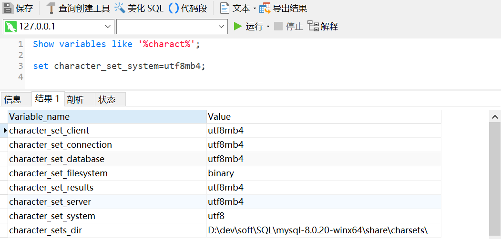

# 1 基本配置

[官方下载页](http://dev.mysql.com/)

## 1.1 安装MySQL

安装Mysql分为两种：安装版和绿色版，我们一般使用绿色版。

数据库系统是由数据库、DBMS（数据库管理系统）、应用系统、数据库管理员共同组成。

### 1.1.1 安装版

1、运行apt-get update命令以确保您的软件包列表是最新的。

root@ubuntuServer:~# apt-get update

2、安装mySQL服务

root@ubuntuServer:~#apt-get install mysql-server

3、安装Navicat数据库可视化工具

安装MySQL服务是否成功：打开Windows命令提示符, 执行命令: mysqld --install MySQL --defaults-file="my.ini

在 Windows 命令提示符下运行:

启动: net start MySQL

停止: net stop MySQL

卸载: sc delete MySQL

### 1.1.2 绿色版

直接在网上下载压缩包，解压后即可使用。

## 1.2 远程连接

1、默认mySQL只允许本地连接，需要更改配置文件。

root@ubuntuServer:~# vi /etc/mysql/my.cnf

注释掉红色部分。

2、打开MySQL数据库远程访问的权限

### 1.2.1 改表法

​     可能是你的帐号不允许从远程登陆，只能在localhost。这个时候只要在localhost的那台电脑，登入mysql后，更改 "mysql" 数据库里的 "user" 表里的 "host" 项，从"localhost"改称"%" 

mysql -u root -p 

mysql>use mysql; 

mysql>update user set host = '%' where user = 'root';

注意：mysql>update user set host = '%' where user ='root'; #修改host值（以通配符%的内容增加主机/IP地址，当然也可以直接增加某个特定IP地址，如果执行update语句时出现ERROR 1062 (23000): Duplicate entry '%-root' for key 'PRIMARY' 错误，需要**select host from user where user = 'root'**;

查看一下host是否已经有了%这个值，如果有了直接执行下面的flush privileges;即可）

mysql>flush privileges;  // 执行完update语句后**千万别忘了执行这句**，否则还是不允许远程连接

mysql>select host,user from user where user='root';

mysql>quit​                            

mysql>select host, user from user;

### 1.2.2 授权法 

在安装mysql的机器上运行： 

1、d:\mysql\bin\>mysql -h localhost -uroot -ppassw0rd

//这样应该可以进入MySQL服务器 

2、mysql>GRANT ALL PRIVILEGES ON *.* TO 'root'@'%'WITH GRANT OPTION 

赋予任何主机访问数据的权限 

例如，你想myuser使用mypassword从任何主机连接到mysql服务器的话。 

GRANT ALL PRIVILEGES ON *.* TO 'myuser'@'%'IDENTIFIED BY 'mypassword' WI 

TH GRANT OPTION; 

如果你想允许用户myuser从ip为192.168.1.6的主机连接到mysql服务器，并使用mypassword作为密码 

GRANT ALL PRIVILEGES ON *.* TO 'myuser'@'192.168.1.3'IDENTIFIED BY 

'mypassword' WITH GRANT OPTION; 

3、mysql>FLUSH PRIVILEGES 

//修改生效 

4、mysql>EXIT 

退出MySQL服务器，这样就可以在其它任何的主机上以root身份登录打开DOS之后在此输入 mysql -h你的IP或者花生壳的账户 -uroot -p该数据库的密码

例如：mysql –h 30.158.59.78 -uroot -pabc123

mysql –h tom.xicp.net -uroot -pabc123

**注意：本过程中设计的数据库是test,其中对应多张表！**

Goods表（商品表）、category表（栏目表）、boy表（男生表）、girl（女生表）、m表（比赛表）

## 1.3 认识SQL分类

SQL：是结构化查询语言（structured query language），是**what型语言**而非**how型语言**，Where后加的一般是**表达式（expr）**。

**数据操纵语言（DML）: insert, delete, update, select(使用者的角度80%)**

**数据定义语言（DDL）: create, alter, drop(建设者的角度,建库、建表、建视图15%)**

**数据控制语言（DCL）: grant, revoke(管理员的角度5%)**

**事务控制语言（TCL）: start transaction、commit、savepoint、rollback()**

# 2 DML基本语法

## 2.1 表与数据库的概念

MySQL为关系型数据库，定义表头(header)的过程： 每一列的名称；

列(row): 具有相同数据类型的数据的集合；

行(col): 每一行用来描述某个人/物的具体信息；

值(value): 行的具体信息, 每个值必须与该列的数据类型相同；

键(key): 表中用来识别某个特定的人\物的方法, 键的值在当前列中具有唯一性。

连接mysql数据库的服务：mysql –h localhost –uroot –proot

**告诉mysql服务器我用的是什么编码：Set names gbk;**

库（database）：多张表；表（table）：多行多列的数据；视图（view）：

创建数据库：create database if not exists dbName charset = utf8mb4;

删除数据库：drop database dbName;

修改数据库：alter datebase db_name charset = gbk;只能修改属性，但是**不能修改数据库名称**。

创建表和字段：create table if not exists tableName(字段名 字段属性,...,索引) 其他(引擎/字符集);

注：innodb是表引擎，也可以是myisam或其他，但最常用的是myisam和innodb，charset常用的有utf8、gbk、utf8mb4；

创建视图：create view if not exists viewName as select 列字段… from tableName;

删除数据库或表：drop database if exists dbName;drop table if exists tableName;

删除视图：drop view if exists viewName;

查看当前数据库服务下的库：Show databases;

进入你选择的库：use databaseName;

查看当前库中的表：show tables;

查看表的结构：desc tableName;

查看创建表的sql语句：show create table tableName;

清空表的数据（先删除表，再重新创建表）：**Truncate** tableName;

查看表的详细信息：Show table status；show table status \G；show table status where name='goods' \G；

更改表名：Rename table oldtable to newtable;

修改表：在表xs中增加“奖学金等级”列并将表中的“姓名”列删除。

mysql> use xscj

Database changed

mysql> alter table xs

​    -> add `奖学金等级` tinyint null,

​    -> drop column `姓名`;

Query OK, 0 rows affected (0.48 sec)

Records: 0  Duplicates: 0  Warnings: 0

复制表：Create table tab1_name **like** old_tab1_name;

假设存在一个表test，创建test表的一个名为test_copy的拷贝：create  table test_copy like test;

假设存在一个表test，创建test表的一个名为test_copy的拷贝，并且复制其内容：create table goods_copy as (select * from goods);

## 2.2 Insert操作(增)

insert：所有的行；insert：指定的行

查看表的结构：desc table;

语法1：**insert into** 表名(字段名, 字段名......) **values**(值, 值......);

语法2：insert into 表名 values(全部的值);

语法3：insert into 表名 values (1,22),(2,33),(3,44);，添加多行

例子：insert into users(userid, username, password) values(1, 'mysql', 'mysql');

**注意**：列和值要严格的对应！数字不需要加单引号，但是字符串**一定要**加单引号！

values和value的区别：应该在**插入单行**的时候使用VALUES，在**插入多行**的时候使用VALUE

## 2.3 Update操作(改)

Update：所有的行；Update：指定的行

更改操作：update 改哪张表？set 需要改哪几列的值？where 在哪些行生效？

语法1：**update** 表名 **set** 字段=值 **where** 字段=值;

语法2：update 表名 set 字段=值;(会更改所有的本列数据!**特别注意!**)

例子代码：update users set password = 'password' where userid = 1;

如：表t1和表t2都有两个字段id int(4),pwd char(4),其中id为主键。当表t1中id值与t2中的id值相同时，将表t1中对应的pwd值修改为“AAA”，t2中的pwd值改为”BBB”。

Update t1,t2 set t1.pwd=’AAA’,t2.pwd=’BBB’ where t1.id=t2.id; 

## 2.4 Delete操作(删)

思考：为什么不需要指定列？

Delete：所有的行

Delete：部分的行

Delete：指定的行

**删**除操作：你要删除哪张表的数据?你要删掉哪些行?

语法1：**delete from** 表名 **where** 字段=值；

语法2：**delete from** 表名；（会删除所有数据!**特别注意!**）

例子代码：delete from users where userid = 1;

## 2.5 Select操作(查)

Select:所有的行所有列

Select:部分的行

Select:指定的列

!查询哪张表的数据?你要选择哪些列来查询?要选择哪些行?

**查**询操作：

语法1：select ***** from 表名; 或者 select 字段名, 字段名.... from 表名

语法2：select ***** from 表名 where 字段=值;( Select:部分的行)

语法3：select **(****字段1,字段2……)** from 表名 where 字段=值;( Select:指定的列)

例子代码：select userid, username, password from users;

语法4：要替换查询结果中的数据，则要使用查询中的case表达式；

Select ... 

Case 

when条件1 then 表达式1

when条件2 then 表达式2

........

Else 表达式

End

From 表名

Where 条件;

 select 学号,姓名

 case

 when 总学分 is null the

 when 总学分< 50 then ‘

 when 总学分>=50 and ‘总

 else '优秀'

 end as 等级

 from xs

 where 专业名='计算机';

注意：查是DML中最重要的部分！

# 3 Select查询模型

## 3.1 认识where查询模型

```
（1）条件查询where 
    a、条件表达式的意义，表达式为真，则取出该行
    b、比较运算符  =、!=、< >、<=、>=
    c、like、not like('%'匹配任意多个字符，'_'匹配任意单个字符)、in、not in、between and
    d、is null、is not null                       
（2）分组group by（一般要配合5个聚合函数使用：max、min、sum、avg、count）
（3）筛选       having
（4）排序       order by
（5）限制       limit
```

 Select查询：Where、Group by、Having、Order by、Limit

1、列是**变量**，可以放入函数中（**大胆的把列看成变量，可以放入函数中**）

2、变量**可以计算**（sql>select name age+1 from user where 1;）

3、Where是**表达式**，值**为真取出来**（sql>select * from user where 1;）

投影运算：本有三列，但是取出来两列

广义投影：通过投影的数据进行运算操作得到的列。

注意：认识in、between和like两个运算符

In：代表的是在某**集合内(关键字：查询属于什么)**

Between：代表在某**范围**(a and b)，其中包含a,b

Like：模糊查询（%通配任意字符、_下划线匹配单一的字符）

As：将广义投影给一个新的变量

### 3.1.1 where查询练习

**告诉mysql服务器我用的是什么编码：Set names gbk;**

现有一张goods表：包括的字段有goods_id(主键)、goods_name、cat_id（栏目）、brand_id、goods_number、shop_price、market_price、click_count（点击量）

```sql
CREATE TABLE `goods` (
  `goods_id` mediumint unsigned NOT NULL AUTO_INCREMENT,
  `goods_name` varchar(120) NOT NULL DEFAULT '',
  `cat_id` smallint unsigned NOT NULL DEFAULT '0',
  `brand_id` smallint unsigned NOT NULL DEFAULT '0',
  `goods_sn` char(15) NOT NULL DEFAULT '',
  `goods_number` smallint unsigned NOT NULL DEFAULT '0',
  `shop_price` decimal(10,2) unsigned NOT NULL DEFAULT '0.00',
  `market_price` decimal(10,2) unsigned NOT NULL DEFAULT '0.00',
  `click_count` int unsigned NOT NULL DEFAULT '0',
  PRIMARY KEY (`goods_id`)
) ENGINE=MyISAM AUTO_INCREMENT=33 DEFAULT CHARSET=utf8;
```

基础查询 where的练习：查出满足以下条件的商品

1、主键为32的商品

mysql> select goods_id,goods_name,cat_id

​    -> from goods

​    -> where goods_id=32;

2、**不属**第3栏目的所有商品

mysql> select goods_id,goods_name,cat_id

​    -> from goods

-> where cat_id**!=**3;

!=可以使用<>替换。

3、本店价格**高于**3000元的商品

mysql> select goods_id,goods_name,shop_price

​    -> from goods

​    -> where shop_price>=3000;

4、本店价格**低于或等于**100元的商品

mysql> select goods_id,goods_name,shop_price

​    -> from goods

​    -> where shop_price<=100;

5、取出**第4栏目或第11栏目**的商品（不许用or）

mysql> select goods_id,goods_name,cat_id

​    -> from goods

​    -> where cat_id **in(4,11)**;

||单价与or

6、取出**属于**100<=价格<=500的商品（不许用and）

mysql> select goods_id,goods_name,cat_id,shop_price

​    -> from goods

​    -> where shop_price **between 100 and 500**;

&&单价与and

7、取出**不属于**第3栏目且不属于第11栏目的商品（and，或not in分别实现）

方法1：mysql> select goods_id,goods_name,cat_id

​    -> from goods

-> where cat_id **not in(3,11)**;

方法2：mysql> select goods_id,goods_name,cat_id

​    -> from goods

​    -> where cat_id!=3 and cat_id**!=**11;

not等价!

8、取出价格大于等于100且小于等于300，**或者**大于等于4000且小于等于5000的商品

mysql> select goods_id,goods_name,shop_price

​    -> from goods

​    -> where shop_price between 100 and 300

​    -> or

​    -> shop_price between 4000 and 5000;

9、取出第3个栏目下面价格<1000或>3000，**并且**点击量>5的系列商品

mysql> select goods_id,goods_name,cat_id,click_count,shop_price

​    -> from goods

​    -> where cat_id=3 and (shop_price<100 or shop_price>3000) and clicK_count>5;

and优先级大于or

10、取出第1个栏目下面的商品（注意：1栏目下面没商品，但其子栏目下有）

mysql> select goods_id,goods_name,cat_id

​    -> from goods

-> where cat_id **in**(2,3,4,5);

**注意：后面通过子查询来实现**

11、取出名字以"诺基亚"开头的商品

mysql> select goods_id,goods_name

​    -> from goods

-> where goods_name **like** '诺基亚%';

注意：**like后面没有等于号**

12、取出名字为"诺基亚Nxx"的手机

mysql> select goods_id,cat_id,goods_name,shop_price

​    -> from goods

​    -> where goods_name **like** '诺基亚n__';

13、取出名字不以"诺基亚"开头的商品

mysql> select goods_id,goods_name

​    -> from goods

​    -> where goods_name **not like** '诺基亚';

14、取出第3个栏目下面价格在1000到3000之间,并且点击量>5 "诺基亚"开头的系列商品

select goods_id,cat_id,goods_name,shop_price  from goods where 

cat_id=3 and shop_price>1000 and shop_price <3000 and click_count>5 and goods_name like '诺基亚%';

select goods_id,cat_id,goods_name,shop_price  from goods where 

shop_price between 1000 and 3000 and cat_id=3  and click_count>5 and goods_name like '诺基亚%';

### 3.1.2 面试题

1、有mian表和数组表中：floor向下取整，把num值处于[20,29]之间,改为20，num值处于[30,39]之间的改为30。

mysql> update mian set num = floor(num/10)*10
    -> where
    -> num between 20 and 39;

2、把good表中商品名为'诺基亚xxxx'的商品，改为'HTCxxxx'，提示：大胆的把列看成变量，参与运算，甚至调用函数来处理。

substring()字符串的截取函数

concat()字符串的拼接函数

mysql> select goods_id,concat('htc',substring(goods_name,4)),shop_price
    -> from goods
    -> where goods_name like '诺基亚%';

### 3.1.3 奇怪的null

Null = null还是null为假！

Null != null还是null为假！

Null + 1 = null！

专门用来查数据是null的语句：**Select \* from user where is null;**

## 3.2 Group by分组与统计函数

### 2.2.1 基本统计（聚合）函数

```properties
一、数学函数
abs(x)   返回x的绝对值
bin(x)   返回x的二进制（oct返回八进制，hex返回十六进制）
ceiling(x)   返回大于x的最小整数值
exp(x)   返回值e（自然对数的底）的x次方
floor(x)   返回小于x的最大整数值
greatest(x1,x2,...,xn)返回集合中最大的值
least(x1,x2,...,xn)      返回集合中最小的值
ln(x)                    返回x的自然对数
log(x,y)返回x的以y为底的对数
mod(x,y)                 返回x/y的模（余数）
pi()返回pi的值（圆周率）
rand()返回０到１内的随机值,可以通过提供一个参数(种子)使rand()随机数生成器生成一个指定的值。
round(x,y)返回参数x的四舍五入的有y位小数的值
sign(x) 返回代表数字x的符号的值
sqrt(x) 返回一个数的平方根
truncate(x,y)            返回数字x截短为y位小数的结果

二、聚合函数(常用于group by从句的select查询中)
avg(col)返回指定列的平均值
count(col)返回指定列中非null值的个数
min(col)返回指定列的最小值
max(col)返回指定列的最大值
sum(col)返回指定列的所有值之和
group_concat(col) 返回由属于一组的列值连接组合而成的结果

三、字符串函数
ascii(char)返回字符的ascii码值
bit_length(str)返回字符串的比特长度
concat(s1,s2...,sn)将s1,s2...,sn连接成字符串
concat_ws(sep,s1,s2...,sn)将s1,s2...,sn连接成字符串，并用sep字符间隔
instr(c,char)返回在某个文本域中指定字符的数值位置
insert(str,x,y,instr) 将字符串str从第x位置开始，y个字符长的子串替换为字符串instr，返回结果
find_in_set(str,list)分析逗号分隔的list列表，如果发现str，返回str在list中的位置
lcase(str)或lower(str) 返回将字符串str中所有字符改变为小写后的结果
left(str,x)返回字符串str中最左边的x个字符
length(s)返回字符串str中的字符数
ltrim(str) 从字符串str中切掉开头的空格
position(substr,str) 返回子串substr在字符串str中第一次出现的位置
quote(str) 用反斜杠转义str中的单引号
repeat(str,srchstr,rplcstr)返回字符串str重复x次的结果
reverse(str) 返回颠倒字符串str的结果
right(str,x) 返回字符串str中最右边的x个字符
rtrim(str) 返回字符串str尾部的空格
strcmp(s1,s2)比较字符串s1和s2
trim(str)去除字符串首部和尾部的所有空格
ucase(str)或upper(str) 返回将字符串str中所有字符转变为大写后的结果

四、日期和时间函数
curdate()或current_date() 返回当前的日期
curtime()或current_time() 返回当前的时间
date_add(date,interval int keyword)返回日期date加上间隔时间int的结果(int必须按照关键字进行格式化),如：select date_add(current_date,interval 6 month);
date_format(date,fmt)  依照指定的fmt格式格式化日期date值
date_sub(date,interval int keyword)返回日期date加上间隔时间int的结果(int必须按照关键字进行格式化),如：select date_sub(current_date,interval 6 month);
dayofweek(date)   返回date所代表的一星期中的第几天(1~7)
dayofmonth(date)  返回date是一个月的第几天(1~31)
dayofyear(date)   返回date是一年的第几天(1~366)
dayname(date)   返回date的星期名，如：select dayname(current_date);
from_unixtime(ts,fmt)  根据指定的fmt格式，格式化unix时间戳ts
hour(time)   返回time的小时值(0~23)
minute(time)   返回time的分钟值(0~59)
month(date)   返回date的月份值(1~12)
monthname(date)   返回date的月份名，如：select monthname(current_date);
now()    返回当前的日期和时间
quarter(date)   返回date在一年中的季度(1~4)，如select quarter(current_date);
week(date)   返回日期date为一年中第几周(0~53)
year(date)   返回日期date的年份(1000~9999)
一些示例：
获取当前系统时间：select from_unixtime(unix_timestamp());
select extract(year_month from current_date);
select extract(day_second from current_date);
select extract(hour_minute from current_date);
返回两个日期值之间的差值(月数)：select period_diff(200302,199802);
在mysql中计算年龄：
select date_format(from_days(to_days(now())-to_days(birthday)),'%y')+0 as age from employee;
这样，如果brithday是未来的年月日的话，计算结果为0。
下面的sql语句计算员工的绝对年龄，即当birthday是未来的日期时，将得到负值。
select date_format(now(), '%y') - date_format(birthday, '%y') -(date_format(now(), '00-%m-%d') <date_format(birthday, '00-%m-%d')) as age from employee

五、加密函数
aes_encrypt(str,key)  返回用密钥key对字符串str利用高级加密标准算法加密后的结果，调用aes_encrypt的结果是一个二进制字符串，以blob类型存储
aes_decrypt(str,key)  返回用密钥key对字符串str利用高级加密标准算法解密后的结果
decode(str,key)   使用key作为密钥解密加密字符串str
encrypt(str,salt)   使用unixcrypt()函数，用关键词salt(一个可以惟一确定口令的字符串，就像钥匙一样)加密字符串str
encode(str,key)   使用key作为密钥加密字符串str，调用encode()的结果是一个二进制字符串，它以blob类型存储
md5()    计算字符串str的md5校验和
password(str)   返回字符串str的加密版本，这个加密过程是不可逆转的，和unix密码加密过程使用不同的算法。
sha()    计算字符串str的安全散列算法(sha)校验和
示例：
select encrypt('root','salt');
select encode('xufeng','key');
select decode(encode('xufeng','key'),'key');#加解密放在一起
select aes_encrypt('root','key');
select aes_decrypt(aes_encrypt('root','key'),'key');
select md5('123456');
select sha('123456');

六、控制流函数
mysql有4个函数是用来进行条件操作的，这些函数可以实现sql的条件逻辑，允许开发者将一些应用程序业务逻辑转换到数据库后台。
mysql控制流函数：
case when[test1] then [result1]...else [default] end如果testn是真，则返回resultn，否则返回default
case [test] when[val1] then [result]...else [default]end  如果test和valn相等，则返回resultn，否则返回default
if(test,t,f)   如果test是真，返回t；否则返回f
ifnull(arg1,arg2) 如果arg1不是空，返回arg1，否则返回arg2
nullif(arg1,arg2) 如果arg1=arg2返回null；否则返回arg1
这些函数的第一个是ifnull()，它有两个参数，并且对第一个参数进行判断。如果第一个参数不是null，函数就会向调用者返回第一个参数；如果是null,将返回第二个参数。
如：select ifnull(1,2), ifnull(null,10),ifnull(4*null,'false');
nullif()函数将会检验提供的两个参数是否相等，如果相等，则返回null，如果不相等，就返回第一个参数。
如：select nullif(1,1),nullif('a','b'),nullif(2+3,4+1);
和许多脚本语言提供的if()函数一样，mysql的if()函数也可以建立一个简单的条件测试，这个函数有三个参数，第一个是要被判断的表达式，如果表达式为真，if()将会返回第二个参数，如果为假，if()将会返回第三个参数。
如：selectif(1<10,2,3),if(56>100,'true','false');
if()函数在只有两种可能结果时才适合使用。然而，在现实世界中，我们可能发现在条件测试中会需要多个分支。在这种情况下，mysql提供了case函数，它和php及perl语言的switch-case条件例程一样。
case函数的格式有些复杂，通常如下所示：
case [expression to be evaluated]
when [val 1] then [result 1]
when [val 2] then [result 2]
when [val 3] then [result 3]
......
when [val n] then [result n]
else [default result]
end
这里，第一个参数是要被判断的值或表达式，接下来的是一系列的when-then块，每一块的第一个参数指定要比较的值，如果为真，就返回结果。所有的when-then块将以else块结束，当end结束了所有外部的case块时，如果前面的每一个块都不匹配就会返回else块指定的默认结果。如果没有指定else块，而且所有的when-then比较都不是真，mysql将会返回null。
case函数还有另外一种句法，有时使用起来非常方便，如下：
case
when [conditional test 1] then [result 1]
when [conditional test 2] then [result 2]
else [default result]
end
这种条件下，返回的结果取决于相应的条件测试是否为真。
示例：
mysql>select case 'green'
     when 'red' then 'stop'
     when 'green' then 'go' end;
select case 9 when 1 then 'a' when 2 then 'b' else 'n/a' end;
select case when (2+2)=4 then 'ok' when(2+2)<>4 then 'not ok' end asstatus;
select name,if((isactive = 1),'已激活','未激活') as result fromuserlogininfo;
select fname,lname,(math+sci+lit) as total,
case when (math+sci+lit) < 50 then 'd'
when (math+sci+lit) between 50 and 150 then 'c'
when (math+sci+lit) between 151 and 250 then 'b'
else 'a' end
as grade from marks;
select if(encrypt('sue','ts')=upass,'allow','deny') as loginresultfrom users where uname = 'sue';#一个登陆验证

七、格式化函数
date_format(date,fmt)  依照字符串fmt格式化日期date值
format(x,y)   把x格式化为以逗号隔开的数字序列，y是结果的小数位数
inet_aton(ip)   返回ip地址的数字表示
inet_ntoa(num)   返回数字所代表的ip地址
time_format(time,fmt)  依照字符串fmt格式化时间time值
其中最简单的是format()函数，它可以把大的数值格式化为以逗号间隔的易读的序列。
示例：
select format(34234.34323432,3);
select date_format(now(),'%w,%d %m %y %r');
select date_format(now(),'%y-%m-%d');
select date_format(19990330,'%y-%m-%d');
select date_format(now(),'%h:%i %p');
select inet_aton('10.122.89.47');
select inet_ntoa(175790383);

八、类型转化函数
为了进行数据类型转化，mysql提供了cast()函数，它可以把一个值转化为指定的数据类型。类型有：binary,char,date,time,datetime,signed,unsigned
示例：
select cast(now() as signed integer),curdate()+0;
select 'f'=binary 'f','f'=cast('f' as binary);

九、系统信息函数
database()   返回当前数据库名
benchmark(count,expr)  将表达式expr重复运行count次
connection_id()   返回当前客户的连接id
found_rows()   返回最后一个select查询进行检索的总行数
user()或system_user()  返回当前登陆用户名
version()   返回mysql服务器的版本
示例：
select database(),version(),user();
selectbenchmark(9999999,log(rand()*pi()));#该例中,mysql计算log(rand()*pi())表达式9999999次。
```

1、查出最贵的商品的价格
mysql> select max(shop_price)
    -> from goods;
2、查出最大(最新)的商品编号
mysql> select max(goods_id)
    -> from goods;
3、查出最便宜的商品的价格
mysql> select min(shop_price)
    -> from goods;
4、查出最旧(最小)的商品编号
mysql> select min(goods_id)
    -> from goods;
5:查询该店所有商品的库存总量
mysql> select sum(goods_number)
    -> from goods;
6:查询所有商品的平均价
mysql> select avg(shop_price)
    -> from goods;
7:查询该店一共有多少种商品
mysql> select count(*)
    -> from goods;

### 3.2.2 Group分组统计的语法

1、按照栏目统计出商品的平均价格？

mysql> select goods_id,goods_name,cat_id,avg(shop_price)

​    -> from goods

​    -> group by cat_id;

**原理：先按照cat_id进行排序，在进行挨个统计，操作浪费资源！**

2、查看每个栏目下商品的数量？

mysql> select goods_id,goods_name,cat_id,shop_price,**count(\*)**

​    -> from goods

​    -> group by cat_id;

3、查看每个栏目下最贵的商品价格？

mysql>select goods_id,goods_name,shop_price,max(shop_price),min(shop_price)

​    -> from goods

​    -> group by cat_id;

注意：Select **goods_id** cat_id count(*) from goods **group by** cat_id;

**语义上是不正确**的，但是在mysql中可以取到！MySQL8中直接不通过，报错。

### 3.2.3 分组查询练习group by

查询**每个栏目**下面

最贵商品价格

最低商品价格

商品平均价格

商品库存量

商品种类

提示:(5个聚合函数,sum,avg,max,min,count与group综合运用)

select cat_id,max(shop_price) from ecs_goods  group by cat_id;

## 3.3 Having筛选

### 3.3.1 As关键字

as关键字是可以省略的，但是为了用户的可读性，最好都不要省略。

### 3.3.2 having与group by

掌握having查询，同时区分它与where的区别？**磁盘原始数据**  **内存中的结果集！**

Where：针对的是磁盘上的数据文件发挥作用的。

1、查询该goods店中，本店价格比市场价格所节省的价格？

mysql> select market_price,shop_price,market_price-shop_price

-> from goods;

2、查询每个商品所积压的货款(提示:库存*单价)

mysql> select goods_number,shop_price,goods_number*shop_price

​    -> from goods;

3、查询该店积压的总货款
mysql> select sum(goods_number*shop_price)
    -> from goods;
4、查询该店每个栏目下面积压的货款。
mysql> select cat_id,sum(goods_number*shop_price) as k
    -> from goods
-> group by cat_id;
5、查询比市场价省钱200元以上的商品及该商品所省的钱(where和having分别实现)

方式1：mysql> select market_price,shop_price,market_price-shop_price

​    -> from goods

-> where (market_price-shop_price)>20;

缺点：不优化，计算了两次！

方式2：mysql> select market_price,shop_price,(market_price-shop_price) **as sheng**

​    -> from goods

​    -> where sheng>20;

ERROR 1054 (42S22): Unknown column 'sheng' in 'where clause'注意：会报错

方式3：mysql> select market_price,shop_price,(market_price-shop_price) as sheng

-> from goods

-> where 1

-> **having** sheng>20;

注意：方式2与方式3的区别！having必须放在where的后面！

6、查询积压货款超过2W元的栏目,以及该栏目积压的货款

mysql> select cat_id,sum(goods_number*shop_price) as s

​    -> from goods

​    -> group by cat_id

​    -> having s>20000;

7、重复数据条数

select cat_id,count(1) from goods group by cat_id having count(1)>1;

## 3.4 Order by排序

### 3.4.1基本语法

升序排列：asc（默认的）。

降序排列：desc，也可以使用desc查看表的结构。

多列排序：直接在后面加排序的列，用**逗号隔开**！

## 3.5 Limit限制取出条目

### 3.5.1 语法

语法：limit（偏移量，限制条目），使用的时候不需要加括号！

注意：当偏移量为0时，可以省略偏移量！

### 3.5.2 练习题

1、在test数据库中的goods表中按照shop_price进行**升序**排序？

mysql> select goods_id,goods_name,shop_price

​    -> from goods

​    -> order by shop_price asc;

注意：默认是升序排列！asc可以省略，但是最后写上，移植性好！

2、在test数据库中的goods表中按照shop_price进行**降序**排序？

mysql> select goods_id,goods_name,shop_price

​    -> from goods

​    -> order by shop_price **desc**;

3、通过一个字段不能够确定顺序的情况？ 

mysql> select goods_name,cat_id,shop_price

​    -> from goods

​    -> order by shop_price asc,cat_id desc;

Like查询

### 3.5.3 Regexp运算符

查询姓李的同学的学号，姓名和专业名。

mysql> select 学号,姓名,专业名 from xs where 姓名 regexp '李';

查询学号里包含4,5,6的学生学号，姓名和专业名。

mysql> select 学号,姓名,专业名 from xs where 学号 regexp '[4,5,6]';

查询学号以08开头，以01结尾的学生学号，姓名和专业名。

mysql> select 学号,姓名,专业名 from xs where 学号 regexp '^08.*01$';

### 3.5.4 order by与limit查询

1、按价格由高到低排序

mysql> select goods_id,goods_name,shop_price

​    -> from goods

​    -> order by shop_price desc;

2、接栏目由低到高排序,栏目内部按价格由高到低排序

mysql> select goods_id,cat_id,goods_name,shop_price

​    -> from goods

-> order by cat_id asc,shop_price desc; 

3、取出价格最高的前三名商品

mysql> select goods_id,goods_name,shop_price

​    -> from goods

​    -> order by shop_price desc **limit 3;**

4、取出点击量前3名到前5名的商品

分析：第N名到第M名的商品

mysql> select goods_id,goods_name,click_count

​    -> from goods

​    -> order by click_count desc **limit 2,3;**

### 3.5.5 where-having-group

Where-having-group综合

Test数据库中现有一张result表：

| Name | subject | score |
| ---- | ------- | ----- |
| 张三 | 数学    | 90    |
| 张三 | 语文    | 50    |
| 张三 | 地理    | 30    |
| 李四 | 政治    | 45    |
| 李四 | 语文    | 55    |
| 王五 | Java    | 60    |
| 王五 | 历史    | 80    |

问题：查询两门及两门以上不合格者的平均成绩？

```
有如下表及数据
+------+---------+-------+
| name | subject | score |
+------+---------+-------+
| 张三 | 数学    |    90 |
| 张三 | 语文    |    50 |
| 张三 | 地理    |    40 |
| 李四 | 语文    |    55 |
| 李四 | 政治    |    45 |
| 王五 | 政治    |    30 |
+------+---------+-------+
 
要求:查询出2门及2门以上不及格者的平均成绩
 
## 一种错误做法
mysql> select name,count(score<60) as k,avg(score) from stu group by name having k>=2;
 
+------+---+------------+
| name | k | avg(score) |
+------+---+------------+
| 张三     | 3 |    60.0000 |
| 李四     | 2 |    50.0000 |
+------+---+------------+
2 rows in set (0.00 sec)
 
mysql> select name,count(score<60) as k,avg(score) from stu group by name;
+------+---+------------+
| name | k | avg(score) |
+------+---+------------+
| 张三     | 3 |    60.0000 |
| 李四     | 2 |    50.0000 |
| 王五     | 1 |    30.0000 |
+------+---+------------+
3 rows in set (0.00 sec)
 
mysql> select name,count(score<60) as k,avg(score) from stu group by name having k>=2;
+------+---+------------+
| name | k | avg(score) |
+------+---+------------+
| 张三     | 3 |    60.0000 |
| 李四     | 2 |    50.0000 |
+------+---+------------+
2 rows in set (0.00 sec)
 
#加上赵六后错误暴露
mysql> insert into stu 
    -> values 
    -> ('赵六','A',100),
    -> ('赵六','B',99),
    -> ('赵六','C',98);
Query OK, 3 rows affected (0.05 sec)
Records: 3  Duplicates: 0  Warnings: 0
 
#错误显现
mysql> select name,count(score<60) as k,avg(score) from stu group by name having k>=2;
+------+---+------------+
| name | k | avg(score) |
+------+---+------------+
| 张三 | 3 |    60.0000 |
| 李四 | 2 |    50.0000 |
| 赵六 | 3 |    99.0000 |
+------+---+------------+
3 rows in set (0.00 sec)
 
#正确思路,先查看每个人的平均成绩
mysql> select name,avg(score) from stu group by name;
+------+------------+
| name | avg(score) |
+------+------------+
| 张三 |    60.0000 |
| 李四 |    50.0000 |
| 王五 |    30.0000 |
| 赵六 |    99.0000 |
+------+------------+
4 rows in set (0.00 sec)
 
mysql> # 看每个人挂科情况
mysql> select name,score < 60 from stu;
+------+------------+
| name | score < 60 |
+------+------------+
| 张三 |          0 |
| 张三 |          1 |
| 张三 |          1 |
| 李四 |          1 |
| 李四 |          1 |
| 王五 |          1 |
| 赵六 |          0 |
| 赵六 |          0 |
| 赵六 |          0 |
+------+------------+
9 rows in set (0.00 sec)
 
mysql> #计算每个人的挂科科目
mysql> select name,sum(score < 60) from stu group by name;
+------+-----------------+
| name | sum(score < 60) |
+------+-----------------+
| 张三 |               2 |
| 李四 |               2 |
| 王五 |               1 |
| 赵六 |               0 |
+------+-----------------+
4 rows in set (0.00 sec)
 
#同时计算每人的平均分
mysql> select name,sum(score < 60),avg(score) as pj from stu group by name;
+------+-----------------+---------+
| name | sum(score < 60) | pj      |
+------+-----------------+---------+
| 张三 |               2 | 60.0000 |
| 李四 |               2 | 50.0000 |
| 王五 |               1 | 30.0000 |
| 赵六 |               0 | 99.0000 |
+------+-----------------+---------+
4 rows in set (0.00 sec)
 
#利用having筛选挂科2门以上的.
mysql> select name,sum(score < 60) as gk ,avg(score) as pj from stu group by name having gk >=2; 
+------+------+---------+
| name | gk   | pj      |
+------+------+---------+
| 张三 |    2 | 60.0000 |
| 李四 |    2 | 50.0000 |
+------+------+---------+
2 rows in set (0.00 sec)
```

# 4 子查询

## 4.1 子句的查询陷阱

5种子句是有严格的顺序：where、group by、having、order by、limit，**注意：可以选用一个或多个使用，但是必须按照顺序！**

```
问题1：查询每个栏目下的最新产品（goods_id最大的为最新）
问题2：查询出编号goods_id为19的商品的栏目名称(用左连接查询和子查询分别)
连接查询：select goods_id,g.cat_id,goods_name,cat_name from goods as g left join category c on g.cat_id=c.cat_id where goods_id = 19;
子查询：select * from category where cat_id = (select cat_id from goods where goods_id = 19);
```

## 4.2 where型的子查询

内层的查询结果作为外层sql的比较**条件**！

```properties
# 在test库中的goods表中，找出最新的商品？（cat_id最大是最新，不使用排序）
mysql> select goods_id,goods_name
    -> from goods
    -> where goods_id=(select max(goods_id) from goods);
# 用where型子查询把goods表中的每个栏目下面最新的商品取出来
mysql> select goods_id,goods_name,cat_id
    -> from goods
    -> where goods_id in(select max(goods_id) from goods group by cat_id);
```

## 4.3 from型的子查询

概念：就是把子查询的结果**作为一个表**，供你的外边的查询语句使用，这个你所指的子查询里面所有的查询结果字段就是你外面SELECT的范围。FROM后边的都是表名，你不要当成这个是子查询，只把这当成一张表就好了。只不过这个表的数据不是你平时理解的那种固定的表，而是通过一个查询来构建出来的。这个表的数据就是这个查询查出来的结果。

```properties
# 用from型子查询把goods表中的每个栏目下面最新的商品取出来
mysql> select *
    -> from (select * from goods order by cat_id asc, goods_id desc) as t
    -> group by cat_id;
```

## 4.3 exists型的子查询

使用 exists 关键字引入子查询后，子查询的作用就相当于进行**存在测试**。外部查询的 where子句测试子查询返回的行是否存在。子查询实际上不产生任何数据，它只返回ture或false值，可以通过in代替！

```properties
# 用exists型子查询，查出所有有商品的栏目
mysql> select *
    -> from category
    -> where exists (select * from goods where goods.cat_id=category.cat_id); 
```

## 4.4 比较子查询

子查询一共返回了3个结果，我们没有指定是大于这3个结果中的哪一个，那么这就要涉及到另外几个关键字。他们分别是ANY、SOM、ALL，也就是说如果你的子查询在返回多个结果的时候，可以使用ANY、SOME或ALL来做修饰。其中ANY和SOME 是等价的，就是说只要符合其中一个就行，而ALL是要符合全部。

1、查找商品表中比所有13号栏目的商品ID都大的商品

select * from goods where goods_id > all (select goods_id from goods where cat_id =13 );

## 4.5 Select子查询

从student表中查找所有男同胞的姓名，学号，以及与s001号学生的年龄差距。

select sname,sno,sage-(select sage from student where sno = 's001') as cha from student where ssex='男';

# 5 连接查询

## 5.1 基本的语法

inner join ... on、left join ... on、right join ... on

## 5.2 1+N问题

本来一个语句的事情，却写成两个，通过for循环进行实现！！！

# 6 连接查询操作

Select xxxx from

Table1 连接查询的类型 table2 on table1xx=table2xx;

## 6.1 内连接

取两张表的交集！

注释：INNER JOIN 与 JOIN 是相同的。

进行两张表中的人员配对？（boy表和gril表）

mysql> select boy.hid,boy.bname,girl.hid,girl.gname

​    -> from

​    -> boy inner join girl on boy.hid=girl.hid;

## 6.2 左连接

以右边的表为主要的查询，左边进行配对，没有的补null

mysql> select boy.hid,boy.bname,girl.hid,girl.gname

​    -> from

​    -> boy **left join** girl **on** boy.hid=girl.hid;

**当代码打错的时候使用：\c**

mysql> select * from t

​         -> **\c**（作用是返回到重新输入sql命令）

**注意：左连接和右连接，永远是以左表为准！**

## 6.3 右连接

以左边的数据为主进行查询，右表进行配对，没有的补null。

进行两张表中的人员配对？（boy表和gril表）

mysql> select boy.hid,boy.bn  ame,girl.hid,girl.gname

​    -> from

​    -> boy **right join** girl **on** boy.hid=girl.hid;

注：boy在girl的右边，即girl在左边！则girl全部输出，而没有匹配的boy补null。

## 6.4 左外连接

（右外连接right outer join）

select * from girl left outer join boy on girl.hid=boy.hid;

select * from girl right outer join boy on girl.hid=boy.hid;

## 6.5 外连接

取两张表的并集！

在mysql中不存在外连接的。

## 6.6 多表关联

两表关联：


三表关联：


## 6.7 多表删除

假设存在三个表t1,t2,t3，它们都含有id列。要删除t1中id值等于t2的id值的所有行和t2中id值等于t3的id值的所有行。

Delete t1,t2 from t1,t2,t3 where t1.id=t2.id and t2.id=t3.id;

或

Delete from t1,t2 using t1,t2,t3 where t1.id=t2.id and t2.id=t3.id;

## 6.8 连接查询练习

连接查询

1、取出所有**商品**的商品名,栏目名,价格

mysql> select goods_name,cat_name,shop_price

​    -> from

​    -> goods left join category on goods.cat_id=category.cat_id;

2、取出第4个栏目下的商品的商品名,栏目名,价格

mysql> select goods_name,cat_name,shop_price

​    -> from

​    -> goods left join category on goods.cat_id=category.cat_id

​    -> where goods.cat_id=4;

3、取出第4个栏目下的商品的商品名,栏目名,与品牌名

select goods_name,cat_name,brand_name from 

goods left join category

on goods.cat_id=category.cat_id

left join brand 

on goods.brand_id=brand.brand_id

where goods.cat_id = 4;

4、用友面试题

根据给出的表结构按要求写出SQL语句。

Match 赛程表

| 字段名称    | 字段类型    | 描述                |
| ----------- | ----------- | ------------------- |
| matchID     | int         | 主键                |
| hostTeamID  | int         | 主队的ID            |
| guestTeamID | int         | 客队的ID            |
| matchResult | varchar(20) | 比赛结果，如（2:0） |
| matchTime   | date        | 比赛开始时间        |


Team 参赛队伍表

| 字段名称 | 字段类型    | 描述     |
| -------- | ----------- | -------- |
| teamID   | int         | 主键     |
| teamName | varchar(20) | 队伍名称 |

  

Match的hostTeamID与guestTeamID都与Team中的teamID关联

查出 2006-6-1 到2006-7-1之间举行的所有比赛，并且用以下形式列出：

拜仁  2：0 不来梅 2006-6-21

 

mysql> select * from m;

+-----+------+------+------+------------+

| mid | hid  | gid  | mres | matime     |

+-----+------+------+------+------------+

|   1 |    1 |    2 | 2:0  | 2006-05-21 |

|   2 |    2 |    3 | 1:2  | 2006-06-21 |

|   3 |    3 |    1 | 2:5  | 2006-06-25 |

|   4 |    2 |    1 | 3:2  | 2006-07-21 |

+-----+------+------+------+------------+

4 rows in set (0.00 sec)

 

mysql> select * from t;

+------+----------+

| tid  | tname    |

+------+----------+

|    1 | 国安     |

|    2 | 申花     |

|    3 | 公益联队 |

+------+----------+

3 rows in set (0.00 sec)

 

mysql> select hid,t1.tname as hname ,mres,gid,t2.tname as gname,matime

​    -> from 

​    -> m left join t as t1

​    -> on m.hid = t1.tid

​    -> left join t as t2

​    -> on m.gid = t2.tid;

+------+----------+------+------+----------+------------+

| hid  | hname    | mres | gid  | gname    | matime     |

+------+----------+------+------+----------+------------+

|    1 | 国安     | 2:0  |    2 | 申花     | 2006-05-21 |

|    2 | 申花     | 1:2  |    3 | 公益联队 | 2006-06-21 |

|    3 | 公益联队 | 2:5  |    1 | 国安     | 2006-06-25 |

|    2 | 申花     | 3:2  |    1 | 国安     | 2006-07-21 |

+------+----------+------+------+----------+------------+

4 rows in set (0.00 sec)

# 7 Union查询

## 7.1 union的使用

Union的查询就是将两个或者多个sql的查询结果进行**合并**

Sql1语句返回N行

Sql2语句返回M行

则sql1 **union** sql2语句返回的是N+M行

1、必须满足的条件是：各语句取出的**列必须是相同**的，列的名称不需要一定一样，列名会以第条sql语句名称为准！

2、完全相等的行会进行合并！**比较消耗资源**

## 7.2 union all的使用

解决合并的问题

讨论：union all的**子句**中不需要使用order by，因为SQL合并后可以使用order by，子句是失去意义。

## 7.3 union练习题

```properties
1:把ecs_comment,ecs_feedback两个表中的数据,各取出4列,并把结果集union成一个结果集.
 
2:3期学员碰到的一道面试题
A表:
+------+------+
| id   | num  |
+------+------+
| a    |    5 |
| b    |   10 |
| c    |   15 |
| d    |   10 |
+------+------+
 
B表:
+------+------+
| id   | num  |
+------+------+
| b    |    5 |
| c    |   15 |
| d    |   20 |
| e    |   99 |
+------+------+
 
 
要求查询出以下效果:
+------+----------+
| id   |    num   |
+------+----------+
| a    |        5 |
| b    |       15 |
| c    |       30 |
| d    |       30 |
| e    |       99 |
+------+----------+
 
create table a (
id char(1),
num int
)engine myisam charset utf8;
 
insert into a values ('a',5),('b',10),('c',15),('d',10);
 
create table b (
id char(1),
num int
)engine myisam charset utf8;
 
insert into b values ('b',5),('c',15),('d',20),('e',99);
方式1：把完全一样的进行了合并
mysql> select * from a
    -> union
    -> select * from b;
方式2：
mysql> # 完全一样的同样显示出来
mysql> select * from ta 
    -> union all
    -> select * from tb;
+------+------+
| id   | num  |
+------+------+
| a    |    5 |
| b    |   10 |
| c    |   15 |
| d    |   10 |
| b    |    5 |
| c    |   15 |
| d    |   20 |
| e    |   99 |
+------+------+
 
参考答案:
mysql> # sum,group求和
mysql> select id,sum(num) from (select * from ta union all select * from tb) as tmp group by id; 
+------+----------+
| id   | sum(num) |
+------+----------+
| a    |        5 |
| b    |       15 |
| c    |       30 |
| d    |       30 |
| e    |       99 |
+------+----------+
5 rows in set (0.00 sec)
```

# 8 DDL的基本语法

## 8.1 创建表

问题：创建表的过程就是**声明表头的过程**。

建表的过程中，就是**添加表头的过程**，列名称是什么？什么类型的列？列给的属性是什么？注释信息是什么？

数据类型的认识？MySQL数据库中提供了整数类型、浮点数类型、定点数类型、日期和时间类型、字符串类型。

格式：

create tabel tableName (

​	列1 列类型[类属性 默认值],

​	列1 列类型[类属性 默认值]

) engine = 存储引擎  default charset = 字符集;

```mysql
-- drop table if exists tb_info;
create table tb_info(
	id int (11) not null auto_increment comment '主键id',
	info_name varchar (50) not null default '' comment '名称',
	create_time datetime not null default '1000-01-01 00:00:00' comment '创建时间',
	del_flag tinyint(1) not null default -1 comment '0-停止，1-运行',
	index(info_name),
	primary key (id)
)engine=innodb default charset=utf8mb4 comment '创建表信息';
```

## 8.2 表的复制

Create table tab1_name **like** old_tab1_name;

假设存在一个表test，创建test表的一个名为test_copy的拷贝

create  table test_copy **like** test;

假设存在一个表test，创建test表的一个名为test_copy的拷贝，并且复制其内容；

create table goods_copy **as** (select * from goods);

## 8.3 整形列

### 8.3.1 类型包括

整数类型包括：tinyint(1)、smallint(2)、mediumint(3)、int(4)、integer(4)、bigint(8)

不同的整数类型所占的字节数不同，取值的范围也不同。

其中TINYINT取值范围最小，BIGINT取值范围最大，最常用的整数类型是INT。

上面六种整数类型所占字节数分别为1字节、2字节、3字节、4字节、4字节、8字节。

### 8.3.2 可选参数

alter table tb_number add num01 tinyint unsigned;

**Unsigned**：无符号的意思！默认是有符号的！

**Zerofill**：适合学号、编码等，固定宽带的数字，可以用0填充来固定宽度

Zerofill的填充宽度是由**M**属性决定的！默认的决定列是unsigned属性。

在原有的基础上添加列使用alter！！！

mysql> **alter** table t1 **add** sn tinyint(M) zerofill;

## 8.4 浮点列

浮点数包括，float和double两种类型。

其中float占4字节，double占8字节。

在选择使用哪种数据类型的时候，可以根据需要存储的小数数据的小数位数来判断，如果需要精确到小数后10位以上的时候，选用DOUBLE类型，否则可以使用FLOAT类型。

浮点类型：FLOAT、DOUBLE存在精度的损失。

定点类型：decimal更加的精确。

float(M,D)：M代表的是精度，D代表小数点后面的位数，有精度丢失问题。

double(M,D)：有进度丢失问题

decimail(M,D)：定点类型，更精确

## 8.5 定点列

dec、decimail类型。当要求小数数据精度非常高的时候，则可以选择dec和decimail类型，他们的精度比DOUBLE类型还要高。

定点类型：**DECIMAL**。

## 8.6 字符串类型

char、varchar、text这三个经常使用

BINARY、VARBINARY、BLOB、ENUM和SET。

### 8.6.1 char

对比结果可以看到，CHAR(4) 定义了**固定长度**为4的列，不管存入的数据长度为多少，所占用的空间均为4个字节。

优点是便于寻址，效率更快！！！

### 8.6.2 varchar

varchar(4)定义的列所占的字节数为**实际长度加1**。

char型如果不够M个**字符**内部用空格补齐取岀时再把**右侧空格删掉**，注这薏味看如果右侧本身有空格将会丢失。

```properties
列             实存字符i          实占空间            利用率
char(M)        0<=i<=M          M                  i/m<=100%
varchar(M)     0<=i<=M          i+1,2              i/i+1/2<100%
```

注意：char(M)限制的是**字符，不是字节**，即char(2) charset=utf8，能存2个utf8字符。MySQL之前推出的utf8字符集中，一个汉字占**3个字节**，新的utf8mb4字符集中一个汉字占**4个字节**。

验证：

## 8.7 日期和时间类型

year(一个字节)、date、time、datetime、timestamp。

MySQL中有多种表示日期和时间的类型。

YEAR表示年：[00-69]：+2000、[70-99]：+1900

date表示年月日

time表示时分秒

datetime表示年月日时分秒

TIMESTAMP经常插入或更新日期时使用（**时间戳**）

例如：在SQL查询窗口中输入查询语

```
year       YYYY 范围:1901~2155. 可输入值2位和4位(如98,2012)
date       YYYY-MM-DD 如:2010-03-14
time       HH:MM:SS    如:19:26:32
datetime   YYYY-MM-DD  HH:MM:SS 如:2010-03-14 19:26:32
timestamp  YYYY-MM-DD  HH:MM:SS 特性:不用赋值,该列会为自己赋当前的具体时间 
```

## 8.8 Text和blob

BLOB：是二进制类型，用来存放图像、音频等二进制的信息

**意义：**为了防止字符集的问题而引起数据的丢失

## 8.9 枚举类型

Enum：检举型，是定义好值就在某几个值的范围内**选其一**！

gender enum('男','女');

Set：集合型，是定义好值就在某几个值的范围内**选其多个**！

# 9 列的默认值

## 9.1 默认值null

1、Null的查询不方便

2、Null的效率不是很高

实际应用中，要避免null的默认值，如何进行避免：声明列为**not null default** **默认值**。

# 10 主键

## 10.1 自增主键

主键：primary key（auto_increment（递增））

是能过区分没有行的列！

注意：一张表**只能有一个**auto_increment，而且此列**必须加索引**（index）

# 11 建表练习

建表案例：建立社交网站的数据表

**优化的一种：定长与变长分离！常用列与不常用列分离！**

| 主键 | 用户名   | 性别   | 体重   | 生日  | 薪水   | 最后登录  | 个人简介 |
| ---- | -------- | ------ | ------ | ----- | ------ | --------- | -------- |
| Id   | Username | gender | weight | brith | salary | lastlogin | intro    |

 

| 列名称    | 列类型               | 默认值 | 是否是主键 |
| --------- | -------------------- | ------ | ---------- |
| Id        | Int   unsigned       |        | PRI        |
| Username  | Varchar(20)          |        |            |
| gender    | Char(1)/tinyint/enum |        |            |
| weight    | Tinyint   unsigned   |        |            |
| brith     | date                 |        |            |
| salary    | Decimal(8,2)         |        |            |
| lastLogin | datetime             |        |            |
| intro     | Varchar(1500)        |        |            |

进行进一步的优化操作：如果表中的列都是定长的，可以大大的提高查询的速度！

改进1：Varchar(20)改成char(20),会造成磁盘空间的浪费，但是可以提高速度值！

| 列名称    | 列类型               | 默认值 | 是否是主键 |
| --------- | -------------------- | ------ | ---------- |
| Id        | Int   unsigned       |        | PRI        |
| Username  | **char(20)**         |        |            |
| gender    | Char(1)/tinyint/enum |        |            |
| weight    | Tinyint   unsigned   |        |            |
| brith     | date                 |        |            |
| salary    | Decimal(8,2)         |        |            |
| lastLogin | **Int   unsigned**   |        |            |

改进2：单独摘除intro到另一张表中：

| 列名称   | 列类型         | 默认值 | 是否是主键 |
| -------- | -------------- | ------ | ---------- |
| Id       | Int   unsigned |        | PRI        |
| Username | Varchar(20)    |        |            |
| intro    | Varchar(1500)  |        |            |

## 11.1建表案例

mysql> CREATE TABLE `form` (

​    ->   `id` varchar(36) NOT NULL,

​    ->   `form_name` varchar(100) default NULL COMMENT '表单名称',

​    ->   `form_desc` varchar(200) default NULL COMMENT '表单描述',

​    ->   `form_style_id` varchar(36) default NULL COMMENT '模板样式',

​    ->   `form_content` longtext COMMENT '表单编辑器文本',

​    ->   `create_name` varchar(50) default NULL COMMENT '创建人名称',

​    ->   `create_by` varchar(50) default NULL COMMENT '创建人登录名称',

​    ->   `create_date` datetime default NULL COMMENT '创建日期',

​    ->   `update_by` varchar(50) default NULL COMMENT '更新人登录名称',

​    ->   `update_date` datetime default NULL COMMENT '更新日期',

​    ->   `sys_org_code` varchar(50) default NULL COMMENT '所属部门',

​    ->   `sys_company_code` varchar(50) default NULL COMMENT '所属公司',

​    ->   `form_parse` longtext,

​    ->   `main_table_source` varchar(50) default NULL COMMENT '主数据源',

​    ->   `update_name` varchar(50) default NULL COMMENT '更新人名称',

​    ->   PRIMARY KEY  (`id`),

​    ->   UNIQUE KEY `form_name` (`form_name`)

​    -> ) engine=InnoDB DEFAULT CHARSET=utf8;

# 12 列操作

更改表名：rename table table1Name to table2Name; 

## 12.1 添加表中列

Alter table tableName **add** 列名 列属性；  默认放在最后

mysql> alter table t_admin

​    -> **add**

​    -> age int(4);

Alter table tableName **add** 列名 列属性 **after** 列名（指定列名的后面）；

mysql> alter table t_admin

​    -> **add**

​    -> age int(4) **after** name;

## 12.2 删除表中列

Alter table tableName **drop column** 列名；column可以省略。

mysql> alter table t_admin

​    -> **drop**

​    -> age;

## 12.3 更改表中列

Alter table tableName **change** 原列名 新列名 列的新属性；

可以使用modify进行更改，但是只能更改属性，不能更改列名

Alter table tableName **modify** 列名 新属性；

# 13 视图(view)

## 13.1 概念

View：又称为虚拟表，是sql语句查询的结果。

## 13.2 语法

Create **view viewName as select** 列名…… from tableName;

例子：

mysql > create view viewName

​    -> as

​    -> select goods_id,goods_name,cat_id

​    -> from

​    -> goods;

mysql > select * from viewname;

## 13.3 视图的作用

1、权限控制的作用，比如某些列允许用户查看，有些列不允许用户查看

2、简化复杂的查询

## 13.4 能不能更新和修改删除

**物理视图**和**虚拟视图**的区别！

1、完全可逆函数，如果视图上的每一列都和物理表是一一对应的物理视图改变，虚拟视图也改变！虚拟视图也改变，物理视图改变！view的列，如果物理表上的**列经过多行列计算得到的**，那么不能改变！函数的关系（一对一关系）

## 13.5 View的Algorithm

视图储存的都是sql语句，两种方式？

1、algorithm=merge（建视图view的简单语句，直接对view查询条件进行合并）

2、algorithm=temptable（建视图view的复杂语句，先内存形成的临时表，然后去临时表查）

## 13.6 基本的语法结构

方式1：create algorithm=merge view v1 as select goods_id,goods_name from goods;

方式2：create algorithm=temptable view v1 as select goods_id,goods_name from goods;

方式3：create view v1 as select goods_id,goods_name from goods;

# 14 存储引擎(Engine)

## 14.1 存储文件

Frm文件：存放数据类型的（结构），书名、出版信息

MYD文件：存放数据信息的（数据date），书的正文信息

MYI文件：存放索引文件的（索引index），书的目录

IBD文件：

常用的引擎：Myisam、InnoDB、Memory、BDB、Archive

## 14.2 引擎

### 14.2.1 Myisam


### 14.2.2 InnoDB


### 14.2.3 区别

Myisam、InnoDB两者的区别？

Innodb支持事务和行级锁，是innodb的最大特色；myisam只支持表级锁。

### 14.2.3 操作

```sql
show table status from test where name='b' \G;
```

# 15 字符集与乱码的问题

## 15.1 字符集

字符集：utf-8、utf8mb4

## 15.2 校对集

校对集：排序规则

## 15.3 乱码解决

乱码：charset=utf-8;

mysql> Show variables like '%charact%';



character_set_system是个只读数据不能更改。也没多少改的意义，他是元数据的编码，相信不会有人用中文做数据库名和字段名之类的吧，这个字段和具体存储的数据无关。

解决乱码的问题？

mysql>Set names gbk;

字符集和**校对集（排序规则）**。

## 15.4 类比记忆

世界银行进行存钱。（客户-转换器-世界银行）

# 16 索引(index)

MYI：索引文件，索引是数据的目录，能快速定位数据的位置。

## 16.1 什么是索引


## 16.2 索引的分类

Key：普通索引（提高查询速度）

primary key：主键索引

unique key：唯一索引（提高查询速度、约束作用）

fulltext：全文索引（中文环境下，全文索引无效，要分词+索引。一般使用第三方解决方案：sphinx）

冗余索引：在某个列上存在多个索引。

索引可以提高查询的速度，但是增删改查的速度变慢，一般在查询频繁的地方加索引。

索引的长度：建索引的时候，可以只索引列的前一部分内容，比如前10字符。

多列索引：把两列或多列看成一个整体，然后建索引。

查看索引是否生效：explain select * from goods where goods_id=1;

左前缀原则的索引是可以生效的！

## 16.3 操作索引

查看：show index from tableName;

增加（普通的）：alter table tableName add index indexName;

删除：alter table tableName drop index indexName;（drop index indexName on tableName ）

增加主键索引：alter table tableName add primary key（列名）;

删除主键索引：alter table tableName drop primary key；

## 16.4 索引练习题

1、根据xs表的学号列上的前5个字符建立一个升序索引。

Create index xh_xs on xs(学号（5） asc);

2、在xs_kc表的学号列和课程号列上建立一个复合索引。

Create index xskc_in on xs_kc(学号,课程号);

3、在xs表的姓名列上创建一个非唯一的索引。

Alter table xs add index xs_xm using btree(姓名);

4、以xs为例（假设xs表中主键未定），创建这样的索引，以加速表的检索速度。

Alter table xs add primary key(学号),

Add index mark(出生日期);

# 17 事物

## 17.1 什么是事物

开启事物：start transaction;

事物提交：commit;

事物回滚：rollback;

## 17.2 事物的特性(ACID)

### 17.2.1 隔离性

不能让看到**中间的状态**。只能看到事物开始前和结束后的状态！

### 17.2.2 原子性

数据要不是事物之前，要不是事物之后！

### 17.2.3 一致性

业务数据的前后应该保持一致。

### 17.2.4 持久性

事物一旦提交，将不能回滚！事实已经发生了。是不能撤回的，只能用补偿性事物弥补。

# 18 程序操作数据库

## 18.1 环境搭建

Java语言、Eclipse开发工具、Mysql数据库、Navicat数据库可视化工具。

## 18.2 实现连接的步骤

Java应用程序访问数据库的过程： 

　　①装载数据库驱动程序； 

　　②通过JDBC建立数据库连接； 

　　③访问数据库，执行SQL语句； 

​       ④断开数据库连接。

第一步，创建数据库，利用Navicat数据库可视化工具随便建立一个数据库，在库中建立一张表，表里给几个字段（记得给个id字段，唯一主键，自增序列），再随便给上两条数据便好，用来测试功能

第二步，打通数据库（这个例子希望大家自己动手敲敲，耽误不了多少时间，熟悉一下jdbc如何和数据库打交道）

第三步，改造DBUtil类，方便在dao层获得数据库的连接

第四步，创建实体类（如上图，大家观察包的分配，我们将采用MVC思想设计本实例，有关于mvc的设计思想，请大家自行学习，这里不多说）

第五步，dao层的实现（这里由于是小例子没有写dao接口，实际工作中大型项目应该是要写dao接口的，便于程序的维护和扩展）

第六步，控制层的实现（控制层在此处用来模仿控制层和界面，直接在这里构建数据，如果是界面的数据则通过请求传递接收参数即可，控制层的代码大家可以根据实际情况去更改完善，这里只是给大家抛砖引玉，做个简单的测试，时间比较紧，希望大家理解）

# 19 JDBC连接池

## 19.1 连接池模型 

　　本文讨论的连接池包括一个连接池类（DBConnectionPool）和一个连接池管理类（DBConnetionPoolManager）和一个配置文件操作类(ParseDSConfig)。连接池类是对某一数据库所有连接的“缓冲池”，主要实现以下功能：①从连接池获取或创建可用连接；②使用完毕之后，把连接返还给连接池；③在系统关闭前，断开所有连接并释放连接占用的系统资源；④还能够处理无效连接（原来登记为可用的连接，由于某种原因不再可用，如超时，通讯问题），并能够限制连接池中的连接总数不低于某个预定值和不超过某个预定值。(5)当多数据库时,且数据库是动态增加的话,将会加到配置文件中。 

　　连接池管理类是连接池类的外覆类（wrapper）,符合单例模式，即系统中只能有一个连接池管理类的实例。其主要用于对多个连接池对象的管理，具有以下功能：① 装载并注册特定数据库的JDBC驱动程序；②根据属性文件给定的信息，创建连接池对象；③为方便管理多个连接池对象，为每一个连接池对象取一个名字，实现连接池名字与其实例之间的映射；④跟踪客户使用连接情况，以便需要是关闭连接释放资源。连接池管理类的引入主要是为了方便对多个连接池的使用和管理，如系统需要连接不同的数据库，或连接相同的数据库但由于安全性问题，需要不同的用户使用不同的名称和密码。 

## 19.2 连接池实现

(经过本人改版,可以适用多数据库类型的应用以及一种数据库类型多个数据库且数据  库的数量可以动态增加的应用程序) 

​         1),DBConnectionPool.java            数据库连接池类 

​         2),DBConnectionManager .java   数据库管理类 

​         3),DSConfigBean .java                   单个数据库连接信息Bean 

​         4),ParseDSConfig.java                   操作多(这个'多'包括不同的数据库和同一种数据库有多个数据库) 

​                                                                   数据 配置文件xml 

​         5),ds.config.xml                              数据库配置文件xml

# 20 MySQL 8

## 20.1 公共表表达式CTE

```json
with cte1 as (select * from girl),
     cte2 as (select * from boy)
select *
from cte1,
     cte2
where cte1.hid = cte2.hid;
```

# 21 基础总结

1、查询“c001”课程比“c002”课程成绩高的所有学生的学号；

```sql
select a.* from
	(select * from score a where a.cno='c001') a,
    (select * from score b where b.cno='c002') b
    where a.sno=b.sno and a.score > b.score;
    
select * from score a
	where a.cno='c001' and 
	exists(
        select * from score b where b.cno='c002' and a.score>b.score and a.sno = b.sno
    );
```


 2、查询平均成绩大于60 分的同学的学号和平均成绩；

```sql
select sno,avg(score) as a from score 
	group by sno having a>60;
```


 3、查询所有同学的学号、姓名、选课数、总成绩；

```sql
select a.*,s.sname from 
	(select sno,sum(score),count(cno) from score group by sno) a ,student s 
	where a.sno=s.sno;

select * from 
	(select sno,count(1),sum(score) from score group by sno) as a 
	left join student s on a.sno=s.sno;
```


 4、查询姓“刘”的老师的个数；

```sql
select count(1) from teacher where tname like '刘%';
```


 5、查询没学过“谌燕”老师课的同学的学号、姓名；

```sql
SELECT
	a.sno,
	a.sname 
FROM
	student a 
WHERE
	a.sno NOT IN (
	SELECT DISTINCT
		s.sno 
	FROM
		score s,
		(
		SELECT
			c.* 
		FROM
			course c,
			( SELECT tno FROM teacher t WHERE tname = '谌燕' ) t 
		WHERE
			c.tno = t.tno 
		) b 
	WHERE
	s.cno = b.cno 
	);
```


 6、查询学过“c001”并且也学过编号“c002”课程的同学的学号、姓名；

```sql

```


 7、查询学过“谌燕”老师所教的所有课的同学的学号、姓名；

 8、查询课程编号“c002”的成绩比课程编号“c001”课程低的所有同学的学号、姓名；

 9、查询所有课程成绩小于60 分的同学的学号、姓名；
 10、查询没有学全所有课的同学的学号、姓名；
 11、查询至少有一门课与学号为“s001”的同学所学相同的同学的学号和姓名；
 12、查询至少学过学号为“s001”同学所有一门课的其他同学学号和姓名；
 13、把“SC”表中“谌燕”老师教的课的成绩都更改为此课程的平均成绩；
 14、查询和“s001”号的同学学习的课程完全相同的其他同学学号和姓名；
 15、删除学习“谌燕”老师课的SC 表记录；
 16、向SC 表中插入一些记录，这些记录要求符合以下条件：没有上过编号“c002”课程的同学学号、“c002”号课的平均成绩；
 17、查询各科成绩最高和最低的分：以如下形式显示：课程ID，最高分，最低分
 18、按各科平均成绩从低到高和及格率的百分数从高到低顺序
 19、查询不同老师所教不同课程平均分从高到低显示
 20、统计列印各科成绩,各分数段人数:课程ID,课程名称,[100-85],[85-70],[70-60],[ <60]
 21、查询各科成绩前三名的记录:(不考虑成绩并列情况)
 22、查询每门课程被选修的学生数
 23、查询出只选修了一门课程的全部学生的学号和姓名
 24、查询男生、女生人数
 25、查询姓“张”的学生名单
 26、查询同名同性学生名单，并统计同名人数
 27、1981 年出生的学生名单(注：Student 表中Sage 列的类型是number)
 28、查询每门课程的平均成绩，结果按平均成绩升序排列，平均成绩相同时，按课程号降序排列
 29、查询平均成绩大于85 的所有学生的学号、姓名和平均成绩
 30、查询课程名称为“数据库”，且分数低于60 的学生姓名和分数
 31、查询所有学生的选课情况；
 32、查询任何一门课程成绩在70 分以上的姓名、课程名称和分数；
 33、查询不及格的课程，并按课程号从大到小排列
 34、查询课程编号为c001 且课程成绩在80 分以上的学生的学号和姓名；
 35、求选了课程的学生人数
 36、查询选修“谌燕”老师所授课程的学生中，成绩最高的学生姓名及其成绩
 37、查询各个课程及相应的选修人数
 38、查询不同课程成绩相同的学生的学号、课程号、学生成绩
 39、查询每门功课成绩最好的前两名
 40、统计每门课程的学生选修人数（超过10 人的课程才统计）。要求输出课程号和选修人数，查询结果按人数降序排列，若人数相同，按课程号升序排列
 41、检索至少选修两门课程的学生学号
 42、查询全部学生都选修的课程的课程号和课程名
 43、查询没学过“谌燕”老师讲授的任一门课程的学生姓名
 44、查询两门以上不及格课程的同学的学号及其平均成绩
 45、检索“c004”课程分数小于60，按分数降序排列的同学学号
 46、删除“s002”同学的“c001”课程的成绩