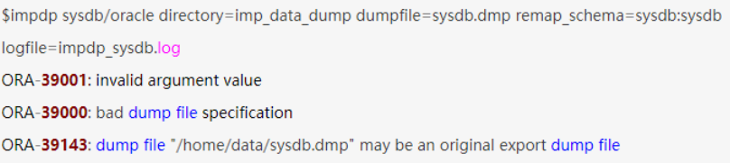

1、运行以下命令：
sqlplus system/user_developer@jl

2、为oracle用户授予访问数据目录的权限
cmd
create directory dir as 'D:\jl';
grant read,write on directory dir to system;

3、执行数据泵出命令，注意一定要在Cmd下执行，不能登录sqlplus后执行
cmd
imp JEPAAS/JEPAAS file=jg.dmp grants=no full=y;

expdp system/user_developer@jl directory=dir dumpfile=jl20180925.dmp logfile=jl20180925.log full=y;

expdp system/user_developer@jl schemas=professional dumpfile=professional.dmp DIRECTORY=dir;

impdp system/manager@orcl directory=dir dumpfile=expdat.dmp logfile=expdat.log full=y;

特殊：Linux机器
imp JEPAAS/JEPAAS file=jg.dmp grants=no full=y;

问题1：oracle导入提示“IMP-00010：不是有效的导出文件，头部验证失败”的解决方案

1、查看dmp文件的版本号；2、查询导入oracle数据库的版本号，通过select * from v$version查看版本号；3、修改dmp文件的版本号

问题2：确定导出文件的方式

1: exp/imp的使用 (服务器端和客户端都可以执行。 并且备份文件可以在客户端产生。)
*exp user/password@servicename file=dump.dmp
imp user/password@servicename fromuser=fuser touser=tuser file=dump.dmp*

2: expdp/impdp的使用 （服务器端和客户端都可以执行。 备份文件只能存在服务器里面。）
I：在使用expdp导出时在Oracle需要定义目录变量，在导出的时候需要制定这个变量。如果可以，你可以为每个用户都建立一个单独的备份目录。
SQL>create directory dmpdir_user1 as '/home/oracle/backup';
SQL>grant read,write on directory dmpdir_user1 to user1;
对了，操作系统内必须创建这个目录。在SQL命令行下，并不会产生这个目录的。
[oracle@kook ~]$ mkdir backup
如果你没有制定这个目录的话，默认exp导出存放的目录是$HOME/rdbms/log里面。至少我的是这样。很奇怪，为什么在这里。

II：执行导出导入命令
expdp user1/password@servicename schemas=user1 directory=dmpdir_user1 dumpfile=user1.dmp
impdp user2/password@servicename directory=dmpdir_user1 dumpfile=user1.dmp remap_schema=user1:user2 remap_tablespace=user1ts:user2ts
使用expdp/impdp最大的好处可以让我转换表空间。而exp/imp这个是不支持的。处理起来非常麻烦