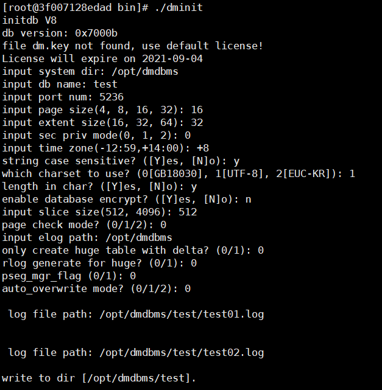

# 1 Windows环境

# 2 Linux环境

参考资料：https://www.pianshen.com/article/70472027524/

我使用的是达梦的DM8开发版（Linux-rh7-64位），可以在官网下载。

官网下载的为iso文件，我是采取直接解压出bin文件进行安装的。

达梦数据库建议新建账户进行安装，由于我在docker中安装，这里直接采用root账户安装。

## 1.安装前准备

在官网下载iso文件，并解压，得到DMInstall.bin文件，将其传输到centos主机中（位置/root/DMInstall.bin）

在主机中输入下列命令，将/root/DMInstall.bin文件复制到容器根目录
\#docker cp /root/DMInstall.bin dm_container:/root/DMInstall.bin

查看.data seg size、file size、open files、virtual memory大小足够即可（1048576或unlimited肯定没问题，可参考达梦安装手册）
\#ulimit -a

查看内存使用
\#free

在我安装过程中出现了/tmp文件夹空间不足的问题（提示“无法写入”），所以这里提前将/tmp的空间扩充

先查看扩充之前的容量
\#df -h /tmp

再进行扩充
\#umount /tmp
\#mount -t tmpfs -o size=2147483648,mode=1777 overflow /tmp

再次查看/tmp的容量，已变为2G
\#df -h /tmp

## 2.进行安装

在DMInstall.bin所在的目录下，先对安装文件赋予权限，否则无法执行安装
\#chmod 755 ./DMInstall.bin

执行安装，这里我采用的是命令行安装（注意/前面有个点）
\#./DMInstall.bin -i

key、安装路径等可以按自己需要进行输入，这里我采取
key选择n，选择时区21中国标准时间，安装选择1典型安装，目录直接默认安装路径（root用户为/opt/dmdbms）

安装过程中如果出现
Error occurred during initialization of VM
Unable to load native library: libnsl.so.1: cannot open shared object file: No such file or directory
的报错，就需要执行下面命令，安装libnsl库
\#yum install libnsl*

全部选择好后并进行安装后，会提示安装成功。

# 四、安装实例

进入达梦数据库安装目录bin文件夹
\#cd /opt/dmdbms/bin

查看初始化各参数中文说明
\#./dminit help

执行./dminit（不带参数执行这个命令，系统会引导填写参数）
\#./dminit

这里注意安装目录、日志目录都建议写成跟达梦数据库安装目录一致（如/opt/dmdbms），否则会报错，笔者就是这里卡了半天。

其他各参数根据自己需要填写，如果是oracle迁移到达梦，string case sensitive可以选择YES。

# 五、启动服务

进入达梦安装目录的script/root文件夹
\#cd /opt/dmdbms/script/root

注册服务
\#./dm_service_installer.sh -t dmserver -dm_ini /opt/dmdbms/test/dm.ini -p DMSERVER

启动服务
\#systemctl start DmServiceDMSERVER

进入bin目录
\#cd /opt/dmdbms/bin

使用达梦客户端disql连接数据库（达梦数据库用户SYSDBA的默认密码也是SYSDBA）
\#./disql SYSDBA/SYSDBA@localhost:5236

# 六、测试连通

windows测试端口连通，在cmd中输入命令（x为ip号）
telnet x.x.x.x 55236

达梦有windows端的客户端manager.exe可以使用，在windows安装包的tool文件夹中可以找到，填写ip、端口、用户名、密码就可以进行连接