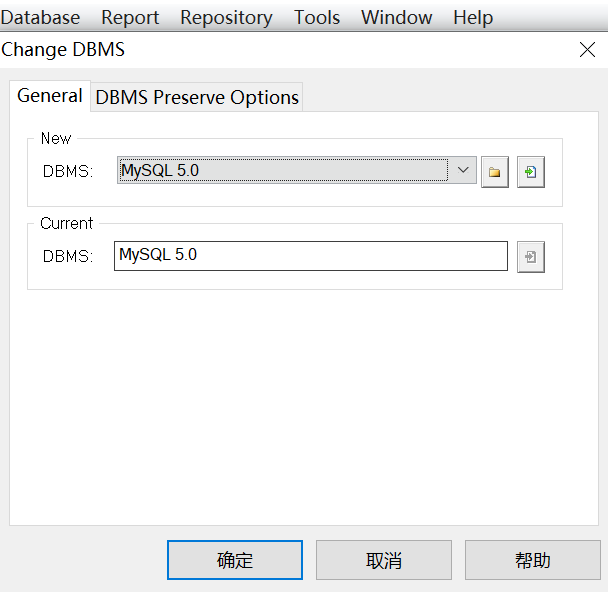
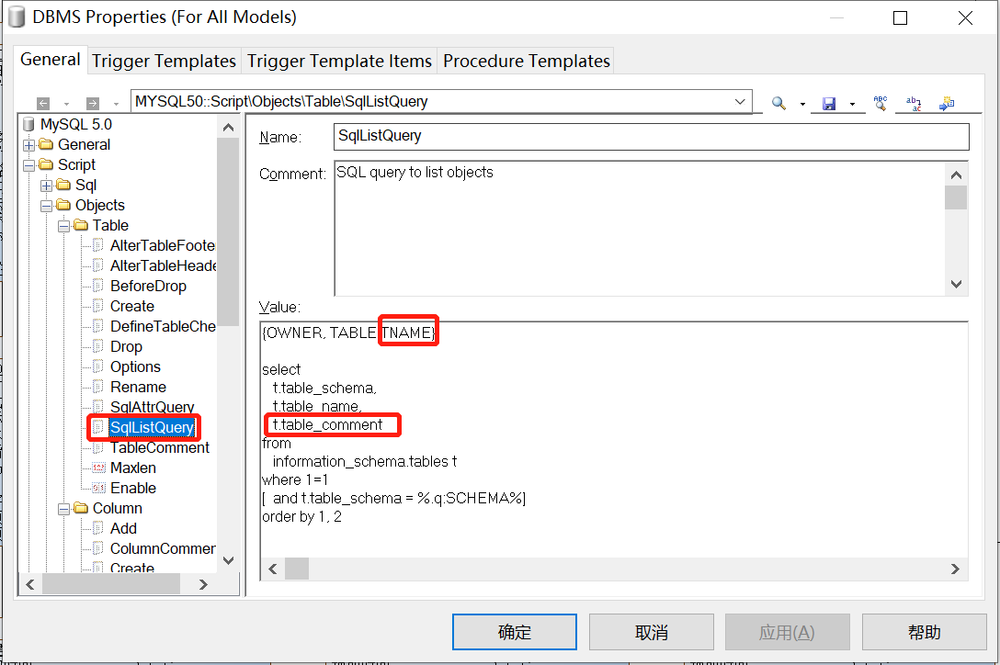
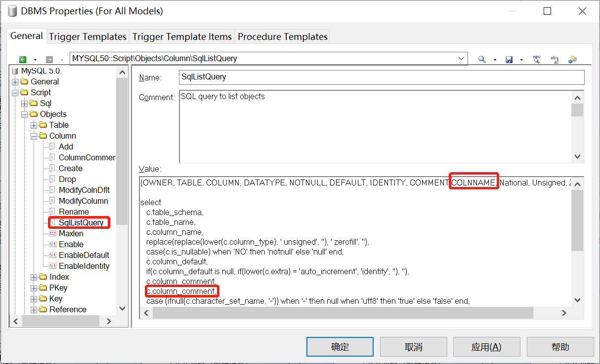
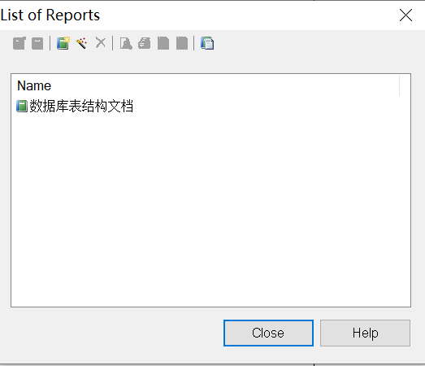
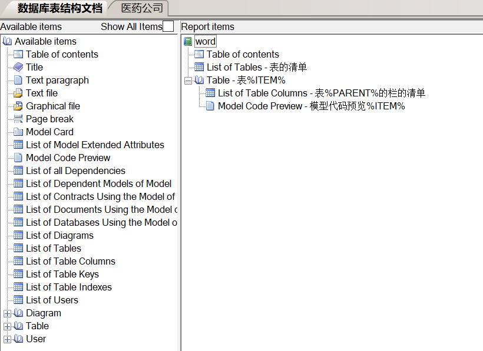
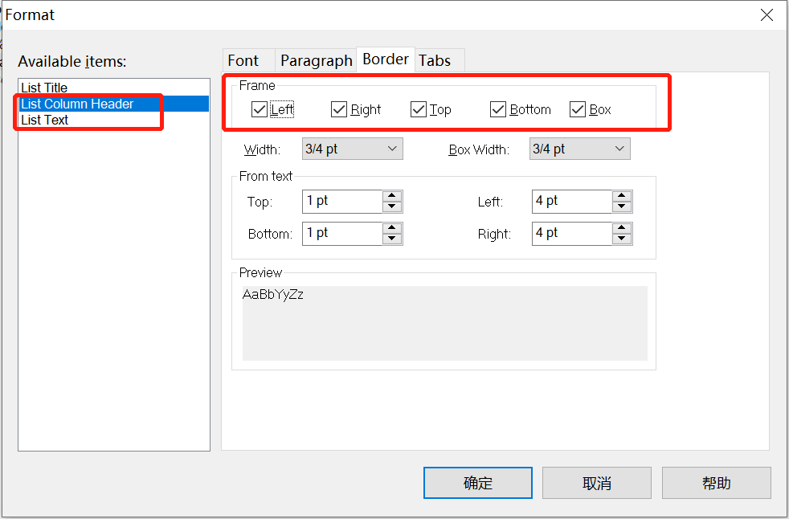

# 1 ODBC

## 1.1 MySQL

从子表连接到主表

## 1.2 Oracle

# 2 数据库操作

## 2.1 注释配置

1、操作：Database=>Edit Current DBMS，进入下图页面

2、操作：Database=>Edit Current DBMS，进入下图页面

然后分别将

Script-->Objects-->Table-->TableComment

Script-->Objects-->Column-->ColumnComment

修改成

alter table [%QUALIFIER%]%TABLE% comment %.60qA:COMMENT%

alter table [%QUALIFIER%]%TABLE% modify column %COLUMN% %DATATYPE% comment %.60qA:COMMENT%

## 2.2 编码配置

物理模型生产数据库时，Database=>Generate Database...，在Format标签选项中，将Generate name in empty comment，勾选上，默认不勾选，同时设置编码Encoding防止乱码发生。

## 2.3 DB生成PDM

Database=>update model from database...

1、配置数据类型

## 2.4 PDM生成DB

Database=>Generate Database...

## 2.5 PDM生成文档

1、添加自定义模板

Report=>Generate Report

Report=>Reports...

2、添加模板需要的信息

3、表格生成样式设置（右键format、layout）

