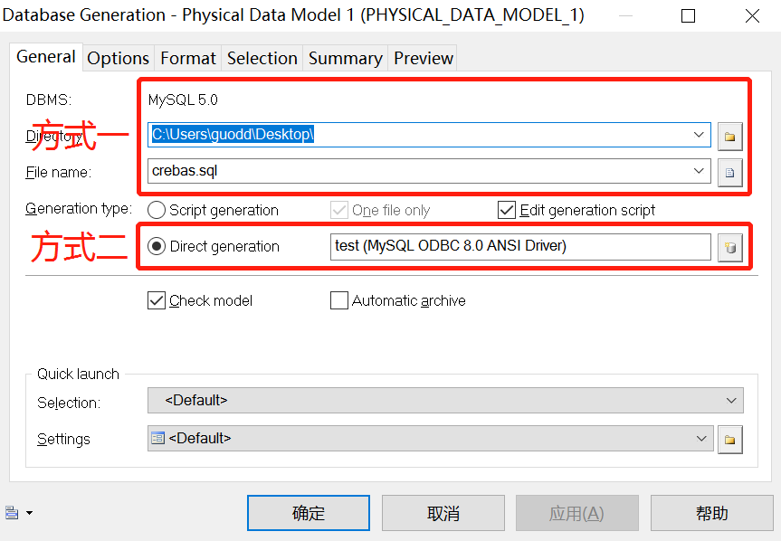

# 1 ODBC

## 1.1 版本统一

1、powerdesigner采用64位版本，如果没有显示64-bit说明是32位！！！

2、ODBC也要下载安装64位版本！！！

## 1.2 MySQL

MySQL的ODBC[下载地址](https://dev.mysql.com/downloads/connector/odbc/)，进行安装。

## 1.3 Oracle

自行查阅！！

# 2 数据库操作

## 2.1 Windows机器

1、选项管理工具中的ODBC数据源

2、添加mysql数据源

3、选择ODBC类型

4、添加连接信息

## 2.2 数据源配置

1、操作：Database=>Edit Current DBMS，进入下图页面

## 2.3 编码配置

物理模型生产数据库时，Database=>Generate Database...，在Format标签选项中，将Generate name in empty comment，勾选上，默认不勾选，同时设置编码Encoding防止乱码发生。

## 2.4 DB生成PDM

Database=>update model from database...

1、配置反向生成添加表注释

2、置反向生成添加字段属性注释

3、生成PDM

Database=>update model from database...选择对应的数据库

## 2.5 PDM生成DB

Database=>Generate Database...

## 2.6 PDM生成文档

1、添加自定义模板

Report=>Generate Report

Report=>Reports...

2、添加模板需要的信息

3、表格生成样式设置（右键format、layout）

