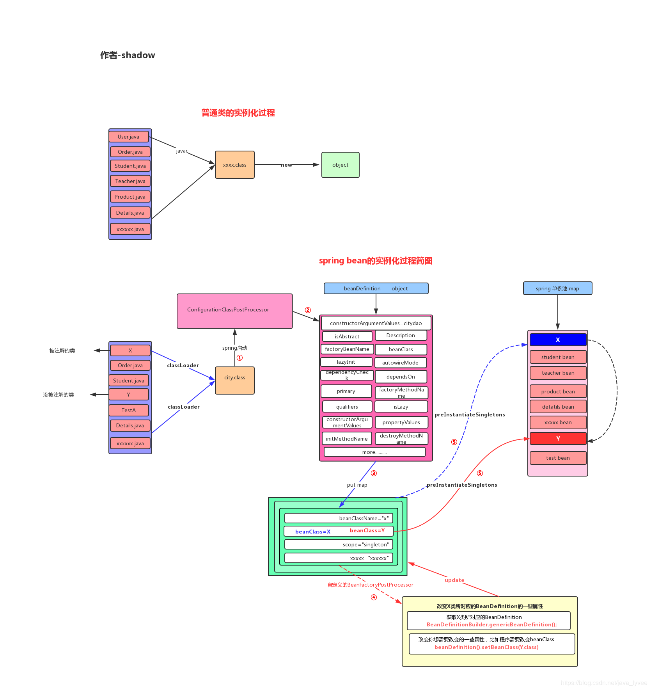

Bean是spring bean，Java对象是普通new的对象，Bean一定是Java对象，但是Java对象不一定是Bean。

Class=>BeanDefinition=>Object(Bean)

扫描=>解析=>调用扩展=>遍历map解析=>new

BeanFactoryPostProcessor

GenericBeanDefinition beanDefinition = new GenericBeanDefinition();
