# 1 概念理解

## 1.1 Spring是什么

> The Spring Framework provides a comprehensive programming and configuration model for modern Java-based enterprise applications - on any kind of deployment platform.

> A key element of Spring is infrastructural support at the application level: Spring focuses on the "plumbing" of enterprise applications so that teams can focus on application-level business logic, without unnecessary ties to specific deployment environments.

## 1.2 Spring有什么用


## 1.3 Spring解决什么问题

为了解决企业级应用开发的业务逻辑与其他各层的耦合问题。

## 1.4 Spring如何解耦


# 2 项目源码

## 2.1 版本选择

1、spring版本命名规则，常用软件版本规则：一般采用：x.y.z格式命名

xyz：为非负数 y为**偶数代表稳定版本**，反之代表开发版本

x：主版本号（api的兼容性发生变化，比如修改方法参数）

y：次版本号 （增加功能，不影响原有api的兼容性）

z：修订号 （bug修复，不影响api的兼容性）

比如：当前版本为1.0.0

修改方法参数，影响原有api的兼容性 版本号升级为：2.0.0

新增方法，对原有api的兼容性不影响，版本号升级为：2.1.0

修复bug，改变方法内部逻辑， 版本号升级为：2.1.1

2、spring版本命名规则

Snapshot：快照版-不稳定，处于开发中版本

Release：稳定版-功能相对稳定，可以对方开发但受时间限制

GA : 正式版-可广泛使用的稳定版

M：里程碑版-具有全新功能或是具有里程碑意义的版本

RC：终测版-即将作为正式版本

GA=General Availability，正式发布的版本，官方推荐使用此版本。在国外都是用GA来说明release版本的。一般可用性（发布）; 应该非常稳定，功能齐全，一般可用性”版本 - 最终版本。

PRE= 预览版，内部测试版，主要是给开发人员和测试人员测试和找BUG用的，不建议使用。

SNAPSHOT=快照版，可以稳定使用，且仍在继续改进版本。

RC=候选发布者；可能功能完整，应该非常稳定 - 问题应该是相对罕见和次要的，但值得报告，试图修复它们以便发布。RCx 对于候选发布者，按顺序编号。

M=里程碑构建 - 可能不完整; 应该是模糊的稳定（即它不仅仅是一个夜间快照），但可能仍然有问题。Mx 对于里程碑版本，按顺序编号。

SR=服务版本（主要版本之后的后续维护版本-RELEASE）。

[Spring官网地址](<https://spring.io/>)，本文中下载使用的版本：spring-framework-5.1.10.RELEASE，同时如果为了方便起见，你可以直接到[本人的GitHub](https://github.com/s121528/spring-framework-5.1.x.git)地址下载包含有测试demo和源码阅读过程的注释项目！spring是在Linux下进行开发和编译的！

本篇文章使用的版本是：***spring-framework-5.1.10.RELEASE***，本文书写认为读者都已经配置好需要的基础工具。

## 2.2 基础工具

系统：WINDOWS 10 LTSC

Git：拉取源码

JDK版本：openjdk version "1.8.0_265"，1.8以上版本都行

Maven版本：Apache Maven 3.6.3

Gradle版本：5.6.4-bin.zip，选择最新版本：gradle-6.5.1-all.zip（all版本是带源码的）

IntelliJ IDEA版本：IntelliJ IDEA 2020.1.1，网上很多朋友表示idea2020之前的版本导入时始终有问题，建议升级到2020.1或以上版本，当前使用的就是2020.1.1版本

# 3 源码编译

可以参考下载源码中的import-into-*.md文件的步骤进行操作！通过Windows命令窗口编译源码！

## 3.1 下载源码

[spring官网](http://spring.io)

从官方仓库 https://github.com/spring-projects/spring-framework Fork 出属于自己的仓库。

为什么要 Fork ？既然开始阅读、调试源码，我们可能会写一些注释，有了自己的仓库，可以进行自由的提交。

本文使用的Spring 版本为5.1.x 的master分支代码。

使用 IntelliJ IDEA 从 Fork 出来的仓库拉取代码。因为Spring 项目比较大，从仓库中拉取代码的时间会比较长。所以我这边是git clone到本地，然后再导入idea中的。


## 3.2 使用本地Gradle

要注意jdk、gradle的配置，gradle\wrapper\gradle-wrapper.properties中需要下载对应的gradle版本，最好替换成和本地的一致，然后将zip包拷贝到gradle-5.4\wrapper\dists\gradle-5.4-bin\59btlbly62hzjka9h1c4c86kd下面（根据情况）


**特别重要：**指定本地对应版本的路径

## 3.3 执行gradle.bat

项目根目录输入cmd，执行gradle.bat命令

## 3.4 修改镜像源

1、推荐使用对gradle进行全局配置

2、项目中配置，build.gradle文件

```properties
buildscript {
    repositories {
    	maven { url "https://repo.spring.io/plugins-release" }
    }
}


repositories {
	// 新增以下2个阿里云镜像
    maven { url 'https://maven.aliyun.com/nexus/content/groups/public/' }
    maven { url 'https://maven.aliyun.com/nexus/content/repositories/jcenter' }
	mavenCentral()
	maven { url "https://repo.spring.io/libs-spring-framework-build" }
	maven { url "https://repo.spring.io/milestone" } // Reactor
	// 新增spring插件库
	maven { url "https://repo.spring.io/plugins-release" }
}
```

## 3.5 修改dosc.gradle

修改gradle/docs.gradle下面的文件，**可以跳过此步骤，如果报错再添加也行！！！**

注释dokka、asciidoctor两段配置（文档编译和编码编译），然后替换下面本地路径的配置！

```properties
task schemaZip(type: Zip) {
    group = "Distribution"
    baseName = "spring-framework"
    classifier = "schema"
    description = "Builds -${classifier} archive containing all " +
            "XSDs for deployment at http://springframework.org/schema."
    duplicatesStrategy 'exclude'
    moduleProjects.each { subproject ->
        def Properties schemas = new Properties();

        subproject.sourceSets.main.resources.find {
            //这的路径需要改为\\
            it.path.endsWith("META-INF\\spring.schemas")
        }?.withInputStream { schemas.load(it) }

        for (def key : schemas.keySet()) {
            def shortName = key.replaceAll(/http.*schema.(.*).spring-.*/, '$1')
            assert shortName != key
            File xsdFile = subproject.sourceSets.main.resources.find {
                //这里需要进行路径替换
                it.path.endsWith(schemas.get(key).replaceAll('\\/', '\\\\'))
            }
            assert xsdFile != null
            into(shortName) {
                from xsdFile.path
            }
        }
    }
}
```

## 3.6 导入IDEA

方式一：直接open项目

方式二：project from exixting sources

## 3.7 编译spring-oxm

方式一：进入源码目录：gradlew :spring-oxm:compileTestJava（必须的，由于国情原因可以能会失败，多试几次），如果下载的是本人的项目，此步骤可以省略，直接进行下面导入操作即可！

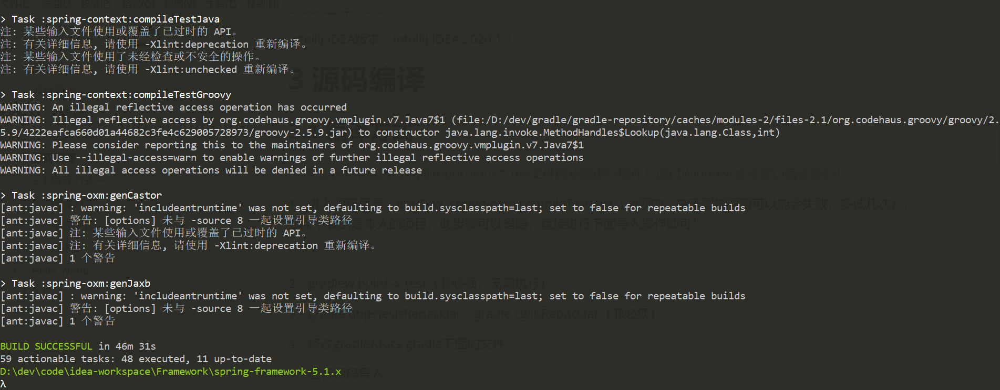

gradlew build -x test（非必须，无需执行）

方式二：先整体对项目打jar包，然后spring-oxm项目预编译结构（很短时间即可完成）。     


## 3.8 项目整体编译

很长时间才可完成

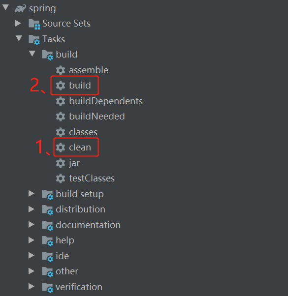

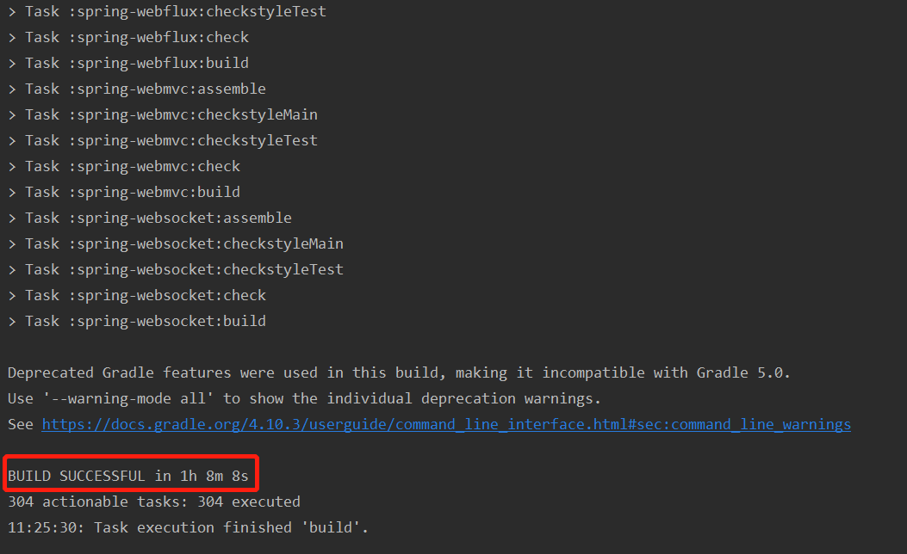

## 3.9 单元测试

即使整个项目没有error或者红点，也不代表项目已经成功构建好了，我们还需要执行个单元测试试下，如果能顺利执行单元测试，那证明该项目已经构建成功，这里我用到的是`DispatcherServletTests`这个类，直接运行查看结果：出现下面的结果才是整个项目最终构建好的标志！

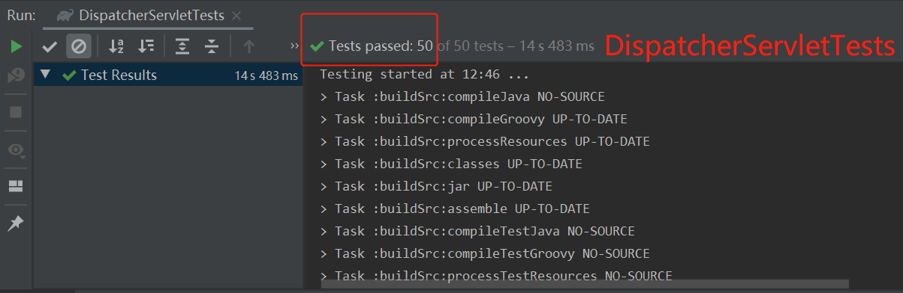

# 4 体系结构

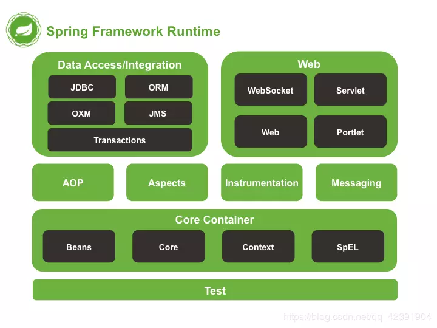

## 4.1 核心容器

 Spring的核心容器(Core Container)是其他模块建立的基础。

 Spring-core：提供框架的基本组成部分，包括 控制反转(IoC)和依赖注入(DI) 功能。

 Spring-beans：提供BeanFactory，由工厂模式实现，Spring将代理对象称为Bean。

 Spring-context：建立在core和beans基础上，提供框架式的访问方式。

 Spring-SpEL：表达式语言Spring Expression Language（简称 SpEL ）,支持运行时查询和操作对象图的表达式。

## 4.2 数据访问

 Spring-jdbc：提供JDBC抽象层，消除编码和特有的数据库错误解析。

 Spring-orm：为对象关系映射API提供集成层。

 Spring-oxm：提供支持对象/xml映射的抽象层实现。

 Spring-jms：Java消息传递服务。

 Spring-tx：事务，实现特殊接口和普通Java对象类的编程和声明式事务管理。

## 4.3 Web模块

 Spring-web：提供web开发基本的集成功能。

 Spring-webmvc：即Web-Servlet，包含用于web应用的SpringMVC和REST Web Servies实现。

 Spring-websocket：提供WebSocket和SockJS实现。

 Portlet：类似于Servlet模块的功能。

## 4.4 测试模块

spring-test：支持用JUnit和Spring组件进行单元测试和集成测试。

## 4.5 其他模块

 Spring-aop：提供符合AOP要求的面向切面的编程实现。

 Spring-aspects：提供与AspectJ的集成功能。

 Spring-Instrument：提供类植入和类加载器的实现。

 Spring-messaging：提供对消息传递体系结构和协议的支持。

# 5 Hello World

## 5.2 添加Gradle模块


## 5.1 添加Maven模块


# 6 入坑

## 6.1 Git提示

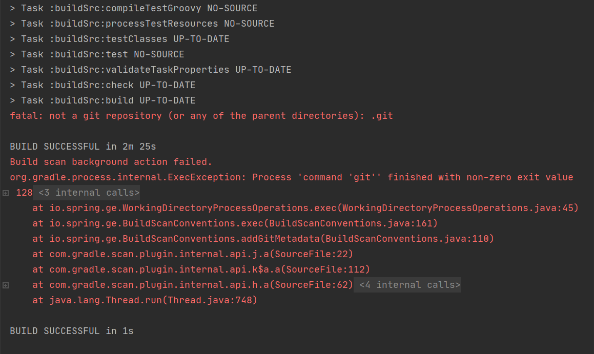

1、检查是否配置git环境变量

2、项目要是git上的项目

## 6.2 Aop

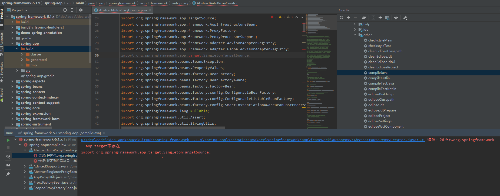

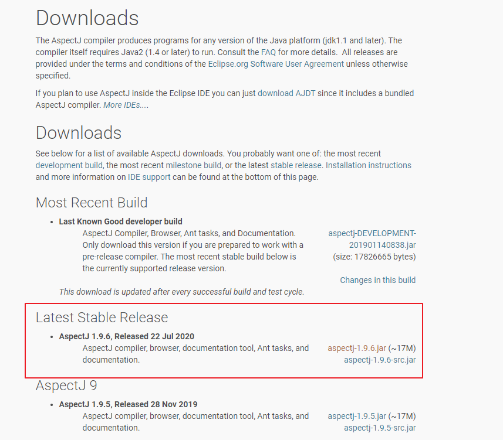


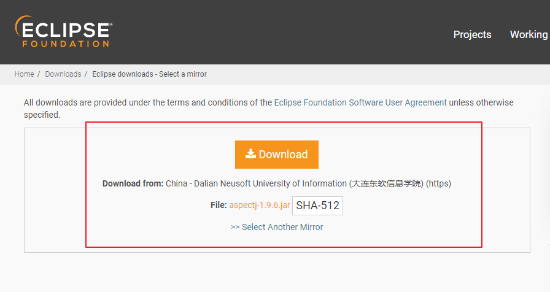

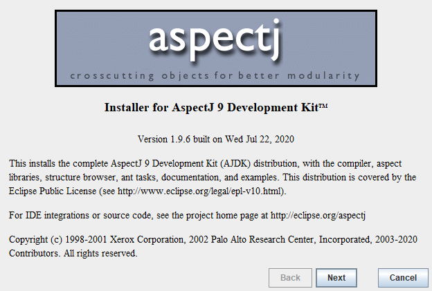


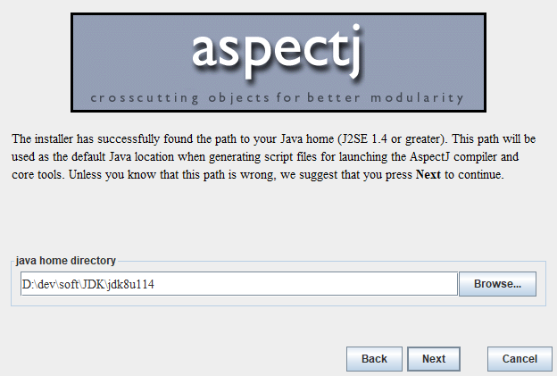


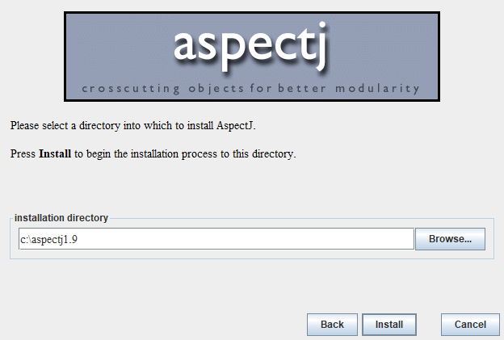


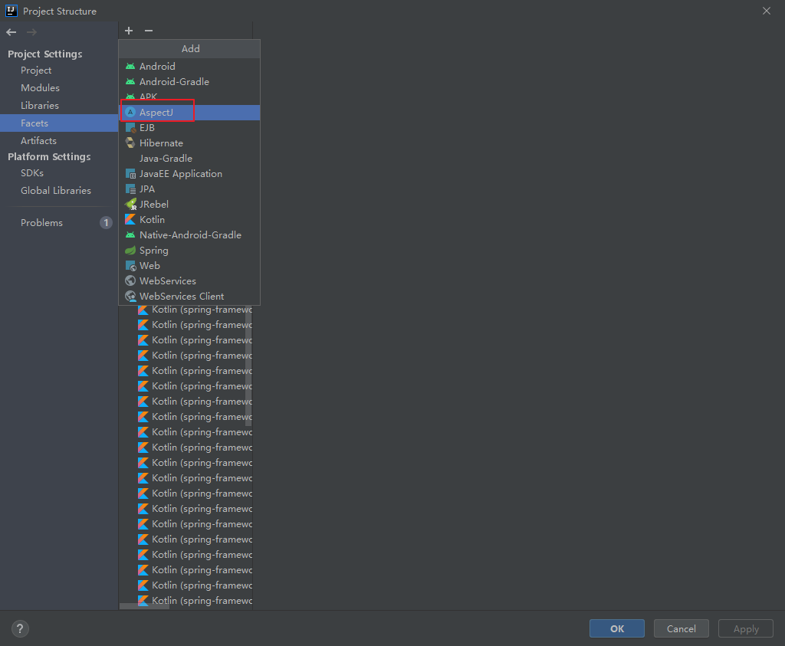


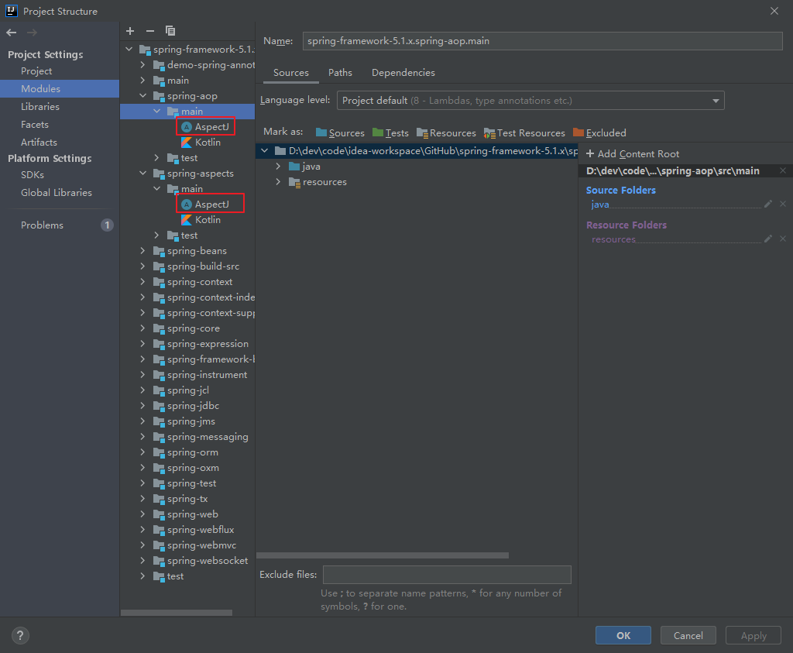

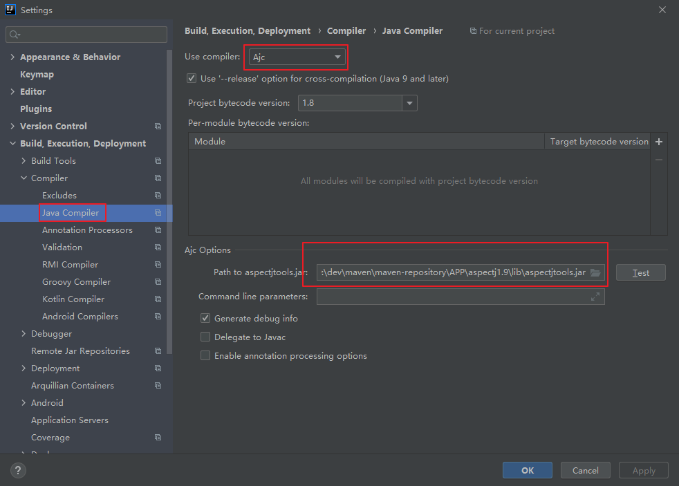

## 6.2 找不到CoroutinesUtils

找到spring-core\kotlin-coroutines\build\libs\kotlin-coroutines-5.2.8.RELEASE.jar，右键 Add As Library，然后点开IDEA上方工具栏，Build - Rebuild Project，没有效果则关闭项目重新打开再点击Rebuild Project，简单粗暴

## 6.3 找不到符号

报错：Error:(354, 51) java: 找不到符号 符号: 变量 CoroutinesUtils

找到spring-core\kotlin-coroutines\build\libs\kotlin-coroutines-5.2.8.RELEASE.jar，右键 Add As Library，然后点开IDEA上方工具栏，Build - Rebuild Project，没有效果则关闭项目重新打开再点击Rebuild Project，简单粗暴

## 6.4 spring-core缺失jar

gradle objenesisRepackJar、gradle cglibRepackJar（非必须）

spring-core缺少spring-cglib-repack-3.3.0.jar，spring-objenesis-repack-3.1.jar

找到 Gradle>spring-core>Tasks>other下面的两个工具，双击运行

## 6.5 SingletonTargetSource

找不到

解决方法：File–>Settings–>Editor–>File Types–>右边Ignore files and folders找到target文件名去掉即可

# 6 参考资料

## 6.1 视频

https://www.bilibili.com/video/av32102436?p=1

https://www.bilibili.com/video/BV1uE411d7L5?p=1

https://www.bilibili.com/video/BV1v64y1M7tS?p=1

## 6.2 优秀博客

https://blog.csdn.net/qq_38762237/article/details/107228946

https://blog.csdn.net/qq_34436819/category_9346614.html