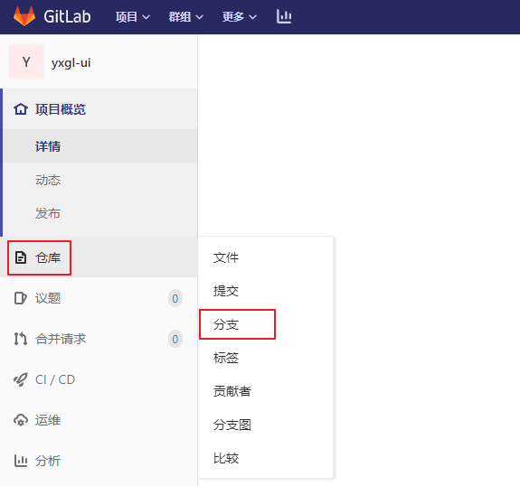
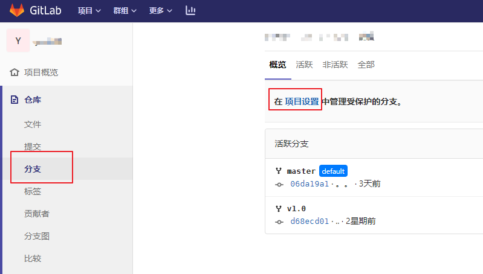
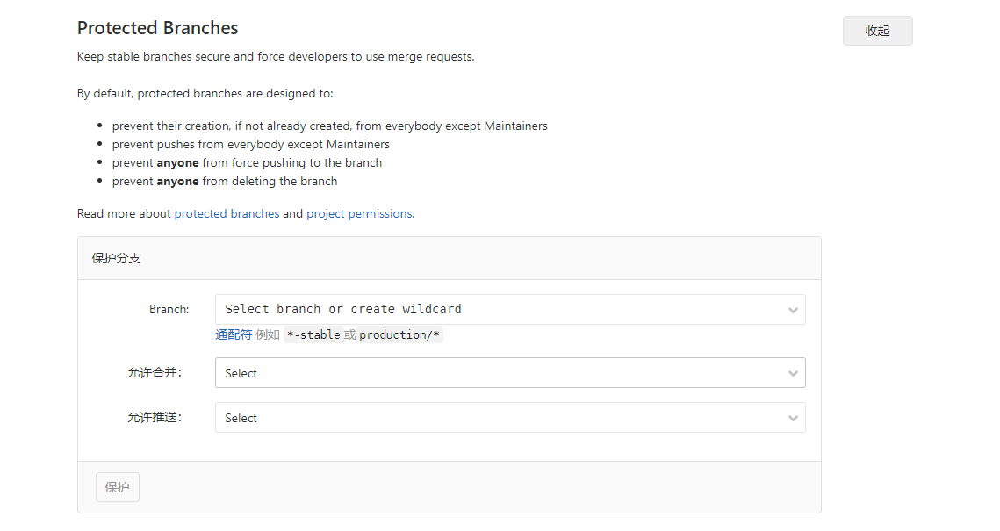

# 1 基础环境

安装好docker，并配置好docker镜像源，机器能外网（如果不能联网，可以用RPM安装方式）。代码是重要的资产，最好定期演练备份和恢复。

## 1.1 安装Docker

参考docker安装的文章！此处不做阐述。

## 1.2 配置Docker源

```properties
[gitlab-ce]
name=Gitlab CE Repository
baseurl=https://mirrors.tuna.tsinghua.edu.cn/gitlab-ce/yum/el$releasever/
gpgcheck=0
enabled=1
```


# 2 安装操作

## 2.1 Docker脚本

1. 创建对应映射的文件夹：mkdir -p /opt/soft/gitlab/{etc,log,data}

2. 创建文件vim start.sh把以下内容粘贴进文件（注意IP换了，SSH端口22也要换被占用了，不换的话可以换docker的映射端口）。

```shell
#!/usr/bin/env bash
docker run \
    --detach \
    --publish 10443:443 \
    --publish 10080:80 \
    --publish 10022:22 \
    --name gitlab \
    --hostname 192.168.100.13 \
    --env GITLAB_OMNIBUS_CONFIG="external_url 'http://192.168.100.13/'; gitlab_rails['lfs_enabled'] = true;" \
    --restart unless-stopped \
    --volume /opt/soft/gitlab/etc:/etc/gitlab \
    --volume /opt/soft/gitlab/log:/var/log/gitlab \
    --volume /opt/soft/gitlab/data:/var/opt/gitlab \
    --privileged=true \
    beginor/gitlab-ce:11.3.0-ce.0
```

进入容器，查看版本gitlab-rake gitlab:env:info

## 2.2 上传&运行

1. 上传执行

```properties
chmod 744 start.sh
./start.sh
```

2. 查看生成的文件

```properties
etc、log、data下面的映射文件
```

## 2.3 修改配置

修改文件，vim /opt/soft/gitlab/etc/gitlab.rb文件进行修改，特别重要就是这个文件的修改。

```properties
external_url 'http://211.144.5.80:30127'
nginx['listen_port'] = 30127
gitlab_rails['gitlab_shell_ssh_port'] = 10022
```

修改这一个文件会影响到的文件

vim /opt/soft/gitlab/data/gitlab-rails/etc/gitlab.yml文件，对应的host和port会根据上面配置发生变化。

vim /opt/soft/gitlab/data/nginx/conf/gitlab-http.conf文件，对应的监听端口和IP会发生变化。

**特别说明：**配置gitlab.rb文件中的external_url后面对应的端口号，是nginx监听的端口号。

## 2.4. 备份&升级

小版本升级（例如从 8.8.2 升级到 8.8.3）， 参照官方的说明， 将原来的容器停止， 然后删除：
```shell
docker stop gitlab
docker rm gitlab
```

然后重新拉一个新版本的镜像下来，

`docker pull beginor/gitlab-ce:11.3.0-ce.0`

还使用原来的运行命令运行(改一下版本号，为了以防万一，最好备份代码)

```shell
#!/bin/base
docker run \
    --detach \
    --publish 443:443 \
    --publish 80:80 \
    --publish 22:22 \
    --name gitlab \
    --hostname 10.9.254.162 \
    --env GITLAB_OMNIBUS_CONFIG="external_url 'http://10.9.254.162/'; gitlab_rails['lfs_enabled'] = true;" \
    --restart unless-stopped \
    --volume /opt/soft/gitlab/etc:/etc/gitlab \
    --volume /opt/soft/gitlab/log:/var/log/gitlab \
    --volume /opt/soft/gitlab/data:/var/opt/gitlab \
    beginor/gitlab-ce:11.3.0-ce.0
```


GitLab 在初次运行的时候会自动升级， 为了预防万一， 还是建议先备份一下`/opt/soft/gitlab`这个目录。

大版本升级（例如从 8.7.x 升级到 8.8.x）用上面的操作有可能会出现错误， 如果出现错误可以尝试登录到容器内部， 可以用 `docker exec` ， 也可以用 ssh ， 依次执行下面的命令：

```shell
gitlab-ctl reconfigure
gitlab-ctl restart
```

1、设置中文。

登陆后 点右上角的头像 --> settings -->Preferred language -->简体中文--> 确定

2、底部中间的小板子（管理中心）-->设置-->通用

帐户和限制

Gravatar enabled的勾去掉

Default projects limit改为10

注册限制

Sign-up enabled的勾去掉

3、管理中心-->外观

标题为首页的标题

描述为首页的描述

## 2.5 分支保护

git reset --hard 版本号

git push -f origin master，默认情况下master分支是**受保护**的。





