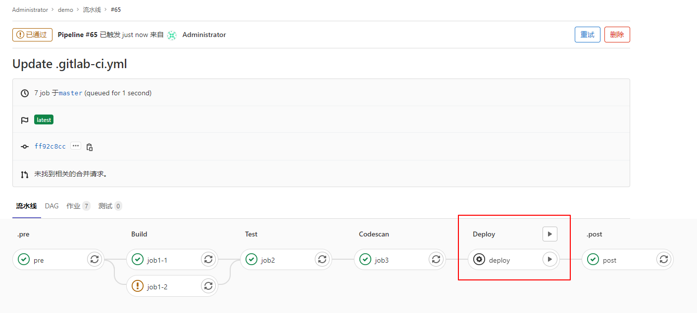

开发团队、运维团队、QA团队

Version：GitLab Community Edition 13.5.1

# 1 CI/CD介绍

## 1.1 CI/CD

CI持续集成、CD持续交付（部署）

GitLab-CI就是一套配合GitLab使用的持续集成系统（当然，还有其它的持续集成系统，同样可以配合GitLab使用，比如Jenkins）。而且GitLab8.0以后的版本是默认集成了GitLab-CI并且默认启用的。

GitLab-CI全称是gitlab continuous integration的意思，也就是持续集成。中心思想是当每一次push到gitlab的时候，都会触发一次脚本执行，然后脚本的内容包括了测试，编译，部署等一系列自定义的内容。

多平台：Unix, Windows,mac0S和任何其他支持Go的平台上执行构建。

多语言：构建脚本是命令行驱动的，并且可以与Java,PHP,Ruby,C和任何其他语言一起使用。

稳定构建：构建在与 Gitlab不同的机器上运行。

并行构建： Gitlab CI/CD在多台机器上拆分构建，以实现快速执行

实时日志记录：合并请求中的链接将您带到动态更新的当前构建日志

灵活的管道：您可以在每个阶段定义多个并行作业，并且可以触发其他构建

版本管道：一个。 gitlab-ci.ym1文件包含您的测试，整个过程的步聚，使每个人都能贡献更改，并确保每个分
支获得所需的管道。

自动缩放：您可以自动缩放构建机器，以确保立即处理您的构建并将成本降至最低。

构建工件：您可以将二进制文件和其他构建工件上載到 Gitlab并浏览和下载它们。

Docker支持：可以使用自定义 Dockerl映像，作为测试的一部分启动服务，构建新的 Dockerl映像，甚至可以在
Kubernetes上运行

容器注册表：内置的容器注册表，用于存储，共享和使用容器映像。

受保护的变量：在部署期间使用受每个环境保护的变量安全地存储和使用机密。

环境：定义多个环境。

## 1.2 GitLab-CI

这个是一套配合GitLab使用的持续集成系统，是GitLab自带的，也就是你装GitLab的那台服务器上就带有的。无需多考虑。.gitlab-ci.yml的脚本解析就由它来负责。


 

## 1.3 GitLab-Runner

GitLab-Runner是配合GitLab-CI进行使用的。一般地，GitLab里面的每一个工程都会定义一个属于这个工程的软件集成脚本，用来自动化地完成一些软件集成工作。当这个工程的仓库代码发生变动时，比如有人push了代码，GitLab就会将这个变动通知GitLab-CI。这时GitLab-CI会找出与这个工程相关联的Runner，并通知这些Runner把代码更新到本地并执行预定义好的执行脚本。

所以，GitLab-Runner就是一个用来执行软件集成脚本的东西。你可以想象一下：Runner就像一个个的工人，而GitLab-CI就是这些工人的一个管理中心，所有工人都要在GitLab-CI里面登记注册，并且表明自己是为哪个工程服务的。当相应的工程发生变化时，GitLab-CI就会通知相应的工人执行软件集成脚本。

这个是脚本执行的承载者，.gitlab-ci.yml的script部分的运行就是由runner来负责的。GitLab-CI浏览过项目里的.gitlab-ci.yml文件之后，根据里面的规则，分配到各个Runner来运行相应的脚本script。这些脚本有的是测试项目用的，有的是部署用的。

 GitLab-Runner可以分类两种类型：Shared Runner（共享型）和Specific Runner（指定型）。
Shared Runner：这种Runner是所有工程都能够用的。只有系统管理员能够创建Shared Runner。
Specific Runner：这种Runner只能为指定的工程服务。拥有该工程访问权限的人都能够为该工程创建Shared Runner。

 .gitlab-ci.yml 这个是在git项目的根目录下的一个文件，记录了一系列的阶段和执行规则。GitLab-CI在push后会解析它，根据里面的内容调用runner来运行。

## 1.4 Pipeline

.gitlab-ci.yal一次 Pipeline 其实相当于一次构建任务，里面可以包含多个流程，如安装依赖、运行测试、编译、部署测试服务器、部署生产服务器等流程。

+------------------+      +----------------+

|         | trigger |        |

|  Commit / MR  +---------->+  Pipeline  |

|         |      |        |

+------------------+      +----------------+

## 1.5 Stages

Stages 表示**构建阶段**，说白了就是上面提到的流程。我们可以在一次 Pipeline 中定义多个 Stages，这些 Stages 会有以下特点：

所有 Stages 会按照顺序运行，即当一个 Stage 完成后，下一个 Stage 才会开始

只有当所有 Stages 完成后，该构建任务 (Pipeline) 才会成功

如果任何一个 Stage 失败，那么后面的 Stages 不会执行，该构建任务 (Pipeline) 失败

+--------------------------------------------------------+

|                            |

| Pipeline                       |

|                            |

| +-----------+   +------------+   +------------+ |

| | Stage 1 |---->|  Stage 2 |----->|  Stage 3 | |

| +-----------+   +------------+   +------------+ |

|                            |

+--------------------------------------------------------+

## 1.6 Jobs

Jobs 表示**构建作业**，表示某个 Stage 里面执行的工作。我们可以在Stages 里面定义多个 Jobs，这些 Jobs 会有以下特点：

相同 Stage 中的 Jobs 会并行执行

相同 Stage 中的 Jobs 都执行成功时，该 Stage 才会成功

如果任何一个 Job 失败，那么该 Stage 失败，即该构建任务 (Pipeline) 失败

+------------------------------------------+

|                     |

|  Stage 1                 |

|                     |

| +---------+ +---------+ +---------+  |

| | Job 1 | | Job 2 | | Job 3 |  |

| +---------+ +---------+ +---------+  |

|                     |

+------------------------------------------+

## 1.7 对比

Gitlabci & Jenkins
轻量级，不需要复杂的安装手段。
・编译服务和代码仓库分离，耦合度低
配置简单，与 gitlab可直接适配。
插件丰富，支持语言众多
实时构建日志十分清晰，UI交互体验很好
有统一的web管理界面。
使用YAML进行配置，任何人都可以很方便的使用。
插件以及自身安装较为复杂。
没有统一的管理界面，无法统筹管理所有项
体量较大，不是很适合小型团队
・配置依赖于代码仓库，耦合度没有 Jenkins。低
同
Gitlabci有助于 Devops人员，例如敏捷开发中，开发与运维是
个人，最便捷的开发方式
Jenkinsci适合在多角色团队中，职责分明、配置与代码分离、插件丰富

# 2 GitLab

开源：CI/CD是开源 Gitlab社区版和专有 Gitlab企业版的一部分

易于学习：具有详细的入门文档。

无缝集成： Gitlab CI/CD是 Gitlabl的一部分，支持从计划到部署，具有出色的用户体验。

可扩展：测试可以在单独的计算机上分布式运行，可以根据需要添加任意数量的计算机。

更快的结果：每个构建可以拆分为多个作业，这些作业可以在多台计算机上并行运行。

针对交付进行了优化：多个阶段，手动部署，环境和变量。

## 2.1 安装配置

三种安装方式：RPM安装、Docker安装、K8s

1、获取镜像

```ruby
# gitlab-ce为稳定版本，后面不填写版本则默认pull最新latest版本
$ docker pull gitlab/gitlab-ce
```

2、运行镜像

```csharp
docker run -d  -p 443:443 -p 80:80 -p 222:22 --name some-gitlab --restart always -v /home/gitlab/config:/etc/gitlab -v /home/gitlab/logs:/var/log/gitlab -v /home/gitlab/data:/var/opt/gitlab gitlab/gitlab-ce
# -d：后台运行
# -p：将容器内部端口向外映射
# --name：命名容器名称
# -v：将容器内数据文件夹或者日志、配置等文件夹挂载到宿主机指定目录
```

3、配置

按上面的方式，gitlab容器运行没问题，但在gitlab上创建项目的时候，生成项目的URL访问地址是按容器的hostname来生成的，也就是容器的id。作为gitlab服务器，我们需要一个固定的URL访问地址，于是需要配置gitlab.rb（宿主机路径：/home/gitlab/config/gitlab.rb）。

```ruby
# gitlab.rb文件内容默认全是注释
$ vim /home/gitlab/config/gitlab.rb

# 配置http协议所使用的访问地址,不加端口号默认为80
external_url 'http://宿主机IP'

# 配置ssh协议所使用的访问地址和端口
gitlab_rails['gitlab_ssh_host'] = '宿主机IP'
gitlab_rails['gitlab_shell_ssh_port'] = 222 # 此端口是run时22端口映射的222端口
:wq #保存配置文件并退出

# 重启gitlab容器
$ docker restart gitlab
```

4、其他配置

由于GitLab十分消耗资源，所以这里贴出来一些降低资源消耗的配置，仅供参考，因为我的目的仅仅是启动GitLab做实验，所有资源配置都很低。需要修改的是宿主机 /home/gitlab/config/gitlab.rb文件（注：路径需根据自己自定的数据卷位置修改）

```bash
# 配置http协议所使用的访问地址,不加端口号默认为80
external_url 'http://10.106.127.128:8088'

# 配置ssh协议所使用的访问地址和端口
gitlab_rails['gitlab_ssh_host'] = '10.106.127.128:8088'
gitlab_rails['gitlab_shell_ssh_port'] = 222 # 此端口是run时22端口映射的222端口

unicorn['worker_memory_limit_min'] = "100 * 1 << 20"
unicorn['worker_memory_limit_max'] = "150 * 1 << 20" #减小内存

sidekiq['concurrency'] = 5 # 减小sidekiq的并发数
postgresql['shared_buffers'] = "64MB" #数据库缓存
postgresql['max_worker_processes'] = 2 #数据库并发数

unicorn['worker_timout'] = 60

unicorn['worker_processes'] = 2
```

## 2.2 基础使用

# 3 GitLab-Runner

## 3.1 docker-compose

1、原生的docker-compose安装Gitlab-Runner

```yaml
version: '3.1'
services:
 gitlab-runner:
  image: gitlab/gitlab-runner
  restart: always
  container_name: gitlab-runner
  hostname: gitlab-runner
  privileged: true
  volumes:
  	- /opt/soft/gitlab-runner/config:/etc/gitlab-runner
  	- /var/run/docker.sock:/var/run/docker.sock
```

此时遇到一个问题,我们在docker中,需要安装jdk和maven来进行打包,如果没有SCP命令的话,还要安装SCP进行远程发布,此时就需要修改镜像了,有两种方法

a)复制Gitlab-Runner的镜像,去掉注释.修改

b)直接继承Gitlab-Runner 在上面做修改

由于方法二的代码改动量较少,此时列出方法2的Dockerfile和docker-compose.yml(未整理)

## 3.2 docker

1、拉取镜像

```undefined
 docker pull gitlab/gitlab-runner:latest 
```

2、运行镜像

```jsx
docker run -d --name gitlab-runner --restart always \
  -v /docker/gitlab-runner/config:/etc/gitlab-runner \
  -v /var/run/docker.sock:/var/run/docker.sock \
  gitlab/gitlab-runner:latest
```

## 3.3 注册Runner

1、在gitlab中 设置 --> CI/CD --> Runner(展开) 找到对应的配置信息。


2、写一个 gitlab-ci.yml

```yaml
stages:
  - 拉取代码
  - MAVEN打包
  - 发布到远程服务器

我在搞代码:
  stage: 拉取代码
  script:
    - 'ls -al'
    - 'pwd'
我在打包:
  stage: MAVEN打包
  script:
    - 'echo $JAVA_HOME'
发布到测试环境:
  stage: 发布到远程服务器
  script:
    - 'echo Hello World'
发布到正式环境环境:
  stage: 发布到远程服务器
  script:
    - 'echo Hello Java'
```


3、基础命令

```shell
gitlab-runner register
gitlab-runner list
gitlab-runner verify
```

# 4 流程语法

## 4.1 基础流程

job、script、before_script、after_script、stages、stage、variables、.pre、.post

```yaml
before_script:
  - "echo job1"

variables:
  NAME: com.io

stages:
  - build
  - test
  - codescan
  - deploy
  
job1-1:
  stage: build
  script: 
    - "echo job1-1"
job1-2:
  stage: build
  script: 
    - "echo job1-2"

job2:
  before_script:
    -  "echo job2 before"
  stage: test
  script: 
    - "echo job2"
  after_script:
    - 'echo job2 after'

job3:
  stage: codescan
  script: 
    - 'echo $NAME'

pre:
  stage: .pre
  script: "echo job3"

post:
  stage: .post
  script: "echo job4"

after_script:
    - "end init"
```

1、job

一个.gitlab-ci.yml可以有多个作业job

```yaml
job1:
  script: "echo job1"
job2:
  script: "echo job2"
```

在一个pipeline中包含两个作业

2、script、before_script、after_script

运行shell脚本，可以是一个或多个，数组格式！

3、stages

用于定义作业使用的阶段，并且是全局定义，同一阶段的作业并行运行，不同阶段顺序执行。

4、stage

具体的任务

5、运行效果


vi /etc/gitlab-runner/config.toml，修改每次运行任务的个数。

## 4.2 任务限制

tags、allow_failure、when、retry、timeout、parallel

1、tags

标签，用于指定特定运行的Runner

2、allow_failure

允许作业的失败，失败后是一个叹号，不会影响后面的流程线执行

```yaml
job1-1:
  stage: build
  script: 
    - "echo job1-1"
job1-2:
  stage: build
  script: 
    - "ech job1-2"
  allow_failure: true
```


3、when

on_sucess：默认，前面所有阶段都成功才执行作业

on_failure：当前面阶段出现失败时执行

always：总是执行作业

manual：手动执行作业

```yaml
deploy:
  stage: deploy
  script:
    - echo aa
  when: manual
```



delayed：延迟执行作业

```yaml
job2:
  before_script:
    -  "echo job2 before"
  stage: test
  script: 
    - "echo job2"
  after_script:
    - 'echo job2 after'
  when: delayed
  start_in: '30'
```


4、retry

失败重试次数

5、timeout

超时时间设置（Runner>作业>项目）

```yaml
job2:
  before_script:
    -  "echo job2 before"
  stage: test
  script: 
    - "echo job2"
  after_script:
    - 'echo job2 after'
  when: delayed
  start_in: '30'
  timeout: 3 hours 30 minutes
```

6、parallel

2<=parallel<=50

## 4.3 执行策略

only、except、rules、workflow

1、only、except

用分支策略来限制jobs的构建

only定义哪些分支被job执行

except定义哪些分支不被job执行

2、rules

按照顺序进行匹配规则，直到匹配并为作业提供动态属性

rules不能喝only、except同时使用

if（条件匹配）、changes（文件变化）、exists（文件存在）

3、workflow

是否创建管道pipeline

always是默认、never

## 4.4 缓存

cache、artifacts、dependencies

项目运行时的依赖项

```yaml
before_script:
  - echo before script

variables:
  DOMAIN: com.io
  JAR_PATH: /opt/soft/jar

cache:
  paths:
    - target/

stages:
  - build
  - test
  - deploy

build:
  stage: build
  tags:
    - build
  only:
    - master
  script:
    - ls
    - id
    - mvn clean package -DskipTests
    - ls target
    - echo "$DOMAIN"
    - false && true ; exit_code=$?
    - if [ $exit_code -ne 0 ]; then echo "command failed";fi;
    - sleep 2;

test:
  stage: test
  tags:
    - build
  only:
    - master
  script:
    - echo "run test"
    - echo 'test' >> target/a.txt
    - ls target
    - cat target/a.txt

deploy:
  stage: deploy
  tags:
    - build
  only:
    - master
  script:
    - echo "run deploy"
    - ls target
    - echo "deploy" >> target/a.txt
    - cp -rf target/*.jar $JAR_PATH
  retry:
    max: 2
    when:
      - script_failure

after_script:
  - echo after script
```

1、cache

存储编译项目所需要的运行时依赖项，全局指定和单独job指定，job指定优先级高。

```yaml
build: 
  script: test
  cache: 
    paths: 
      - target/*.jar   // 可以多个
```

```yaml
cache: 
  paths: 
    - my/file
    
build: 
  script: test
  cache: 
    key: build
    paths: 
      - target/*.jar   // 当定义全局的cache会被job覆盖

cache: 
  key: ${CI_COMMIT_REF_SLUG}
```

key：是缓存标记，默认是default，为每一个job分配一个独立的cache。

policy：参数pull跳过下载步骤、push跳过上传步骤。

## 4.5 制品

1、artifacts

制品，用于指定在作业成功或失败时附加到作业的文件或目录的列表，作业完成后把制品发送到gitlab上，可以在gitlab的UI上进行下载。

```shell
default-job:
  script: 
    - mvn test -U
  except:
    - tages
    
release-job:
  script: 
    - mvn package -U
  artifacts:
    pahts: 
      - target/*.war
    only:
      - tags
```

expose_as在UI上展示制品

```yaml
artifacts:
  paths: 
    - target/
    
test:
  script:
    - echo 1
  artifacts:
    expose_as: 'artifact 1' # 展示制品
    name: "$CI_JOB_NAME" # $CI_COMMIT_REF_NAME 制品名称
    when: on_success # on_failure、always 制品创建条件
    expire_in: 1 week # 制品保留时间，默认30天，不指定单位是秒
    reports: 
      junit: target/surefire-reports/TEST-*.xml
    paths: 
      - path/to/file.txt
```

reports开启单测报告面板

```properties
su - git
gitlab-rails console
Feature.enable(:junit_pipeline_view)
```


cobertura开启覆盖率面板

```properties
su - git
gitlab-rails console
Feature.enable(:coverape_report_view)
```


```yaml
buile:
  script:
    - mvn test
    - mvn cobertura:cobertura
  artifacts:
    reports: 
      junit: target/surefire-reports/TEST-*.xml
      cobertura: target/site/cobertura/coverape.xml
```


## 4.6 获取制品

dependencies获取制品

```yaml
test: 
  script: echo aa
  dependencies:
    - build
```

定义要获取工件的作业列表，只能从当前阶段之前执行的阶段定义作业。定义一个空数组将跳过下载该作业的任何工件不会考虑先前作业的状态，因此，如果它失败或是未运行的手动作业，则不会发生错误。如果设置为依赖项的作业的工件已过期或除，那么依项作业将失败。

## 4.7 阶段并行

needs、include、extends、trigger

可无序执行作业，无需按**阶段顺序**运行某些作业，可以让多个阶段同时运行。如果 needs：设置为指向因only/ except规则而来实，化的作业，或者不存在，则创建管道时会出现YAL铅误。

## 4.8 导入配置

1、local本地

可以允许引入外部YAL文件，文件具有扩展名。yml或yaml

使用合并功能可以自定义和覆盞包含本地定义的CI/CD配置

引入同一存储库中的文件，使用相对于根目录的完整路径进行引用，与配置文件在同一分支上使用。

```yaml
include: 
  local: 'ci/localci.yml'
```

2、project项目

```yaml
include:
  project: demo-2
  ref: master
  file: '.gitlab.yaml'
```

3、template模板

```yaml
include:
  template: '.gitlab.yaml'
```

4、remote远程配置

```yaml
include:
  remote: 'https://gitlab.com/ci-template.yaml'
```

## 4.9 CI配置文件路径

默认是当前项目的gitlab-ci.yml


## 4.10 继承

extends

```yaml
job1: 
  stage: test
  scripte: echo aa

job2: 
  stage: test
  extends: job1
  script: 
    - echo bb
```

## 4.11 触发

trigger触发下游项目！！！

1、多项目管道：跨多个项目设置水线，以便一个项目中的管道可以触发另一个项目中的管道。（服务架构）

```yaml
job: 
  trigger:
    project: demo
    branch: master
    strategy: depend
```


2、父子管道：在同一项目中管道可以触发一组同时运行的子管道，子管道仍然按照阶段题序执行其每个作业，但是可以自由地继续执行各个阶段，而不必等待父管道中无关的作业完成。

```yaml
job: 
  trigger:
    include: 'ci.yaml'
    strategy: depend
```

## 4.12 容器Runner

1、image是起容器，在容器中进行构建。

默认在注 runner的时侯霱要填写一个基础的镜像，请记住一点只要使用执行器为 docker类型的 runner
所有的操作运行都会在容器中运行。如果全局指定了 lmages则所有作业使用此 imaget创建容器并在其中
运行。全局未指定 lmage，再次查看job中是否有指定，如果有此job按照指定镜像创建容器并运行，没
有则使用注册 runner时指定的默认镜像。

```yaml
image: maven:3.6.3-jdk-8
```

```yaml
build: 
  image: maven:3.6.3-jdk-8
```

2、services依赖其它服务。

工作期间运行的另一个 Docker镜像，并link到 lmage关键字定义的 Docker像，这样，就可以在构建期间访问服务映像。

服务映像可以运行任何应用程序，但是最常见的用例是运行据库容器，例如 mysql。与每次安装项目时都安装 mysql相比，使用现有映像并将其作为附加容运行更容易，更快接。

```yaml
services: 
  - name: mysql:laster
    alias: mysql
```

3、environment

工作期间运行的另一个Docker映像，并link到 lmage关键字定义的 Dockers决像。这样，您就可以在构建
期间访问服务映像。

4、inherit

inherit是12.9版本以后才有。

使用或禁用全局定义的环境变量，默认是true。

```yaml
inherit:
  default: false
  variables: false
```


# 5 工具链

## 5.1 基本规划

1、创建一个git仓库用于存放模板

2、创建一个 template目求存放所有pipeline的模板

3、建一个jobs目录存放job模板

这样我们可以将一些 maven、ant、 gradle、npm工具通过一个job模板和不同的构建命令实现。 templates的好处是我们在其中定义了模板流水线，这些流水线可以直接让项目使用。当遇到个性化项目的时候就可以在当前项目创建。 gitlab-ci.yml文件来引用模板文件，再进一步实现个性化需要。

## 5.2 模板库

1、创建项目组，

2、创建项目和对应文件夹

## 5.3 Maven工具集成

1、安装maven环境

2、创建作业模板build.yaml

```yaml
.build: 
  stage: build
  tags: 
    - build
  script:
    - $BUILD_SHELL
    - ls
.test: 
  stage: test
  tages: 
    - build
  script:
    - $TEST_SHELL
    -ls
  artifacts:
    reports:
      junit: ${JUNIT_REPORTS_PAHT}
```

3、创建流水线模板java-pipeline.yml

```yaml
include: 
  - project: 'dev/dev-ci-service'
    ref: master
    file: 'job/build.yaml'
    
variables:
  BUILD_SHELL: 'mvn clean package -DskipTests' # 构建命令
  CACHE_DIR: 'target'
  
cache: 
  paths: 
    - ${CACHE_DIR}

stages: 
  - build
  
build:
  stage: build
  extends: .build
```

4、添加单元测试

## 5.3 NPM工具集成

1、npm环境安装

2、补充build作业模板

```yaml
include: 
  - project: 'dev/dev-ci-service'
    ref: master
    file: 'job/build.yaml'
    
variables:
  BUILD_SHELL: 'npm run build' # 构建命令
  CACHE_DIR: 'dist/'
  
cache: 
  paths: 
    - ${CACHE_DIR}
    - node_models/

stages: 
  - install
  - build
  
install: 
  stage: install
  script: 
    - npm install
  
build:
  stage: build
  extends: .build
```

3、创建流水线模板

4、添加单元测试

# 6 部署项目

## 6.1 构建打包

1、编写脚本

```yaml
# 本次构建的阶段：build package
stages:
  - build
  - package
# 构建 Job
build:
  stage: build
  script:
    - echo "=== 开始编译构建任务 ==="
    - mvn compile
# 打包
package:
  stage: package
  script:
    - echo "=== 开始打包任务 ==="
    - mvn package -Dmaven.test.skip=true
```

2、安装JDK和Maven环境


3、设置maven仓库存储文件的权限，第一次构建和打包比较慢，因为要拉去镜像


4、构建成功

