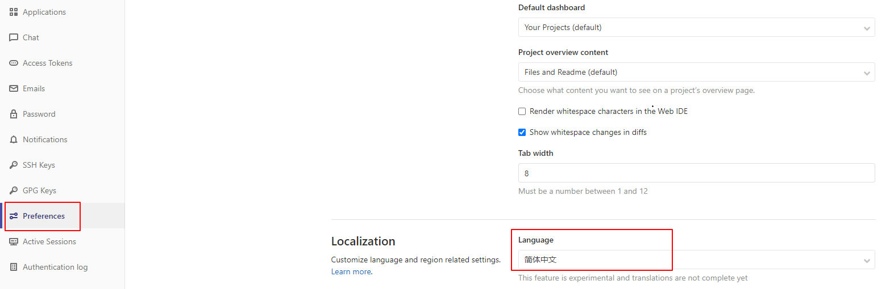
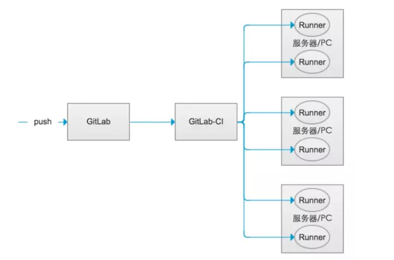

# 1 






1、GitLab-CI
 GitLab-CI就是一套配合GitLab使用的持续集成系统（当然，还有其它的持续集成系统，同样可以配合GitLab使用，比如Jenkins）。而且GitLab8.0以后的版本是默认集成了GitLab-CI并且默认启用的。
2、GitLab-Runner
 GitLab-Runner是配合GitLab-CI进行使用的。一般地，GitLab里面的每一个工程都会定义一个属于这个工程的软件集成脚本，用来自动化地完成一些软件集成工作。当这个工程的仓库代码发生变动时，比如有人push了代码，GitLab就会将这个变动通知GitLab-CI。这时GitLab-CI会找出与这个工程相关联的Runner，并通知这些Runner把代码更新到本地并执行预定义好的执行脚本。
 所以，GitLab-Runner就是一个用来执行软件集成脚本的东西。你可以想象一下：Runner就像一个个的工人，而GitLab-CI就是这些工人的一个管理中心，所有工人都要在GitLab-CI里面登记注册，并且表明自己是为哪个工程服务的。当相应的工程发生变化时，GitLab-CI就会通知相应的工人执行软件集成脚本。

Runner可以分布在不同的主机上，同一个主机上也可以有多个Runner。
3、Runner类型
 GitLab-Runner可以分类两种类型：Shared Runner（共享型）和Specific Runner（指定型）。
  Shared Runner：这种Runner是所有工程都能够用的。只有系统管理员能够创建Shared Runner。
  Specific Runner：这种Runner只能为指定的工程服务。拥有该工程访问权限的人都能够为该工程创建Shared Runner。
4、CentOs中GitLab-Runner的安装与使用

```yaml
stages:
  - test
  - build
  - deploy

test:
  stage: test
  script: echo "Running tests"

build:
  stage: build
  script: echo "Building the app"

deploy_staging:
  stage: deploy
  script:
    - echo "Deploy to staging server"
  environment:
    name: staging
    url: https://staging.example.com
  only:
  - master
```


https://blog.csdn.net/lizhiqiang1217/article/details/88803783


http://xtzero.me/2020/04/09/gitlabrunner202004/