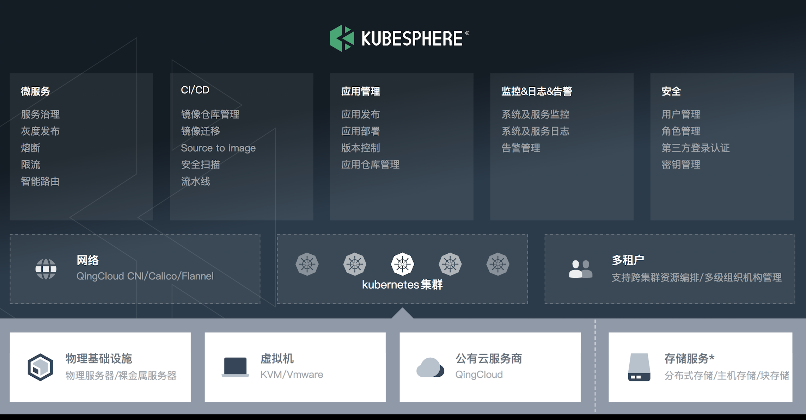

# 1 认识KubeSphere

KubeSphere是一个**分布式操作系统**，提供以Kubernetes为核心的**云原生堆栈**，旨在成为第三方应用程序的即插即用架构，以促进其生态系统的发展。 KubeSphere还是一个**多租户企业级容器平台**，具有全栈自动IT操作和简化的DevOps工作流程。它提供了开发人员友好的向导Web UI，可帮助企业构建更健壮且功能丰富的平台，其中包括企业Kubernetes战略所需的最常用功能，例如Kubernetes资源管理，DevOps（CI / CD），应用程序生命周期管理、监控、日志记录、服务网格、多租户、报警和通知,存储和网络、自动定量、访问控制、GPU的支持等，以及多集群管理、网络策略、注册表管理，更多即将发布的安全增强特性。

KubeSphere提供了整合的视图，同时围绕Kubernetes集成了广泛的生态系统工具，并提供一致的用户体验以降低复杂性，并开发了上游Kubernetes中尚不可用的新功能，以减轻Kubernetes的痛苦之处，包括存储，网络 ，安全性和易用性。 KubeSphere不仅允许开发人员和DevOps团队在统一控制台中使用他们喜欢的工具，而且最重要的是，由于这些功能是可插拔和可选的，因此它们与平台松散地结合在一起。

Kubernetes平台，专为DevOps团队量身定制。KubeSphere，以应用为中心的容器平台。