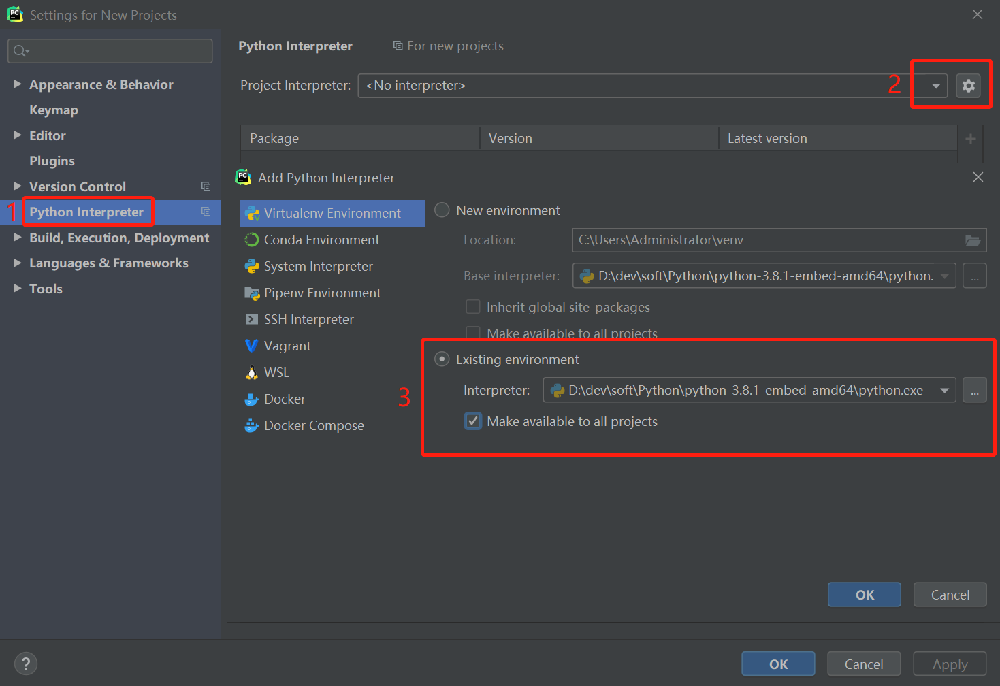

# 1 下载

## 1.1 Python

web-based installer是需要通过联网完成安装；

executable installer是可执行文件(*.exe)方式安装；

embeddable zip file 嵌入式版本，可以集成到其它应用中。

# 2 Pip

[参考资料](https://blog.csdn.net/qq_41582429/article/details/102158562)

## 2.1 镜像源

C:\Users\Administrator\pip\pip.ini

```properties
[global]
index-url = https://pypi.tuna.tsinghua.edu.cn/simple
#这边的网址可以替换成下面任意一个，替换网址记得加/simple
#http://pypi.douban.com/
#http://pypi.hustunique.com/
#http://pypi.sdutlinux.org/
#http://pypi.mirrors.ustc.edu.cn/
[install]
trusted-host=pypi.tuna.tsinghua.edu.cn
```

## 2.2 配置Pip

pip是最方便的python依赖包安装器，在python3.4开始就进行了内置，不过因为我们下载的是**嵌入式版本**，为了追求最小化，没有进行内置，需要手工安装，不过似乎这样安装的版本**缺少很多库文件**，使用起来可能还比较麻烦。

1）从 https://bootstrap.pypa.io/get-pip.py 下载get-pip.py，放到python目录下

2）重要是修改python37._pth文件，去掉 #import site 前的 #号，即放开 import site；若不放开将会pip无法正确安装。

3）安装pip，执行 python get-pip.py

python get-pip.py --trusted-host=files.pythonhosted.org --trusted-host=pypi.org

将在python目录下新建Scripts目录放置pip相关文件，以及 Lib\site-packages目录放置pip未来下载的扩展依赖模块库。

4）成功后，即可用类似 python -m pip install xxx 或直接使用 pip install xxx 的方式安装自己的依赖包（xxx替换为自己想安装的模块名）。

## 2.3 安装依赖

```properties
pip install pymysql
pip install -i https://pypi.tuna.tsinghua.edu.cn/simple -U funcat
-i: 指定库的安装源
-U:升级 原来已经安装的包，不带U不会装新版本，带上U才会更新到最新版本
```

## 2.3 卸载依赖

```properties
pig uninstall pymysql
```

# 3 PyCharm

## 3.1 环境搭建

安装过程参考idea工具的安装配置。

## 3.3 配置



