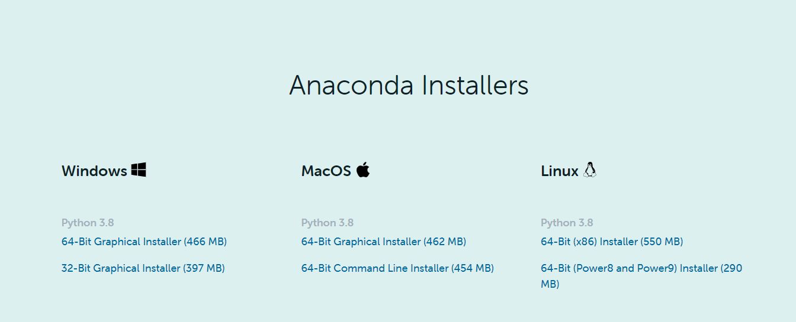
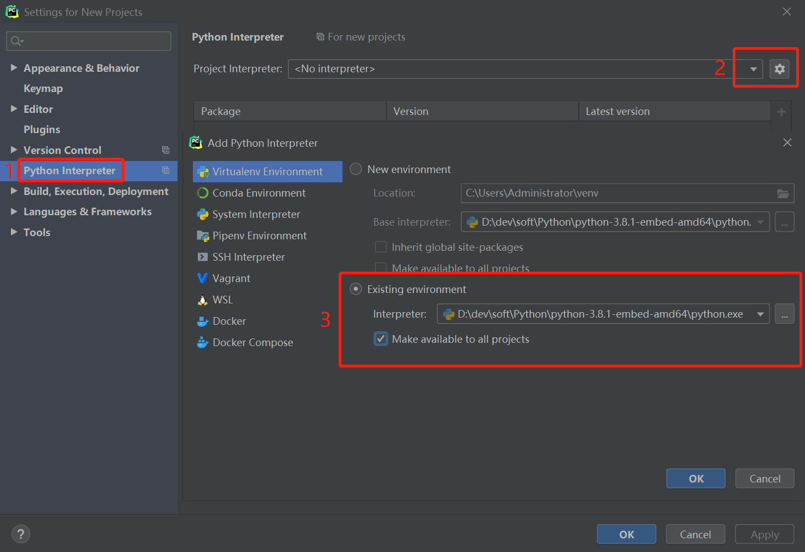
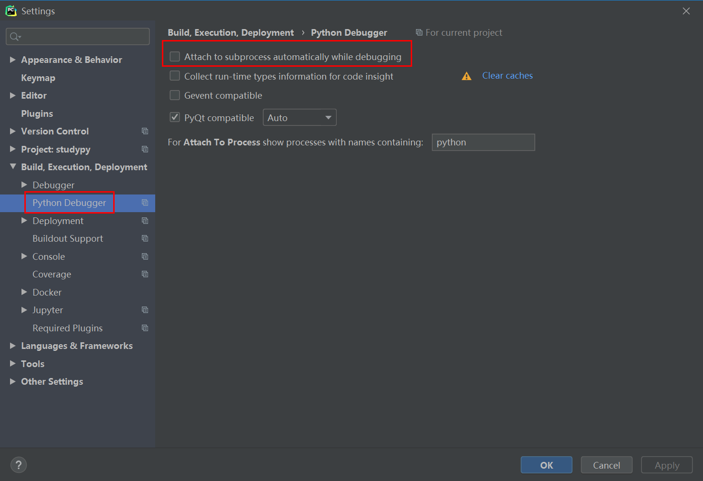
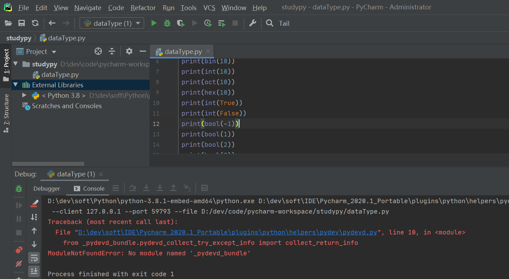

# 1 下载

## 1.1 Python

web-based installer是需要通过联网完成安装；

executable installer是可执行文件(*.exe)方式安装；

embeddable zip file 嵌入式版本，可以集成到其它应用中。

# 2 Pip

[参考资料](https://blog.csdn.net/qq_41582429/article/details/102158562)

## 2.1 镜像源

C:\Users\Administrator\pip\pip.ini

```properties
[global]
index-url = https://pypi.tuna.tsinghua.edu.cn/simple
#这边的网址可以替换成下面任意一个，替换网址记得加/simple
#http://pypi.douban.com/
#http://pypi.hustunique.com/
#http://pypi.sdutlinux.org/
#http://pypi.mirrors.ustc.edu.cn/
[install]
trusted-host=pypi.tuna.tsinghua.edu.cn
```

## 2.2 配置Pip

pip是最方便的python依赖包安装器，在python3.4开始就进行了内置，不过因为我们下载的是**嵌入式版本**，为了追求最小化，没有进行内置，需要手工安装，不过似乎这样安装的版本**缺少很多库文件**，使用起来可能还比较麻烦。

1、从 https://bootstrap.pypa.io/get-pip.py 下载get-pip.py，放到python目录下

2、重要是修改python37._pth文件，去掉 #import site 前的 #号，即放开 import site；若不放开将会pip无法正确安装。

3、安装pip，执行python get-pip.py

python get-pip.py --trusted-host=files.pythonhosted.org --trusted-host=pypi.org

将在python目录下新建Scripts目录放置pip相关文件，以及 Lib\site-packages目录放置pip未来下载的扩展依赖模块库。

4、成功后，即可用类似 python -m pip install xxx 或直接使用 pip install xxx 的方式安装自己的依赖包（xxx替换为自己想安装的模块名）。

## 2.3 安装依赖

```properties
pip install pymysql
pip install pymysql==version
pip install -i https://pypi.tuna.tsinghua.edu.cn/simple -U funcat
-i: 指定库的安装源
-U:升级 原来已经安装的包，不带U不会装新版本，带上U才会更新到最新版本
```

## 2.3 卸载依赖

```properties
pip uninstall pymysql
pip list
pip freeze
pip install django==2.1.7
```

# 3 Anaconda

Anaconda指的是一个开源的[Python](https://baike.baidu.com/item/Python)发行版本，其包含了conda、Python等180多个

及其依赖项。 因为包含了大量的科学包，Anaconda 的下载文件比较大（约 531 MB），如果只需要某些包，或者需要节省带宽或存储空间，也可以使用**Miniconda**这个较小的发行版（仅包含conda和 Python）。

Anaconda是一个开源的包、环境管理器，可以用于在同一个机器上安装不同版本的软件包及其依赖，并能够在不同的环境之间切换。Anaconda包括Conda、[Python](https://baike.baidu.com/item/Python/407313)以及一大堆安装好的工具包，比如：[numpy](https://baike.baidu.com/item/numpy/5678437)、[pandas](https://baike.baidu.com/item/pandas/17209606)等；Miniconda包括Conda、Python。

## 3.1 安装配置

[官网下载](https://www.anaconda.com/products/individual)，在该页面选择你电脑所对应的系统（Windows、macOS or Linux）以及操作系统位数（64位 or 32位）。至于是Python的版本是3.6还是2.7，这里推荐你使用Python 3.6 version，因为Python2终究会停止维护。以Windows及64位系统为例，下载Python 3.6 version的选择界面如图1所示(红线框内）。



# 4 PyCharm

## 4.1 环境搭建

安装过程参考idea工具的安装配置。

## 4.2 配置






# 5 入坑

## 5.1 绿色包



python的安装包有问题。重新下载了.exe执行文件安装包，Add Python to PATH 也勾选上。安装完成后，切换一下pycharm的python解析器，debugger模式跑一下没有问题。对比一下两种方式安装的安装目录，发现压缩文件解压安装的少了很多东西。应该是压缩包阉割了一些东西。记录一下！！！