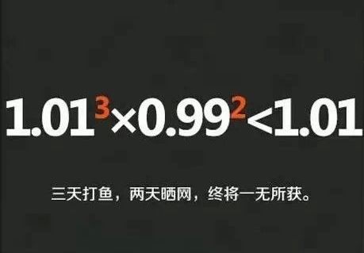

# 1 掌握技术？

## 1.1 α级

> 达到这一级的标准是：**知道**这项技术能干什么——这样就可以知道某件工作或某个模块可以使用什么技术来实现。一提到某个技术或者某个需求，脑海里面马上能够想到这些技术，快速拼出一个功能所需，即可。
>
> 例如：各种前端的东西，我只需要知道这个插件可以实现什么样的功能，知道jQuery选择器能够选择到什么样的程度，具体怎么用？到时候直接查API。所以这里需要一个总结性的文档，总结出之后，以便快速的查询。

## 1.2 β级

> 达到这一级的标准是：**能**用这项技术来开发——“能”就比“知道”难了不知道多少。没有API的帮助下，可以使用这项技术来完成90%的工作，我不是什么记忆超人，剩下的10%就只能继续查询了。对于这项技术的各种问题点都熟知，一旦产生什么bug不用跑去找度娘。这应该是人们通常意义下的掌握。
>
> 基础框架的各种功能，配置文件，一些常用的功能模块，例如导出个excel，做个验证码等等。这一级别我认为总结的主要是bug，尽量缩短解决bug和进行配置的时间。

## 1.3 Γ级

> 达到这一级的标准是：源代码精通，可以“肆意”修改——“肆意”而不是“随意”。在众多技术中，我认为一个人只要对一门主流技术达到这个级别，那就可以称为小神了。不要贪多，精通为佳。可是现在技术的发展速度太快了，当你还没精通它时，说不定它已经过时了。

## 1.4 Ω级

> 作为技术开发者的最终能力，你需要融会贯通，将各种技术（哪怕是你掌握的一堆α和β级别的）以兼顾功能和性能的双重标准融合在一起，终结这个业务。这才是真正大神们的领域。

# 2 思维方式？

## 2.1 习惯

1. 方法，自律，导师，努力，天赋、重复
2. 知其然，而知其所以然！
3. 吾生也有涯，而知也无涯 。以有涯随无涯，殆已！
4. 说话\单词\阅读\面试\技术\生活

## 2.2 深度

> 这个「技术 / 产品」的本质是什么？都能做什么？运作原理是什么？底层是如何实现的？可以做怎样的改进？不管你在做什么工作，都应该*先把自己每天都要用的核心技术做到一定深度，再去拓展广度。*「什么都知道一点，但都不甚了解」是最可怕的，它会让你误以为自己已经很NB了。

## 2.3 广度

> 整个使用链条由哪些环节构成？每个环节的作用是什么？都有哪些类似的可替代方案？它们之间有什么区别？各自优劣点是什么？……但是追求广度的时候，不要忘记自己的首要任务**目的**是什么！

## 2.4 系统化

> 一定要有自己的知识架构！系统，系统，系统！！！

1、大处着眼，小处着手，先学脉络，后学细节！

2、形象思维、逆向思维、反证法、递归法、归纳法！

3、透过问题看本质！

## 2.5 0-1 No 1-2

## 2.6 一专多能

专：后台Java开发

能：前端、设计、产品、市场

# 3 费曼解题？

# 4 技术学习？

官网&源码才是王道。

多看、多思、多总结。弄清原理，高效开发才有了保障！

第一遍快速的看完所有视频，不求甚解。

第二遍仔细的观看视频，同时结合官方文档，力求掌握每一个知识点，学会使用官方文档

第三遇到问题，多思考，善用搜索引擎，拒绝做伸手党。

第四内外兼修

第五自问自答

第六技术+管理（自己的时间管理）+沟通

http://www.aigei.com/

1）多看；2）多总结；3）多表达。

1、技术深度

技术深度是指这项技术的根基是否扎实，护城河是否够宽够深，是否很容易被其他技术所替代。通俗的来说就是这项技术是否解决了其他技术所不能解决的有重要价值的问题。这里有两个要点：1、这个问题没有人能解，是这项技术首先解决了这个问题。2、解决这个问题能够带来重大价值。

2、生态广度

一项技术只有技术深度是不够的，因为一项技术只能专注于做好一件事情，如果要解决实际生活中的复杂问题，必定要和其他技术整合联动，这就要求这项技术具有足够宽的生态广度。生态的广度有 2 个纬度可以衡量：1、上下游生态。上下游生态指从数据流的角度来说的数据上下游。2、垂直领域生态。垂直领域生态是指某个细分领域或者应用场景的整合。

3、进化能力

一项技术如果技术深度和生态广度都没有问题，那么至少说明这项技术在当下是值得学习的。但是投资一项技术还需要从时间这个纬度上考量。你肯定不希望自己学习的技术很快就被淘汰，每年都要去学习一项新技术。所以一项值得投资学习的技术必定需要具有持久的进化能力。

第一：了解技术的背景、解决的问题、为什么可以流行起来

第二：该技术可以解决自己的什么问题

第三：官网、视频等优质资料

第四：Getting started、Quick started

第五：开始使用，增进了解、随时深入

第六：系统化学习，输出技术博客

回顾、总结、思考、**体系**

