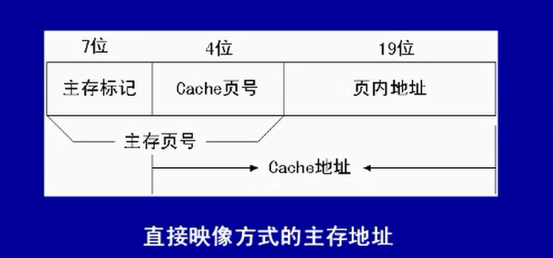

# 1 目标

考点分析

高速缓冲存储器（cache）

流水线

数制

内存编址方法

计算机的分类

并行计算问题

# 2 考点分析

# 3 高速缓冲存储器

## 3.1 多级存储器体系

计算机采用**多级存储器**体系，包括寄存器、Cache、主存储器、磁盘存储器、光盘存储器、磁带存储器。

存储器中数据常用的存储方式有**顺序存取**、**直接存取**、**随机存取**和**相连**存取等四种。

存储器系统的性能主要由**存取时间**、**存储器带宽**、**存储器周期**和**数据传输率**等来衡量。

## 3.2 Cache的概念

1、Cache的功能：提高CPU数据输入输出的**速率**，突破所谓的冯诺依曼瓶颈，即CPU与存储系统间数据传送带宽限制。

2、在计算机的存储系统体系中，cache是访问**速度最快**的层次。

3、使用cache改善系统性能的依据是程序的**局部性原理**（时间局部性、空间局部性）。

4、**命中率**及相关问题，如果以h代表对cache的访问命中率，t1代表cache的周期时间，t2代表主存储器周期时间，以读操作为例，使用cache+主存储器的系统的**平均存储周期**为t3，则：t3 = h x t1 + (1-h) x t2，其中(1-h)又称为失效率(未命中率)。

5、**淘汰算法**，先进先出算法：当需要替换时，总是淘汰最先调入cache的内容。

6、**近期最少使用算法**(LRU)：当需要替换时，将在最近一段时间内使用最少的页面内容替换掉。

7、Cache的读写过程：**写直达**，当要写cache时，数据同时写回主存储器，有时也称为写通；**写回**，cup修改cache的某一行后，相应的数据并不立即写入到主存储器单元。而是当该行被从cache中淘汰时，才把数据写回到主存储器中；**标记法**，对cache中的每一个数据设置一个有效位。

8、**地址映像**：常见的映像方法有**直接映像**、**相联映像**和**组相联映像**。地址映像是将主存储与cache的存储空间划分为若干大小相同的页(或称为块)。例如：某机器的**主存容量**为1GB，划分为2028页，每页512KB；**cache容量**为8MB，划分为16页、每页512KB。

9、直接映像

10、全相连映像

